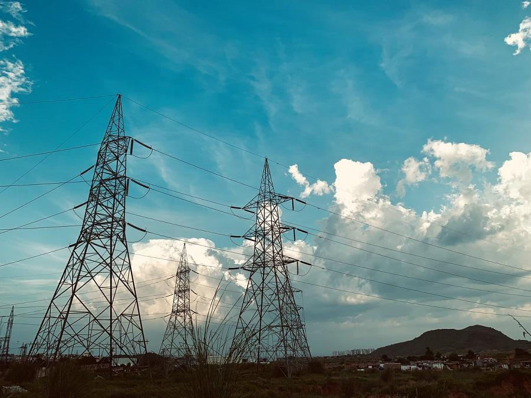

<!--
CO_OP_TRANSLATOR_METADATA:
{
  "original_hash": "61342603bad8acadbc6b2e4e3aab3f66",
  "translation_date": "2025-09-03T16:45:43+00:00",
  "source_file": "7-TimeSeries/README.md",
  "language_code": "lt"
}
-->
# Įvadas į laiko eilučių prognozavimą

Kas yra laiko eilučių prognozavimas? Tai ateities įvykių numatymas analizuojant praeities tendencijas.

## Regioninė tema: pasaulinis elektros energijos naudojimas ✨

Šiose dviejose pamokose susipažinsite su laiko eilučių prognozavimu – mažiau žinoma mašininio mokymosi sritimi, kuri vis dėlto yra itin vertinga pramonės ir verslo taikymams bei kitoms sritims. Nors neuroniniai tinklai gali būti naudojami šių modelių naudingumui didinti, mes nagrinėsime juos klasikinio mašininio mokymosi kontekste, kaip modelius, padedančius numatyti būsimą veiklą remiantis praeities duomenimis.

Mūsų regioninis dėmesys skiriamas pasauliniam elektros energijos naudojimui – įdomiam duomenų rinkiniui, kuris padeda išmokti prognozuoti būsimą energijos poreikį remiantis praeities apkrovos modeliais. Galite pamatyti, kaip tokio tipo prognozavimas gali būti itin naudingas verslo aplinkoje.

Nuotrauka [Peddi Sai hrithik](https://unsplash.com/@shutter_log?utm_source=unsplash&utm_medium=referral&utm_content=creditCopyText) elektros bokštų kelyje Radžastane, [Unsplash](https://unsplash.com/s/photos/electric-india?utm_source=unsplash&utm_medium=referral&utm_content=creditCopyText)

## Pamokos

1. [Įvadas į laiko eilučių prognozavimą](1-Introduction/README.md)
2. [ARIMA laiko eilučių modelių kūrimas](2-ARIMA/README.md)
3. [Laiko eilučių prognozavimas naudojant atraminių vektorių regresorių](3-SVR/README.md)

## Kreditas

"Įvadas į laiko eilučių prognozavimą" buvo parašytas su ⚡️ [Francesca Lazzeri](https://twitter.com/frlazzeri) ir [Jen Looper](https://twitter.com/jenlooper). Užrašai pirmą kartą pasirodė internete [Azure "Deep Learning For Time Series" repo](https://github.com/Azure/DeepLearningForTimeSeriesForecasting), kurį iš pradžių parašė Francesca Lazzeri. SVR pamoką parašė [Anirban Mukherjee](https://github.com/AnirbanMukherjeeXD).

---

**Atsakomybės apribojimas**:  
Šis dokumentas buvo išverstas naudojant AI vertimo paslaugą [Co-op Translator](https://github.com/Azure/co-op-translator). Nors siekiame tikslumo, prašome atkreipti dėmesį, kad automatiniai vertimai gali turėti klaidų ar netikslumų. Originalus dokumentas jo gimtąja kalba turėtų būti laikomas autoritetingu šaltiniu. Kritinei informacijai rekomenduojama naudoti profesionalų žmogaus vertimą. Mes neprisiimame atsakomybės už nesusipratimus ar klaidingus interpretavimus, atsiradusius dėl šio vertimo naudojimo.