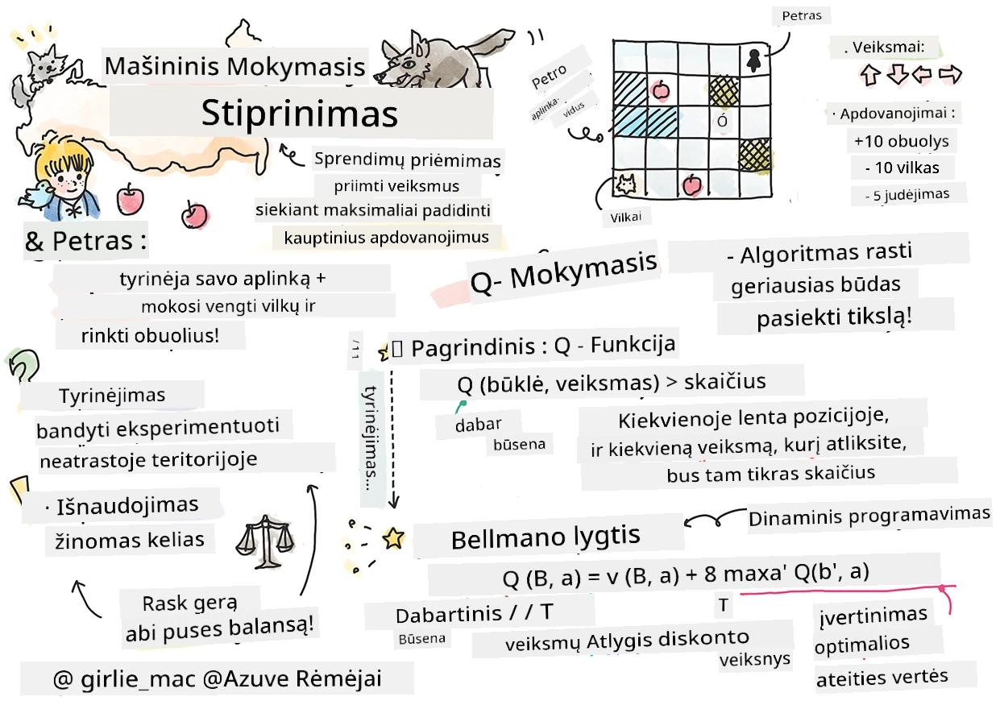

# Įvadas į stiprinamąjį mokymąsi ir Q-mokymąsi


> Sketchnote autorius [Tomomi Imura](https://www.twitter.com/girlie_mac)

Stiprinamasis mokymasis apima tris svarbias sąvokas: agentą, kai kurias būsenas ir kiekvienai būsenai priskirtą veiksmų rinkinį. Vykdydamas veiksmą tam tikroje būsenoje, agentas gauna apdovanojimą. Vėl įsivaizduokite kompiuterinį žaidimą Super Mario. Jūs esate Mario, esate žaidimo lygyje prie skardžio krašto. Virš jūsų yra moneta. Jūs, būdamas Mario, žaidimo lygyje tam tikroje vietoje ... tai yra jūsų būsena. Padaryti žingsnį į dešinę (veiksmas) reiškia, kad nukrisite nuo skardžio ir gausite mažą skaičių kaip rezultatą. Tačiau paspaudus šokinėjimo mygtuką, jūs pelnysite tašką ir liksite gyvas. Tai yra teigiamas rezultatas, už kurį turėtumėte gauti teigiamą skaitinį įvertinimą.

Naudodami stiprinamąjį mokymąsi ir simuliatorių (žaidimą), galite išmokti žaisti žaidimą taip, kad maksimalizuotumėte apdovanojimą - išlikimą ir taškų skaičių.

[](https://www.youtube.com/watch?v=lDq_en8RNOo)

> 🎥 Spustelėkite paveikslėlį aukščiau, norėdami išgirsti Dmitrijų apie stiprinamąjį mokymąsi

## [Priešpaskaitos testas](https://ff-quizzes.netlify.app/en/ml/)

## Reikalingos žinios ir nustatymai

Šiame pamokoje eksperimentuosime su kai kuriu Python kodu. Jūs turėtumėte sugebėti paleisti Jupyter Notebook kodą iš šios pamokos savo kompiuteryje arba debesyje.

Galite atidaryti [pamokos užrašų knygelę](https://github.com/microsoft/ML-For-Beginners/blob/main/8-Reinforcement/1-QLearning/notebook.ipynb) ir pereiti šią pamoką, kad sukurtumėte projektą.

> **Pastaba:** Jei atidarote šį kodą iš debesies, taip pat turite atsisiųsti [`rlboard.py`](https://github.com/microsoft/ML-For-Beginners/blob/main/8-Reinforcement/1-QLearning/rlboard.py) failą, kuris naudojamas užrašų knygelės kode. Įdėkite jį į tą patį katalogą kaip užrašų knygelę.

## Įvadas

Šioje pamokoje tyrinėsime **[Petras ir vilkas](https://en.wikipedia.org/wiki/Peter_and_the_Wolf)** pasaulį, įkvėptą muzikos pasakos, kurį sukūrė rusų kompozitorius [Sergejus Prokofjevas](https://en.wikipedia.org/wiki/Sergei_Prokofiev). Naudosime **stiprinamąjį mokymąsi**, kad Petras tyrinėtų savo aplinką, rinktų skanius obuolius ir vengė susitikti su vilku.

**Stiprinamasis mokymasis** (RL) yra mokymosi metodas, leidžiantis išmokti optimalią elgseną **agento** tam tikroje **aplinkoje** vykdant daugybę eksperimentų. Agentas šioje aplinkoje turi turėti tam tikrą **tikslą**, apibrėžtą **apdovanojimo funkcija**.

## Aplinka

Paprastumui, Petras pasaulį laikysime kvadratine lenta, kurios dydis yra `width` x `height`, kaip parodyta žemiau:


Kiekviena lentoje esanti ląstelė gali būti vienas iš šių dalykų:

* **žemė**, ant kurios gali vaikščioti Petras ir kitos būtybės.
* **vanduo**, ant kurio žinoma negalima vaikščioti.
* **medis** arba **žolė**, vieta, kur gali pailsėti.
* **obuolys**, kuris reiškia tai, ko Petras džiaugtųsi radęs ir galėtų pavalgyti.
* **vilkas**, kuris yra pavojingas ir kurio reikėtų vengti.

Yra atskiras Python modulis, [`rlboard.py`](https://github.com/microsoft/ML-For-Beginners/blob/main/8-Reinforcement/1-QLearning/rlboard.py), kuris turi kodą darbui su šia aplinka. Kadangi šis kodas nėra svarbus mūsų koncepcijų supratimui, importuosime modulį ir naudosime jį pavyzdinės lentos sukūrimui (kodo blokas 1):

```python
from rlboard import *

width, height = 8,8
m = Board(width,height)
m.randomize(seed=13)
m.plot()
```

Šis kodas turėtų atspausdinti aplinkos vaizdą panašų į aukščiau pateiktą.

## Veiksmai ir politika

Mūsų pavyzdyje Petro tikslas būtų rasti obuolį, vengiant vilko ir kitų kliūčių. Tam jis pagal paskirtį gali vaikščioti, kol suras obuolį.

Todėl bet kurioje pozicijoje jis gali pasirinkti vieną iš šių veiksmų: aukštyn, žemyn, į kairę ir į dešinę.

Apibrėšime šiuos veiksmus kaip žodyną ir susiesime juos su atitinkamais koordinatų pokyčių pora. Pavyzdžiui, judėjimas į dešinę (`R`) atitinka porą `(1,0)`. (kodo blokas 2):

```python
actions = { "U" : (0,-1), "D" : (0,1), "L" : (-1,0), "R" : (1,0) }
action_idx = { a : i for i,a in enumerate(actions.keys()) }
```

Apibendrinant, strategija ir šio scenarijaus tikslas yra tokie:

- **Strategija**, mūsų agento (Petro) yra apibrėžta taip vadinama **politika**. Politika yra funkcija, kuri bet kurioje būsenoje grąžina veiksmą. Mūsų atveju problemos būsena yra atvaizduojama lenta, įskaitant dabartinę žaidėjo poziciją.

- **Tikslas**, stiprinamojo mokymosi yra pagaliau išmokti gerą politiką, leidžiančią efektyviai spręsti problemą. Tačiau kaip pradinį tašką laikykime paprasčiausią politiką, vadinamą **atsitiktiniu ėjimu**.

## Atsitiktinis ėjimas

Pirmiausia išspręskime problemą įgyvendindami atsitiktinio ėjimo strategiją. Naudodamiesi atsitiktiniu ėjimu, mes atsitiktinai pasirinksime kitą veiksmą iš leidžiamų veiksmų, kol pasieksime obuolį (kodo blokas 3).

1. Įgyvendinkite atsitiktinį ėjimą su žemiau pateiktu kodu:

    ```python
    def random_policy(m):
        return random.choice(list(actions))
    
    def walk(m,policy,start_position=None):
        n = 0 # žingsnių skaičius
        # nustatyti pradinę poziciją
        if start_position:
            m.human = start_position 
        else:
            m.random_start()
        while True:
            if m.at() == Board.Cell.apple:
                return n # sėkmė!
            if m.at() in [Board.Cell.wolf, Board.Cell.water]:
                return -1 # suėdė vilkas arba nuskendo
            while True:
                a = actions[policy(m)]
                new_pos = m.move_pos(m.human,a)
                if m.is_valid(new_pos) and m.at(new_pos)!=Board.Cell.water:
                    m.move(a) # atlikti tikrąjį judesį
                    break
            n+=1
    
    walk(m,random_policy)
    ```

    Iškvietimas `walk` turėtų grąžinti atitinkamo kelio ilgį, kuris gali skirtis paleidžiamų kartų metu.

1. Paleiskite ėjimo eksperimentą keletą kartų (pvz., 100) ir atspausdinkite rezultatais pagrįstas statistikas (kodo blokas 4):

    ```python
    def print_statistics(policy):
        s,w,n = 0,0,0
        for _ in range(100):
            z = walk(m,policy)
            if z<0:
                w+=1
            else:
                s += z
                n += 1
        print(f"Average path length = {s/n}, eaten by wolf: {w} times")
    
    print_statistics(random_policy)
    ```

    Atkreipkite dėmesį, kad vidutinis kelio ilgis yra apie 30-40 žingsnių, kas yra gana daug, atsižvelgiant į tai, kad vidutinis atstumas iki artimiausio obuolio yra apie 5-6 žingsnius.

    Taip pat galite pamatyti, kaip atrodo Petro judesys atsitiktinio ėjimo metu:

    

## Apdovanojimo funkcija

Norėdami padaryti politiką protingesnę, turime suprasti, kurie veiksmai yra "geresni" už kitus. Tam reikia apibrėžti tikslą.

Tikslas gali būti apibrėžtas per **apdovanojimo funkciją**, kuri kiekvienai būsenai suteikia tam tikrą įvertinimą. Kuo didesnis skaičius, tuo geresnė apdovanojimo funkcija. (kodo blokas 5)

```python
move_reward = -0.1
goal_reward = 10
end_reward = -10

def reward(m,pos=None):
    pos = pos or m.human
    if not m.is_valid(pos):
        return end_reward
    x = m.at(pos)
    if x==Board.Cell.water or x == Board.Cell.wolf:
        return end_reward
    if x==Board.Cell.apple:
        return goal_reward
    return move_reward
```

Įdomu tai, kad apdovanojimo funkcijose daugeliu atvejų *žymus apdovanojimas gaunamas tik žaidimo pabaigoje*. Tai reiškia, kad mūsų algoritmas turėtų kažkaip atsiminti "gerus" žingsnius, vedančius į teigiamą apdovanojimą pabaigoje, ir padidinti jų reikšmę. Panašiai visi veiksmai, vedantys į blogus rezultatus, turėtų būti nerekomenduojami.

## Q-mokymasis

Algoritmas, kurį aptarsime, vadinamas **Q-mokymosi**. Šiame algoritme politika apibrėžiama funkcija (arba duomenų struktūra), vadinama **Q-lentele**. Ji įrašo kiekvieno veiksmo "gerumą" tam tikroje būsenoje.

Jis vadinamas Q-lentele, nes dažnai patogu ją pateikti kaip lentelę arba daugiamačio masyvo formą. Kadangi mūsų lenta turi matmenis `width` x `height`, galime reprezentuoti Q-lentelę naudodami numpy masyvą su matmenimis `width` x `height` x `len(actions)`: (kodo blokas 6)

```python
Q = np.ones((width,height,len(actions)),dtype=np.float)*1.0/len(actions)
```

Pastebėkite, kad mes inicializuojame visus Q-lentelės reikšmes vienodai, mūsų atveju - 0.25. Tai atitinka "atsitiktinio ėjimo" politiką, nes visi ėjimai kiekvienoje būsenoje yra vienodai geri. Galime perduoti Q-lentelę funkcijai `plot`, kad vizualizuotume lentelę lentoje: `m.plot(Q)`.


Kiekvienos ląstelės centre yra "rodyklė", nurodanti pageidaujamą judėjimo kryptį. Kadangi visos kryptys yra vienodos, rodoma taškas.

Dabar turime paleisti simuliaciją, tyrinėti aplinką ir išmokti geresnį Q-lentelės reikšmių pasiskirstymą, kuris leis mums greičiau rasti kelią iki obuolio.

## Q-mokymosi esmė: Belmano lygtis

Kai pradedame judėti, kiekvienas veiksmas turi atitinkamą apdovanojimą, t.y. teoriškai galime pasirinkti kitą veiksmą pagal didžiausią tiesioginį apdovanojimą. Tačiau daugelyje būsenų judesys nepasieks mūsų tikslo - rasti obuolį, ir todėl negalime iš karto nuspręsti, kuri kryptis geresnė.

> Atminkite, svarbu ne tiesioginis rezultatas, o galutinis rezultatas, kurį gausime simuliacijos pabaigoje.

Norėdami atsižvelgti į šį atidėtą apdovanojimą, turime naudoti **[dinaminio programavimo](https://en.wikipedia.org/wiki/Dynamic_programming)** principus, leidžiančius spręsti problemą rekursyviai.

Tarkime, kad dabar esame būsenoje *s* ir norime pereiti į kitą būseną *s'*. Tai atlikdami, gausime tiesioginį apdovanojimą *r(s,a)*, apibrėžtą apdovanojimo funkcijos, plius tam tikrą ateities apdovanojimą. Jei manytume, kad mūsų Q-lentelė tiksliai atspindi kiekvieno veiksmo "patrauklumą", tada būsenoje *s'* pasirinksime veiksmą *a*, atitinkantį maksimalų *Q(s',a')* vertę. Tokiu būdu geriausias galimas ateities apdovanojimas būsenoje *s* bus apibrėžtas kaip `max`<sub>a'</sub>*Q(s',a')* (maksimumas apskaičiuojamas per visus galimus veiksmus *a'* būsenoje *s'*).

Tai suteikia **Belmano formulę**, skaičiuojant Q-lentelės vertę būsenoje *s* atsižvelgiant į veiksmą *a*:


Čia γ yra vadinamasis **nuolaidos koeficientas**, nusakantis, kiek turėtumėte teikti pirmenybę dabartiniam apdovanojimui prieš ateities apdovanojimą ir atvirkščiai.

## Mokymosi algoritmas

Atsižvelgiant į aukščiau pateiktą lygtį, dabar galime parašyti pseudo kodą mūsų mokymosi algoritmui:

* Inicializuokite Q-lentelę Q vienodais skaičiais visoms būsenoms ir veiksmams
* Nustatykite mokymosi greitį α ← 1
* Kartokite simuliaciją daug kartų
   1. Pradėkite atsitiktinėje pozicijoje
   1. Kartokite
        1. Pasirinkite veiksmą *a* būsenoje *s*
        2. Įvykdykite veiksmą pereidami į naują būseną *s'*
        3. Jei susiduriame su žaidimo pabaigos sąlyga arba bendras apdovanojimas per mažas - išeikite iš simuliacijos  
        4. Apskaičiuokite apdovanojimą *r* naujoje būsenoje
        5. Atnaujinkite Q-funkciją pagal Belmano lygtį: *Q(s,a)* ← *(1-α)Q(s,a)+α(r+γ max<sub>a'</sub>Q(s',a'))*
        6. *s* ← *s'*
        7. Atnaujinkite bendrą apdovanojimą ir sumažinkite α.

## Eksploatacija prieš tyrinėjimą

Aukščiau pateiktame algoritme nenurodėme, kaip tiksliai pasirinkti veiksmą 2.1 žingsnyje. Jei pasirenkame veiksmą atsitiktinai, mes atsitiktinai **tyrinėsime** aplinką, ir greičiausiai dažnai žusime bei aplankysime sritis, į kurias paprastai neeitume. Kitaip galima būtų **eksploatuoti** jau žinomas Q-lentelės reikšmes ir pasirinkti geriausią veiksmą (su didesne Q-lentelės verte) būsenoje *s*. Tačiau tai neleis mums tyrinėti kitų būsenų ir greičiausiai neatrastume optimalaus sprendimo.

Todėl geriausias būdas yra rasti pusiausvyrą tarp tyrinėjimo ir eksploatacijos. Tai galima padaryti pasirinkus veiksmą būsenoje *s* pagal tikimybę, proporcingą reikšmėms Q-lentelėje. Pradžioje, kai Q-lentelės reikšmės visos vienodos, tai bus atsitiktinis pasirinkimas, tačiau mokantis daugiau apie aplinką, tikimybė sekti optimaliu maršrutu padidės, leidžiant agentui kartais rinktis netyrinėtą kelią.

## Python įgyvendinimas

Dabar esame pasirengę įgyvendinti mokymosi algoritmą. Prieš tai mums reikės funkcijos, kuri pavers atsitiktinius skaičius Q-lentelėje į tikimybių vektorių atitinkamiems veiksmams.

1. Sukurkite funkciją `probs()`:

    ```python
    def probs(v,eps=1e-4):
        v = v-v.min()+eps
        v = v/v.sum()
        return v
    ```

    Pridėjome kelis `eps` prie pradinio vektoriaus siekiant išvengti dalybos iš 0 pradžioje, kai visi komponentai yra vienodi.

Paleiskite mokymo algoritmą per 5000 bandymų, vadinamų **epochomis**: (kodo blokas 8)
```python
    for epoch in range(5000):
    
        # Pasirinkite pradinį tašką
        m.random_start()
        
        # Pradėkite kelionę
        n=0
        cum_reward = 0
        while True:
            x,y = m.human
            v = probs(Q[x,y])
            a = random.choices(list(actions),weights=v)[0]
            dpos = actions[a]
            m.move(dpos,check_correctness=False) # leidžiame žaidėjui judėti už lentos ribų, kas baigia epizodą
            r = reward(m)
            cum_reward += r
            if r==end_reward or cum_reward < -1000:
                lpath.append(n)
                break
            alpha = np.exp(-n / 10e5)
            gamma = 0.5
            ai = action_idx[a]
            Q[x,y,ai] = (1 - alpha) * Q[x,y,ai] + alpha * (r + gamma * Q[x+dpos[0], y+dpos[1]].max())
            n+=1
```

Po šio algoritmo įvykdymo Q-lentelė turėtų būti atnaujinta reikšmėmis, apibrėžiančiomis skirtingų veiksmų patrauklumą kiekviename žingsnyje. Galime bandyti vizualizuoti Q-lentelę nubrėždami vektorių kiekvienoje ląstelėje, kuris rodys pageidaujamą judėjimo kryptį. Paprastumui vietoj rodyklės galvos nubrėžiame mažą apskritimą.


## Politikos tikrinimas

Kadangi Q-lentelė pateikia kiekvieno veiksmo "patrauklumą" kiekvienoje būsenoje, gana paprasta ja naudotis efektyviai navigacijai mūsų pasaulyje. Paprasčiausiu atveju galime pasirinkti veiksmą, atitinkantį didžiausią Q-lentelės reikšmę: (kodo blokas 9)

```python
def qpolicy_strict(m):
        x,y = m.human
        v = probs(Q[x,y])
        a = list(actions)[np.argmax(v)]
        return a

walk(m,qpolicy_strict)
```


> Jei aukščiau pateiktą kodą bandysite kelis kartus, galite pastebėti, kad kartais jis „užstringa“ ir jums tenka paspausti STABDYMO mygtuką užrašuose, kad jį nutrauktumėte. Taip nutinka todėl, kad gali būti situacijų, kai dvi būsenos „rodo“ viena į kitą pagal optimalų Q-reikšmę, ir tokiu atveju agentas be galo judės tarp tų būsenų.

## 🚀Iššūkis

> **Užduotis 1:** Patobulinkite funkciją `walk`, kad apribotumėte maksimalią kelio ilgį tam tikru žingsnių skaičiumi (pavyzdžiui, 100), ir stebėkite, kaip aukščiau pateiktas kodas kartais grąžins šią reikšmę.

> **Užduotis 2:** Patobulinkite funkciją `walk`, kad ji negrįžtų į vietas, kuriose jau yra buvusi anksčiau. Tai apsaugos nuo ciklų `walk` funkcijoje, tačiau agentas vis tiek gali patekti į „įkalinimą“ vietoje, iš kurios negalės pabėgti.

## Navigacija

Geresnė navigacijos politika būtų ta, kurią naudojome mokymosi metu, apjungianti išnaudojimą ir tyrinėjimą. Šioje politikoje mes kiekvieną veiksmą renkamės tikimybiškai, proporcingai vertėms Q-lentelėje. Ši strategija vis tiek gali sukelti, kad agentas sugrįš į jau ištirtą poziciją, bet, kaip matote žemiau pateiktame kode, ji leidžia pasiekti labai trumpą vidutinį kelią iki norimos vietos (atminkite, kad `print_statistics` paleidžia simuliaciją 100 kartų): (kodo bloko 10)

```python
def qpolicy(m):
        x,y = m.human
        v = probs(Q[x,y])
        a = random.choices(list(actions),weights=v)[0]
        return a

print_statistics(qpolicy)
```

Paleidus šį kodą, turėtumėte gauti daug mažesnį vidutinį kelio ilgį nei anksčiau, maždaug 3–6 intervale.

## Mokymosi proceso tyrinėjimas

Kaip jau minėjome, mokymosi procesas yra pusiausvyra tarp tyrinėjimo ir įgytos žinios panaudojimo apie problemos erdvės struktūrą. Matėme, kad mokymosi rezultatai (gebėjimas padėti agentui rasti trumpą kelią iki tikslo) pagerėjo, tačiau įdomu stebėti, kaip vidutinis kelio ilgis elgiasi mokymosi proceso metu:


Mokymai gali būti apibendrinti taip:

- **Vidutinis kelio ilgis didėja**. Matome, kad pradžioje vidutinis kelio ilgis didėja. Tai tikriausiai todėl, kad kai apie aplinką nieko nežinome, tikėtina, kad pateksime į blogas būsenas, pvz., vandenį ar vilką. Mokantis daugiau ir pradėjus naudoti šias žinias, galime ilgiau tyrinėti aplinką, tačiau vis dar nepakankamai gerai žinome, kur yra obuoliai.

- **Kelio ilgis mažėja, mokantis daugiau**. Kai pakankamai išmokstame, agentui lengviau pasiekti tikslą, ir kelio ilgis pradeda mažėti. Vis dėlto, mes vis dar atviri tyrinėjimui, tad dažnai nukrypstame nuo geriausio kelio ir ieškome naujų variantų, dėl ko kelias tampa ilgesnis nei optimalus.

- **Ilgis staigiai padidėja**. Šiame grafike taip pat matome, kad tam tikru momentu ilgis staigiai padidėjo. Tai rodo proceso stokastinę prigimtį ir tai, kad tam tikru momentu galime „sugadinti“ Q-lentelės koeficientus perrašydami juos naujomis reikšmėmis. Tai idealiai turėtų būti sumažinta mažinant mokymosi greitį (pavyzdžiui, mokymosi pabaigoje mes koreguojame Q-lentelės reikšmes tik nedideliu dydžiu).

Apskritai svarbu prisiminti, kad sėkmė ir mokymosi proceso kokybė labai priklauso nuo parametrų, tokių kaip mokymosi greitis, jo mažėjimas ir nuolaidos koeficientas. Jie dažnai vadinami **hiperparametrais**, kad būtų atskirti nuo **parametrų**, kuriuos optimizuojame mokymosi metu (pvz., Q-lentelės koeficientai). Geriausių hiperparametrų reikšmių paieškos procesas vadinamas **hiperparametrų optimizavimu** ir nusipelno atskiros temos.

## [Po paskaitos testas](https://ff-quizzes.netlify.app/en/ml/)

## Užduotis
[Realiau pasaulyje](assignment.md)

---

<!-- CO-OP TRANSLATOR DISCLAIMER START -->
**Atsakomybės apribojimas**:
Šis dokumentas buvo išverstas naudojant dirbtinio intelekto vertimo paslaugą [Co-op Translator](https://github.com/Azure/co-op-translator). Nors siekiame tikslumo, prašome atkreipti dėmesį, kad automatiniai vertimai gali turėti klaidų ar netikslumų. Originalus dokumentas jo gimtąja kalba laikomas autoritetingu šaltiniu. Svarbiai informacijai rekomenduojama naudoti profesionalų žmogiškąjį vertimą. Mes neatsakome už jokius nesusipratimus ar neteisingą interpretaciją, kilusią naudojantis šiuo vertimu.
<!-- CO-OP TRANSLATOR DISCLAIMER END -->