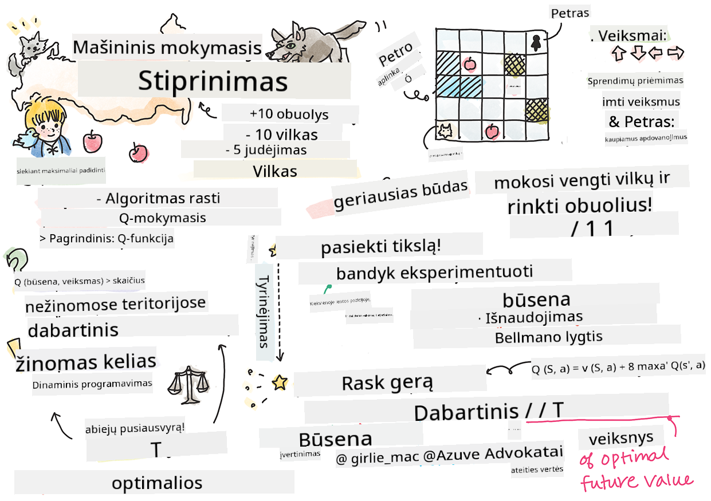
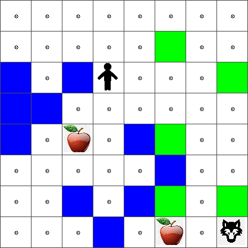

<!--
CO_OP_TRANSLATOR_METADATA:
{
  "original_hash": "0ffe994d1cc881bdeb49226a064116e5",
  "translation_date": "2025-09-03T18:28:39+00:00",
  "source_file": "8-Reinforcement/1-QLearning/README.md",
  "language_code": "lt"
}
-->
# Įvadas į stiprinamąjį mokymą ir Q-mokymą


> Sketchnote sukūrė [Tomomi Imura](https://www.twitter.com/girlie_mac)

Stiprinamasis mokymasis apima tris svarbias sąvokas: agentą, tam tikras būsenas ir veiksmų rinkinį kiekvienai būsenai. Atlikdamas veiksmą tam tikroje būsenoje, agentas gauna atlygį. Įsivaizduokite kompiuterinį žaidimą „Super Mario“. Jūs esate Mario, esate žaidimo lygyje, stovite šalia uolos krašto. Virš jūsų yra moneta. Jūs, būdamas Mario, tam tikroje žaidimo lygio pozicijoje... tai yra jūsų būsena. Žingsnis į dešinę (veiksmas) nuvestų jus per kraštą, ir tai suteiktų mažą skaitinį rezultatą. Tačiau paspaudus šuolio mygtuką, jūs pelnytumėte tašką ir liktumėte gyvas. Tai yra teigiamas rezultatas, kuris turėtų suteikti teigiamą skaitinį rezultatą.

Naudodami stiprinamąjį mokymą ir simuliatorių (žaidimą), galite išmokti žaisti žaidimą taip, kad maksimaliai padidintumėte atlygį, t. y. išliktumėte gyvas ir surinktumėte kuo daugiau taškų.

[](https://www.youtube.com/watch?v=lDq_en8RNOo)

> 🎥 Spustelėkite aukščiau esančią nuotrauką, kad išgirstumėte Dmitrijų kalbant apie stiprinamąjį mokymą

## [Prieš paskaitos testas](https://gray-sand-07a10f403.1.azurestaticapps.net/quiz/45/)

## Reikalavimai ir paruošimas

Šioje pamokoje eksperimentuosime su Python kodu. Turėtumėte sugebėti paleisti Jupyter Notebook kodą iš šios pamokos, arba savo kompiuteryje, arba debesyje.

Galite atidaryti [pamokos užrašų knygelę](https://github.com/microsoft/ML-For-Beginners/blob/main/8-Reinforcement/1-QLearning/notebook.ipynb) ir pereiti per šią pamoką, kad ją sukurtumėte.

> **Pastaba:** Jei atidarote šį kodą iš debesies, taip pat turite gauti [`rlboard.py`](https://github.com/microsoft/ML-For-Beginners/blob/main/8-Reinforcement/1-QLearning/rlboard.py) failą, kuris naudojamas užrašų knygelės kode. Įdėkite jį į tą pačią direktoriją kaip ir užrašų knygelę.

## Įvadas

Šioje pamokoje tyrinėsime **[Petro ir vilko](https://en.wikipedia.org/wiki/Peter_and_the_Wolf)** pasaulį, įkvėptą muzikinės pasakos, kurią sukūrė rusų kompozitorius [Sergejus Prokofjevas](https://en.wikipedia.org/wiki/Sergei_Prokofiev). Naudosime **stiprinamąjį mokymą**, kad Petras galėtų tyrinėti savo aplinką, rinkti skanius obuolius ir vengti susitikimo su vilku.

**Stiprinamasis mokymasis** (RL) yra mokymosi technika, leidžianti mums išmokti optimalų **agento** elgesį tam tikroje **aplinkoje**, vykdant daugybę eksperimentų. Agentas šioje aplinkoje turėtų turėti tam tikrą **tikslą**, apibrėžtą **atlygio funkcija**.

## Aplinka

Paprasčiausiai, įsivaizduokime Petro pasaulį kaip kvadratinę lentą, kurios dydis yra `plotis` x `aukštis`, kaip ši:


Kiekviena langelio lentelėje gali būti:

* **žemė**, ant kurios Petras ir kiti padarai gali vaikščioti.
* **vanduo**, ant kurio, akivaizdu, negalima vaikščioti.
* **medis** arba **žolė**, vieta, kur galima pailsėti.
* **obuolys**, kuris reiškia kažką, ką Petras norėtų rasti, kad pasimaitintų.
* **vilkas**, kuris yra pavojingas ir kurio reikėtų vengti.

Yra atskiras Python modulis, [`rlboard.py`](https://github.com/microsoft/ML-For-Beginners/blob/main/8-Reinforcement/1-QLearning/rlboard.py), kuriame yra kodas, skirtas dirbti su šia aplinka. Kadangi šis kodas nėra svarbus mūsų koncepcijoms suprasti, mes importuosime modulį ir naudosime jį, kad sukurtume pavyzdinę lentą (kodo blokas 1):

```python
from rlboard import *

width, height = 8,8
m = Board(width,height)
m.randomize(seed=13)
m.plot()
```

Šis kodas turėtų atspausdinti aplinkos vaizdą, panašų į aukščiau pateiktą.

## Veiksmai ir politika

Mūsų pavyzdyje Petro tikslas būtų rasti obuolį, vengiant vilko ir kitų kliūčių. Tam jis iš esmės gali vaikščioti aplinkui, kol suras obuolį.

Todėl bet kurioje pozicijoje jis gali pasirinkti vieną iš šių veiksmų: aukštyn, žemyn, kairėn ir dešinėn.

Mes apibrėšime tuos veiksmus kaip žodyną ir susiesime juos su atitinkamais koordinačių pokyčių poromis. Pavyzdžiui, judėjimas dešinėn (`R`) atitiktų porą `(1,0)`. (kodo blokas 2):

```python
actions = { "U" : (0,-1), "D" : (0,1), "L" : (-1,0), "R" : (1,0) }
action_idx = { a : i for i,a in enumerate(actions.keys()) }
```

Apibendrinant, šio scenarijaus strategija ir tikslas yra tokie:

- **Strategija**, mūsų agento (Petro) yra apibrėžta vadinamąja **politika**. Politika yra funkcija, kuri grąžina veiksmą bet kurioje būsenoje. Mūsų atveju problemos būsena yra lentelė, įskaitant žaidėjo dabartinę poziciją.

- **Tikslas**, stiprinamojo mokymosi yra galiausiai išmokti gerą politiką, kuri leis efektyviai išspręsti problemą. Tačiau kaip pagrindą, apsvarstykime paprasčiausią politiką, vadinamą **atsitiktiniu vaikščiojimu**.

## Atsitiktinis vaikščiojimas

Pirmiausia išspręskime mūsų problemą įgyvendindami atsitiktinio vaikščiojimo strategiją. Atsitiktinio vaikščiojimo metu mes atsitiktinai pasirinksime kitą veiksmą iš leidžiamų veiksmų, kol pasieksime obuolį (kodo blokas 3).

1. Įgyvendinkite atsitiktinį vaikščiojimą naudodami žemiau pateiktą kodą:

    ```python
    def random_policy(m):
        return random.choice(list(actions))
    
    def walk(m,policy,start_position=None):
        n = 0 # number of steps
        # set initial position
        if start_position:
            m.human = start_position 
        else:
            m.random_start()
        while True:
            if m.at() == Board.Cell.apple:
                return n # success!
            if m.at() in [Board.Cell.wolf, Board.Cell.water]:
                return -1 # eaten by wolf or drowned
            while True:
                a = actions[policy(m)]
                new_pos = m.move_pos(m.human,a)
                if m.is_valid(new_pos) and m.at(new_pos)!=Board.Cell.water:
                    m.move(a) # do the actual move
                    break
            n+=1
    
    walk(m,random_policy)
    ```

    Funkcijos `walk` iškvietimas turėtų grąžinti atitinkamo kelio ilgį, kuris gali skirtis nuo vieno paleidimo iki kito.

1. Paleiskite vaikščiojimo eksperimentą kelis kartus (pvz., 100) ir atspausdinkite gautą statistiką (kodo blokas 4):

    ```python
    def print_statistics(policy):
        s,w,n = 0,0,0
        for _ in range(100):
            z = walk(m,policy)
            if z<0:
                w+=1
            else:
                s += z
                n += 1
        print(f"Average path length = {s/n}, eaten by wolf: {w} times")
    
    print_statistics(random_policy)
    ```

    Atkreipkite dėmesį, kad vidutinis kelio ilgis yra apie 30–40 žingsnių, o tai yra gana daug, atsižvelgiant į tai, kad vidutinis atstumas iki artimiausio obuolio yra apie 5–6 žingsnius.

    Taip pat galite pamatyti, kaip atrodo Petro judėjimas atsitiktinio vaikščiojimo metu:

    

## Atlygio funkcija

Kad mūsų politika būtų protingesnė, turime suprasti, kurie judesiai yra „geresni“ už kitus. Tam reikia apibrėžti mūsų tikslą.

Tikslas gali būti apibrėžtas **atlygio funkcijos** forma, kuri grąžins tam tikrą balo reikšmę kiekvienai būsenai. Kuo didesnis skaičius, tuo geresnė atlygio funkcija. (kodo blokas 5)

```python
move_reward = -0.1
goal_reward = 10
end_reward = -10

def reward(m,pos=None):
    pos = pos or m.human
    if not m.is_valid(pos):
        return end_reward
    x = m.at(pos)
    if x==Board.Cell.water or x == Board.Cell.wolf:
        return end_reward
    if x==Board.Cell.apple:
        return goal_reward
    return move_reward
```

Įdomus dalykas apie atlygio funkcijas yra tas, kad daugeliu atvejų *mes gauname reikšmingą atlygį tik žaidimo pabaigoje*. Tai reiškia, kad mūsų algoritmas turėtų kažkaip prisiminti „gerus“ žingsnius, kurie veda į teigiamą atlygį pabaigoje, ir padidinti jų svarbą. Panašiai visi judesiai, kurie veda į blogus rezultatus, turėtų būti atgrasomi.

## Q-mokymasis

Algoritmas, kurį aptarsime čia, vadinamas **Q-mokymu**. Šiame algoritme politika apibrėžiama funkcija (arba duomenų struktūra), vadinama **Q-lentele**. Ji registruoja kiekvieno veiksmo „gerumą“ tam tikroje būsenoje.

Ji vadinama Q-lentele, nes dažnai patogu ją pateikti kaip lentelę arba daugiamačio masyvo formą. Kadangi mūsų lentelė turi matmenis `plotis` x `aukštis`, Q-lentelę galime pateikti naudodami numpy masyvą su forma `plotis` x `aukštis` x `len(veiksmai)`: (kodo blokas 6)

```python
Q = np.ones((width,height,len(actions)),dtype=np.float)*1.0/len(actions)
```

Atkreipkite dėmesį, kad mes inicializuojame visas Q-lentelės reikšmes lygiomis reikšmėmis, mūsų atveju - 0.25. Tai atitinka „atsitiktinio vaikščiojimo“ politiką, nes visi judesiai kiekvienoje būsenoje yra vienodai geri. Q-lentelę galime perduoti funkcijai `plot`, kad vizualizuotume lentelę ant lentos: `m.plot(Q)`.



Kiekvieno langelio centre yra „rodyklė“, nurodanti pageidaujamą judėjimo kryptį. Kadangi visos kryptys yra vienodos, rodomas taškas.

Dabar turime paleisti simuliaciją, tyrinėti savo aplinką ir išmokti geresnį Q-lentelės reikšmių pasiskirstymą, kuris leis mums daug greičiau rasti kelią iki obuolio.

## Q-mokymosi esmė: Bellmano lygtis

Kai pradedame judėti, kiekvienas veiksmas turės atitinkamą atlygį, t. y. teoriškai galime pasirinkti kitą veiksmą pagal didžiausią tiesioginį atlygį. Tačiau daugumoje būsenų judesys nepasieks mūsų tikslo pasiekti obuolį, todėl negalime iš karto nuspręsti, kuri kryptis yra geresnė.

> Atminkite, kad svarbu ne tiesioginis rezultatas, o galutinis rezultatas, kurį gausime simuliacijos pabaigoje.

Kad atsižvelgtume į šį uždelstą atlygį, turime naudoti **[dinaminio programavimo](https://en.wikipedia.org/wiki/Dynamic_programming)** principus, kurie leidžia mums spręsti problemą rekursyviai.

Tarkime, dabar esame būsenoje *s*, ir norime pereiti į kitą būseną *s'*. Tai darydami gausime tiesioginį atlygį *r(s,a)*, apibrėžtą atlygio funkcija, plius tam tikrą būsimą atlygį. Jei manome, kad mūsų Q-lentelė teisingai atspindi kiekvieno veiksmo „patrauklumą“, tada būsenoje *s'* pasirinksime veiksmą *a*, kuris atitinka didžiausią *Q(s',a')* reikšmę. Taigi, geriausias galimas būsimas atlygis, kurį galėtume gauti būsenoje *s*, bus apibrėžtas kaip `max`

## Tikriname politiką

Kadangi Q-Lentelėje pateikiamas kiekvieno veiksmo „patrauklumas“ kiekvienoje būsenoje, ją gana lengva naudoti efektyviam navigavimui mūsų pasaulyje apibrėžti. Paprasčiausiu atveju galime pasirinkti veiksmą, atitinkantį didžiausią Q-Lentelės reikšmę: (kodo blokas 9)

```python
def qpolicy_strict(m):
        x,y = m.human
        v = probs(Q[x,y])
        a = list(actions)[np.argmax(v)]
        return a

walk(m,qpolicy_strict)
```

> Jei kelis kartus išbandysite aukščiau pateiktą kodą, galite pastebėti, kad kartais jis „užstringa“, ir jums reikia paspausti STOP mygtuką užrašinėje, kad jį nutrauktumėte. Taip nutinka, nes gali būti situacijų, kai dvi būsenos „nurodo“ viena kitą pagal optimalią Q-Reikšmę, tokiu atveju agentas nuolat juda tarp tų būsenų.

## 🚀Iššūkis

> **Užduotis 1:** Pakeiskite `walk` funkciją, kad apribotumėte maksimalų kelio ilgį tam tikru žingsnių skaičiumi (pvz., 100), ir stebėkite, kaip aukščiau pateiktas kodas kartais grąžina šią reikšmę.

> **Užduotis 2:** Pakeiskite `walk` funkciją taip, kad ji negrįžtų į vietas, kuriose jau buvo anksčiau. Tai užkirs kelią `walk` kilpoms, tačiau agentas vis tiek gali „įstrigti“ vietoje, iš kurios negali pabėgti.

## Navigacija

Geresnė navigacijos politika būtų ta, kurią naudojome mokymo metu, derinant išnaudojimą ir tyrinėjimą. Pagal šią politiką kiekvieną veiksmą pasirinksime tam tikra tikimybe, proporcinga Q-Lentelės reikšmėms. Ši strategija vis dar gali lemti, kad agentas grįš į jau ištirtą poziciją, tačiau, kaip matote iš žemiau pateikto kodo, ji lemia labai trumpą vidutinį kelią iki norimos vietos (prisiminkite, kad `print_statistics` paleidžia simuliaciją 100 kartų): (kodo blokas 10)

```python
def qpolicy(m):
        x,y = m.human
        v = probs(Q[x,y])
        a = random.choices(list(actions),weights=v)[0]
        return a

print_statistics(qpolicy)
```

Paleidę šį kodą, turėtumėte gauti daug mažesnį vidutinį kelio ilgį nei anksčiau, maždaug 3–6 diapazone.

## Mokymosi proceso tyrimas

Kaip jau minėjome, mokymosi procesas yra balansas tarp tyrinėjimo ir sukauptų žinių apie problemos erdvės struktūrą išnaudojimo. Pastebėjome, kad mokymosi rezultatai (gebėjimas padėti agentui rasti trumpą kelią iki tikslo) pagerėjo, tačiau taip pat įdomu stebėti, kaip vidutinis kelio ilgis keičiasi mokymosi proceso metu:

## Mokymosi rezultatus galima apibendrinti taip:

- **Vidutinis kelio ilgis didėja**. Iš pradžių matome, kad vidutinis kelio ilgis didėja. Taip greičiausiai nutinka dėl to, kad kai nieko nežinome apie aplinką, esame linkę įstrigti blogose būsenose, vandenyje ar prie vilko. Kai sužinome daugiau ir pradedame naudoti šias žinias, galime ilgiau tyrinėti aplinką, tačiau vis dar nelabai žinome, kur yra obuoliai.

- **Kelio ilgis mažėja, kai sužinome daugiau**. Kai pakankamai išmokstame, agentui tampa lengviau pasiekti tikslą, ir kelio ilgis pradeda mažėti. Tačiau vis dar esame atviri tyrinėjimui, todėl dažnai nukrypstame nuo geriausio kelio ir tyrinėjame naujas galimybes, dėl ko kelias tampa ilgesnis nei optimalus.

- **Ilgis staiga padidėja**. Taip pat pastebime, kad tam tikru momentu ilgis staiga padidėjo. Tai rodo proceso stochastiškumą ir tai, kad tam tikru momentu galime „sugadinti“ Q-Lentelės koeficientus, perrašydami juos naujomis reikšmėmis. Idealiu atveju tai turėtų būti sumažinta mažinant mokymosi tempą (pavyzdžiui, mokymo pabaigoje Q-Lentelės reikšmes koreguojame tik nedidele verte).

Apskritai svarbu prisiminti, kad mokymosi proceso sėkmė ir kokybė labai priklauso nuo parametrų, tokių kaip mokymosi tempas, mokymosi tempo mažėjimas ir nuolaidos koeficientas. Jie dažnai vadinami **hiperparametrais**, kad būtų atskirti nuo **parametrų**, kuriuos optimizuojame mokymo metu (pvz., Q-Lentelės koeficientai). Geriausių hiperparametrų reikšmių paieškos procesas vadinamas **hiperparametrų optimizavimu**, ir jis nusipelno atskiros temos.

## [Po paskaitos testas](https://gray-sand-07a10f403.1.azurestaticapps.net/quiz/46/)

## Užduotis 
[Daugiau realistiškas pasaulis](assignment.md)

---

**Atsakomybės apribojimas**:  
Šis dokumentas buvo išverstas naudojant AI vertimo paslaugą [Co-op Translator](https://github.com/Azure/co-op-translator). Nors siekiame tikslumo, prašome atkreipti dėmesį, kad automatiniai vertimai gali turėti klaidų ar netikslumų. Originalus dokumentas jo gimtąja kalba turėtų būti laikomas autoritetingu šaltiniu. Kritinei informacijai rekomenduojama profesionali žmogaus vertimo paslauga. Mes neprisiimame atsakomybės už nesusipratimus ar klaidingus interpretavimus, atsiradusius naudojant šį vertimą.