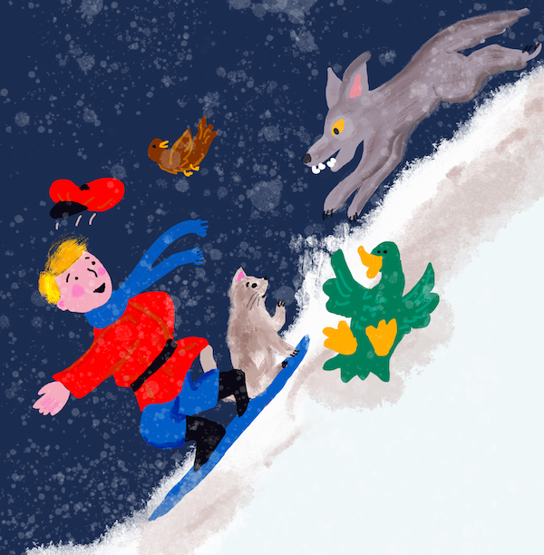

<!--
CO_OP_TRANSLATOR_METADATA:
{
  "original_hash": "9660fbd80845c59c15715cb418cd6e23",
  "translation_date": "2025-09-03T18:38:52+00:00",
  "source_file": "8-Reinforcement/2-Gym/README.md",
  "language_code": "lt"
}
-->
# CartPole Čiuožimas

Problema, kurią sprendėme ankstesnėje pamokoje, gali atrodyti kaip žaislinė problema, neturinti realaus pritaikymo gyvenime. Tačiau taip nėra, nes daugelis realaus pasaulio problemų taip pat turi panašią struktūrą – įskaitant šachmatų ar Go žaidimą. Jos yra panašios, nes taip pat turime lentą su nustatytomis taisyklėmis ir **diskrečia būsena**.

## [Prieš paskaitą atlikite testą](https://gray-sand-07a10f403.1.azurestaticapps.net/quiz/47/)

## Įvadas

Šioje pamokoje taikysime tuos pačius Q-mokymosi principus problemai su **tęstine būsena**, t. y. būsena, kurią apibrėžia vienas ar daugiau realiųjų skaičių. Spręsime šią problemą:

> **Problema**: Jei Petras nori pabėgti nuo vilko, jis turi išmokti judėti greičiau. Pažiūrėsime, kaip Petras gali išmokti čiuožti, ypač išlaikyti pusiausvyrą, naudojant Q-mokymąsi.



> Petras ir jo draugai tampa kūrybingi, norėdami pabėgti nuo vilko! Iliustracija: [Jen Looper](https://twitter.com/jenlooper)

Naudosime supaprastintą pusiausvyros išlaikymo versiją, vadinamą **CartPole** problema. CartPole pasaulyje turime horizontalų slankiklį, kuris gali judėti į kairę arba į dešinę, o tikslas yra išlaikyti vertikalią lazdą ant slankiklio.

## Reikalavimai

Šioje pamokoje naudosime biblioteką **OpenAI Gym**, skirtą įvairių **aplinkų** simuliacijai. Pamokos kodą galite vykdyti lokaliai (pvz., Visual Studio Code), tokiu atveju simuliacija bus atidaryta naujame lange. Jei vykdote kodą internete, gali reikėti atlikti tam tikrus pakeitimus, kaip aprašyta [čia](https://towardsdatascience.com/rendering-openai-gym-envs-on-binder-and-google-colab-536f99391cc7).

## OpenAI Gym

Ankstesnėje pamokoje žaidimo taisyklės ir būsena buvo apibrėžtos mūsų pačių sukurtoje `Board` klasėje. Šioje pamokoje naudosime specialią **simuliacijos aplinką**, kuri simuliuos fizikos dėsnius, susijusius su lazdos balansavimu. Viena populiariausių simuliacijos aplinkų, skirtų stiprinamojo mokymosi algoritmams, vadinama [Gym](https://gym.openai.com/), kurią prižiūri [OpenAI](https://openai.com/). Naudodami šią aplinką galime kurti įvairias **aplinkas**, nuo CartPole simuliacijos iki Atari žaidimų.

> **Pastaba**: Kitas OpenAI Gym aplinkas galite pamatyti [čia](https://gym.openai.com/envs/#classic_control).

Pirmiausia įdiekime Gym ir importuokime reikalingas bibliotekas (kodo blokas 1):

```python
import sys
!{sys.executable} -m pip install gym 

import gym
import matplotlib.pyplot as plt
import numpy as np
import random
```

## Užduotis – inicializuoti CartPole aplinką

Norėdami dirbti su CartPole balansavimo problema, turime inicializuoti atitinkamą aplinką. Kiekviena aplinka turi:

- **Stebėjimų erdvę**, kuri apibrėžia informaciją, kurią gauname iš aplinkos. CartPole problemai gauname lazdos padėtį, greitį ir kitus parametrus.

- **Veiksmų erdvę**, kuri apibrėžia galimus veiksmus. Mūsų atveju veiksmų erdvė yra diskreti, ir susideda iš dviejų veiksmų – **kairė** ir **dešinė**. (kodo blokas 2)

1. Inicializuokite aplinką naudodami šį kodą:

    ```python
    env = gym.make("CartPole-v1")
    print(env.action_space)
    print(env.observation_space)
    print(env.action_space.sample())
    ```

Norėdami pamatyti, kaip veikia aplinka, paleiskime trumpą simuliaciją, trunkančią 100 žingsnių. Kiekviename žingsnyje pateikiame veiksmą, kurį reikia atlikti – šioje simuliacijoje atsitiktinai pasirenkame veiksmą iš `action_space`.

1. Paleiskite žemiau pateiktą kodą ir pažiūrėkite, kas nutiks.

    ✅ Atminkite, kad šį kodą geriausia vykdyti lokaliai, naudojant Python! (kodo blokas 3)

    ```python
    env.reset()
    
    for i in range(100):
       env.render()
       env.step(env.action_space.sample())
    env.close()
    ```

    Turėtumėte matyti kažką panašaus į šį vaizdą:

    

1. Simuliacijos metu turime gauti stebėjimus, kad nuspręstume, kaip veikti. Iš tiesų, `step` funkcija grąžina dabartinius stebėjimus, atlygio funkciją ir `done` vėliavėlę, kuri nurodo, ar verta tęsti simuliaciją: (kodo blokas 4)

    ```python
    env.reset()
    
    done = False
    while not done:
       env.render()
       obs, rew, done, info = env.step(env.action_space.sample())
       print(f"{obs} -> {rew}")
    env.close()
    ```

    Jūsų užrašų knygelės išvestyje turėtų būti kažkas panašaus į tai:

    ```text
    [ 0.03403272 -0.24301182  0.02669811  0.2895829 ] -> 1.0
    [ 0.02917248 -0.04828055  0.03248977  0.00543839] -> 1.0
    [ 0.02820687  0.14636075  0.03259854 -0.27681916] -> 1.0
    [ 0.03113408  0.34100283  0.02706215 -0.55904489] -> 1.0
    [ 0.03795414  0.53573468  0.01588125 -0.84308041] -> 1.0
    ...
    [ 0.17299878  0.15868546 -0.20754175 -0.55975453] -> 1.0
    [ 0.17617249  0.35602306 -0.21873684 -0.90998894] -> 1.0
    ```

    Stebėjimų vektorius, kuris grąžinamas kiekviename simuliacijos žingsnyje, apima šias reikšmes:
    - Vežimėlio padėtis
    - Vežimėlio greitis
    - Lazdos kampas
    - Lazdos sukimosi greitis

1. Gaukite šių skaičių minimalią ir maksimalią reikšmes: (kodo blokas 5)

    ```python
    print(env.observation_space.low)
    print(env.observation_space.high)
    ```

    Taip pat galite pastebėti, kad atlygio reikšmė kiekviename simuliacijos žingsnyje visada yra 1. Taip yra todėl, kad mūsų tikslas yra išgyventi kuo ilgiau, t. y. išlaikyti lazdą pakankamai vertikalioje padėtyje kuo ilgesnį laiką.

    ✅ Iš tiesų, CartPole simuliacija laikoma išspręsta, jei mums pavyksta gauti vidutinį 195 atlygį per 100 iš eilės vykdomų bandymų.

## Būsenos diskretizavimas

Q-mokymesi turime sukurti Q-lentelę, kuri nurodo, ką daryti kiekvienoje būsenoje. Norėdami tai padaryti, būsena turi būti **diskreti**, tiksliau, ji turi turėti baigtinį diskrečių reikšmių skaičių. Todėl turime kažkaip **diskretizuoti** savo stebėjimus, susiedami juos su baigtiniu būsenų rinkiniu.

Yra keletas būdų, kaip tai padaryti:

- **Padalijimas į intervalus**. Jei žinome tam tikros reikšmės intervalą, galime padalyti šį intervalą į tam tikrą skaičių **intervalų** ir tada pakeisti reikšmę į intervalą, kuriam ji priklauso. Tai galima padaryti naudojant numpy [`digitize`](https://numpy.org/doc/stable/reference/generated/numpy.digitize.html) metodą. Tokiu atveju tiksliai žinosime būsenos dydį, nes jis priklausys nuo pasirinktų intervalų skaičiaus.

✅ Galime naudoti linijinę interpolaciją, kad reikšmes pritaikytume tam tikram baigtiniam intervalui (pvz., nuo -20 iki 20), o tada konvertuoti skaičius į sveikuosius skaičius juos suapvalinant. Tai suteikia mažiau kontrolės būsenos dydžiui, ypač jei nežinome tikslių įvesties reikšmių ribų. Pavyzdžiui, mūsų atveju 2 iš 4 reikšmių neturi viršutinių/apatinių ribų, o tai gali lemti begalinį būsenų skaičių.

Mūsų pavyzdyje naudosime antrąjį metodą. Kaip pastebėsite vėliau, nepaisant neapibrėžtų ribų, šios reikšmės retai viršija tam tikrus baigtinius intervalus, todėl būsenos su ekstremaliomis reikšmėmis bus labai retos.

1. Štai funkcija, kuri paims mūsų modelio stebėjimus ir sukurs 4 sveikųjų skaičių tuple: (kodo blokas 6)

    ```python
    def discretize(x):
        return tuple((x/np.array([0.25, 0.25, 0.01, 0.1])).astype(np.int))
    ```

1. Taip pat išbandykime kitą diskretizavimo metodą, naudodami intervalus: (kodo blokas 7)

    ```python
    def create_bins(i,num):
        return np.arange(num+1)*(i[1]-i[0])/num+i[0]
    
    print("Sample bins for interval (-5,5) with 10 bins\n",create_bins((-5,5),10))
    
    ints = [(-5,5),(-2,2),(-0.5,0.5),(-2,2)] # intervals of values for each parameter
    nbins = [20,20,10,10] # number of bins for each parameter
    bins = [create_bins(ints[i],nbins[i]) for i in range(4)]
    
    def discretize_bins(x):
        return tuple(np.digitize(x[i],bins[i]) for i in range(4))
    ```

1. Dabar paleiskime trumpą simuliaciją ir stebėkime šias diskretizuotas aplinkos reikšmes. Galite išbandyti tiek `discretize`, tiek `discretize_bins` ir pažiūrėti, ar yra skirtumas.

    ✅ `discretize_bins` grąžina intervalo numerį, kuris prasideda nuo 0. Todėl įvesties kintamojo reikšmėms, esančioms apie 0, jis grąžina skaičių iš intervalo vidurio (10). `discretize` funkcijoje mums nerūpėjo išvesties reikšmių diapazonas, leidžiant joms būti neigiamoms, todėl būsenos reikšmės nėra perstumtos, o 0 atitinka 0. (kodo blokas 8)

    ```python
    env.reset()
    
    done = False
    while not done:
       #env.render()
       obs, rew, done, info = env.step(env.action_space.sample())
       #print(discretize_bins(obs))
       print(discretize(obs))
    env.close()
    ```

    ✅ Atkomentuokite eilutę, prasidedančią `env.render`, jei norite pamatyti, kaip vykdoma aplinka. Priešingu atveju galite vykdyti ją fone, kas yra greičiau. Šį „nematomą“ vykdymą naudosime Q-mokymosi procese.

## Q-lentelės struktūra

Ankstesnėje pamokoje būsena buvo paprasta pora skaičių nuo 0 iki 8, todėl buvo patogu Q-lentelę atvaizduoti kaip numpy tensorą, kurio forma yra 8x8x2. Jei naudojame intervalų diskretizavimą, mūsų būsenos vektoriaus dydis taip pat yra žinomas, todėl galime naudoti tą patį metodą ir būseną atvaizduoti kaip masyvą, kurio forma yra 20x20x10x10x2 (čia 2 yra veiksmų erdvės dimensija, o pirmosios dimensijos atitinka pasirinktų intervalų skaičių kiekvienam stebėjimų erdvės parametrui).

Tačiau kartais stebėjimų erdvės tikslios dimensijos nėra žinomos. Naudojant `discretize` funkciją, niekada negalime būti tikri, kad mūsų būsena išliks tam tikrose ribose, nes kai kurios pradinės reikšmės nėra apribotos. Todėl naudosime šiek tiek kitokį metodą ir Q-lentelę atvaizduosime kaip žodyną.

1. Naudokite porą *(būsena, veiksmas)* kaip žodyno raktą, o reikšmė atitiks Q-lentelės įrašo reikšmę. (kodo blokas 9)

    ```python
    Q = {}
    actions = (0,1)
    
    def qvalues(state):
        return [Q.get((state,a),0) for a in actions]
    ```

    Čia taip pat apibrėžiame funkciją `qvalues()`, kuri grąžina Q-lentelės reikšmių sąrašą, atitinkantį visus galimus veiksmus tam tikroje būsenoje. Jei įrašas nėra Q-lentelėje, grąžinsime 0 kaip numatytąją reikšmę.

## Pradėkime Q-mokymąsi

Dabar esame pasiruošę išmokyti Petrą išlaikyti pusiausvyrą!

1. Pirmiausia nustatykime keletą hiperparametrų: (kodo blokas 10)

    ```python
    # hyperparameters
    alpha = 0.3
    gamma = 0.9
    epsilon = 0.90
    ```

    Čia `alpha` yra **mokymosi greitis**, kuris nurodo, kiek turėtume koreguoti dabartines Q-lentelės reikšmes kiekviename žingsnyje. Ankstesnėje pamokoje pradėjome nuo 1, o vėliau mažinome `alpha` mokymo metu. Šiame pavyzdyje išlaikysime jį pastovų dėl paprastumo, tačiau vėliau galite eksperimentuoti su `alpha` reikšmėmis.

    `gamma` yra **nuolaidos faktorius**, kuris parodo, kiek turėtume teikti pirmenybę būsimam atlygiui, palyginti su dabartiniu atlygiu.

    `epsilon` yra **tyrinėjimo/naudojimo faktorius**, kuris nustato, ar turėtume teikti pirmenybę tyrinėjimui, ar naudojimui. Mūsų algoritme `epsilon` procentais atvejų pasirinksime kitą veiksmą pagal Q-lentelės reikšmes, o likusiais atvejais vykdysime atsitiktinį veiksmą. Tai leis mums ištirti paieškos erdvės sritis, kurių dar nematėme.

    ✅ Kalbant apie balansavimą – atsitiktinio veiksmo pasirinkimas (tyrinėjimas) veiktų kaip atsitiktinis smūgis netinkama kryptimi, ir lazda turėtų išmokti, kaip atgauti pusiausvyrą po tokių „klaidų“.

### Tobulinkime algoritmą

Taip pat galime atlikti du patobulinimus mūsų algoritmui iš ankstesnės pamokos:

- **Apskaičiuoti vidutinį kaupiamąjį atlygį** per tam tikrą simuliacijų skaičių. Spausdinsime pažangą kas 5000 iteracijų ir vidurkinsime kaupiamąjį atlygį per tą laikotarpį. Tai reiškia, kad jei gausime daugiau nei 195 taškus – galime laikyti problemą išspręsta, net su aukštesne kokybe nei reikalaujama.

- **Apskaičiuoti maksimalų vidutinį kaupiamąjį rezultatą**, `Qmax`, ir išsaugosime Q-lentelę, atitinkančią tą rezultatą. Kai paleisite mokymą, pastebėsite, kad kartais vidutinis kaupiamasis rezultatas pradeda mažėti, ir norime išsaugoti Q-lentelės reikšmes, atitinkančias geriausią modelį, pastebėtą mokymo metu.

1. Surinkite visus kaupiamuosius atlygius kiekvienoje simuliacijoje į `rewards` vektorių, kad galėtumėte juos vėliau pavaizduoti grafike. (kodo blokas 11)

    ```python
    def probs(v,eps=1e-4):
        v = v-v.min()+eps
        v = v/v.sum()
        return v
    
    Qmax = 0
    cum_rewards = []
    rewards = []
    for epoch in range(100000):
        obs = env.reset()
        done = False
        cum_reward=0
        # == do the simulation ==
        while not done:
            s = discretize(obs)
            if random.random()<epsilon:
                # exploitation - chose the action according to Q-Table probabilities
                v = probs(np.array(qvalues(s)))
                a = random.choices(actions,weights=v)[0]
            else:
                # exploration - randomly chose the action
                a = np.random.randint(env.action_space.n)
    
            obs, rew, done, info = env.step(a)
            cum_reward+=rew
            ns = discretize(obs)
            Q[(s,a)] = (1 - alpha) * Q.get((s,a),0) + alpha * (rew + gamma * max(qvalues(ns)))
        cum_rewards.append(cum_reward)
        rewards.append(cum_reward)
        # == Periodically print results and calculate average reward ==
        if epoch%5000==0:
            print(f"{epoch}: {np.average(cum_rewards)}, alpha={alpha}, epsilon={epsilon}")
            if np.average(cum_rewards) > Qmax:
                Qmax = np.average(cum_rewards)
                Qbest = Q
            cum_rewards=[]
    ```

Ką galite pastebėti iš šių rezultatų:

- **Artėjame prie tikslo**. Esame labai arti tikslo – gauti 195 kaupiamuosius atlygius per 100+ iš eilės vykdomų simuliacijų, arba galbūt jau jį pasiekėme! Net jei gauname mažesnius skaičius, vis tiek nežinome, nes vidurkiname per 5000 vykdymų, o oficialiame kriterijuje reikalaujama tik 100 vykdymų.

- **Atlygis pradeda mažėti**. Kartais atlygis pradeda mažėti, o tai reiškia, kad galime „sugadinti“ jau išmoktas Q-lentelės reikšmes naujomis, kurios pablogina situaciją.

Šis pastebėjimas tampa aiškesnis, jei pavaizduojame mokymo pažangą grafike.

## Mokymo pažangos vaizdavimas

Mokymo metu surinkome kaupiamojo atlygio reikšmes kiekvienoje iteracijoje į `rewards` vektorių. Štai kaip tai atrodo, kai pavaizduojame prieš iteracijų skaičių:

```python
plt.plot(rewards)
```


Iš šio grafiko sunku ką nors pasakyti, nes dėl stochastinio mokymo proceso treniruočių sesijų trukmė labai skiriasi. Kad šis grafikas būtų prasmingesnis, galime apskaičiuoti **slankųjį vidurkį** per seriją eksperimentų, tarkime, 100. Tai galima patogiai atlikti naudojant `np.convolve`: (kodo blokas 12)

```python
def running_average(x,window):
    return np.convolve(x,np.ones(window)/window,mode='valid')

plt.plot(running_average(rewards,100))
```


## Hiperparametrų keitimas

Norint, kad mokymasis būtų stabilesnis, verta reguliuoti kai kuriuos hiperparametrus mokymo metu. Konkrečiai:

- **Mokymosi greičiui**, `alpha`, galime pradėti nuo reikšmių, artimų 1, ir tada palaipsniui mažinti šį parametrą. Laikui bėgant gausime geras tikimybių reikšmes Q-lentelėje, todėl turėtume jas šiek tiek koreguoti, o ne visiškai perrašyti naujomis reikšmėmis.

- **Didinti epsilon**.
> **Užduotis 1**: Pakeiskite hiperparametrų reikšmes ir pažiūrėkite, ar galite pasiekti didesnį bendrą atlygį. Ar pasiekiate daugiau nei 195?
> **Užduotis 2**: Norint oficialiai išspręsti problemą, reikia pasiekti 195 vidutinį atlygį per 100 iš eilės vykdomų bandymų. Stebėkite tai mokymosi metu ir įsitikinkite, kad problema oficialiai išspręsta!

## Rezultato stebėjimas veiksmuose

Būtų įdomu pamatyti, kaip išmokytas modelis elgiasi. Paleiskime simuliaciją ir laikykimės tos pačios veiksmų pasirinkimo strategijos kaip mokymosi metu, imdami mėginius pagal tikimybių pasiskirstymą Q-lentelėje: (kodo blokas 13)

```python
obs = env.reset()
done = False
while not done:
   s = discretize(obs)
   env.render()
   v = probs(np.array(qvalues(s)))
   a = random.choices(actions,weights=v)[0]
   obs,_,done,_ = env.step(a)
env.close()
```

Turėtumėte pamatyti kažką panašaus į tai:


---

## 🚀Iššūkis

> **Užduotis 3**: Čia naudojome galutinę Q-lentelės kopiją, kuri gali nebūti geriausia. Prisiminkite, kad geriausiai veikiančią Q-lentelę išsaugojome `Qbest` kintamajame! Išbandykite tą patį pavyzdį su geriausiai veikiančia Q-lentele, nukopijuodami `Qbest` į `Q`, ir pažiūrėkite, ar pastebėsite skirtumą.

> **Užduotis 4**: Čia kiekviename žingsnyje nepasirinkome geriausio veiksmo, o rinkomės pagal atitinkamą tikimybių pasiskirstymą. Ar būtų prasmingiau visada pasirinkti geriausią veiksmą, turintį didžiausią Q-lentelės vertę? Tai galima padaryti naudojant `np.argmax` funkciją, kad sužinotumėte veiksmo numerį, atitinkantį didžiausią Q-lentelės vertę. Įgyvendinkite šią strategiją ir pažiūrėkite, ar tai pagerina balansavimą.

## [Po paskaitos testas](https://gray-sand-07a10f403.1.azurestaticapps.net/quiz/48/)

## Užduotis
[Treniruokite kalnų automobilį](assignment.md)

## Išvada

Dabar išmokome treniruoti agentus, kad jie pasiektų gerų rezultatų, tiesiog pateikdami jiems atlygio funkciją, apibrėžiančią norimą žaidimo būseną, ir suteikdami galimybę protingai tyrinėti paieškos erdvę. Sėkmingai pritaikėme Q-mokymosi algoritmą diskretinių ir tęstinių aplinkų atvejais, tačiau su diskretiniais veiksmais.

Taip pat svarbu nagrinėti situacijas, kai veiksmo būsena yra tęstinė, o stebėjimo erdvė yra daug sudėtingesnė, pavyzdžiui, vaizdas iš Atari žaidimo ekrano. Tokiose problemose dažnai reikia naudoti galingesnes mašininio mokymosi technikas, tokias kaip neuroniniai tinklai, kad būtų pasiekti geri rezultatai. Šios pažangesnės temos bus aptartos mūsų būsimame pažangesniame dirbtinio intelekto kurse.

---

**Atsakomybės apribojimas**:  
Šis dokumentas buvo išverstas naudojant AI vertimo paslaugą [Co-op Translator](https://github.com/Azure/co-op-translator). Nors siekiame tikslumo, prašome atkreipti dėmesį, kad automatiniai vertimai gali turėti klaidų ar netikslumų. Originalus dokumentas jo gimtąja kalba turėtų būti laikomas autoritetingu šaltiniu. Kritinei informacijai rekomenduojama naudoti profesionalų žmogaus vertimą. Mes neprisiimame atsakomybės už nesusipratimus ar klaidingus interpretavimus, atsiradusius dėl šio vertimo naudojimo.