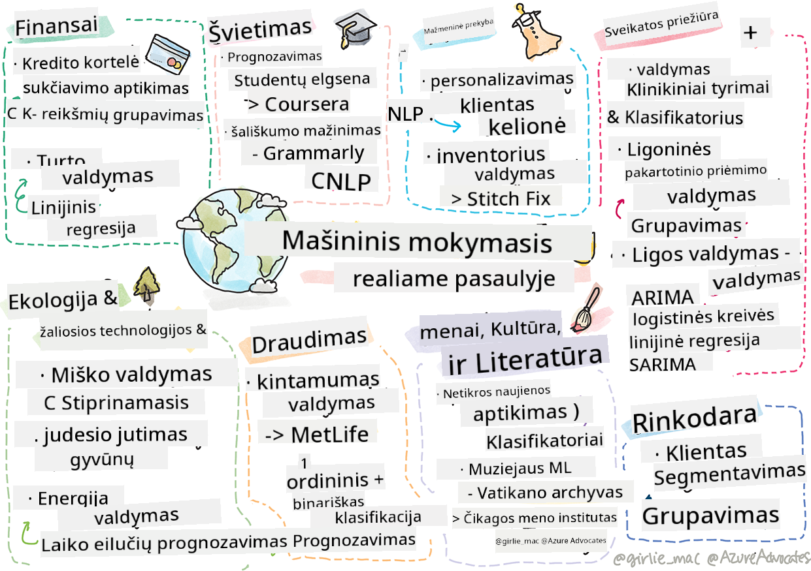

<!--
CO_OP_TRANSLATOR_METADATA:
{
  "original_hash": "20f18ff565638be615df4174858e4a7f",
  "translation_date": "2025-09-03T17:22:31+00:00",
  "source_file": "9-Real-World/1-Applications/README.md",
  "language_code": "lt"
}
-->
# Postscriptas: Mašininis mokymasis realiame pasaulyje

> Sketchnote sukūrė [Tomomi Imura](https://www.twitter.com/girlie_mac)

Šioje mokymo programoje išmokote daugybę būdų, kaip paruošti duomenis mokymui ir kurti mašininio mokymosi modelius. Jūs sukūrėte klasikinių regresijos, klasterizavimo, klasifikavimo, natūralios kalbos apdorojimo ir laiko eilučių modelių seriją. Sveikiname! Dabar galbūt klausiate savęs, kam visa tai skirta... kokios yra šių modelių realaus pasaulio taikymo galimybės?

Nors pramonėje daug dėmesio sulaukė dirbtinis intelektas, kuris dažniausiai remiasi giluminiu mokymusi, klasikiniai mašininio mokymosi modeliai vis dar turi vertingų taikymo galimybių. Galbūt netgi šiandien naudojate kai kurias iš šių taikymo sričių! Šioje pamokoje tyrinėsite, kaip aštuonios skirtingos pramonės šakos ir teminės sritys naudoja šiuos modelius, kad jų taikymas būtų našesnis, patikimesnis, protingesnis ir vertingesnis vartotojams.

## [Prieš paskaitos testas](https://gray-sand-07a10f403.1.azurestaticapps.net/quiz/49/)

## 💰 Finansai

Finansų sektorius siūlo daugybę galimybių mašininiam mokymuisi. Daugelis problemų šioje srityje gali būti modeliuojamos ir sprendžiamos naudojant ML.

### Kredito kortelių sukčiavimo aptikimas

Anksčiau kurse mokėmės apie [k-means klasterizavimą](../../5-Clustering/2-K-Means/README.md), bet kaip jis gali būti naudojamas sprendžiant kredito kortelių sukčiavimo problemas?

K-means klasterizavimas yra naudingas kredito kortelių sukčiavimo aptikimo technikoje, vadinamoje **išskirtinių atvejų aptikimu**. Išskirtiniai atvejai arba duomenų rinkinio stebėjimų nukrypimai gali parodyti, ar kredito kortelė naudojama įprastai, ar vyksta kažkas neįprasto. Kaip parodyta žemiau pateiktame straipsnyje, galite rūšiuoti kredito kortelių duomenis naudodami k-means klasterizavimo algoritmą ir priskirti kiekvieną operaciją klasteriui pagal tai, kiek ji atrodo išskirtinė. Tada galite įvertinti rizikingiausius klasterius, kad atskirtumėte sukčiavimo atvejus nuo teisėtų operacijų.
[Nuoroda](https://citeseerx.ist.psu.edu/viewdoc/download?doi=10.1.1.680.1195&rep=rep1&type=pdf)

### Turto valdymas

Turto valdymo srityje asmuo ar įmonė tvarko investicijas savo klientų vardu. Jų darbas yra ilgalaikėje perspektyvoje išlaikyti ir auginti turtą, todėl būtina pasirinkti gerai veikiančias investicijas.

Vienas iš būdų įvertinti, kaip tam tikra investicija veikia, yra statistinė regresija. [Linijinė regresija](../../2-Regression/1-Tools/README.md) yra vertingas įrankis, padedantis suprasti, kaip fondas veikia, palyginti su tam tikru etalonu. Taip pat galime nustatyti, ar regresijos rezultatai yra statistiškai reikšmingi, arba kiek jie paveiktų kliento investicijas. Galite dar labiau išplėsti savo analizę naudodami daugybinę regresiją, kurioje galima atsižvelgti į papildomus rizikos veiksnius. Pavyzdį, kaip tai veiktų konkrečiam fondui, rasite žemiau pateiktame straipsnyje apie fondo veiklos vertinimą naudojant regresiją.
[Nuoroda](http://www.brightwoodventures.com/evaluating-fund-performance-using-regression/)

## 🎓 Švietimas

Švietimo sektorius taip pat yra labai įdomi sritis, kurioje galima taikyti ML. Čia galima spręsti įdomias problemas, tokias kaip sukčiavimo testuose ar rašiniuose aptikimas arba šališkumo, tyčinio ar netyčinio, valdymas vertinimo procese.

### Studentų elgesio prognozavimas

[Coursera](https://coursera.com), internetinė atvirų kursų platforma, turi puikų technologijų tinklaraštį, kuriame aptariami daugybė inžinerinių sprendimų. Šiame atvejo tyrime jie nubrėžė regresijos liniją, siekdami ištirti, ar yra koreliacija tarp žemo NPS (Net Promoter Score) įvertinimo ir kurso išlaikymo ar nutraukimo.
[Nuoroda](https://medium.com/coursera-engineering/controlled-regression-quantifying-the-impact-of-course-quality-on-learner-retention-31f956bd592a)

### Šališkumo mažinimas

[Grammarly](https://grammarly.com), rašymo asistentas, tikrinantis rašybos ir gramatikos klaidas, naudoja sudėtingas [natūralios kalbos apdorojimo sistemas](../../6-NLP/README.md) savo produktuose. Jie paskelbė įdomų atvejo tyrimą savo technologijų tinklaraštyje apie tai, kaip jie sprendė lyčių šališkumo problemą mašininiame mokymesi, apie kurią sužinojote mūsų [įvadinėje pamokoje apie teisingumą](../../1-Introduction/3-fairness/README.md).
[Nuoroda](https://www.grammarly.com/blog/engineering/mitigating-gender-bias-in-autocorrect/)

## 👜 Mažmeninė prekyba

Mažmeninės prekybos sektorius tikrai gali pasinaudoti ML, pradedant nuo geresnės klientų kelionės kūrimo iki optimalaus inventoriaus valdymo.

### Klientų kelionės personalizavimas

Wayfair, įmonė, parduodanti namų apyvokos prekes, tokias kaip baldai, siekia padėti klientams rasti tinkamus produktus pagal jų skonį ir poreikius. Šiame straipsnyje įmonės inžinieriai aprašo, kaip jie naudoja ML ir NLP, kad „pateiktų tinkamus rezultatus klientams“. Ypač jų Užklausų ketinimų variklis buvo sukurtas naudojant entitetų išskyrimą, klasifikatorių mokymą, turto ir nuomonių išskyrimą bei sentimentų žymėjimą klientų apžvalgose. Tai klasikinis NLP naudojimo internetinėje mažmeninėje prekyboje pavyzdys.
[Nuoroda](https://www.aboutwayfair.com/tech-innovation/how-we-use-machine-learning-and-natural-language-processing-to-empower-search)

### Inventoriaus valdymas

Inovatyvios, lanksčios įmonės, tokios kaip [StitchFix](https://stitchfix.com), dėžutės paslauga, siunčianti drabužius vartotojams, labai remiasi ML rekomendacijoms ir inventoriaus valdymui. Jų stilistų komandos dirba kartu su jų prekių komandomis: „vienas iš mūsų duomenų mokslininkų eksperimentavo su genetiniu algoritmu ir pritaikė jį drabužiams, kad numatytų, kas būtų sėkmingas drabužių modelis, kuris dar neegzistuoja. Mes tai pristatėme prekių komandai, ir dabar jie gali tai naudoti kaip įrankį.“
[Nuoroda](https://www.zdnet.com/article/how-stitch-fix-uses-machine-learning-to-master-the-science-of-styling/)

## 🏥 Sveikatos priežiūra

Sveikatos priežiūros sektorius gali pasinaudoti ML optimizuojant tyrimų užduotis ir logistikos problemas, tokias kaip pacientų pakartotinis hospitalizavimas ar ligų plitimo sustabdymas.

### Klinikiniai tyrimai

Toksikologija klinikiniuose tyrimuose yra didelis rūpestis vaistų gamintojams. Kiek toksikologijos yra toleruotina? Šiame tyrime, analizuojant įvairius klinikinių tyrimų metodus, buvo sukurtas naujas požiūris į klinikinių tyrimų rezultatų prognozavimą. Konkrečiai, jie galėjo naudoti atsitiktinių miškų algoritmą, kad sukurtų [klasifikatorių](../../4-Classification/README.md), kuris galėtų atskirti vaistų grupes.
[Nuoroda](https://www.sciencedirect.com/science/article/pii/S2451945616302914)

### Ligoninių pakartotinio hospitalizavimo valdymas

Ligoninių priežiūra yra brangi, ypač kai pacientai turi būti pakartotinai hospitalizuojami. Šiame straipsnyje aptariama įmonė, kuri naudoja ML, kad prognozuotų pakartotinio hospitalizavimo galimybę, naudodama [klasterizavimo](../../5-Clustering/README.md) algoritmus. Šie klasteriai padeda analitikams „atrasti pakartotinio hospitalizavimo grupes, kurios gali turėti bendrą priežastį“.
[Nuoroda](https://healthmanagement.org/c/healthmanagement/issuearticle/hospital-readmissions-and-machine-learning)

### Ligos valdymas

Pastaroji pandemija atskleidė, kaip mašininis mokymasis gali padėti sustabdyti ligų plitimą. Šiame straipsnyje atpažinsite ARIMA, logistikos kreives, linijinę regresiją ir SARIMA. „Šis darbas yra bandymas apskaičiuoti šio viruso plitimo greitį ir taip prognozuoti mirčių, pasveikimų ir patvirtintų atvejų skaičių, kad galėtume geriau pasiruošti ir išgyventi.“
[Nuoroda](https://www.ncbi.nlm.nih.gov/pmc/articles/PMC7979218/)

## 🌲 Ekologija ir žaliųjų technologijų sektorius

Gamta ir ekologija susideda iš daugybės jautrių sistemų, kuriose gyvūnų ir gamtos sąveika yra svarbi. Svarbu tiksliai išmatuoti šias sistemas ir tinkamai reaguoti, jei kažkas nutinka, pavyzdžiui, miško gaisras ar gyvūnų populiacijos sumažėjimas.

### Miškų valdymas

Ankstesnėse pamokose mokėtės apie [stiprinamąjį mokymąsi](../../8-Reinforcement/README.md). Jis gali būti labai naudingas, kai bandoma prognozuoti gamtos modelius. Ypač jis gali būti naudojamas stebint ekologines problemas, tokias kaip miško gaisrai ir invazinių rūšių plitimas. Kanadoje tyrėjų grupė naudojo stiprinamąjį mokymąsi, kad sukurtų miško gaisrų dinamikos modelius iš palydovinių vaizdų. Naudodami inovatyvų „erdvinio plitimo procesą (SSP)“, jie įsivaizdavo miško gaisrą kaip „agentą bet kurioje kraštovaizdžio vietoje“. „Veiksmų rinkinys, kurį gaisras gali atlikti iš tam tikros vietos bet kuriuo metu, apima plitimą į šiaurę, pietus, rytus, vakarus arba neplitimą.“

Šis požiūris apverčia įprastą stiprinamojo mokymosi sąranką, nes atitinkamo Markovo sprendimų proceso (MDP) dinamika yra žinoma funkcija tiesioginiam gaisro plitimui. Daugiau apie klasikinius algoritmus, kuriuos naudojo ši grupė, skaitykite žemiau pateiktoje nuorodoje.
[Nuoroda](https://www.frontiersin.org/articles/10.3389/fict.2018.00006/full)

### Gyvūnų judėjimo stebėjimas

Nors giluminis mokymasis sukėlė revoliuciją vizualiai stebint gyvūnų judėjimą (galite sukurti savo [poliarinių lokių stebėjimo sistemą](https://docs.microsoft.com/learn/modules/build-ml-model-with-azure-stream-analytics/?WT.mc_id=academic-77952-leestott) čia), klasikinis ML vis dar turi vietą šioje užduotyje.

Jutikliai, skirti stebėti ūkio gyvūnų judėjimą, ir IoT naudoja tokio tipo vizualinį apdorojimą, tačiau paprastesni ML metodai yra naudingi duomenų išankstiniam apdorojimui. Pavyzdžiui, šiame straipsnyje buvo stebimos ir analizuojamos avių laikysenos naudojant įvairius klasifikatorių algoritmus. Galbūt atpažinsite ROC kreivę 335 puslapyje.
[Nuoroda](https://druckhaus-hofmann.de/gallery/31-wj-feb-2020.pdf)

### ⚡️ Energijos valdymas

Mūsų pamokose apie [laiko eilučių prognozavimą](../../7-TimeSeries/README.md) buvo aptarta išmaniųjų stovėjimo skaitiklių koncepcija, siekiant generuoti pajamas miestui, remiantis pasiūlos ir paklausos supratimu. Šiame straipsnyje išsamiai aptariama, kaip klasterizavimas, regresija ir laiko eilučių prognozavimas kartu padėjo prognozuoti būsimą energijos naudojimą Airijoje, remiantis išmaniaisiais skaitikliais.
[Nuoroda](https://www-cdn.knime.com/sites/default/files/inline-images/knime_bigdata_energy_timeseries_whitepaper.pdf)

## 💼 Draudimas

Draudimo sektorius yra dar viena sritis, kurioje ML naudojamas kuriant ir optimizuojant gyvybingus finansinius ir aktuarinius modelius.

### Kintamumo valdymas

MetLife, gyvybės draudimo teikėjas, atvirai dalijasi, kaip jie analizuoja ir mažina kintamumą savo finansiniuose modeliuose. Šiame straipsnyje pastebėsite dvejetainės ir ordinės klasifikacijos vizualizacijas. Taip pat rasite prognozavimo vizualizacijas.
[Nuoroda](https://investments.metlife.com/content/dam/metlifecom/us/investments/insights/research-topics/macro-strategy/pdf/MetLifeInvestmentManagement_MachineLearnedRanking_070920.pdf)

## 🎨 Menai, kultūra ir literatūra

Meno srityje, pavyzdžiui, žurnalistikoje, yra daugybė įdomių problemų. Netikrų naujienų aptikimas yra didelė problema, nes įrodyta, kad jos gali paveikti žmonių nuomonę ir netgi sugriauti demokratijas. Muziejai taip pat gali pasinaudoti ML, pradedant nuo ryšių tarp artefaktų paieškos iki išteklių planavimo.

### Netikrų naujienų aptikimas

Netikrų naujienų aptikimas tapo katės ir pelės žaidimu šiandieninėje žiniasklaidoje. Šiame straipsnyje tyrėjai siūlo sistemą, kurioje galima išbandyti kelis ML metodus ir pasirinkti geriausią modelį: „Ši sistema remiasi natūralios kalbos apdorojimu, kad išgautų duomenų ypatybes, o tada šios ypatybės naudojamos mašininio mokymosi klasifikatorių, tokių kaip Naive Bayes, Support Vector Machine (SVM), Random Forest (RF), Stochastic Gradient Descent (SGD) ir Logistic Regression (LR), mokymui.“
[Nuoroda](https://www.irjet.net/archives/V7/i6/IRJET-V7I6688.pdf)

Šis straipsnis rodo, kaip skirtingų ML sričių derinimas gali duoti įdomių rezultatų, kurie padeda sustabdyti netikrų naujienų plitimą ir sukelti realią žalą; šiuo atveju impulsas buvo gandų apie COVID gydymą plitimas, kuris sukėlė minios smurtą.

### Muziejų ML

Muziejai yra AI revoliucijos slenksčio, kur katalogavimas ir kolekcijų skaitmeninimas bei ryšių tarp artefaktų paieška tampa lengvesni, technologijoms tobulėjant. Tokie projektai kaip [In Codice Ratio](https://www.sciencedirect.com/science/article/abs/pii/S0306457321001035#:~:text=1.,studies%20over%20large%20historical%20sources.) padeda atskleisti neprieinamų kolekcijų, tokių kaip Vatikano arch
Identifikuokite kitą sektorių, kuris pasinaudoja kai kuriomis technikomis, išmoktomis šiame kurse, ir sužinokite, kaip jis naudoja ML.

## [Po paskaitos testas](https://gray-sand-07a10f403.1.azurestaticapps.net/quiz/50/)

## Apžvalga ir savarankiškas mokymasis

Wayfair duomenų mokslo komanda turi keletą įdomių vaizdo įrašų apie tai, kaip jie naudoja ML savo įmonėje. Verta [pažiūrėti](https://www.youtube.com/channel/UCe2PjkQXqOuwkW1gw6Ameuw/videos)!

## Užduotis

[ML lobio paieška](assignment.md)

---

**Atsakomybės apribojimas**:  
Šis dokumentas buvo išverstas naudojant dirbtinio intelekto vertimo paslaugą [Co-op Translator](https://github.com/Azure/co-op-translator). Nors siekiame tikslumo, atkreipiame dėmesį, kad automatiniai vertimai gali turėti klaidų ar netikslumų. Originalus dokumentas jo gimtąja kalba turėtų būti laikomas autoritetingu šaltiniu. Dėl svarbios informacijos rekomenduojame kreiptis į profesionalius vertėjus. Mes neprisiimame atsakomybės už nesusipratimus ar klaidingus aiškinimus, kylančius dėl šio vertimo naudojimo.