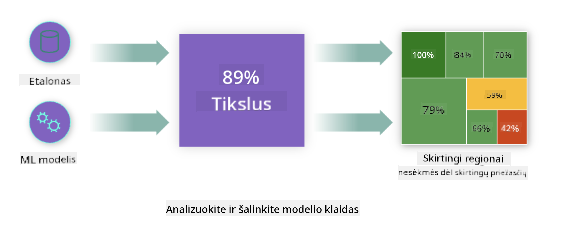
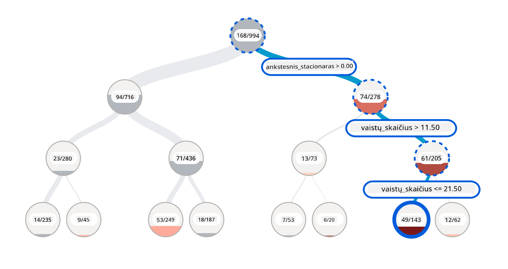
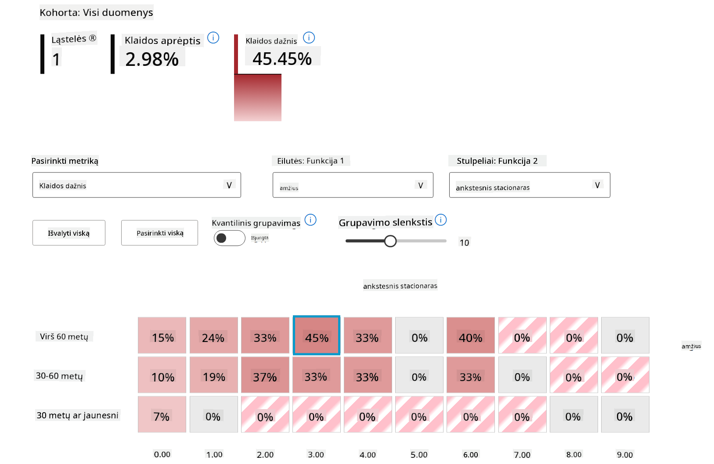
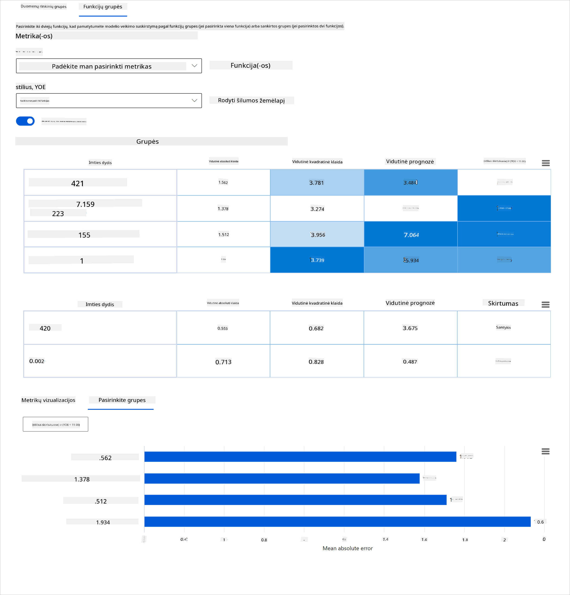
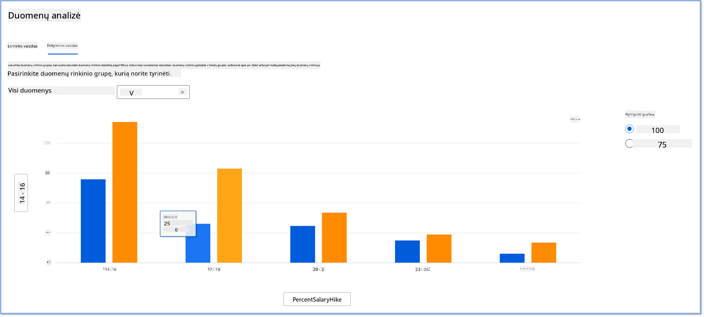
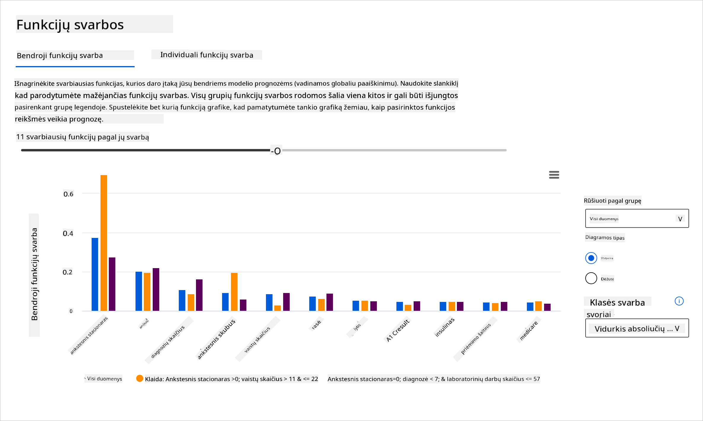

<!--
CO_OP_TRANSLATOR_METADATA:
{
  "original_hash": "ba0f6e1019351351c8ee4c92867b6a0b",
  "translation_date": "2025-09-03T17:27:36+00:00",
  "source_file": "9-Real-World/2-Debugging-ML-Models/README.md",
  "language_code": "lt"
}
-->
# Postscriptas: Modelių derinimas mašininio mokymosi srityje naudojant atsakingos AI prietaisų skydelio komponentus

## [Prieš paskaitą pateikiamas testas](https://gray-sand-07a10f403.1.azurestaticapps.net/quiz/5/)

## Įvadas

Mašininis mokymasis daro įtaką mūsų kasdieniam gyvenimui. Dirbtinis intelektas (AI) vis dažniau naudojamas svarbiausiose sistemose, kurios veikia tiek mus kaip individą, tiek visuomenę – nuo sveikatos priežiūros, finansų, švietimo iki įdarbinimo. Pavyzdžiui, sistemos ir modeliai dalyvauja kasdieniuose sprendimų priėmimo procesuose, tokiuose kaip sveikatos diagnozės ar sukčiavimo aptikimas. Dėl šių technologijų pažangos ir spartaus jų pritaikymo kyla nauji visuomenės lūkesčiai, o kartu ir reguliavimo poreikis. Nuolat matome sritis, kuriose AI sistemos neatitinka lūkesčių, kelia naujus iššūkius, o vyriausybės pradeda reguliuoti AI sprendimus. Todėl svarbu analizuoti šiuos modelius, kad jie užtikrintų teisingus, patikimus, įtraukius, skaidrius ir atsakingus rezultatus visiems.

Šioje mokymo programoje aptarsime praktinius įrankius, kurie gali būti naudojami siekiant įvertinti, ar modelis turi atsakingo AI problemų. Tradiciniai mašininio mokymosi derinimo metodai dažniausiai grindžiami kiekybiniais skaičiavimais, tokiais kaip bendras tikslumas ar vidutinė klaidų suma. Įsivaizduokite, kas gali nutikti, jei duomenys, kuriuos naudojate modelių kūrimui, neturi tam tikrų demografinių grupių, tokių kaip rasė, lytis, politinės pažiūros, religija, arba neproporcingai atspindi šias grupes. O kas, jei modelio rezultatai yra interpretuojami taip, kad palankiau vertintų tam tikrą demografinę grupę? Tai gali sukelti per didelį arba per mažą jautrių savybių grupių atstovavimą, dėl ko modelis tampa neteisingas, neįtraukus ar nepatikimas. Be to, mašininio mokymosi modeliai dažnai laikomi „juodosiomis dėžėmis“, todėl sunku suprasti ir paaiškinti, kas lemia modelio prognozes. Šie iššūkiai kyla duomenų mokslininkams ir AI kūrėjams, kai jie neturi tinkamų įrankių modelio teisingumui ar patikimumui įvertinti.

Šioje pamokoje sužinosite, kaip derinti savo modelius naudojant:

- **Klaidų analizę**: nustatyti, kur jūsų duomenų pasiskirstyme modelis turi didelį klaidų rodiklį.
- **Modelio apžvalgą**: atlikti lyginamąją analizę tarp skirtingų duomenų grupių, kad būtų galima aptikti modelio veikimo rodiklių skirtumus.
- **Duomenų analizę**: tirti, kur gali būti per didelis arba per mažas duomenų atstovavimas, kuris gali iškreipti modelį, kad jis palankiau vertintų vieną demografinę grupę nei kitą.
- **Savybių svarbą**: suprasti, kurios savybės lemia modelio prognozes globaliu ar lokaliu lygiu.

## Būtinos žinios

Prieš pradedant, rekomenduojame peržiūrėti [Atsakingo AI įrankius kūrėjams](https://www.microsoft.com/ai/ai-lab-responsible-ai-dashboard)

> 

## Klaidų analizė

Tradiciniai modelio veikimo rodikliai, naudojami tikslumui matuoti, dažniausiai grindžiami teisingų ir neteisingų prognozių skaičiavimais. Pavyzdžiui, nustatyti, kad modelis yra tikslus 89% atvejų su klaidų suma 0,001, gali būti laikoma geru veikimu. Tačiau klaidos dažnai nėra tolygiai pasiskirsčiusios jūsų pagrindiniuose duomenyse. Galite gauti 89% modelio tikslumo rodiklį, bet pastebėti, kad tam tikrose duomenų srityse modelis klysta 42% atvejų. Šių klaidų pasiskirstymo tam tikrose duomenų grupėse pasekmės gali sukelti teisingumo ar patikimumo problemų. Svarbu suprasti, kuriose srityse modelis veikia gerai, o kur ne. Duomenų sritys, kuriose modelis turi daug netikslumų, gali pasirodyti esą svarbios demografinės grupės.

Klaidų analizės komponentas RAI prietaisų skydelyje iliustruoja, kaip modelio klaidos pasiskirsto įvairiose grupėse, naudojant medžio vizualizaciją. Tai naudinga nustatant savybes ar sritis, kuriose jūsų duomenų rinkinyje yra didelis klaidų rodiklis. Matydami, iš kur kyla daugiausia modelio netikslumų, galite pradėti tirti pagrindinę priežastį. Taip pat galite sukurti duomenų grupes, kad atliktumėte analizę. Šios duomenų grupės padeda derinimo procese nustatyti, kodėl modelio veikimas yra geras vienoje grupėje, bet klaidingas kitoje.

Vizualiniai indikatoriai medžio žemėlapyje padeda greičiau nustatyti problemų sritis. Pavyzdžiui, kuo tamsesnė raudona spalva medžio mazge, tuo didesnis klaidų rodiklis.

Šilumos žemėlapis yra dar viena vizualizacijos funkcija, kurią vartotojai gali naudoti tiriant klaidų rodiklį pagal vieną ar dvi savybes, kad nustatytų modelio klaidų priežastis visame duomenų rinkinyje ar grupėse.

Naudokite klaidų analizę, kai reikia:

* Giliai suprasti, kaip modelio klaidos pasiskirsto duomenų rinkinyje ir pagal kelias įvesties bei savybių dimensijas.
* Suskaidyti bendrus veikimo rodiklius, kad automatiškai aptiktumėte klaidingas grupes ir informuotumėte apie tikslines šalinimo priemones.

## Modelio apžvalga

Mašininio mokymosi modelio veikimo vertinimas reikalauja holistinio jo elgsenos supratimo. Tai galima pasiekti peržiūrint daugiau nei vieną rodiklį, tokius kaip klaidų rodiklis, tikslumas, atšaukimas, tikslumas ar MAE (vidutinė absoliuti klaida), kad būtų galima aptikti veikimo rodiklių skirtumus. Vienas veikimo rodiklis gali atrodyti puikiai, tačiau netikslumai gali būti atskleisti kitame rodiklyje. Be to, rodiklių palyginimas visame duomenų rinkinyje ar grupėse padeda atskleisti, kur modelis veikia gerai, o kur ne. Tai ypač svarbu matant modelio veikimą tarp jautrių ir nejautrių savybių (pvz., paciento rasė, lytis ar amžius), kad būtų galima atskleisti galimą modelio neteisingumą. Pavyzdžiui, atradus, kad modelis yra klaidingesnis grupėje, kurioje yra jautrios savybės, galima atskleisti galimą modelio neteisingumą.

Modelio apžvalgos komponentas RAI prietaisų skydelyje padeda ne tik analizuoti veikimo rodiklius duomenų atstovavimo grupėje, bet ir suteikia vartotojams galimybę palyginti modelio elgseną skirtingose grupėse.

Komponento savybių pagrindu atliekamos analizės funkcija leidžia vartotojams susiaurinti duomenų pogrupius tam tikroje savybėje, kad būtų galima nustatyti anomalijas detaliu lygiu. Pavyzdžiui, prietaisų skydelyje yra įmontuotas intelektas, kuris automatiškai generuoja grupes pagal vartotojo pasirinktą savybę (pvz., *"time_in_hospital < 3"* arba *"time_in_hospital >= 7"*). Tai leidžia vartotojui izoliuoti tam tikrą savybę iš didesnės duomenų grupės, kad pamatytų, ar ji yra pagrindinis modelio klaidingų rezultatų veiksnys.

Modelio apžvalgos komponentas palaiko dviejų klasių skirtumų rodiklius:

**Skirtumai modelio veikime**: Šie rodikliai apskaičiuoja skirtumus (skirtumą) pasirinktų veikimo rodiklių vertėse tarp duomenų pogrupių. Štai keletas pavyzdžių:

* Tikslumo rodiklio skirtumas
* Klaidos rodiklio skirtumas
* Tikslumo skirtumas
* Atšaukimo skirtumas
* Vidutinės absoliučios klaidos (MAE) skirtumas

**Skirtumai atrankos rodiklyje**: Šis rodiklis apima skirtumą atrankos rodiklyje (palankios prognozės) tarp pogrupių. Pavyzdžiui, tai gali būti paskolos patvirtinimo rodiklių skirtumas. Atrankos rodiklis reiškia duomenų taškų dalį kiekvienoje klasėje, klasifikuotą kaip 1 (dvejetainėje klasifikacijoje) arba prognozės verčių pasiskirstymą (regresijoje).

## Duomenų analizė

> "Jei pakankamai ilgai kankinsite duomenis, jie prisipažins bet ką" - Ronald Coase

Šis teiginys skamba ekstremaliai, tačiau tiesa, kad duomenis galima manipuliuoti, kad jie palaikytų bet kokią išvadą. Tokia manipuliacija kartais gali įvykti netyčia. Kaip žmonės, mes visi turime šališkumą, ir dažnai sunku sąmoningai žinoti, kada įvedame šališkumą į duomenis. Užtikrinti teisingumą AI ir mašininio mokymosi srityje išlieka sudėtingas iššūkis.

Duomenys yra didelė akloji zona tradiciniams modelio veikimo rodikliams. Jūs galite turėti aukštus tikslumo rodiklius, tačiau tai ne visada atspindi pagrindinį duomenų šališkumą, kuris gali būti jūsų duomenų rinkinyje. Pavyzdžiui, jei darbuotojų duomenų rinkinyje yra 27% moterų vadovaujančiose pareigose įmonėje ir 73% vyrų tame pačiame lygyje, darbo skelbimų AI modelis, apmokytas pagal šiuos duomenis, gali daugiausia taikyti vyrų auditoriją aukšto lygio darbo pozicijoms. Šis duomenų disbalansas iškreipė modelio prognozę, kad ji palankiau vertintų vieną lytį. Tai atskleidžia teisingumo problemą, kurioje yra lyties šališkumas AI modelyje.

Duomenų analizės komponentas RAI prietaisų skydelyje padeda nustatyti sritis, kuriose duomenų rinkinyje yra per didelis arba per mažas atstovavimas. Jis padeda vartotojams diagnozuoti klaidų ir teisingumo problemų, atsiradusių dėl duomenų disbalanso ar tam tikros duomenų grupės atstovavimo trūkumo, pagrindinę priežastį. Tai suteikia vartotojams galimybę vizualizuoti duomenų rinkinius pagal prognozuotus ir faktinius rezultatus, klaidų grupes ir specifines savybes. Kartais atradus nepakankamai atstovaujamą duomenų grupę taip pat galima atskleisti, kad modelis nepakankamai mokosi, todėl yra didelis netikslumas. Modelis, turintis duomenų šališkumą, yra ne tik teisingumo problema, bet ir rodo, kad modelis nėra įtraukus ar patikimas.

Naudokite duomenų analizę, kai reikia:

* Tyrinėti savo duomenų rinkinio statistiką, pasirinkdami skirtingus filtrus, kad suskaidytumėte duomenis į skirtingas dimensijas (dar vadinamas grupėmis).
* Suprasti savo duomenų rinkinio pasiskirstymą skirtingose grupėse ir savybių grupėse.
* Nustatyti, ar jūsų išvados, susijusios su teisingumu, klaidų analize ir priežastiniu ryšiu (gautos iš kitų prietaisų skydelio komponentų), yra jūsų duomenų rinkinio pasiskirstymo rezultatas.
* Nuspręsti, kuriose srityse rinkti daugiau duomenų, kad būtų sumažintos klaidos, atsirandančios dėl atstovavimo problemų, etikečių triukšmo, savybių triukšmo, etikečių šališkumo ir panašių veiksnių.

## Modelio interpretacija

Mašininio mokymosi modeliai dažnai laikomi „juodosiomis dėžėmis“. Suprasti, kurios pagrindinės duomenų savybės lemia modelio prognozę, gali būti sudėtinga. Svarbu suteikti skaidrumą, kodėl modelis daro tam tikrą prognozę. Pavyzdžiui, jei AI sistema prognozuoja, kad diabetu sergantis pacientas rizikuoja būti pakartotinai hospitalizuotas per mažiau nei 30 dienų, ji turėtų pateikti palaikančius duomenis, kurie lėmė šią prognozę. Turint palaikančius duomenų indikatorius, atsiranda skaidrumas, kuris padeda gydytojams ar ligoninėms priimti gerai pagrįstus sprendimus. Be to, galimybė paaiškinti, kodėl modelis padarė prognozę konkrečiam pacientui, užtikrina atsakomybę pagal sveikatos reguliavimo reikalavimus. Naudojant mašininio mokymosi modelius, kurie daro įtaką žmonių gyvenimui, būtina suprasti ir paaiškinti, kas lemia modelio elgseną. Modelio paaiškinamumas ir interpretacija padeda atsakyti į klausimus tokiose situacijose kaip:

* Modelio derinimas: Kodėl mano modelis padarė šią klaidą? Kaip galiu pagerinti savo modelį?
* Žmogaus ir AI bendradarbiavimas: Kaip galiu suprasti ir pasitikėti modelio sprendimais?
* Reguliavimo atitiktis: Ar mano modelis atitinka teisės reikalavimus?

Savybių svarbos komponentas RAI prietaisų skydelyje padeda derinti ir gauti išsamų supratimą, kaip modelis daro prognozes. Tai taip pat naudingas įrankis mašininio mokymosi specialistams ir sprendimų priėmėjams paaiškinti ir parodyti įrodymus apie savybes, kurios daro įtaką modelio elgsenai, siekiant atitikti reguliavimo reikalavimus. Vartotojai gali tirti tiek globalius, tiek lokalius paaiškinimus, kad patvirtintų, kurios savybės lemia modelio prognozę. Globalūs paaiškinimai pateikia pagrindines savybes, kurios paveikė modelio bendrą prognozę. Lokaliniai paaiškinimai rodo, kurios savybės lėmė modelio prognozę konkrečiu atveju. Galimybė vertinti lokalinius paaiškinimus taip pat naudinga derinant ar audituojant konkretų atvejį, siekiant geriau suprasti ir interpretuoti, kodėl modelis padarė tikslią ar netikslią prognozę.

* Globalūs paaiškinimai: Pavyzdžiui, kokios savybės daro įtaką diabeto hospitalizacijos modelio bendram el
- **Per didelė arba per maža reprezentacija**. Idėja yra ta, kad tam tikra grupė nėra matoma tam tikroje profesijoje, o bet kokia paslauga ar funkcija, kuri toliau tai skatina, prisideda prie žalos.

### Azure RAI prietaisų skydelis

[Azure RAI prietaisų skydelis](https://learn.microsoft.com/en-us/azure/machine-learning/concept-responsible-ai-dashboard?WT.mc_id=aiml-90525-ruyakubu) yra sukurtas remiantis atvirojo kodo įrankiais, kuriuos sukūrė pirmaujančios akademinės institucijos ir organizacijos, įskaitant Microsoft. Šie įrankiai yra labai svarbūs duomenų mokslininkams ir AI kūrėjams, siekiant geriau suprasti modelio elgseną, aptikti ir sumažinti nepageidaujamus AI modelių klausimus.

- Sužinokite, kaip naudoti skirtingus komponentus, peržiūrėdami RAI prietaisų skydelio [dokumentaciją.](https://learn.microsoft.com/en-us/azure/machine-learning/how-to-responsible-ai-dashboard?WT.mc_id=aiml-90525-ruyakubu)

- Peržiūrėkite keletą RAI prietaisų skydelio [pavyzdinių užrašų knygelių](https://github.com/Azure/RAI-vNext-Preview/tree/main/examples/notebooks), skirtų atsakingesnių AI scenarijų derinimui Azure Machine Learning aplinkoje.

---
## 🚀 Iššūkis

Kad statistiniai ar duomenų šališkumai nebūtų įtraukti nuo pat pradžių, turėtume:

- užtikrinti, kad sistemų kūrime dalyvautų žmonės iš įvairių aplinkybių ir perspektyvų
- investuoti į duomenų rinkinius, kurie atspindi mūsų visuomenės įvairovę
- kurti geresnius metodus šališkumui aptikti ir ištaisyti, kai jis pasireiškia

Pagalvokite apie realaus gyvenimo scenarijus, kur modelių kūrime ir naudojime akivaizdus neteisingumas. Ką dar turėtume apsvarstyti?

## [Po paskaitos testas](https://gray-sand-07a10f403.1.azurestaticapps.net/quiz/6/)
## Peržiūra ir savarankiškas mokymasis

Šioje pamokoje sužinojote keletą praktinių įrankių, kaip įtraukti atsakingą AI į mašininį mokymąsi.

Žiūrėkite šį seminarą, kad giliau pasinertumėte į temas:

- Atsakingo AI prietaisų skydelis: Vieno langelio principas RAI praktiniam įgyvendinimui, Besmira Nushi ir Mehrnoosh Sameki

> 🎥 Spustelėkite aukščiau esančią nuotrauką, kad peržiūrėtumėte vaizdo įrašą: Atsakingo AI prietaisų skydelis: Vieno langelio principas RAI praktiniam įgyvendinimui, Besmira Nushi ir Mehrnoosh Sameki

Naudokitės šiais šaltiniais, kad sužinotumėte daugiau apie atsakingą AI ir kaip kurti patikimesnius modelius:

- Microsoft RAI prietaisų skydelio įrankiai ML modelių derinimui: [Atsakingo AI įrankių šaltiniai](https://aka.ms/rai-dashboard)

- Susipažinkite su Atsakingo AI įrankių rinkiniu: [Github](https://github.com/microsoft/responsible-ai-toolbox)

- Microsoft RAI išteklių centras: [Atsakingo AI ištekliai – Microsoft AI](https://www.microsoft.com/ai/responsible-ai-resources?activetab=pivot1%3aprimaryr4)

- Microsoft FATE tyrimų grupė: [FATE: Sąžiningumas, Atsakomybė, Skaidrumas ir Etika AI - Microsoft Research](https://www.microsoft.com/research/theme/fate/)

## Užduotis

[Susipažinkite su RAI prietaisų skydeliu](assignment.md)

---

**Atsakomybės apribojimas**:  
Šis dokumentas buvo išverstas naudojant AI vertimo paslaugą [Co-op Translator](https://github.com/Azure/co-op-translator). Nors siekiame tikslumo, prašome atkreipti dėmesį, kad automatiniai vertimai gali turėti klaidų ar netikslumų. Originalus dokumentas jo gimtąja kalba turėtų būti laikomas autoritetingu šaltiniu. Kritinei informacijai rekomenduojama profesionali žmogaus vertimo paslauga. Mes neprisiimame atsakomybės už nesusipratimus ar klaidingus interpretavimus, atsiradusius dėl šio vertimo naudojimo.