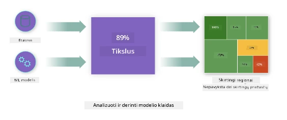
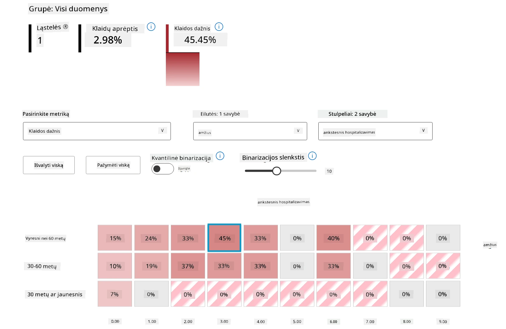
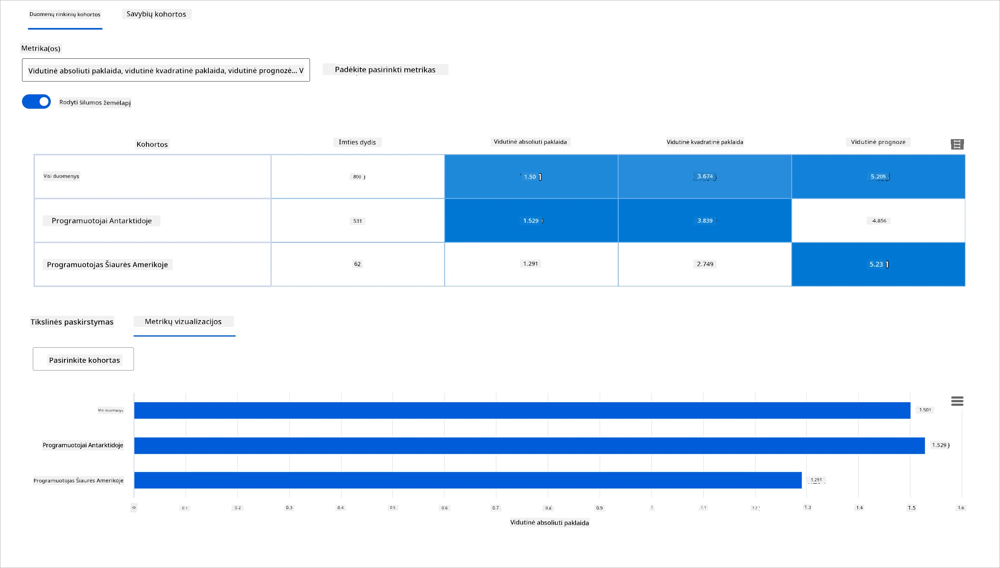
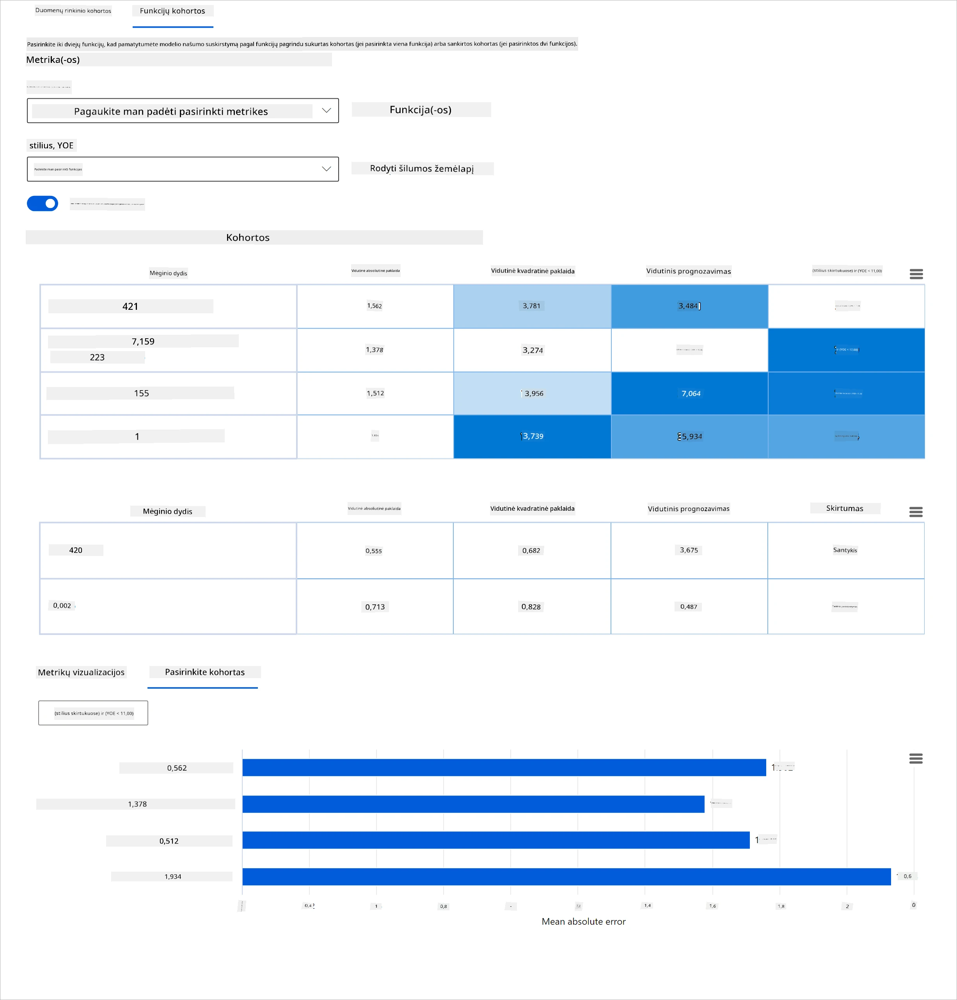
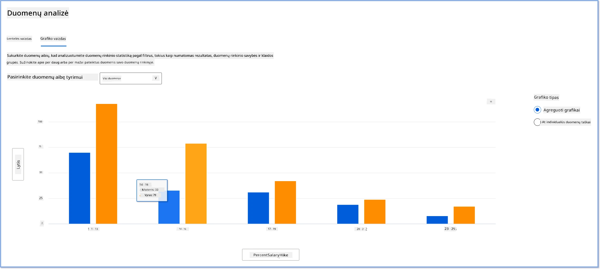
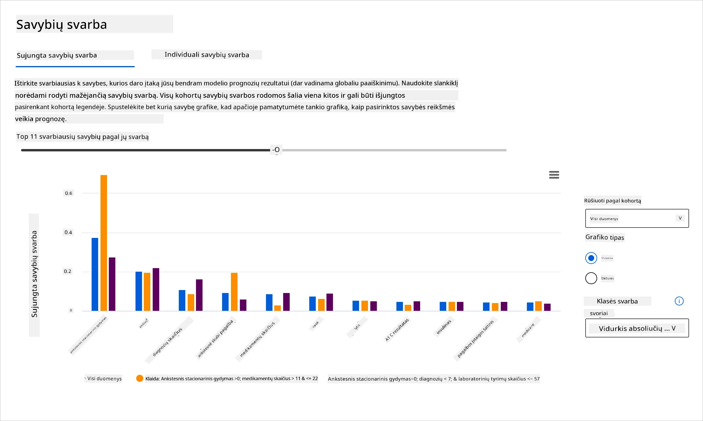
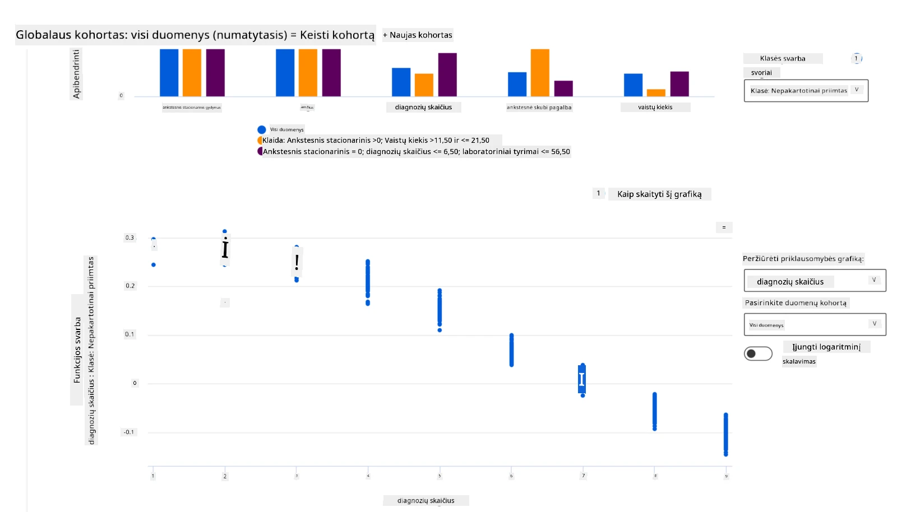

# Priedas: Modelio derinimas mašininio mokymosi srityje naudojant Atsakingos AI skydelio komponentus
 

## [Prieš paskaitą testas](https://ff-quizzes.netlify.app/en/ml/)
 
## Įvadas

Mašininis mokymasis veikia mūsų kasdienį gyvenimą. Dirbtinis intelektas įsilieja į kai kurias svarbiausias sistemas, kurios veikia mus kaip individų ir kaip visuomenę, nuo sveikatos priežiūros, finansų, švietimo iki užimtumo. Pavyzdžiui, sistemos ir modeliai dalyvauja kasdieniniame sprendimų priėmime, tokiose užduotyse kaip sveikatos diagnostika ar sukčiavimo aptikimas. Todėl dirbtinio intelekto pažanga kartu su sparčiu jos diegimu susiduria su kintančiomis visuomenės lūkesčiais ir augančia reglamentacija. Nuolat matome sritis, kuriose AI sistemos nesugeba patenkinti lūkesčius; jos atskleidžia naujus iššūkius; o vyriausybės pradeda reglamentuoti AI sprendimus. Todėl svarbu, kad šie modeliai būtų analizuojami siekiant pateikti sąžiningus, patikimus, įtraukius, skaidrius ir atsakingus rezultatus visiems.

Šiame mokymo plane apžvelgsime praktinius įrankius, kuriuos galima naudoti norint įvertinti, ar modelis turi atsakingo AI problemas. Tradicinės mašininio mokymosi derinimo technikos dažniausiai yra grindžiamos kiekybiniais skaičiavimais, tokiais kaip apibendrintas tikslumas arba vidutinė klaidos nuostolio reikšmė. Įsivaizduokite, kas gali nutikti, jei duomenys, kuriais naudojatės kurdami modelius, neapima tam tikrų demografinių grupių, pavyzdžiui, rasės, lyties, politinių pažiūrų ar religijos, arba neproporcingai atstovauja tokias grupes. O kas jei modelio rezultatai yra interpretuojami taip, kad būtų palankūs kai kuriai demografiniai grupei? Tai gali sukelti pernelyg didelį arba nepakankamą šių jautrių požymių grupių atstovavimą, dėl ko kyla sąžiningumo, įtraukimo ar patikimumo problemos. Kitas faktorius yra tas, kad mašininio mokymosi modeliai dažnai laikomi juodosiomis dėžėmis, dėl ko sunku suprasti ir paaiškinti, kas lemia modelio prognozę. Visos šios problemos kyla duomenų mokslininkams ir AI kūrėjams, kai jie neturi tinkamų įrankių modelio derinimui ir sąžiningumo ar patikimumo vertinimui.

Šioje pamokoje sužinosite apie modelių derinimą naudojant:

- **Klaidų analizę**: nustatyti, kur jūsų duomenų pasiskirstyme modelis turi didelį klaidų dažnį.
- **Modelio apžvalgą**: atlikti palyginamąją analizę tarp skirtingų duomenų kohortų, kad būtų atrastos modelio našumo metrikų skirtumai.
- **Duomenų analizę**: tirti, kur gali būti pernelyg daug arba per mažai tam tikrų duomenų, kas gali iškreipti modelį palankiai nuteikiant prieš vieną demografinę grupę kitos sąskaita.
- **Požymių svarbą**: suprasti, kokie požymiai lemia modelio prognozes globaliu ar lokaliu lygiu.

## Reikalavimai

Prieš tęsiant, peržiūrėkite [Atsakingo AI įrankiai kūrėjams](https://www.microsoft.com/ai/ai-lab-responsible-ai-dashboard)

> 

## Klaidų analizė

Tradicinės modelio darbo rodiklių metrikos, matuojant tikslumą, dažniausiai grindžiamos teisingų ir neteisingų prognozių skaičiavimais. Pavyzdžiui, modelio tikslumas 89 % su klaidos nuostoliu 0,001 gali būti vertinamas kaip geras rezultatas. Klaidos dažnai nėra vienodai pasiskirsčiusios duomenų rinkinyje. Galite turėti 89 % tikslumą, bet sužinoti, kad tam tikrose duomenų srityse modelis nepavyksta net 42 % atvejų. Tokie klaidų pasiskirstymo modeliai tam tikrose duomenų grupėse gali sukelti sąžiningumo arba patikimumo problemas. Svarbu suprasti sritis, kuriose modelis veikia gerai arba blogai. Duomenų sritys, kur modelis turi daug netikslumų, gali būti reikšminga duomenų demografinė grupė.  

Klaidų analizės komponentas Atsakingo AI skydelyje rodo, kaip modelio klaidos pasiskirsčiusios tarp įvairių kohortų medžio vizualizacijoje. Tai naudinga nustatant požymius ar sritis, kuriose duomenų rinkinyje yra didelis klaidų dažnis. Matydami, iš kur daugiausia kyla netikslumai, galite pradėti tirti pagrindines priežastis. Taip pat galite sukurti duomenų kohortas analizės atlikimui. Šios kohortos padeda derinimo procese suprasti, kodėl modelio našumas yra geras vienoje kohortoje, bet klaidingas kitoje.   

Vizualiniai indikatoriai medžio žemėlapyje padeda greičiau surasti problemines sritis. Pavyzdžiui, kuo tamsesnė raudonos spalvos atspalvio medžio šaka, tuo didesnis klaidų dažnumas.  

Karštinių žemėlapis yra dar viena vizualizavimo galimybė, kuri leidžia vartotojams tirti klaidų dažnį, naudojant vieną arba du požymius ir taip rasti modelio klaidų priežastis visame duomenų rinkinyje ar kohortose.

Naudokite klaidų analizę, kai jums reikia:

* Giliai suprasti, kaip modelio klaidos pasiskirsčiusios duomenų rinkinyje ir tarp kelių įvesties bei požymių dimensijų.
* Išskaidyti bendrą našumo metriką, kad automatiškai būtų atrastos klaidų turinčios kohortos ir būtų galima planuoti tikslingas pataisymo priemones.

## Modelio apžvalga

Norint įvertinti mašininio mokymosi modelio našumą, reikia holistiškai suprasti jo elgseną. Tai galima pasiekti peržiūrint ne tik vieną metriką, pavyzdžiui, klaidų dažnį, tikslumą, atgaminimą, tikslumą ar vidutinę absoliučią klaidą (MAE), ir ieškant skirtumų tarp našumo metrikoje. Viena metrika gali atrodyti puikiai, bet klaidos gali būti atskleistos kitoje. Be to, lyginant šias metrikas tarp viso duomenų rinkinio ar kohortų, galima pamatyti, kur modelis veikia gerai, o kur ne. Tai ypač svarbu matant modelio našumą tarp jautrių ir nejautrių požymių (pvz., paciento rasės, lyties ar amžiaus), kad būtų atskleista galimai nelygi modelio veikla. Pavyzdžiui, jei modelis klaidingesnis kohortoje, kur yra jautrūs požymiai, tai gali atskleisti neteisingumą.

Atsakingo AI skydelio Modelio apžvalgos komponentas padeda ne tik analizuoti našumo metrikas pagal duomenų kohortas, bet ir suteikia vartotojams galimybę palyginti modelio elgseną tarp skirtingų kohortų.

Komponento funkcija, leidžianti analizuoti rūšiuojant pagal požymius, leidžia vartotojams susiaurinti duomenų pogrupius pagal tam tikrą požymį ir nustatyti anomalijas detaliau. Pavyzdžiui, skydelyje yra integruotas įdirbis, automatiškai generuojantis kohortas pagal vartotojo pasirinktą požymį (pvz., *"time_in_hospital < 3"* arba *"time_in_hospital >= 7"*). Tai leidžia atskirti tam tikrą požymį iš didesnės grupės ir pažiūrėti, ar jis yra lemiamas veiksnys modelio klaidų prognozėse.

Modelio apžvalgos komponentas palaiko dvi skirtumų metrikų klases:

**Modelio našumo skirtumu**: Ši metrikų grupė apskaičiuoja skirtumus (nuokrypius) pasirinkto našumo rodiklio reikšmėse tarp duomenų pogrupių. Štai keletas pavyzdžių:

* Tikslumo skirtumas
* Klaidos dažnio skirtumas
* Tikslumo (precision) skirtumas
* Atgaminimo (recall) skirtumas
* Vidutinės absoliučios klaidos (MAE) skirtumas

**Pasirinkimo dažnio skirtumas**: Ši metrika nurodo skirtumą pasirinkimo dažnyje (palankios prognozės) tarp pogrupių. Pavyzdys būtų skirtumas patvirtinant paskolas. Pasirinkimo dažnis reiškia duomenų taškų, priskirtų klasei 1 (dvigubos klasifikacijos atveju) arba paskirstytų pagal prognozes (regresijoje), dalį kiekvienoje klasėje.

## Duomenų analizė

> „Jei ilgai kankinsi duomenis, jie prisipažins bet kam“ – Ronaldas Coase

Ši frazė skamba radikaliai, bet tiesa yra ta, kad duomenis galima manipuliuoti, siekiant paremti bet kokias išvadas. Kartais tokia manipuliacija gali būti netyčinė. Kaip žmonės, mes visi turime savo šališkumų, ir dažnai sunku sąmoningai pastebėti, kai įtraukiame šališkumą į duomenis. Užtikrinti sąžiningumą AI ir mašininio mokymosi srityse išlieka sudėtinga užduotis.

Duomenys yra didelė aklavietė tradicinėms modelio darbo metrikoms. Galite turėti aukštus tikslumo rodiklius, bet tai ne visada atspindi gilesnį duomenų rinkinio šališkumą. Pavyzdžiui, jei darbuotojų duomenų rinkinyje 27 % vyrų užima vykdomąsias pareigas, o 73 % moterų yra toje pačioje pozicijoje, dirbtinio intelekto modelis, mokytas pagal šiuos duomenis, gali pagrinde taikyti savo skelbimus vyrams dėl aukštesnių pareigų. Ši duomenų disbalanso problema iškreipia modelio prognozes, leidžiant joms būti palankia vienam lyčiui. Tai atskleidžia sąžiningumo problemą, kai AI modelyje egzistuoja lyties šališkumas.

Duomenų analizės komponentas Atsakingo AI skydelyje padeda identifikuoti sritis, kuriose duomenų rinkinyje yra per didelis arba per mažas tam tikrų grupių atstovavimas. Tai leidžia vartotojams diagnozuoti klaidų ir sąžiningumo problemas, kilusias dėl duomenų disbalanso arba tam tikrų grupių trūkumo. Komponentas suteikia galimybę vizualizuoti duomenų rinkinius pagal prognozuotus ir faktinius rezultatus, klaidų grupes ir konkrečius požymius. Kartais atradus nepakankamai atstovaujamą grupę, galima suprasti, kad modelis blogai mokosi, stebint didelį netikslumų kiekį. Modelis, turintis duomenų šališkumą, yra ne tik sąžiningumo problema, bet ir rodo, kad modelis nėra įtraukiantis ar patikimas.

Naudokite duomenų analizę, kai reikia:

* Tirti duomenų rinkinio statistiką, pasirenkant skirtingus filtrus, kad jūsų duomenys būtų suskirstyti į skirtingas dimensijas (dar vadinamas kohortomis).
* Suprasti duomenų paskirstymą skirtingose kohortose ir požymių grupėse.
* Nustatyti, ar jūsų išvados apie sąžiningumą, klaidų analizę ir priežastingumą (gautos iš kitų skydelio komponentų) yra duomenų paskirstymo rezultatas.
* Nuspręsti, kuriose srityse reikia rinkti daugiau duomenų, kad būtų sumažintos klaidos, kylančios dėl atstovavimo problemų, žymėjimo triukšmo, požymių triukšmo, žymėjimo šališkumo ir panašių veiksnių.

## Modelio aiškinamumas

Mašininio mokymosi modeliai dažnai laikomi juodosiomis dėžėmis. Sunku suprasti, kokie svarbiausi duomenų požymiai lemia modelio prognozę. Svarbu užtikrinti skaidrumą, kodėl modelis daro tam tikrą prognozę. Pvz., jei AI sistema prognozuoja, kad diabetu sergantis pacientas bus vėl priimtas į ligoninę per mažiau nei 30 dienų, ji turi pateikti palaikomus duomenis, kurie lėmė šią prognozę. Turint tokius duomenų indikatorius, skaidrumas padeda klinikams ar ligoninėms priimti gerai informuotus sprendimus. Be to, galimybė paaiškinti, kodėl modelis pateikė prognozę konkrečiam pacientui, užtikrina atsakomybę pagal sveikatos reguliavimą. Naudojant mašininio mokymosi modelius žmonių gyvenime, itin svarbu suprasti ir paaiškinti, kas įtakoja modelio elgseną. Modelio paaiškinamumas ir aiškinamumas padeda atsakyti į klausimus tokiose situacijose kaip:

* Modelio derinimas: kodėl mano modelis padarė šią klaidą? Kaip galiu patobulinti modelį?
* Žmogaus ir AI bendradarbiavimas: kaip galiu suprasti ir pasitikėti modelio sprendimais?
* Reguliacinis atitikimas: ar modelis atitinka teisės reikalavimus?

Atsakingo AI skydelio Požymių svarbos komponentas padeda derinti ir išsamiai suprasti, kaip modelis priima sprendimus. Tai taip pat naudinga mašininio mokymosi specialistams ir sprendimų priėmėjams, siekiant paaiškinti ir pateikti įrodymus, kokie požymiai veikia modelio elgseną dėl reguliavimo atitikimo. Toliau vartotojai gali tirti tiek globalius, tiek lokalius paaiškinimus, kad patvirtintų, kokie požymiai lemia modelio prognozę. Globalūs paaiškinimai pateikia svarbiausių požymių, kurie turėjo poveikį modeliui apskritai, sąrašą. Lokalieji paaiškinimai rodo, kurie požymiai nulėmė modelio prognozę konkrečiam atvejui. Lokaliųjų paaiškinimų vertinimas taip pat naudingas derinant ar tikrinant specifinį atvejį, siekiant geriau suprasti ir paaiškinti, kodėl modelis padarė tikslią ar netikslią prognozę.

* Globalūs paaiškinimai: pavyzdžiui, kokie požymiai veikia bendrą diabeto ligoninės pakartotinio priėmimo modelio elgseną?
* Lokalieji paaiškinimai: pavyzdžiui, kodėl diabetu sergantis pacientas, vyresnis nei 60 m., turintis ankstesnių hospitalizacijų, buvo prognozuotas būti arba nebūti priimtas vėl per 30 dienų?

Derinant modelio našumą skirtingose kohortose, Požymių svarbos komponentas rodo, kokį poveikį požymis turi tarp kohortų. Tai padeda atskleisti anomalijas, lyginant požymių įtaką modelio klaidingoms prognozėms. Komponentas gali parodyti, kurios požymių reikšmės teigiamai arba neigiamai paveikė modelio rezultatą. Pavyzdžiui, jei modelis padarė netikslią prognozę, komponentas leidžia gilintis ir nustatyti, kurie požymiai ar požymių reikšmės nulėmė prognozę. Toks detalus lygis naudingas ne tik derinimui, bet ir skaidrumui bei atsakomybės užtikrinimui auditavimo metu. Galiausiai, komponentas gali padėti atpažinti sąžiningumo problemas. Pvz., jei jautrus požymis, kaip etninė kilmė ar lytis, yra labai svarbus modelio prognozei, tai gali būti rasinės arba lyties šališkumo ženklas modelyje.

Naudokite aiškinamumą, kai jums reikia:

* Nustatyti, kiek patikimos jūsų AI sistemos prognozės, suprantant, kurie požymiai yra svarbiausi prognozėms.
* Pradėti modelio derinimą, pirmiausia jį suprantant ir nustatant, ar modelis naudoja sveikus požymius, ar tik klaidingus koreliacijų ryšius.
* Atpažinti galimus neteisingumo šaltinius, suprantant, ar modelis savo prognozes grindžia jautriais požymiais ar tais, kurie labai susiję su jais.
* Stiprinti vartotojų pasitikėjimą modelio sprendimais, generuojant lokalius paaiškinimus, kurie iliustruoja jų rezultatus.
* Atlikti reguliavimo auditą AI sistemai, kad būtų patvirtinti modeliai ir stebimas modelio sprendimų poveikis žmonėms.

## Išvados

Visi Atsakingo AI skydelio komponentai yra praktiški įrankiai, padedantys kurti mašininio mokymosi modelius, kurie yra mažiau žalingi ir patikimesni visuomenei. Tai gerina žmogaus teisių apsaugą nuo grėsmių; diskriminacijos ar tam tikrų grupių pašalinimo iš gyvenimo galimybių; taip pat fizinės ar psichologinės žalos rizikos mažinimą. Tai taip pat leidžia kurti pasitikėjimą modelio sprendimais generuojant lokalius paaiškinimus, kurie iliustruoja jų rezultatus. Kai kurios galimos žalos gali būti klasifikuojamos kaip:

- **Paskirstymas**, pavyzdžiui, kai viena lytis ar etninė grupė yra palankesnė už kitą.
- **Paslaugos kokybė**. Jei mokote duomenis vienai konkrečiai situacijai, bet realybė yra kur kas sudėtingesnė, tai lemia prastą paslaugos kokybę.
- **Stereotipizavimas**. Susiejiant tam tikrą grupę su iš anksto priskirtais atributais.

- **Niekolinimas**. Neteisingai kritikuoti ir pažymėti ką nors ar ką nors.
- **Perdėta arba nepakankama atstovavimas**. Idėja yra ta, kad tam tikros grupės tam tikroje profesijoje nematoma, ir bet koks paslaugų ar funkcijų skatinimas, kuris tai palaiko, prisideda prie žalos.

### Azure RAI informacijos suvestinė
 
[Azure RAI informacijos suvestinė](https://learn.microsoft.com/en-us/azure/machine-learning/concept-responsible-ai-dashboard?WT.mc_id=aiml-90525-ruyakubu) sukurta naudojant atviro kodo įrankius, parengtus pirmaujančių akademinių institucijų ir organizacijų, įskaitant Microsoft, kurie yra svarbūs duomenų mokslininkams ir DI kūrėjams geriau suprasti modelio elgseną, atrasti ir sumažinti nepageidaujamas problemas DI modeliuose.

- Sužinokite, kaip naudotis skirtingais komponentais, peržiūrėdami RAI informacijos suvestinės [dokumentaciją.](https://learn.microsoft.com/en-us/azure/machine-learning/how-to-responsible-ai-dashboard?WT.mc_id=aiml-90525-ruyakubu)

- Peržiūrėkite kai kuriuos RAI informacijos suvestinės [pavyzdinius užrašų knygeles](https://github.com/Azure/RAI-vNext-Preview/tree/main/examples/notebooks), skirtus atsakingesnio DI scenarijų derinimui Azure Machine Learning aplinkoje. 
  
---
## 🚀 Iššūkis 
 
Kad būtų išvengta statistinių ar duomenų šališkumų atsiradimo iš esmės, turėtume: 

- turėti skirtingų patirčių ir požiūrių įvairovę sistemų kūrime dirbančių žmonių tarpe 
- investuoti į duomenų rinkinius, atspindinčius mūsų visuomenės įvairovę 
- tobulinti geresnius metodus, skirtus šališkumui aptikti ir taisyti, kai jis pasireiškia 

Pagalvokite apie realius scenarijus, kur neteisingumas yra akivaizdus modelių kūrime ir naudojime. Ką dar turėtume apsvarstyti? 

## [Po paskaitos viktorina](https://ff-quizzes.netlify.app/en/ml/)
## Peržiūra ir savarankiškas mokymasis 
 
Šioje pamokoje išmokote kai kurių praktinių atsakingo DI įrankių taikymo mašininio mokymosi srityje.  

Peržiūrėkite šį seminarą, kad giliau įsigilintumėte į temas: 

- Atsakingo DI informacijos suvestinė: Viena vieta, skirta atsakingo DI pritaikymui praktikoje, pristato Besmira Nushi ir Mehrnoosh Sameki

> 🎥 Spustelėkite paveikslėlį aukščiau, kad peržiūrėtumėte vaizdo įrašą: Atsakingo DI informacijos suvestinė: Viena vieta, skirta atsakingo DI pritaikymui praktikoje, pristato Besmira Nushi ir Mehrnoosh Sameki
 
Naudokite šiuos šaltinius, kad sužinotumėte daugiau apie atsakingą DI ir kaip kurti patikimesnius modelius: 

- Microsoft RAI informacijos suvestinės įrankiai mašininio mokymosi modelių derinimui: [Atsakingo DI įrankių ištekliai](https://aka.ms/rai-dashboard)

- Išnagrinėkite Atsakingo DI įrankių rinkinį: [Github](https://github.com/microsoft/responsible-ai-toolbox)

- Microsoft RAI išteklių centras: [Atsakingo DI ištekliai – Microsoft AI](https://www.microsoft.com/ai/responsible-ai-resources?activetab=pivot1%3aprimaryr4) 

- Microsoft FATE tyrimų grupė: [FATE: Sąžiningumas, Atsakomybė, Skaidrumas ir Etika DI srityje – Microsoft Research](https://www.microsoft.com/research/theme/fate/) 

## Užduotis

[Išnagrinėkite RAI informacijos suvestinę](assignment.md)

---

<!-- CO-OP TRANSLATOR DISCLAIMER START -->
**Atsakomybės apribojimas**:
Šis dokumentas buvo išverstas naudojant dirbtinio intelekto vertimo paslaugą [Co-op Translator](https://github.com/Azure/co-op-translator). Nors siekiame tikslumo, prašome atkreipti dėmesį, kad automatiniai vertimai gali turėti klaidų ar netikslumų. Originalus dokumentas jo gimtąja kalba laikomas autoritetingu šaltiniu. Svarbiai informacijai rekomenduojama naudoti profesionalų žmogiškąjį vertimą. Mes neatsakome už jokius nesusipratimus ar neteisingą interpretaciją, kilusią naudojantis šiuo vertimu.
<!-- CO-OP TRANSLATOR DISCLAIMER END -->