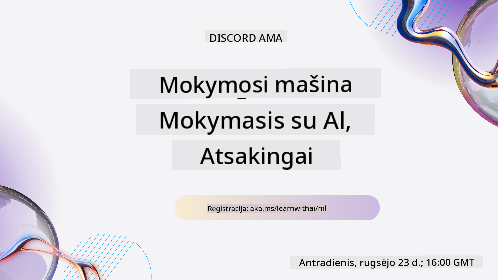

<!--
CO_OP_TRANSLATOR_METADATA:
{
  "original_hash": "c300f2380d9da91b7de8c707f69ce99b",
  "translation_date": "2025-12-19T12:14:24+00:00",
  "source_file": "README.md",
  "language_code": "lt"
}
-->

### 🌐 Daugiakalbė parama

#### Palaikoma per GitHub Action (automatizuota ir visada atnaujinta)

<!-- CO-OP TRANSLATOR LANGUAGES TABLE START -->
[Arabic](../ar/README.md) | [Bengali](../bn/README.md) | [Bulgarian](../bg/README.md) | [Burmese (Myanmar)](../my/README.md) | [Chinese (Simplified)](../zh/README.md) | [Chinese (Traditional, Hong Kong)](../hk/README.md) | [Chinese (Traditional, Macau)](../mo/README.md) | [Chinese (Traditional, Taiwan)](../tw/README.md) | [Croatian](../hr/README.md) | [Czech](../cs/README.md) | [Danish](../da/README.md) | [Dutch](../nl/README.md) | [Estonian](../et/README.md) | [Finnish](../fi/README.md) | [French](../fr/README.md) | [German](../de/README.md) | [Greek](../el/README.md) | [Hebrew](../he/README.md) | [Hindi](../hi/README.md) | [Hungarian](../hu/README.md) | [Indonesian](../id/README.md) | [Italian](../it/README.md) | [Japanese](../ja/README.md) | [Kannada](../kn/README.md) | [Korean](../ko/README.md) | [Lithuanian](./README.md) | [Malay](../ms/README.md) | [Malayalam](../ml/README.md) | [Marathi](../mr/README.md) | [Nepali](../ne/README.md) | [Nigerian Pidgin](../pcm/README.md) | [Norwegian](../no/README.md) | [Persian (Farsi)](../fa/README.md) | [Polish](../pl/README.md) | [Portuguese (Brazil)](../br/README.md) | [Portuguese (Portugal)](../pt/README.md) | [Punjabi (Gurmukhi)](../pa/README.md) | [Romanian](../ro/README.md) | [Russian](../ru/README.md) | [Serbian (Cyrillic)](../sr/README.md) | [Slovak](../sk/README.md) | [Slovenian](../sl/README.md) | [Spanish](../es/README.md) | [Swahili](../sw/README.md) | [Swedish](../sv/README.md) | [Tagalog (Filipino)](../tl/README.md) | [Tamil](../ta/README.md) | [Telugu](../te/README.md) | [Thai](../th/README.md) | [Turkish](../tr/README.md) | [Ukrainian](../uk/README.md) | [Urdu](../ur/README.md) | [Vietnamese](../vi/README.md)
<!-- CO-OP TRANSLATOR LANGUAGES TABLE END -->

#### Prisijunkite prie mūsų bendruomenės

Mes vykdome Discord mokymosi su DI seriją, sužinokite daugiau ir prisijunkite prie mūsų [Learn with AI Series](https://aka.ms/learnwithai/discord) nuo 2025 m. rugsėjo 18 iki 30 d. Jūs gausite patarimų ir gudrybių, kaip naudoti GitHub Copilot duomenų mokslui.

# Mašininis mokymasis pradedantiesiems – mokymo programa

> 🌍 Keliaukite po pasaulį, tyrinėdami mašininį mokymąsi per pasaulio kultūras 🌍

„Microsoft“ Cloud Advocates džiaugiasi galėdami pasiūlyti 12 savaičių, 26 pamokų mokymo programą, skirtą **mašininiam mokymuisi**. Šioje programoje sužinosite apie tai, ką kartais vadiname **klasikiniu mašininiu mokymusi**, daugiausia naudojant Scikit-learn biblioteką ir vengiant giluminio mokymosi, kuris aptariamas mūsų [DI pradedantiesiems mokymo programoje](https://aka.ms/ai4beginners). Taip pat derinkite šias pamokas su mūsų ['Duomenų mokslas pradedantiesiems' mokymo programa](https://aka.ms/ds4beginners).

Keliaukite su mumis po pasaulį, taikydami šias klasikines technikas duomenims iš įvairių pasaulio vietų. Kiekviena pamoka apima priešpamokinius ir popamokinius testus, rašytines instrukcijas pamokos atlikimui, sprendimą, užduotį ir dar daugiau. Mūsų projektinė pedagogika leidžia mokytis statant, tai patikrintas būdas, kaip nauji įgūdžiai geriau įsimena.

**✍️ Nuoširdus ačiū mūsų autoriams** Jen Looper, Stephen Howell, Francesca Lazzeri, Tomomi Imura, Cassie Breviu, Dmitry Soshnikov, Chris Noring, Anirban Mukherjee, Ornella Altunyan, Ruth Yakubu ir Amy Boyd

**🎨 Taip pat dėkojame mūsų iliustratoriams** Tomomi Imura, Dasani Madipalli ir Jen Looper

**🙏 Ypatingas ačiū 🙏 mūsų Microsoft Student Ambassador autoriams, recenzentams ir turinio bendradarbiams**, ypač Rishit Dagli, Muhammad Sakib Khan Inan, Rohan Raj, Alexandru Petrescu, Abhishek Jaiswal, Nawrin Tabassum, Ioan Samuila ir Snigdha Agarwal

**🤩 Papildomas dėkingumas Microsoft Student Ambassadors Eric Wanjau, Jasleen Sondhi ir Vidushi Gupta už mūsų R pamokas!**

# Pradžia

Atlikite šiuos veiksmus:
1. **Padarykite šaką (Fork) sau**: spustelėkite mygtuką „Fork“ šio puslapio viršutiniame dešiniajame kampe.
2. **Klonuokite sau repozitoriją**: `git clone https://github.com/microsoft/ML-For-Beginners.git`

> [raskite visus papildomus šios kursų medžiagos išteklius mūsų Microsoft Learn kolekcijoje](https://learn.microsoft.com/en-us/collections/qrqzamz1nn2wx3?WT.mc_id=academic-77952-bethanycheum)

> 🔧 **Reikia pagalbos?** Peržiūrėkite mūsų [Trikčių šalinimo vadovą](TROUBLESHOOTING.md) dėl dažniausiai pasitaikančių problemų sprendimų diegiant, nustatant ir vykdant pamokas.

**[Studentai](https://aka.ms/student-page)**, norėdami naudoti šią mokymo programą, padarykite visos repozitorijos šaką į savo GitHub paskyrą ir atlikite pratimus savarankiškai arba grupėje:

- Pradėkite nuo priešpaskaitinio testo.
- Perskaitykite paskaitą ir atlikite veiklas, sustodami ir apmąstydami kiekvieną žinių patikrinimą.
- Stenkitės kurti projektus suprasdami pamokas, o ne tiesiog paleisdami sprendimo kodą; tačiau šis kodas yra prieinamas kiekvienos projektinės pamokos `/solution` aplankuose.
- Atlikite popaskaitinį testą.
- Įvykdykite iššūkį.
- Atlikite užduotį.
- Baigę pamokų grupę, apsilankykite [Diskusijų lentoje](https://github.com/microsoft/ML-For-Beginners/discussions) ir „mokykitės garsiai“, užpildydami atitinkamą PAT vertinimo lentelę. 'PAT' yra pažangos vertinimo įrankis, kurį užpildote, kad pagilintumėte mokymąsi. Taip pat galite reaguoti į kitų PAT, kad mokytumėmės kartu.

> Tolimesniam mokymuisi rekomenduojame sekti šiuos [Microsoft Learn](https://docs.microsoft.com/en-us/users/jenlooper-2911/collections/k7o7tg1gp306q4?WT.mc_id=academic-77952-leestott) modulius ir mokymosi kelius.

**Mokytojai**, mes pateikėme [keletą pasiūlymų](for-teachers.md), kaip naudoti šią mokymo programą.

---

## Vaizdo įrašų peržiūros

Kai kurios pamokos yra prieinamos trumpų vaizdo įrašų forma. Visus juos rasite įterptus pamokose arba [ML pradedantiesiems grojaraštyje Microsoft Developer YouTube kanale](https://aka.ms/ml-beginners-videos), spustelėję žemiau esantį paveikslėlį.

---

## Susipažinkite su komanda

**Gif sukūrė** [Mohit Jaisal](https://linkedin.com/in/mohitjaisal)

> 🎥 Spustelėkite aukščiau esantį paveikslėlį, kad pamatytumėte vaizdo įrašą apie projektą ir jį sukūrusius žmones!

---

## Pedagogika

Kuriant šią mokymo programą pasirinkome du pedagoginius principus: užtikrinti, kad ji būtų praktinė, **projektinė**, ir kad joje būtų **dažni testai**. Be to, ši programa turi bendrą **temą**, suteikiančią jai vientisumą.

Užtikrinant, kad turinys atitiktų projektus, procesas tampa įdomesnis studentams, o koncepcijų įsisavinimas pagerėja. Be to, mažos rizikos testas prieš paskaitą nukreipia studentą į mokymąsi, o antras testas po paskaitos užtikrina dar geresnį įsisavinimą. Ši programa sukurta būti lanksti ir smagi, ją galima atlikti visą arba dalimis. Projektai prasideda nuo paprastų ir tampa vis sudėtingesni per 12 savaičių ciklą. Programa taip pat apima poskriptumą apie realaus pasaulio ML taikymus, kurį galima naudoti kaip papildomą kreditą arba diskusijų pagrindą.

> Raskite mūsų [Elgesio kodeksą](CODE_OF_CONDUCT.md), [Indėlio taisykles](CONTRIBUTING.md), [Vertimo gaires](TRANSLATIONS.md) ir [Trikčių šalinimo](TROUBLESHOOTING.md) instrukcijas. Laukiame jūsų konstruktyvios grįžtamosios informacijos!

## Kiekviena pamoka apima

- pasirenkamą eskizo užrašą
- pasirenkamą papildomą vaizdo įrašą
- vaizdo įrašo peržiūrą (tik kai kurios pamokos)
- [priešpaskaitinį apšilimo testą](https://ff-quizzes.netlify.app/en/ml/)
- rašytinę pamoką
- projektinėms pamokoms – žingsnis po žingsnio gaires, kaip sukurti projektą
- žinių patikrinimus
- iššūkį
- papildomą skaitymą
- užduotį
- [popaskaitinį testą](https://ff-quizzes.netlify.app/en/ml/)

> **Pastaba apie kalbas**: Šios pamokos daugiausia parašytos Python kalba, tačiau daugelis jų taip pat prieinamos R kalba. Norėdami atlikti R pamoką, eikite į `/solution` aplanką ir ieškokite R pamokų. Jos turi .rmd plėtinį, kuris reiškia **R Markdown** failą, kurį galima apibrėžti kaip `kodo blokų` (R ar kitų kalbų) ir `YAML antraštės` (nurodančios, kaip formatuoti išvestis, pvz., PDF) įterpimą į `Markdown` dokumentą. Tai puikus duomenų mokslo rašymo įrankis, leidžiantis derinti kodą, jo išvestį ir mintis, rašant jas Markdown formatu. Be to, R Markdown dokumentus galima konvertuoti į PDF, HTML ar Word formatus.

> **Pastaba apie testus**: Visi testai yra [Quiz App aplanke](../../quiz-app), iš viso 52 testai po tris klausimus. Jie susieti pamokose, bet testų programėlę galima paleisti vietoje; vadovaukitės `quiz-app` aplanko instrukcijomis, kaip ją paleisti vietoje arba diegti į Azure.

| Pamokos numeris |                             Tema                              |                   Pamokų grupė                   | Mokymosi tikslai                                                                                                             |                                                              Susieta pamoka                                                               |                        Autorius                        |
| :-----------: | :------------------------------------------------------------: | :-------------------------------------------------: | ------------------------------------------------------------------------------------------------------------------------------- | :--------------------------------------------------------------------------------------------------------------------------------------: | :--------------------------------------------------: |
|      01       |                Mašininio mokymosi įvadas                      |      [Introduction](1-Introduction/README.md)       | Sužinokite pagrindines mašininio mokymosi sąvokas                                                                             |                                             [Lesson](1-Introduction/1-intro-to-ML/README.md)                                             |                       Muhammad                       |
|      02       |                Mašininio mokymosi istorija                     |      [Introduction](1-Introduction/README.md)       | Sužinokite šios srities istoriją                                                                                              |                                            [Lesson](1-Introduction/2-history-of-ML/README.md)                                            |                     Jen and Amy                      |
|      03       |                 Teisingumas ir mašininis mokymasis             |      [Introduction](1-Introduction/README.md)       | Kokie svarbūs filosofiniai klausimai apie teisingumą, kuriuos studentai turėtų apsvarstyti kurdami ir taikydami ML modelius?   |                                              [Lesson](1-Introduction/3-fairness/README.md)                                               |                        Tomomi                        |
|      04       |                Mašininio mokymosi technikos                    |      [Introduction](1-Introduction/README.md)       | Kokias technikas ML tyrėjai naudoja kurdami ML modelius?                                                                      |                                          [Lesson](1-Introduction/4-techniques-of-ML/README.md)                                           |                    Chris and Jen                     |
|      05       |                   Regresijos įvadas                            |        [Regression](2-Regression/README.md)         | Pradėkite naudotis Python ir Scikit-learn regresijos modeliams                                                               |         [Python](2-Regression/1-Tools/README.md) • [R](../../2-Regression/1-Tools/solution/R/lesson_1.html)         |      Jen • Eric Wanjau       |
|      06       |                Šiaurės Amerikos moliūgų kainos 🎃              |        [Regression](2-Regression/README.md)         | Vizualizuokite ir išvalykite duomenis pasiruošimui ML                                                                        |          [Python](2-Regression/2-Data/README.md) • [R](../../2-Regression/2-Data/solution/R/lesson_2.html)          |      Jen • Eric Wanjau       |
|      07       |                Šiaurės Amerikos moliūgų kainos 🎃              |        [Regression](2-Regression/README.md)         | Kurkite tiesinės ir polininės regresijos modelius                                                                             |        [Python](2-Regression/3-Linear/README.md) • [R](../../2-Regression/3-Linear/solution/R/lesson_3.html)        |      Jen and Dmitry • Eric Wanjau       |
|      08       |                Šiaurės Amerikos moliūgų kainos 🎃              |        [Regression](2-Regression/README.md)         | Kurkite logistinės regresijos modelį                                                                                          |     [Python](2-Regression/4-Logistic/README.md) • [R](../../2-Regression/4-Logistic/solution/R/lesson_4.html)      |      Jen • Eric Wanjau       |
|      09       |                          Interneto programa 🔌                 |           [Web App](3-Web-App/README.md)            | Sukurkite interneto programą, kad naudotumėte savo apmokytą modelį                                                            |                                                 [Python](3-Web-App/1-Web-App/README.md)                                                  |                         Jen                          |
|      10       |                 Klasifikacijos įvadas                          |    [Classification](4-Classification/README.md)     | Išvalykite, paruoškite ir vizualizuokite savo duomenis; klasifikacijos įvadas                                                | [Python](4-Classification/1-Introduction/README.md) • [R](../../4-Classification/1-Introduction/solution/R/lesson_10.html)  | Jen and Cassie • Eric Wanjau |
|      11       |             Skani Azijos ir Indijos virtuvė 🍜                 |    [Classification](4-Classification/README.md)     | Klasifikatorių įvadas                                                                                                         | [Python](4-Classification/2-Classifiers-1/README.md) • [R](../../4-Classification/2-Classifiers-1/solution/R/lesson_11.html) | Jen and Cassie • Eric Wanjau |
|      12       |             Skani Azijos ir Indijos virtuvė 🍜                 |    [Classification](4-Classification/README.md)     | Daugiau klasifikatorių                                                                                                        | [Python](4-Classification/3-Classifiers-2/README.md) • [R](../../4-Classification/3-Classifiers-2/solution/R/lesson_12.html) | Jen and Cassie • Eric Wanjau |
|      13       |             Skani Azijos ir Indijos virtuvė 🍜                 |    [Classification](4-Classification/README.md)     | Sukurkite rekomendacinę interneto programą naudodami savo modelį                                                              |                                              [Python](4-Classification/4-Applied/README.md)                                              |                         Jen                          |
|      14       |                   Klasterizacijos įvadas                       |        [Clustering](5-Clustering/README.md)         | Išvalykite, paruoškite ir vizualizuokite savo duomenis; klasterizacijos įvadas                                               |         [Python](5-Clustering/1-Visualize/README.md) • [R](../../5-Clustering/1-Visualize/solution/R/lesson_14.html)         |      Jen • Eric Wanjau       |
|      15       |              Nigerijos muzikos skonių tyrinėjimas 🎧           |        [Clustering](5-Clustering/README.md)         | Tyrinėkite K-Means klasterizacijos metodą                                                                                    |           [Python](5-Clustering/2-K-Means/README.md) • [R](../../5-Clustering/2-K-Means/solution/R/lesson_15.html)           |      Jen • Eric Wanjau       |
|      16       |        Natūralios kalbos apdorojimo įvadas ☕️                  |   [Natural language processing](6-NLP/README.md)    | Sužinokite NLP pagrindus kurdami paprastą botą                                                                               |                                             [Python](6-NLP/1-Introduction-to-NLP/README.md)                                              |                       Stephen                        |
|      17       |                      Dažnos NLP užduotys ☕️                   |   [Natural language processing](6-NLP/README.md)    | Gilinkite savo NLP žinias suprasdami dažnas užduotis, reikalingas dirbant su kalbos struktūromis                              |                                                    [Python](6-NLP/2-Tasks/README.md)                                                     |                       Stephen                        |
|      18       |             Vertimas ir nuotaikų analizė ♥️                    |   [Natural language processing](6-NLP/README.md)    | Vertimas ir nuotaikų analizė su Jane Austen                                                                                  |                                            [Python](6-NLP/3-Translation-Sentiment/README.md)                                             |                       Stephen                        |
|      19       |                  Romantiški Europos viešbučiai ♥️              |   [Natural language processing](6-NLP/README.md)    | Nuotaikų analizė su viešbučių atsiliepimais 1                                                                                |                                               [Python](6-NLP/4-Hotel-Reviews-1/README.md)                                                |                       Stephen                        |
|      20       |                  Romantiški Europos viešbučiai ♥️              |   [Natural language processing](6-NLP/README.md)    | Nuotaikų analizė su viešbučių atsiliepimais 2                                                                                |                                               [Python](6-NLP/5-Hotel-Reviews-2/README.md)                                                |                       Stephen                        |
|      21       |            Laiko eilučių prognozavimo įvadas                   |        [Time series](7-TimeSeries/README.md)        | Laiko eilučių prognozavimo įvadas                                                                                            |                                             [Python](7-TimeSeries/1-Introduction/README.md)                                              |                      Francesca                       |
|      22       | ⚡️ Pasaulio elektros suvartojimas ⚡️ - laiko eilučių prognozavimas su ARIMA |        [Time series](7-TimeSeries/README.md)        | Laiko eilučių prognozavimas su ARIMA                                                                                         |                                                 [Python](7-TimeSeries/2-ARIMA/README.md)                                                 |                      Francesca                       |
|      23       |  ⚡️ Pasaulio elektros suvartojimas ⚡️ - laiko eilučių prognozavimas su SVR  |        [Time series](7-TimeSeries/README.md)        | Laiko eilučių prognozavimas su paramos vektorių regresoriumi                                                                 |                                                  [Python](7-TimeSeries/3-SVR/README.md)                                                  |                       Anirban                        |
|      24       |             Pastiprinamojo mokymosi įvadas                      | [Reinforcement learning](8-Reinforcement/README.md) | Pastiprinamojo mokymosi įvadas su Q-mokymusi                                                                                 |                                             [Python](8-Reinforcement/1-QLearning/README.md)                                              |                        Dmitry                        |
|      25       |                 Padėkite Petrui išvengti vilko! 🐺             | [Reinforcement learning](8-Reinforcement/README.md) | Pastiprinamojo mokymosi treniruoklis                                                                                         |                                                [Python](8-Reinforcement/2-Gym/README.md)                                                 |                        Dmitry                        |
|  Postscript   |            Tikro pasaulio ML scenarijai ir taikymai            |      [ML in the Wild](9-Real-World/README.md)       | Įdomios ir atskleidžiančios tikro pasaulio klasikinio ML taikymo situacijos                                                  |                                             [Lesson](9-Real-World/1-Applications/README.md)                                              |                         Team                         |
|  Postscript   |            ML modelių derinimas naudojant RAI informacijos suvestinę          |      [ML in the Wild](9-Real-World/README.md)       | ML modelių derinimas naudojant atsakingos AI informacijos suvestinės komponentus                                             |                                             [Lesson](9-Real-World/2-Debugging-ML-Models/README.md)                                              |                         Ruth Yakubu                       |

> [raskite visus papildomus šio kurso išteklius mūsų Microsoft Learn kolekcijoje](https://learn.microsoft.com/en-us/collections/qrqzamz1nn2wx3?WT.mc_id=academic-77952-bethanycheum)

## Offline prieiga

Šią dokumentaciją galite naudoti neprisijungę naudodami [Docsify](https://docsify.js.org/#/). Šakinkite šį repozitoriją, [įdiekite Docsify](https://docsify.js.org/#/quickstart) savo vietiniame kompiuteryje, tada šio repozitorijos šakniniame aplanke įveskite `docsify serve`. Svetainė bus pasiekiama per 3000 prievadą jūsų localhost: `localhost:3000`.

## PDF failai

Raskite mokymo programos PDF su nuorodomis [čia](https://microsoft.github.io/ML-For-Beginners/pdf/readme.pdf).

## 🎒 Kiti kursai

Mūsų komanda kuria ir kitus kursus! Pažiūrėkite:

<!-- CO-OP TRANSLATOR OTHER COURSES START -->
### LangChain

---

### Azure / Edge / MCP / Agentai

---
 
### Generatyvinio AI serija

[-9333EA?style=for-the-badge&labelColor=E5E7EB&color=9333EA)](https://github.com/microsoft/Generative-AI-for-beginners-dotnet?WT.mc_id=academic-105485-koreyst)
[-C084FC?style=for-the-badge&labelColor=E5E7EB&color=C084FC)](https://github.com/microsoft/generative-ai-for-beginners-java?WT.mc_id=academic-105485-koreyst)
[-E879F9?style=for-the-badge&labelColor=E5E7EB&color=E879F9)](https://github.com/microsoft/generative-ai-with-javascript?WT.mc_id=academic-105485-koreyst)

---
 
### Pagrindinis mokymasis

---
 
### Copilot serija

<!-- CO-OP TRANSLATOR OTHER COURSES END -->

## Pagalbos gavimas

Jei įstringate arba turite klausimų apie DI programėlių kūrimą. Prisijunkite prie kitų besimokančiųjų ir patyrusių kūrėjų diskusijose apie MCP. Tai palaikanti bendruomenė, kurioje klausimai yra laukiami, o žinios dalijamos laisvai.

Jei turite produkto atsiliepimų arba susiduriate su klaidomis kūrimo metu, apsilankykite:

---

<!-- CO-OP TRANSLATOR DISCLAIMER START -->
**Atsakomybės apribojimas**:
Šis dokumentas buvo išverstas naudojant dirbtinio intelekto vertimo paslaugą [Co-op Translator](https://github.com/Azure/co-op-translator). Nors stengiamės užtikrinti tikslumą, prašome atkreipti dėmesį, kad automatiniai vertimai gali turėti klaidų ar netikslumų. Originalus dokumentas jo gimtąja kalba turėtų būti laikomas autoritetingu šaltiniu. Svarbiai informacijai rekomenduojamas profesionalus žmogaus vertimas. Mes neatsakome už bet kokius nesusipratimus ar neteisingus aiškinimus, kylančius dėl šio vertimo naudojimo.
<!-- CO-OP TRANSLATOR DISCLAIMER END -->