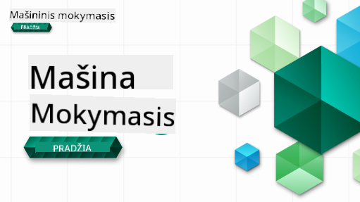

<!--
CO_OP_TRANSLATOR_METADATA:
{
  "original_hash": "1dd12e0cd1de7d05f65abe07bc401c63",
  "translation_date": "2025-09-06T19:16:56+00:00",
  "source_file": "README.md",
  "language_code": "lt"
}
-->
  
  
  
  
  

  
  
  

### 🌐 Daugiakalbė parama  

#### Palaikoma per GitHub Action (Automatizuota ir visada atnaujinta)  

[Prancūzų](../fr/README.md) | [Ispanų](../es/README.md) | [Vokiečių](../de/README.md) | [Rusų](../ru/README.md) | [Arabų](../ar/README.md) | [Persų (Farsi)](../fa/README.md) | [Urdu](../ur/README.md) | [Kinų (supaprastinta)](../zh/README.md) | [Kinų (tradicinė, Makao)](../mo/README.md) | [Kinų (tradicinė, Honkongas)](../hk/README.md) | [Kinų (tradicinė, Taivanas)](../tw/README.md) | [Japonų](../ja/README.md) | [Korėjiečių](../ko/README.md) | [Hindi](../hi/README.md) | [Bengalų](../bn/README.md) | [Marathi](../mr/README.md) | [Nepalų](../ne/README.md) | [Pundžabi (Gurmukhi)](../pa/README.md) | [Portugalų (Portugalija)](../pt/README.md) | [Portugalų (Brazilija)](../br/README.md) | [Italų](../it/README.md) | [Lenkų](../pl/README.md) | [Turkų](../tr/README.md) | [Graikų](../el/README.md) | [Tajų](../th/README.md) | [Švedų](../sv/README.md) | [Danų](../da/README.md) | [Norvegų](../no/README.md) | [Suomių](../fi/README.md) | [Olandų](../nl/README.md) | [Hebrajų](../he/README.md) | [Vietnamiečių](../vi/README.md) | [Indoneziečių](../id/README.md) | [Malajų](../ms/README.md) | [Tagalog (Filipiniečių)](../tl/README.md) | [Svahilių](../sw/README.md) | [Vengrų](../hu/README.md) | [Čekų](../cs/README.md) | [Slovakų](../sk/README.md) | [Rumunų](../ro/README.md) | [Bulgarų](../bg/README.md) | [Serbų (kirilica)](../sr/README.md) | [Kroatų](../hr/README.md) | [Slovėnų](../sl/README.md) | [Ukrainiečių](../uk/README.md) | [Birmos (Mianmaras)](../my/README.md)  

#### Prisijunkite prie bendruomenės  

  

# Mašininis mokymasis pradedantiesiems - mokymo programa  

> 🌍 Keliaukite po pasaulį, tyrinėdami mašininį mokymąsi per pasaulio kultūras 🌍  

Microsoft Cloud Advocates džiaugiasi galėdami pasiūlyti 12 savaičių, 26 pamokų mokymo programą apie **mašininį mokymąsi**. Šioje mokymo programoje sužinosite apie tai, kas kartais vadinama **klasikiniu mašininiu mokymusi**, daugiausia naudojant Scikit-learn biblioteką ir vengiant giluminio mokymosi, kuris aptariamas mūsų [AI pradedantiesiems mokymo programoje](https://aka.ms/ai4beginners). Šias pamokas taip pat galite derinti su mūsų ['Duomenų mokslas pradedantiesiems' mokymo programa](https://aka.ms/ds4beginners).  

Keliaukite su mumis po pasaulį, taikydami šiuos klasikinius metodus duomenims iš įvairių pasaulio regionų. Kiekviena pamoka apima prieš pamoką ir po pamokos pateikiamus testus, rašytines instrukcijas, kaip atlikti pamoką, sprendimą, užduotį ir dar daugiau. Mūsų projektinis mokymo metodas leidžia mokytis kuriant, o tai yra patikrintas būdas įsisavinti naujus įgūdžius.  

**✍️ Nuoširdus ačiū mūsų autoriams** Jen Looper, Stephen Howell, Francesca Lazzeri, Tomomi Imura, Cassie Breviu, Dmitry Soshnikov, Chris Noring, Anirban Mukherjee, Ornella Altunyan, Ruth Yakubu ir Amy Boyd  

**🎨 Taip pat dėkojame mūsų iliustratoriams** Tomomi Imura, Dasani Madipalli ir Jen Looper  

**🙏 Ypatinga padėka 🙏 mūsų Microsoft Student Ambassador autoriams, recenzentams ir turinio kūrėjams**, ypač Rishit Dagli, Muhammad Sakib Khan Inan, Rohan Raj, Alexandru Petrescu, Abhishek Jaiswal, Nawrin Tabassum, Ioan Samuila ir Snigdha Agarwal  

**🤩 Papildoma padėka Microsoft Student Ambassadors Eric Wanjau, Jasleen Sondhi ir Vidushi Gupta už mūsų R pamokas!**  

# Pradžia  

Sekite šiuos žingsnius:  
1. **Fork repo**: Spustelėkite "Fork" mygtuką viršutiniame dešiniajame šio puslapio kampe.  
2. **Klonuokite repo**:   `git clone https://github.com/microsoft/ML-For-Beginners.git`  

> [Raskite visus papildomus šios mokymo programos išteklius mūsų Microsoft Learn kolekcijoje](https://learn.microsoft.com/en-us/collections/qrqzamz1nn2wx3?WT.mc_id=academic-77952-bethanycheum)  

**[Studentai](https://aka.ms/student-page)**, norėdami naudoti šią mokymo programą, fork visą repo į savo GitHub paskyrą ir atlikite užduotis savarankiškai arba grupėje:  

- Pradėkite nuo prieš pamoką pateikiamo testo.  
- Perskaitykite pamoką ir atlikite veiklas, sustodami ir apmąstydami kiekvieną žinių patikrinimą.  
- Stenkitės kurti projektus suprasdami pamokas, o ne tiesiog paleisdami sprendimo kodą; tačiau tas kodas yra prieinamas `/solution` aplankuose kiekvienoje projektinėje pamokoje.  
- Atlikite po pamokos pateikiamą testą.  
- Atlikite iššūkį.  
- Atlikite užduotį.  
- Baigę pamokų grupę, apsilankykite [Diskusijų lentoje](https://github.com/microsoft/ML-For-Beginners/discussions) ir "mokykitės garsiai", užpildydami atitinkamą PAT rubriką. PAT yra pažangos vertinimo įrankis, kurį užpildote, kad dar labiau įtvirtintumėte savo mokymąsi. Taip pat galite reaguoti į kitų PAT, kad mokytumėmės kartu.  

> Norėdami toliau mokytis, rekomenduojame sekti šiuos [Microsoft Learn](https://docs.microsoft.com/en-us/users/jenlooper-2911/collections/k7o7tg1gp306q4?WT.mc_id=academic-77952-leestott) modulius ir mokymosi kelius.  

**Mokytojai**, mes [įtraukėme keletą pasiūlymų](for-teachers.md), kaip naudoti šią mokymo programą.  

---

## Vaizdo įrašų apžvalgos  

Kai kurios pamokos yra prieinamos kaip trumpi vaizdo įrašai. Visus juos galite rasti pamokose arba [ML pradedantiesiems grojaraštyje Microsoft Developer YouTube kanale](https://aka.ms/ml-beginners-videos), spustelėdami žemiau esančią nuotrauką.  

  

---

## Susipažinkite su komanda  

  

**Gif sukūrė** [Mohit Jaisal](https://linkedin.com/in/mohitjaisal)  

> 🎥 Spustelėkite aukščiau esančią nuotrauką, kad pamatytumėte vaizdo įrašą apie projektą ir žmones, kurie jį sukūrė!  

---

## Pedagogika  

Kuriant šią mokymo programą, mes pasirinkome du pedagoginius principus: užtikrinti, kad ji būtų praktinė **projektinė** ir kad joje būtų **dažni testai**. Be to, ši mokymo programa turi bendrą **temą**, suteikiančią jai nuoseklumo.  

Užtikrinant, kad turinys atitiktų projektus, procesas tampa įdomesnis studentams, o koncepcijų įsisavinimas sustiprėja. Be to, mažos rizikos testas prieš pamoką nukreipia studento dėmesį į mokymąsi, o antras testas po pamokos užtikrina dar didesnį įsisavinimą. Ši mokymo programa buvo sukurta taip, kad būtų lanksti ir įdomi, ją galima naudoti visą arba dalimis. Projektai prasideda nuo mažų ir tampa vis sudėtingesni iki 12 savaičių ciklo pabaigos. Ši mokymo programa taip pat apima priedą apie realaus pasaulio ML taikymus, kuris gali būti naudojamas kaip papildomas kreditas arba diskusijų pagrindas.  

> Raskite mūsų [Elgesio kodeksą](CODE_OF_CONDUCT.md), [Prisidėjimo](CONTRIBUTING.md) ir [Vertimo](TRANSLATIONS.md) gaires. Laukiame jūsų konstruktyvios nuomonės!  

## Kiekviena pamoka apima  

- pasirenkamą eskizą  
- pasirenkamą papildomą vaizdo įrašą  
- vaizdo įrašo apžvalgą (kai kurios pamokos)  
- [prieš pamoką pateikiamą testą](https://ff-quizzes.netlify.app/en/ml/)  
- rašytinę pamoką  
- projektinėms pamokoms - žingsnis po žingsnio vadovus, kaip sukurti projektą  
- žinių patikrinimus  
- iššūkį  
- papildomą skaitymą  
- užduotį  
- [po pamokos pateikiamą testą](https://ff-quizzes.netlify.app/en/ml/)  

> **Pastaba apie kalbas**: Šios pamokos daugiausia parašytos Python kalba, tačiau daugelis jų taip pat yra prieinamos R kalba. Norėdami atlikti R pamoką, eikite į `/solution` aplanką ir ieškokite R pamokų. Jos apima .rmd plėtinį, kuris reiškia **R Markdown** failą, kurį galima paprastai apibrėžti kaip `kodo fragmentų` (R arba kitų kalbų) ir `YAML antraštės` (nurodančios, kaip formatuoti išvestis, pvz., PDF) įterpimą į `Markdown dokumentą`. Todėl tai yra puikus autorystės pagrindas duomenų mokslui, nes leidžia jums sujungti savo kodą, jo išvestį ir mintis, leidžiant jas užrašyti Markdown formatu. Be to, R Markdown dokumentai gali būti pateikiami tokiuose išvesties formatuose kaip PDF, HTML arba Word.  

> **Pastaba apie testus**: Visi testai yra [Testų programos aplanke](../../quiz-app), iš viso 52 testai po tris klausimus kiekviename. Jie yra susieti iš pamokų, tačiau testų programą galima paleisti vietoje; sekite instrukcijas `quiz-app` aplanke, kad paleistumėte vietoje arba įdiegtumėte Azure.  

| Pamokos numeris |                             Tema                              |                   Pamokų grupavimas                   | Mokymosi tikslai                                                                                                             |                                                              Susieta pamoka                                                               |                        Autorius                        |
| :-----------: | :------------------------------------------------------------: | :-------------------------------------------------: | ------------------------------------------------------------------------------------------------------------------------------- | :--------------------------------------------------------------------------------------------------------------------------------------: | :--------------------------------------------------: |
|      01       |                Įvadas į mašininį mokymąsi                |      [Įvadas](1-Introduction/README.md)       | Sužinokite pagrindines mašininio mokymosi sąvokas                                                                                |                                             [Pamoka](1-Introduction/1-intro-to-ML/README.md)                                             |                       Muhammad                       |
|      02       |                Mašininio mokymosi istorija                 |      [Įvadas](1-Introduction/README.md)       | Sužinokite šios srities istoriją                                                                                         |                                            [Pamoka](1-Introduction/2-history-of-ML/README.md)                                            |                     Jen ir Amy                      |
|      03       |                 Teisingumas ir mašininis mokymasis                  |      [Įvadas](1-Introduction/README.md)       | Kokie svarbūs filosofiniai klausimai apie teisingumą, kuriuos studentai turėtų apsvarstyti kurdami ir taikydami ML modelius? |                                              [Pamoka](1-Introduction/3-fairness/README.md)                                               |                        Tomomi                        |  
|      04       |                Mašininio mokymosi technikos                   |      [Įvadas](1-Introduction/README.md)              | Kokias technikas naudoja ML tyrėjai kurdami ML modelius?                                                                         |                                          [Pamoka](1-Introduction/4-techniques-of-ML/README.md)                                           |                    Chris ir Jen                     |
|      05       |                   Įvadas į regresiją                          |        [Regresija](2-Regression/README.md)          | Pradėkite naudoti Python ir Scikit-learn regresijos modeliams                                                                   |         [Python](2-Regression/1-Tools/README.md) • [R](../../2-Regression/1-Tools/solution/R/lesson_1.html)         |      Jen • Eric Wanjau       |
|      06       |                Šiaurės Amerikos moliūgų kainos 🎃             |        [Regresija](2-Regression/README.md)          | Vizualizuokite ir išvalykite duomenis pasiruošimui ML                                                                           |          [Python](2-Regression/2-Data/README.md) • [R](../../2-Regression/2-Data/solution/R/lesson_2.html)          |      Jen • Eric Wanjau       |
|      07       |                Šiaurės Amerikos moliūgų kainos 🎃             |        [Regresija](2-Regression/README.md)          | Kurkite linijinius ir polinominius regresijos modelius                                                                          |        [Python](2-Regression/3-Linear/README.md) • [R](../../2-Regression/3-Linear/solution/R/lesson_3.html)        |      Jen ir Dmitry • Eric Wanjau       |
|      08       |                Šiaurės Amerikos moliūgų kainos 🎃             |        [Regresija](2-Regression/README.md)          | Kurkite logistinės regresijos modelį                                                                                           |     [Python](2-Regression/4-Logistic/README.md) • [R](../../2-Regression/4-Logistic/solution/R/lesson_4.html)      |      Jen • Eric Wanjau       |
|      09       |                          Interneto programa 🔌                |           [Interneto programa](3-Web-App/README.md) | Sukurkite interneto programą, kad galėtumėte naudoti savo apmokytą modelį                                                      |                                                 [Python](3-Web-App/1-Web-App/README.md)                                                  |                         Jen                          |
|      10       |                 Įvadas į klasifikaciją                        |    [Klasifikacija](4-Classification/README.md)      | Išvalykite, paruoškite ir vizualizuokite savo duomenis; įvadas į klasifikaciją                                                 | [Python](4-Classification/1-Introduction/README.md) • [R](../../4-Classification/1-Introduction/solution/R/lesson_10.html)  | Jen ir Cassie • Eric Wanjau |
|      11       |             Skani Azijos ir Indijos virtuvė 🍜                |    [Klasifikacija](4-Classification/README.md)      | Įvadas į klasifikatorius                                                                                                        | [Python](4-Classification/2-Classifiers-1/README.md) • [R](../../4-Classification/2-Classifiers-1/solution/R/lesson_11.html) | Jen ir Cassie • Eric Wanjau |
|      12       |             Skani Azijos ir Indijos virtuvė 🍜                |    [Klasifikacija](4-Classification/README.md)      | Daugiau klasifikatorių                                                                                                          | [Python](4-Classification/3-Classifiers-2/README.md) • [R](../../4-Classification/3-Classifiers-2/solution/R/lesson_12.html) | Jen ir Cassie • Eric Wanjau |
|      13       |             Skani Azijos ir Indijos virtuvė 🍜                |    [Klasifikacija](4-Classification/README.md)      | Sukurkite rekomendacijų interneto programą naudodami savo modelį                                                               |                                              [Python](4-Classification/4-Applied/README.md)                                              |                         Jen                          |
|      14       |                   Įvadas į klasterizaciją                     |        [Klasterizacija](5-Clustering/README.md)     | Išvalykite, paruoškite ir vizualizuokite savo duomenis; įvadas į klasterizaciją                                                |         [Python](5-Clustering/1-Visualize/README.md) • [R](../../5-Clustering/1-Visualize/solution/R/lesson_14.html)         |      Jen • Eric Wanjau       |
|      15       |              Nigerijos muzikos skonių tyrinėjimas 🎧          |        [Klasterizacija](5-Clustering/README.md)     | Tyrinėkite K-Means klasterizacijos metodą                                                                                      |           [Python](5-Clustering/2-K-Means/README.md) • [R](../../5-Clustering/2-K-Means/solution/R/lesson_15.html)           |      Jen • Eric Wanjau       |
|      16       |        Įvadas į natūralios kalbos apdorojimą ☕️              |   [Natūralios kalbos apdorojimas](6-NLP/README.md)  | Sužinokite NLP pagrindus kurdami paprastą botą                                                                                 |                                             [Python](6-NLP/1-Introduction-to-NLP/README.md)                                              |                       Stephen                        |
|      17       |                      Dažnos NLP užduotys ☕️                  |   [Natūralios kalbos apdorojimas](6-NLP/README.md)  | Gilinkite savo NLP žinias suprasdami dažnas užduotis, susijusias su kalbos struktūromis                                        |                                                    [Python](6-NLP/2-Tasks/README.md)                                                     |                       Stephen                        |
|      18       |             Vertimas ir nuotaikų analizė ♥️                  |   [Natūralios kalbos apdorojimas](6-NLP/README.md)  | Vertimas ir nuotaikų analizė su Jane Austen                                                                                   |                                            [Python](6-NLP/3-Translation-Sentiment/README.md)                                             |                       Stephen                        |
|      19       |                  Romantiški Europos viešbučiai ♥️            |   [Natūralios kalbos apdorojimas](6-NLP/README.md)  | Nuotaikų analizė su viešbučių apžvalgomis 1                                                                                    |                                               [Python](6-NLP/4-Hotel-Reviews-1/README.md)                                                |                       Stephen                        |
|      20       |                  Romantiški Europos viešbučiai ♥️            |   [Natūralios kalbos apdorojimas](6-NLP/README.md)  | Nuotaikų analizė su viešbučių apžvalgomis 2                                                                                    |                                               [Python](6-NLP/5-Hotel-Reviews-2/README.md)                                                |                       Stephen                        |
|      21       |            Įvadas į laiko eilučių prognozavimą               |        [Laiko eilutės](7-TimeSeries/README.md)      | Įvadas į laiko eilučių prognozavimą                                                                                            |                                             [Python](7-TimeSeries/1-Introduction/README.md)                                              |                      Francesca                       |
|      22       | ⚡️ Pasaulio energijos naudojimas ⚡️ - laiko eilučių prognozavimas su ARIMA |        [Laiko eilutės](7-TimeSeries/README.md)      | Laiko eilučių prognozavimas su ARIMA                                                                                           |                                                 [Python](7-TimeSeries/2-ARIMA/README.md)                                                 |                      Francesca                       |
|      23       |  ⚡️ Pasaulio energijos naudojimas ⚡️ - laiko eilučių prognozavimas su SVR  |        [Laiko eilutės](7-TimeSeries/README.md)      | Laiko eilučių prognozavimas su atraminių vektorių regresoriumi                                                                 |                                                  [Python](7-TimeSeries/3-SVR/README.md)                                                  |                       Anirban                        |
|      24       |             Įvadas į stiprinamąjį mokymą                      | [Stiprinamasis mokymas](8-Reinforcement/README.md)  | Įvadas į stiprinamąjį mokymą su Q-Learning                                                                                     |                                             [Python](8-Reinforcement/1-QLearning/README.md)                                              |                        Dmitry                        |
|      25       |                 Padėkite Peteriui išvengti vilko! 🐺          | [Stiprinamasis mokymas](8-Reinforcement/README.md)  | Stiprinamasis mokymas su Gym                                                                                                   |                                                [Python](8-Reinforcement/2-Gym/README.md)                                                 |                        Dmitry                        |
|  Postscript   |            Tikrojo pasaulio ML scenarijai ir taikymas         |      [ML realiame pasaulyje](9-Real-World/README.md)| Įdomūs ir atskleidžiantys tikrojo pasaulio klasikinio ML taikymo pavyzdžiai                                                    |                                             [Pamoka](9-Real-World/1-Applications/README.md)                                              |                         Komanda                      |
|  Postscript   |            Modelio derinimas ML naudojant RAI prietaisų skydelį |      [ML realiame pasaulyje](9-Real-World/README.md)| Modelio derinimas mašininio mokymosi srityje naudojant atsakingo AI prietaisų skydelio komponentus                             |                                             [Pamoka](9-Real-World/2-Debugging-ML-Models/README.md)                                       |                         Ruth Yakubu                  |

> [raskite visus papildomus šio kurso išteklius mūsų Microsoft Learn kolekcijoje](https://learn.microsoft.com/en-us/collections/qrqzamz1nn2wx3?WT.mc_id=academic-77952-bethanycheum)

## Prieiga neprisijungus

Šią dokumentaciją galite naudoti neprisijungus naudodami [Docsify](https://docsify.js.org/#/). Fork'inkite šį repo, [įdiekite Docsify](https://docsify.js.org/#/quickstart) savo vietiniame kompiuteryje, o tada repo šakniniame aplanke įveskite `docsify serve`. Svetainė bus pasiekiama 3000 prievade jūsų localhost: `localhost:3000`.

## PDF failai

Raskite mokymo programos PDF su nuorodomis [čia](https://microsoft.github.io/ML-For-Beginners/pdf/readme.pdf).

## 🎒 Kiti kursai 

Mūsų komanda kuria ir kitus kursus! Peržiūrėkite:

- [Generatyvinis AI pradedantiesiems](https://aka.ms/genai-beginners)
- [Generatyvinis AI pradedantiesiems .NET](https://github.com/microsoft/Generative-AI-for-beginners-dotnet)
- [Generatyvinis AI su JavaScript](https://github.com/microsoft/generative-ai-with-javascript)
- [Generatyvinis AI su Java](https://github.com/microsoft/Generative-AI-for-beginners-java)
- [AI pradedantiesiems](https://aka.ms/ai-beginners)
- [Duomenų mokslas pradedantiesiems](https://aka.ms/datascience-beginners)
- [ML pradedantiesiems](https://aka.ms/ml-beginners)
- [Kibernetinis saugumas pradedantiesiems](https://github.com/microsoft/Security-101) 
- [Interneto kūrimas pradedantiesiems](https://aka.ms/webdev-beginners)
- [IoT pradedantiesiems](https://aka.ms/iot-beginners)
- [XR kūrimas pradedantiesiems](https://github.com/microsoft/xr-development-for-beginners)
- [GitHub Copilot meistriškumas poriniam programavimui](https://github.com/microsoft/Mastering-GitHub-Copilot-for-Paired-Programming)
- [GitHub Copilot meistriškumas C#/.NET programuotojams](https://github.com/microsoft/mastering-github-copilot-for-dotnet-csharp-developers)
- [Pasirinkite savo Copilot nuotykį](https://github.com/microsoft/CopilotAdventures)

---

**Atsakomybės apribojimas**:  
Šis dokumentas buvo išverstas naudojant dirbtinio intelekto vertimo paslaugą [Co-op Translator](https://github.com/Azure/co-op-translator). Nors siekiame tikslumo, atkreipiame dėmesį, kad automatiniai vertimai gali turėti klaidų ar netikslumų. Originalus dokumentas jo gimtąja kalba turėtų būti laikomas autoritetingu šaltiniu. Dėl svarbios informacijos rekomenduojame kreiptis į profesionalius vertėjus. Mes neprisiimame atsakomybės už nesusipratimus ar klaidingus aiškinimus, kylančius dėl šio vertimo naudojimo.