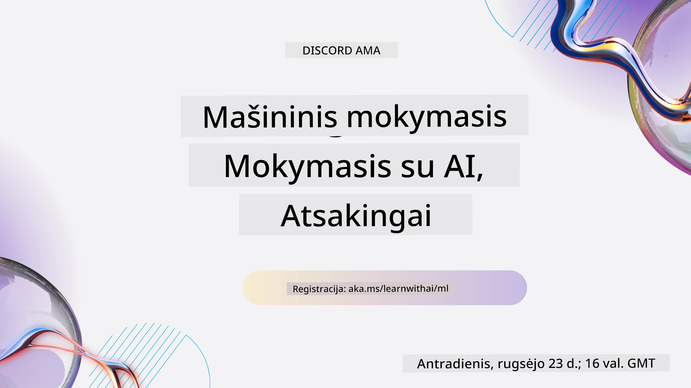
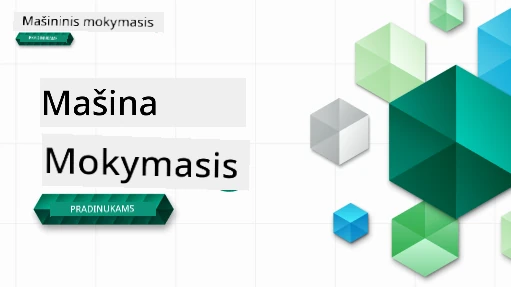

[](https://github.com/microsoft/ML-For-Beginners/blob/master/LICENSE)
[](https://GitHub.com/microsoft/ML-For-Beginners/graphs/contributors/)
[](https://GitHub.com/microsoft/ML-For-Beginners/issues/)
[](https://GitHub.com/microsoft/ML-For-Beginners/pulls/)
[](http://makeapullrequest.com)

[](https://GitHub.com/microsoft/ML-For-Beginners/watchers/)
[](https://GitHub.com/microsoft/ML-For-Beginners/network/)
[](https://GitHub.com/microsoft/ML-For-Beginners/stargazers/)

### 🌐 Daugiakalbė parama

#### Palaikoma per GitHub Action (automatinė ir visada atnaujinta)

<!-- CO-OP TRANSLATOR LANGUAGES TABLE START -->
[Arabų](../ar/README.md) | [Bengalų](../bn/README.md) | [Bulgara](../bg/README.md) | [Birmos (Mianmaras)](../my/README.md) | [Kinų (supaprastinta)](../zh-CN/README.md) | [Kinų (tradicinė, Honkongas)](../zh-HK/README.md) | [Kinų (tradicinė, Makao)](../zh-MO/README.md) | [Kinų (tradicinė, Taivanas)](../zh-TW/README.md) | [Kroatų](../hr/README.md) | [Čekų](../cs/README.md) | [Danų](../da/README.md) | [Olandų](../nl/README.md) | [Estų](../et/README.md) | [Suomių](../fi/README.md) | [Prancūzų](../fr/README.md) | [Vokiečių](../de/README.md) | [Graikų](../el/README.md) | [Hebrajų](../he/README.md) | [Hindi](../hi/README.md) | [Vengrų](../hu/README.md) | [Indoneziečių](../id/README.md) | [Italų](../it/README.md) | [Japonų](../ja/README.md) | [Kannadų](../kn/README.md) | [Khmerų](../km/README.md) | [Korėjiečių](../ko/README.md) | [Lietuvių](./README.md) | [Malajų](../ms/README.md) | [Malajalių](../ml/README.md) | [Maratų](../mr/README.md) | [Nepalo](../ne/README.md) | [Nigerijos pidžino](../pcm/README.md) | [Norvegų](../no/README.md) | [Persų (Farsi)](../fa/README.md) | [Lenkų](../pl/README.md) | [Portugalų (Brazilija)](../pt-BR/README.md) | [Portugalų (Portugalija)](../pt-PT/README.md) | [Pendžabių (Gurmukhi)](../pa/README.md) | [Rumunų](../ro/README.md) | [Rusų](../ru/README.md) | [Serbų (kirilica)](../sr/README.md) | [Slovakų](../sk/README.md) | [Slovėnų](../sl/README.md) | [Ispanų](../es/README.md) | [Suahelių](../sw/README.md) | [Švedų](../sv/README.md) | [Tagalo (Filipinų)](../tl/README.md) | [Tamulų](../ta/README.md) | [Telugų](../te/README.md) | [Tajų](../th/README.md) | [Turkų](../tr/README.md) | [Ukrainiečių](../uk/README.md) | [Urdu](../ur/README.md) | [Vietnamiečių](../vi/README.md)

> **Norite klonuoti vietoje?**
>
> Šiame saugykloje yra daugiau nei 50 kalbų vertimų, kurie gerokai padidina atsisiuntimo dydį. Norėdami klonuoti be vertimų, naudokite retą atsisiuntimą (sparse checkout):
>
> **Bash / macOS / Linux:**
> ```bash
> git clone --filter=blob:none --sparse https://github.com/microsoft/ML-For-Beginners.git
> cd ML-For-Beginners
> git sparse-checkout set --no-cone '/*' '!translations' '!translated_images'
> ```
>
> **CMD (Windows):**
> ```cmd
> git clone --filter=blob:none --sparse https://github.com/microsoft/ML-For-Beginners.git
> cd ML-For-Beginners
> git sparse-checkout set --no-cone "/*" "!translations" "!translated_images"
> ```
>
> Tai suteikia viską, ko reikia kursui baigti, bet atsisiuntimas bus daug greitesnis.
<!-- CO-OP TRANSLATOR LANGUAGES TABLE END -->

#### Prisijunkite prie mūsų bendruomenės

[](https://discord.gg/nTYy5BXMWG)

Turime vykstančią Discord "Mokymasis su DI" seriją, sužinokite daugiau ir prisijunkite prie mūsų [Learn with AI Series](https://aka.ms/learnwithai/discord) nuo 2025 m. rugsėjo 18 iki 30 d. Gaunate patarimų ir triukų, kaip naudoti GitHub Copilot duomenų mokslui.



# Mašininis mokymasis pradedantiesiems – mokymo programa

> 🌍 Keliaukite po pasaulį kartu tyrinėdami mašininį mokymąsi per pasaulio kultūras 🌍

Microsoft debesų šalininkai džiaugiasi galėdami pasiūlyti 12 savaičių, 26 pamokų mokymo programą apie **mašininį mokymąsi**. Šioje programoje sužinosite apie tai, kas kartais vadinama **klasikiniu mašininiu mokymusi**, daugiausia naudojant Scikit-learn biblioteką ir vengiant giluminio mokymosi, kuris aptariamas mūsų [DI pradedantiesiems mokymo programoje](https://aka.ms/ai4beginners). Taip pat suderinkite šias pamokas su mūsų ['Duomenų mokslas pradedantiesiems' mokymo programa](https://aka.ms/ds4beginners)!

Keliaukite su mumis po pasaulį taikydami šias klasikines technikas duomenims iš įvairių pasaulio sričių. Kiekviena pamoka apima išankstinius ir baigiamuosius testus, rašytines instrukcijas pamokos užbaigimui, sprendimą, užduotį ir dar daugiau. Mūsų projektams orientuota pedagogika leidžia mokytis kuriant, kas įrodyta kaip efektyvus naujų įgūdžių įsisavinimo būdas.

**✍️ Širdingas ačiū mūsų autoriams** Jen Looper, Stephen Howell, Francesca Lazzeri, Tomomi Imura, Cassie Breviu, Dmitry Soshnikov, Chris Noring, Anirban Mukherjee, Ornella Altunyan, Ruth Yakubu ir Amy Boyd

**🎨 Taip pat dėkojame mūsų iliustratoriams** Tomomi Imura, Dasani Madipalli ir Jen Looper

**🙏 Ypatingas ačiū 🙏 mūsų Microsoft Student Ambassador autoriams, recenzentams ir turinio rengėjams**, ypač Rishit Dagli, Muhammad Sakib Khan Inan, Rohan Raj, Alexandru Petrescu, Abhishek Jaiswal, Nawrin Tabassum, Ioan Samuila ir Snigdha Agarwal

**🤩 Papildoma padėka Microsoft Student Ambassador Eric Wanjau, Jasleen Sondhi ir Vidushi Gupta už mūsų R pamokas!**

# Pradžia

Atlikite šiuos veiksmus:
1. **Sukurkite saugyklos šaką (Fork):** Spustelėkite "Fork" mygtuką šio puslapio viršutiniame dešiniajame kampe.
2. **Klonuokite saugyklą:** `git clone https://github.com/microsoft/ML-For-Beginners.git`

> 💡 **Greitas pradžios patarimas:** Norite pradėti naršyklėje, neįdiegę Python vietoje? Naudokitės [GitHub Codespaces](https://github.com/features/codespaces), kad sukurtumėte debesų vystymo aplinką savo šakai. Atidarykite žalią **Code** meniu, pasirinkite **Codespaces** ir sukurkite naują codespace; kiekvienai pamokai pagal poreikį įdiekite reikiamus priklausomumus.

> [raskite visus papildomus šio kurso šaltinius mūsų Microsoft Learn rinkinyje](https://learn.microsoft.com/en-us/collections/qrqzamz1nn2wx3?WT.mc_id=academic-77952-bethanycheum)

> 🔧 **Reikia pagalbos?** Patikrinkite mūsų [Trikčių šalinimo vadovą](TROUBLESHOOTING.md) dėl dažnų įdiegimo, nustatymo ir pamokų vykdymo problemų sprendimų.


**[Mokiniams](https://aka.ms/student-page)**, norėdami naudotis šia programa, sukurkite visos saugyklos šaką savo GitHub paskyroje ir atlikite pratimus savarankiškai arba grupėje:

- Pradėkite nuo išankstinio testo.
- Perskaitykite paskaitą ir atlikite veiklas, stabtelėdami ir apmąstydami kiekvieną žinių patikrinimą.
- Stenkitės kurti projektus suprasdami pamokas, o ne vien vykdydami sprendimų kodą; nors tas kodas yra prieinamas kiekvienos pamokos /solution aplankuose.
- Atlikite baigiamąjį testą.
- Įvykdykite iššūkį.
- Atlikite užduotį.
- Baigę pamokų grupę apsilankykite [Diskusijų lentoje](https://github.com/microsoft/ML-For-Beginners/discussions) ir 'mokykitės garsiai', užpildydami tinkamą PAT rubriką. PAT yra pažangos vertinimo priemonė, kurią pildote tolesniam mokymuisi. Taip pat galite reaguoti į kitus PAT, kad mokytumėmės kartu.

> Tolimesniam mokymuisi rekomenduojame šiuos [Microsoft Learn](https://docs.microsoft.com/en-us/users/jenlooper-2911/collections/k7o7tg1gp306q4?WT.mc_id=academic-77952-leestott) modulius ir mokymosi kelius.

**Mokytojams**, mes pateikėme [keletą pasiūlymų](for-teachers.md), kaip naudoti šią programą.

---

## Vaizdo įrašų peržiūros

Kai kurios pamokos yra prieinamos trumpu formatu vaizdo įrašu. Visus juos rasite įterptus pamokose arba [ML pradedantiesiems grojaraštyje Microsoft Developer YouTube kanale](https://aka.ms/ml-beginners-videos), paspausdami žemiau esantį paveikslėlį.

[](https://aka.ms/ml-beginners-videos)

---

## Susipažinkite su komanda

[](https://youtu.be/Tj1XWrDSYJU)

**Gif sukūrė** [Mohit Jaisal](https://linkedin.com/in/mohitjaisal)

> 🎥 Spustelėkite aukščiau esantį paveikslėlį, kad pamatytumėte vaizdo įrašą apie projektą ir jį sukūrusius žmones!

---

## Pedagogika

Kurdamiesi šią programą pasirinkome du pagrindinius pedagoginius principus: užtikrinti, kad ji būtų praktinė **projektams skirta** ir kad joje būtų **dažni testai**. Be to, ši programa turi bendrą **temą**, suteikiančią vieningumą.

Užtikrindami, kad turinys sutaptų su projektais, procesas tampa patrauklesnis mokiniams, o koncepcijų įsisavinimas — efektyvesnis. Be to, mažo iššūkio testas prieš paskaitą nukreipia mokinio dėmesį į temos mokymąsi, o antras testas po paskaitos pagerina žinių išlaikymą. Ši programa sukurta kaip lanksti ir smagi, ją galima atlikti pilnai arba dalimis. Projektai pradžioje maži, o ciklo pabaigoje tampa vis sudėtingesni. Programa taip pat apima papildomą skyrių apie ML realaus pasaulio taikymus, kurį galima naudoti kaip papildomus balus arba diskusijų pagrindą.

> Raskite mūsų [Elgesio kodeksą](CODE_OF_CONDUCT.md), [Prisidėjimo taisykles](CONTRIBUTING.md), [Vertimus](..) ir [Trikčių šalinimo](TROUBLESHOOTING.md) gaires. Laukiame jūsų konstruktyvių atsiliepimų!

## Kiekviena pamoka apima

- pasirenkamą eskizinį užrašą
- pasirenkamą papildomą vaizdo įrašą
- vaizdo įrašo peržiūrą (tik kai kurios pamokos)
- [išankstinį testą prieš paskaitą](https://ff-quizzes.netlify.app/en/ml/)
- rašytinę pamoką
- projektui skirtose pamokose – žingsnis po žingsnio instrukcijas, kaip sukurti projektą
- žinių patikrinimus
- iššūkį
- papildomą literatūrą
- užduotį
- [testą po paskaitos](https://ff-quizzes.netlify.app/en/ml/)

> **Pastaba apie kalbas**: šios pamokos daugiausia yra parašytos Python kalba, tačiau dauguma jų yra prieinamos ir R kalba. Norint baigti R pamoką, eikite į `/solution` katalogą ir ieškokite R pamokų. Jos turi .rmd plėtinį, kuris reiškia **R Markdown** failą, kuris gali būti apibrėžiamas kaip integracija `kodo blokų` (R ar kitomis kalbomis) ir `YAML antraštės` (nurodančios, kaip formatuoti išvestis, pvz., PDF) į `Markdown dokumentą`. Tokiu būdu jis veikia kaip puikus kūrimo įrankis duomenų mokslui, leidžiantis derinti jūsų kodą, jo rezultatus ir mintis, rašant jas Markdown formatu. Be to, R Markdown dokumentus galima pateikti kaip PDF, HTML ar Word formatą.

> **Pastaba apie testus**: visi testai yra [Quiz App kataloge](../../quiz-app), iš viso 52 testai po tris klausimus. Jie yra susieti pamokose, bet testų programėlę galima paleisti vietoje; vadovaukitės instrukcijomis `quiz-app` kataloge, kaip ją paleisti vietoje arba įdiegti Azure.

| Pamokos numeris |                             Tema                              |                   Pamokų grupavimas                   | Mokymosi tikslai                                                                                                             |                                                              Susieta pamoka                                                               |                        Autorius                        |
| :-----------: | :------------------------------------------------------------: | :-------------------------------------------------: | ------------------------------------------------------------------------------------------------------------------------------- | :--------------------------------------------------------------------------------------------------------------------------------------: | :--------------------------------------------------: |
|      01       |                Įvadas į mašininį mokymąsi                |      [Introduction](1-Introduction/README.md)       | Sužinokite pagrindines mašininio mokymosi koncepcijas                                                                                |                                             [Lesson](1-Introduction/1-intro-to-ML/README.md)                                             |                       Muhammad                       |
|      02       |                Mašininio mokymosi istorija                 |      [Introduction](1-Introduction/README.md)       | Sužinokite apie šios srities istoriją                                                                                         |                                            [Lesson](1-Introduction/2-history-of-ML/README.md)                                            |                     Jen and Amy                      |
|      03       |                 Teisingumas ir mašininis mokymasis                  |      [Introduction](1-Introduction/README.md)       | Kokie svarbūs filosofiniai teisingumo klausimai, kuriuos studentai turėtų apsvarstyti kurdami ir taikydami ML modelius? |                                              [Lesson](1-Introduction/3-fairness/README.md)                                               |                        Tomomi                        |
|      04       |                Mašininio mokymosi technikos                 |      [Introduction](1-Introduction/README.md)       | Kokias technikas ML tyrėjai naudoja ML modeliams kurti?                                                                       |                                          [Lesson](1-Introduction/4-techniques-of-ML/README.md)                                           |                    Chris and Jen                     |
|      05       |                   Įvadas į regresiją                   |        [Regression](2-Regression/README.md)         | Pradėkite naudotis Python ir Scikit-learn regresijos modeliams                                                                  |         [Python](2-Regression/1-Tools/README.md) • [R](../../2-Regression/1-Tools/solution/R/lesson_1.html)         |      Jen • Eric Wanjau       |
|      06       |                Šiaurės Amerikos moliūgų kainos 🎃                |        [Regression](2-Regression/README.md)         | Vizualizuokite ir išvalykite duomenis ruošiantis ML                                                                                  |          [Python](2-Regression/2-Data/README.md) • [R](../../2-Regression/2-Data/solution/R/lesson_2.html)          |      Jen • Eric Wanjau       |
|      07       |                Šiaurės Amerikos moliūgų kainos 🎃                |        [Regression](2-Regression/README.md)         | Kurkite tiesinės ir polinės regresijos modelius                                                                                   |        [Python](2-Regression/3-Linear/README.md) • [R](../../2-Regression/3-Linear/solution/R/lesson_3.html)        |      Jen and Dmitry • Eric Wanjau       |
|      08       |                Šiaurės Amerikos moliūgų kainos 🎃                |        [Regression](2-Regression/README.md)         | Kurkite logistinės regresijos modelį                                                                                               |     [Python](2-Regression/4-Logistic/README.md) • [R](../../2-Regression/4-Logistic/solution/R/lesson_4.html)      |      Jen • Eric Wanjau       |
|      09       |                          Interneto programėlė 🔌                          |           [Web App](3-Web-App/README.md)            | Sukurkite interneto programėlę, kad naudotumėte savo apmokytą modelį                                                                                       |                                                 [Python](3-Web-App/1-Web-App/README.md)                                                  |                         Jen                          |
|      10       |                 Įvadas į klasifikavimą                 |    [Classification](4-Classification/README.md)     | Išvalykite, paruoškite ir vizualizuokite savo duomenis; įvadas į klasifikaciją                                                            | [Python](4-Classification/1-Introduction/README.md) • [R](../../4-Classification/1-Introduction/solution/R/lesson_10.html)  | Jen and Cassie • Eric Wanjau |
|      11       |             Skanūs Azijos ir Indijos virtuvės patiekalai 🍜             |    [Classification](4-Classification/README.md)     | Įvadas į klasifikatorius                                                                                                     | [Python](4-Classification/2-Classifiers-1/README.md) • [R](../../4-Classification/2-Classifiers-1/solution/R/lesson_11.html) | Jen and Cassie • Eric Wanjau |
|      12       |             Skanūs Azijos ir Indijos virtuvės patiekalai 🍜             |    [Classification](4-Classification/README.md)     | Daugiau klasifikatorių                                                                                                                | [Python](4-Classification/3-Classifiers-2/README.md) • [R](../../4-Classification/3-Classifiers-2/solution/R/lesson_12.html) | Jen and Cassie • Eric Wanjau |
|      13       |             Skanūs Azijos ir Indijos virtuvės patiekalai 🍜             |    [Classification](4-Classification/README.md)     | Kurkite rekomendacijų interneto programėlę naudodami savo modelį                                                                                    |                                              [Python](4-Classification/4-Applied/README.md)                                              |                         Jen                          |
|      14       |                   Įvadas į klasterizaciją                   |        [Clustering](5-Clustering/README.md)         | Išvalykite, paruoškite ir vizualizuokite savo duomenis; Įvadas į klasterizaciją                                                                |         [Python](5-Clustering/1-Visualize/README.md) • [R](../../5-Clustering/1-Visualize/solution/R/lesson_14.html)         |      Jen • Eric Wanjau       |
|      15       |              Nigerijos muzikiniai skoniai tyrinėjimas 🎧              |        [Clustering](5-Clustering/README.md)         | Tyrinėkite K-Means klasterizacijos metodą                                                                                           |           [Python](5-Clustering/2-K-Means/README.md) • [R](../../5-Clustering/2-K-Means/solution/R/lesson_15.html)           |      Jen • Eric Wanjau       |
|      16       |        Įvadas į natūralios kalbos apdorojimą ☕️         |   [Natural language processing](6-NLP/README.md)    | Sužinokite NLP pagrindus kurdami paprastą botą                                                                             |                                             [Python](6-NLP/1-Introduction-to-NLP/README.md)                                              |                       Stephen                        |
|      17       |                      Dažniausios NLP užduotys ☕️                      |   [Natural language processing](6-NLP/README.md)    | Gilinkite savo NLP žinias suprasdami bendras užduotis, kurios reikalingos dirbant su kalbos struktūromis                          |                                                    [Python](6-NLP/2-Tasks/README.md)                                                     |                       Stephen                        |
|      18       |             Vertimas ir nuotaikų analizė ♥️              |   [Natural language processing](6-NLP/README.md)    | Vertimas ir nuotaikų analizė su Jane Austen                                                                             |                                            [Python](6-NLP/3-Translation-Sentiment/README.md)                                             |                       Stephen                        |
|      19       |                  Romantiški Europos viešbučiai ♥️                  |   [Natural language processing](6-NLP/README.md)    | Nuotaikų analizė su viešbučių atsiliepimais 1                                                                                         |                                               [Python](6-NLP/4-Hotel-Reviews-1/README.md)                                                |                       Stephen                        |
|      20       |                  Romantiški Europos viešbučiai ♥️                  |   [Natural language processing](6-NLP/README.md)    | Nuotaikų analizė su viešbučių atsiliepimais 2                                                                                         |                                               [Python](6-NLP/5-Hotel-Reviews-2/README.md)                                                |                       Stephen                        |
|      21       |            Įvadas į laiko eilučių prognozavimą             |        [Time series](7-TimeSeries/README.md)        | Įvadas į laiko eilučių prognozavimą                                                                                         |                                             [Python](7-TimeSeries/1-Introduction/README.md)                                              |                      Francesca                       |
|      22       | ⚡️ Pasaulio energijos suvartojimas ⚡️ - laiko eilučių prognozavimas naudojant ARIMA |        [Time series](7-TimeSeries/README.md)        | Laiko eilučių prognozavimas naudojant ARIMA                                                                                              |                                                 [Python](7-TimeSeries/2-ARIMA/README.md)                                                 |                      Francesca                       |
|      23       |  ⚡️ Pasaulio energijos suvartojimas ⚡️ - laiko eilučių prognozavimas naudojant SVR  |        [Time series](7-TimeSeries/README.md)        | Laiko eilučių prognozavimas naudojant paramos vektorių regresorių                                                                           |                                                  [Python](7-TimeSeries/3-SVR/README.md)                                                  |                       Anirban                        |
|      24       |             Įvadas į pastiprinamo mokymosi             | [Reinforcement learning](8-Reinforcement/README.md) | Įvadas į pastiprinamą mokymąsi su Q-Learning                                                                          |                                             [Python](8-Reinforcement/1-QLearning/README.md)                                              |                        Dmitry                        |
|      25       |                 Padėkite Petrui išvengti vilko! 🐺                  | [Reinforcement learning](8-Reinforcement/README.md) | Pastiprinamo mokymosi treniruoklis                                                                                                      |                                                [Python](8-Reinforcement/2-Gym/README.md)                                                 |                        Dmitry                        |
|  Postscript   |            Tikro pasaulio ML scenarijai ir taikymai            |      [ML in the Wild](9-Real-World/README.md)       | Įdomūs ir atskleidžiantys tikro pasaulio klasikinio ML taikymai                                                               |                                             [Lesson](9-Real-World/1-Applications/README.md)                                              |                         Team                         |
|  Postscript   |            Modelių klaidų šalinimas ML naudojant RAI skydelį            |      [ML in the Wild](9-Real-World/README.md)       | Modelių klaidų šalinimas mašininio mokymosi metu naudojant atsakingo dirbtinio intelekto skydelio komponentus                                                              |                                             [Lesson](9-Real-World/2-Debugging-ML-Models/README.md)                                              |                     Ruth Yakubu                      |

> [raskite visus papildomus šio kurso išteklius mūsų Microsoft Learn kolekcijoje](https://learn.microsoft.com/en-us/collections/qrqzamz1nn2wx3?WT.mc_id=academic-77952-bethanycheum)

## Offline prieiga

Šią dokumentaciją galite naudoti neprisijungę naudodami [Docsify](https://docsify.js.org/#/). Išsišakokite šį repo, [įdiekite Docsify](https://docsify.js.org/#/quickstart) savo vietiniame kompiuteryje, tada įrašykite šio repos šakniniame aplanke komandą `docsify serve`. Svetainė bus pasiekiama per 3000 prievadą jūsų vietiniame serveryje: `localhost:3000`.

## PDF dokumentai

Raskite kurso mokymo programos pdf su nuorodomis [čia](https://microsoft.github.io/ML-For-Beginners/pdf/readme.pdf).


## 🎒 Kiti kursai

Mūsų komanda kuria ir kitus kursus! Apžiūrėkite:

<!-- CO-OP TRANSLATOR OTHER COURSES START -->
### LangChain
[](https://aka.ms/langchain4j-for-beginners)
[](https://aka.ms/langchainjs-for-beginners?WT.mc_id=m365-94501-dwahlin)
[](https://github.com/microsoft/langchain-for-beginners?WT.mc_id=m365-94501-dwahlin)
---

### Azure / Edge / MCP / Agentai
[](https://github.com/microsoft/AZD-for-beginners?WT.mc_id=academic-105485-koreyst)
[](https://github.com/microsoft/edgeai-for-beginners?WT.mc_id=academic-105485-koreyst)
[](https://github.com/microsoft/mcp-for-beginners?WT.mc_id=academic-105485-koreyst)
[](https://github.com/microsoft/ai-agents-for-beginners?WT.mc_id=academic-105485-koreyst)

---
 
### Generatyvinis DI Serija
[](https://github.com/microsoft/generative-ai-for-beginners?WT.mc_id=academic-105485-koreyst)
[-9333EA?style=for-the-badge&labelColor=E5E7EB&color=9333EA)](https://github.com/microsoft/Generative-AI-for-beginners-dotnet?WT.mc_id=academic-105485-koreyst)
[-C084FC?style=for-the-badge&labelColor=E5E7EB&color=C084FC)](https://github.com/microsoft/generative-ai-for-beginners-java?WT.mc_id=academic-105485-koreyst)
[-E879F9?style=for-the-badge&labelColor=E5E7EB&color=E879F9)](https://github.com/microsoft/generative-ai-with-javascript?WT.mc_id=academic-105485-koreyst)

---
 
### Pagrindinis mokymasis
[](https://aka.ms/ml-beginners?WT.mc_id=academic-105485-koreyst)
[](https://aka.ms/datascience-beginners?WT.mc_id=academic-105485-koreyst)
[](https://aka.ms/ai-beginners?WT.mc_id=academic-105485-koreyst)
[](https://github.com/microsoft/Security-101?WT.mc_id=academic-96948-sayoung)
[](https://aka.ms/webdev-beginners?WT.mc_id=academic-105485-koreyst)
[](https://aka.ms/iot-beginners?WT.mc_id=academic-105485-koreyst)
[](https://github.com/microsoft/xr-development-for-beginners?WT.mc_id=academic-105485-koreyst)

---
 
### Copilot Serija
[](https://aka.ms/GitHubCopilotAI?WT.mc_id=academic-105485-koreyst)
[](https://github.com/microsoft/mastering-github-copilot-for-dotnet-csharp-developers?WT.mc_id=academic-105485-koreyst)
[](https://github.com/microsoft/CopilotAdventures?WT.mc_id=academic-105485-koreyst)
<!-- CO-OP TRANSLATOR OTHER COURSES END -->

## Kaip gauti pagalbą

Jei užstrigote ar turite klausimų mokantis Mašininio mokymosi arba kuriant DI taikymus, nesijaudinkite — pagalba yra prieinama.

Galite prisijungti prie diskusijų su kitais mokiniais ir kūrėjais, užduoti klausimus ir dalintis savo idėjomis bendruomenei.

- Prisijunkite prie bendruomenės, kad užduotumėte klausimus ir mokytumėtės kartu
- Diskutuokite apie Mašininio mokymosi koncepcijas ir projektų idėjas
- Gaukite patarimų iš patyrusių kūrėjų

Palaikanti bendruomenė yra puikus būdas tobulinti įgūdžius ir greičiau spręsti problemas.

[Microsoft Foundry Discord Community](https://discord.gg/nTYy5BXMWG)

Jei susiduriate su klaidomis, gedimais ar turite pasiūlymų patobulinimams, galite atidaryti **Issue** šiame repozitorijoje ir pranešti apie problemą.

Produkto atsiliepimams arba ieškant esamų bendruomenės pranešimų, apsilankykite Kūrėjų Forume:

[](https://aka.ms/foundry/forum)

## Papildomi mokymosi patarimai

- Peržiūrėkite užrašų knygutes po kiekvienos pamokos geresniam supratimui.
- Praktikuokitės savarankiškai įgyvendindami algoritmus.
- Tyrinėkite tikrus duomenų rinkinius naudodami įgytas žinias.

---

<!-- CO-OP TRANSLATOR DISCLAIMER START -->
**Atsakomybės apribojimas**:
Šis dokumentas buvo išverstas naudojant dirbtinio intelekto vertimo paslaugą [Co-op Translator](https://github.com/Azure/co-op-translator). Nors siekiame tikslumo, prašome atkreipti dėmesį, kad automatiniai vertimai gali turėti klaidų ar netikslumų. Originalus dokumentas jo gimtąja kalba laikomas autoritetingu šaltiniu. Svarbiai informacijai rekomenduojama naudoti profesionalų žmogiškąjį vertimą. Mes neatsakome už jokius nesusipratimus ar neteisingą interpretaciją, kilusią naudojantis šiuo vertimu.
<!-- CO-OP TRANSLATOR DISCLAIMER END -->