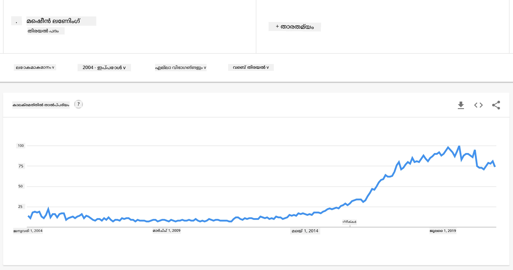
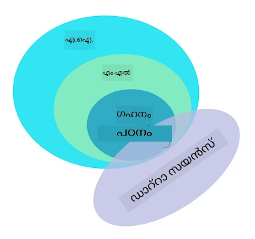

<!--
CO_OP_TRANSLATOR_METADATA:
{
  "original_hash": "69389392fa6346e0dfa30f664b7b6fec",
  "translation_date": "2025-12-19T13:24:00+00:00",
  "source_file": "1-Introduction/1-intro-to-ML/README.md",
  "language_code": "ml"
}
-->
# മെഷീൻ ലേണിങ്ങിലേക്ക് പരിചയം

## [പ്രീ-ലെക്ചർ ക്വിസ്](https://ff-quizzes.netlify.app/en/ml/)

---

> 🎥 ഈ പാഠം വിശദീകരിക്കുന്ന ഒരു ചെറിയ വീഡിയോക്കായി മുകളിൽ കാണുന്ന ചിത്രം ക്ലിക്ക് ചെയ്യുക.

മെഷീൻ ലേണിങ്ങിന്റെ ക്ലാസിക്കൽ കോഴ്സിലേക്ക് സ്വാഗതം! നിങ്ങൾ ഈ വിഷയത്തിൽ പൂർണ്ണമായും പുതുതായി ആണോ, അല്ലെങ്കിൽ ഒരു പരിചയസമ്പന്നനായ ML പ്രാക്ടീഷണറായിട്ടുണ്ടോ, ഞങ്ങൾ നിങ്ങളെ ഇവിടെ കാണാൻ സന്തോഷിക്കുന്നു! നിങ്ങളുടെ ML പഠനത്തിന് സൗഹൃദപരമായ ഒരു തുടക്കമിടാൻ ഞങ്ങൾ ആഗ്രഹിക്കുന്നു, കൂടാതെ നിങ്ങളുടെ [പ്രതികരണങ്ങൾ](https://github.com/microsoft/ML-For-Beginners/discussions) വിലയിരുത്താനും, മറുപടി നൽകാനും, ഉൾപ്പെടുത്താനും ഞങ്ങൾ ആഗ്രഹിക്കുന്നു.

> 🎥 മുകളിൽ കാണുന്ന ചിത്രം ക്ലിക്ക് ചെയ്യുക: MIT-യുടെ ജോൺ ഗുട്ടാഗ് മെഷീൻ ലേണിങ്ങിനെ പരിചയപ്പെടുത്തുന്നു

---
## മെഷീൻ ലേണിങ്ങ് ആരംഭിക്കുന്നത്

ഈ പാഠ്യപദ്ധതിയുമായി തുടങ്ങുന്നതിന് മുമ്പ്, നിങ്ങളുടെ കമ്പ്യൂട്ടർ സജ്ജമാക്കി, ലോക്കലായി നോട്ട്‌ബുക്കുകൾ പ്രവർത്തിപ്പിക്കാൻ തയ്യാറാക്കേണ്ടതാണ്.

- **ഈ വീഡിയോകൾ ഉപയോഗിച്ച് നിങ്ങളുടെ മെഷീൻ ക്രമീകരിക്കുക**. നിങ്ങളുടെ സിസ്റ്റത്തിൽ [Python ഇൻസ്റ്റാൾ ചെയ്യുന്നത്](https://youtu.be/CXZYvNRIAKM) എങ്ങനെ എന്നതും, വികസനത്തിനായി [ടെക്സ്റ്റ് എഡിറ്റർ സജ്ജമാക്കുന്നത്](https://youtu.be/EU8eayHWoZg) എങ്ങനെ എന്നതും പഠിക്കാൻ താഴെ കൊടുത്ത ലിങ്കുകൾ ഉപയോഗിക്കുക.
- **Python പഠിക്കുക**. ഈ കോഴ്സിൽ ഉപയോഗിക്കുന്ന, ഡാറ്റാ സയന്റിസ്റ്റുകൾക്ക് ഉപകാരപ്രദമായ പ്രോഗ്രാമിംഗ് ഭാഷയായ [Python](https://docs.microsoft.com/learn/paths/python-language/?WT.mc_id=academic-77952-leestott) അടിസ്ഥാനമായി അറിയുന്നത് ശുപാർശ ചെയ്യുന്നു.
- **Node.js, JavaScript പഠിക്കുക**. വെബ് ആപ്പുകൾ നിർമ്മിക്കുമ്പോൾ ഈ കോഴ്സിൽ JavaScript ചിലപ്പോൾ ഉപയോഗിക്കുന്നു, അതിനാൽ [node](https://nodejs.org)യും [npm](https://www.npmjs.com/)യും ഇൻസ്റ്റാൾ ചെയ്തിരിക്കണം, കൂടാതെ Python, JavaScript വികസനത്തിനായി [Visual Studio Code](https://code.visualstudio.com/) ലഭ്യമാകണം.
- **GitHub അക്കൗണ്ട് സൃഷ്ടിക്കുക**. നിങ്ങൾ ഇവിടെ [GitHub](https://github.com) വഴി എത്തിയതിനാൽ, നിങ്ങൾക്ക് അക്കൗണ്ട് ഉണ്ടാകാം, ഇല്ലെങ്കിൽ ഒരു അക്കൗണ്ട് സൃഷ്ടിച്ച് ഈ പാഠ്യപദ്ധതി ഫോർക്ക് ചെയ്ത് നിങ്ങളുടെ സ്വന്തം ഉപയോഗത്തിനായി ഉപയോഗിക്കുക. (നമുക്ക് ഒരു സ്റ്റാർ നൽകാനും മടിക്കേണ്ട 😊)
- **Scikit-learn പരിചയപ്പെടുക**. ഈ പാഠങ്ങളിൽ പരാമർശിക്കുന്ന ML ലൈബ്രറികളായ [Scikit-learn](https://scikit-learn.org/stable/user_guide.html) പരിചയപ്പെടുക.

---
## മെഷീൻ ലേണിങ്ങ് എന്താണ്?

'മെഷീൻ ലേണിങ്' എന്ന പദം ഇന്നത്തെ ഏറ്റവും ജനപ്രിയവും വ്യാപകമായി ഉപയോഗിക്കുന്ന പദങ്ങളിലൊന്നാണ്. നിങ്ങൾക്ക് സാങ്കേതികവിദ്യയിൽ ഏതെങ്കിലും പരിചയം ഉണ്ടെങ്കിൽ, ഈ പദം ഒരിക്കൽക്കെങ്കിലും കേട്ടിട്ടുണ്ടാകാനുള്ള സാധ്യത വളരെ കൂടുതലാണ്, നിങ്ങൾ ഏത് മേഖലയിലായാലും. എന്നാൽ മെഷീൻ ലേണിങ്ങിന്റെ യന്ത്രശാസ്ത്രം പലർക്കും രഹസ്യമാണ്. ഒരു മെഷീൻ ലേണിങ് തുടക്കക്കാരനായി, വിഷയം ചിലപ്പോൾ ഭീതിജനകമായിരിക്കാം. അതിനാൽ, മെഷീൻ ലേണിങ് എന്താണെന്ന് മനസ്സിലാക്കുകയും, പ്രായോഗിക ഉദാഹരണങ്ങളിലൂടെ ഘട്ടം ഘട്ടമായി പഠിക്കുകയും ചെയ്യുന്നത് പ്രധാനമാണ്.

---
## ഹൈപ്പ് കർവ്

> 'machine learning' എന്ന പദത്തിന്റെ പുതിയ 'ഹൈപ്പ് കർവ്' Google ട്രെൻഡ്സ് കാണിക്കുന്നു

---
## ഒരു രഹസ്യമായ ബ്രഹ്മാണ്ഡം

നാം രഹസ്യങ്ങളാൽ നിറഞ്ഞ ഒരു ബ്രഹ്മാണ്ഡത്തിൽ ജീവിക്കുന്നു. സ്റ്റീഫൻ ഹോക്കിംഗ്, ആൽബർട്ട് ഐൻസ്റ്റൈൻ തുടങ്ങിയ മഹാനായ ശാസ്ത്രജ്ഞർ ലോകത്തെ ചുറ്റിപ്പറ്റിയിരിക്കുന്ന രഹസ്യങ്ങൾ കണ്ടെത്താൻ അവരുടെ ജീവിതം സമർപ്പിച്ചിട്ടുണ്ട്. ഇത് മനുഷ്യന്റെ പഠനാവസ്ഥയാണ്: ഒരു മനുഷ്യശിശു പുതിയ കാര്യങ്ങൾ പഠിച്ച്, വളർന്ന് മുതിർന്നവനാകുമ്പോൾ അവരുടെ ലോകത്തിന്റെ ഘടന കണ്ടെത്തുന്നു.

---
## കുട്ടിയുടെ മസ്തിഷ്കം

ഒരു കുട്ടിയുടെ മസ്തിഷ്കവും ഇന്ദ്രിയങ്ങളും അവരുടെ ചുറ്റുപാടുകളിലെ വാസ്തവങ്ങൾ ഗ്രഹിച്ച്, ജീവിതത്തിലെ മറഞ്ഞിരിക്കുന്ന മാതൃകകൾ പഠിച്ച്, പഠിച്ച മാതൃകകൾ തിരിച്ചറിയാൻ തർക്കസഹിതമായ നിയമങ്ങൾ രൂപപ്പെടുത്താൻ സഹായിക്കുന്നു. മനുഷ്യ മസ്തിഷ്കത്തിന്റെ പഠന പ്രക്രിയ മനുഷ്യരെ ഈ ലോകത്തിലെ ഏറ്റവും സങ്കീർണ്ണമായ ജീവികളാക്കുന്നു. മറഞ്ഞിരിക്കുന്ന മാതൃകകൾ കണ്ടെത്തി തുടർച്ചയായി പഠിക്കുകയും, ആ മാതൃകകളിൽ നവീകരണം നടത്തുകയും ചെയ്യുന്നത് ജീവിതകാലം മുഴുവൻ നമ്മെ മെച്ചപ്പെടുത്താൻ സഹായിക്കുന്നു. ഈ പഠന ശേഷിയും വികസന ശേഷിയും [ബ്രെയിൻ പ്ലാസ്റ്റിസിറ്റി](https://www.simplypsychology.org/brain-plasticity.html) എന്ന ആശയവുമായി ബന്ധപ്പെട്ടിരിക്കുന്നു. ഉപരിതലമായി, മനുഷ്യ മസ്തിഷ്കത്തിന്റെ പഠന പ്രക്രിയക്കും മെഷീൻ ലേണിങ്ങിന്റെ ആശയങ്ങൾക്കും ചില പ്രചോദനാത്മക സാമ്യമുണ്ട്.

---
## മനുഷ്യ മസ്തിഷ്കം

[മനുഷ്യ മസ്തിഷ്കം](https://www.livescience.com/29365-human-brain.html) യഥാർത്ഥ ലോകത്തിൽ നിന്നുള്ള കാര്യങ്ങൾ ഗ്രഹിച്ച്, ഗ്രഹിച്ച വിവരങ്ങൾ പ്രോസസ്സ് ചെയ്ത്, യുക്തിപരമായ തീരുമാനങ്ങൾ എടുക്കുകയും, സാഹചര്യങ്ങൾ അനുസരിച്ച് ചില പ്രവർത്തനങ്ങൾ നടത്തുകയും ചെയ്യുന്നു. ഇതാണ് നാം ബുദ്ധിമുട്ടോടെ പെരുമാറുന്നത് എന്ന് വിളിക്കുന്നത്. ബുദ്ധിമുട്ടോടെ പെരുമാറുന്ന പ്രക്രിയയുടെ ഒരു പകർപ്പ് യന്ത്രത്തിൽ പ്രോഗ്രാം ചെയ്യുമ്പോൾ, അതിനെ കൃത്രിമ ബുദ്ധിമുട്ട് (AI) എന്ന് വിളിക്കുന്നു.

---
## ചില പദങ്ങൾ

പദങ്ങൾ ചിലപ്പോൾ ആശയക്കുഴപ്പമുണ്ടാക്കാം, എന്നാൽ മെഷീൻ ലേണിങ് (ML) കൃത്രിമ ബുദ്ധിമുട്ടിന്റെ ഒരു പ്രധാന ഉപവിഭാഗമാണ്. **ML പ്രത്യേക ആൽഗോരിതങ്ങൾ ഉപയോഗിച്ച് ഗ്രഹിച്ച ഡാറ്റയിൽ നിന്ന് അർത്ഥപൂർണമായ വിവരങ്ങൾ കണ്ടെത്തുകയും മറഞ്ഞിരിക്കുന്ന മാതൃകകൾ കണ്ടെത്തി യുക്തിപരമായ തീരുമാനമെടുക്കൽ പ്രക്രിയയെ സഹായിക്കുകയും ചെയ്യുന്നതാണ്**.

---
## AI, ML, ഡീപ് ലേണിങ്

> AI, ML, ഡീപ് ലേണിങ്, ഡാറ്റാ സയൻസ് എന്നിവയുടെ ബന്ധം കാണിക്കുന്ന ഒരു രേഖാചിത്രം. [Jen Looper](https://twitter.com/jenlooper) ഒരുക്കിയ ഇൻഫോഗ്രാഫിക്, [ഈ ഗ്രാഫിക്](https://softwareengineering.stackexchange.com/questions/366996/distinction-between-ai-ml-neural-networks-deep-learning-and-data-mining) പ്രചോദനമായി.

---
## പഠിക്കേണ്ട ആശയങ്ങൾ

ഈ പാഠ്യപദ്ധതിയിൽ, ഒരു തുടക്കക്കാരൻ അറിയേണ്ട മെഷീൻ ലേണിങ്ങിന്റെ പ്രധാന ആശയങ്ങൾ മാത്രമേ ഉൾക്കൊള്ളൂ. നാം 'ക്ലാസിക്കൽ മെഷീൻ ലേണിങ്' എന്ന് വിളിക്കുന്നതിൽ പ്രധാനമായും Scikit-learn ഉപയോഗിക്കുന്നു, ഇത് അടിസ്ഥാനങ്ങൾ പഠിക്കാൻ വിദ്യാർത്ഥികൾക്ക് മികച്ച ലൈബ്രറിയാണ്. കൃത്രിമ ബുദ്ധിമുട്ട് അല്ലെങ്കിൽ ഡീപ് ലേണിങ്ങിന്റെ വ്യാപക ആശയങ്ങൾ മനസ്സിലാക്കാൻ, മെഷീൻ ലേണിങ്ങിന്റെ ശക്തമായ അടിസ്ഥാന അറിവ് അനിവാര്യമാണ്, അതിനാൽ ഞങ്ങൾ അത് ഇവിടെ നൽകാൻ ആഗ്രഹിക്കുന്നു.

---
## ഈ കോഴ്സിൽ നിങ്ങൾ പഠിക്കേണ്ടത്:

- മെഷീൻ ലേണിങ്ങിന്റെ പ്രധാന ആശയങ്ങൾ
- ML-ന്റെ ചരിത്രം
- ML-നും നീതിക്കും
- റെഗ്രഷൻ ML സാങ്കേതികവിദ്യകൾ
- ക്ലാസിഫിക്കേഷൻ ML സാങ്കേതികവിദ്യകൾ
- ക്ലസ്റ്ററിംഗ് ML സാങ്കേതികവിദ്യകൾ
- നാച്ചുറൽ ലാംഗ്വേജ് പ്രോസസ്സിംഗ് ML സാങ്കേതികവിദ്യകൾ
- ടൈം സീരീസ് ഫോറ്കാസ്റ്റിംഗ് ML സാങ്കേതികവിദ്യകൾ
- റീ ഇൻഫോഴ്‌സ്‌മെന്റ് ലേണിങ്
- ML-ന്റെ യഥാർത്ഥ ലോക പ്രയോഗങ്ങൾ

---
## നാം ഉൾക്കൊള്ളാത്തത്

- ഡീപ് ലേണിങ്
- ന്യൂറൽ നെറ്റ്വർക്കുകൾ
- AI

മികച്ച പഠനാനുഭവത്തിനായി, ന്യൂറൽ നെറ്റ്വർക്കുകൾ, 'ഡീപ് ലേണിങ്' - ന്യൂറൽ നെറ്റ്വർക്കുകൾ ഉപയോഗിച്ച് പലതവണ മodel നിർമ്മാണം - എന്നിവയുടെ സങ്കീർണ്ണതകൾ ഒഴിവാക്കും, AI-യും മറ്റൊരു പാഠ്യപദ്ധതിയിൽ ചർച്ച ചെയ്യും. ഈ വലിയ മേഖലയിലെ മറ്റൊരു ഭാഗമായ ഡാറ്റാ സയൻസ് പാഠ്യപദ്ധതി വരാനിരിക്കുകയാണ്.

---
## മെഷീൻ ലേണിങ് പഠിക്കേണ്ടത് എന്തുകൊണ്ട്?

സിസ്റ്റംസ് കാഴ്ചപ്പാടിൽ, മെഷീൻ ലേണിങ് എന്നത് ഡാറ്റയിൽ നിന്ന് മറഞ്ഞിരിക്കുന്ന മാതൃകകൾ പഠിച്ച് ബുദ്ധിമുട്ടുള്ള തീരുമാനങ്ങൾ എടുക്കാൻ സഹായിക്കുന്ന സ്വയം പ്രവർത്തിക്കുന്ന സിസ്റ്റങ്ങൾ സൃഷ്ടിക്കലായി നിർവചിക്കപ്പെടുന്നു.

ഈ പ്രചോദനം മനുഷ്യ മസ്തിഷ്കം പുറത്തുള്ള ലോകത്തിൽ നിന്നുള്ള ഡാറ്റയിൽ നിന്ന് ചില കാര്യങ്ങൾ എങ്ങനെ പഠിക്കുന്നു എന്നതിൽ നിന്നാണ് സ്വതന്ത്രമായി പ്രചോദനം ലഭിക്കുന്നത്.

✅ ഒരു ബിസിനസ്സ് മെഷീൻ ലേണിങ് തന്ത്രങ്ങൾ ഉപയോഗിക്കാൻ ആഗ്രഹിക്കുന്നതിന്റെ കാരണം എന്തെന്ന് ഒരു നിമിഷം ചിന്തിക്കുക, ഹാർഡ്-കോഡഡ് നിയമങ്ങൾ അടിസ്ഥാനമാക്കിയുള്ള എഞ്ചിൻ സൃഷ്ടിക്കുന്നതിനേക്കാൾ.

---
## മെഷീൻ ലേണിങ്ങിന്റെ പ്രയോഗങ്ങൾ

ഇപ്പോൾ മെഷീൻ ലേണിങ്ങിന്റെ പ്രയോഗങ്ങൾ എല്ലായിടത്തും കാണപ്പെടുന്നു, നമ്മുടെ സമൂഹങ്ങളിൽ സ്മാർട്ട് ഫോണുകൾ, കണക്ടഡ് ഉപകരണങ്ങൾ, മറ്റ് സിസ്റ്റങ്ങൾ എന്നിവ വഴി സൃഷ്ടിക്കപ്പെടുന്ന ഡാറ്റ പോലെ വ്യാപകമാണ്. അത്യാധുനിക മെഷീൻ ലേണിങ് ആൽഗോരിതങ്ങളുടെ വലിയ സാധ്യത പരിഗണിച്ച്, ഗവേഷകർ ബഹുമാനമായ, ബഹുമുഖ, ബഹുവിഭാഗീയ യഥാർത്ഥ ജീവിത പ്രശ്നങ്ങൾ പരിഹരിക്കാൻ അവരുടെ കഴിവ് പരിശോധിച്ചു.

---
## പ്രയോഗിച്ച ML-ന്റെ ഉദാഹരണങ്ങൾ

**മെഷീൻ ലേണിങ് പലവിധത്തിൽ ഉപയോഗിക്കാം**:

- രോഗിയുടെ മെഡിക്കൽ ചരിത്രം അല്ലെങ്കിൽ റിപ്പോർട്ടുകളിൽ നിന്നുള്ള രോഗ സാധ്യത പ്രവചിക്കാൻ.
- കാലാവസ്ഥാ ഡാറ്റ ഉപയോഗിച്ച് കാലാവസ്ഥാ സംഭവങ്ങൾ പ്രവചിക്കാൻ.
- ഒരു എഴുത്തിന്റെ മനോഭാവം മനസ്സിലാക്കാൻ.
- പ്രചാരണം തടയാൻ വ്യാജ വാർത്തകൾ കണ്ടെത്താൻ.

ഫിനാൻസ്, സാമ്പത്തികം, ഭൂമിശാസ്ത്രം, ബഹിരാകാശ ഗവേഷണം, ബയോമെഡിക്കൽ എഞ്ചിനീയറിംഗ്, കോഗ്നിറ്റീവ് സയൻസ്, മനുഷ്യശാസ്ത്രം തുടങ്ങിയ മേഖലകൾ അവരുടെ കഠിനമായ, ഡാറ്റാ പ്രോസസ്സിംഗ് ഭാരമുള്ള പ്രശ്നങ്ങൾ പരിഹരിക്കാൻ മെഷീൻ ലേണിങ് സ്വീകരിച്ചിട്ടുണ്ട്.

---
## സമാപനം

മെഷീൻ ലേണിങ് യഥാർത്ഥ ലോകം അല്ലെങ്കിൽ സൃഷ്ടിച്ച ഡാറ്റയിൽ നിന്ന് അർത്ഥപൂർണമായ洞察ങ്ങൾ കണ്ടെത്തി മാതൃകകൾ കണ്ടെത്തുന്ന പ്രക്രിയ സ്വയം പ്രവർത്തിപ്പിക്കുന്നു. ബിസിനസ്സ്, ആരോഗ്യ, സാമ്പത്തിക പ്രയോഗങ്ങളിൽ അതിന്റെ മൂല്യം തെളിയിച്ചിട്ടുണ്ട്.

സമീപഭാവിയിൽ, മെഷീൻ ലേണിങ്ങിന്റെ അടിസ്ഥാനങ്ങൾ മനസ്സിലാക്കുന്നത് ഏത് മേഖലയിലുള്ളവർക്കും അനിവാര്യമായിരിക്കും, അതിന്റെ വ്യാപകമായ സ്വീകരണത്തെ തുടർന്ന്.

---
# 🚀 ചലഞ്ച്

കാഗിതത്തിൽ അല്ലെങ്കിൽ [Excalidraw](https://excalidraw.com/) പോലുള്ള ഓൺലൈൻ ആപ്പ് ഉപയോഗിച്ച് AI, ML, ഡീപ് ലേണിങ്, ഡാറ്റാ സയൻസ് എന്നിവയുടെ വ്യത്യാസങ്ങൾ നിങ്ങൾ എങ്ങനെ മനസ്സിലാക്കുന്നു എന്ന് രേഖപ്പെടുത്തുക. ഓരോ സാങ്കേതികവിദ്യയും പരിഹരിക്കാൻ നല്ല പ്രശ്നങ്ങളുടെ ചില ആശയങ്ങളും ചേർക്കുക.

# [പോസ്റ്റ്-ലെക്ചർ ക്വിസ്](https://ff-quizzes.netlify.app/en/ml/)

---
# അവലോകനം & സ്വയം പഠനം

ക്ലൗഡിൽ ML ആൽഗോരിതങ്ങളുമായി എങ്ങനെ പ്രവർത്തിക്കാമെന്ന് കൂടുതൽ അറിയാൻ, ഈ [Learning Path](https://docs.microsoft.com/learn/paths/create-no-code-predictive-models-azure-machine-learning/?WT.mc_id=academic-77952-leestott) പിന്തുടരുക.

ML അടിസ്ഥാനങ്ങളെക്കുറിച്ച് പഠിക്കാൻ ഒരു [Learning Path](https://docs.microsoft.com/learn/modules/introduction-to-machine-learning/?WT.mc_id=academic-77952-leestott) സ്വീകരിക്കുക.

---
# അസൈൻമെന്റ്

[Get up and running](assignment.md)

---

<!-- CO-OP TRANSLATOR DISCLAIMER START -->
**അസൂയാ**:  
ഈ രേഖ AI വിവർത്തന സേവനം [Co-op Translator](https://github.com/Azure/co-op-translator) ഉപയോഗിച്ച് വിവർത്തനം ചെയ്തതാണ്. നാം കൃത്യതയ്ക്ക് ശ്രമിച്ചിട്ടുണ്ടെങ്കിലും, സ്വയം പ്രവർത്തിക്കുന്ന വിവർത്തനങ്ങളിൽ പിശകുകൾ അല്ലെങ്കിൽ തെറ്റുകൾ ഉണ്ടാകാമെന്ന് ദയവായി ശ്രദ്ധിക്കുക. അതിന്റെ മാതൃഭാഷയിലുള്ള യഥാർത്ഥ രേഖ പ്രാമാണികമായ ഉറവിടമായി കണക്കാക്കണം. നിർണായകമായ വിവരങ്ങൾക്ക്, പ്രൊഫഷണൽ മനുഷ്യ വിവർത്തനം ശുപാർശ ചെയ്യപ്പെടുന്നു. ഈ വിവർത്തനം ഉപയോഗിക്കുന്നതിൽ നിന്നുണ്ടാകുന്ന ഏതെങ്കിലും തെറ്റിദ്ധാരണകൾക്കോ തെറ്റായ വ്യാഖ്യാനങ്ങൾക്കോ ഞങ്ങൾ ഉത്തരവാദികളല്ല.
<!-- CO-OP TRANSLATOR DISCLAIMER END -->