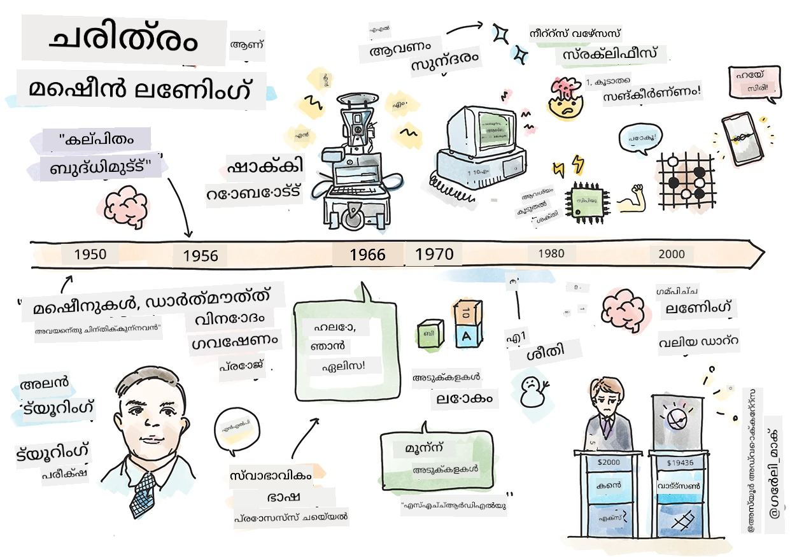
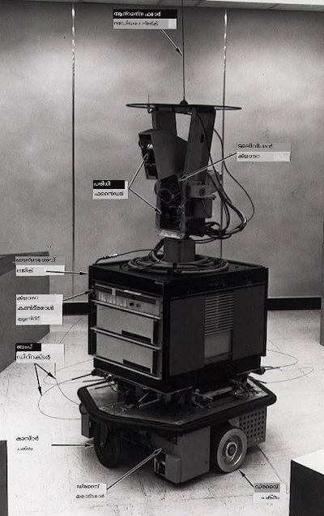
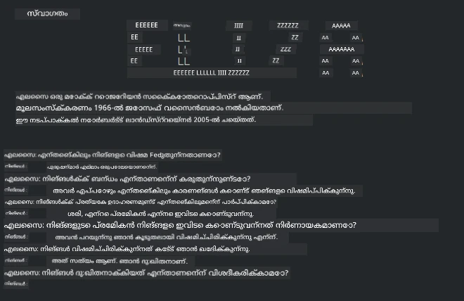

# മെഷീൻ ലേണിങിന്റെ ചരിത്രം

> സ്കെച്ച്നോട്ട് [Tomomi Imura](https://www.twitter.com/girlie_mac) യാൽ

## [പഠനത്തിനു മുൻപ് ക്വിസ്](https://ff-quizzes.netlify.app/en/ml/)

---

> 🎥 ഈ പാഠം വിശദീകരിക്കുന്ന ചെറിയ വീഡിയോക്കായി മുകളിൽ ചിത്രം ക്ലിക്കുചെയ്യുക.

ഈ പാഠത്തിൽ, മെഷീൻ ലേണിങിന്റെയും കൃത്രിമ ബുദ്ധിമുട്ടിന്റെയും ചരിത്രത്തിലെ പ്രധാന മുന്നേറ്റങ്ങളിലൂടെ നാം വഴിതെളിച്ചുപോകും.

മെഷീൻ ലേണിങ് പിന്തുടരുന്ന ആൾഗോറിതങ്ങൾക്കും കണക്കുകൂട്ടൽ പുരോഗതികൾക്കും അടിസ്ഥാനമായതിനാൽ കൃത്രിമ ബുദ്ധിമുട്ടിന്റെ (AI) ചരിത്രം ഈ മേഖലയുടെ ചരിത്രത്തോടൊപ്പം ചേർന്നതാണ്. 1950-കളിൽ ഈ വിഷയങ്ങൾ വ്യക്തമായ വ്യത്യസ്ത അന്വേഷണ മേഖലകളായി ആരംഭിച്ചതായിരിക്കുമ്പോഴും, പ്രധാനപ്പെട്ട [ആൾഗോറിത്മിക്, സംഖ്യാത്മക, ഗണിത, കണക്കുകൂട്ടൽ, സാങ്കേതിക കണ്ടെത്തലുകൾ](https://wikipedia.org/wiki/Timeline_of_machine_learning) ഈ കാലഘട്ടത്തിനു മുൻപും യഥാർഥവും ഉണ്ടായിരിന്നു. വാസ്തവത്തിൽ, ആളുകൾ ഈ ചോദ്യങ്ങളെ കുറിച്ച് [നൂറുകണക്കിന് വർഷങ്ങൾക്കു മുമ്പേ](https://wikipedia.org/wiki/History_of_artificial_intelligence) ആലോചിച്ചിരിക്കുന്നു: ഈ ലേഖനം 'ചിന്തിക്കുന്ന യന്ത്രം' എന്ന ആശയത്തിന്റെ ചരിത്ര ബൗദ്ധിക അടിസ്ഥാനങ്ങളെ വിസ്തരിച്ച് പറയുന്നു.

---
## ശ്രദ്ധേയമായ കണ്ടെത്തലുകൾ

- 1763, 1812 [ബെയ്സ് തിയോറം](https://wikipedia.org/wiki/Bayes%27_theorem) കൂടാതെ ദാർശനികർ. ഈ തിയോറവും അതിന്റെ പ്രയോഗങ്ങളും പിൻവലിക്കൽ അടിസ്ഥാനമാക്കുന്നു, മുൻകാല അറിവിൽ നിന്നും ഒരു സംഭവത്തിന്റെ സാധ്യത വിവരിച്ചുകൊണ്ട്.
- 1805 ഫ്രഞ്ച് ഗണിതജ്ഞൻ അഡ്രിയൻ-മേരി ലെജാംഡ്രിന്റെ [ലീസ്റ്റ് സ്ക്വയർ തിയറി](https://wikipedia.org/wiki/Least_squares). നമ്മുടെ റെഗ്രഷൻ യൂണിറ്റിൽ നിങ്ങൾ ഇതിനെക്കുറിച്ച് പഠിക്കും, ഇത് ഡാറ്റ ഫിറ്റിംഗിന് സഹായിക്കുന്നു.
- 1913 റഷ്യൻ ഗണിതജ്ഞൻ ആൻഡ്രി മാർകോവിന്റെ പേര് ചേരുന്ന [മാർകൊവ് ചെയിൻസ്](https://wikipedia.org/wiki/Markov_chain), മുൻനിലയുടെ അടിസ്ഥാനത്തിൽ സംഭവങ്ങളുടെ അനുക്രമം വർണ്ണിക്കുന്നു.
- 1957 അമേരിക്കൻ മനഃശാസ്ത്രജ്ഞൻ ഫ്രാങ്ക് റൊസൻബ്ലാട്ട് കണ്ട താരം[പർസെപ്ട്രോൺ](https://wikipedia.org/wiki/Perceptron), ലിനീയർ ക്ലാസ്സിഫയർ ആണിത്, ഡീപ് ലേണിങിൽ മുന്നേറ്റങ്ങൾക്ക് അടിസ്ഥാനം.

---

- 1967 [നെയർസ്റ്റ് നേബറ്സ്](https://wikipedia.org/wiki/Nearest_neighbor) ആൽഗോറിതം ആദ്യം റൂട്ടുകൾ മാപ്പുചെയ്യുന്നതിനായി രൂപകൽപ്പന ചെയ്‌തത്. മെഷീൻ ലേണിങിൽ ഇത് മാതൃകകൾ കണ്ടെത്താനുപയോഗിക്കുന്നു.
- 1970 [ബാക്ക് പ്രൊപഗേഷൻ](https://wikipedia.org/wiki/Backpropagation) [ഫീഡ്‌ഫോർവേഡ് ന്യൂറൽ നെറ്റ്വർക്കുകൾ](https://wikipedia.org/wiki/Feedforward_neural_network) പരിശീലിക്കാൻ ഉപയോഗിക്കുന്നു.
- 1982 [റികറന്റ് ന്യൂറൽ നെറ്റ്വർക്കുകൾ](https://wikipedia.org/wiki/Recurrent_neural_network) ഫീഡ്‌ഫോർവേഡ് ന്യൂറൽ നെറ്റ്വർക്കിൽ നിന്നുള്ള ആ നിർമാണമാണ്, കാലപരിധി ഗ്രാഫുകൾ സൃഷ്ടിക്കുന്നു.

✅ ചെറിയൊരു ഗവേഷണം നടത്തൂ. മെഷീൻ ലേണിങ്, AI ചരിത്രത്തിലെ മറ്റേതെങ്കിലും പ്രധാന തീയതികൾ എന്തെല്ലാം?

---
## 1950: ചിന്തിക്കുന്ന യന്ത്രങ്ങൾ

20-ആം നൂറ്റാണ്ടിലെ ഏറ്റവും വലിയ ശാസ്ത്രജ్ఞനായി [പൊതു വോട്ടിൽ 2019-ൽ](https://wikipedia.org/wiki/Icons:_The_Greatest_Person_of_the_20th_Century) തെരഞ്ഞെടുക്കപ്പെട്ട അലിയൻ ട്യൂറിങ്, 'ചിന്തിക്കാവുന്ന യന്ത്രം' എന്ന ആശയത്തിന് അടിസ്ഥാനം പടുത്തുയർത്താൻ സഹായിച്ചു. ഇതിനായി empirical സംശയക്കാർക്കും സ്വന്തം സംശയങ്ങൾക്കും മറുപടി നൽകുവാനുള്ള ശ്രമത്തിൽ [ട്യൂറിംഗ് ടെസ്റ്റ്](https://www.bbc.com/news/technology-18475646) അദ്ദേഹം സൃഷ്ടിച്ചു, നിങ്ങളുടെ NLP പാഠങ്ങളിൽ ഇത് പരിശോധിക്കപ്പെടും.

---
## 1956: ഡാർട്മൗത്ത് ശീതകാല ഗവേഷണ പദ്ധതി

"അ人工ീം ബുദ്ധിമുട്ടിന്റെ ഒരു മേഖലയായ ഡാർട്മൗത്ത് ശീതകാല ഗവേഷണ പദ്ധതി ഒരു മൂല്യവത്തായ സംഭവം ആയിരുന്നു", ഇവിടെ 'അ人工ീം ബുദ്ധി' എന്ന പദം ആദ്യമായി പരാമർശിച്ചു ([മൂലം](https://250.dartmouth.edu/highlights/artificial-intelligence-ai-coined-dartmouth)).

> പഠനത്തിന്റെ എല്ലാ വശങ്ങളെയും ബുദ്ധിമുട്ടിന്റെ മറ്റേതെങ്കിലും ഘടകവും നിജത്തിൽ വളരെ കൃത്യമായി വിശദീകരിക്കാൻ കഴിയും, അങ്ങനെ ഒരു യന്ത്രം അത് അനുകരണം ചെയ്യാൻ കഴിയും.

---

മുൻനിര ഗവേഷകൻ, ഗണിത ശാസ്ത്ര പ്രൊഫസർ ജോൺ മക്കാർത്തി, "പാഠം പഠനത്തിന്റെയും ബുദ്ധിമുട്ടിന്റെ ഏതൊരു ഘടകവും അത്ര കൃത്യമായി ചിത്രീകരിക്കാമെന്ന് സമർത്ഥിച്ചാൽ, അതിന്റെ അനുകരണം ചെയ്യാൻ യന്ത്രം ഉണ്ടാക്കാമെന്ന് കരുതുന്നു" എന്ന് പ്രതീക്ഷിച്ചിരുന്നു. പങ്കെടുത്തവരിൽ Marvin Minsky എന്ന മറ്റൊരു പ്രശസ്ത വ്യക്തി ഉൾപ്പെട്ടിരുന്നു.

ഈ വർക്ക്‌ഷോപ്പ് സංකേതാത്മക രീതി, പ്രത്യേക ആവിഷ്കാരങ്ങളുള്ള സിസ്റ്റങ്ങൾ (ആർഭാട വിദഗ്ധ സിസ്റ്റങ്ങൾ), ഡെഡക്ഷൻ സിസ്റ്റങ്ങൾ എതിരായി ഇൻഡക്ഷൻ സിസ്റ്റങ്ങൾ തുടങ്ങിയ ചർച്ചകൾ ആരംഭിച്ച് പ്രോത്സാഹനം നൽകി ([മൂലം](https://wikipedia.org/wiki/Dartmouth_workshop)).

---
## 1956 - 1974: "സ്വർണ്ണകാലം"

1950-കളിൽ തുടങ്ങി 70കളുടെ മദ്ധ്യകാലത്തിനിടയിൽ, AI പല പ്രശ്നങ്ങളും പരിഹരിക്കുമെന്നാണ് ഉയർന്ന പ്രതീക്ഷ. 1967-ൽ Marvin Minsky ഉറച്ച് പറഞ്ഞു, "ഒരു തലമുറയ്ക്ക് ഉള്ളിൽ 'അ人工ീം ബുദ്ധിമുട്ട്' സൃഷ്ടി പ്രശ്‌നം വളരെയധികം പരിഹരിക്കപ്പെടും." (Minsky, Marvin (1967), Computation: Finite and Infinite Machines, Englewood Cliffs, N.J.: Prentice-Hall)

നാടപരിഭാഷാ പ്രോസസ്സിംഗ് ഗവേഷണം വളർന്നു, ശോധനം ത്യൂതമുന്നതായി മെച്ചപ്പെട്ടു, 'സൂക്ഷ്മ ലോകങ്ങൾ' എന്ന ആശയം രൂപംകൂട്ടി വായസഹിത പ്രവർത്തനങ്ങൾ ചെയ്ത് ലളിതമായ കീഴ്വഴക്കങ്ങൾ പ്രഖ്യാപിച്ചു.

---

ഗവേഷണം സർക്കാർ ഏജൻസികൾ നൽകുന്ന ധനസഹായത്തോടെ പുരോഗമിച്ചു, കണക്കുകൂട്ടലിലും ആൾഗോറിതങ്ങളിൽ പുരോഗതി ഉണ്ടായി, ബുദ്ധിമുട്ടുള്ള യന്ത്രങ്ങളുടെ മാതൃകകൾ നിർമ്മിക്കപ്പെട്ടു. അവയിലെ ചിലയിടങ്ങൾ:

* [ഷാക്കി റോബോട്ട്](https://wikipedia.org/wiki/Shakey_the_robot), 'ബുദ്ധിമുട്ടോടെ' പ്രവർത്തിക്കാൻ കഴിവുള്ള റോബോട്ട്.

    
    > 1972-ൽ ഷാക്കി

---

* എലൈസ, ഒരുദ്വേഗ 'ചാറ്റർബോട്ട്', മനുഷ്യരുമായി സംവദിക്കുകയും പ്രാചീന 'തെറാപ്പിസ്റ്റ്' എന്ന നിലയിൽ പ്രവർത്തിക്കുകയും ചെയ്തു. NLP പാഠ്യത്തിൽ നിങ്ങൾ കൂടുതൽ അറിയും.

    
    > എലൈസയുടെ ഒരു പതിപ്പ്, ചാറ്റ്ബോട്ട്

---

* "ബ്ലോക്കുകൾ ലോകം" മൈക്രോ-ലോകത്തിന്റെ ഉദാഹരണമായി ബെന്നുകൾ ഘടിപ്പിക്കുകയും ക്രമീകരിക്കുകയും ചെയ്തു. യന്ത്രങ്ങൾക്ക് തീരുമാനമെടുക്കാൻ പഠിപ്പിക്കുന്ന പരീക്ഷണങ്ങൾ നടത്തിയിരുന്നു. [SHRDLU](https://wikipedia.org/wiki/SHRDLU) പോലുള്ള ലൈബ്രറികളോടെനടത്തപ്പെട്ട പുരോഗതികൾ ഭാഷ പ്രോസസ്സിങിൽ സഹായിച്ചു.

    

    > 🎥 മുകളിൽ ചിത്രത്തെ ക്ലിക്കുചെയ്യുക: SHRDLU ഉപയോഗിച്ചുള്ള ബ്ലോക്കുകൾ ലോകം വീഡിയോ

---
## 1974 - 1980: "AI ശൈത്യകാലം"

1970-കളുടെ മദ്ധ്യത്തിൽ 'ബുദ്ധിമുട്ടുള്ള യന്ത്രങ്ങൾ' നിർമ്മിക്കുന്നതിലെ സങ്കീർണ്ണത കുറവായി പറഞ്ഞ് വമ്പനാകില്ലെന്ന് തെളിഞ്ഞു. ലഭ്യമായ കണക്കു ശക്തി പരിഹാരത്തിന്റെ വാഗ്ദാനത്തെ വലിയതാക്കിയത്. ഫണ്ടിംഗ് ശൂന്യപ്പെട്ടു, മേഖലയിൽ ആത്മവിശ്വാസം കുറയാൻ തുടങ്ങിയതായി മനസ്സിലായി. വിശ്വാസത്തെ ബാധിച്ച ചില പ്രശ്നങ്ങൾ:
---
- **പരിമിതികൾ**. കണക്കുകൂട്ടൽ ശക്തി വളരെ പരിമിതമായിരുന്നു.
- **കമ്പിനേറ്റോറിയൽ സ്ഫോടനം**. കണക്കു ശേഷിയുടെ ഉയർച്ചയോ ശേഷി വളർച്ചയോ കൂടാതെ параметറുകൾ വഹിപ്പിക്കാൻ ആവശ്യമായ എണ്ണം അക്കാലയുകത്തിൽ വളർന്നു.
- **ഡാറ്റയുടെ അപര്യാപ്തി**.യുടെ ეტാസ്റ്റിംഗ്, വികസനം, ആൾഗോറിതം മെച്ചപ്പെടുത്തൽ പ്രക്രിയ തടയുന്ന അപര്യാപ്തമായ ഡാറ്റ.
- **നാം ശരിയായ ചോദ്യങ്ങൾ ചോദിക്കുന്നുണ്ടോ?**. ചോദിക്കുന്ന ചോദ്യങ്ങളെയ്ക്കു പോലും സംശയം ഉയർന്നു. ഗവേഷകർ അവരുടെ സമീപനങ്ങൾ കുറിച്ച് വിമർശനം ഏറ്റെടുത്തു:
  - ട്യൂറിങ് ടെസ്റ്റുകൾ ചൈനീസ് റൂം തിയറിയാൽ ചോദ്യംചെയ്യപ്പെട്ടു: "ഡിജിറ്റൽ കമ്പ്യൂട്ടർ പ്രോഗ്രാമിംഗ് ഭാഷ മനസിലാക്കുന്നില്ലാജ്ഞിതപണ്ഡിതൻ കാട്ടും, പക്ഷെ യഥാർത്ഥ മനസ്സിലാക്കൽ ഉണ്ടാക്കാൻ കഴിയില്ല." ([മൂലം](https://plato.stanford.edu/entries/chinese-room/))
  - 'തെറാപ്പിസ്റ്റ്' എലൈസ പോലെയുള്ള കൃത്രിമ ബുദ്ധിമുട്ടുകളുടെ സമൂഹത്തിൽ പരിചയം എടുക്കുന്നത് നൈതികമായി ചോദ്യംചെയ്യപ്പെട്ടു.

---

ഒരേ സമയം, വിവിധ AI ചിന്താശാലകൾ രൂപം കൊണ്ടു. ["സ്ക്രഫി" എന്നത് Vs. "നീറ്റ് AI"](https://wikipedia.org/wiki/Neats_and_scruffies) എന്ന രണ്ടു വൈവിധ്യമാർന്ന പ്രക്രിയകൾ നിലനിന്നു. _സ്ക്രഫി_ ലബോറട്ടറികൾ മണിക്കൂറുകളായി പ്രോഗ്രാമുകൾ തിരുത്തി ആവശ്യമായ ഫലം കാണിച്ചത്. _നീറ്റ്_ ലബോറട്ടറികൾ "തര്‍ക്കവും ഔപചാരിക പ്രശ്‌നം പരിഹാരവും" ലക്ഷ്യം വച്ചിരുന്നു. എലൈസയും SHRDLUയും പ്രശസ്തമായ _സ്ക്രഫി_ സംവിധാനങ്ങളായിരുന്നു. 1980-കളിൽ ML സംവിധാനങ്ങൾ പുനരുപയോഗയോഗ്യമാക്കേണ്ട ആവശ്യകം ഉയർന്നപ്പോൾ, വിശദീകരിക്കാവുന്ന ഫലങ്ങൾ ലഭിച്ചതിനാൽ _നീറ്റ്_ സമീപനം മുൻതൂക്കം നേടിയെടുത്തു.

---
## 1980-കൾ വിദഗ്ധ സിസ്റ്റങ്ങൾ

ഈ മേഖലയിലെ വളർച്ചയോടൊപ്പം, ബിസിനസുകൾക്ക് അതിന്റെ ഉപയോഗം വ്യക്തമാകാൻ തുടങ്ങി, 1980-കളിൽ 'വിദഗ്ധ സിസ്റ്റങ്ങൾ' വ്യാപിച്ചു. "വിദഗ്ധ സിസ്റ്റങ്ങൾ അസൽ വിജയകരമായ കൃത്രിമ ബുദ്ധി സോഫ്‌റ്റ്‌വെയർ രൂപങ്ങൾക്കുളളതാണ്." ([മൂലം](https://wikipedia.org/wiki/Expert_system))

ഈ വിഭാഗം _ഹൈബ്രിഡ്_ ആണ്, ഒരു വിധം reglas എഞ്ചിൻ ബിസിനസ് ആവശ്യങ്ങൾ കേസ് നിർവചിക്കുന്നു, മറ്റൊരു വിഭാഗം inference engine പുതിയ സങ്കൽപങ്ങൾ കണ്ടെത്താനായി നിയമപ്രക്രിയ പ്രയോഗിക്കുന്നു.

ഈ ഘട്ടത്തിൽ ന്യൂറൽ നെറ്റ്‌വർക്ക് ഗവേഷണത്തിലും വർദ്ധിച്ച ശ്രദ്ധ അനുവദിച്ചു.

---
## 1987 - 1993: AI 'തണുപ്പ്'

വിദഗ്ധ ഹൈഡ്‌വെയർ വ്യാപനം അത്യുന്നതമായ പ്രത്യേകത സൃഷ്ടിച്ചത്. വ്യക്തിഗത കമ്പ്യൂട്ടറുകൾ പകരം keskuskoneisiin. കംപ്യൂട്ടിങ്ങിന്റെ ജനപ്രിയം തുടക്കമായി, അത് ഇന്ന് പലയിടത്തും വൻ ഡാറ്റയുടെ വ്യാപനത്തിന് വഴിയൊരുക്കി.

---
## 1993 - 2011

ഈ കാലഘട്ടം മെഷീൻ ലേണിങ്, AIക്ക് മുമ്പ് ഉണ്ടാക്കിയ ഒരു ഡാറ്റയും കംപ്യൂട്ടിങ്ങ് ശേഷിയും കുറവുള്ള പ്രശ്നങ്ങൾ പരിഹരിക്കാൻ സഹായിച്ചു. ഡാറ്റയുടെ അളവ് വേഗത്തിലായി വർദ്ധിച്ച് വ്യാപിച്ചു, പ്രത്യേകിച്ച് 2007 ഓളം സ്മാർട്ട്ഫോൺ വരവോടെ. കംപ്യൂട്ടിങ്ങ് ശേഷി exponential ആയി വളർന്നു, ആൾഗോറിതങ്ങൾ മാറി. ഈ മേഖല ഒരു സത്യായിരിക്കുന്ന വിദ്യയാക്കാൻ തുടങ്ങിയത്.

---
## ഇപ്പോൾ

ഇന്ന് മെഷീൻ ലേണിങും AIഉം നമുക്ക് ജീവിതത്തിലെ 거의 എല്ലായിടത്തും സ്പർശിക്കുന്നു. ഈ കാലഘട്ടം algorithmകൾ മനുഷ്യജീവിതത്തെ ബാധിക്കുന്ന જોખങ്ങളും സാധ്യതകളും സൂക്ഷ്മമായി മനസ്സിലാക്കണമെന്ന് ആവശ്യപ്പെടുന്നു. മൈക്രോസോഫ്റ്റിന്റെ ബ്രാഡ് സ്മിത്തിന്റെ ചിത്രം: "ഇൻഫർമേഷൻ ടെക്നോളജി സ്വകാര്യതയിലും വ്യകതാഗതസ്വാതന്ത്ര്യത്തിലും അടിസ്ഥാന മനുഷ്യാവകാശ സംരക്ഷണ ലക്ഷ്യങ്ങളിലേക്കുള്ള ചോദ്യങ്ങൾ ഉന്നയിക്കുന്നു. ആ ഉൽപ്പന്നങ്ങൾ സൃഷ്ടിക്കുന്ന ടെക്ക് സ്ഥാപനങ്ങളുടെ ഉത്തരവാദിത്വം വർദ്ധിക്കുന്നു. ഞങ്ങളുടെ അഭിപ്രായത്തിൽ, ഇത് ഗവൺമെന്റ് നിയന്ത്രണത്തിനും നിയമനിഷ്കർഷണത്തിനും ആവശ്യമാണ്" ([മൂലം](https://www.technologyreview.com/2019/12/18/102365/the-future-of-ais-impact-on-society/)).

---

ഭാവി എന്തെന്താകും എന്ന് കാണാനുണ്ട്, പക്ഷെ ഈ കമ്പ്യൂട്ടർ സംവിധാനങ്ങളും അവർ ഓടിക്കുന്ന സോഫ്റ്റ്വെയറും ആൾഗോറിതങ്ങളും മനസ്സിലാക്കുക പ്രധാനമാണ്. ഈ കരിക്കുലം നിങ്ങളെ മികച്ച മനസ്സിലാക്കലിലേക്ക് സഹായിക്കുമെന്നും ആശിക്കുന്നു, അതിനാൽ আপনি സ്വയം തീരുമാനിക്കാം.

> 🎥 മുകളിലുള്ള ചിത്രം ക്ലിക്കുചെയ്യുക: യാൻ ലെകാൻ ഈ കൗസിൽ ഡീപ് ലേണിങിന്റെ ചരിത്രത്തെക്കുറിച്ച് സംസാരിക്കുന്നു

---
## 🚀പ്രതിസന്ധി

ഈ ചരിത്രപർവതങ്ങളുടെ ഒരയിൽ ഈഴുക്കി അവയുടെ പിന്നിൽ ഉള്ള ആളുകളെക്കുറിച്ച് കൂടുതൽ പഠിക്കൂ. അത്ഭുതകരമായ വ്യക്തികൾ ഉണ്ട്, ശാസ്ത്ര വികസനം ഒരിക്കലും സാംസ്കാരിക ശൂന്യതയിൽ നടന്നിട്ടില്ല. നിങ്ങൾ എന്ത് കണ്ടെത്തുന്നു?

## [പാഠത്തിന് ശേഷമുള്ള ക്വിസ്](https://ff-quizzes.netlify.app/en/ml/)

---
## അവലോകനം & സ്വയം പഠനം

കാണാനും കേൾക്കാനും ഉള്ള എന്തൊക്കെയാണ്:

[ഈ പോഡ്കാസ്റ്റിൽ Amy Boyd AIയുടെ വികാസത്തെക്കുറിച്ച് സംസാരിക്കുന്നു](http://runasradio.com/Shows/Show/739)

---

## അസൈനംന്റ്

[ഒരു സമയരേഖ സൃഷ്ടിക്കുക](assignment.md)

---

<!-- CO-OP TRANSLATOR DISCLAIMER START -->
**അറിയിപ്പ്**:
ഈ രേഖ AI പരിഭാഷാ സേവനം [Co-op Translator](https://github.com/Azure/co-op-translator) ഉപയോഗിച്ച് പരിഭാഷപ്പെടുത്തിയതാണ്. ഞങ്ങൾ കൃത്യതയ്ക്കായി ശ്രമിക്കുന്നുവെങ്കിലും, ഓട്ടോമേറ്റഡ് പരിഭാഷകളിൽ പിഴവുകൾ അല്ലെങ്കിൽ തെറ്റായ വിവരങ്ങൾ ഉണ്ടാകാൻ സാധ്യതയുണ്ട്. അതിന്റെ സ്വാഭാവിക ഭാഷയിലുള്ള അസൽ രേഖയാണ് പ്രാമാണികമായ ഉറവിടമായി പരിഗണിക്കേണ്ടത്. നിർണായകമായ വിവരങ്ങൾക്ക്, പ്രൊഫഷണൽ മനുഷ്യ പരിഭാഷ ശുപാർശ ചെയ്യുന്നു. ഈ പരിഭാഷ ഉപയോഗിച്ച് ഉണ്ടാകുന്ന തെറ്റിദ്ധാരണകൾ അല്ലെങ്കിൽ തെറ്റായ വ്യാഖ്യാനങ്ങൾക്കായി ഞങ്ങൾ ഉത്തരവാദികളല്ല.
<!-- CO-OP TRANSLATOR DISCLAIMER END -->