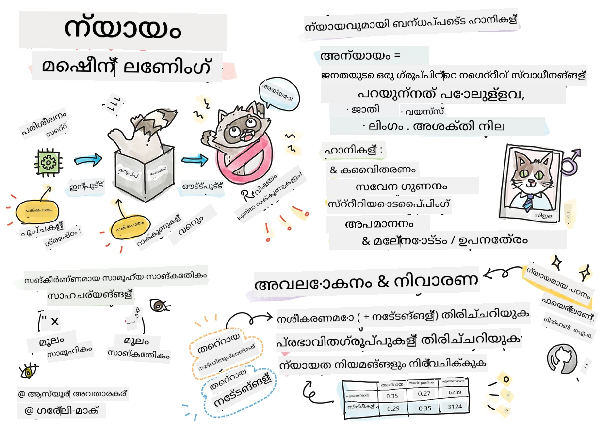
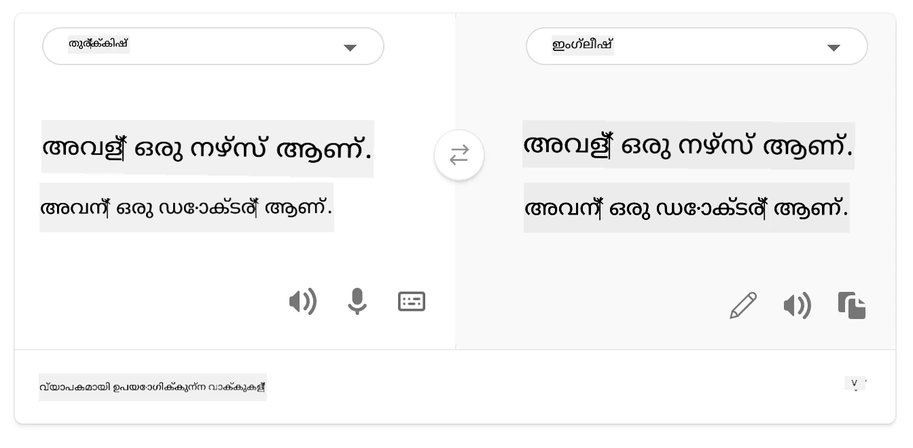

# ഉത്തരവാദിത്വമുള്ള AI ഉപയോഗിച്ച് മെഷീൻ ലേണിംഗ് പരിഹാരങ്ങൾ നിർമ്മിക്കൽ
 

> സ്കെചനോട്ട് [Tomomi Imura](https://www.twitter.com/girlie_mac) tarafından

## [മുൻപത്തെ ലെക്ചർ ക്വിസ്](https://ff-quizzes.netlify.app/en/ml/)
 
## പരിചയം

ഈ കൊറിക്കുലത്തിൽ, മെഷീൻ ലേണിംഗ് നമ്മുടെ ദൈനംദിന ജീവിതത്തെ എങ്ങനെ സ്വാധീനിക്കുന്നുവെന്ന് നിങ്ങൾ കണ്ടെത്താൻ തുടങ്ങും. ഇന്നും, ആരോഗ്യപരിശോധനകൾ, വായ്പ അംഗീകാരം അല്ലെങ്കിൽ തട്ടിപ്പ് കണ്ടെത്തൽ പോലുള്ള ദിവസേനസ്ഥിരീകരണ päätöksiä tehdään järjestelmien ja mallien avulla. ആ വിരൽ വിശ്വസനീയ ഫലങ്ങൾ നൽകാൻ പ്രധാനമാണ്. ഏതൊരു സോഫ്റ്റ്വെയർ ആപ്ലിക്കേഷനും പോലെ, AI സംവിധാനങ്ങളും പ്രതീക്ഷകൾ പാലിക്കാതിരിക്കുക അല്ലെങ്കിൽ അഭിലാഷമില്ലാത്ത ഫലം ഉണ്ടാക്കുക സാധ്യമാണ്. അതുകൊണ്ട് AI മോഡലിന്റെ പെരുമാറ്റം മനസ്സിലാക്കുകയും വിശദീകരിക്കാനും അത്യാവശ്യമാണ്.

നിങ്ങൾ ഈ മോഡലുകൾ നിർമ്മിക്കുന്നതിനായി ഉപയോഗിക്കുന്ന ഡാറ്റയിൽ ഏത് ജനസംഖ്യ വിഭാഗങ്ങൾ, പോലുള്ള ജാതി, ലൈംഗികത, രാഷ്ട്രീയ കാഴ്ചപ്പാട്, മതം എന്നിവ അഭാവമുണ്ടെങ്കിൽ അല്ലെങ്കിൽ അപ്രമിതമായി പ്രതിനിധീകരിക്കുന്നുവെങ്കിൽ എന്തു സംഭവിക്കുമെന്ന് കണക്കുകൂട്ട്. മോഡലിന്റെ ഫലം ഏതെങ്കിലുമൊരു ജനസംഖ്യയെ അനുകൂലിക്കുന്നതായി വ്യാഖ്യാനിച്ചാൽ എന്താകും? ആപ്ലിക്കേഷനിനു ഉണ്ടാകാവുന്ന ഫലങ്ങൾ എന്തൊക്കെയാണ്? കൂടാതെ, മോഡലിന് ഒരു ദുഷ്പ്രഭാവം ഉണ്ടെങ്കിൽ അത് ജനങ്ങൾക്ക് ഹാനികരമാണെങ്കിൽ എന്താകും? AI സംവിധാനങ്ങളുടെ പെരുമാറ്റത്തിന് ഉത്തരവാദിത്വം ആരാണ് കൈകാര്യം ചെയ്യേണ്ടത്? ഈ ചോദ്യങ്ങൾ ഈ കൊറിക്കുലത്തിൽ നമ്മൾ പരിശോധിക്കും.

ഈ പാഠത്തിൽ നിങ്ങൾ:

- മെഷീൻ ലേണിംഗ് ഫെയർനസിന്റെ പ്രാധാന്യവും ഫെയർനസ്സ്-സംബന്ധിച്ച ഹാനികളും ബോധവാന്മാർക്കുക.
- വിശ്വാസ്യതയും സുരക്ഷയുമെത്തിക്കാൻ അസാധാരണ സംഭവങ്ങളും അസാധാരണ സാഹചര്യങ്ങളും പരിശോധിക്കുന്ന പ്രക്രിയ പരിചയപ്പെടുക.
- എല്ലാരും ഉൾക്കൊള്ളുന്നതും സാധ്യമാക്കുന്നതും ആയ സംവിധാനങ്ങൾ രൂപകൽപ്പന ചെയ്യാനുള്ള ആവശ്യകത മനസിലാക്കുക.
- ഡാറ്റയും ജനങ്ങളുടെയും സ്വകാര്യതയും സുരക്ഷയും സംരക്ഷിക്കേണ്ടതിന്റെ മുഖ്യമായ പ്രാധാന്യം വിശദീകരിക്കുക.
- AI മോഡലുകളുടെ പെരുമാറ്റം വിശദീകരിക്കാൻ ഗ്ലാസ് ബോക്സ് സമീപനം എത്ര പ്രധാനമാണെന്ന് കാണുക.
- AI സംവിധാനങ്ങളിൽ വിശ്വാസം നിർമ്മിക്കാൻ ഉത്തരവാദിത്വം എത്ര പ്രധാനമാണെന്ന് ശ്രദ്ധ നൽകുക.

## മുൻ നിബന്ധന

മുൻ നിബന്ധനയായി, "ഉത്തരവാദിത്വമുള്ള AI സിദ്ധാന്തങ്ങൾ" ലേൺ പാത്ത് സ്വീകരിച്ച് താഴെക്കൊടുത്തിരിക്കുന്ന വീഡിയോ കാണുക:

ഉത്തരവാദിത്വമുള്ള AIയെക്കുറിച്ച് കൂടുതൽ അറിയാൻ ഈ [Learning Path](https://docs.microsoft.com/learn/modules/responsible-ai-principles/?WT.mc_id=academic-77952-leestott) പിന്തുടരുക

> 🎥 മൈക്രോസോഫ്റ്റിന്റെ ഉത്തരവാദിത്വമുള്ള AI സമീപനത്തെക്കുറിച്ചുള്ള വീഡിയോയ്ക്ക് മേൽ ചിത്രത്തിൽ ക്ലിക്ക് ചെയ്യുക

## ഫെയർനസ്സ്

AI സംവിധാനങ്ങൾ എല്ലാവരോടും നീതിപൂർവം പെരുമാറണമെന്നും സമാന സംശയങ്ങളുള്ള, സാമ്പത്തിക സാഹചര്യങ്ങളുള്ള അല്ലെങ്കിൽ പ്രൊഫഷണൽ യോഗ്യതകളുള്ള എല്ലാവർക്കും സമാനം ശുപാർശകൾ നൽകണമെന്നും വേണം. ഓരോരുത്തരിലും അവകാശങ്ങള്‍ സ്വാധീനിക്കുന്ന പാരമ്പര്യ ബയസുകള്‍ ഉണ്ട്. ഈ ബയസുകൾ AI സംവിധാനം പരിശീലിപ്പിക്കാനായി ഉപയോഗിക്കുന്ന ഡാറ്റയിലും കാണപ്പെടാം, ചിലപ്പോൾ ഇത് അറിഞ്ഞുമില്ലാതെ സംഭവിക്കാം. ഡാറ്റയിൽ ബയസ് ഉൾപ്പെടുത്തുമ്പോൾ അവ വ്യക്തമാക്കുന്നത് വളരെയധികം പ്രയാസമാണ്.

**“അനീതിപൂർവത”** ഒരു ജനസംഖ്യയിലേക്കുള്ള നിയമവിധേയമായ ദോഷപ്രദപ്രവർത്തനങ്ങൾ അർത്ഥമാക്കുന്നു, ജാതി, ലൈംഗികത, പ്രായം അല്ലെങ്കിൽ വിദഗ്ധാവസ്ഥ ഇല്ലാത്തവരെ ഉൾക്കൊള്ളുന്നു. ഫെയർനസിനൊപ്പം ബന്ധപ്പെട്ട പ്രധാന ഹാനികളെ ഈ വിധം വർഗ്ഗീകരിക്കാം:

- **വിഭജനങ്ങൾ**, ഉദാഹരണത്തിന് ഒരു ലിംഗം അല്ലെങ്കിൽ ജാതി മറ്റേതേതിലേക്കും മുൻഗണന നൽകുമ്പോൾ.
- **സേവനഗുണമേന്മ**. നിങ്ങൾ ഒരു പ്രത്യേക സാഹചര്യത്തിന് ഡാറ്റ ട്രെയിൻ ചെയ്താൽ എന്നാൽ യാഥാർത്ഥ്യമാകുന്നത് വളരെ കൂടുതലിലുള്ള സങ്കീർണ്ണതകൾ ഉള്ളതാണ്, സേവനം ദുർവ്വ്യാപകമായേക്കാം. ഉദാഹരണത്തിന്, കറുത്ത ത്വക്കുള്ള ആളുകളെ തിരിച്ചറിയാൻ കഴിയാത്ത ഒരു ഹാൻഡ് സോപ്പ് ഡിസ്പെൻസർ. [Reference](https://gizmodo.com/why-cant-this-soap-dispenser-identify-dark-skin-1797931773)
- **അനാദരവു**. ഒരാളെ അല്ലെങ്കിൽ ഒരുഅടയാളമിടൽ തെറ്റായി കുറ്റം ചുമത്തൽ. ഉദാഹരണം, കറുത്ത ത്വക്കുള്ള ആളുകളുടെ ചിത്രങ്ങളെ ഗോരില്ല ആയി തെറ്റായി അടയാളപ്പെടുത്തുന്ന ചിത്രലേബലിംഗ് സാങ്കേതികവിദ്യ.
- **അতিরക്തിയായ അല്ലെങ്കിൽ കുറവുള്ള പ്രതിനിധാനം**. ഒരുസമൂഹം ഒരു തൊഴിൽ മേഖലയിൽ കാണപ്പെടുന്നില്ലെന്നും ആ സേവനം ക്കുറിച്ചുള്ള മേഖല അതിനെ പ്രോത്സാഹിപ്പിക്കുന്നത് തന്നെയാണ് ഹാനി ഉണ്ടാക്കുന്നത്.
- **സ്ടീരിയോടൈപ്പിംഗ്**. ഒരു ഗിവൻ ഗ്രൂപ്പിനെ മുൻകൂട്ടി നിശ്ചയിച്ച ഗുണലക്ഷണങ്ങളുമായി ബന്ധിപ്പിക്കുക. ഉദാഹരണത്തിന്, ഇംഗ്ലീഷിൽ നിന്ന് തുര്‍ക്കിഷിലേക്ക് ഭാഷാ വിവർത്തന സിസ്റ്റം ലൈംഗികതയെക്കുറിച്ചുള്ള മുൻകൂട്ടി നിശ്ചയിച്ച അനുബന്ധങ്ങളെ മൂലം പിഴവുകൾ ഉണ്ടാകാം.

> തുര്‍ക്കിഷിലേക്ക് വിവർത്തനം

> അঙ্গലേഷിലേക്ക് തിരിച്ചുവെ്യൂ

AI സംവിധാനങ്ങൾ ഫെയർ ആക്കുന്നതും നിർദേശങ്ങൾക്കും വിവേചനപരമായ തീരുമാനങ്ങൾ എടുക്കാതിരിക്കണമെന്നും ഉറപ്പാക്കേണ്ടതുണ്ട്, മനുഷ്യർക്ക് പോലും നൽകുവാൻ നിഷേധിയമുള്ള വിധികളാണിവ. AI ൽ ഫെയർനസ് ഉറപ്പാക്കൽ ഒരു സങ്കീർണ സാമൂഹിക സാങ്കേതിക വെല്ലുവിളിയാണ്.

### വിശ്വാസ്യതയും സുരക്ഷയും

വിശ്വാസം നേടാൻ, AI സംവിധാനങ്ങൾ വിശ്വാസയോഗ്യവും സുരക്ഷിതവും സാധാരണ ഒപ്പം അപ്രതീക്ഷിത സാഹചര്യങ്ങളിലുമുണ്ടാകണം. വ്യത്യസ്ത സാഹചര്യങ്ങളിൽ AI യെന്തു രൂപത്തിൽ പെരുമാറും എന്നു അറിയുക പ്രധാനമാണ്, പ്രത്യേകിച്ചു അസാധാരണ സംഭവങ്ങളിൽ. AI പരിഹാരങ്ങൾ നിർമ്മിക്കുമ്പോൾ, ഉണ്ടാകാവുന്ന വിവിധ സാഹചര്യങ്ങളെ കൃത്യമായി പരിഗണിക്കേണ്ടതുണ്ട്. ഉദാഹരണത്തിന്, ഒരു സെൽഫ്-ഡ്രൈവിംഗ്ഗാൺ കാർ ജനങ്ങളുടെ സുരക്ഷ മുൻത്തെ പ്രാധാന്യമായി കരുതണം. അതിനായി കാർ എടുത്തുകൊണ്ടു പോകുന്ന എല്ലാ സാധ്യതകളും പരിഗണിക്കണം, രാത്രി, കടുത്ത മഴപ്പെയ്യൽ, കുട്ടികൾ വീഥി ഉപരിതല അടക്കൽ, മൃഗങ്ങൾ, റോഡ് നിർമ്മാണം എന്നിവ. എത്രത്തോളം വിശ്വാസ്യതയോടെ സുരക്ഷിതമായി നടപ്പിലാക്കാമെന്ന് AI സംവിധാനം നിർമ്മാതാക്കളും ഡാറ്റ സയന്റിസ്റ്റുകളും എത്രത്തോളം ആലോചിച്ചുവെന്ന് കാണിക്കുന്നു.

> [🎥 ഇവിടെ ക്ലിക്ക് ചെയ്ത് വീഡിയോ കാണുക: ](https://www.microsoft.com/videoplayer/embed/RE4vvIl)

### ഉൾക്കൊള്ളൽ

AI സംവിധാനങ്ങൾ എല്ലാവരെയും ഉൾക്കൊള്ളുകയും ശക്തിപ്പെടുത്തുകയും ചെയ്യുന്നതായി രൂപകൽപ്പന ചെയ്യണം. AI നിർമ്മാതാക്കളും ഡാറ്റ സയന്റിസ്റ്റുകളും സിസ്റ്റത്തിൽ വീഴ്ച വരുത്താവുന്ന പ്രതിബന്ധങ്ങൾ കണ്ടെത്തി അവ നീക്കംചെയ്യേണ്ടതുണ്ട്. ഉദാഹരണത്തിന്, ലോകത്ത് ഏകകോടി ആളുകൾക്ക് പ്രാപ്യതാ ബുദ്ധിമുട്ടുകളുണ്ട്. AI മുന്നേറ്റത്തോടെ, അവർ തങ്ങളുടെ ദിനചര്യയിൽ കൂടുതല്‍ വിവരങ്ങളും അവസരങ്ങളും ആക്‌സസ് ചെയ്യാൻ കഴിയുന്നു. പ്രതിബന്ധങ്ങൾ പരിഹരിക്കുന്നത് മികച്ച അനുഭവങ്ങളുള്ള AI ഉൽപ്പന്നങ്ങൾക്ക് വഴി തെളിക്കും.

> [🎥 ഇവിടെ ക്ലിക്ക് ചെയ്ത് വീഡിയോ കാണുക: AIയിൽ ഉൾക്കൊള്ളൽ](https://www.microsoft.com/videoplayer/embed/RE4vl9v)

### സുരക്ഷയും സ്വകാര്യതയും

AI സംവിധാനങ്ങൾ സുരക്ഷിതവും ജനങ്ങളുടെ സ്വകാര്യത മാനിക്കുകയും വേണം. വ്യക്തികളുടെ സ്വകാര്യത, വിവരങ്ങൾ, ജീവിതം അപകടത്തിലാക്കിയുള്ള സംവിധാനങ്ങളിൽ ആളുകൾ വിശ്വാസം കുറവാണ്. മെഷീൻ ലേണിംഗ് മോഡലുകൾ പരിശീലിപ്പിക്കുമ്പോൾ മികച്ച ഫലങ്ങൾ നൽകാൻ ഡാറ്റയേക്ക് ആശ്രയിച്ചിരിക്കുന്നു. അതിനാൽ, ഡാറ്റയുടെ ഉറവിടം, അക്ഷത പരിഗണിക്കണം. ഉദാഹരണത്തിന്, ഡാറ്റ ഉപയോക്തൃ സമർപ്പിച്ചോ പൊതുജനങ്ങൾക്കായി ലഭ്യമാക്കിയതോ ആണ്? ആദ്യം, ഡാറ്റ കൈകാര്യം ചെയ്യുമ്പോൾ, രഹസ്യ വിവരങ്ങൾ സംരക്ഷിക്കുകയും ആക്രമണങ്ങളിൽ നിന്ന് തടയുകയും ചെയ്യുന്ന AI സംവിധാനം വികസിപ്പിക്കണം. AI പ്രചാരണം വർധിക്കുമ്പോൾ സ്വകാര്യതയും ഡാറ്റ സുരക്ഷയും കൂടുതൽ പ്രധാനവും സങ്കീർണവുമാണ്. AI യാഥാർത്ഥ്യങ്ങൾക്കു കൃത്യവും അറിവുള്ള പ്രവചനങ്ങളും തീരുമാനങ്ങളും കൈക്കൊള്ളാൻ ഡാറ്റ അനിവാര്യമാണ്, അതിനാൽ സ്വകാര്യതയും ഡാറ്റ സുരക്ഷയും ജാഗ്രതയോടെ പരിഗണനയിൽ പെടുത്തണം.

> [🎥 ഇവിടെ ക്ലിക്ക് ചെയ്ത് വീഡിയോ കാണുക: AIയിൽ സുരക്ഷ](https://www.microsoft.com/videoplayer/embed/RE4voJF)

- അഭിഭാഗ്യമായി, GDPR (ജനറൽ ഡാറ്റാ പ്രൊട്ടക്ഷൻ റെഗുലേഷൻ) പോലുള്ള നിയമങ്ങളും നിബന്ധനകളും പ്രചോദനമായുണ്ടായിട്ടുള്ള സ്വകാര്യതയും സുരക്ഷയും മേഖലയിൽ വ്യവസായം വലിയ മുന്നേറ്റം നേടി.
- എങ്കിലും AI സംവിധാനങ്ങളോടൊപ്പം വ്യക്തിജീവിത સંબંધമുള്ള കൂടുതൽ ഡേറ്റ ആവശ്യക്കളും സ്വകാര്യത ഇടപെടലും തമ്മിലുള്ള ഭിന്നത അറിയേണ്ടിവരും.
- ഇന്റർനെറ്റിനെക്കുറിച്ചുള്ള കമ്പ്യൂട്ടർ കണക്ടിവിറ്റി തുടക്കം പോലെ, AI സ്ക്യൂരിറ്റി പ്രശ്നങ്ങളിൽ വൻ വർദ്ധനവുണ്ട്.
- ഒരേസമയം, സുരക്ഷ മെച്ചപ്പെടുത്താൻ AI ഉപയോഗിക്കുന്നു. ഉദാഹരണത്തിന്, ഏറെക്കുറെ ആധുനിക ആന്റിവൈറസ് സ്കാനറുകൾ ഇന്ന് AI ഹ്യൂറിസ്റ്റിക്കുകളാലാണ് പ്രവർത്തിക്കുന്നത്.
- ഡാറ്റ സയൻസ് പ്രക്രിയകൾ ഏറ്റവും പുതിയ സ്വകാര്യതയും സുരക്ഷാ പ്രക്രിയകളുമായി യോജിപ്പിച്ചിരിക്കണം.

### પારദർശകത
AI സംവിധാനങ്ങൾ മനസ്സിലാക്കാവുന്നതായിരിക്കണം. AI പ്രവർത്തനത്തിന്റെ ഒരു പ്രധാന ഭാഗം മൂലമാക്കുന്നു. AI സംവിധാനങ്ങൾ എങ്ങനെ പ്രവർത്തിക്കുന്നുവെന്ന് തിരിച്ചറിയാനും നിർവചിക്കാനും ആവശ്യമാണ്, പ്രത്യേകിച്ച് പ്രകടനം, സുരക്ഷ, സ്വകാര്യത, ബയസ്, ഒഴിവാക്കലുകൾ, അപ്രതീക്ഷിത ഫലങ്ങൾ എന്നിവ പരിശോധിക്കുമ്പോൾ. AI ഉപയോക്താക്കളും എപ്പോൾ എങ്ങനെ എന്തിനായി AI എന്നത് പ്രയോജനപ്പെടുത്തുന്നു എന്നും സാക്ഷാമായി തുറന്നുപറയണം. ഉദാഹരണം, ഒരു ബാങ്ക് ഉപഭോക്തൃ വായ്പ തീരുമാനങ്ങൾക്ക് AI ഉപയോഗിച്ചാൽ ഫലങ്ങൾ പരിശോധിച്ച്, നിർദേശങ്ങളിൽ ഏത് ഡാറ്റ പ്രതിഫലിക്കുന്നു എന്ന് മനസ്സിലാക്കണം. സർക്കാർ വ്യവസായങ്ങളിൽ AI നിയന്ത്രിക്കുന്നത് ആരംഭിച്ചിരിക്കുമ്പോൾ, ഡാറ്റ സയന്റിസ്റ്റുകളും സ്ഥാപനങ്ങളും നിയമപരമായ ആവശ്യങ്ങൾ പാലിക്കുന്നതായിട്ടുണ്ടോ എന്നും നിർവചിക്കണം, പ്രത്യേകിച്ച് നിഷ്ഠൂരഫലങ്ങൾ ഉണ്ടാകുമ്പോൾ.

> [🎥 ഇവിടെ ക്ലിക്ക് ചെയ്ത് വീഡിയോ കാണുക: AIയിൽ पारदർശകത](https://www.microsoft.com/videoplayer/embed/RE4voJF)

- AI സംവിധാനങ്ങൾ സങ്കീർണമാണെന്നാൽ എങ്ങനെ പ്രവർത്തിക്കുന്നു എന്ന് മനസ്സിലാക്കാനും ഫലങ്ങൾ വ്യാഖ്യാനിക്കാനും ബുദ്ധിമുട്ടാണ്.
- ഈ മനസ്സിലാക്കാത്തത് ഈ സംവിധാനങ്ങൾ എങ്ങനെ നിയന്ത്രിക്കപ്പെടുന്നു, പ്രവർത്തിപ്പിക്കുന്നു, രേഖപ്പെടുത്തുന്നു എന്നിവയെ ബാധിക്കുന്നു.
- ഏറ്റവും പ്രധാനമായി ഇതു ഫലങ്ങൾ ഉപയോഗിച്ച് എടുക്കുന്ന തീരുമാനങ്ങളെ ബാധിക്കുന്നു.

### ഉത്തരവാദിത്വം
 
AI സംവിധാനം രൂപകൽപ്പന ചെയ്ത് വിനിയോഗിക്കുന്നവർ അവരുടെ സംവിധാനം എങ്ങനെ പ്രവർത്തിക്കുന്നു എന്നതിന് ഉത്തരവാദിത്വം വേണം. മുഖമുദ്ര തിരിച്ചറിയൽ പോലുള്ള സംവേദനാത്മക സാങ്കേതികവിദ്യകളുമായി ബന്ധപ്പെട്ട് ഉത്തരവാദിത്വം അതിമഹത്താണ്. കുട്ടികളുടെ തിരച്ചിലിനായി പോലീസുകാർക്ക് കുതിരക്കുത്ത് പോലുള്ള അഭ്യർത്ഥനകൾ വരുമ്പോൾ, ഈ സാങ്കേതികവിദ്യയുടെ വളർച്ചയാണ്. എന്നാൽ, ഈ സാങ്കേതികവിദ്യകൾ സർക്കാർ രാഷ്ട്രീയസ്വാതന്ത്ര്യങ്ങളിൽ ബാധകമായ നിരന്തര നിരീക്ഷണത്തിന് ഉപയോഗിക്കു സാധ്യത ഉണ്ടെന്ന് ആശങ്കകളും ഉണ്ട്. അതിനാൽ, ഡാറ്റ സയന്റിസ്റ്റുകളും സ്ഥാപനങ്ങളും AI സംവിധാനങ്ങൾ വ്യക്തികൾക്കും സമൂഹത്തിനും എങ്ങനെ ബാധിക്കുന്നു എന്നതിൽ ഉത്തരവാദിത്വം കൈക്കൊളളണം.

> 🎥 മുഖം തിരിച്ചറിയൽ മുഖേന അസംഖ്യ നിരീക്ഷണത്തെ കുറിച്ചുള്ള മുന്നറിയിപ്പുകൾ എന്ന വീഡിയോയ്ക്ക് മേൽ ചിത്രത്തിൽ ക്ലിക്ക് ചെയ്യുക

ഞങ്ങളുടെ തലമുറയിൽ ഏറ്റവും വലിയ ചോദ്യങ്ങളിലൊന്ന്, AI സമൂഹത്തിൽ കൊണ്ടുവരുന്ന ആദ്യതലമുറ ആയി, കമ്പ്യൂട്ടറുകൾ മനുഷ്യരെക്കുറിച്ച് ഉത്തരവാദിത്വം പുലർത്തുമെന്ന് എങ്ങനെ ഉറപ്പാക്കാമെന്നും, കമ്പ്യൂട്ടറുകൾ രൂപകൽപ്പന ചെയ്യുന്നവർ മറിച്ച് എല്ലാവർക്കും ഉത്തരവാദികൾ ആണെന്നു എങ്ങനെ ഉറപ്പാക്കാമെന്നും ആണ്.

## പ്രഭാവ അവലോകനം

മെഷീൻ ലേണിംഗ് മോഡൽ പരിശീലിപ്പിക്കുന്നതിനുമുമ്പ് AI സംവിധാനത്തിന്റെ ഉദ്ദേശ്യം; ലക്ഷ്യം എന്തൊക്കെയാണ്; ഏത് സ്ഥലത്ത് ഉപയോഗിക്കപ്പെടും; ആരാണ് സംവിധാനവുമായി ഇടപഴകുന്നത് എന്നു മനസ്സിലാക്കുന്നതിനായി പ്രഭാവ അവലോകനം നിർബന്ധമാണ്. ഇത് നിരീക്ഷകർക്ക് സിസ്റ്റത്തിലെ സാധ്യതയുള്ള അപകടങ്ങൾ, പ്രതീക്ഷിക്കാവുന്ന ഫലങ്ങൾ വിലയിരുത്തുമ്പോൾ സഹായകമാണ്.

പ്രഭാവ അവലോകനം നടത്തുമ്പോൾ ശ്രദ്ധിക്കേണ്ട മേഖലകൾ:

* **വ്യക്തികളുമായി ഉണ്ടായേക്കാവുന്ന ദുഷ്പ്രഭാവം**. ഏതെങ്കിലും നിയന്ത്രണങ്ങൾ, ആവശ്യങ്ങൾ, അനാവലി ഉപയോഗം അല്ലെങ്കിൽ പരിചിതമായ പരിധികളെന്ന് അറിയുക പ്രധാനമാണ്.
* **ഡാറ്റ ആവശ്യകതകൾ**. സിസ്റ്റം എങ്ങിനെ, എവിടെ ഡാറ്റ ഉപയോഗിക്കുമെന്ന് മനസ്സിലാക്കുന്നത്, നിർദേശകരെയും നിരീക്ഷകരെയും GDPR അല്ലെങ്കിൽ HIPAA പോലുള്ള നിയമങ്ങൾക്കും പ്രത്യേക ശ്രദ്ധ നൽകാൻ സഹായിക്കുന്നു. കൂടാതെ, പരിശീലനത്തിനുള്ള ഡാറ്റയുടെ ഉറവിടം, തോത് മതിയായതാണോ എന്നത് പരിശോധിക്കുക.
* **പ്രഭാവത്തിന്റെ സംഗ്രഹം**. സിസ്റ്റം ഉപയോഗിച്ചാൽ ഉണ്ടായേക്കാവുന്ന ഉപദ്രവങ്ങളുടെ പട്ടിക പറ്റുക. ML ജീവിതചക്രത്തിൽ, കണ്ടെത്തിയ പ്രശ്നങ്ങൾ പരിഹരിക്കുന്നുണ്ടോ എന്ന് പരിശോധിക്കുക.
* ആറ് മേധാവി സിദ്ധാന്തങ്ങൾക്ക് അനുയോജ്യമായ **ലക്ഷ്യങ്ങൾ**. ഓരോ സിദ്ധാന്തത്തിന്റെ ലക്ഷ്യങ്ങൾ പാലിക്കപ്പെട്ടിട്ടുണ്ടോ എന്നത് വിലയിരുത്തുക, വീഴ്ചകളുണ്ടോ എന്ന് പരിശോധിക്കുക.

## ഉത്തരവാദിത്വമുള്ള AI ഉപയോഗിച്ച് ഡീബഗ്ഗിംഗ്

സോഫ്റ്റ്വെയർ ആപ്ലിക്കേഷൻ ഡീബഗ്ഗിങ്ങിനുപോലെ, AI സംവിധാനം വിവരണങ്ങൾ കണ്ടെത്തി പരിഹരിക്കുന്ന പ്രക്രിയ അനിവാര്യമാണ്. മോഡൽ പ്രതീക്ഷിച്ച പോലെ പ്രവർത്തിക്കാതിരിക്കാൻ പല ഘടകങ്ങളും കാരണമാകാം. പലപരമ്പരാഗത മോഡൽ പ്രകടന സൂചികകൾ കണക്കുകൾ മാത്രമാണ്; ഇത് ഉത്തരവാദിത്വമുള്ള AI സിദ്ധാന്തങ്ങൾ ലംഘിക്കുന്ന രീതികൾ വിശകലനം ചെയ്യാൻ പ്രയോജനപ്പെടുന്നില്ല. മെഷീൻ ലേണിംഗ് മോഡൽ ഒരു ബ്ലാക്ക്ബോക്‌സാണ്, അതിന്റെ ഫലം എന്തുകൊണ്ടാണെന്ന് കണക്കാക്കാനും തെറ്റ് സംഭവിച്ചാൽ വിശദീകരിക്കാനും ബുദ്ധിമുട്ട് ഉണ്ടാക്കുന്നു. ഈ കോഴ്സിൽ പിന്നീട് ഉത്തരവാദിത്വമുള്ള AI ഡാഷ്ബോർഡ് ഉപയോഗിച്ച് AI സംവിധാനം ഡീബഗ് ചെയ്യുന്നത് പഠിക്കും. ഡാഷ്ബോർഡ് ഡാറ്റ സയന്റിസ്റ്റുകളും AI വികസനകരും കോവിഡ് നടത്താൻ സഹായിക്കുന്ന സമഗ്ര ഉപകരണം ആണ്:

* **പിശക് വിശകലനം**. സംവിധാനം ഫെയർനസ്സ് അല്ലെങ്കിൽ വിശ്വാസ്യതയെ ബാധിക്കുന്ന മോഡലിന്റെ പിശക് വിതരണ കണ്ടെത്താൻ.
* **മോഡൽ അവലോകനം**. ഡാറ്റ കോഹോർട്ടുകളിലെ പ്രകടന വ്യത്യാസങ്ങൾ കണ്ടെത്താൻ.
* **ഡാറ്റ വിശകലനം**. ഡാറ്റ വിതരണവും സമ്മതമാകാവുന്ന ബയസും മനസിലാക്കാൻ.
* **മോഡൽ വ്യാഖ്യാനം**. മോഡലിന്റെ പ്രവചനങ്ങളെ സ്വാധീനിക്കുന്ന ഘടകങ്ങൾ മനസിലാക്കാൻ, ഇത് പാരദർശകതക്കും ഉത്തരവാദിത്വത്തിനും ആവശ്യമാണ്.

## 🚀 വെല്ലുവിളി
 
ഹാനികൾ ആദ്യത്തേതായി കുറച്ച് നടത്താനായി, നമ്മുക്ക് ചെയ്യേണ്ടത്:

- സിസ്റ്റങ്ങൾ വികസിപ്പിക്കുന്നവരിൽ വ്യത്യസ്ത പശ്ചാത്തലങ്ങളും കാഴ്ചപ്പാടുകളും ഉണ്ടായിരിക്കണം
- നമ്മുടെ സമൂഹത്തിന്റെ വൈവിധ്യം പ്രതിഫലിക്കുന്ന ഡേറ്റാസെറ്റുകളിൽ നിക്ഷേപം നടത്തണം
- ഉത്തരവാദിത്വമുള്ള AI കണ്ടെത്താനും ശരിയാക്കാനും മെഷീൻ ലേണിംഗ് ജീവിതചക്രത്തിലുടനീളം മെച്ചപ്പെട്ട മാർഗങ്ങൾ വികസിപ്പിക്കണം

മോഡലിന്റെ വിശ്വസനീയതയ്ക്ക് സംഭവത്തിന്‍റെ ജീവിതാവസ്ഥകളും ഉപയോഗവും എവിടെയെങ്കിലും തെളിവും ഉണ്ടാകേണ്ട ചില യഥാർത്ഥസംഭവങ്ങൾ ചിന്തിക്കുക. മറ്റെന്തെന്ത് പരിഗണിക്കേണ്ടതാണ്?

## [പിന്നീട് ലെക്ചർ ക്വിസ്](https://ff-quizzes.netlify.app/en/ml/)

## അവലോകനം & സ്വയം പഠനം
 

ഈ പാഠത്തിൽ, മെഷീൻ ലേണിങ്ങിലെ നീതി ಮತ್ತು അനീതിയുടെ അടിസ്ഥാന തത്വങ്ങളെക്കുറിച്ച് നിങ്ങൾ പഠിച്ചിട്ടുണ്ട്.  
 
ഈ വിഷയങ്ങളിൽ കൂടുതൽ ആഴത്തിൽയായ പഠനത്തിനായി ഈ വർക്‌ഷോപ്പ് കാണൂ: 

- ഉത്തരവാദിത്തമുള്ള AI പിന്തുടരുന്നതിൽ: Besmira Nushi, Mehrnoosh Sameki, Amit Sharma എന്നിവരുടെ നയം പ്രായോഗികമാക്കുക

> 🎥 വിഡിയോക്കായി മുകളിലെ ചിത്രം ക്ലിക്ക് ചെയ്യുക: Besmira Nushi, Mehrnoosh Sameki, Amit Sharma എന്നിവരാൽilidad: ഉത്തരവാദിത്തമുള്ള AI നിർമ്മിക്കാൻ ഒരു തുറന്ന ഉറവിട ഘടന

അതോടൊപ്പം, വായിക്കൂ: 

- മൈക്രോസോഫ്റ്റിന്റെ RAI സ്രോതസ് കേന്ദ്രം: [Responsible AI Resources – Microsoft AI](https://www.microsoft.com/ai/responsible-ai-resources?activetab=pivot1%3aprimaryr4) 

- മൈക്രോസോഫ്റ്റിന്റെ FATE ഗവേഷണ സംഘം: [FATE: Fairness, Accountability, Transparency, and Ethics in AI - Microsoft Research](https://www.microsoft.com/research/theme/fate/) 

RAI Toolbox: 

- [Responsible AI Toolbox GitHub repository](https://github.com/microsoft/responsible-ai-toolbox)

നീതി ഉറപ്പാക്കുന്നതിനുള്ള Azure മെഷീൻ ലേണിങ്ങിന്റെ ടൂളുകൾക്കുറിച്ച് വായിക്കൂ:

- [Azure Machine Learning](https://docs.microsoft.com/azure/machine-learning/concept-fairness-ml?WT.mc_id=academic-77952-leestott) 

## അസൈൻമെന്റ്

[RAI Toolbox പര്യവേക്ഷണം ചെയ്യുക](assignment.md)

---

<!-- CO-OP TRANSLATOR DISCLAIMER START -->
**അറിയിപ്പ്**:
ഈ രേഖ AI പരിഭാഷാ സേവനം [Co-op Translator](https://github.com/Azure/co-op-translator) ഉപയോഗിച്ച് പരിഭാഷപ്പെടുത്തിയതാണ്. ഞങ്ങൾ കൃത്യതയ്ക്കായി ശ്രമിക്കുന്നുവെങ്കിലും, ഓട്ടോമേറ്റഡ് പരിഭാഷകളിൽ പിഴവുകൾ അല്ലെങ്കിൽ തെറ്റായ വിവരങ്ങൾ ഉണ്ടാകാൻ സാധ്യതയുണ്ട്. അതിന്റെ സ്വാഭാവിക ഭാഷയിലുള്ള അസൽ രേഖയാണ് പ്രാമാണികമായ ഉറവിടമായി പരിഗണിക്കേണ്ടത്. നിർണായകമായ വിവരങ്ങൾക്ക്, പ്രൊഫഷണൽ മനുഷ്യ പരിഭാഷ ശുപാർശ ചെയ്യുന്നു. ഈ പരിഭാഷ ഉപയോഗിച്ച് ഉണ്ടാകുന്ന തെറ്റിദ്ധാരണകൾ അല്ലെങ്കിൽ തെറ്റായ വ്യാഖ്യാനങ്ങൾക്കായി ഞങ്ങൾ ഉത്തരവാദികളല്ല.
<!-- CO-OP TRANSLATOR DISCLAIMER END -->