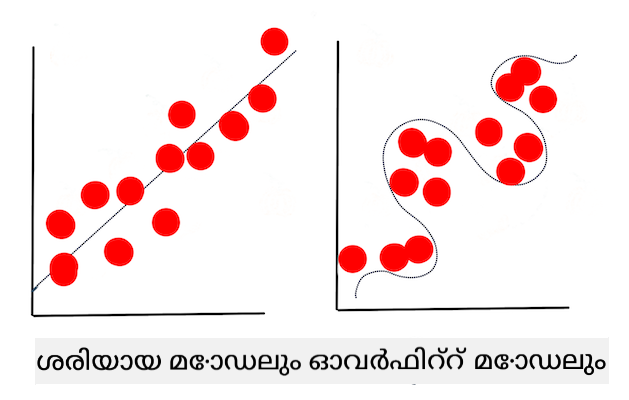

<!--
CO_OP_TRANSLATOR_METADATA:
{
  "original_hash": "9d91f3af3758fdd4569fb410575995ef",
  "translation_date": "2025-12-19T13:36:10+00:00",
  "source_file": "1-Introduction/4-techniques-of-ML/README.md",
  "language_code": "ml"
}
-->
# മെഷീൻ ലേണിങ്ങിന്റെ സാങ്കേതിക വിദ്യകൾ

മെഷീൻ ലേണിംഗ് മോഡലുകൾ നിർമ്മിക്കുന്നതും ഉപയോഗിക്കുന്നതും പരിപാലിക്കുന്നതും, അവ ഉപയോഗിക്കുന്ന ഡാറ്റയും, മറ്റ് പല വികസന പ്രവൃത്തികളിൽ നിന്നുള്ളവയിൽ നിന്ന് വളരെ വ്യത്യസ്തമായ പ്രക്രിയയാണ്. ഈ പാഠത്തിൽ, നാം ഈ പ്രക്രിയയെ വിശദീകരിക്കുകയും നിങ്ങൾ അറിയേണ്ട പ്രധാന സാങ്കേതിക വിദ്യകൾ രേഖപ്പെടുത്തുകയും ചെയ്യും. നിങ്ങൾക്ക്:

- മെഷീൻ ലേണിംഗിന്റെ അടിസ്ഥാന പ്രക്രിയകൾ ഉയർന്ന തലത്തിൽ മനസ്സിലാക്കാം.
- 'മോഡലുകൾ', 'ഭാവനകൾ', 'പരിശീലന ഡാറ്റ' പോലുള്ള അടിസ്ഥാന ആശയങ്ങൾ അന്വേഷിക്കാം.

## [പ്രീ-ലെക്ചർ ക്വിസ്](https://ff-quizzes.netlify.app/en/ml/)

> 🎥 ഈ പാഠം വിശദീകരിക്കുന്ന ഒരു ചെറിയ വീഡിയോ കാണാൻ മുകളിൽ ചിത്രത്തിൽ ക്ലിക്ക് ചെയ്യുക.

## പരിചയം

ഉയർന്ന തലത്തിൽ, മെഷീൻ ലേണിംഗ് (ML) പ്രക്രിയകൾ സൃഷ്ടിക്കുന്ന കലയിൽ പല ഘട്ടങ്ങൾ ഉൾപ്പെടുന്നു:

1. **ചോദ്യമൊരുക്കുക**. മിക്ക ML പ്രക്രിയകളും ഒരു ലളിതമായ നിബന്ധനാപരമായ പ്രോഗ്രാമോ നിയമങ്ങൾ അടിസ്ഥാനമാക്കിയ എഞ്ചിനോ മറുപടി നൽകാൻ കഴിയാത്ത ഒരു ചോദ്യമൊരുക്കുന്നതിൽ ആരംഭിക്കുന്നു. ഈ ചോദ്യങ്ങൾ സാധാരണയായി ഡാറ്റാ ശേഖരണത്തെ അടിസ്ഥാനമാക്കിയുള്ള പ്രവചനങ്ങളുമായി ബന്ധപ്പെട്ടിരിക്കുന്നു.
2. **ഡാറ്റ ശേഖരിക്കുകയും തയ്യാറാക്കുകയും ചെയ്യുക**. നിങ്ങളുടെ ചോദ്യത്തിന് മറുപടി നൽകാൻ, നിങ്ങൾക്ക് ഡാറ്റ ആവശ്യമുണ്ട്. നിങ്ങളുടെ ഡാറ്റയുടെ ഗുണമേന്മയും, ചിലപ്പോൾ, അളവും, നിങ്ങളുടെ പ്രാഥമിക ചോദ്യത്തിന് എത്രത്തോളം നല്ല മറുപടി നൽകാമെന്ന് നിർണ്ണയിക്കും. ഡാറ്റ ദൃശ്യവൽക്കരണം ഈ ഘട്ടത്തിന്റെ ഒരു പ്രധാന ഭാഗമാണ്. ഈ ഘട്ടത്തിൽ ഡാറ്റയെ പരിശീലനവും പരിശോധനയും എന്നിങ്ങനെ വിഭജിച്ച് മോഡൽ നിർമ്മിക്കാനും ഉൾപ്പെടുന്നു.
3. **പരിശീലന രീതി തിരഞ്ഞെടുക്കുക**. നിങ്ങളുടെ ചോദ്യത്തിനും ഡാറ്റയുടെ സ്വഭാവത്തിനും അനുസരിച്ച്, ഡാറ്റയെ മികച്ച രീതിയിൽ പ്രതിഫലിപ്പിക്കുകയും അതിനെതിരെ കൃത്യമായ പ്രവചനങ്ങൾ നടത്തുകയും ചെയ്യാൻ മോഡൽ പരിശീലിപ്പിക്കാൻ നിങ്ങൾ എങ്ങനെ പരിശീലനം നൽകണമെന്ന് തിരഞ്ഞെടുക്കണം. ഇത് നിങ്ങളുടെ ML പ്രക്രിയയിലെ പ്രത്യേക വിദഗ്ധത ആവശ്യമായ ഭാഗമാണ്, കൂടാതെ പലപ്പോഴും വലിയ പരീക്ഷണങ്ങൾ നടത്തേണ്ടതും.
4. **മോഡൽ പരിശീലിപ്പിക്കുക**. നിങ്ങളുടെ പരിശീലന ഡാറ്റ ഉപയോഗിച്ച്, ഡാറ്റയിലെ മാതൃകകൾ തിരിച്ചറിയാൻ വിവിധ ആൽഗോരിതങ്ങൾ ഉപയോഗിച്ച് മോഡൽ പരിശീലിപ്പിക്കും. മോഡൽ ചില ഭാഗങ്ങളിൽ കൂടുതൽ പ്രാധാന്യം നൽകാൻ ക്രമീകരിക്കാവുന്ന ആന്തരിക ഭാരങ്ങൾ ഉപയോഗിക്കാം.
5. **മോഡൽ വിലയിരുത്തുക**. നിങ്ങൾ ശേഖരിച്ച ഡാറ്റയിൽ നിന്ന് മുമ്പ് കാണാത്ത ഡാറ്റ (പരിശോധന ഡാറ്റ) ഉപയോഗിച്ച് മോഡൽ എങ്ങനെ പ്രവർത്തിക്കുന്നു എന്ന് പരിശോധിക്കും.
6. **പരാമീറ്റർ ട്യൂണിംഗ്**. മോഡലിന്റെ പ്രകടനത്തെ അടിസ്ഥാനമാക്കി, മോഡൽ പരിശീലിപ്പിക്കാൻ ഉപയോഗിക്കുന്ന ആൽഗോരിതങ്ങളുടെ പെരുമാറ്റം നിയന്ത്രിക്കുന്ന വ്യത്യസ്ത പരാമീറ്ററുകൾ ഉപയോഗിച്ച് പ്രക്രിയ വീണ്ടും നടത്താം.
7. **പ്രവചനം നടത്തുക**. പുതിയ ഇൻപുട്ടുകൾ ഉപയോഗിച്ച് മോഡലിന്റെ കൃത്യത പരിശോധിക്കുക.

## ഏത് ചോദ്യമാണ് ചോദിക്കേണ്ടത്

കമ്പ്യൂട്ടറുകൾ ഡാറ്റയിൽ മറഞ്ഞിരിക്കുന്ന മാതൃകകൾ കണ്ടെത്തുന്നതിൽ പ്രത്യേകമായി നൈപുണ്യമുള്ളവയാണ്. നിബന്ധനാപരമായ നിയമങ്ങൾ അടിസ്ഥാനമാക്കിയ എഞ്ചിൻ സൃഷ്ടിച്ച് എളുപ്പത്തിൽ മറുപടി നൽകാൻ കഴിയാത്ത ഒരു ഡൊമെയ്ൻ സംബന്ധിച്ച ചോദ്യങ്ങൾ ഗവേഷകർക്ക് ഇത് വളരെ സഹായകരമാണ്. ഉദാഹരണത്തിന്, ഒരു ആക്ച്വറിയൽ ജോലി നൽകിയാൽ, ഒരു ഡാറ്റാ സയന്റിസ്റ്റ് പുകവലി ചെയ്യുന്നവരും പുകവലി ചെയ്യാത്തവരും മരണനിരക്കുകൾക്കായി കൈകൊണ്ട നിയമങ്ങൾ നിർമ്മിക്കാൻ കഴിയും.

എന്നാൽ, പല മറ്റ് വ്യത്യസ്ത ഘടകങ്ങൾ പരിഗണിക്കുമ്പോൾ, ഒരു ML മോഡൽ മുൻകാല ആരോഗ്യ ചരിത്രത്തെ അടിസ്ഥാനമാക്കി ഭാവിയിലെ മരണനിരക്കുകൾ പ്രവചിക്കാൻ കൂടുതൽ കാര്യക്ഷമമാകാം. ഒരു സന്തോഷകരമായ ഉദാഹരണം, ഒരു നിശ്ചിത സ്ഥലത്ത് ഏപ്രിൽ മാസത്തെ കാലാവസ്ഥ പ്രവചനങ്ങൾ latitude, longitude, കാലാവസ്ഥ മാറ്റം, സമുദ്രത്തിന് സമീപം, ജെറ്റ് സ്ട്രീം മാതൃകകൾ എന്നിവ ഉൾപ്പെടുന്ന ഡാറ്റയുടെ അടിസ്ഥാനത്തിൽ നിർമിക്കുന്നത് ആകാം.

✅ കാലാവസ്ഥ മോഡലുകളെക്കുറിച്ചുള്ള ഈ [സ്ലൈഡ് ഡെക്ക്](https://www2.cisl.ucar.edu/sites/default/files/2021-10/0900%20June%2024%20Haupt_0.pdf) കാലാവസ്ഥ വിശകലനത്തിൽ ML ഉപയോഗിക്കുന്നതിനുള്ള ചരിത്രപരമായ കാഴ്ചപ്പാട് നൽകുന്നു.  

## നിർമ്മാണത്തിന് മുമ്പുള്ള പ്രവർത്തനങ്ങൾ

നിങ്ങളുടെ മോഡൽ നിർമ്മിക്കാൻ തുടങ്ങുന്നതിന് മുമ്പ്, നിങ്ങൾ പൂർത്തിയാക്കേണ്ട നിരവധി പ്രവർത്തനങ്ങൾ ഉണ്ട്. നിങ്ങളുടെ ചോദ്യത്തെ പരീക്ഷിക്കുകയും മോഡലിന്റെ പ്രവചനങ്ങളെ അടിസ്ഥാനമാക്കി ഒരു ഹിപോത്തസിസ് രൂപപ്പെടുത്തുകയും ചെയ്യാൻ, നിങ്ങൾക്ക് പല ഘടകങ്ങളും തിരിച്ചറിയുകയും ക്രമീകരിക്കുകയും വേണം.

### ഡാറ്റ

നിങ്ങളുടെ ചോദ്യത്തിന് ഏതെങ്കിലും ഉറപ്പോടെ മറുപടി നൽകാൻ, ശരിയായ തരം ഡാറ്റയുടെ നല്ല അളവ് ആവശ്യമാണ്. ഈ ഘട്ടത്തിൽ നിങ്ങൾ ചെയ്യേണ്ട രണ്ട് കാര്യങ്ങളുണ്ട്:

- **ഡാറ്റ ശേഖരിക്കുക**. മുമ്പത്തെ പാഠത്തിൽ ഡാറ്റ വിശകലനത്തിൽ നീതിയുള്ളതിനെക്കുറിച്ച് പഠിച്ചതു ഓർക്കുക, ശ്രദ്ധയോടെ ഡാറ്റ ശേഖരിക്കുക. ഈ ഡാറ്റയുടെ ഉറവിടങ്ങളെക്കുറിച്ച്, അതിൽ ഉള്ള സ്വാഭാവിക പാകങ്ങൾക്കുറിച്ച് ജാഗ്രത പുലർത്തുക, അതിന്റെ ഉറവിടം രേഖപ്പെടുത്തുക.
- **ഡാറ്റ തയ്യാറാക്കുക**. ഡാറ്റ തയ്യാറാക്കൽ പ്രക്രിയയിൽ പല ഘട്ടങ്ങളുണ്ട്. വ്യത്യസ്ത ഉറവിടങ്ങളിൽ നിന്നുള്ള ഡാറ്റ സംയോജിപ്പിക്കുകയും സാധാരണവത്കരിക്കുകയും ചെയ്യേണ്ടതുണ്ടാകാം. ഡാറ്റയുടെ ഗുണമേന്മയും അളവും മെച്ചപ്പെടുത്താൻ സ്ട്രിംഗുകൾ നമ്പറുകളായി മാറ്റൽ പോലുള്ള വിവിധ രീതികൾ ഉപയോഗിക്കാം ([Clustering](../../5-Clustering/1-Visualize/README.md) പാഠത്തിൽ ചെയ്തതുപോലെ). നിങ്ങൾക്ക് പുതിയ ഡാറ്റ സൃഷ്ടിക്കേണ്ടതും ഉണ്ടാകാം, മൗലിക ഡാറ്റയെ അടിസ്ഥാനമാക്കി ([Classification](../../4-Classification/1-Introduction/README.md) പാഠത്തിൽ ചെയ്തതുപോലെ). ഡാറ്റ ശുദ്ധീകരിക്കുകയും തിരുത്തുകയും ചെയ്യാം ([Web App](../../3-Web-App/README.md) പാഠത്തിന് മുമ്പ് ചെയ്യുന്നതുപോലെ). അവസാനം, നിങ്ങളുടെ പരിശീലന സാങ്കേതിക വിദ്യകൾ അനുസരിച്ച് ഡാറ്റയെ യാദൃച്ഛികമാക്കുകയും ഷഫിൾ ചെയ്യുകയും ചെയ്യേണ്ടതുണ്ടാകാം.

✅ ഡാറ്റ ശേഖരിക്കുകയും പ്രോസസ്സ് ചെയ്യുകയും ചെയ്ത ശേഷം, അതിന്റെ രൂപം നിങ്ങളുടെ ഉദ്ദേശിച്ച ചോദ്യത്തിന് മറുപടി നൽകാൻ അനുയോജ്യമാണോ എന്ന് പരിശോധിക്കാൻ ഒരു നിമിഷം എടുത്തു നോക്കുക. നിങ്ങളുടെ നൽകിയ ജോലിയിൽ ഡാറ്റ നല്ല പ്രകടനം കാണിക്കില്ലായിരുന്നോ എന്ന് ഞങ്ങൾ [Clustering](../../5-Clustering/1-Visualize/README.md) പാഠങ്ങളിൽ കണ്ടെത്തുന്നു!

### ഫീച്ചറുകളും ലക്ഷ്യവും

ഒരു [ഫീച്ചർ](https://www.datasciencecentral.com/profiles/blogs/an-introduction-to-variable-and-feature-selection) നിങ്ങളുടെ ഡാറ്റയുടെ അളക്കാവുന്ന സ്വഭാവമാണ്. പല ഡാറ്റാസെറ്റുകളിലും ഇത് 'തീയതി', 'വലിപ്പം', 'നിറം' പോലുള്ള കോളം തലക്കെട്ടായി പ്രകടിപ്പിക്കപ്പെടുന്നു. നിങ്ങളുടെ ഫീച്ചർ വേരിയബിൾ, സാധാരണയായി കോഡിൽ `X` ആയി പ്രതിനിധീകരിക്കപ്പെടുന്നു, മോഡൽ പരിശീലിപ്പിക്കാൻ ഉപയോഗിക്കുന്ന ഇൻപുട്ട് വേരിയബിൾ ആണ്.

ലക്ഷ്യം നിങ്ങൾ പ്രവചിക്കാൻ ശ്രമിക്കുന്ന വസ്തുവാണ്. ലക്ഷ്യം സാധാരണയായി കോഡിൽ `y` ആയി പ്രതിനിധീകരിക്കപ്പെടുന്നു, ഇത് നിങ്ങളുടെ ഡാറ്റയിൽ നിന്നുള്ള ചോദ്യത്തിന് നിങ്ങൾ ചോദിക്കുന്ന മറുപടിയാണ്: ഡിസംബർ മാസത്തിൽ, ഏത് **നിറത്തിലുള്ള** പംപ്കിനുകൾ ഏറ്റവും വിലകുറഞ്ഞവ ആയിരിക്കും? സാൻ ഫ്രാൻസിസ്കോയിൽ, ഏത് പ്രദേശങ്ങളിൽ മികച്ച റിയൽ എസ്റ്റേറ്റ് **വില** ഉണ്ടാകും? ചിലപ്പോൾ ലക്ഷ്യം ലേബൽ ആട്രിബ്യൂട്ട് എന്നും വിളിക്കുന്നു.

### നിങ്ങളുടെ ഫീച്ചർ വേരിയബിൾ തിരഞ്ഞെടുക്കൽ

🎓 **ഫീച്ചർ സെലക്ഷനും ഫീച്ചർ എക്സ്ട്രാക്ഷനും** മോഡൽ നിർമ്മിക്കുമ്പോൾ ഏത് വേരിയബിൾ തിരഞ്ഞെടുക്കണമെന്ന് നിങ്ങൾ എങ്ങനെ അറിയും? ഏറ്റവും മികച്ച പ്രകടനം നൽകുന്ന മോഡലിനായി ശരിയായ വേരിയബിളുകൾ തിരഞ്ഞെടുക്കാൻ നിങ്ങൾ ഫീച്ചർ സെലക്ഷൻ അല്ലെങ്കിൽ ഫീച്ചർ എക്സ്ട്രാക്ഷൻ പ്രക്രിയയിലൂടെ പോകും. ഇവ ഒരേ കാര്യമല്ല: "ഫീച്ചർ എക്സ്ട്രാക്ഷൻ മൗലിക ഫീച്ചറുകളുടെ ഫംഗ്ഷനുകളിൽ നിന്നുള്ള പുതിയ ഫീച്ചറുകൾ സൃഷ്ടിക്കുന്നു, എന്നാൽ ഫീച്ചർ സെലക്ഷൻ ഫീച്ചറുകളുടെ ഒരു ഉപസമൂഹം തിരികെ നൽകുന്നു." ([സ്രോതസ്സ്](https://wikipedia.org/wiki/Feature_selection))

### നിങ്ങളുടെ ഡാറ്റ ദൃശ്യവൽക്കരിക്കുക

ഡാറ്റാ സയന്റിസ്റ്റിന്റെ ഉപകരണസഞ്ചിയിൽ ഒരു പ്രധാന ഘടകം സീബോൺ അല്ലെങ്കിൽ മാട്പ്ലോട്ട്‌ലിബ് പോലുള്ള മികച്ച ലൈബ്രറികൾ ഉപയോഗിച്ച് ഡാറ്റ ദൃശ്യവൽക്കരിക്കുന്ന ശേഷിയാണ്. നിങ്ങളുടെ ഡാറ്റ ദൃശ്യമായി പ്രതിനിധീകരിക്കുന്നത് മറഞ്ഞിരിക്കുന്ന ബന്ധങ്ങൾ കണ്ടെത്താൻ സഹായിക്കാം. നിങ്ങളുടെ ദൃശ്യവൽക്കരണങ്ങൾ പാകം അല്ലാത്തതോ അസമതുലിതമായ ഡാറ്റയോ കണ്ടെത്താൻ സഹായിക്കാം ([Classification](../../4-Classification/2-Classifiers-1/README.md) പാഠത്തിൽ കണ്ടെത്തുന്നതുപോലെ).

### നിങ്ങളുടെ ഡാറ്റാസെറ്റ് വിഭജിക്കുക

പരിശീലനത്തിന് മുമ്പ്, നിങ്ങളുടെ ഡാറ്റാസെറ്റ് രണ്ട് അല്ലെങ്കിൽ അതിലധികം അസമാനമായ വലുപ്പമുള്ള ഭാഗങ്ങളായി വിഭജിക്കണം, എന്നാൽ ഡാറ്റയെ നന്നായി പ്രതിനിധീകരിക്കണം.

- **പരിശീലനം**. ഡാറ്റാസെറ്റിന്റെ ഈ ഭാഗം മോഡലിന് അനുയോജ്യമായ രീതിയിൽ പരിശീലിപ്പിക്കാൻ ഉപയോഗിക്കുന്നു. ഇത് മൗലിക ഡാറ്റാസെറ്റിന്റെ ഭൂരിഭാഗമാണ്.
- **പരിശോധന**. ഒരു ടെസ്റ്റ് ഡാറ്റാസെറ്റ് സ്വതന്ത്രമായ ഡാറ്റാ ഗ്രൂപ്പാണ്, സാധാരണയായി മൗലിക ഡാറ്റയിൽ നിന്നാണ് ശേഖരിക്കുന്നത്, ഇത് നിർമ്മിച്ച മോഡലിന്റെ പ്രകടനം സ്ഥിരീകരിക്കാൻ ഉപയോഗിക്കുന്നു.
- **സാധൂകരിക്കൽ**. സാധൂകരിക്കൽ സെറ്റ് ഒരു ചെറിയ സ്വതന്ത്ര ഉദാഹരണ ഗ്രൂപ്പാണ്, ഇത് മോഡലിന്റെ ഹൈപ്പർപാരാമീറ്ററുകൾ അല്ലെങ്കിൽ ഘടന മെച്ചപ്പെടുത്താൻ ഉപയോഗിക്കുന്നു. നിങ്ങളുടെ ഡാറ്റയുടെ വലുപ്പത്തിനും ചോദിക്കുന്ന ചോദ്യത്തിനും അനുസരിച്ച്, ഈ മൂന്നാം സെറ്റ് നിർമ്മിക്കേണ്ടതില്ലായിരിക്കാം ([Time Series Forecasting](../../7-TimeSeries/1-Introduction/README.md) പാഠത്തിൽ ഞങ്ങൾ കാണിക്കുന്നു).

## മോഡൽ നിർമ്മിക്കൽ

നിങ്ങളുടെ പരിശീലന ഡാറ്റ ഉപയോഗിച്ച്, നിങ്ങളുടെ ലക്ഷ്യം മോഡൽ നിർമ്മിക്കുകയോ, അല്ലെങ്കിൽ നിങ്ങളുടെ ഡാറ്റയുടെ സാംഖ്യിക പ്രതിനിധാനം സൃഷ്ടിക്കുകയോ ചെയ്യുകയാണ്, വിവിധ ആൽഗോരിതങ്ങൾ ഉപയോഗിച്ച് അതിനെ **പരിശീലിപ്പിക്കുക**. മോഡൽ പരിശീലിപ്പിക്കുന്നത് ഡാറ്റയ്ക്ക് പരിചയപ്പെടാൻ അനുവദിക്കുകയും കണ്ടെത്തിയ മാതൃകകളെക്കുറിച്ച് അനുമാനങ്ങൾ നടത്തുകയും, അവ സ്ഥിരീകരിക്കുകയും, അംഗീകരിക്കുകയും അല്ലെങ്കിൽ നിരസിക്കുകയും ചെയ്യാൻ സഹായിക്കുന്നു.

### പരിശീലന രീതി തീരുമാനിക്കുക

നിങ്ങളുടെ ചോദ്യത്തിനും ഡാറ്റയുടെ സ്വഭാവത്തിനും അനുസരിച്ച്, നിങ്ങൾ അത് പരിശീലിപ്പിക്കാൻ ഒരു രീതി തിരഞ്ഞെടുക്കും. ഈ കോഴ്സിൽ ഉപയോഗിക്കുന്ന [Scikit-learn ന്റെ ഡോക്യുമെന്റേഷൻ](https://scikit-learn.org/stable/user_guide.html) വഴി നിങ്ങൾ മോഡൽ പരിശീലിപ്പിക്കാൻ നിരവധി മാർഗങ്ങൾ അന്വേഷിക്കാം. നിങ്ങളുടെ അനുഭവം അനുസരിച്ച്, മികച്ച മോഡൽ നിർമ്മിക്കാൻ നിങ്ങൾക്ക് പല വ്യത്യസ്ത രീതി പരീക്ഷിക്കേണ്ടിവരും. ഡാറ്റാ സയന്റിസ്റ്റുകൾ ഒരു മോഡലിന്റെ പ്രകടനം വിലയിരുത്താൻ മുമ്പ് കാണാത്ത ഡാറ്റ നൽകുകയും കൃത്യത, പാകം, മറ്റ് ഗുണനിലവാര കുറയ്ക്കുന്ന പ്രശ്നങ്ങൾ പരിശോധിക്കുകയും, ജോലിക്ക് ഏറ്റവും അനുയോജ്യമായ പരിശീലന രീതി തിരഞ്ഞെടുക്കുകയും ചെയ്യുന്ന പ്രക്രിയയിലൂടെ നിങ്ങൾ കടന്നുപോകും.

### മോഡൽ പരിശീലിപ്പിക്കുക

നിങ്ങളുടെ പരിശീലന ഡാറ്റ ഉപയോഗിച്ച്, മോഡൽ സൃഷ്ടിക്കാൻ 'ഫിറ്റ്' ചെയ്യാൻ തയ്യാറാകുക. പല ML ലൈബ്രറികളിലും 'model.fit' എന്ന കോഡ് കാണും - ഈ സമയത്ത് നിങ്ങൾ നിങ്ങളുടെ ഫീച്ചർ വേരിയബിൾ മൂല്യങ്ങളുടെ ഒരു അറേ (സാധാരണയായി 'X')യും ലക്ഷ്യ വേരിയബിൾ (സാധാരണയായി 'y')യും അയയ്ക്കും.

### മോഡൽ വിലയിരുത്തുക

പരിശീലന പ്രക്രിയ പൂർത്തിയായ ശേഷം (വലിയ മോഡൽ പരിശീലിപ്പിക്കാൻ പല ആവർത്തനങ്ങൾ അല്ലെങ്കിൽ 'എപ്പോക്കുകൾ' ആവാം), ടെസ്റ്റ് ഡാറ്റ ഉപയോഗിച്ച് മോഡലിന്റെ ഗുണമേന്മ വിലയിരുത്താൻ കഴിയും. ഈ ഡാറ്റ മോഡൽ മുമ്പ് വിശകലനം ചെയ്തിട്ടില്ലാത്ത മൗലിക ഡാറ്റയുടെ ഒരു ഉപസമൂഹമാണ്. മോഡലിന്റെ ഗുണമേന്മയെക്കുറിച്ചുള്ള മെട്രിക്‌സ് പട്ടിക പ്രിന്റ് ചെയ്യാം.

🎓 **മോഡൽ ഫിറ്റിംഗ്**

മെഷീൻ ലേണിംഗിന്റെ സാന്ദർഭ്യത്തിൽ, മോഡൽ ഫിറ്റിംഗ് എന്നത് മോഡലിന്റെ അടിസ്ഥാന ഫംഗ്ഷന്റെ കൃത്യതയെ സൂചിപ്പിക്കുന്നു, അത് പരിചയമില്ലാത്ത ഡാറ്റ വിശകലനം ചെയ്യാൻ ശ്രമിക്കുമ്പോൾ.

🎓 **അണ്ടർഫിറ്റിംഗ്** (കുറഞ്ഞ ഫിറ്റ്)യും **ഓവർഫിറ്റിംഗ്** (അധിക ഫിറ്റ്)യും മോഡലിന്റെ ഗുണമേന്മ കുറയ്ക്കുന്ന സാധാരണ പ്രശ്നങ്ങളാണ്, മോഡൽ ശരിയായി ഫിറ്റ് ചെയ്യാത്തതോ വളരെ അധികം ഫിറ്റ് ചെയ്തതോ ആയിരിക്കുമ്പോൾ. ഇത് മോഡൽ പരിശീലന ഡാറ്റയുമായി വളരെ അടുത്തോ വളരെ ദൂരമായോ പ്രവചനങ്ങൾ നടത്താൻ കാരണമാകും. ഒരു ഓവർഫിറ്റ് മോഡൽ പരിശീലന ഡാറ്റ വളരെ നന്നായി പ്രവചിക്കുന്നു, കാരണം അത് ഡാറ്റയുടെ വിശദാംശങ്ങളും ശബ്ദവും വളരെ നന്നായി പഠിച്ചിട്ടുണ്ട്. ഒരു അണ്ടർഫിറ്റ് മോഡൽ കൃത്യമായില്ല, കാരണം അത് പരിശീലന ഡാറ്റയും മുമ്പ് 'കണ്ടിട്ടില്ലാത്ത' ഡാറ്റയും കൃത്യമായി വിശകലനം ചെയ്യാൻ കഴിയുന്നില്ല.

> ഇൻഫോഗ്രാഫിക് [ജെൻ ലൂപ്പർ](https://twitter.com/jenlooper) tarafından

## പരാമീറ്റർ ട്യൂണിംഗ്

നിങ്ങളുടെ പ്രാഥമിക പരിശീലനം പൂർത്തിയായ ശേഷം, മോഡലിന്റെ ഗുണമേന്മ നിരീക്ഷിച്ച് അതിന്റെ 'ഹൈപ്പർപാരാമീറ്ററുകൾ' ക്രമീകരിച്ച് മെച്ചപ്പെടുത്താൻ പരിഗണിക്കുക. പ്രക്രിയയെക്കുറിച്ച് കൂടുതൽ വായിക്കുക [ഡോക്യുമെന്റേഷനിൽ](https://docs.microsoft.com/en-us/azure/machine-learning/how-to-tune-hyperparameters?WT.mc_id=academic-77952-leestott).

## പ്രവചനം

ഇത് നിങ്ങൾക്ക് പൂർണ്ണമായും പുതിയ ഡാറ്റ ഉപയോഗിച്ച് മോഡലിന്റെ കൃത്യത പരിശോധിക്കാനുള്ള നിമിഷമാണ്. 'പ്രയോഗത്തിൽ' ഉള്ള ML സജ്ജീകരണത്തിൽ, നിങ്ങൾ മോഡൽ പ്രൊഡക്ഷനിൽ ഉപയോഗിക്കാൻ വെബ് ആസറ്റുകൾ നിർമ്മിക്കുമ്പോൾ, ഈ പ്രക്രിയയിൽ ഉപയോക്തൃ ഇൻപുട്ട് (ഉദാഹരണത്തിന് ബട്ടൺ അമർത്തൽ) ശേഖരിച്ച് ഒരു വേരിയബിൾ സജ്ജമാക്കി മോഡലിലേക്ക് ഇൻഫറൻസ് അല്ലെങ്കിൽ വിലയിരുത്തലിനായി അയയ്ക്കുന്നതും ഉൾപ്പെടാം.

ഈ പാഠങ്ങളിൽ, നിങ്ങൾ ഈ ഘട്ടങ്ങൾ ഉപയോഗിച്ച് ഡാറ്റാ സയന്റിസ്റ്റിന്റെ എല്ലാ പ്രവർത്തനങ്ങളും, കൂടാതെ കൂടുതൽ, തയ്യാറാക്കാനും, നിർമ്മിക്കാനും, പരീക്ഷിക്കാനും, വിലയിരുത്താനും, പ്രവചിക്കാനും പഠിക്കും, 'ഫുൾ സ്റ്റാക്ക്' ML എഞ്ചിനീയറായി നിങ്ങളുടെ യാത്രയിൽ മുന്നേറുമ്പോൾ.

---

## 🚀ചലഞ്ച്

ഒരു ML പ്രാക്ടീഷണറുടെ ഘട്ടങ്ങൾ പ്രതിഫലിപ്പിക്കുന്ന ഒരു ഫ്ലോ ചാർട്ട് വരയ്ക്കുക. നിങ്ങൾ ഇപ്പോൾ പ്രക്രിയയിൽ എവിടെയാണ്? നിങ്ങൾക്ക് എവിടെ ബുദ്ധിമുട്ട് ഉണ്ടാകുമെന്ന് പ്രവചിക്കുന്നു? നിങ്ങൾക്ക് എവിടെ എളുപ്പമാണ്?

## [പോസ്റ്റ്-ലെക്ചർ ക്വിസ്](https://ff-quizzes.netlify.app/en/ml/)

## അവലോകനം & സ്വയം പഠനം

ഡാറ്റാ സയന്റിസ്റ്റുകൾ അവരുടെ ദൈനംദിന ജോലി ചർച്ച ചെയ്യുന്ന അഭിമുഖങ്ങൾ ഓൺലൈനിൽ തിരയുക. ഇതാ [ഒരു ഉദാഹരണം](https://www.youtube.com/watch?v=Z3IjgbbCEfs).

## അസൈൻമെന്റ്

[ഒരു ഡാറ്റാ സയന്റിസ്റ്റിനെ അഭിമുഖം ചെയ്യുക](assignment.md)

---

<!-- CO-OP TRANSLATOR DISCLAIMER START -->
**അസൂയാ**:  
ഈ രേഖ AI വിവർത്തന സേവനം [Co-op Translator](https://github.com/Azure/co-op-translator) ഉപയോഗിച്ച് വിവർത്തനം ചെയ്തതാണ്. നാം കൃത്യതയ്ക്ക് ശ്രമിച്ചെങ്കിലും, സ്വയം പ്രവർത്തിക്കുന്ന വിവർത്തനങ്ങളിൽ പിശകുകൾ അല്ലെങ്കിൽ തെറ്റുകൾ ഉണ്ടാകാമെന്ന് ദയവായി ശ്രദ്ധിക്കുക. അതിന്റെ മാതൃഭാഷയിലുള്ള യഥാർത്ഥ രേഖയാണ് പ്രാമാണികമായ ഉറവിടം എന്ന് പരിഗണിക്കേണ്ടതാണ്. നിർണായക വിവരങ്ങൾക്ക്, പ്രൊഫഷണൽ മനുഷ്യ വിവർത്തനം ശുപാർശ ചെയ്യപ്പെടുന്നു. ഈ വിവർത്തനത്തിന്റെ ഉപയോഗത്തിൽ നിന്നുണ്ടാകുന്ന ഏതെങ്കിലും തെറ്റിദ്ധാരണകൾക്കോ തെറ്റായ വ്യാഖ്യാനങ്ങൾക്കോ ഞങ്ങൾ ഉത്തരവാദികളല്ല.
<!-- CO-OP TRANSLATOR DISCLAIMER END -->