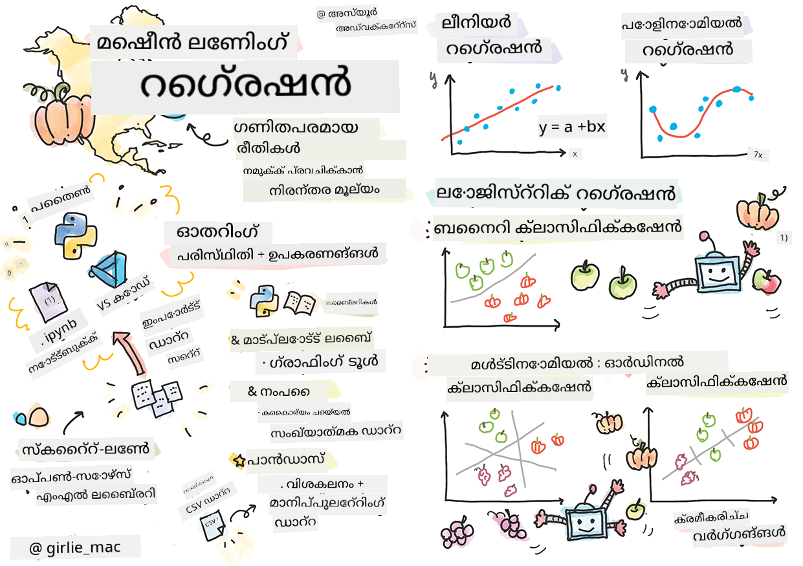

<!--
CO_OP_TRANSLATOR_METADATA:
{
  "original_hash": "fa81d226c71d5af7a2cade31c1c92b88",
  "translation_date": "2025-12-19T13:55:07+00:00",
  "source_file": "2-Regression/1-Tools/README.md",
  "language_code": "ml"
}
-->
# Python ഉം Scikit-learn ഉം ഉപയോഗിച്ച് regression മോഡലുകൾ ആരംഭിക്കുക



> Sketchnote by [Tomomi Imura](https://www.twitter.com/girlie_mac)

## [Pre-lecture quiz](https://ff-quizzes.netlify.app/en/ml/)

> ### [ഈ പാഠം R-ൽ ലഭ്യമാണ്!](../../../../2-Regression/1-Tools/solution/R/lesson_1.html)

## പരിചയം

ഈ നാല് പാഠങ്ങളിൽ, നിങ്ങൾ regression മോഡലുകൾ എങ്ങനെ നിർമ്മിക്കാമെന്ന് കണ്ടെത്തും. ഇവ എന്തിനാണെന്ന് നമുക്ക് ഉടൻ ചർച്ച ചെയ്യാം. എന്നാൽ എന്തെങ്കിലും ചെയ്യുന്നതിന് മുമ്പ്, പ്രക്രിയ ആരംഭിക്കാൻ ആവശ്യമായ ശരിയായ ഉപകരണങ്ങൾ നിങ്ങൾക്കുണ്ടെന്ന് ഉറപ്പാക്കുക!

ഈ പാഠത്തിൽ, നിങ്ങൾ പഠിക്കാനിരിക്കുന്നതെന്തെന്നാൽ:

- ലൊക്കൽ മെഷീൻ ലേണിംഗ് ടാസ്കുകൾക്കായി നിങ്ങളുടെ കമ്പ്യൂട്ടർ ക്രമീകരിക്കുക.
- Jupyter നോട്ട്‌ബുക്കുകളുമായി പ്രവർത്തിക്കുക.
- Scikit-learn ഉപയോഗിക്കുക, ഇൻസ്റ്റാളേഷൻ ഉൾപ്പെടെ.
- ലീനിയർ regression ഒരു ഹാൻഡ്‌സ്-ഓൺ വ്യായാമത്തോടെ പരിശോധിക്കുക.

## ഇൻസ്റ്റാളേഷനുകളും ക്രമീകരണങ്ങളും

[](https://youtu.be/-DfeD2k2Kj0 "ML for beginners -Setup your tools ready to build Machine Learning models")

> 🎥 ML ക്രമീകരണത്തിനായി നിങ്ങളുടെ കമ്പ്യൂട്ടർ ക്രമീകരിക്കുന്നതിനുള്ള ഒരു ചെറിയ വീഡിയോക്കായി മുകളിൽ ചിത്രത്തിൽ ക്ലിക്ക് ചെയ്യുക.

1. **Python ഇൻസ്റ്റാൾ ചെയ്യുക**. നിങ്ങളുടെ കമ്പ്യൂട്ടറിൽ [Python](https://www.python.org/downloads/) ഇൻസ്റ്റാൾ ചെയ്തിട്ടുണ്ടെന്ന് ഉറപ്പാക്കുക. ഡാറ്റാ സയൻസ്, മെഷീൻ ലേണിംഗ് ടാസ്കുകൾക്കായി Python ഉപയോഗിക്കും. പല കമ്പ്യൂട്ടർ സിസ്റ്റങ്ങളിലുമുണ്ട് Python ഇൻസ്റ്റാളേഷൻ. ചില ഉപയോക്താക്കൾക്ക് ക്രമീകരണം എളുപ്പമാക്കാൻ ഉപയോഗപ്രദമായ [Python Coding Packs](https://code.visualstudio.com/learn/educators/installers?WT.mc_id=academic-77952-leestott) ലഭ്യമാണ്.

   Python-ന്റെ ചില ഉപയോഗങ്ങൾ ഒരു സോഫ്റ്റ്‌വെയറിന്റെ ഒരു വേർഷൻ ആവശ്യപ്പെടുമ്പോൾ, മറ്റുള്ളവയ്ക്ക് വ്യത്യസ്ത വേർഷൻ ആവശ്യമായേക്കാം. അതിനാൽ, [virtual environment](https://docs.python.org/3/library/venv.html) ഉപയോഗിച്ച് പ്രവർത്തിക്കുന്നത് ഉപകാരപ്രദമാണ്.

2. **Visual Studio Code ഇൻസ്റ്റാൾ ചെയ്യുക**. നിങ്ങളുടെ കമ്പ്യൂട്ടറിൽ Visual Studio Code ഇൻസ്റ്റാൾ ചെയ്തിട്ടുണ്ടെന്ന് ഉറപ്പാക്കുക. അടിസ്ഥാന ഇൻസ്റ്റാളേഷനായി [Visual Studio Code ഇൻസ്റ്റാൾ ചെയ്യാനുള്ള നിർദ്ദേശങ്ങൾ](https://code.visualstudio.com/) പിന്തുടരുക. ഈ കോഴ്സിൽ Python Visual Studio Code-ൽ ഉപയോഗിക്കും, അതിനാൽ Python ഡെവലപ്പ്മെന്റിനായി [Visual Studio Code ക്രമീകരിക്കുന്നതെങ്ങനെ](https://docs.microsoft.com/learn/modules/python-install-vscode?WT.mc_id=academic-77952-leestott) എന്നത് അറിയാൻ നിങ്ങൾ ആഗ്രഹിക്കാം.

   > Python-നൊപ്പം പരിചയപ്പെടാൻ ഈ [Learn modules](https://docs.microsoft.com/users/jenlooper-2911/collections/mp1pagggd5qrq7?WT.mc_id=academic-77952-leestott) ശേഖരം വഴി പ്രവർത്തിക്കുക
   >
   > [](https://youtu.be/yyQM70vi7V8 "Setup Python with Visual Studio Code")
   >
   > 🎥 VS Code-ൽ Python ഉപയോഗിക്കുന്നതിനുള്ള വീഡിയോക്കായി മുകളിൽ ചിത്രത്തിൽ ക്ലിക്ക് ചെയ്യുക.

3. **Scikit-learn ഇൻസ്റ്റാൾ ചെയ്യുക**, [ഈ നിർദ്ദേശങ്ങൾ](https://scikit-learn.org/stable/install.html) പിന്തുടർന്ന്. Python 3 ഉപയോഗിക്കുന്നതെന്ന് ഉറപ്പാക്കേണ്ടതിനാൽ, virtual environment ഉപയോഗിക്കുന്നത് ശുപാർശ ചെയ്യുന്നു. M1 Mac-ൽ ഈ ലൈബ്രറി ഇൻസ്റ്റാൾ ചെയ്യുമ്പോൾ പ്രത്യേക നിർദ്ദേശങ്ങൾ ഉണ്ട്, മുകളിൽ നൽകിയ ലിങ്കിൽ കാണാം.

1. **Jupyter Notebook ഇൻസ്റ്റാൾ ചെയ്യുക**. [Jupyter പാക്കേജ് ഇൻസ്റ്റാൾ ചെയ്യേണ്ടതുണ്ട്](https://pypi.org/project/jupyter/).

## നിങ്ങളുടെ ML എഴുത്ത് പരിസ്ഥിതി

Python കോഡ് വികസിപ്പിക്കുകയും മെഷീൻ ലേണിംഗ് മോഡലുകൾ സൃഷ്ടിക്കുകയും ചെയ്യാൻ നിങ്ങൾ **നോട്ട്‌ബുക്കുകൾ** ഉപയോഗിക്കും. ഈ തരത്തിലുള്ള ഫയൽ ഡാറ്റാ സയന്റിസ്റ്റുകൾക്കുള്ള സാധാരണ ഉപകരണമാണ്, അവയുടെ സഫിക്സ് അല്ലെങ്കിൽ എക്സ്റ്റൻഷൻ `.ipynb` ആണ്.

നോട്ട്‌ബുക്കുകൾ ഒരു ഇന്ററാക്ടീവ് പരിസ്ഥിതിയാണ്, ഡെവലപ്പർക്ക് കോഡ് ചെയ്യാനും കുറിപ്പുകൾ ചേർക്കാനും, കോഡിന്റെ ചുറ്റുപാടിൽ ഡോക്യുമെന്റേഷൻ എഴുതാനും അനുവദിക്കുന്നു, ഇത് പരീക്ഷണാത്മക അല്ലെങ്കിൽ ഗവേഷണ-കേന്ദ്രിത പദ്ധതികൾക്ക് വളരെ സഹായകരമാണ്.

[](https://youtu.be/7E-jC8FLA2E "ML for beginners - Set up Jupyter Notebooks to start building regression models")

> 🎥 ഈ വ്യായാമം ചെയ്യുന്നതിനുള്ള ചെറിയ വീഡിയോക്കായി മുകളിൽ ചിത്രത്തിൽ ക്ലിക്ക് ചെയ്യുക.

### വ്യായാമം - ഒരു നോട്ട്‌ബുക്കുമായി പ്രവർത്തിക്കുക

ഈ ഫോൾഡറിൽ, നിങ്ങൾക്ക് _notebook.ipynb_ ഫയൽ കാണാം.

1. Visual Studio Code-ൽ _notebook.ipynb_ തുറക്കുക.

   Python 3+ ഉപയോഗിച്ച് Jupyter സെർവർ ആരംഭിക്കും. നോട്ട്‌ബുക്കിന്റെ ഭാഗങ്ങൾ `run` ചെയ്യാവുന്നതാണ്, കോഡ് ഭാഗങ്ങൾ. പ്ലേ ബട്ടൺ പോലുള്ള ഐക്കൺ തിരഞ്ഞെടുക്കുന്നതിലൂടെ കോഡ് ബ്ലോക്ക് റൺ ചെയ്യാം.

1. `md` ഐക്കൺ തിരഞ്ഞെടുക്കുക, കുറച്ച് markdown ചേർക്കുക, താഴെ കാണുന്ന വാചകം **# Welcome to your notebook** ചേർക്കുക.

   തുടർന്ന്, Python കോഡ് ചേർക്കുക.

1. കോഡ് ബ്ലോക്കിൽ **print('hello notebook')** ടൈപ്പ് ചെയ്യുക.
1. കോഡ് റൺ ചെയ്യാൻ അമ്പ് ഐക്കൺ തിരഞ്ഞെടുക്കുക.

   നിങ്ങൾക്ക് പ്രിന്റ് ചെയ്ത പ്രസ്താവന കാണാം:

    ```output
    hello notebook
    ```


നിങ്ങളുടെ കോഡിനൊപ്പം കുറിപ്പുകൾ ചേർത്ത് നോട്ട്‌ബുക്ക് സ്വയം ഡോക്യുമെന്റ് ചെയ്യാം.

✅ വെബ് ഡെവലപ്പറുടെ പ്രവർത്തന പരിസ്ഥിതിയും ഡാറ്റാ സയന്റിസ്റ്റിന്റെ പ്രവർത്തന പരിസ്ഥിതിയും എത്ര വ്യത്യസ്തമാണെന്ന് ഒരു നിമിഷം ചിന്തിക്കുക.

## Scikit-learn ഉപയോഗിച്ച് പ്രവർത്തനം ആരംഭിക്കുക

ഇപ്പോൾ Python നിങ്ങളുടെ ലൊക്കൽ പരിസ്ഥിതിയിൽ ക്രമീകരിച്ചിരിക്കുന്നു, Jupyter നോട്ട്‌ബുക്കുകളുമായി നിങ്ങൾ പരിചിതരാണ്, Scikit-learn-നോടും സമാനമായി പരിചിതരാകാം (`sci` എന്ന് ഉച്ചരിക്കാം, `science` പോലെ). Scikit-learn ML ടാസ്കുകൾ ചെയ്യാൻ സഹായിക്കുന്ന [വ്യാപകമായ API](https://scikit-learn.org/stable/modules/classes.html#api-ref) നൽകുന്നു.

അവരുടെ [വെബ്സൈറ്റ്](https://scikit-learn.org/stable/getting_started.html) പ്രകാരം, "Scikit-learn ഒരു ഓപ്പൺ സോഴ്‌സ് മെഷീൻ ലേണിംഗ് ലൈബ്രറിയാണ്, ഇത് supervised, unsupervised ലേണിംഗ് പിന്തുണയ്ക്കുന്നു. മോഡൽ ഫിറ്റിംഗ്, ഡാറ്റ പ്രീപ്രോസസ്സിംഗ്, മോഡൽ സെലക്ഷൻ, മൂല്യനിർണ്ണയം, മറ്റ് പല ഉപകരണങ്ങളും ഇത് നൽകുന്നു."

ഈ കോഴ്സിൽ, നിങ്ങൾ Scikit-learn ഉൾപ്പെടെയുള്ള ഉപകരണങ്ങൾ ഉപയോഗിച്ച് 'പരമ്പരാഗത മെഷീൻ ലേണിംഗ്' ടാസ്കുകൾ നിർവഹിക്കുന്ന മോഡലുകൾ നിർമ്മിക്കും. നാം ന്യുറൽ നെറ്റ്വർക്കുകളും ഡീപ്പ് ലേണിംഗും ഒഴിവാക്കിയിട്ടുണ്ട്, കാരണം അവ 'AI for Beginners' പാഠ്യപദ്ധതിയിൽ കൂടുതൽ വിശദമായി ഉൾപ്പെടുത്തിയിട്ടുണ്ട്.

Scikit-learn മോഡലുകൾ നിർമ്മിക്കുകയും അവ വിലയിരുത്തുകയും ചെയ്യാൻ എളുപ്പമാണ്. ഇത് പ്രധാനമായും സംഖ്യാത്മക ഡാറ്റ ഉപയോഗിക്കുന്നതിനാണ്, പഠന ഉപകരണങ്ങളായി ഉപയോഗിക്കാൻ നിരവധി റെഡി-മെയ്ഡ് ഡാറ്റാസെറ്റുകൾ ഉൾക്കൊള്ളുന്നു. വിദ്യാർത്ഥികൾക്ക് പരീക്ഷിക്കാൻ മുൻകൂട്ടി നിർമ്മിച്ച മോഡലുകളും ഇതിൽ ഉൾപ്പെടുന്നു. ആദ്യം, പാക്കേജ് ചെയ്ത ഡാറ്റ ലോഡ് ചെയ്യുകയും Scikit-learn-ന്റെ ബിൽറ്റ്-ഇൻ എസ്റ്റിമേറ്റർ ഉപയോഗിച്ച് അടിസ്ഥാന ML മോഡൽ നിർമ്മിക്കലും പരിശോധിക്കാം.

## വ്യായാമം - നിങ്ങളുടെ ആദ്യ Scikit-learn നോട്ട്‌ബുക്ക്

> ഈ ട്യൂട്ടോറിയൽ Scikit-learn വെബ്സൈറ്റിലെ [linear regression ഉദാഹരണത്തിൽ](https://scikit-learn.org/stable/auto_examples/linear_model/plot_ols.html#sphx-glr-auto-examples-linear-model-plot-ols-py) നിന്നാണ് പ്രചോദനം ലഭിച്ചത്.


[](https://youtu.be/2xkXL5EUpS0 "ML for beginners - Your First Linear Regression Project in Python")

> 🎥 ഈ വ്യായാമം ചെയ്യുന്നതിനുള്ള ചെറിയ വീഡിയോക്കായി മുകളിൽ ചിത്രത്തിൽ ക്ലിക്ക് ചെയ്യുക.

ഈ പാഠവുമായി ബന്ധപ്പെട്ട _notebook.ipynb_ ഫയലിൽ, എല്ലാ സെല്ലുകളും 'trash can' ഐക്കൺ അമർത്തി ക്ലിയർ ചെയ്യുക.

ഈ വിഭാഗത്തിൽ, Scikit-learn-ൽ പഠനത്തിനായി ഉൾപ്പെടുത്തിയ ചെറിയ ഡയബറ്റീസ് ഡാറ്റാസെറ്റ് ഉപയോഗിച്ച് പ്രവർത്തിക്കും. ഡയബറ്റിക് രോഗികൾക്കായി ഒരു ചികിത്സ പരീക്ഷിക്കാൻ നിങ്ങൾ ആഗ്രഹിക്കുന്നതായി കരുതുക. മെഷീൻ ലേണിംഗ് മോഡലുകൾ, വ്യത്യസ്ത വേരിയബിളുകളുടെ സംയോജനങ്ങളുടെ അടിസ്ഥാനത്തിൽ, ഏത് രോഗികൾ ചികിത്സയ്ക്ക് മികച്ച പ്രതികരണം നൽകുമെന്ന് നിർണ്ണയിക്കാൻ സഹായിക്കാം. വളരെ അടിസ്ഥാന regression മോഡൽ പോലും, ദൃശ്യവൽക്കരിച്ചാൽ, സിദ്ധാന്തപരമായ ക്ലിനിക്കൽ ട്രയലുകൾ ക്രമീകരിക്കാൻ സഹായിക്കുന്ന വേരിയബിളുകളെക്കുറിച്ച് വിവരങ്ങൾ കാണിക്കാം.

✅ regression രീതികളുടെ പല തരങ്ങളും ഉണ്ട്, നിങ്ങൾ തിരഞ്ഞെടുക്കുന്നത് നിങ്ങൾ അന്വേഷിക്കുന്ന ഉത്തരത്തിന്റെ അടിസ്ഥാനത്തിലാണ്. ഒരു വ്യക്തിയുടെ പ്രായം നൽകിയാൽ അവന്റെ സാധ്യതയുള്ള ഉയരം പ്രവചിക്കാൻ linear regression ഉപയോഗിക്കും, കാരണം നിങ്ങൾ **സംഖ്യാത്മക മൂല്യം** തേടുകയാണ്. ഒരു ഭക്ഷണരീതിയെ വെഗൻ ആണോ അല്ലയോ എന്ന് കണ്ടെത്താൻ ആഗ്രഹിക്കുന്നുവെങ്കിൽ, നിങ്ങൾ **വർഗ്ഗം നിശ്ചയിക്കൽ** അന്വേഷിക്കുന്നതാണ്, അതിനാൽ logistic regression ഉപയോഗിക്കും. logistic regression പിന്നീട് പഠിക്കും. ഡാറ്റയിൽ നിന്ന് ചോദിക്കാവുന്ന ചില ചോദ്യങ്ങളെ കുറിച്ച് ചിന്തിക്കുക, ഏത് രീതികൾ കൂടുതൽ അനുയോജ്യമാണ് എന്ന്.

ഈ ടാസ്ക് ആരംഭിക്കാം.

### ലൈബ്രറികൾ ഇറക്കുമതി ചെയ്യുക

ഈ ടാസ്കിനായി ചില ലൈബ്രറികൾ ഇറക്കുമതി ചെയ്യാം:

- **matplotlib**. ഇത് ഒരു ഉപകാരപ്രദമായ [ഗ്രാഫിംഗ് ടൂൾ](https://matplotlib.org/) ആണ്, ലൈന്പ്ലോട്ട് സൃഷ്ടിക്കാൻ ഉപയോഗിക്കും.
- **numpy**. [numpy](https://numpy.org/doc/stable/user/whatisnumpy.html) Python-ൽ സംഖ്യാത്മക ഡാറ്റ കൈകാര്യം ചെയ്യാൻ സഹായിക്കുന്ന ലൈബ്രറിയാണ്.
- **sklearn**. ഇത് [Scikit-learn](https://scikit-learn.org/stable/user_guide.html) ലൈബ്രറിയാണ്.

നിങ്ങളുടെ ടാസ്കുകൾക്ക് സഹായം നൽകാൻ ചില ലൈബ്രറികൾ ഇറക്കുമതി ചെയ്യുക.

1. താഴെ കാണുന്ന കോഡ് ടൈപ്പ് ചെയ്ത് ഇറക്കുമതി ചേർക്കുക:

   ```python
   import matplotlib.pyplot as plt
   import numpy as np
   from sklearn import datasets, linear_model, model_selection
   ```

   മുകളിൽ നിങ്ങൾ `matplotlib`, `numpy` ഇറക്കുമതി ചെയ്യുന്നു, കൂടാതെ `sklearn`-ൽ നിന്ന് `datasets`, `linear_model`, `model_selection` ഇറക്കുമതി ചെയ്യുന്നു. `model_selection` ഡാറ്റ പരിശീലനവും ടെസ്റ്റ് സെറ്റുകളിലായി വിഭജിക്കാൻ ഉപയോഗിക്കുന്നു.

### ഡയബറ്റീസ് ഡാറ്റാസെറ്റ്

ഇൻബിൽറ്റ് [ഡയബറ്റീസ് ഡാറ്റാസെറ്റ്](https://scikit-learn.org/stable/datasets/toy_dataset.html#diabetes-dataset) 442 സാമ്പിളുകൾ ഉൾക്കൊള്ളുന്നു, 10 ഫീച്ചർ വേരിയബിളുകളോടെ, ചിലത്:

- പ്രായം: വയസ്സിൽ
- bmi: ബോഡി മാസ്സ് ഇൻഡക്സ്
- bp: ശരാശരി രക്തസമ്മർദ്ദം
- s1 tc: ടി-സെല്ലുകൾ (വെളുത്ത രക്തകോശങ്ങളുടെ ഒരു തരം)

✅ ഈ ഡാറ്റാസെറ്റിൽ 'sex' എന്ന binary ക്ലാസിഫിക്കേഷൻ ഫീച്ചർ വേരിയബിൾ ഉൾക്കൊള്ളുന്നു, ഡയബറ്റീസ് ഗവേഷണത്തിന് പ്രധാനമാണ്. പല മെഡിക്കൽ ഡാറ്റാസെറ്റുകളും ഇത്തരത്തിലുള്ള binary ക്ലാസിഫിക്കേഷൻ ഉൾക്കൊള്ളുന്നു. ഇത്തരത്തിലുള്ള വർഗ്ഗീകരണങ്ങൾ ജനസംഖ്യയുടെ ചില ഭാഗങ്ങളെ ചികിത്സകളിൽ നിന്ന് ഒഴിവാക്കാമെന്ന് ചിന്തിക്കുക.

ഇപ്പോൾ, X, y ഡാറ്റ ലോഡ് ചെയ്യുക.

> 🎓 ഓർമ്മിക്കുക, ഇത് supervised learning ആണ്, അതിനാൽ 'y' എന്ന ലക്ഷ്യ വേരിയബിൾ ആവശ്യമാണ്.

പുതിയ കോഡ് സെല്ലിൽ, `load_diabetes()` വിളിച്ച് ഡയബറ്റീസ് ഡാറ്റാസെറ്റ് ലോഡ് ചെയ്യുക. `return_X_y=True` നൽകുന്നത് `X` ഡാറ്റാ മാട്രിക്സ് ആകും, `y` regression ലക്ഷ്യം ആകും എന്ന് സൂചിപ്പിക്കുന്നു.

1. ഡാറ്റാ മാട്രിക്സിന്റെ ആകൃതി (shape)യും ആദ്യ ഘടകവും പ്രിന്റ് ചെയ്യാൻ ചില print കമാൻഡുകൾ ചേർക്കുക:

    ```python
    X, y = datasets.load_diabetes(return_X_y=True)
    print(X.shape)
    print(X[0])
    ```

    നിങ്ങൾക്ക് ലഭിക്കുന്നത് ഒരു ട്യൂപ്പിൾ ആണ്. ട്യൂപ്പിളിന്റെ ആദ്യ രണ്ട് മൂല്യങ്ങൾ `X`ക്കും `y`ക്കും നിയോഗിക്കുന്നു. [ട്യൂപ്പിളുകൾക്കുറിച്ച് കൂടുതൽ](https://wikipedia.org/wiki/Tuple) പഠിക്കുക.

    ഈ ഡാറ്റ 442 ഇനങ്ങൾ 10 ഘടകങ്ങളുള്ള അറേകളായി രൂപപ്പെടുത്തിയിട്ടുണ്ട്:

    ```text
    (442, 10)
    [ 0.03807591  0.05068012  0.06169621  0.02187235 -0.0442235  -0.03482076
    -0.04340085 -0.00259226  0.01990842 -0.01764613]
    ```

    ✅ ഡാറ്റയും regression ലക്ഷ്യവും തമ്മിലുള്ള ബന്ധത്തെ കുറിച്ച് ചിന്തിക്കുക. ലീനിയർ regression ഫീച്ചർ X-നും ലക്ഷ്യ വേരിയബിൾ y-നും ഇടയിലുള്ള ബന്ധം പ്രവചിക്കുന്നു. ഡയബറ്റീസ് ഡാറ്റാസെറ്റിന്റെ [ലക്ഷ്യം](https://scikit-learn.org/stable/datasets/toy_dataset.html#diabetes-dataset) ഡോക്യുമെന്റേഷനിൽ കണ്ടെത്താമോ? ഈ ഡാറ്റാസെറ്റ് എന്ത് പ്രദർശിപ്പിക്കുന്നു, ആ ലക്ഷ്യം പരിഗണിച്ച്?

2. ഡാറ്റാസെറ്റിന്റെ 3-ആം കോളം തിരഞ്ഞെടുക്കുക, പ്ലോട്ട് ചെയ്യാൻ. എല്ലാ വരികളും തിരഞ്ഞെടുക്കാൻ `:` ഓപ്പറേറ്റർ ഉപയോഗിച്ച്, പിന്നീട് 3-ആം കോളം (ഇൻഡക്സ് 2) തിരഞ്ഞെടുക്കുക. പ്ലോട്ടിംഗിന് ആവശ്യമായ 2D അറേ ആയി രൂപപ്പെടുത്താൻ `reshape(n_rows, n_columns)` ഉപയോഗിക്കാം. ഒരു പാരാമീറ്റർ -1 ആണെങ്കിൽ, ആ ഡൈമെൻഷൻ സ്വയം കണക്കാക്കും.

   ```python
   X = X[:, 2]
   X = X.reshape((-1,1))
   ```

   ✅ ഏപ്പോൾ വേണമെങ്കിലും ഡാറ്റയുടെ ആകൃതി പരിശോധിക്കാൻ പ്രിന്റ് ചെയ്യുക.

3. ഇപ്പോൾ ഡാറ്റ പ്ലോട്ട് ചെയ്യാൻ തയ്യാറാണ്, ഈ ഡാറ്റാസെറ്റിലെ സംഖ്യകളിൽ ലജിക്കൽ സ്പ്ലിറ്റ് കണ്ടെത്താൻ മെഷീൻ സഹായിക്കുമോ എന്ന് നോക്കാം. അതിനായി, ഡാറ്റ (X)യും ലക്ഷ്യം (y) ടെസ്റ്റ്, പരിശീലന സെറ്റുകളായി വിഭജിക്കണം. Scikit-learn ഇതിന് എളുപ്പമുള്ള മാർഗം നൽകുന്നു; നിങ്ങൾക്ക് ടെസ്റ്റ് ഡാറ്റ ഒരു നിശ്ചിത പോയിന്റിൽ വിഭജിക്കാം.

   ```python
   X_train, X_test, y_train, y_test = model_selection.train_test_split(X, y, test_size=0.33)
   ```

4. ഇപ്പോൾ മോഡൽ പരിശീലിപ്പിക്കാൻ തയ്യാറാണ്! ലീനിയർ regression മോഡൽ ലോഡ് ചെയ്ത് `model.fit()` ഉപയോഗിച്ച് X, y പരിശീലന സെറ്റുകൾ ഉപയോഗിച്ച് പരിശീലിപ്പിക്കുക:

    ```python
    model = linear_model.LinearRegression()
    model.fit(X_train, y_train)
    ```

    ✅ `model.fit()` TensorFlow പോലുള്ള പല ML ലൈബ്രറികളിലും കാണുന്ന ഒരു ഫംഗ്ഷനാണ്

5. തുടർന്ന്, ടെസ്റ്റ് ഡാറ്റ ഉപയോഗിച്ച് പ്രവചനം സൃഷ്ടിക്കാൻ `predict()` ഫംഗ്ഷൻ ഉപയോഗിക്കുക. ഇത് ഡാറ്റ ഗ്രൂപ്പുകൾക്കിടയിലെ വര വരയ്ക്കാൻ ഉപയോഗിക്കും

    ```python
    y_pred = model.predict(X_test)
    ```

6. ഇപ്പോൾ matplotlib ഉപയോഗിച്ച് ഡാറ്റ പ്ലോട്ട് ചെയ്യാം. matplotlib ഈ ടാസ്കിന് വളരെ ഉപകാരപ്രദമാണ്. X, y ടെസ്റ്റ് ഡാറ്റയുടെ സ്കാറ്റർപ്ലോട്ട് സൃഷ്ടിച്ച്, മോഡലിന്റെ ഡാറ്റ ഗ്രൂപ്പിംഗുകൾക്കിടയിൽ ഏറ്റവും അനുയോജ്യമായ സ്ഥലത്ത് prediction ഉപയോഗിച്ച് ഒരു വര വരയ്ക്കുക.

    ```python
    plt.scatter(X_test, y_test,  color='black')
    plt.plot(X_test, y_pred, color='blue', linewidth=3)
    plt.xlabel('Scaled BMIs')
    plt.ylabel('Disease Progression')
    plt.title('A Graph Plot Showing Diabetes Progression Against BMI')
    plt.show()
    ```

   
   ✅ ഇവിടെ എന്ത് നടക്കുകയാണ് എന്ന് കുറച്ച് ചിന്തിക്കുക. ഒരു നേരിയ രേഖ നിരവധി ചെറിയ ഡാറ്റാ പോയിന്റുകളിലൂടെ കടന്നുപോകുന്നു, പക്ഷേ അത് ശരിക്കും എന്ത് ചെയ്യുകയാണ്? ഈ രേഖ ഉപയോഗിച്ച് ഒരു പുതിയ, കാണാത്ത ഡാറ്റാ പോയിന്റ് പ്ലോട്ടിന്റെ y അക്ഷത്തോട് എങ്ങനെ പൊരുത്തപ്പെടണം എന്ന് പ്രവചിക്കാൻ കഴിയുമെന്ന് നിങ്ങൾക്ക് കാണാമോ? ഈ മോഡലിന്റെ പ്രായോഗിക ഉപയോഗം വാക്കുകളിൽ വെക്കാൻ ശ്രമിക്കുക.

അഭിനന്ദനങ്ങൾ, നിങ്ങൾ നിങ്ങളുടെ ആദ്യ ലീനിയർ റെഗ്രഷൻ മോഡൽ നിർമ്മിച്ചു, അതുമായി ഒരു പ്രവചനം സൃഷ്ടിച്ചു, അത് ഒരു പ്ലോട്ടിൽ പ്രദർശിപ്പിച്ചു!

---
## 🚀ചലഞ്ച്

ഈ ഡാറ്റാസെറ്റിൽ നിന്നുള്ള മറ്റൊരു വ്യത്യസ്ത വേരിയബിൾ പ്ലോട്ട് ചെയ്യുക. സൂചന: ഈ വരി എഡിറ്റ് ചെയ്യുക: `X = X[:,2]`. ഈ ഡാറ്റാസെറ്റിന്റെ ലക്ഷ്യം പരിഗണിച്ച്, ഡയബറ്റീസിന്റെ രോഗമായി പുരോഗതിയെക്കുറിച്ച് നിങ്ങൾ എന്ത് കണ്ടെത്താൻ കഴിയും?
## [പോസ്റ്റ്-ലെക്ചർ ക്വിസ്](https://ff-quizzes.netlify.app/en/ml/)

## അവലോകനം & സ്വയം പഠനം

ഈ ട്യൂട്ടോറിയലിൽ, നിങ്ങൾ സിംപിൾ ലീനിയർ റെഗ്രഷനുമായി പ്രവർത്തിച്ചു, യൂണിവേറിയറ്റ് അല്ലെങ്കിൽ മൾട്ടിപ്പിൾ ലീനിയർ റെഗ്രഷൻ അല്ല. ഈ രീതികളുടെ വ്യത്യാസങ്ങളെ കുറിച്ച് കുറച്ച് വായിക്കുക, അല്ലെങ്കിൽ [ഈ വീഡിയോ](https://www.coursera.org/lecture/quantifying-relationships-regression-models/linear-vs-nonlinear-categorical-variables-ai2Ef) കാണുക.

റെഗ്രഷൻ എന്ന ആശയത്തെക്കുറിച്ച് കൂടുതൽ വായിച്ച് ഈ സാങ്കേതിക വിദ്യ ഉപയോഗിച്ച് എങ്ങനെ ചോദ്യങ്ങൾക്ക് ഉത്തരം കണ്ടെത്താമെന്ന് ചിന്തിക്കുക. നിങ്ങളുടെ മനസ്സിലാക്കൽ കൂടുതൽ ആഴത്തിൽ ആക്കാൻ ഈ [ട്യൂട്ടോറിയൽ](https://docs.microsoft.com/learn/modules/train-evaluate-regression-models?WT.mc_id=academic-77952-leestott) സ്വീകരിക്കുക.

## അസൈൻമെന്റ്

[മറ്റൊരു ഡാറ്റാസെറ്റ്](assignment.md)

---

<!-- CO-OP TRANSLATOR DISCLAIMER START -->
**അസൂയാപത്രം**:  
ഈ രേഖ AI വിവർത്തന സേവനം [Co-op Translator](https://github.com/Azure/co-op-translator) ഉപയോഗിച്ച് വിവർത്തനം ചെയ്തതാണ്. നാം കൃത്യതയ്ക്ക് ശ്രമിച്ചിട്ടുണ്ടെങ്കിലും, യന്ത്രം ചെയ്ത വിവർത്തനങ്ങളിൽ പിശകുകൾ അല്ലെങ്കിൽ തെറ്റുകൾ ഉണ്ടാകാമെന്ന് ദയവായി ശ്രദ്ധിക്കുക. അതിന്റെ മാതൃഭാഷയിലുള്ള യഥാർത്ഥ രേഖയാണ് പ്രാമാണികമായ ഉറവിടം എന്ന് പരിഗണിക്കേണ്ടതാണ്. നിർണായകമായ വിവരങ്ങൾക്ക്, പ്രൊഫഷണൽ മനുഷ്യ വിവർത്തനം ശുപാർശ ചെയ്യപ്പെടുന്നു. ഈ വിവർത്തനം ഉപയോഗിക്കുന്നതിൽ നിന്നുണ്ടാകുന്ന ഏതെങ്കിലും തെറ്റിദ്ധാരണകൾക്കോ വ്യാഖ്യാനക്കേടുകൾക്കോ ഞങ്ങൾ ഉത്തരവാദികളല്ല.
<!-- CO-OP TRANSLATOR DISCLAIMER END -->