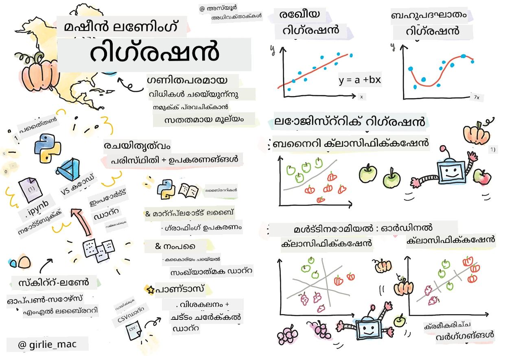
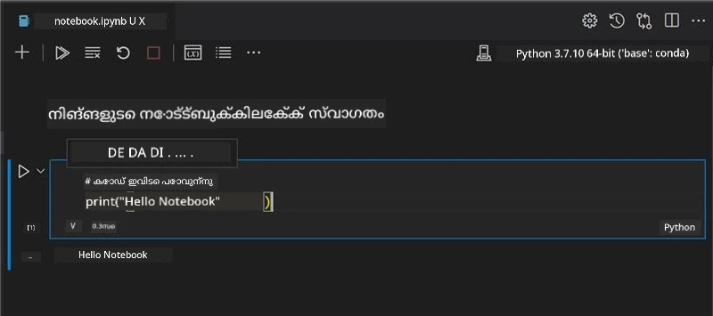
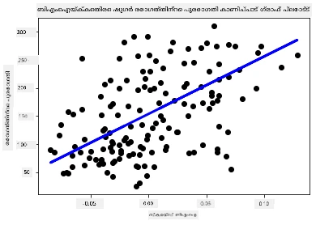

# റിഗ്രഷൻ മോഡലുകൾക്കായി Python, Scikit-learn ഉപയോഗിച്ച് തുടങ്ങാം



> [Tomomi Imura](https://www.twitter.com/girlie_mac)എഴുതിയ സ്കെച്ചോടി

## [പ്രീ-ലെക്ചർ ക്വിസ്](https://ff-quizzes.netlify.app/en/ml/)

> ### [ഈ പാഠം R-ലിലും ലഭ്യമാണ്!](../../../../2-Regression/1-Tools/solution/R/lesson_1.html)

## പരിചയം

ഈ നാല് പಾಠങ്ങളിൽ, നിങ്ങൾ റിഗ്രഷൻ മോഡലുകൾ എങ്ങനെ നിർമ്മിക്കാമെന്ന് കണ്ടുപിടിക്കും. ഇവ എന്തിന് വേണ്ടിയാണെന്ന് കുറച്ചു സമയം മുന്നേ നിർവചിക്കും. എന്നാൽ എന്ത് ചെയ്യുകയുമുണ്ടാകുന്നതിന് മുമ്പ്, ആരംഭിക്കുന്നതിന് مناسبമായ ഉപകരണങ്ങൾ നിങ്ങളുടെ കിണറ്റിൽ ഉണ്ടെന്ന് ഉറപ്പാക്കുക!

ഈ പാഠത്തിൽ, നിങ്ങൾ പഠിക്കും:

- നിങ്ങളുടെ കമ്പ്യൂട്ടർ ലോക്കൽ മെഷീൻ ലേണിങ് പ്രവർത്തനങ്ങൾക്ക് എങ്ങനെ ക്രമീകരിക്കാം.
- Jupyter Notebooks-ഉം എങ്ങനെ ഉപയോഗിക്കാം.
- Scikit-learn ഉപയോഗം, ഇൻസ്റ്റാളേഷൻ ഉൾപ്പെടെ.
- കുറച്ച് പ്രായോഗിക അഭ്യാസത്തോടെ ലൈനിയർ റിഗ്രഷൻ പരിശോധിക്കുക.

## ഇൻസ്റ്റാളേഷനുകളും ക്രമീകരണങ്ങളും

[](https://youtu.be/-DfeD2k2Kj0 "ML for beginners -Setup your tools ready to build Machine Learning models")

> 🎥 ML ക്രമീകരണം നന്നാക്കുന്നതിനുള്ള ചുരുക്ക വീഡിയോയ്ക്കായി മുകളിൽ ചിത്രം ക്ലിക്കുചെയ്യുക.

1. **Python ഇൻസ്റ്റാൾ ചെയ്യുക**. [Python](https://www.python.org/downloads/) നിങ്ങളുടെ കമ്പ്യൂട്ടറിൽ നിങ്ങൾ ഇൻസ്റ്റാൾ ചെയ്തിട്ടുണ്ടെന്ന് ഉറപ്പാക്കുക. Python-നാണ് നിങ്ങൾക്ക് അനേകം ഡാറ്റാ സയൻസ്, മെഷീൻ ലേണിങ് പ്രവർത്തനങ്ങൾ ചെയ്യേണ്ടത്. പല കമ്പ്യൂട്ടർ സംവിധാനങ്ങളിലും Python ഇൻസ്റ്റാൾ ചെയ്തിട്ടുണ്ട്. ചില ഉപയോക്താക്കൾക്ക് സഹായം നൽകാൻ ഉപയോഗപ്പെടുത്താവുന്ന [Python Coding Packs](https://code.visualstudio.com/learn/educators/installers?WT.mc_id=academic-77952-leestott) ലഭ്യമാണ്.

   Python-ന്റെ ചില ഉപയോഗങ്ങൾക്ക് ഒരേ സോഫ്റ്റ്‌വെയറിന്റെ ഒരു വേർഷൻ ആവശ്യമാണ്, മറ്റുചില സന്ദർഭങ്ങളിൽ മറ്റൊരു വേർഷൻ ആവശ്യമാണ്. അതിനാൽ, [വുർച്വൽ എൻവയോൺമെന്റ്](https://docs.python.org/3/library/venv.html)യിൽ പ്രവർത്തിക്കുന്നത് ഉപകാരപ്രദമാണ്.

2. **Visual Studio Code ഇൻസ്റ്റാൾ ചെയ്യുക**. നിങ്ങളുടെ കമ്പ്യൂട്ടറിൽ Visual Studio Code ഇൻസ്റ്റാൾ ചെയ്തിട്ടുണ്ടെന്നു ഉറപ്പാക്കുക. ഏകദേശ ഇൻസ്റ്റാളേഷനു വേണ്ടി ഈ നിർദ്ദേശങ്ങൾ പാലിക്കുക [Visual Studio Code ഇൻസ്റ്റാൾ ചെയ്യുക](https://code.visualstudio.com/). ഈ കോഴ്‌സിൽ Visual Studio Codeയിൽ Python ഉപയോഗിക്കും, അതിനാൽ Python വികസനത്തിനായി [Visual Studio Code ക്രമീകരണം](https://docs.microsoft.com/learn/modules/python-install-vscode?WT.mc_id=academic-77952-leestott) എങ്ങനെ ചെയ്യാമെന്ന് പഠിക്കാം.

   > Python-നുമായി പരിചയപ്പെടാൻ ഈ [Learn modules](https://docs.microsoft.com/users/jenlooper-2911/collections/mp1pagggd5qrq7?WT.mc_id=academic-77952-leestott) ശേഖരം ഉപയോഗിക്കുക
   >
   > [](https://youtu.be/yyQM70vi7V8 "Visual Studio Code-ൽ Python ക്രമീകരിക്കുക")
   >
   > 🎥 VS Code-ൽ Python ഉപയോഗിച്ച് പ്രവർത്തിക്കുന്ന വീഡിയോയ്ക്ക് മുകളിൽ ചിത്രം ക്ലിക്കുചെയ്യുക.

3. **Scikit-learn ഇൻസ്റ്റാൾ ചെയ്യുക**. [ഈ നിർദ്ദേശങ്ങൾ](https://scikit-learn.org/stable/install.html) പിന്തുടരുക. Python 3 ഉപയോഗിക്കുന്നതായി ഉറപ്പാക്കേണ്ടതിനാൽ വർച്ച്വൽ എൻവയോൺമെന്റ് ഉപയോഗിക്കുന്നത് ശുപാർശ ചെയ്യുന്നു. M1 Mac-ൽ ഇൻസ്റ്റാൾ ചെയ്യുമ്പോഴുള്ള പ്രത്യേക നിർദ്ദേശങ്ങൾ പേജ് കൂടെ നൽകിയിട്ടുണ്ട്.

1. **Jupyter Notebook ഇൻസ്റ്റാൾ ചെയ്യുക**. [Jupyter പാക്കേജ്](https://pypi.org/project/jupyter/) ഇൻസ്റ്റാൾ ചെയ്യേണ്ടതാണ്.

## നിങ്ങളുടെ ML എഴുത്തു പരിസ്ഥിതി

Python കോഡ് വികസിപ്പിക്കാനും മെഷീൻ ലേണിങ് മോഡലുകൾ സൃഷ്ടിക്കാനും നിങ്ങൾ **നോട്ട്‌ബുക്കുകൾ** ഉപയോഗിക്കുന്നു. ഈ തരത്തിലുള്ള ഫയലുകൾ ഡാറ്റാ സയന്റിസ്റ്റുകൾക്ക് സാധാരണ ഉപകരണമാണ്, ഇവ `.ipynb` എന്ന സഫ്ഫിക്സ് അല്ലെങ്കിൽ എക്സ്റ്റൻഷൻ വഴി തിരിച്ചറിയാം.

നോട്‌ബുക്കുകൾ ഒരു ഇന്ററാക്ടീവ് പരിസ്ഥിതിയാണ്, കോഡ് എഴുതുന്നതിനോടൊപ്പം കുറിപ്പുകൾ ചേർക്കാനും ഡോക്യുമെന്റേഷൻ എഴുതാനുമുള്ള സൗകര്യമുള്ളത്, ഇത് പരീക്ഷണാത്മകമായോ ഗവേഷണ-ആധാരിതമായ പ്രോജക്റ്റുകൾക്കായി ഉപകാരപ്രദമാണ്.

[](https://youtu.be/7E-jC8FLA2E "ML for beginners - Jupyter Notebooks ക്രമീകരിച്ച് റിഗ്രഷൻ മോഡലുകൾ സൃഷ്ടിക്കാൻ തുടങ്ങുക")

> 🎥 ഈ അഭ്യാസം നടത്തുന്നതിനുള്ള ചുരുക്ക വീഡിയോയ്ക്ക് മുകളിൽ ചിത്രം ക്ലിക്കുചെയ്യുക.

### അഭ્યાસം - ഒരു നോട്ട്‌ബുക്കുമായി പ്രവർത്തിക്കുക

ഈ ഫോൾഡറിൽ _notebook.ipynb_ ഫയൽ കണ്ടെത്തും.

1. Visual Studio Code-ൽ _notebook.ipynb_ തുറക്കുക.

   Jupyter സെർവർ Python 3+ കോഴ്ഡ് ആരംഭിക്കും. നോട്ട്‌ബുക്കിൽ `run` ചെയ്യാവുന്ന കോഡ് ഭാഗങ്ങൾ ഉണ്ടാകും. പ്ലേ ബട്ടൺ പോലുള്ള ഐകോൺ തിരഞ്ഞെടുക്കുമ്പോൾ കോഡ് ബ്ലോക്ക് പ്രവർത്തിപ്പിക്കാം.

1. `md` ഐകോൺ തിരഞ്ഞെടുക്കുക, കുറച്ചു മാർക്ക്ഡൗൺ ചേർക്കുക, തുടർന്ന് **# Welcome to your notebook** എന്ന് ടൈപ്പു ചെയ്യുക.

   തുടര്‍ന്ന് കുറച്ച് Python കോഡ് ചേർക്കുക.

1. കോഡ് ബ്ലോക്കിൽ **print('hello notebook')** ടൈപ്പ് ചെയ്യുക.
1. കോഡ് ഓടിക്കാൻ ഐക്കൺ സെലക്ട് ചെയ്യുക.

   നിങ്ങൾക്ക് അച്ചടിച്ച പ്രസ്താവന കാണാൻ സാധിക്കും:

    ```output
    hello notebook
    ```



നിങ്ങൾക്ക് കോഡുമായി ചേർന്ന് അഭിപ്രായങ്ങളും, സ്വയം-ഡോക്യുമെന്റേഷൻ ചെയ്യുന്നതിനുള്ള കുറിപ്പുകളും ചേർക്കാം.

✅ വെബ് ഡവലപ്പറുടെ പ്രവർത്തന പരിസ്ഥിതിയും ഡാറ്റാ സയന്റിസ്റ്റിന്റെ പരിസ്ഥിതിയും എത്ര വ്യത്യസ്തമാണെന്ന് കുറച്ച് ആലോചിക്കുക.

## Scikit-learn ഉപയോഗിക്കാൻ തയ്യാറാകാം

Python നിങ്ങളുടെ ലോക്കൽ പരിസ്ഥിതിയിൽ ക്രമീകരിച്ചിരിക്കുന്നതിനാലും Jupyter Notebooks ഉപയോഗിക്കാൻ നിങ്ങൾക്കു പരിചയമുണ്ടെന്നതിനാലും ഇനി Scikit-learn-നുമായി സമാനം പരിചയപ്പെടാം (`sci` എന്നത് `science` എന്ന പോലെ ഉച്ചാരിക്കുക). Scikit-learn ഏറെ വിപുലമായ [API](https://scikit-learn.org/stable/modules/classes.html#api-ref) നൽകുന്നു, ML പ്രവർത്തനങ്ങൾക്കായി സഹായിക്കാൻ.

അവരുടെ [വെബ്സൈറ്റ്](https://scikit-learn.org/stable/getting_started.html) പ്രകാരം, "Scikit-learn ഒരു ഓപ്പൺ സോഴ്സ് മെഷീൻ ലേണിങ് ലൈബ്രറിയാണ്, ഇതിൽ സർവൈസ്ഡ് ആൻഡ് അൺസർവൈസ്ഡ് ലേണിങ് പിന്തുണയ്ക്കുന്നുണ്ട്. മോഡൽ ഫിറ്റിംഗ്, ഡാറ്റാ പ്രീപ്രോസസ്സിംഗ്, മോഡൽ തിരഞ്ഞെടുപ്പ്, മൂല്യനിർണ്ണയം തുടങ്ങിയ പല ഉപകരണങ്ങളും നൽകുന്നു."

ഈ കോഴ്സിൽ நீங்கள் Scikit-learnയും മറ്റ് ഉപകരണങ്ങളും ഉപയോഗിച്ച് മെഷീൻ ലേണിങ് മോഡലുകൾ നിർമ്മിച്ച് 'പരമ്പരാഗത മെഷീൻ ലേണിങ്' പ്രവർത്തനങ്ങൾ നടത്തും. നാം തദ്ദേശീയമായി നർവൽ നെറ്റ്‌വർക്ക്‌സും ഡീപ്പ് ലേണിങ്ങും ഒഴിവാക്കിയതാണ്, അവ 'AI for Beginners' കോഴ്സിൽ ഉൾപ്പെടുത്തി പഠിപ്പിക്കും.

Scikit-learn മോഡലുകൾ നിർമ്മിക്കുക, അവ വിലയിരുത്തുക എന്ന കാര്യങ്ങൾ എളുപ്പമാക്കുന്നു. സംഖ്യാത്മക ഡാറ്റയ്ക്കു കേന്ദ്രീകരിച്ചിരിക്കുന്നു, പഠന സഹായിപ്പുകൾക്ക് നിരവധി റെഡി-മെയ്ഡ് ഡാറ്റാസെറ്റുകൾ ഉൾക്കൊള്ളുന്നു. വിദ്യാർത്ഥികൾക്ക് പരീക്ഷിക്കാൻ തയ്യാറാക്കിയ മോഡലുകളും ഉണ്ട്. വരെയ്ക്കും ഡാറ്റ ഉപയോഗിച്ച് നിര്‍മിച്ച Scikit-learn-ന്റെ നിർമ്മിതഘടകവും പ്രാഥമിക മോഡലും ഉപയോഗിച്ച് പ്രവർത്തന പ്രക്രിയ പരിശോധിക്കാം.

## അഭ്യാസം - നിങ്ങളുടെ ആദ്യ Scikit-learn നോട്ട്‌ബുക്ക്

> ഈ ട്യൂട്ടോറിയൽ Scikit-learn വെബ്സൈറ്റിലെ [ലൈനിയർ റിഗ്രഷൻ ഉദാഹരണത്തിലോ (linear regression example)](https://scikit-learn.org/stable/auto_examples/linear_model/plot_ols.html#sphx-glr-auto-examples-linear-model-plot-ols-py) നിന്നാണ് പ്രചോദനം ലഭിച്ചത്.


[](https://youtu.be/2xkXL5EUpS0 "ML for beginners - Python-ൽ നിങ്ങളുടെ ആദ്യ ലൈനിയർ റിഗ്രഷൻ പ്രോജക്റ്റ്")

> 🎥 ഈ അഭ്യാസം നടത്തുന്നതിനുള്ള ചുരുക്ക വീഡിയോയ്ക്ക് മുകളിൽ ചിത്രം ക്ലിക്കുചെയ്യുക.

ഈ പാഠത്തോട് ബന്ധപ്പെട്ട _notebook.ipynb_ ഫയലിൽ എല്ലാ സെല്ലുകളും 'trash can' ഐക്കൺ അമർത്തി നീക്കം ചെയ്യുക.

ഈ ഭാഗത്ത്, പഠന ഉദ്ദേശ്യങ്ങൾക്ക് Scikit-learn-ൽ ഉൾപ്പെടുത്തിയ ചെറിയ ഡയബിറ്റീസ് ഡാറ്റാസെറ്റ് ഉപയോഗിക്കും. ഈ കുഞ്ഞ് ഡാറ്റaset ഉപയോഗിച്ച്, ഡയബറ്റിക് രോഗികൾക്കുള്ള ചികിത്സ പരീക്ഷിക്കാൻ നിങ്ങൾ ആഗ്രഹിക്കുന്നു എന്ന് കരുതുക. മെഷീൻ ലേണിങ് മോഡലുകൾ ഏതൊക്കെ രോഗികൾ ചികിത്സക്ക് നല്ല പ്രതികരണം നൽകുമെന്ന് Variables കൂട്ടങ്ങൾ അടിസ്ഥാനമാക്കി പ്രവചനമുണ്ടാക്കാൻ സഹായിക്കും. വളരെ അടിസ്ഥാന റിഗ്രഷൻ മോഡൽ ഭാവിക്കുകയും കാണിക്കുകയും ചെയ്യുമ്പോൾ, നിങ്ങൾക്കു സൈദ്ധാന്തിക ക്ലിനിക്കൽ പരീക്ഷണങ്ങൾ സംഘടിപ്പിക്കാൻ സഹായിക്കുന്ന Variables സംബന്ധിച്ച വിവരങ്ങൾ കാണാൻ കഴിയും.

✅ ഒരുപാട് തരത്തിലുള്ള റിഗ്രഷൻ രീതികൾ ഉണ്ട്, തിരഞ്ഞെടുക്കുക നിങ്ങൾ അന്വേഷിക്കുന്ന മറുപടിക്ക് അനുസരിച്ച്. ഒരു വ്യക്തിയുടെ കൊടുത്ത വയസ്സിനുള്ള സാധ്യതയുള്ള ഉയരം പ്രവചിക്കാൻ linear regression ആണ് ഉപയോഗിക്കേണ്ടത്; കാരണം നിങ്ങൾ **സംഖ്യാത്മക മൂല്യം** അന്വേഷിക്കുന്നു. നിങ്ങൾ ഒരു ഭക്ഷണ തരം വീഗൻ ആണോ എന്നത് കണ്ടെത്താൻ ആഗ്രഹിക്കുന്നുവെങ്കിൽ, നിങ്ങൾ **വർഗ്ഗ നിശ്ചയത്തിന്** വേണ്ടി logistic regression ഉപയോഗിക്കും. logistic regression പിന്നീട് പഠിക്കാം. ഡാറ്റയിൽ ചോദിക്കാവുന്ന ചില ചോദ്യങ്ങളും ഇത്തരത്തിലുള്ള രീതികളിൽ ഏത് ഉപയോഗിക്കുമെന്നതും കുറച്ച് വിചാരിക്കുക.

ഈ ഏർപ്പെടുത്തലും തുടക്കം കുറിക്കാം.

### ലൈബ്രറികൾ ഇറക്കുമതി ചെയ്യുക

ഈ പ്രവർത്തനത്തിനായി ചില ലൈബ്രറികൾ ഇറക്കുമതി ചെയ്യാം:

- **matplotlib**. ഇത് ഒരു ഉപകാരപ്രദമായ [ഗ്രാഫിക് ഉപകരണം](https://matplotlib.org/) ആണ്, നമുക്ക് ഒരു ലൈന്പ്ലോട്ട് സൃഷ്ടിക്കാൻ ഇത് ഉപയോഗിക്കുന്നതാണ്.
- **numpy**. [numpy](https://numpy.org/doc/stable/user/whatisnumpy.html) Python-ൽ സംഖ്യാത്മക ഡാറ്റ കൈകാര്യം ചെയ്യുന്നതിന് സഹായിക്കുന്ന ഒരു ഉപയോഗപ്രദ ലൈബ്രറി.
- **sklearn**. ഇത് [Scikit-learn](https://scikit-learn.org/stable/user_guide.html) ലൈബ്രറിയാണ്.

നിങ്ങളുടെ പ്രവർത്തനങ്ങൾക്ക് സഹായിക്കുന്നതിനായി ചില ലൈബ്രറികൾ ഇറക്കുമതി ചെയ്യുക.

1. ഇപ്രകാരം താഴെയുള്ള കോഡ് ടൈപ്പ് ചെയ്ത് ഇറക്കുമതി ചേർക്കുക:

   ```python
   import matplotlib.pyplot as plt
   import numpy as np
   from sklearn import datasets, linear_model, model_selection
   ```

   മുകളിൽ നിങ്ങൾ `matplotlib`, `numpy` ഇറക്കുമതി ചെയ്യുന്നു, കൂടാതെ `datasets`, `linear_model`, `model_selection` `sklearn`-ലിൽ നിന്ന് ഇറക്കുമതി ചെയ്യുന്നു. `model_selection` ഡാറ്റ പരിശീലനത്തിനും പരീക്ഷണത്തിനും വിഭജിക്കാനാണ് ഉപയോഗിക്കുന്നത്.

### ഡയബിറ്റീസ് ഡാറ്റാസെറ്റ്

ഇൻബിൽറ്റ് [ഡയബിറ്റീസ് ഡാറ്റാസെറ്റ്](https://scikit-learn.org/stable/datasets/toy_dataset.html#diabetes-dataset) 442 സാമ്പിളുകളടങ്ങിയിരിക്കുന്നു, 10 ഫീച്ചർ വേരിയബിൾസ് ഉൾപ്പെടെ ചിലത്:

- വയസ്സ്: വയസ് വർഷങ്ങളിൽ
- bmi: ബോഡി മാസ്സ് ഇൻഡക്സ്
- bp: ശരാശരി രക്തദബ്‌ബം
- s1 tc: T-സെല്ലുകൾ (ഒരു സ്പെസിഫിക് വെളുത്ത രക്താശയം)

✅ ഈ ഡാറ്റാസെറ്റ് 'Sex' എന്ന ഘടകത്തെ ശ്രദ്ധേയമായി ഉൾക്കൊള്ളിക്കുന്നു, ഇത് ഡയബിറ്റീസ് ഗവേഷണത്ത് പ്രധാനമാണ്. ധാരാളം മെഡിക്കൽ ഡാറ്റാസെറ്റുകൾ ഇത്തരത്തിലുള്ള ബൈനറി വർഗ്ഗീകരണം ഉൾകൊള്ളിക്കുന്നു. ഈ തരത്തിലുള്ള വർഗ്ഗീകരണങ്ങൾ സമൂഹത്തിലെ ചില വിഭാഗങ്ങളെ ചികിത്സയിൽനിന്ന് ഒഴിവാക്കുന്നത് എങ്ങനെയാവാം എന്ന് കുറച്ച് ചിന്തിക്കുക.

ഇപ്പോൾ, X, y ഡാറ്റ ഡ്രൈവുചെയ്യുക.

> 🎓 ഓർക്കുക, ഇത് supervised learning ആണ്, ഒരു നാമമായ 'y' ലക്ഷ്യം ആവശ്യമുണ്ട്.

പുതിയ കോഡ് സെല്ലിൽ, `load_diabetes()` വിളിച്ച് ഡാറ്റാസെറ്റ് ലോഡ് ചെയ്യുക. `return_X_y=True` എന്ന ഇൻപുട്ട് `X` ഡാറ്റാ മാട്രിക്‌സ് ആകും, `y` റിഗ്രഷൻ ലക്ഷ്യം ആകുമെന്നു സൂചിപ്പിക്കുന്നു.

1. ഡാറ്റാസെറ്റിന്റെ രൂപവും ആദ്യ ഘടകവും കാണിക്കാൻ ചില പ്രിന്‍റ് കമാൻഡുകൾ ചേർക്കുക:

    ```python
    X, y = datasets.load_diabetes(return_X_y=True)
    print(X.shape)
    print(X[0])
    ```

    നിങ്ങൾ തിരികെ കിട്ടുന്നത് ഒരു tuple ആണ്. നിങ്ങൾ പ്രവർത്തിക്കുന്നത് tuple-ന്റെ ആദ്യ രണ്ട് മൂല്യങ്ങൾ `X`, `y` ആയി നിർവചിക്കുന്നതാണ്. കൂടുതൽ അറിയാൻ [tuples](https://wikipedia.org/wiki/Tuple) കുറിച്ച് വായിക്കുക.

    ഈ ഡാറ്റ 442 ഇനങ്ങളടങ്ങിയിരിക്കുന്നു, ഓരോന്നിലും 10 ഘടകങ്ങൾ അടങ്ങിയ ആറേകളാണ്:

    ```text
    (442, 10)
    [ 0.03807591  0.05068012  0.06169621  0.02187235 -0.0442235  -0.03482076
    -0.04340085 -0.00259226  0.01990842 -0.01764613]
    ```

    ✅ ഡാറ്റയും റിഗ്രഷൻ ലക്ഷ്യവും തമ്മിലുള്ള ബന്ധം കുറച്ച് ആലോചിക്കുക. ലൈനിയർ റിഗ്രഷൻ ഫീച്ചർ Xനും ലക്ഷ്യം variable y-ഉം തമ്മിലുള്ള ബന്ധം പ്രവചിക്കുന്നു. ഡയബിറ്റീസ് ഡാറ്റാസെറ്റിന്റെ [ലക്ഷ്യം](https://scikit-learn.org/stable/datasets/toy_dataset.html#diabetes-dataset) ഡോക്യുമെന്റേഷനിൽ കണ്ടെത്താനാകും? ഈ ഡാറ്റാസെറ്റ് ആ ലക്ഷ്യം പ്രതിപാദിക്കുന്നതെന്താണെന്ന് ചിന്തിക്കൂ.

2. ഈ ഡാറ്റാസെറ്റിന്റെ ഒരു ഭാഗം പ്ലോട്ട് ചെയ്യാൻ 3-ആം സ്തംഭം തെരഞ്ഞെടുക്കുക. എല്ലാ വരികളും തിരഞ്ഞെടുക്കാൻ `:` ഓപ്പറേറ്റർ ഉപയോഗിച്ച്, 3-ആം സ്തംഭം index (2) ഉപയോഗിച്ച് തിരഞ്ഞെടുക്കുക. പ്ലോട്ടിംഗിനായി 2D ആറെയായി രൂപം മാറ്റേണ്ടതുണ്ടെങ്കിൽ, `reshape(n_rows, n_columns)` ഉപയോഗിക്കാം. ഒരു പാരാമീറ്റർ -1 ആകുമ്പോൾ അദേഹത്തിന്റെ പരിധി ഓട്ടോമാറ്റിക്കായി കണക്കാക്കപ്പെടും.

   ```python
   X = X[:, 2]
   X = X.reshape((-1,1))
   ```

   ✅ ഏപ്പോൾ വേണമെങ്കിലും ഡാറ്റയുടെ രൂപമാറ്റം പരിശോധിക്കാൻ പ്രിന്റ് ചെയ്‌തേക്കാം.

3. ഇപ്പോൾ ഡാറ്റ പ്ലോട്ടിംഗിന് സജ്ജമാണെന്ന് തയ്ക്കാൻ, ഈ ഡാറ്റാസെറ്റിലെ സംഖ്യകൾക്കിടയിൽ ലാജിക്കൽ വിഭജനം ഒരു മെഷീൻ നിർദ്ദേശിക്കാൻ കഴിയും എന്ന് നോക്കൂ. ഇതിന്, ഡാറ്റ (X) മത്തും ലക്ഷ്യം (y) താരതമ്യമുള്ള പരിശീലനവും ടെസ്റ്റിംഗും സെറ്റുകളിൽ വിഭജണം ആവശ്യമാണ്. Scikit-learn ഇതിനെ എളുപ്പമാക്കുന്ന രീതിയാണ്; നിങ്ങൾക്ക് ടെസ്റ്റ് ഡാറ്റ ഒരു പ്രത്യേക പോയിന്റ് ഉപയോഗിച്ച് വിഭജിക്കാം.

   ```python
   X_train, X_test, y_train, y_test = model_selection.train_test_split(X, y, test_size=0.33)
   ```

4. ഇനി നിങ്ങൾ മോഡൽ പരിശീലിപ്പിക്കാം! ലൈനിയർ റിഗ്രഷൻ മോഡൽ ലോഡ് ചെയ്ത് `model.fit()` ഉപയോഗിച്ച് X, y പരിശീലന സെറ്റുകളിൽ പരിശീലിപ്പിക്കുക:

    ```python
    model = linear_model.LinearRegression()
    model.fit(X_train, y_train)
    ```

    ✅ TensorFlow പോലുള്ള അനേകം ML ലൈബ്രറികളിൽ നിങ്ങൾ കാണുന്ന `model.fit()` ഒരു ഫംഗ്ഷനാണ്

5. തുടർന്ന് ടെസ്റ്റ് ഡാറ്റ ഉപയോഗിച്ച് പ്രവചനമുണ്ടാക്കാൻ `predict()` ഫംഗ്ഷൻ ഉപയോഗിക്കുക. ഇത് ഡാറ്റാ ഗ്രൂപ്പുകൾക്കിടയിലെ രേഖ വരയ്ക്കാൻ ഉപകരിക്കും

    ```python
    y_pred = model.predict(X_test)
    ```

6. ഇപ്പോൾ matplotlib ഉപയോഗിച്ച് ഡാറ്റ ഒരു പ്ലോട്ടിൽ പ്രദർശിപ്പിക്കാൻ സമയമുണ്ട്. X, y ടെസ്റ്റ് ഡാറ്റ മുഴുവന്‍ സ്കാറ്റർപ്ലോട്ട് ചെയ്യുക, മോഡലിന്റെ പ്രെഡിക്ഷൻ ഉപയോഗിച്ച് ഏറ്റവും അനുയോജ്യമായ ഇടത്ത് വര വരയ്ക്കുക.

    ```python
    plt.scatter(X_test, y_test,  color='black')
    plt.plot(X_test, y_pred, color='blue', linewidth=3)
    plt.xlabel('Scaled BMIs')
    plt.ylabel('Disease Progression')
    plt.title('A Graph Plot Showing Diabetes Progression Against BMI')
    plt.show()
    ```

   


   ✅ ഇവിടെ നടക്കുന്നത് എന്താണെന്ന് അല്പം ചിന്തിക്കുക. ഒരു നേരിയ রেখ ചെറുചെറിയ ഡാറ്റ പോയിന്റുകളുടെ ഒരുപാട് ദൃശ്യങ്ങളിലൂടെ കടന്നുപോകുന്നു, പക്ഷേ ഇത് ഏതാണ്ട് എന്ത് ചെയ്യുന്നു? ഈ രേഖ ഉപയോഗിച്ച് ഒരു പുതിയ, കാണാത്ത ഡാറ്റ പോയിന്റ് പ്ലോട്ടിന്റെ y അക്ഷത്തോടുള്ള ബന്ധത്തിൽ എവിടെയെന്ന് പ്രവചിക്കാനാകുമെന്ന് കാണാമോ? ഈ മോഡലിന്റെ പ്രായോഗിക ഉപയോഗം വാക്കുകളിൽ പങ്കുവെക്കാൻ ശ്രമിക്കുക.

അഭിനന്ദനങ്ങള്‍! നിങ്ങൾ നിങ്ങളുടെ ആദ്യ ലീനിയർ റെഗ്രഷൻ മോഡൽ നിർമ്മിച്ചു, അതുമായി ഒരു പ്രവചനമുണ്ടാക്കി, അത് പ്ലോട്ടിൽ പ്രദർശിപ്പിച്ചു!

---
## 🚀പ്രതിസന്ധി

ഈ ഡാറ്റാസെറ്റ് നുള്ള മറ്റൊരു വേരി ഏറിയബിള്‍ പ്ലോട്ട് ചെയ്യുക. ടിപ്പ്: ഈ ലൈനിൽ എഡിറ്റ് ചെയ്യുക: `X = X[:,2]`. ഈ ഡാറ്റാസെറ്റിന്റെ ലക്ഷ്യത്തെകുറിച്ച്, ഡയബറ്റീസിന്റെ ഒരു രോഗമായി പുരോഗതി സംബന്ധിച്ച് നിങ്ങൾക്ക് എന്ത് കണ്ടെത്താൻ കഴിയുന്നു?
## [പോസ്റ്റ്-ലെക്ചർ ക്വിസ്](https://ff-quizzes.netlify.app/en/ml/)

## സിംഹവീക്ഷണവും സ്വയം പഠനവും

ഈ ട്യൂട്ടോറിയലിൽ, നിങ്ങൾ ലീനിയർ റെഗ്രഷനുമായി ജോലി ചെയ്തു, യുണിവാരിയറ്റ് അല്ലെങ്കിൽ മൾട്ടി‍പിൾ ലീനിയർ റെഗ്രഷൻ മോഡലുകളുടെ പകരം. ഈ രീതികളുടെ വ്യത്യാസങ്ങളെ കുറിച്ച് കുറച്ച് വായിക്കുക, അല്ലെങ്കിൽ [ഈ വീഡിയോ](https://www.coursera.org/lecture/quantifying-relationships-regression-models/linear-vs-nonlinear-categorical-variables-ai2Ef) കാണുക.

റെഗ്രഷൻ എന്ന ധാരണയെ കുറിച്ച് കൂടുതൽ വായിക്കുക, ഈ സാങ്കേതികവുമായിക്കുള്ള സമാധാനിക്കാവുന്ന ചോദ്യങ്ങൾ എന്തൊക്കെയാണെന്ന് ചിന്തിക്കുക. നിങ്ങളുടെ അന്വേഷണം കൂടുതൽ ഊന്നാക്കാൻ ഈ [ട്യൂട്ടോറിയൽ](https://docs.microsoft.com/learn/modules/train-evaluate-regression-models?WT.mc_id=academic-77952-leestott) കൈകൊള്ളുക.

## അസൈൻമെന്റ്

[മറ്റ് ഒരു ഡാറ്റാസെറ്റ്](assignment.md)

---

<!-- CO-OP TRANSLATOR DISCLAIMER START -->
**അറിയിപ്പ്**:
ഈ രേഖ AI പരിഭാഷാ സേവനം [Co-op Translator](https://github.com/Azure/co-op-translator) ഉപയോഗിച്ച് പരിഭാഷപ്പെടുത്തിയതാണ്. ഞങ്ങൾ കൃത്യതയ്ക്കായി ശ്രമിക്കുന്നുവെങ്കിലും, ഓട്ടോമേറ്റഡ് പരിഭാഷകളിൽ പിഴവുകൾ അല്ലെങ്കിൽ തെറ്റായ വിവരങ്ങൾ ഉണ്ടാകാൻ സാധ്യതയുണ്ട്. അതിന്റെ സ്വാഭാവിക ഭാഷയിലുള്ള അസൽ രേഖയാണ് പ്രാമാണികമായ ഉറവിടമായി പരിഗണിക്കേണ്ടത്. നിർണായകമായ വിവരങ്ങൾക്ക്, പ്രൊഫഷണൽ മനുഷ്യ പരിഭാഷ ശുപാർശ ചെയ്യുന്നു. ഈ പരിഭാഷ ഉപയോഗിച്ച് ഉണ്ടാകുന്ന തെറ്റിദ്ധാരണകൾ അല്ലെങ്കിൽ തെറ്റായ വ്യാഖ്യാനങ്ങൾക്കായി ഞങ്ങൾ ഉത്തരവാദികളല്ല.
<!-- CO-OP TRANSLATOR DISCLAIMER END -->