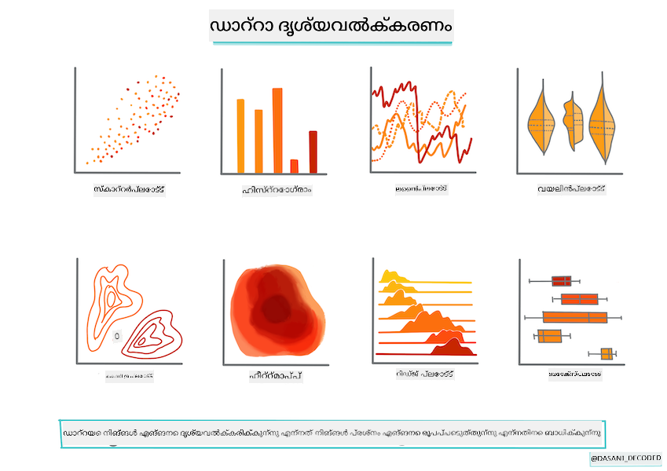
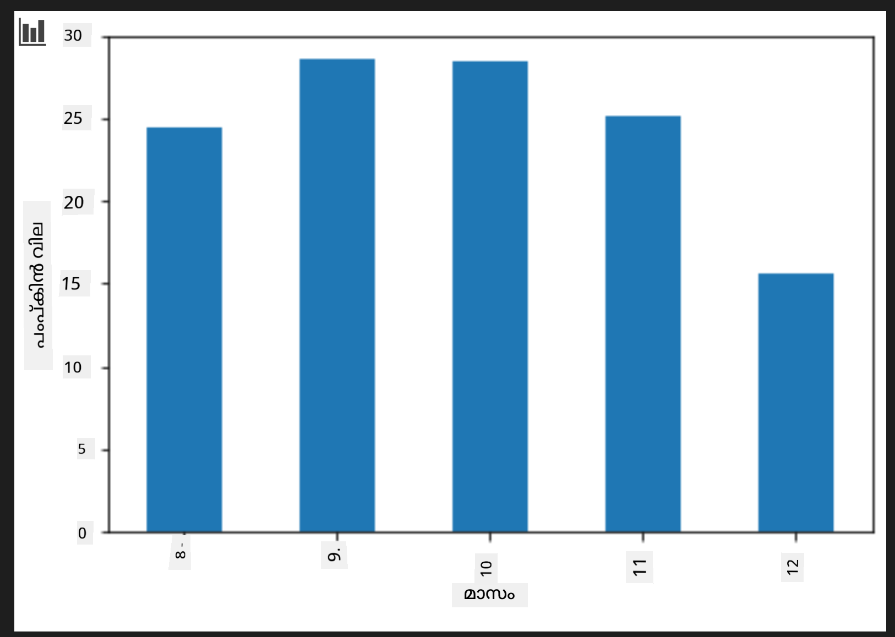

<!--
CO_OP_TRANSLATOR_METADATA:
{
  "original_hash": "7c077988328ebfe33b24d07945f16eca",
  "translation_date": "2025-12-19T14:00:13+00:00",
  "source_file": "2-Regression/2-Data/README.md",
  "language_code": "ml"
}
-->
# Scikit-learn ഉപയോഗിച്ച് ഒരു റെഗ്രഷൻ മോഡൽ നിർമ്മിക്കുക: ഡാറ്റ തയ്യാറാക്കൽ மற்றும் ദൃശ്യവൽക്കരണം



ഇൻഫോഗ്രാഫിക് [ദസാനി മടിപള്ളി](https://twitter.com/dasani_decoded) tarafından

## [പ്രീ-ലെക്ചർ ക്വിസ്](https://ff-quizzes.netlify.app/en/ml/)

> ### [ഈ പാഠം R-ൽ ലഭ്യമാണ്!](../../../../2-Regression/2-Data/solution/R/lesson_2.html)

## പരിചയം

Scikit-learn ഉപയോഗിച്ച് മെഷീൻ ലേണിംഗ് മോഡൽ നിർമ്മാണം ആരംഭിക്കാൻ ആവശ്യമായ ഉപകരണങ്ങൾ നിങ്ങൾക്കുണ്ടായതിനുശേഷം, നിങ്ങളുടെ ഡാറ്റയെക്കുറിച്ച് ചോദ്യങ്ങൾ ചോദിക്കാൻ നിങ്ങൾ തയ്യാറാണ്. ഡാറ്റയുമായി പ്രവർത്തിക്കുമ്പോഴും ML പരിഹാരങ്ങൾ പ്രയോഗിക്കുമ്പോഴും, നിങ്ങളുടെ ഡാറ്റാസെറ്റിന്റെ സാധ്യതകൾ ശരിയായി തുറക്കാൻ ശരിയായ ചോദ്യങ്ങൾ ചോദിക്കുന്നതിന്റെ പ്രാധാന്യം വളരെ കൂടുതലാണ്.

ഈ പാഠത്തിൽ, നിങ്ങൾ പഠിക്കും:

- മോഡൽ നിർമ്മാണത്തിനായി നിങ്ങളുടെ ഡാറ്റ എങ്ങനെ തയ്യാറാക്കാം.
- ഡാറ്റ ദൃശ്യവൽക്കരണത്തിന് Matplotlib എങ്ങനെ ഉപയോഗിക്കാം.

## നിങ്ങളുടെ ഡാറ്റയിൽ നിന്ന് ശരിയായ ചോദ്യങ്ങൾ ചോദിക്കുക

നിങ്ങൾക്ക് ഉത്തരം വേണമെന്ന ചോദ്യമാണ് നിങ്ങൾ ഉപയോഗിക്കേണ്ട ML ആൽഗോരിതങ്ങൾ നിർണ്ണയിക്കുന്നത്. നിങ്ങൾക്ക് ലഭിക്കുന്ന ഉത്തരം ലഭിക്കുന്നതിന്റെ ഗുണമേന്മ ഡാറ്റയുടെ സ്വഭാവത്തെ ആശ്രയിച്ചിരിക്കും.

ഈ പാഠത്തിനായി നൽകിയ [ഡാറ്റ](https://github.com/microsoft/ML-For-Beginners/blob/main/2-Regression/data/US-pumpkins.csv) നോക്കുക. ഈ .csv ഫയൽ VS Code-ൽ തുറക്കാം. ഒരു വേഗത്തിലുള്ള നിരീക്ഷണം കാണിക്കുന്നു, ചില സ്ഥലങ്ങളിൽ ശൂന്യങ്ങൾ ഉണ്ട്, സ്ട്രിംഗുകളും സംഖ്യകളും മിശ്രിതമാണ്. 'Package' എന്ന ഒരു അസാധാരണ കോളം ഉണ്ട്, അതിൽ 'sacks', 'bins' എന്നിവയും മറ്റ് മൂല്യങ്ങളും മിശ്രിതമാണ്. ഡാറ്റ യഥാർത്ഥത്തിൽ അല്പം കലക്കമാണ്.

[](https://youtu.be/5qGjczWTrDQ "ML for beginners - How to Analyze and Clean a Dataset")

> 🎥 ഈ പാഠത്തിനായി ഡാറ്റ തയ്യാറാക്കുന്നതിനെക്കുറിച്ച് ഒരു ചെറിയ വീഡിയോ കാണാൻ മുകളിൽ ചിത്രത്തിൽ ക്ലിക്ക് ചെയ്യുക.

യഥാർത്ഥത്തിൽ, ഒരു ML മോഡൽ സൃഷ്ടിക്കാൻ പൂർണ്ണമായും ഉപയോഗിക്കാൻ തയ്യാറായ ഒരു ഡാറ്റാസെറ്റ് ലഭിക്കുന്നത് സാധാരണമല്ല. ഈ പാഠത്തിൽ, നിങ്ങൾ സ്റ്റാൻഡേർഡ് Python ലൈബ്രറികൾ ഉപയോഗിച്ച് ഒരു റോ ഡാറ്റാസെറ്റ് എങ്ങനെ തയ്യാറാക്കാമെന്ന് പഠിക്കും. കൂടാതെ, ഡാറ്റ ദൃശ്യവൽക്കരിക്കാൻ വിവിധ സാങ്കേതിക വിദ്യകളും പഠിക്കും.

## കേസ് സ്റ്റഡി: 'പംപ്കിൻ മാർക്കറ്റ്'

ഈ ഫോൾഡറിൽ, റൂട്ട് `data` ഫോൾഡറിൽ [US-pumpkins.csv](https://github.com/microsoft/ML-For-Beginners/blob/main/2-Regression/data/US-pumpkins.csv) എന്ന .csv ഫയൽ കാണാം, ഇത് 1757 വരികളുള്ള പംപ്കിൻ മാർക്കറ്റിനെക്കുറിച്ചുള്ള ഡാറ്റ ഉൾക്കൊള്ളുന്നു, നഗരങ്ങളായി ഗ്രൂപ്പുചെയ്തിരിക്കുന്നു. ഇത് യുണൈറ്റഡ് സ്റ്റേറ്റ്സ് ഡിപ്പാർട്ട്മെന്റ് ഓഫ് അഗ്രിക്കൾച്ചർ വിതരണം ചെയ്യുന്ന [Specialty Crops Terminal Markets Standard Reports](https://www.marketnews.usda.gov/mnp/fv-report-config-step1?type=termPrice) നിന്നുള്ള റോ ഡാറ്റയാണ്.

### ഡാറ്റ തയ്യാറാക്കൽ

ഈ ഡാറ്റ പബ്ലിക് ഡൊമെയ്‌നിലാണ്. ഇത് USDA വെബ്‌സൈറ്റിൽ നിന്ന് ഓരോ നഗരത്തിനും വേർതിരിച്ച ഫയലുകളായി ഡൗൺലോഡ് ചെയ്യാം. വളരെ അധികം വേർതിരിച്ച ഫയലുകൾ ഒഴിവാക്കാൻ, എല്ലാ നഗര ഡാറ്റയും ഒരു സ്പ്രെഡ്‌ഷീറ്റിൽ ചേർത്തിട്ടുണ്ട്, അതിനാൽ ഡാറ്റ കുറച്ച് _തയ്യാറാക്കിയതാണ്_. ഇനി, ഡാറ്റയെ കൂടുതൽ നന്നായി പരിശോധിക്കാം.

### പംപ്കിൻ ഡാറ്റ - പ്രാഥമിക നിഗമനങ്ങൾ

ഈ ഡാറ്റയിൽ നിങ്ങൾ എന്ത് ശ്രദ്ധിക്കുന്നു? നിങ്ങൾ ഇതിനകം കണ്ടിട്ടുണ്ട്, സ്ട്രിംഗുകളും സംഖ്യകളും, ശൂന്യങ്ങളും, അസാധാരണ മൂല്യങ്ങളും മിശ്രിതമാണ്.

Regression സാങ്കേതിക വിദ്യ ഉപയോഗിച്ച് ഈ ഡാറ്റയിൽ നിങ്ങൾ എന്ത് ചോദ്യങ്ങൾ ചോദിക്കാം? "നൽകിയ മാസത്തിൽ വിൽപ്പനയ്ക്കുള്ള പംപ്കിന്റെ വില പ്രവചിക്കുക" എന്നത് എങ്ങനെയാണ്? ഡാറ്റ വീണ്ടും നോക്കുമ്പോൾ, ഈ ടാസ്കിനായി ആവശ്യമായ ഡാറ്റ ഘടന സൃഷ്ടിക്കാൻ ചില മാറ്റങ്ങൾ ചെയ്യേണ്ടതുണ്ട്.

## അഭ്യാസം - പംപ്കിൻ ഡാറ്റ വിശകലനം ചെയ്യുക

ഡാറ്റ രൂപപ്പെടുത്താനും വിശകലനം ചെയ്യാനും വളരെ ഉപകാരപ്രദമായ ഒരു ഉപകരണം ആയ [Pandas](https://pandas.pydata.org/) (Python Data Analysis എന്നതിന് ചുരുക്കം) ഉപയോഗിക്കാം.

### ആദ്യം, നഷ്ടപ്പെട്ട തീയതികൾ പരിശോധിക്കുക

നഷ്ടപ്പെട്ട തീയതികൾ പരിശോധിക്കാൻ നിങ്ങൾ ആദ്യം ചില നടപടികൾ സ്വീകരിക്കണം:

1. തീയതികളെ മാസ ഫോർമാറ്റിലേക്ക് മാറ്റുക (ഇവ US തീയതികളാണ്, അതിനാൽ ഫോർമാറ്റ് `MM/DD/YYYY` ആണ്).
2. മാസത്തെ പുതിയ ഒരു കോളമായി എടുക്കുക.

Visual Studio Code-ൽ _notebook.ipynb_ ഫയൽ തുറന്ന് സ്പ്രെഡ്‌ഷീറ്റ് പുതിയ Pandas ഡാറ്റാഫ്രെയിമിലേക്ക് ഇറക്കുമതി ചെയ്യുക.

1. ആദ്യ അഞ്ചു വരികൾ കാണാൻ `head()` ഫംഗ്ഷൻ ഉപയോഗിക്കുക.

    ```python
    import pandas as pd
    pumpkins = pd.read_csv('../data/US-pumpkins.csv')
    pumpkins.head()
    ```

    ✅ അവസാന അഞ്ചു വരികൾ കാണാൻ നിങ്ങൾ ഏത് ഫംഗ്ഷൻ ഉപയോഗിക്കും?

1. നിലവിലുള്ള ഡാറ്റാഫ്രെയിമിൽ നഷ്ടപ്പെട്ട ഡാറ്റയുണ്ടോ എന്ന് പരിശോധിക്കുക:

    ```python
    pumpkins.isnull().sum()
    ```

    നഷ്ടപ്പെട്ട ഡാറ്റയുണ്ട്, പക്ഷേ ഈ ടാസ്കിനായി അത് പ്രശ്നമാകില്ല.

1. നിങ്ങളുടെ ഡാറ്റാഫ്രെയിമിൽ പ്രവർത്തിക്കാൻ എളുപ്പമാക്കാൻ, നിങ്ങൾക്ക് ആവശ്യമായ കോളങ്ങൾ മാത്രം `loc` ഫംഗ്ഷൻ ഉപയോഗിച്ച് തിരഞ്ഞെടുക്കുക, ഇത് ആദ്യ പാരാമീറ്ററായി പാസ്സാക്കിയ വരികളും രണ്ടാം പാരാമീറ്ററായി പാസ്സാക്കിയ കോളങ്ങളും ഒറിജിനൽ ഡാറ്റാഫ്രെയിമിൽ നിന്ന് എടുക്കുന്നു. താഴെ കാണുന്ന `:` എന്നത് "എല്ലാ വരികളും" എന്നർത്ഥം.

    ```python
    columns_to_select = ['Package', 'Low Price', 'High Price', 'Date']
    pumpkins = pumpkins.loc[:, columns_to_select]
    ```

### രണ്ടാംത്, പംപ്കിന്റെ ശരാശരി വില നിർണ്ണയിക്കുക

നൽകിയ മാസത്തിൽ പംപ്കിന്റെ ശരാശരി വില എങ്ങനെ നിർണ്ണയിക്കാമെന്ന് ചിന്തിക്കുക. ഈ ടാസ്കിനായി നിങ്ങൾ ഏത് കോളങ്ങൾ തിരഞ്ഞെടുക്കും? സൂചന: 3 കോളങ്ങൾ ആവശ്യമാണ്.

പരിഹാരം: `Low Price` ഉം `High Price` ഉം കോളങ്ങൾ ശരാശരി എടുത്ത് പുതിയ Price കോളം പൂരിപ്പിക്കുക, Date കോളം മാസമാത്രം കാണിക്കുന്ന വിധം മാറ്റുക. ഭാഗ്യവശാൽ, മുകളിൽ നടത്തിയ പരിശോധന പ്രകാരം, തീയതികൾക്കും വിലകൾക്കും നഷ്ടപ്പെട്ട ഡാറ്റ ഇല്ല.

1. ശരാശരി കണക്കാക്കാൻ താഴെ കൊടുത്ത കോഡ് ചേർക്കുക:

    ```python
    price = (pumpkins['Low Price'] + pumpkins['High Price']) / 2

    month = pd.DatetimeIndex(pumpkins['Date']).month

    ```

   ✅ `print(month)` ഉപയോഗിച്ച് നിങ്ങൾക്ക് പരിശോധിക്കാൻ ആഗ്രഹിക്കുന്ന ഡാറ്റ പ്രിന്റ് ചെയ്യാം.

2. ഇപ്പോൾ, നിങ്ങളുടെ മാറ്റിയ ഡാറ്റ പുതിയ Pandas ഡാറ്റാഫ്രെയിമിലേക്ക് പകർത്തുക:

    ```python
    new_pumpkins = pd.DataFrame({'Month': month, 'Package': pumpkins['Package'], 'Low Price': pumpkins['Low Price'],'High Price': pumpkins['High Price'], 'Price': price})
    ```

    നിങ്ങളുടെ ഡാറ്റാഫ്രെയിം പ്രിന്റ് ചെയ്താൽ നിങ്ങൾക്ക് ഒരു ശുചിത്വമുള്ള, ക്രമീകരിച്ച ഡാറ്റാസെറ്റ് കാണാം, ഇതിൽ നിങ്ങൾ പുതിയ റെഗ്രഷൻ മോഡൽ നിർമ്മിക്കാം.

### പക്ഷേ കാത്തിരിക്കുക! ഇവിടെ ഒരു അസാധാരണതയുണ്ട്

`Package` കോളം നോക്കിയാൽ, പംപ്കിനുകൾ പലവിധ കോൺഫിഗറേഷനുകളിൽ വിൽക്കുന്നു. ചിലത് '1 1/9 ബുഷെൽ' അളവിൽ, ചിലത് '1/2 ബുഷെൽ' അളവിൽ, ചിലത് ഓരോ പംപ്കിനായി, ചിലത് പൗണ്ടിന്, ചിലത് വ്യത്യസ്ത വീതികളുള്ള വലിയ ബോക്സുകളിൽ.

> പംപ്കിനുകൾ സ്ഥിരമായി തൂക്കാൻ വളരെ ബുദ്ധിമുട്ടാണ്

ഓറിജിനൽ ഡാറ്റയിൽ നോക്കുമ്പോൾ, `Unit of Sale` 'EACH' അല്ലെങ്കിൽ 'PER BIN' ആയവയ്ക്ക് `Package` തരം ഇഞ്ച്, ബിൻ, അല്ലെങ്കിൽ 'each' ആണ്. പംപ്കിനുകൾ സ്ഥിരമായി തൂക്കാൻ ബുദ്ധിമുട്ടാണ്, അതിനാൽ `Package` കോളത്തിൽ 'bushel' എന്ന സ്ട്രിംഗ് ഉള്ള പംപ്കിനുകൾ മാത്രം തിരഞ്ഞെടുക്കാം.

1. ഫയലിന്റെ മുകളിൽ, ആദ്യ .csv ഇറക്കുമതിക്ക് താഴെ ഒരു ഫിൽട്ടർ ചേർക്കുക:

    ```python
    pumpkins = pumpkins[pumpkins['Package'].str.contains('bushel', case=True, regex=True)]
    ```

    ഇപ്പോൾ ഡാറ്റ പ്രിന്റ് ചെയ്താൽ, ബുഷെൽ പ്രകാരം പംപ്കിനുകൾ ഉള്ള ഏകദേശം 415 വരികൾ മാത്രം കാണാം.

### പക്ഷേ കാത്തിരിക്കുക! മറ്റൊരു കാര്യവും ചെയ്യണം

ബുഷെൽ അളവ് ഓരോ വരിയിലും വ്യത്യസ്തമാണെന്ന് ശ്രദ്ധിച്ചോ? വില ബുഷെൽപ്രകാരം സാധാരണവത്കരിക്കണം, അതിനാൽ ചില ഗണിതം ചെയ്യണം.

1. പുതിയ_pumpkins ഡാറ്റാഫ്രെയിം സൃഷ്ടിക്കുന്ന ബ്ലോക്കിന് ശേഷം ഈ വരികൾ ചേർക്കുക:

    ```python
    new_pumpkins.loc[new_pumpkins['Package'].str.contains('1 1/9'), 'Price'] = price/(1 + 1/9)

    new_pumpkins.loc[new_pumpkins['Package'].str.contains('1/2'), 'Price'] = price/(1/2)
    ```

✅ [The Spruce Eats](https://www.thespruceeats.com/how-much-is-a-bushel-1389308) പ്രകാരം, ബുഷെലിന്റെ ഭാരം ഉത്പന്നത്തിന്റെ തരം അനുസരിച്ച് വ്യത്യാസപ്പെടുന്നു, കാരണം ഇത് വോളിയം അളവാണ്. "ഉദാഹരണത്തിന്, ടൊമാറ്റോയുടെ ഒരു ബുഷെൽ 56 പൗണ്ട് തൂക്കമുള്ളതാണ്... ഇലകളും പച്ചക്കറികളും കുറവ് ഭാരം ഉള്ളതിനാൽ, സ്പിനാച്ചിന്റെ ഒരു ബുഷെൽ 20 പൗണ്ട് മാത്രമാണ്." ഇത് വളരെ സങ്കീർണ്ണമാണ്! ബുഷെൽ-ടു-പൗണ്ട് പരിവർത്തനം ചെയ്യാതെ, ബുഷെൽപ്രകാരം വില നിശ്ചയിക്കാം. പംപ്കിനുകളുടെ ബുഷെൽ പഠനം, നിങ്ങളുടെ ഡാറ്റയുടെ സ്വഭാവം മനസ്സിലാക്കുന്നതിന്റെ പ്രാധാന്യം കാണിക്കുന്നു!

ഇപ്പോൾ, ബുഷെൽ അളവിന്റെ അടിസ്ഥാനത്തിൽ യൂണിറ്റ് വില വിശകലനം ചെയ്യാം. ഡാറ്റ വീണ്ടും പ്രിന്റ് ചെയ്താൽ ഇത് എങ്ങനെ സാധാരണവത്കരിച്ചിട്ടുള്ളതാണെന്ന് കാണാം.

✅ പംപ്കിനുകൾ അർദ്ധ-ബുഷെൽ പ്രകാരം വിൽക്കുമ്പോൾ വളരെ വിലകൂടിയാണെന്ന് ശ്രദ്ധിച്ചോ? എന്തുകൊണ്ടെന്ന് കണ്ടെത്താമോ? സൂചന: ചെറിയ പംപ്കിനുകൾ വലിയവയെക്കാൾ വിലകൂടിയതാണ്, കാരണം ഒരു വലിയ പൊള്ളയായ പൈ പംപ്കിൻ എടുത്തിടുന്ന ഉപയോഗിക്കാത്ത സ്ഥലത്തെ തുടർന്ന് ബുഷെലിൽ അവയുടെ എണ്ണം വളരെ കൂടുതലാണ്.

## ദൃശ്യവൽക്കരണ തന്ത്രങ്ങൾ

ഡാറ്റ സയന്റിസ്റ്റിന്റെ ഒരു ഭാഗം, അവർ പ്രവർത്തിക്കുന്ന ഡാറ്റയുടെ ഗുണമേന്മയും സ്വഭാവവും പ്രദർശിപ്പിക്കുകയാണ്. ഇതിന്, അവർ പലപ്പോഴും രസകരമായ ദൃശ്യവൽക്കരണങ്ങൾ, പ്ലോട്ടുകൾ, ഗ്രാഫുകൾ, ചാർട്ടുകൾ സൃഷ്ടിക്കുന്നു, ഡാറ്റയുടെ വ്യത്യസ്ത വശങ്ങൾ കാണിക്കുന്നു. ഇതിലൂടെ, അവർ ദൃശ്യമായി ബന്ധങ്ങളും ഇടവേളകളും കാണിക്കാൻ കഴിയും, സാധാരണയായി കണ്ടെത്താൻ ബുദ്ധിമുട്ടുള്ളവ.

[](https://youtu.be/SbUkxH6IJo0 "ML for beginners - How to Visualize Data with Matplotlib")

> 🎥 ഈ പാഠത്തിനായി ഡാറ്റ ദൃശ്യവൽക്കരിക്കുന്നതിനെക്കുറിച്ച് ഒരു ചെറിയ വീഡിയോ കാണാൻ മുകളിൽ ചിത്രത്തിൽ ക്ലിക്ക് ചെയ്യുക.

ദൃശ്യവൽക്കരണങ്ങൾ ഡാറ്റയ്ക്ക് ഏറ്റവും അനുയോജ്യമായ മെഷീൻ ലേണിംഗ് സാങ്കേതിക വിദ്യ നിർണ്ണയിക്കാനും സഹായിക്കുന്നു. ഒരു സ്കാറ്റർപ്ലോട്ട് ഒരു രേഖ പിന്തുടരുന്ന പോലെ തോന്നിയാൽ, ഡാറ്റ ലീനിയർ റെഗ്രഷൻ അഭ്യാസത്തിന് നല്ല സ്ഥാനാർത്ഥിയാണ്.

Jupyter നോട്ട്‌ബുക്കുകളിൽ നല്ല പ്രവർത്തനം കാണിക്കുന്ന ഒരു ഡാറ്റ ദൃശ്യവൽക്കരണ ലൈബ്രറി [Matplotlib](https://matplotlib.org/) ആണ് (മുൻപത്തെ പാഠത്തിലും നിങ്ങൾ കണ്ടതാണ്).

> [ഈ ട്യൂട്ടോറിയലുകളിൽ](https://docs.microsoft.com/learn/modules/explore-analyze-data-with-python?WT.mc_id=academic-77952-leestott) ഡാറ്റ ദൃശ്യവൽക്കരണത്തിൽ കൂടുതൽ പരിചയം നേടുക.

## അഭ്യാസം - Matplotlib ഉപയോഗിച്ച് പരീക്ഷണം നടത്തുക

നിങ്ങൾ ഇപ്പോൾ സൃഷ്ടിച്ച പുതിയ ഡാറ്റാഫ്രെയിം പ്രദർശിപ്പിക്കാൻ ചില അടിസ്ഥാന പ്ലോട്ടുകൾ സൃഷ്ടിക്കാൻ ശ്രമിക്കുക. ഒരു അടിസ്ഥാന ലൈൻ പ്ലോട്ട് എന്ത് കാണിക്കും?

1. ഫയലിന്റെ മുകളിൽ, Pandas ഇറക്കുമതിക്ക് താഴെ Matplotlib ഇറക്കുമതി ചെയ്യുക:

    ```python
    import matplotlib.pyplot as plt
    ```

1. മുഴുവൻ നോട്ട്‌ബുക്ക് വീണ്ടും റൺ ചെയ്യുക.
1. നോട്ട്‌ബുക്കിന്റെ താഴെ ഭാഗത്ത്, ഡാറ്റ ബോക്സ് ആയി പ്ലോട്ട് ചെയ്യാൻ ഒരു സെൽ ചേർക്കുക:

    ```python
    price = new_pumpkins.Price
    month = new_pumpkins.Month
    plt.scatter(price, month)
    plt.show()
    ```

    

    ഇത് ഒരു ഉപകാരപ്രദമായ പ്ലോട്ട് ആണോ? ഇതിൽ എന്തെങ്കിലും നിങ്ങൾക്ക് അത്ഭുതം തോന്നുന്നുണ്ടോ?

    ഇത് പ്രത്യേകിച്ച് ഉപകാരപ്രദമല്ല, കാരണം ഇത് നിങ്ങളുടെ ഡാറ്റ ഒരു മാസത്തിൽ പോയിന്റുകളുടെ വ്യാപ്തിയായി മാത്രം പ്രദർശിപ്പിക്കുന്നു.

### ഇത് ഉപകാരപ്രദമാക്കുക

ചാർട്ടുകൾ ഉപകാരപ്രദമായ ഡാറ്റ പ്രദർശിപ്പിക്കാൻ, സാധാരണയായി ഡാറ്റയെ ഏതെങ്കിലും വിധത്തിൽ ഗ്രൂപ്പ് ചെയ്യേണ്ടതുണ്ട്. മാസങ്ങൾ y അക്ഷത്തിൽ കാണിക്കുന്ന, ഡാറ്റയുടെ വിതരണത്തെ പ്രദർശിപ്പിക്കുന്ന ഒരു പ്ലോട്ട് സൃഷ്ടിക്കാൻ ശ്രമിക്കാം.

1. ഗ്രൂപ്പുചെയ്ത ബാർ ചാർട്ട് സൃഷ്ടിക്കാൻ ഒരു സെൽ ചേർക്കുക:

    ```python
    new_pumpkins.groupby(['Month'])['Price'].mean().plot(kind='bar')
    plt.ylabel("Pumpkin Price")
    ```

    

    ഇത് കൂടുതൽ ഉപകാരപ്രദമായ ഡാറ്റ ദൃശ്യവൽക്കരണമാണ്! പംപ്കിനുകളുടെ ഏറ്റവും ഉയർന്ന വില സെപ്റ്റംബർ, ഒക്ടോബർ മാസങ്ങളിൽ സംഭവിക്കുന്നതായി ഇത് സൂചിപ്പിക്കുന്നു. ഇത് നിങ്ങളുടെ പ്രതീക്ഷയുമായി പൊരുത്തപ്പെടുന്നുണ്ടോ? എന്തുകൊണ്ടോ എന്തുകൊണ്ടല്ല?

---

## 🚀ചലഞ്ച്

Matplotlib നൽകുന്ന വിവിധ ദൃശ്യവൽക്കരണ തരം പരിശോധിക്കുക. റെഗ്രഷൻ പ്രശ്നങ്ങൾക്ക് ഏറ്റവും അനുയോജ്യമായ തരം ഏതാണ്?

## [പോസ്റ്റ്-ലെക്ചർ ക്വിസ്](https://ff-quizzes.netlify.app/en/ml/)

## അവലോകനം & സ്വയം പഠനം

ഡാറ്റ ദൃശ്യവൽക്കരിക്കുന്ന നിരവധി മാർഗങ്ങൾ പരിശോധിക്കുക. ലഭ്യമായ വിവിധ ലൈബ്രറികളുടെ പട്ടിക തയ്യാറാക്കുക, പ്രത്യേകിച്ച് 2D ദൃശ്യവൽക്കരണങ്ങൾക്കും 3D ദൃശ്യവൽക്കരണങ്ങൾക്കും ഏത് ലൈബ്രറികൾ ഏറ്റവും അനുയോജ്യമാണ് എന്ന് കുറിക്കുക. നിങ്ങൾ എന്ത് കണ്ടെത്തുന്നു?

## അസൈൻമെന്റ്

[ദൃശ്യവൽക്കരണം അന്വേഷിക്കൽ](assignment.md)

---

<!-- CO-OP TRANSLATOR DISCLAIMER START -->
**അസൂയാ**:  
ഈ രേഖ AI വിവർത്തന സേവനം [Co-op Translator](https://github.com/Azure/co-op-translator) ഉപയോഗിച്ച് വിവർത്തനം ചെയ്തതാണ്. നാം കൃത്യതയ്ക്ക് ശ്രമിച്ചിട്ടുണ്ടെങ്കിലും, സ്വയം പ്രവർത്തിക്കുന്ന വിവർത്തനങ്ങളിൽ പിശകുകൾ അല്ലെങ്കിൽ തെറ്റുകൾ ഉണ്ടാകാമെന്ന് ദയവായി ശ്രദ്ധിക്കുക. അതിന്റെ മാതൃഭാഷയിലുള്ള യഥാർത്ഥ രേഖയാണ് പ്രാമാണികമായ ഉറവിടം എന്ന് പരിഗണിക്കേണ്ടതാണ്. നിർണായകമായ വിവരങ്ങൾക്ക്, പ്രൊഫഷണൽ മനുഷ്യ വിവർത്തനം ശുപാർശ ചെയ്യപ്പെടുന്നു. ഈ വിവർത്തനം ഉപയോഗിക്കുന്നതിൽ നിന്നുണ്ടാകുന്ന ഏതെങ്കിലും തെറ്റിദ്ധാരണകൾക്കോ തെറ്റായ വ്യാഖ്യാനങ്ങൾക്കോ ഞങ്ങൾ ഉത്തരവാദികളല്ല.
<!-- CO-OP TRANSLATOR DISCLAIMER END -->