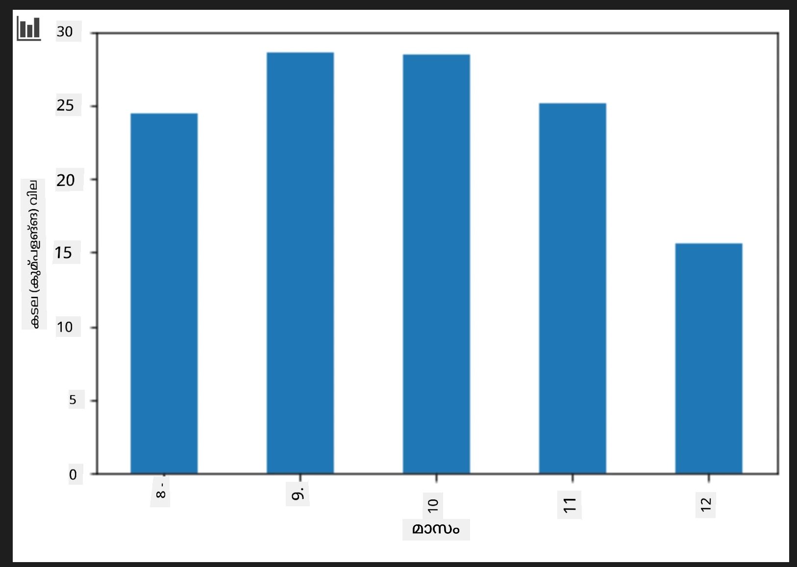
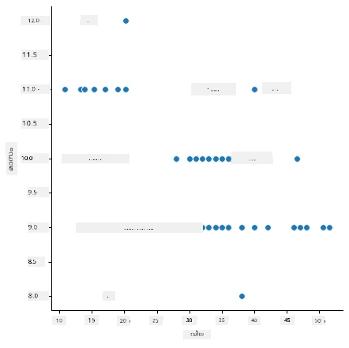
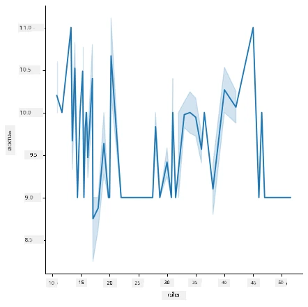
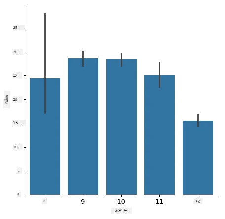
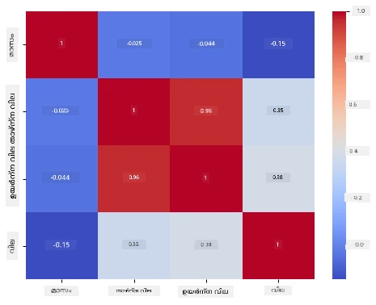

# Scikit-learn ഉപയോഗിച്ച് ഒരു റെഗ്രഷൻ മോഡൽ നിർമ്മിക്കുക: ഡേറ്റா തയ്യാറാക്കുക, ദൃശ്യീകരിക്കുക


ഇൻഫോഗ്രാഫിക് തയ്യാറാക്കിയത് [ദസനി മഡിപല്ലി](https://twitter.com/dasani_decoded)

## [പൂർവ-ലക്ഷ്യപ്പെട്ട quizz](https://ff-quizzes.netlify.app/en/ml/)

> ### [ഈ പാഠം R-ലും ലഭ്യമാണ്!](../../../../2-Regression/2-Data/solution/R/lesson_2.html)

## പരിചയം

Scikit-learn ഉപയോഗിച്ച് മെഷീൻ ലേണിംഗ് മോഡൽ നിർമ്മാണം ആരംഭിക്കാനായി ആവശ്യമായ ടൂളുകൾ നിങ്ങൾക്ക് സജ്ജമാണെങ്കിൽ, നിങ്ങളുടെ ഡേറ്റയിൽ നിന്നുള്ള ചോദ്യങ്ങൾ ചോദിക്കാൻ നിങ്ങൾ തയ്യാറാണ്. ഡേറ്റ ഉപയോഗിച്ച് പാലിച്ചു ML പരിഹാരങ്ങൾ പ്രയോഗിക്കുമ്പോൾ, നിങ്ങളുടെ ഡാറ്റാസെറ്റിന്റെ സാദ്ധ്യതകൾ ശരിയായി തുറക്കാൻ എങ്ങനെ ശരിയായ ചോദ്യമോ ചോദിക്കാമെന്ന് മനസ്സിലാക്കുന്നത് വളരെ പ്രധാനമാണ്.

ഈ പാഠത്തിൽ, നിങ്ങൾ പഠിക്കാൻ പോകുന്നത്:

- മോഡൽ നിർമാണത്തിന് നിങ്ങളുടെ ഡേറ്റാ തയ്യാറാക്കുന്നത് എങ്ങനെ.
- Matplotlib ഡേറ്റാ ദൃശ്യീകരണത്തിന് എങ്ങനെയാണ് ഉപയോഗിക്കുന്നത്.
- കൂടുതൽ പ്രകടകതയുള്ള ഡേറ്റാ ദൃശ്യീകരണത്തിന് Seaborn ഉപയോഗിക്കുന്നത് എങ്ങനെയാണ്.

## നിങ്ങളുടെ ഡാറ്റയിൽ ശരിയായ ചോദ്യമൊ ചോദിക്കുക

നിങ്ങൾക്കാവശ്യമായ ഉത്തരം ഏപ്രകാരമാണ് എന്ന് തീരുമാനിക്കുന്നത് നിങ്ങൾ ഉപയോഗിക്കുന്ന ML ആൽഗോരിതങ്ങൾ തിരഞ്ഞെടുക്കാനും സഹായിക്കും. നിങ്ങൾക്ക് ലഭിക്കുന്ന ഉത്തരം ആശ്രയിക്കുന്നത് നിങ്ങളുടെ ഡേറ്റയുടെ സ്വഭാവത്തെ ഏറെ ആശ്രയിച്ചിരിക്കും.

ഈ പാഠത്തിനായി നൽകിയിരിക്കുന്ന [ഡേറ്റ](https://github.com/microsoft/ML-For-Beginners/blob/main/2-Regression/data/US-pumpkins.csv) നോക്കൂ. നിങ്ങളുടെ VS കോഡിൽ ഈ .csv ഫയൽ തുറക്കാം. ഒരു ചെറിയ സ്‌കിം മുറിച്ചപ്പോൾ അപ്രത്യക്ഷമായ സ്ഥലങ്ങളും അതോടൊപ്പം സ്ട്രിങ്, അക്കങ്ങൾ മിക്സായി ഉള്ളതും കാണാം. 'Package' എന്ന് പേരുള്ള ഒരു വിചിത്രമായ കൾമുണ്ട്, ഇവിടെ ഡേറ്റ 'sacks', 'bins' തുടങ്ങിയ പല മൂല്യങ്ങളും ചേർന്നിരിക്കുന്നു. ഡേറ്റ യഥാർത്ഥത്തിൽ അല്പം സന്ധ്യത്രമാണ്.

[](https://youtu.be/5qGjczWTrDQ "ML for beginners - How to Analyze and Clean a Dataset")

> 🎥 ഈ പാഠത്തിനായി ഡേറ്റ തയ്യാറാക്കുന്നതിലെ ചുരുക്കം വീഡിയോയ്ക്കായി മുകളിലെ ചിത്രം ക്ലിക്ക് ചെയ്യുക.

യഥാർഥത്തിൽ, പരിപൂർണമായും ഉപയോഗിക്കാൻ സജ്ജമായ ഡേറ്റാസെറ്റ് ലഭിക്കുന്നത് സാധാരണയല്ല. ഈ പാഠത്തിൽ, സ്റ്റാൻഡേർ Python ലൈബ്രറികൾ ഉപയോഗിച്ച് ഒരു അരുതായ ഡേറ്റാസെറ്റ് എങ്ങനെയാണ് തയ്യാറാക്കുന്നത് എന്ന് നിങ്ങൾ പഠിക്കും. കൂടാതെ ഡേറ്റ ദൃശ്യീകരിക്കാൻ വിവിധ സാങ്കേതിക വിദ്യകളും പഠിക്കും.

## കേസ്സ് സ്റ്റഡി: 'പംപ്കിൻ മാർക്കറ്റ്'

ഈ ഫോൾഡറിൽ നിങ്ങൾക്ക് റൂട്ട് `data` ഫോൾഡറിൽ [US-pumpkins.csv](https://github.com/microsoft/ML-For-Beginners/blob/main/2-Regression/data/US-pumpkins.csv) എന്ന ഫയൽ കാണാം, ഇതിൽ 1757 വരികളുള്ള പംപ്കിൻ മാർക്കറ്റ് വിവരങ്ങൾ നഗര അനുസൃതമായി ഗ്രൂപ്പ് ചെയ്തു നൽകിയിട്ടുണ്ട്. ഇത് യുണൈറ്റഡ് സ്റ്റേറ്റ്സ് ഡിപ്പാർട്ട്മെന്റ് ഓഫ് അഗ്രിക്കൾച്ചർ വഴി വിതരണം ചെയ്യുന്ന [Specialty Crops Terminal Markets Standard Reports](https://www.marketnews.usda.gov/mnp/fv-report-config-step1?type=termPrice) നിന്ന് എടുത്ത അടിസ്ഥാനം ഡേറ്റയാണ്.

### ഡേറ്റാ തയ്യാറാക്കൽ

ഈ ഡേറ്റ പബ്ലിക് ഡൊമെയ്‌നിലാണ്. USDA വെബ്‌സൈറ്റിൽ പല നഗരങ്ങളുടെയും വേർതിരിച്ച ഫയലുകളിൽ ഇതെല്ലാം ഡൗൺലോഡ് ചെയ്യാം. വളരെ പല ഫയലുകൾ ഒഴിവാക്കാൻ എല്ലാ നഗര ഡേറ്റയും ഒരു സ്പ്രെഡ്ഷീറ്റിൽ ക്ലിപ്പിച്ച്‌ ഞങ്ങൾ വലിയ രീതിയിൽ ഒരു പരിധി വരെ ഡേറ്റ സംഭരിച്ചു മാറ്റം കാണിക്കുന്നു. ഇനി ഡേറ്റ കൂടാതെ ശ്രദ്ധിക്കാം.

### പംപ്കിൻ ഡേറ്റ - പ്രാഥമിക നിഗമനങ്ങൾ

ഈ ഡേറ്റയ്ക്ക് നിങ്ങൾ എന്ത് ശ്രദ്ധിച്ചേ ആണെന്നാക്കാം? നിങ്ങൾ ഇതിനകം സ്ട്രിങ്ങുകൾ, അക്കങ്ങൾ, ഒഴിവുകൾ, വിചിത്ര മൂല്യങ്ങൾ എന്നിവ അടങ്ങിയ മിശ്രിതം കാണിച്ചിട്ടുണ്ട്.

ഈ ഡേറ്റ ഉപയോഗിച്ച് ഒരു റെഗ്രഷൻ സാങ്കേതിക വിദ്യ ഉപയോഗിച്ച് നിങ്ങൾ എന്ത് ചോദിക്കാം? "നിർദ്ദിഷ്ട മാസത്തെ പംപ്കിന്റെ വില പ്രവചിക്കുക" എന്നൊന്നാണ്. ഡേറ്റ വീണ്ടും നോക്കുമ്പോൾ ഈ ടാസ്ക്കിനുള്ള ഡേറ്റ ഘടന ഒരുക്കുന്നതിന് ചില മാറ്റങ്ങൾ വേണം.
## അഭ്യാസം - പംപ്കിൻ ഡേറ്റ വിശകലനം ചെയ്യുക

ഡേറ്റ ആകൃതീകരിക്കുന്നതിനും വിശകലനത്തിനും വളരെയധികം ഉപകരിക്കുന്ന [Pandas](https://pandas.pydata.org/) (പൈതൺ ഡേറ്റ അനാലിസിസ്) ഉപകരണം ഉപയോഗിക്കാം.

### ആദ്യം,欠തിയുള്ള തീയതികൾ കണ്ടെത്തുക

ആദ്യം നിങ്ങൾ欠തിയുള്ള തീയതികൾ ഉണ്ടോ എന്ന് പരിശോധിക്കണം:

1. തീയതികളെ മാസം ഫോർമാറ്റിലേക്ക് പരിവർത്തനം ചെയ്യുക (ഇവ യു.എസ് തീയതികളാണ്, ഫോർമാറ്റ് `MM/DD/YYYY` ആണ്).
2. മാസം പുതുതായി ഒരു കൾമാക്കി വേർതിരിക്കുക.

_notebook.ipynb_ ഫയൽ വിസ്വൽ സ്റ്റുഡിയോ കോഡിൽ തുറന്ന്, സ്പ്രെഡ്ഷീറ്റ് പുതിയ Pandas ഡാറ്റാഫ്രെയിമിലേക്ക് ഇമ്പോർട്ട് ചെയ്യുക.

1. ആദ്യ അഞ്ച് നിരകൾ കാണാൻ `head()` ഫംഗ്ഷൻ ഉപയോഗിക്കുക.

    ```python
    import pandas as pd
    pumpkins = pd.read_csv('../data/US-pumpkins.csv')
    pumpkins.head()
    ```

    ✅ അവസാന അഞ്ച് നിരകൾ കാണാൻ ഏതൊരു ഫംഗ്ഷൻ ഉപയോഗിക്കും?

1. നിലവിലെ ഡാറ്റാഫ്രെയിമിൽ欠തിയുള്ള ഡേറ്റ ഉണ്ടോ എന്ന് പരിശോധിക്കുക:

    ```python
    pumpkins.isnull().sum()
    ```

   欠തിയുള്ള ഡേറ്റ ഉണ്ടെങ്കിലും, കഴിഞ്ഞ ടാസ്ക്കിന് അതിന് പ്രശ്നമാകില്ല.

1. ഡാറ്റാഫ്രെയിമിലേക്ക് സംവിധാനമാണ് ചെയ്യാൻ നിങ്ങൾക്ക് ആവശ്യമായ കൾമുകൾ മാത്രം തിരഞ്ഞെടുക്കുക. `loc` ഫംഗ്ഷൻ ഉപയോഗിച്ച് അതിനെ് സൃഷ്ടിച്ചത്, ആദ്യം പാസ്സ് ചെയ്യുന്നത് നിരയും രണ്ടാം പാരാമീറ്ററായി കൾമുകളുമാണ്. താഴെ ഡാറ്റാഫ്രെയിമിൽ ഉപയോഗിച്ച `:` എല്ലാ നിരകളെയും സൂചിപ്പിക്കുന്നു.

    ```python
    columns_to_select = ['Package', 'Low Price', 'High Price', 'Date']
    pumpkins = pumpkins.loc[:, columns_to_select]
    ```

### രണ്ടാമത്, പംപ്കിന്റെ ശരാശരി വില വിലയിരുത്തുക

ഒരു പ്രത്യേക മാസത്തിലെ പംപ്കിന്റെ ശരാശരി വില എങ്ങനെ കണ്ടെത്താമെന്ന് ആലോചിക്കുക. ഈ ടാസ്ക്കിന് നിങ്ങൾക്ക് ഏതു കൾമുകൾ തിരഞ്ഞെടുക്കണം? സൂചന: 3 കൾമുകൾ ആവശ്യമുണ്ട്.

പരിഹാരം: `Low Price` ഒപ്പം `High Price` കൾമുകളുടെ ശരാശരികൾ എടുത്ത് പുതിയ 'Price' കോളത്തിൽ പൂരിപ്പിക്കുക, കൂടാതെ 'Date' കൾം മാസത്തെ മാത്രം കാണിക്കുക. പുറത്തു നോക്കിയപ്പോൾ欠തിയുള്ള ഡേറ്റ ഇല്ലാതിരുന്നുവെന്ന് കാണാം, അതുകൊണ്ട് റോഡ്മാപ്പ് സജ്ജമാണെന്ന്.

1. ശരാശരി കണക്കാക്കാൻ താഴെക്കൊടുത്തിരിക്കുന്ന കോഡ് ചേർക്കുക:

    ```python
    price = (pumpkins['Low Price'] + pumpkins['High Price']) / 2

    month = pd.DatetimeIndex(pumpkins['Date']).month

    ```

   ✅ `print(month)` ഉപയോഗിച്ച് നിങ്ങൾ പരിശോധിക്കാൻ ആഗ്രഹിക്കുന്ന ഡേറ്റയും മടപനും ചെയ്യാൻ സ്വതന്ത്രനാകൂ.

2. ഇപ്പോൾ, മാറ്റിയ ഡേറ്റ പുതിയ Pandas ഡാറ്റാഫ്രെയിമിലേക്ക് പകർത്തുക:

    ```python
    new_pumpkins = pd.DataFrame({'Month': month, 'Package': pumpkins['Package'], 'Low Price': pumpkins['Low Price'],'High Price': pumpkins['High Price'], 'Price': price})
    ```

    നിങ്ങളുടെ ഡാറ്റാഫ്രെയിം പ്രിന്റ് ചെയ്താൽ നിങ്ങള്ക്ക് പുത്തൻ, ശുദ്ധമായ ഡേറ്റാസെറ്റ് കാണിക്കപ്പെടും, ഈ ഡേറ്റ ഉപയോഗിച്ച് നിങ്ങൾറെ പുതിയ റെഗ്രഷൻ മോഡൽ നിർമ്മിക്കാം.

### എന്നാൽ കാത്തിരി! ഇവിടെ എന്തോ അസാധാരണമുണ്ട്

`Package` കൾമനിൽ നോക്കിയാൽ, പംപ്കിനുകൾ പല വ്യത്യസ്ത ആകൃതികളിൽ വിൽക്കുന്നുണ്ട. ചിലത് '1 1/9 bushel' അളവിൽ, ചിലത് '1/2 bushel', ചിലത് പംപ്കിൻപ്രതി, ചിലത് പൗണ്ടിന് പ്രതിയും, കൂടാതെ വലിയ varying വീതിയായ ബോക്സുകളിലും.

> പംപ്കിനുകൾ സ്ഥിരതയോടെ ഭാരിക്കുക വളരെക്കുള്ളതാണെന്നു തോന്നുന്നു

ആരംഭ ഡേറ്റയിൽ 'Unit of Sale' 'EACH' അല്ലെങ്കിൽ 'PER BIN' ആണ് എന്നാൽ, ഇവക്ക് 'Package' തരം അനുസരിച്ച് ഇഞ്ച്, ബിൻ, അല്ലെങ്കിൽ 'each' ആണ്. പംപ്കിനുകൾ സ്ഥിരമായി ഭാരിക്കുംപോൾ ബുദ്ധിമുട്ടുള്ളതാണ്, അതുകൊണ്ട് 'bushel' എന്ന പദം ഉള്ള പംപ്കിനുകൾ മാത്രം തിരഞ്ഞെടുക്കി ഫിൽട്ടർ ചെയ്യാം.

1. ഫയലിന്റെ മുകളിൽ .csv ഇമ്പോർട്ടിന്റെ കീഴിൽ ഫിൽട്ടർ ചേർക്കുക:

    ```python
    pumpkins = pumpkins[pumpkins['Package'].str.contains('bushel', case=True, regex=True)]
    ```

    ഇപ്പോൾ ഡാറ്റ പ്രിന്റ് ചെയ്യുമ്പോൾ, മോട്ടൊപ്പം മുട്ടി bushel പംപ്കിനുകൾ ഉൾമുള്ള ഏകദേശം 415 വരികളുള്ള ഡേറ്റ മാത്രം നിങ്ങൾക്ക് കിട്ടും.

### എന്നാൽ കാത്തിരി! മറ്റൊരു കാര്യം ചെയ്യണം

ബുഷേലുകളുടെ അളവ് നിരകൾക്ക് വ്യത്യസ്തമാണ്. നിങ്ങൾ വിലകൾ bushel അടിസ്ഥാനത്തിൽ സാധാരണമാക്കി കാണിച്ചിരിക്കണം, അതിനായി കുറച്ച് ഗണിതം ചെയ്യണം.

1. പുതിയ 'new_pumpkins' ഡാറ്റാഫ്രെയിം സൃഷ്ടിക്കുന്ന ബ്ലോക്ക് കഴിഞ്ഞ് താഴെ വരികൾ ചേർക്കുക:

    ```python
    new_pumpkins.loc[new_pumpkins['Package'].str.contains('1 1/9'), 'Price'] = price/(1 + 1/9)

    new_pumpkins.loc[new_pumpkins['Package'].str.contains('1/2'), 'Price'] = price/(1/2)
    ```

✅ [The Spruce Eats](https://www.thespruceeats.com/how-much-is-a-bushel-1389308) അനുസരിച്ച്, ബഷെല്ലിന് ഭാരം ഉത്പന്നത്തിന്റെ തരം അനുസരിച്ച് വ്യത്യസ്തമാണ്, കാരണം ഇത് വോളിയം അളവാണ്. "ഉദാഹരണത്തിന്, ടൊമാറ്റോകളുടെ ഒരു ബഷെൽ ഭാരം 56 പൗണ്ടുകൾ ആണ്... ഇല, പച്ചക്കറികൾ കൂടുതൽ സ്ഥലം പറക്കുന്നുണ്ടെങ്കിലും ഭാരം കുറവാണ്, അതിനാൽ സ്പിനാച്ചിന്റെ ബഷെർ വെറും 20 പൗണ്ടുകൾ മാത്രമാണ്." ഇത് എല്ലാം ബുദ്ധിമുട്ടുള്ള വിഷയമാണ്! ബഷെൽ-പൗണ്ട് പരിവർത്തനം ഒഴിവാക്കി, ബഷെൽ അടിസ്ഥാനത്തിൽ വില കണക്കാക്കാം. ഈ ബഷലുകൾ പഠനത്തിൽ നിന്ന് കാണേണ്ടത് ഡേറ്റയുടെ സ്വഭാവം മനസ്സിലാക്കുന്നതിന് എത്ര പ്രധാനമാണെന്നും വ്യക്തമാക്കുന്നു!

ഇപ്പോൾ, അവർക്ക് ബഷെൽ അളവിന്റെ അടിസ്ഥാനത്തിൽ യൂണിറ്റ് വില വിശകലനം ചെയ്യാം. ഒരു മുറി കൂടി ഡേറ്റ പ്രിന്റ് ചെയ്താൽ എങ്ങനെ സാധാരണമാക്കിയിട്ടുള്ളതുവെന്ന് കാണാം.

✅ ബഷൽ-അർദ്ധം വിൽക്കുന്ന പംപ്കിനുകൾ വളരെ വില贵മായവ ആണെന്ന് ശ്രദ്ധിച്ചോ? എന്തുകൊണ്ട് എന്ന് മനസ്സിലാക്കാമോ? സൂചന: ചെറിയ പംപ്കിനുകൾ വലിയവയെക്കാളും വളരെ ഉയർന്ന വിലക്കൂടിയവ ആണ്, കാരണം ഒരറ്റുപാട് കൂട്ടം ഉള്ള വലിയ hollow പൈ പംപ്കിനിൽ വീതം ഉപയോഗിക്കാതിരിക്കുന്ന അവിടം കാരണം അഞ്ചിന്.

## ദൃശ്യീകരണ തന്ത്രങ്ങൾ

ഡേറ്റ സയന്റിസ്റ്റിന്റെ പങ്കിൽ പ്രധാനമാണ് അവർ പ്രവർത്തിക്കുന്ന ഡേറ്റയുടെ ഗുണമേന്മയും സ്വഭാവവും തെളിയിക്കുകയാണ്. ഇതിന് അവർ സാധാരണയായി രസകരമായ ദൃശ്യങ്ങൾ, പ്ലോട്ടുകൾ, ഗ്രാഫുകൾ, ചാർട്ടുകൾ സൃഷ്ടിക്കുന്നു, ഡേറ്റയുടെ വ്യത്യസ്ത അംശങ്ങൾ കാണിക്കുന്നതോടെ. ഇതുവഴി, അപൂർവ്വമായി കണ്ടെത്താൻ പ്രയാസമായ ബന്ധങ്ങളും ദോഷങ്ങളും ദൃശ്യമായി കാണാമാകും.

[](https://youtu.be/SbUkxH6IJo0 "ML for beginners - How to Visualize Data with Matplotlib")

> 🎥 ഈ പാഠത്തിനായി ഡേറ്റ ദൃശ്യീകരണത്തിന് ദൃശ്യമായി സ്വയം പഠിക്കാൻ മുകളിലെ ചിത്രം ക്ലിക്ക് ചെയ്യുക.

ദൃശ്യീകരണങ്ങൾ ഡേറ്റയ്ക്ക് ഏറ്റവും അനുയോജ്യമായ മെഷീൻ ലേണിംഗ് സാങ്കേതിക വിദ്യ കണ്ടുപിടിക്കാനും സഹായിക്കുന്നു. ഒരു സ്‌കാറ്റർപ്ലോട്ട് ഒരു രേഖ അനുസരിക്കുന്നതായി തോന്നുന്നുവെങ്കിൽ, അത് ഒരു ലിനിയർ റെഗ്രഷൻ അവസാനിച്ചാൽ നല്ല മതിയായ സാധ്യതയ 있다는 സൂചനയാണ്.

Jupyter നോട്ട്‌ബുക്കുകളിൽ നന്നായി പ്രവർത്തിക്കുന്ന ഒരു ഡേറ്റാ ദൃശ്യീകരണ ലൈബ്രറി [Matplotlib](https://matplotlib.org/) ആണ് (മുന്‍ പാഠത്തില്‍ കാണിച്ചതുപോലെ).

> [ഈ ട്യൂട്ടോറിയലുകൾ](https://docs.microsoft.com/learn/modules/explore-analyze-data-with-python?WT.mc_id=academic-77952-leestott) ഞെക്കുക ഡേറ്റാ ദൃശ്യീകരണത്തിൽ കൂടുതൽ പരിചയം നേടാൻ.

## അഭ്യാസം - Matplotlib പരീക്ഷിക്കുക

പുതിയ ഡാറ്റാഫ്രെയിം പൂർത്തിയായി അത് ദൃശ്യരൂപത്തിലാക്കാൻ അടിസ്ഥാന പ്ലോട്ടുകൾ സൃഷ്ടിക്കാൻ ശ്രമിക്കുക. ഒരു അടിസ്ഥാന ലൈന്പ്ലോട്ട് എന്താണു കാണിക്കുക?

1. ഫയലിന്റെ മുകളിൽ, Pandas ഇമ്പോർട്ടിന് കീഴിൽ Matplotlib ഇമ്പോർട്ട് ചെയ്യുക:

    ```python
    import matplotlib.pyplot as plt
    ```

1. നോട്ട്‌ബുക്ക് പുനഃസംവര്ത്തിച്ച് പുതുക്കുക.
1. നോട്ട്‌ബുക്കിന്റെ താഴിലാണ് ഡാറ്റ ബോക്സ് രൂപത്തിൽ പ്ലോട്ട് ചെയ്യാൻ ഒരു സെൽ ചേർക്കുക:

    ```python
    price = new_pumpkins.Price
    month = new_pumpkins.Month
    plt.scatter(price, month)
    plt.show()
    ```

    

    ഇത് ഒരു ഉപയോഗപ്രദമായ പ്ലോട്ട് ആണോ? ഇതിൽ നിങ്ങൾക്ക് എന്തെങ്കിലും വിചിത്രമുണ്ടോ?

    ഇത് പ്രത്യേകിച്ച് ഉപകാരപ്രദം അല്ല, കാരണം ഇത് ഓരോ മാസത്തിലും നിങ്ങളുടെ ഡേറ്റ പോയിന്റുകളുടെ വ്യാപ്തി മാത്രമാണ് കാണിക്കുന്നത്.

### പ്രധാനമാക്കുക

ചാർട്ടുകൾ ഉപകാരപ്രദമാക്കാൻ ഡേറ്റ ഗ്രൂപ്പുചെയ്യണം. y അക്സിസിൽ മാസം കാണിക്കുന്ന പ്ലോട്ടിൽ ഡേറ്റയുടെ വിതരണവും തെളിയിക്കുന്ന പ്ലോട്ട് സൃഷ്ടിക്കാൻ ശ്രമിക്കാം.

1. ഗ്രൂപ്പുചെയ്ത ബാർ ചാർട്ട് സൃഷ്ടിക്കാനുള്ള സെൽ ചേർക്കുക:

    ```python
    new_pumpkins.groupby(['Month'])['Price'].mean().plot(kind='bar')
    plt.ylabel("Pumpkin Price")
    ```

    

    ഇത് കൂടുതൽ ഉപകാരപ്രദമായ ഒരു ഡേറ്റാ ദൃശ്യീകരണമാണ്! ഇത് പംപ്കിനുകളുടെ ഏറ്റവും ഉയർന്ന വില സെപ്റ്റംബർ, ഒക്‌ടോബർ മാസങ്ങളിൽ ആയിരിക്കുമെന്ന് സൂചിപ്പിക്കുന്നു. ഇത് നിങ്ങൾ പ്രതീക്ഷിച്ചതേ? എന്തുകൊണ്ട് അല്ലെങ്കിൽ എന്തുകൊണ്ട് അല്ല?

## അഭ്യാസം - Seaborn പരീക്ഷിക്കുക

Matplotlib ശക്തമാണ്, എന്നാൽ ഒരു പരിപാവന ചാർട്ട് സൃഷ്ടിക്കാൻ സന്ദേഭവം കൂടുതൽ കോഡ് ആവശ്യമായിരിക്കും. [Seaborn](https://seaborn.pydata.org/) Matplotlibയുടെ മുകളിൽ നിർമ്മിച്ചതാണ്, ഇത് സാമ്പത്തിക ഡേറ്റാ ദൃശ്യീകരണത്തിനായി രൂപകൽപ്പന ചെയ്തതാണ്. ഇത് Pandas ഡാറ്റാഫ്രെയിമുകളുമായി നേരിട്ട് പ്രവർത്തിക്കാനും, ആകർഷകമായ നിർദ്ദേശശൈലികൾ പ്രയോഗിക്കാനും, കുറച്ചുകൂടി കോഡിൽ മനോഹരമായ പ്ലോട്ടുകൾ സൃഷ്ടിക്കാനും അനുവദിക്കുന്നു. Seaborn Matplotlib ആബ്രജക്റ്റുകൾ തിരികെ നൽകുന്നതുകൊണ്ട്, Matplotlib വേണ്ടി നിങ്ങൾക്ക് അറിയുന്ന ഏതു കാര്യവുമെല്ലാം കൃത്യമായി fine-tune ചെയ്യാൻ കഴിയും.

> നിങ്ങൾക്ക് Seaborn ഇൻസ്റ്റാൾ ചെയ്തിട്ടില്ലെങ്കിൽ, `pip install seaborn` ഉപയോഗിച്ച് ഇൻസ്റ്റാൾ ചെയ്യുക.

1. നോട്ട്‌ബുക്കിന്റെ മുകളിൽ, മറ്റ് ഇമ്പോർട്ടുകൾക്കു കീഴിൽ Seaborn ഇമ്പോർട്ട് ചെയ്യുക. സാധാരണ ഇത് `sns` എന്ന് ഇറക്കുമതി ചെയ്യപ്പെടുന്നു:

    ```python
    import seaborn as sns
    ```

### ബന്ധങ്ങൾ കാണിക്കാൻ സ്‌കാറ്റർ പ്ലോട്ടുകൾ

ഒരു മോഡൽ നിർമ്മിക്കാനുള്ള മുമ്പിൽ ഡേറ്റ പര്യവേക്ഷണം ചെയ്യുമ്പോൾ, വേരിയബിളുകൾ തമ്മിലുള്ള _ബന്ധങ്ങൾ_ പരിശോധിക്കുന്നത് പ്രധാനമാണ്. [സ്കാറ്റർ പ്ലോട്ട്](https://en.wikipedia.org/wiki/Scatter_plot) ഇതിന് ഏറ്റവും നല്ല ഉപകരണങ്ങളിലൊന്നാണ്: പോയിന്റുകൾ ഒരു രേഖ പിന്തുടരുന്നതായി തോന്നിയാൽ, രണ്ട് വേരിയബിളുകൾ തമ്മിൽ ബന്ധമുണ്ടെന്ന് സൂചിപ്പിക്കുന്നതാണ്. ഇത് ലിനിയർ റെഗ്രഷൻ മോഡൽ പ്രവർത്തിക്കാനുള്ള നല്ല അടയാളമായാകാം.

1. മുമ്പ് സൃഷ്ടിച്ച വില-മാസം സ്‌കാറ്റർ പ്ലോട്ടിനെ Seaborn-ന്റെ [`relplot()`](https://seaborn.pydata.org/generated/seaborn.relplot.html) (ബന്ധപ്പെട്ട പ്ലോട്ട്) ഉപയോഗിച്ച് പുനഃസൃഷ്ടിക്കുക, ഇത് നേരിട്ട് നിങ്ങളുടെ ഡാറ്റാഫ്രെയിം കൾമുകൾ ഉപയോഗിക്കുന്നു:

    ```python
    sns.relplot(x="Price", y="Month", data=new_pumpkins)
    ```

    

    ഇവിടെ നിങ്ങൾ ഡാറ്റാഫ്രെയിം, കോളം നാമങ്ങൾ പാസ്സ് ചെയ്യുന്നതായി കാണാം, Seaborn താൻ ആക്‌സിസ് ലൈബിൾ സ്വയം കൈകാര്യം ചെയ്യുന്നു.

2. `kind="line"` പാസ്സ് ചെയ്ത് നിങ്ങൾ ലൈൻ പ്ലോട്ടിലേക്കു കടക്കാം. Seaborn ലൈൻ ചുറ്റും ആത്മവിശ്വാസ ഇന്റർവൽ കാണിക്കുന്ന ഒരു ശെയ്ഡഡ് ബാൻഡ് വരയ്ക്കും:

    ```python
    sns.relplot(x="Price", y="Month", kind="line", data=new_pumpkins)
    ```

    

    ഈ ഡേറ്റ ഏറെ ശബ്‌ദമുള്ളതാണ്, അതിനാൽ ലൈൻ പ്ലോട്ട് ഏറ്റവും വ്യക്തമായി തിരഞ്ഞെടുക്കാനാകാത്തതു പോലെയാണ് — എന്നാൽ Seaborn-ൽ എളുപ്പത്തിൽ ചാർട്ട് തരം മാറുന്നുവെന്നു കാണിക്കുന്നു.

### വിതരണങ്ങൾ കാണിക്കാൻ ബാർ ചാർട്ടുകൾ


മുമ്പ് നിങ്ങൾ Matplotlib ഉപയോഗിച്ച് ഒരു ബാർ ചാർട്ടുകൾ സൃഷ്‌ടിക്കാൻ ഡാറ്റയെ കൈയോടെ ഗ്രൂപ്പുചെയ്‌തു. Seaborn ന്റെ [`catplot()`](https://seaborn.pydata.org/generated/seaborn.catplot.html) (വർഗ്ഗീകരിച്ച പ്ലോട്ട്) നിങ്ങൾക്കായി ഗ്രൂപ്പിംഗ്, ആഗ്രെഗേഷൻ ചെയ്യാൻ കഴിയും. ഡിഫോൾട്ട് ആയി `kind="bar"` ഓരോ വർഗ്ഗത്തിന്റെയും ശരാശരി കാണിക്കുന്നു കൂടാതെ വിശ്വാസ интерവലിനെ സൂചിപ്പിക്കുന്ന കറുത്ത രേഖയിലുണ്ട്.

1. മാസത്തിൽ ശരാശരി വിലയുടെ ബാർ ചാർട്ട് സൃഷ്‌ടിക്കുക:

    ```python
    sns.catplot(x="Month", y="Price", data=new_pumpkins, kind="bar")
    ```

    

    ഇത് Matplotlib-ൽ നിങ്ങൾ കണ്ടതിനെ സ്ഥിരീകരിക്കുന്നു — വില സെപ്റ്റംബർ, ഒക്ടോബർ ഗണ്യമായി ഉയരുന്നു — പക്ഷേ Seaborn മാസങ്ങളിലെ വില എത്രത്തോളം _മാറ്റപ്പെടുന്നുണ്ടെന്ന്_ ദൃശ്യവൽക്കരിക്കുന്നു.

### സഹബന്ധങ്ങള്‍ കാണിക്കാന്‍ ഹീറ്റ്മാപ്പുകള്‍

സ്കാറ്റർ പ്ലോട്ടുകൾ ഒരുമിച്ച് രണ്ട് വ്യതിരിക്ത വേരിയബിൾസ് താരതമ്യം ചെയ്യുന്നു. ചില സംഖ്യാനുപാത കോളങ്ങളുള്ളപ്പോൾ, [ഹീറ്റ്മാപ്പ്](https://en.wikipedia.org/wiki/Heat_map) ഓരോ കോളം ജോഡിയുടെയും ബന്ധത്തിന്റെ ശക്തി ഒരുമിച്ച് കാണാൻ സഹായിക്കുന്നു. മോഡലിൽ എന്തൊക്കെ ഫീച്ചറുകൾ നൽകണമെന്ന് തീരുമാനിക്കുന്നതിന് മുമ്പ് ഇത് സാധാരണ ഉപയോഗിക്കുന്ന മാർഗമാണ് (ക്ലാസ്​​​ഫിക്കേഷനിൽ കൺഫ്യൂഷൻ മാട്രിസുകൾ കാണിക്കുന്നതിനും ഇതുപോലെ ഒരു ചാർട്ട് ഉപയോഗിക്കുന്നു).

1. Pandas ഉപയോഗിച്ച് സഹബന്ധ മാട്രിക്സ് നിർമ്മിക്കുക, ശേഷം Seaborn ന്റെ [`heatmap()`](https://seaborn.pydata.org/generated/seaborn.heatmap.html) ഉപയോഗിച്ച് ഇത് വരയ്ക്കുക. `annot=True` ഓപ്‌ഷൻ ഓരോ സെല്ലിലും സഹബന്ധ മൂല്യങ്ങൾ അച്ചടിക്കാനുള്ളതാണ്:

    ```python
    correlations = new_pumpkins[['Month', 'Low Price', 'High Price', 'Price']].corr()
    sns.heatmap(correlations, annot=True, cmap="coolwarm")
    ```

    

    `1` (അഥവാ `-1`) സമീപമുള്ള മൂല്യങ്ങൾ കോളങ്ങൾ ശക്തമായി _രേഖാകൃതമായി_ ബന്ധപ്പെട്ടിരിക്കുന്നതിനെ സൂചിപ്പിക്കുന്നു. `Low Price`നും `High Price`നും ഏകദേശം പൂർണ്ണമായർത്ഥത്തിൽ ബന്ധപ്പെട്ടിരിക്കുന്നു. പക്ഷേ `Month` വിലയുമായി കുറച്ച് മാത്രമേ രേഖാകൃതമായി ബന്ധപ്പെടുന്നുള്ളൂ — മുകളിലത്തെ ബാർ ചാർട്ടിൽ സെപ്റ്റംബർ ഒക്ടോബറിൽ വ്യക്തമാക്കിയ സീസണൽ പീക്ക് ആയിട്ടും. ഇത് ഒരു പ്രധാന പാഠമാണ്: സഹബന്ധ ഗുണകം _നേരിൻറെ রেখാശൈലി_ ബന്ധങ്ങൾ മാത്രം അളക്കുന്നു, അതിനാൽ സീസണൽ അല്ലെങ്കിൽ മറ്റു അപ്രകാരമായ രേഖാകൃതമല്ലാത്ത രീതി കാണാനാകില്ല. ✅ ഒരേസമയം ഹീറ്റ്മാപ്പും ബാർ ചാർട്ടുപോയിലും കാണുന്നത് എന്തുകൊണ്ട് ഉപകാരപ്രദമാണ് എന്ന് ഭേദിച്ച് പറയുക?

### Matplotlib ആണോ Seaborn ആണോ?

രണ്ട് ലൈബ്രറികളും അറിഞ്ഞിരിക്കേണ്ടതാണ്:

- **Matplotlib** ചാർട്ടിലെ ഓരോ ഘടകത്തിലും സൂക്ഷ്മ നിയന്ത്രണം നൽകുന്നു, കൂടാതെ മറ്റു പല Python പ്ലോട്ടിംഗ് ലൈബ്രറികളുടെ അടിസ്ഥാനമാണ്.
- **Seaborn** സാങ്ക statistik ഗാനികൾക്കായുള്ള ഉയർന്ന നില ഫംഗ്ഷനുകളും ആകർഷകമടഡ് ഡിഫോൾട്ടുകളും നൽകുന്നു, ഡാറ്റാഫ്രെയിമുകളുമായി നേരിട്ട് പ്രവർത്തിക്കുന്നു, ആൻഡ് എക്‌സ്‌പ്ലോറേറ്ററി ഡാറ്റ അനാലിസിസിന് അധികമായി വേഗത്തിൽ ഫലം നൽകുന്നു.

ഒരു സാധാരണ പ്രവൃത്തി രീതിയാണ് ആദ്യം Seaborn ഉപയോഗിച്ച് ഡാറ്റ എളുപ്പത്തിൽ അന്വേഷിക്കുക, പിന്നീട് വിശദീകരണങ്ങൾക്കായി Matplotlib-ലേക്ക് പോകുക.

---

## 🚀ചേതഞ്ച്

Matplotlib, Seaborn എന്നിവ നൽകിയിരിക്കുന്ന വ്യത്യസ്ത ദൃശ്യവൽക്കരണ തരം പരിശോധിക്കുക. റിഗ്രഷൻ പ്രശ്നങ്ങൾക്ക് അനുയോജ്യമായതേത് ഏതാണ്?

## [പോസ്റ്റ്-ലെക്ചർ ക്വിസ്](https://ff-quizzes.netlify.app/en/ml/)

## അവലോകനം & സ്വയം പഠനം

ഡാറ്റ ദൃശ്യമാക്കാനുള്ള പല മാർഗങ്ങൾ പരിശോധിക്കുക. ലഭ്യമായ വിവിധ ലൈബ്രറികളുടെ പട്ടിക തയ്യാറാക്കുക, വേറിട്ട റൺ തരം ചുമതലയ്ക്ക് ഏറ്റവും അനുയോജ്യമാണെന്ന് ശ്രദ്ധിക്കുക, ഉദാഹരണത്തിന് 2D ദൃശ്യവൽക്കരണം എതിര് 3D ദൃശ്യവൽക്കരണം. നിങ്ങൾ എന്തെന്തു കണ്ടെത്തുന്നു?

## അസൈൻമെന്റ്

[ദൃശ്യവൽക്കരണങ്ങൾ അന്വേഷിക്കൽ](assignment.md)

---

<!-- CO-OP TRANSLATOR DISCLAIMER START -->
**അറിയിപ്പ്**:
ഈ രേഖ AI പരിഭാഷാ സേവനം [Co-op Translator](https://github.com/Azure/co-op-translator) ഉപയോഗിച്ച് പരിഭാഷപ്പെടുത്തിയതാണ്. ഞങ്ങൾ കൃത്യതയ്ക്കായി ശ്രമിക്കുന്നുവെങ്കിലും, ഓട്ടോമേറ്റഡ് പരിഭാഷകളിൽ പിഴവുകൾ അല്ലെങ്കിൽ തെറ്റായ വിവരങ്ങൾ ഉണ്ടാകാൻ സാധ്യതയുണ്ട്. അതിന്റെ സ്വാഭാവിക ഭാഷയിലുള്ള അസൽ രേഖയാണ് പ്രാമാണികമായ ഉറവിടമായി പരിഗണിക്കേണ്ടത്. നിർണായകമായ വിവരങ്ങൾക്ക്, പ്രൊഫഷണൽ മനുഷ്യ പരിഭാഷ ശുപാർശ ചെയ്യുന്നു. ഈ പരിഭാഷ ഉപയോഗിച്ച് ഉണ്ടാകുന്ന തെറ്റിദ്ധാരണകൾ അല്ലെങ്കിൽ തെറ്റായ വ്യാഖ്യാനങ്ങൾക്കായി ഞങ്ങൾ ഉത്തരവാദികളല്ല.
<!-- CO-OP TRANSLATOR DISCLAIMER END -->