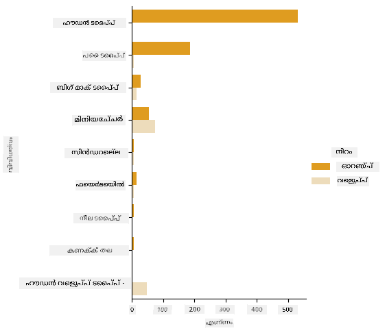

<!--
CO_OP_TRANSLATOR_METADATA:
{
  "original_hash": "abf86d845c84330bce205a46b382ec88",
  "translation_date": "2025-12-19T14:05:02+00:00",
  "source_file": "2-Regression/4-Logistic/README.md",
  "language_code": "ml"
}
-->
# വിഭാഗങ്ങൾ പ്രവചിക്കാൻ ലോജിസ്റ്റിക് റെഗ്രഷൻ


## [പ്രീ-ലെക്ചർ ക്വിസ്](https://ff-quizzes.netlify.app/en/ml/)

> ### [ഈ പാഠം R-ൽ ലഭ്യമാണ്!](../../../../2-Regression/4-Logistic/solution/R/lesson_4.html)

## പരിചയം

റെഗ്രഷൻ എന്ന അടിസ്ഥാന _ക്ലാസിക്_ എംഎൽ സാങ്കേതികവിദ്യകളിൽ അവസാന പാഠമായ ഈ പാഠത്തിൽ, നാം ലോജിസ്റ്റിക് റെഗ്രഷൻ പരിശോധിക്കും. ബൈനറി വിഭാഗങ്ങൾ പ്രവചിക്കാൻ ഈ സാങ്കേതികവിദ്യ ഉപയോഗിക്കും. ഈ കാൻഡി ചോക്ലേറ്റ് ആണോ അല്ലയോ? ഈ രോഗം സംക്രമണശീലമാണോ അല്ലയോ? ഈ ഉപഭോക്താവ് ഈ ഉൽപ്പന്നം തിരഞ്ഞെടുക്കുമോ അല്ലയോ?

ഈ പാഠത്തിൽ നിങ്ങൾ പഠിക്കും:

- ഡാറ്റാ ദൃശ്യവത്കരണത്തിനുള്ള പുതിയ ലൈബ്രറി
- ലോജിസ്റ്റിക് റെഗ്രഷനുള്ള സാങ്കേതികവിദ്യകൾ

✅ ഈ [Learn module](https://docs.microsoft.com/learn/modules/train-evaluate-classification-models?WT.mc_id=academic-77952-leestott) വഴി ഈ തരത്തിലുള്ള റെഗ്രഷനിൽ പ്രവർത്തിക്കുന്നതിന്റെ അറിവ് കൂടുതൽ ആഴത്തിൽ നേടുക

## മുൻപരിചയം

പംപ്കിൻ ഡാറ്റ ഉപയോഗിച്ച് പ്രവർത്തിച്ചതിനാൽ, അതിൽ ഒരു ബൈനറി വിഭാഗം ഉണ്ടെന്ന് നമുക്ക് മനസ്സിലായി: `Color`.

ചില വേരിയബിളുകൾ നൽകിയാൽ, ഒരു പംപ്കിൻ ഏത് നിറത്തിൽ ഉണ്ടാകാൻ സാധ്യതയുള്ളതാണെന്ന് പ്രവചിക്കാൻ ഒരു ലോജിസ്റ്റിക് റെഗ്രഷൻ മോഡൽ നിർമ്മിക്കാം (ഓറഞ്ച് 🎃 അല്ലെങ്കിൽ വെളുപ്പ് 👻).

> റെഗ്രഷൻ പാഠങ്ങളുമായി ബന്ധപ്പെട്ട ഒരു ഗ്രൂപ്പിൽ ബൈനറി ക്ലാസിഫിക്കേഷൻ എന്തുകൊണ്ട് ചർച്ച ചെയ്യുന്നു? ഭാഷാശൈലിയുടെ സൗകര്യത്തിനായി മാത്രമാണ്, കാരണം ലോജിസ്റ്റിക് റെഗ്രഷൻ [വാസ്തവത്തിൽ ഒരു ക്ലാസിഫിക്കേഷൻ രീതി ആണ്](https://scikit-learn.org/stable/modules/linear_model.html#logistic-regression), എന്നാൽ ലീനിയർ അടിസ്ഥാനമാക്കിയുള്ളത്. അടുത്ത പാഠ ഗ്രൂപ്പിൽ ഡാറ്റ ക്ലാസിഫൈ ചെയ്യാനുള്ള മറ്റ് മാർഗങ്ങൾ പഠിക്കാം.

## ചോദ്യ നിർവചനം

നമ്മുടെ ആവശ്യങ്ങൾക്ക്, ഇത് ഒരു ബൈനറിയായി പ്രകടിപ്പിക്കും: 'വെളുപ്പ്' അല്ലെങ്കിൽ 'വെളുപ്പ് അല്ല'. നമ്മുടെ ഡാറ്റാസെറ്റിൽ 'സ്ട്രൈപ്പഡ്' എന്ന ഒരു വിഭാഗവും ഉണ്ട്, പക്ഷേ അതിന്റെ ഉദാഹരണങ്ങൾ കുറവാണ്, അതിനാൽ അത് ഉപയോഗിക്കില്ല. നൾ മൂല്യങ്ങൾ നീക്കം ചെയ്താൽ അത് അപ്രാപ്യമാണ്.

> 🎃 രസകരമായ ഒരു വസ്തുത, വെളുപ്പ് പംപ്കിനുകളെ ചിലപ്പോൾ 'ഗോസ്റ്റ്' പംപ്കിനുകൾ എന്ന് വിളിക്കുന്നു. അവ കട്ടിയുള്ളവയല്ല, അതിനാൽ ഓറഞ്ച് പംപ്കിനുകളെപ്പോലെ ജനപ്രിയമല്ല, പക്ഷേ അവ കൂൾ ആയി കാണപ്പെടുന്നു! അതിനാൽ നാം ചോദ്യത്തെ 'ഗോസ്റ്റ്' അല്ലെങ്കിൽ 'ഗോസ്റ്റ് അല്ല' എന്നായി പുനർനിർവചിക്കാം. 👻

## ലോജിസ്റ്റിക് റെഗ്രഷൻ കുറിച്ച്

ലീനിയർ റെഗ്രഷനിൽ നിന്നുള്ള ലോജിസ്റ്റിക് റെഗ്രഷൻ ചില പ്രധാന വ്യത്യാസങ്ങളുണ്ട്.

[](https://youtu.be/KpeCT6nEpBY "ML for beginners - Understanding Logistic Regression for Machine Learning Classification")

> 🎥 ലോജിസ്റ്റിക് റെഗ്രഷന്റെ ഒരു ചുരുക്ക വീഡിയോ അവലോകനത്തിന് മുകളിൽ ചിത്രത്തിൽ ക്ലിക്ക് ചെയ്യുക.

### ബൈനറി ക്ലാസിഫിക്കേഷൻ

ലോജിസ്റ്റിക് റെഗ്രഷൻ ലീനിയർ റെഗ്രഷനുപോലെ സവിശേഷതകൾ നൽകുന്നില്ല. മുൻപുള്ളത് ബൈനറി വിഭാഗത്തെക്കുറിച്ച് പ്രവചനം നൽകുന്നു ("വെളുപ്പ് അല്ലെങ്കിൽ വെളുപ്പ് അല്ല") എന്നാൽ പിന്നീടുള്ളത് തുടർച്ചയായ മൂല്യങ്ങൾ പ്രവചിക്കാൻ കഴിയും, ഉദാഹരണത്തിന് ഒരു പംപ്കിന്റെ ഉത്ഭവവും വിളവെടുപ്പ് സമയവും നൽകിയാൽ, _അതിന്റ വില എത്ര ഉയരും_ എന്നത്.


> ഇൻഫോഗ്രാഫിക്: [ദാസാനി മടിപള്ളി](https://twitter.com/dasani_decoded)

### മറ്റ് ക്ലാസിഫിക്കേഷനുകൾ

മൾട്ടിനോമിയൽ, ഓർഡിനൽ തുടങ്ങിയ മറ്റ് തരത്തിലുള്ള ലോജിസ്റ്റിക് റെഗ്രഷനുകളും ഉണ്ട്:

- **മൾട്ടിനോമിയൽ**: ഒന്നിലധികം വിഭാഗങ്ങൾ ഉൾക്കൊള്ളുന്നു - "ഓറഞ്ച്, വെളുപ്പ്, സ്ട്രൈപ്പഡ്".
- **ഓർഡിനൽ**: ക്രമീകരിച്ച വിഭാഗങ്ങൾ ഉൾക്കൊള്ളുന്നു, ഉദാഹരണത്തിന് നമ്മുടെ പംപ്കിനുകൾ ചെറിയ, ചെറിയ, മധ്യ, വലിയ, എക്സ്‌എൽ, ഡബ്ല്യു എക്സ്‌എൽ എന്ന ക്രമത്തിൽ ക്രമീകരിച്ചിരിക്കുന്നതുപോലെ.


### വേരിയബിളുകൾ തമ്മിൽ ബന്ധപ്പെടേണ്ടതില്ല

ലീനിയർ റെഗ്രഷൻ കൂടുതൽ ബന്ധമുള്ള വേരിയബിളുകളുമായി നല്ലതായിരുന്നു, എന്നാൽ ലോജിസ്റ്റിക് റെഗ്രഷൻ അതിന്റെ വിരുദ്ധമാണ് - വേരിയബിളുകൾ പൊരുത്തപ്പെടേണ്ടതില്ല. ഈ ഡാറ്റയ്ക്ക് ഇത് അനുയോജ്യമാണ്, കാരണം ഇതിൽ ബന്ധങ്ങൾ കുറവാണ്.

### നിങ്ങൾക്ക് വളരെ ശുദ്ധമായ ഡാറ്റ ആവശ്യമാണ്

ലോജിസ്റ്റിക് റെഗ്രഷൻ കൂടുതൽ ഡാറ്റ ഉപയോഗിച്ചാൽ കൂടുതൽ കൃത്യമായ ഫലങ്ങൾ നൽകും; നമ്മുടെ ചെറിയ ഡാറ്റാസെറ്റ് ഈ ജോലി ചെയ്യാൻ അനുയോജ്യമല്ല, അതിനാൽ ഇത് മനസ്സിലാക്കുക.

[](https://youtu.be/B2X4H9vcXTs "ML for beginners - Data Analysis and Preparation for Logistic Regression")

> 🎥 ലീനിയർ റെഗ്രഷനായി ഡാറ്റ തയ്യാറാക്കലിന്റെ ഒരു ചുരുക്ക വീഡിയോ അവലോകനത്തിന് മുകളിൽ ചിത്രത്തിൽ ക്ലിക്ക് ചെയ്യുക

✅ ലോജിസ്റ്റിക് റെഗ്രഷനുമായി നല്ല അനുയോജ്യമായ ഡാറ്റാ തരം എന്തെല്ലാമാകാമെന്ന് ചിന്തിക്കുക

## അഭ്യാസം - ഡാറ്റ ശുചീകരിക്കുക

ആദ്യം, ഡാറ്റ കുറച്ച് ശുചീകരിക്കുക, നൾ മൂല്യങ്ങൾ ഒഴിവാക്കി ചില കോളങ്ങൾ മാത്രം തിരഞ്ഞെടുക്കുക:

1. താഴെ കൊടുത്ത കോഡ് ചേർക്കുക:

    ```python
  
    columns_to_select = ['City Name','Package','Variety', 'Origin','Item Size', 'Color']
    pumpkins = full_pumpkins.loc[:, columns_to_select]

    pumpkins.dropna(inplace=True)
    ```

    നിങ്ങളുടെ പുതിയ ഡാറ്റാഫ്രെയിം ഒരു നോട്ടം എടുക്കാം:

    ```python
    pumpkins.info
    ```

### ദൃശ്യവത്കരണം - വർഗ്ഗീയ പ്ലോട്ട്

ഇപ്പോൾ നിങ്ങൾ വീണ്ടും [സ്റ്റാർട്ടർ നോട്ട്‌ബുക്ക്](./notebook.ipynb) പംപ്കിൻ ഡാറ്റ ഉപയോഗിച്ച് ലോഡ് ചെയ്ത്, ചില വേരിയബിളുകൾ ഉൾപ്പെടുന്ന ഡാറ്റാസെറ്റ് സംരക്ഷിക്കാൻ ശുചീകരിച്ചു, അതിൽ `Color` ഉൾപ്പെടുന്നു. നമുക്ക് മറ്റൊരു ലൈബ്രറി ഉപയോഗിച്ച് നോട്ട്‌ബുക്കിൽ ഡാറ്റാഫ്രെയിം ദൃശ്യവത്കരിക്കാം: [Seaborn](https://seaborn.pydata.org/index.html), ഇത് Matplotlib-ന്റെ മേൽനോട്ടത്തിലാണ്, നാം മുമ്പ് ഉപയോഗിച്ചത്.

Seaborn നിങ്ങളുടെ ഡാറ്റ ദൃശ്യവത്കരിക്കാൻ ചില നല്ല മാർഗങ്ങൾ നൽകുന്നു. ഉദാഹരണത്തിന്, ഓരോ `Variety`ക്കും `Color`ക്കും ഉള്ള ഡാറ്റയുടെ വിതരണങ്ങൾ വർഗ്ഗീയ പ്ലോട്ടിൽ താരതമ്യം ചെയ്യാം.

1. `catplot` ഫംഗ്ഷൻ ഉപയോഗിച്ച് ഇത്തരമൊരു പ്ലോട്ട് സൃഷ്ടിക്കുക, നമ്മുടെ പംപ്കിൻ ഡാറ്റ `pumpkins` ഉപയോഗിച്ച്, ഓരോ പംപ്കിൻ വിഭാഗത്തിനും (ഓറഞ്ച് അല്ലെങ്കിൽ വെളുപ്പ്) നിറം നിശ്ചയിച്ച്:

    ```python
    import seaborn as sns
    
    palette = {
    'ORANGE': 'orange',
    'WHITE': 'wheat',
    }

    sns.catplot(
    data=pumpkins, y="Variety", hue="Color", kind="count",
    palette=palette, 
    )
    ```

    

    ഡാറ്റ നിരീക്ഷിച്ച്, നിറം ഡാറ്റ `Variety`-യുമായി എങ്ങനെ ബന്ധപ്പെട്ടിരിക്കുന്നു എന്ന് കാണാം.

    ✅ ഈ വർഗ്ഗീയ പ്ലോട്ട് നൽകിയാൽ, നിങ്ങൾക്ക് എന്തെല്ലാം രസകരമായ അന്വേഷണങ്ങൾ കാണാനാകും?

### ഡാറ്റ പ്രീ-പ്രോസസ്സിംഗ്: ഫീച്ചർ, ലേബൽ എൻകോഡിംഗ്
നമ്മുടെ പംപ്കിൻ ഡാറ്റാസെറ്റിലെ എല്ലാ കോളങ്ങളിലുമുള്ള മൂല്യങ്ങൾ സ്ട്രിംഗ് ആണ്. വർഗ്ഗീയ ഡാറ്റ മനുഷ്യർക്കു മനസ്സിലാക്കാൻ എളുപ്പമാണ്, പക്ഷേ യന്ത്രങ്ങൾക്ക് അല്ല. മെഷീൻ ലേണിംഗ് ആൽഗോരിതങ്ങൾ സംഖ്യകളുമായി നല്ല രീതിയിൽ പ്രവർത്തിക്കുന്നു. അതിനാൽ എൻകോഡിംഗ് ഡാറ്റ പ്രീ-പ്രോസസ്സിംഗ് ഘട്ടത്തിൽ വളരെ പ്രധാനമാണ്, കാരണം ഇത് വർഗ്ഗീയ ഡാറ്റ സംഖ്യാത്മക ഡാറ്റയാക്കി മാറ്റാൻ സഹായിക്കുന്നു, വിവരങ്ങൾ നഷ്ടപ്പെടാതെ. നല്ല എൻകോഡിംഗ് നല്ല മോഡൽ നിർമ്മിക്കാൻ സഹായിക്കുന്നു.

ഫീച്ചർ എൻകോഡിംഗിന് രണ്ട് പ്രധാന എൻകോഡർ തരം ഉണ്ട്:

1. ഓർഡിനൽ എൻകോഡർ: ഓർഡിനൽ വേരിയബിളുകൾക്ക് അനുയോജ്യമാണ്, അവ ക്രമീകരിച്ച വർഗ്ഗീയ വേരിയബിളുകളാണ്, ഉദാഹരണത്തിന് നമ്മുടെ ഡാറ്റാസെറ്റിലെ `Item Size` കോളം. ഓരോ വിഭാഗത്തിനും ഒരു സംഖ്യ നൽകുന്ന മാപ്പിംഗ് സൃഷ്ടിക്കുന്നു, അത് കോളത്തിലെ ക്രമം ആണ്.

    ```python
    from sklearn.preprocessing import OrdinalEncoder

    item_size_categories = [['sml', 'med', 'med-lge', 'lge', 'xlge', 'jbo', 'exjbo']]
    ordinal_features = ['Item Size']
    ordinal_encoder = OrdinalEncoder(categories=item_size_categories)
    ```

2. വർഗ്ഗീയ എൻകോഡർ: നോമിനൽ വേരിയബിളുകൾക്ക് അനുയോജ്യമാണ്, അവ ക്രമീകരിക്കപ്പെട്ടിട്ടില്ലാത്ത വർഗ്ഗീയ വേരിയബിളുകളാണ്, നമ്മുടെ ഡാറ്റാസെറ്റിലെ `Item Size` ഒഴികെയുള്ള എല്ലാ ഫീച്ചറുകളും. ഇത് ഒന്ന്-ഹോട്ട് എൻകോഡിംഗ് ആണ്, അതായത് ഓരോ വിഭാഗവും ഒരു ബൈനറി കോളമായി പ്രതിനിധീകരിക്കുന്നു: പംപ്കിൻ ആ വിഭാഗത്തിൽപ്പെട്ടാൽ എൻകോഡുചെയ്ത വേരിയബിൾ 1 ആകും, അല്ലെങ്കിൽ 0.

    ```python
    from sklearn.preprocessing import OneHotEncoder

    categorical_features = ['City Name', 'Package', 'Variety', 'Origin']
    categorical_encoder = OneHotEncoder(sparse_output=False)
    ```
പിന്നീട്, `ColumnTransformer` ഉപയോഗിച്ച് പല എൻകോഡറുകളും ഒരേ ഘട്ടത്തിൽ ചേർത്ത് അനുയോജ്യമായ കോളങ്ങളിൽ പ്രയോഗിക്കുന്നു.

```python
    from sklearn.compose import ColumnTransformer
    
    ct = ColumnTransformer(transformers=[
        ('ord', ordinal_encoder, ordinal_features),
        ('cat', categorical_encoder, categorical_features)
        ])
    
    ct.set_output(transform='pandas')
    encoded_features = ct.fit_transform(pumpkins)
```
മറ്റുവശത്ത്, ലേബൽ എൻകോഡിംഗിന് scikit-learn-ന്റെ `LabelEncoder` ക്ലാസ് ഉപയോഗിക്കുന്നു, ഇത് ലേബലുകൾ 0 മുതൽ n_classes-1 (ഇവിടെ 0, 1) വരെയുള്ള മൂല്യങ്ങൾ മാത്രമാകാൻ സാധ്യമാക്കുന്ന ഒരു സഹായക ക്ലാസ്സാണ്.

```python
    from sklearn.preprocessing import LabelEncoder

    label_encoder = LabelEncoder()
    encoded_label = label_encoder.fit_transform(pumpkins['Color'])
```
ഫീച്ചറുകളും ലേബലും എൻകോഡ് ചെയ്ത ശേഷം, അവ `encoded_pumpkins` എന്ന പുതിയ ഡാറ്റാഫ്രെയിമിൽ സംയോജിപ്പിക്കാം.

```python
    encoded_pumpkins = encoded_features.assign(Color=encoded_label)
```
✅ `Item Size` കോളത്തിനായി ഓർഡിനൽ എൻകോഡർ ഉപയോഗിക്കുന്നതിന്റെ ഗുണങ്ങൾ എന്തെല്ലാമാണ്?

### വേരിയബിളുകൾ തമ്മിലുള്ള ബന്ധങ്ങൾ വിശകലനം ചെയ്യുക

ഇപ്പോൾ നാം ഡാറ്റ പ്രീ-പ്രോസസ്സിംഗ് ചെയ്തു, ഫീച്ചറുകളും ലേബലും തമ്മിലുള്ള ബന്ധങ്ങൾ വിശകലനം ചെയ്ത് മോഡൽ എത്രത്തോളം ലേബൽ പ്രവചിക്കാൻ കഴിയും എന്ന് മനസ്സിലാക്കാം.
ഇത്തരത്തിലുള്ള വിശകലനത്തിന് ഏറ്റവും നല്ല മാർഗം ഡാറ്റ പ്ലോട്ട് ചെയ്യുകയാണ്. നാം വീണ്ടും Seaborn-ന്റെ `catplot` ഫംഗ്ഷൻ ഉപയോഗിച്ച് `Item Size`, `Variety`, `Color` തമ്മിലുള്ള ബന്ധങ്ങൾ വർഗ്ഗീയ പ്ലോട്ടിൽ കാണിക്കും. ഡാറ്റ മികച്ച രീതിയിൽ പ്ലോട്ട് ചെയ്യാൻ എൻകോഡ് ചെയ്ത `Item Size` കോളവും എൻകോഡ് ചെയ്യാത്ത `Variety` കോളവും ഉപയോഗിക്കും.

```python
    palette = {
    'ORANGE': 'orange',
    'WHITE': 'wheat',
    }
    pumpkins['Item Size'] = encoded_pumpkins['ord__Item Size']

    g = sns.catplot(
        data=pumpkins,
        x="Item Size", y="Color", row='Variety',
        kind="box", orient="h",
        sharex=False, margin_titles=True,
        height=1.8, aspect=4, palette=palette,
    )
    g.set(xlabel="Item Size", ylabel="").set(xlim=(0,6))
    g.set_titles(row_template="{row_name}")
```


### സ്വാർം പ്ലോട്ട് ഉപയോഗിക്കുക

`Color` ഒരു ബൈനറി വിഭാഗമാണ (വെളുപ്പ് അല്ലെങ്കിൽ അല്ല), അതിനാൽ 'ഒരു [പ്രത്യേക സമീപനം](https://seaborn.pydata.org/tutorial/categorical.html?highlight=bar) ദൃശ്യവത്കരണത്തിന്' ആവശ്യമാണ്. ഈ വിഭാഗത്തിന്റെ മറ്റ് വേരിയബിളുകളുമായുള്ള ബന്ധം കാണിക്കാൻ മറ്റ് മാർഗങ്ങളും ഉണ്ട്.

Seaborn പ്ലോട്ടുകൾ ഉപയോഗിച്ച് വേരിയബിളുകൾ പക്കൽ-പക്കൽ കാണിക്കാം.

1. മൂല്യങ്ങളുടെ വിതരണങ്ങൾ കാണിക്കാൻ 'സ്വാർം' പ്ലോട്ട് പരീക്ഷിക്കുക:

    ```python
    palette = {
    0: 'orange',
    1: 'wheat'
    }
    sns.swarmplot(x="Color", y="ord__Item Size", data=encoded_pumpkins, palette=palette)
    ```

    

**ശ്രദ്ധിക്കുക**: മുകളിൽ കൊടുത്ത കോഡ് ഒരു മുന്നറിയിപ്പ് ഉണ്ടാക്കാം, കാരണം Seaborn ഈ അളവിലുള്ള ഡാറ്റ പോയിന്റുകൾ സ്വാർം പ്ലോട്ടിൽ പ്രതിനിധീകരിക്കാൻ പരാജയപ്പെടും. ഒരു പരിഹാരമായി 'size' പാരാമീറ്റർ ഉപയോഗിച്ച് മാർക്കറിന്റെ വലിപ്പം കുറയ്ക്കാം. എന്നാൽ ഇത് പ്ലോട്ടിന്റെ വായനാസൗകര്യം ബാധിക്കും.

> **🧮 ഗണിതം കാണിക്കുക**
>
> ലോജിസ്റ്റിക് റെഗ്രഷൻ 'മാക്സിമം ലൈക്ലിഹുഡ്' ആശയത്തെ ആശ്രയിച്ചിരിക്കുന്നു, [സിഗ്മോയ്ഡ് ഫംഗ്ഷനുകൾ](https://wikipedia.org/wiki/Sigmoid_function) ഉപയോഗിച്ച്. ഒരു 'സിഗ്മോയ്ഡ് ഫംഗ്ഷൻ' പ്ലോട്ടിൽ 'S' ആകൃതിയിലാണ് കാണപ്പെടുന്നത്. ഒരു മൂല്യം എടുത്ത് അത് 0നും 1നും ഇടയിലുള്ള ഏതെങ്കിലും സ്ഥാനത്തേക്ക് മാപ്പ് ചെയ്യുന്നു. അതിന്റെ വളവ് 'ലോജിസ്റ്റിക് വളവ്' എന്നും വിളിക്കുന്നു. അതിന്റെ സൂത്രവാക്യം ഇപ്രകാരമാണ്:
>
> 
>
> ഇവിടെ സിഗ്മോയ്ഡിന്റെ മധ്യബിന്ദു x-ന്റെ 0 പോയിന്റിലാണ്, L വളവിന്റെ പരമാവധി മൂല്യം, k വളവിന്റെ കൂറ്റൻത്വം. ഫംഗ്ഷന്റെ ഫലം 0.5-ൽ കൂടുതലായാൽ, ആ ലേബലിന് ബൈനറി തിരഞ്ഞെടുപ്പിൽ '1' ക്ലാസ് നൽകും. അല്ലെങ്കിൽ '0' ആയി വർഗ്ഗീകരിക്കും.

## നിങ്ങളുടെ മോഡൽ നിർമ്മിക്കുക

ഈ ബൈനറി ക്ലാസിഫിക്കേഷൻ കണ്ടെത്താൻ മോഡൽ നിർമ്മിക്കുന്നത് Scikit-learn-ൽ അത്യന്തം ലളിതമാണ്.

[](https://youtu.be/MmZS2otPrQ8 "ML for beginners - Logistic Regression for classification of data")

> 🎥 ലീനിയർ റെഗ്രഷൻ മോഡൽ നിർമ്മാണത്തിന്റെ ഒരു ചുരുക്ക വീഡിയോ അവലോകനത്തിന് മുകളിൽ ചിത്രത്തിൽ ക്ലിക്ക് ചെയ്യുക

1. നിങ്ങളുടെ ക്ലാസിഫിക്കേഷൻ മോഡലിൽ ഉപയോഗിക്കാൻ ആഗ്രഹിക്കുന്ന വേരിയബിളുകൾ തിരഞ്ഞെടുക്കുക, പരിശീലനവും പരിശോധനാ സെറ്റുകളും `train_test_split()` വിളിച്ച് വിഭജിക്കുക:

    ```python
    from sklearn.model_selection import train_test_split
    
    X = encoded_pumpkins[encoded_pumpkins.columns.difference(['Color'])]
    y = encoded_pumpkins['Color']

    X_train, X_test, y_train, y_test = train_test_split(X, y, test_size=0.2, random_state=0)
    
    ```

2. ഇപ്പോൾ നിങ്ങളുടെ മോഡൽ പരിശീലിപ്പിക്കാൻ, പരിശീലന ഡാറ്റ ഉപയോഗിച്ച് `fit()` വിളിച്ച് ഫലം പ്രിന്റ് ചെയ്യുക:

    ```python
    from sklearn.metrics import f1_score, classification_report 
    from sklearn.linear_model import LogisticRegression

    model = LogisticRegression()
    model.fit(X_train, y_train)
    predictions = model.predict(X_test)

    print(classification_report(y_test, predictions))
    print('Predicted labels: ', predictions)
    print('F1-score: ', f1_score(y_test, predictions))
    ```

    നിങ്ങളുടെ മോഡലിന്റെ സ്കോർബോർഡ് നോക്കൂ. ഏകദേശം 1000 വരി ഡാറ്റ മാത്രമുള്ളതിനാൽ മോശമല്ല:

    ```output
                       precision    recall  f1-score   support
    
                    0       0.94      0.98      0.96       166
                    1       0.85      0.67      0.75        33
    
        accuracy                                0.92       199
        macro avg           0.89      0.82      0.85       199
        weighted avg        0.92      0.92      0.92       199
    
        Predicted labels:  [0 0 0 0 0 0 0 0 0 0 0 0 0 0 0 0 0 0 0 0 1 0 0 1 0 0 0 0 0 0 0 0 1 0 0 0 0
        0 0 0 0 0 1 0 1 0 0 1 0 0 0 0 0 1 0 1 0 1 0 1 0 0 0 0 0 0 0 0 0 0 0 0 0 0
        1 0 0 0 0 0 0 0 1 0 0 0 0 0 0 0 1 0 0 0 0 0 0 0 0 1 0 1 0 0 0 0 0 0 0 1 0
        0 0 0 0 0 0 0 0 0 0 0 0 0 0 0 0 0 0 0 0 0 1 0 0 0 0 0 0 0 0 1 0 0 0 1 1 0
        0 0 0 0 1 0 0 0 0 0 1 0 0 0 0 0 0 0 0 0 0 0 0 0 0 0 0 0 0 0 0 0 0 0 0 0 1
        0 0 0 1 0 0 0 0 0 0 0 0 1 1]
        F1-score:  0.7457627118644068
    ```

## ഒരു കൺഫ്യൂഷൻ മാട്രിക്സ് വഴി മെച്ചപ്പെട്ട മനസ്സിലാക്കൽ

മുകളിൽ കൊടുത്ത [terms](https://scikit-learn.org/stable/modules/generated/sklearn.metrics.classification_report.html?highlight=classification_report#sklearn.metrics.classification_report) പ്രിന്റ് ചെയ്ത് സ്കോർബോർഡ് റിപ്പോർട്ട് ലഭിക്കാം, പക്ഷേ മോഡൽ എങ്ങനെ പ്രവർത്തിക്കുന്നു എന്ന് മനസ്സിലാക്കാൻ [കൺഫ്യൂഷൻ മാട്രിക്സ്](https://scikit-learn.org/stable/modules/model_evaluation.html#confusion-matrix) ഉപയോഗിക്കുന്നത് സഹായിക്കും.

> 🎓 '[കൺഫ്യൂഷൻ മാട്രിക്സ്](https://wikipedia.org/wiki/Confusion_matrix)' (അഥവാ 'എറർ മാട്രിക്സ്') നിങ്ങളുടെ മോഡലിന്റെ യഥാർത്ഥവും തെറ്റായ പോസിറ്റീവുകളും നെഗറ്റീവുകളും കാണിക്കുന്ന ഒരു പട്ടികയാണ്, പ്രവചനങ്ങളുടെ കൃത്യത അളക്കാൻ.

1. കൺഫ്യൂഷൻ മാട്രിക്സ് ഉപയോഗിക്കാൻ `confusion_matrix()` വിളിക്കുക:

    ```python
    from sklearn.metrics import confusion_matrix
    confusion_matrix(y_test, predictions)
    ```

    നിങ്ങളുടെ മോഡലിന്റെ കൺഫ്യൂഷൻ മാട്രിക്സ് നോക്കൂ:

    ```output
    array([[162,   4],
           [ 11,  22]])
    ```

Scikit-learn-ൽ, കൺഫ്യൂഷൻ മാട്രിക്സിലെ വരികൾ (അക്ഷം 0) യഥാർത്ഥ ലേബലുകളാണ്, കോളങ്ങൾ (അക്ഷം 1) പ്രവചിച്ച ലേബലുകളാണ്.

|       |   0   |   1   |
| :---: | :---: | :---: |
|   0   |  TN   |  FP   |
|   1   |  FN   |  TP   |

ഇവിടെ എന്താണ് സംഭവിക്കുന്നത്? നമുക്ക് മോഡലിന് പംപ്കിനുകളെ രണ്ട് ബൈനറി വിഭാഗങ്ങളായി, 'വെളുപ്പ്' എന്ന വിഭാഗവും 'വെളുപ്പ് അല്ല' എന്ന വിഭാഗവും വേർതിരിക്കാൻ ആവശ്യപ്പെട്ടതായി കരുതാം.

- മോഡൽ ഒരു പംപ്കിൻ വെളുപ്പ് അല്ല എന്ന് പ്രവചിച്ചാൽ, അത് യഥാർത്ഥത്തിൽ 'വെളുപ്പ് അല്ല' വിഭാഗത്തിൽപ്പെട്ടതാണ് എങ്കിൽ, അത് ഒരു ട്രൂ നെഗറ്റീവ് ആണ്, മുകളിൽ ഇടത്തുള്ള സംഖ്യ കാണിക്കുന്നു.
- മോഡൽ ഒരു പംപ്കിൻ വെളുപ്പ് ആണെന്ന് പ്രവചിച്ചാൽ, എന്നാൽ യഥാർത്ഥത്തിൽ 'വെളുപ്പ് അല്ല' വിഭാഗത്തിൽപ്പെട്ടതാണ് എങ്കിൽ, അത് ഒരു ഫാൾസ് പോസിറ്റീവ് ആണ്, മുകളിൽ വലത്തുള്ള സംഖ്യ കാണിക്കുന്നു.
- മോഡൽ ഒരു പംപ്കിൻ വെളുപ്പ് അല്ല എന്ന് പ്രവചിച്ചാൽ, എന്നാൽ യഥാർത്ഥത്തിൽ 'വെളുപ്പ്' വിഭാഗത്തിൽപ്പെട്ടതാണ് എങ്കിൽ, അത് ഒരു ഫാൾസ് നെഗറ്റീവ് ആണ്, താഴെ ഇടത്തുള്ള സംഖ്യ കാണിക്കുന്നു.
- മോഡൽ ഒരു പംപ്കിൻ വെളുപ്പ് ആണെന്ന് പ്രവചിച്ചാൽ, അത് യഥാർത്ഥത്തിൽ 'വെളുപ്പ്' വിഭാഗത്തിൽപ്പെട്ടതാണ് എങ്കിൽ, അത് ഒരു ട്രൂ പോസിറ്റീവ് ആണ്, താഴെ വലത്തുള്ള സംഖ്യ കാണിക്കുന്നു.
നിങ്ങൾക്ക് തോന്നിയതുപോലെ, സത്യം പോസിറ്റീവുകളും സത്യം നെഗറ്റീവുകളും കൂടുതലായിരിക്കണം, തെറ്റായ പോസിറ്റീവുകളും തെറ്റായ നെഗറ്റീവുകളും കുറവായിരിക്കണം, അതായത് മോഡൽ മികച്ച പ്രകടനം നടത്തുന്നു എന്നതാണ്.

കൺഫ്യൂഷൻ മാട്രിക്സ് പ്രിസിഷനും റിക്കോളും എങ്ങനെ ബന്ധപ്പെട്ടിരിക്കുന്നു? മുകളിൽ പ്രിന്റ് ചെയ്ത ക്ലാസിഫിക്കേഷൻ റിപ്പോർട്ട് പ്രിസിഷൻ (0.85)യും റിക്കോൾ (0.67)യും കാണിച്ചു.

Precision = tp / (tp + fp) = 22 / (22 + 4) = 0.8461538461538461

Recall = tp / (tp + fn) = 22 / (22 + 11) = 0.6666666666666666

✅ Q: കൺഫ്യൂഷൻ മാട്രിക്സിന്റെ പ്രകാരം മോഡൽ എങ്ങനെ പ്രവർത്തിച്ചു? A: മോശമല്ല; സത്യം നെഗറ്റീവുകളുടെ എണ്ണം നല്ലതാണെങ്കിലും ചില തെറ്റായ നെഗറ്റീവുകളും ഉണ്ട്.

TP/TN, FP/FN എന്നിവയുടെ കൺഫ്യൂഷൻ മാട്രിക്സ് മാപ്പിംഗിന്റെ സഹായത്തോടെ മുമ്പ് കണ്ട പദങ്ങൾ വീണ്ടും പരിശോധിക്കാം:

🎓 Precision: TP/(TP + FP) തിരികെ കിട്ടിയ ഉദാഹരണങ്ങളിൽ പ്രസക്തമായ ഉദാഹരണങ്ങളുടെ അനുപാതം (ഉദാ: ഏത് ലേബലുകൾ ശരിയായി ലേബൽ ചെയ്തിരിക്കുന്നു)

🎓 Recall: TP/(TP + FN) തിരികെ കിട്ടിയ പ്രസക്തമായ ഉദാഹരണങ്ങളുടെ അനുപാതം, ശരിയായി ലേബൽ ചെയ്തിട്ടുണ്ടോ എന്നത് നോക്കാതെ

🎓 f1-score: (2 * precision * recall)/(precision + recall) പ്രിസിഷനും റിക്കോളും തമ്മിലുള്ള ഭാരിത ശരാശരി, ഏറ്റവും നല്ലത് 1, ഏറ്റവും മോശം 0

🎓 Support: തിരികെ കിട്ടിയ ഓരോ ലേബലിന്റെയും സംഭവങ്ങളുടെ എണ്ണം

🎓 Accuracy: (TP + TN)/(TP + TN + FP + FN) ഒരു സാമ്പിളിനായി ശരിയായി പ്രവചിച്ച ലേബലുകളുടെ ശതമാനം

🎓 Macro Avg: ഓരോ ലേബലിനും ലേബൽ അസമത്വം പരിഗണിക്കാതെ ഗണ്യമായ ശരാശരി മെട്രിക്‌സ്

🎓 Weighted Avg: ഓരോ ലേബലിനും ലേബൽ അസമത്വം പരിഗണിച്ച് അവയുടെ സപ്പോർട്ട് (ഓരോ ലേബലിനും സത്യം ഉദാഹരണങ്ങളുടെ എണ്ണം) അനുസരിച്ച് ഭാരിത ശരാശരി

✅ നിങ്ങളുടെ മോഡൽ തെറ്റായ നെഗറ്റീവുകളുടെ എണ്ണം കുറയ്ക്കണമെന്ന് ആഗ്രഹിക്കുന്നുവെങ്കിൽ ഏത് മെട്രിക് ശ്രദ്ധിക്കണം എന്ന് നിങ്ങൾക്ക് തോന്നുന്നുണ്ടോ?

## ഈ മോഡലിന്റെ ROC വക്രം ദൃശ്യവൽക്കരിക്കുക

[](https://youtu.be/GApO575jTA0 "ML for beginners - Analyzing Logistic Regression Performance with ROC Curves")

> 🎥 ROC വക്രങ്ങളുടെ ഒരു ചെറിയ വീഡിയോ അവലോകനത്തിന് മുകളിൽ ചിത്രത്തിൽ ക്ലിക്ക് ചെയ്യുക

'ROC' വക്രം കാണാൻ മറ്റൊരു ദൃശ്യവൽക്കരണം ചെയ്യാം:

```python
from sklearn.metrics import roc_curve, roc_auc_score
import matplotlib
import matplotlib.pyplot as plt
%matplotlib inline

y_scores = model.predict_proba(X_test)
fpr, tpr, thresholds = roc_curve(y_test, y_scores[:,1])

fig = plt.figure(figsize=(6, 6))
plt.plot([0, 1], [0, 1], 'k--')
plt.plot(fpr, tpr)
plt.xlabel('False Positive Rate')
plt.ylabel('True Positive Rate')
plt.title('ROC Curve')
plt.show()
```

Matplotlib ഉപയോഗിച്ച് മോഡലിന്റെ [Receiving Operating Characteristic](https://scikit-learn.org/stable/auto_examples/model_selection/plot_roc.html?highlight=roc) അല്ലെങ്കിൽ ROC വരച്ചിടുക. ROC വക്രങ്ങൾ സാധാരണയായി ക്ലാസിഫയറിന്റെ ഔട്ട്പുട്ട് സത്യം പോസിറ്റീവുകളും തെറ്റായ പോസിറ്റീവുകളും എന്ന കാഴ്ചപ്പാടിൽ കാണാൻ ഉപയോഗിക്കുന്നു. "ROC വക്രങ്ങളിൽ സാധാരണയായി Y അക്ഷത്തിൽ സത്യം പോസിറ്റീവ് നിരക്കും X അക്ഷത്തിൽ തെറ്റായ പോസിറ്റീവ് നിരക്കും കാണിക്കുന്നു." അതിനാൽ വക്രത്തിന്റെ കൂറ്റൻതയും മധ്യരേഖയും വക്രത്തിനിടയിലെ ഇടവും പ്രധാനമാണ്: നിങ്ങൾക്ക് വക്രം വേഗത്തിൽ മുകളിൽ കയറി രേഖയെ മറികടക്കുന്നത് വേണം. നമ്മുടെ കേസിൽ, തുടക്കത്തിൽ തെറ്റായ പോസിറ്റീവുകൾ ഉണ്ട്, പിന്നീട് രേഖ ശരിയായി മുകളിൽ കയറി മറികടക്കുന്നു:


അവസാനമായി, Scikit-learn ന്റെ [`roc_auc_score` API](https://scikit-learn.org/stable/modules/generated/sklearn.metrics.roc_auc_score.html?highlight=roc_auc#sklearn.metrics.roc_auc_score) ഉപയോഗിച്ച് യഥാർത്ഥ 'Area Under the Curve' (AUC) കണക്കാക്കുക:

```python
auc = roc_auc_score(y_test,y_scores[:,1])
print(auc)
```
ഫലം `0.9749908725812341` ആണ്. AUC 0 മുതൽ 1 വരെ മാറുന്നതുകൊണ്ട്, വലിയ സ്കോർ വേണം, കാരണം 100% ശരിയായ പ്രവചനമുള്ള മോഡലിന് AUC 1 ആയിരിക്കും; ഈ കേസിൽ മോഡൽ _നന്നായിരിക്കുന്നു_.

ഭാവിയിലെ ക്ലാസിഫിക്കേഷൻ പാഠങ്ങളിൽ, നിങ്ങളുടെ മോഡലിന്റെ സ്കോറുകൾ മെച്ചപ്പെടുത്താൻ എങ്ങനെ പുനരാവർത്തനം ചെയ്യാമെന്ന് പഠിക്കും. എന്നാൽ ഇപ്പോൾ, അഭിനന്ദനങ്ങൾ! നിങ്ങൾ ഈ റെഗ്രഷൻ പാഠങ്ങൾ പൂർത്തിയാക്കി!

---
## 🚀ചലഞ്ച്

ലോജിസ്റ്റിക് റെഗ്രഷൻ സംബന്ധിച്ച് പഠിക്കാനുള്ള കാര്യങ്ങൾ വളരെ കൂടുതലുണ്ട്! എന്നാൽ പഠിക്കാൻ ഏറ്റവും നല്ല മാർഗം പരീക്ഷണമാണ്. ഈ തരം വിശകലനത്തിന് അനുയോജ്യമായ ഒരു ഡാറ്റാസെറ്റ് കണ്ടെത്തി അതുമായി ഒരു മോഡൽ നിർമ്മിക്കുക. നിങ്ങൾ എന്ത് പഠിക്കുന്നു? ടിപ്പ്: രസകരമായ ഡാറ്റാസെറ്റുകൾക്കായി [Kaggle](https://www.kaggle.com/search?q=logistic+regression+datasets) പരീക്ഷിക്കുക.

## [പോസ്റ്റ്-ലെക്ചർ ക്വിസ്](https://ff-quizzes.netlify.app/en/ml/)

## അവലോകനം & സ്വയം പഠനം

ലോജിസ്റ്റിക് റെഗ്രഷന്റെ ചില പ്രായോഗിക ഉപയോഗങ്ങളെക്കുറിച്ച് പഠിക്കാൻ [സ്റ്റാൻഫോർഡിന്റെ ഈ പേപ്പറിന്റെ](https://web.stanford.edu/~jurafsky/slp3/5.pdf) ആദ്യ കുറച്ച് പേജുകൾ വായിക്കുക. ഇതുവരെ പഠിച്ചിട്ടുള്ള റെഗ്രഷൻ ടാസ്കുകളിൽ ഏത് ടാസ്കുകൾക്ക് ഏത് തരത്തിലുള്ള റെഗ്രഷൻ അനുയോജ്യമാണ് എന്ന് ചിന്തിക്കുക. ഏത് ഏറ്റവും നല്ലത്?

## അസൈൻമെന്റ്

[ഈ റെഗ്രഷൻ വീണ്ടും ശ്രമിക്കുക](assignment.md)

---

<!-- CO-OP TRANSLATOR DISCLAIMER START -->
**അസൂയാ**:  
ഈ രേഖ AI വിവർത്തന സേവനം [Co-op Translator](https://github.com/Azure/co-op-translator) ഉപയോഗിച്ച് വിവർത്തനം ചെയ്തതാണ്. നാം കൃത്യതയ്ക്ക് ശ്രമിച്ചിട്ടുണ്ടെങ്കിലും, സ്വയം പ്രവർത്തിക്കുന്ന വിവർത്തനങ്ങളിൽ പിശകുകൾ അല്ലെങ്കിൽ തെറ്റുകൾ ഉണ്ടാകാമെന്ന് ദയവായി ശ്രദ്ധിക്കുക. അതിന്റെ മാതൃഭാഷയിലുള്ള യഥാർത്ഥ രേഖയാണ് പ്രാമാണികമായ ഉറവിടം എന്ന് പരിഗണിക്കേണ്ടതാണ്. നിർണായകമായ വിവരങ്ങൾക്ക്, പ്രൊഫഷണൽ മനുഷ്യ വിവർത്തനം ശുപാർശ ചെയ്യപ്പെടുന്നു. ഈ വിവർത്തനം ഉപയോഗിക്കുന്നതിൽ നിന്നുണ്ടാകുന്ന ഏതെങ്കിലും തെറ്റിദ്ധാരണകൾക്കോ തെറ്റായ വ്യാഖ്യാനങ്ങൾക്കോ ഞങ്ങൾ ഉത്തരവാദികളല്ല.
<!-- CO-OP TRANSLATOR DISCLAIMER END -->