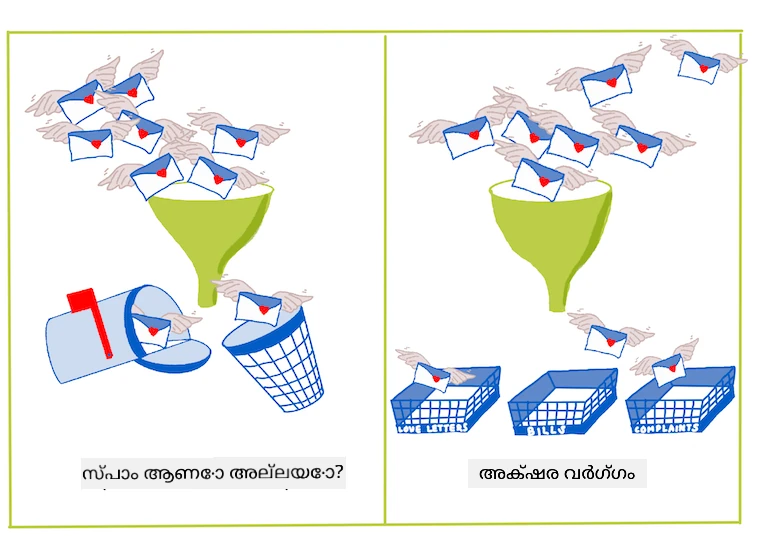
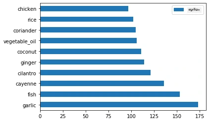
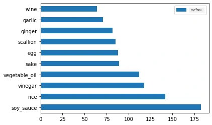
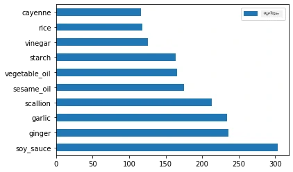
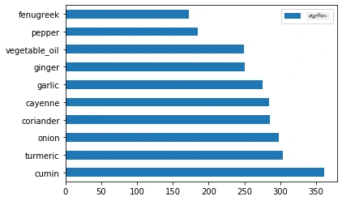

<!--
CO_OP_TRANSLATOR_METADATA:
{
  "original_hash": "aaf391d922bd6de5efba871d514c6d47",
  "translation_date": "2025-12-19T15:18:17+00:00",
  "source_file": "4-Classification/1-Introduction/README.md",
  "language_code": "ml"
}
-->
# വർഗ്ഗീകരണത്തിന് പരിചയം

ഈ നാല് പാഠങ്ങളിൽ, നിങ്ങൾ ക്ലാസിക് മെഷീൻ ലേണിങ്ങിന്റെ ഒരു അടിസ്ഥാന ശ്രദ്ധാകേന്ദ്രമായ _വർഗ്ഗീകരണം_ അന്വേഷിക്കും. ഏഷ്യയും ഇന്ത്യയും ഉൾപ്പെടുന്ന എല്ലാ പ്രശസ്തമായ പാചകശാലകളെക്കുറിച്ചുള്ള ഒരു ഡാറ്റാസെറ്റുമായി വിവിധ വർഗ്ഗീകരണ ആൽഗോരിതങ്ങൾ ഉപയോഗിച്ച് നാം നടക്കും. നിങ്ങൾക്ക് വിശക്കുമെന്നാണ് പ്രതീക്ഷ!


> ഈ പാഠങ്ങളിൽ പാൻ-ഏഷ്യൻ പാചകശാലകളെ ആഘോഷിക്കൂ! ചിത്രം [ജെൻ ലൂപ്പർ](https://twitter.com/jenlooper) നൽകിയത്

വർഗ്ഗീകരണം [സൂപ്പർവൈസ്ഡ് ലേണിങ്ങിന്റെ](https://wikipedia.org/wiki/Supervised_learning) ഒരു രൂപമാണ്, ഇത് റെഗ്രഷൻ സാങ്കേതികവിദ്യകളുമായി വളരെ സാമ്യമുണ്ട്. മെഷീൻ ലേണിങ്ങ് ഡാറ്റാസെറ്റുകൾ ഉപയോഗിച്ച് വസ്തുക്കളുടെ മൂല്യങ്ങൾ അല്ലെങ്കിൽ പേരുകൾ പ്രവചിക്കുന്നതിനെക്കുറിച്ചാണെങ്കിൽ, വർഗ്ഗീകരണം സാധാരണയായി രണ്ട് വിഭാഗങ്ങളിലായി വിഭജിക്കപ്പെടുന്നു: _ബൈനറി വർഗ്ഗീകരണം_യും _മൾട്ടിക്ലാസ് വർഗ്ഗീകരണം_യും.

[](https://youtu.be/eg8DJYwdMyg "Introduction to classification")

> 🎥 മുകളിൽ കാണുന്ന ചിത്രത്തിൽ ക്ലിക്ക് ചെയ്യുക: MIT-യുടെ ജോൺ ഗുട്ടാഗ് വർഗ്ഗീകരണം പരിചയപ്പെടുത്തുന്നു

ഓർമ്മിക്കുക:

- **ലീനിയർ റെഗ്രഷൻ** നിങ്ങൾക്ക് വ്യത്യസ്ത വേരിയബിളുകൾ തമ്മിലുള്ള ബന്ധം പ്രവചിക്കാൻ സഹായിച്ചു, ഒരു പുതിയ ഡാറ്റാപോയിന്റ് ആ വരിയോട് എവിടെ പൊരുത്തപ്പെടും എന്ന് കൃത്യമായി പ്രവചിക്കാൻ. ഉദാഹരണത്തിന്, _സെപ്റ്റംബർ മാസത്തിലെ പംപ്കിന്റെ വില ഡിസംബർ മാസത്തേക്കാൾ എത്രയാകും_ എന്ന് പ്രവചിക്കാം.
- **ലോജിസ്റ്റിക് റെഗ്രഷൻ** നിങ്ങൾക്ക് "ബൈനറി വിഭാഗങ്ങൾ" കണ്ടെത്താൻ സഹായിച്ചു: ഈ വിലയിൽ, _ഈ പംപ്കിൻ ഓറഞ്ച് ആണോ അല്ലയോ_?

വർഗ്ഗീകരണം ഡാറ്റാപോയിന്റിന്റെ ലേബൽ അല്ലെങ്കിൽ ക്ലാസ് നിർണയിക്കാൻ വിവിധ ആൽഗോരിതങ്ങൾ ഉപയോഗിക്കുന്നു. ഒരു കൂട്ടം ഘടകങ്ങൾ നിരീക്ഷിച്ച്, അതിന്റെ പാചകശാലയുടെ ഉത്ഭവം നമുക്ക് നിർണയിക്കാമോ എന്ന് നോക്കാം.

## [പ്രീ-ലെക്ചർ ക്വിസ്](https://ff-quizzes.netlify.app/en/ml/)

> ### [ഈ പാഠം R-ൽ ലഭ്യമാണ്!](../../../../4-Classification/1-Introduction/solution/R/lesson_10.html)

### പരിചയം

വർഗ്ഗീകരണം മെഷീൻ ലേണിംഗ് ഗവേഷകനും ഡാറ്റാ സയന്റിസ്റ്റും നടത്തുന്ന അടിസ്ഥാന പ്രവർത്തനങ്ങളിൽ ഒന്നാണ്. ഒരു ബൈനറി മൂല്യത്തിന്റെ അടിസ്ഥാന വർഗ്ഗീകരണത്തിൽ നിന്ന് ("ഈ ഇമെയിൽ സ്പാം ആണോ അല്ലയോ?") മുതൽ കമ്പ്യൂട്ടർ വിഷൻ ഉപയോഗിച്ച് സങ്കീർണ്ണമായ ഇമേജ് വർഗ്ഗീകരണവും സെഗ്മെന്റേഷനും വരെ, ഡാറ്റയെ ക്ലാസുകളായി തിരിച്ച് അതിൽ നിന്ന് ചോദ്യങ്ങൾ ചോദിക്കാൻ ഇത് എപ്പോഴും ഉപകാരപ്രദമാണ്.

പ്രക്രിയയെ കൂടുതൽ ശാസ്ത്രീയമായി പറയുമ്പോൾ, നിങ്ങളുടെ വർഗ്ഗീകരണ രീതി ഇൻപുട്ട് വേരിയബിളുകളും ഔട്ട്പുട്ട് വേരിയബിളുകളും തമ്മിലുള്ള ബന്ധം മാപ്പ് ചെയ്യാൻ സഹായിക്കുന്ന പ്രവചന മോഡൽ സൃഷ്ടിക്കുന്നു.



> ബൈനറി vs. മൾട്ടിക്ലാസ് പ്രശ്നങ്ങൾ വർഗ്ഗീകരണ ആൽഗോരിതങ്ങൾ കൈകാര്യം ചെയ്യേണ്ടത്. ഇൻഫോഗ്രാഫിക് [ജെൻ ലൂപ്പർ](https://twitter.com/jenlooper) നൽകിയത്

ഡാറ്റ ശുദ്ധീകരണം, ദൃശ്യവൽക്കരണം, ML ടാസ്കുകൾക്കായി തയ്യാറാക്കൽ തുടങ്ങിയ പ്രക്രിയ ആരംഭിക്കുന്നതിന് മുമ്പ്, മെഷീൻ ലേണിംഗ് ഡാറ്റ വർഗ്ഗീകരിക്കാൻ ഉപയോഗിക്കാവുന്ന വിവിധ മാർഗങ്ങൾ കുറച്ച് പഠിക്കാം.

[സ്റ്റാറ്റിസ്റ്റിക്സിൽ നിന്നാണ്](https://wikipedia.org/wiki/Statistical_classification) ഉത്ഭവം, ക്ലാസിക് മെഷീൻ ലേണിംഗ് ഉപയോഗിച്ചുള്ള വർഗ്ഗീകരണം `smoker`, `weight`, `age` പോലുള്ള ഫീച്ചറുകൾ ഉപയോഗിച്ച് _X രോഗം ഉണ്ടാകാനുള്ള സാധ്യത_ നിർണയിക്കുന്നു. നിങ്ങൾ മുമ്പ് ചെയ്ത റെഗ്രഷൻ അഭ്യാസങ്ങളോട് സമാനമായ ഒരു സൂപ്പർവൈസ്ഡ് ലേണിംഗ് സാങ്കേതികവിദ്യയായി, നിങ്ങളുടെ ഡാറ്റ ലേബൽ ചെയ്തിരിക്കുന്നു, ML ആൽഗോരിതങ്ങൾ ആ ലേബലുകൾ ഉപയോഗിച്ച് ഡാറ്റാസെറ്റിന്റെ ക്ലാസുകൾ (അഥവാ 'ഫീച്ചറുകൾ') വർഗ്ഗീകരിക്കുകയും പ്രവചിക്കുകയും ചെയ്യുന്നു, അവ ഒരു ഗ്രൂപ്പിലോ ഫലത്തിലോ നിയോഗിക്കുന്നു.

✅ ഒരു പാചകശാലകളെക്കുറിച്ചുള്ള ഡാറ്റാസെറ്റ് കണക്കിലെടുക്കൂ. മൾട്ടിക്ലാസ് മോഡൽ എന്ത് ചോദിക്കാനാകും? ബൈനറി മോഡൽ എന്ത് ചോദിക്കാനാകും? ഒരു പാചകശാല ഫെനുഗ്രീക് ഉപയോഗിക്കുമോ എന്ന് നിർണയിക്കാൻ നിങ്ങൾ ആഗ്രഹിച്ചാൽ? സ്റ്റാർ അനീസ്, ആർട്ടിച്ചോക്ക്, കോളിഫ്ലവർ, ഹോർസ്റഡിഷ് നിറഞ്ഞ ഒരു ഗ്രോസറി ബാഗ് നൽകിയാൽ, ഒരു സാധാരണ ഇന്ത്യൻ വിഭവം സൃഷ്ടിക്കാമോ എന്ന് നിങ്ങൾ കാണാൻ ആഗ്രഹിച്ചാൽ?

[](https://youtu.be/GuTeDbaNoEU "Crazy mystery baskets")

> 🎥 മുകളിൽ കാണുന്ന ചിത്രത്തിൽ ക്ലിക്ക് ചെയ്യുക. 'ചോപ്പ്ഡ്' എന്ന ഷോയുടെ മുഴുവൻ ആശയം 'മിസ്റ്ററി ബാസ്കറ്റ്' ആണ്, ഇവിടെ ഷെഫുകൾക്ക് ഒരു യാദൃച്ഛിക ഘടകങ്ങൾ തിരഞ്ഞെടുക്കലിൽ നിന്ന് ഒരു വിഭവം ഉണ്ടാക്കണം. തീർച്ചയായും ഒരു ML മോഡൽ സഹായിച്ചേനെ!

## ഹലോ 'ക്ലാസിഫയർ'

ഈ പാചകശാല ഡാറ്റാസെറ്റിൽ നമുക്ക് ചോദിക്കാനാഗ്രഹിക്കുന്ന ചോദ്യം **മൾട്ടിക്ലാസ് ചോദ്യം** ആണ്, കാരണം നമുക്ക് നിരവധി ദേശീയ പാചകശാലകൾ ഉണ്ട്. ഒരു ഘടകങ്ങളുടെ ബാച്ച് നൽകിയാൽ, ഈ പല ക്ലാസുകളിൽ ഏതാണ് ഡാറ്റ പൊരുത്തപ്പെടുന്നത്?

Scikit-learn വിവിധ പ്രശ്നങ്ങൾ പരിഹരിക്കാൻ ഉപയോഗിക്കാവുന്ന വിവിധ ആൽഗോരിതങ്ങൾ നൽകുന്നു. അടുത്ത രണ്ട് പാഠങ്ങളിൽ, നിങ്ങൾ ഈ ആൽഗോരിതങ്ങളിൽ ചിലതിനെക്കുറിച്ച് പഠിക്കും.

## അഭ്യാസം - നിങ്ങളുടെ ഡാറ്റ ശുദ്ധീകരിക്കുകയും ബാലൻസ് ചെയ്യുകയും ചെയ്യുക

ഈ പ്രോജക്ട് ആരംഭിക്കുന്നതിന് മുമ്പ്, ആദ്യത്തെ ജോലി നിങ്ങളുടെ ഡാറ്റ ശുദ്ധീകരിക്കുകയും **ബാലൻസ്** ചെയ്യുകയും ചെയ്യുക, മികച്ച ഫലങ്ങൾ നേടാൻ. ഈ ഫോൾഡറിന്റെ റൂട്ടിൽ ഉള്ള ശൂന്യമായ _notebook.ipynb_ ഫയൽ ഉപയോഗിച്ച് തുടങ്ങുക.

ആദ്യമായി ഇൻസ്റ്റാൾ ചെയ്യേണ്ടത് [imblearn](https://imbalanced-learn.org/stable/) ആണ്. ഇത് Scikit-learn പാക്കേജ് ആണ്, ഡാറ്റയെ മികച്ച രീതിയിൽ ബാലൻസ് ചെയ്യാൻ സഹായിക്കും (ഈ ടാസ്ക് കുറച്ച് നേരം കൊണ്ട് നിങ്ങൾക്ക് പഠിക്കാം).

1. `imblearn` ഇൻസ്റ്റാൾ ചെയ്യാൻ, `pip install` ഓടിക്കുക, ഇങ്ങനെ:

    ```python
    pip install imblearn
    ```

1. നിങ്ങളുടെ ഡാറ്റ ഇറക്കുമതി ചെയ്യാനും ദൃശ്യവൽക്കരിക്കാനും ആവശ്യമായ പാക്കേജുകൾ ഇറക്കുമതി ചെയ്യുക, കൂടാതെ `imblearn`-ൽ നിന്നുള്ള `SMOTE`-യും ഇറക്കുമതി ചെയ്യുക.

    ```python
    import pandas as pd
    import matplotlib.pyplot as plt
    import matplotlib as mpl
    import numpy as np
    from imblearn.over_sampling import SMOTE
    ```

    ഇനി നിങ്ങൾക്ക് ഡാറ്റ ഇറക്കുമതി ചെയ്യാൻ സജ്ജമാണ്.

1. അടുത്ത ടാസ്ക് ഡാറ്റ ഇറക്കുമതി ചെയ്യുക:

    ```python
    df  = pd.read_csv('../data/cuisines.csv')
    ```

   `read_csv()` ഉപയോഗിച്ച് _cusines.csv_ ഫയലിന്റെ ഉള്ളടക്കം വായിച്ച് `df` എന്ന വേരിയബിളിൽ സൂക്ഷിക്കും.

1. ഡാറ്റയുടെ ആകൃതി പരിശോധിക്കുക:

    ```python
    df.head()
    ```

   ആദ്യത്തെ അഞ്ച് വരികൾ ഇങ്ങനെ കാണപ്പെടും:

    ```output
    |     | Unnamed: 0 | cuisine | almond | angelica | anise | anise_seed | apple | apple_brandy | apricot | armagnac | ... | whiskey | white_bread | white_wine | whole_grain_wheat_flour | wine | wood | yam | yeast | yogurt | zucchini |
    | --- | ---------- | ------- | ------ | -------- | ----- | ---------- | ----- | ------------ | ------- | -------- | --- | ------- | ----------- | ---------- | ----------------------- | ---- | ---- | --- | ----- | ------ | -------- |
    | 0   | 65         | indian  | 0      | 0        | 0     | 0          | 0     | 0            | 0       | 0        | ... | 0       | 0           | 0          | 0                       | 0    | 0    | 0   | 0     | 0      | 0        |
    | 1   | 66         | indian  | 1      | 0        | 0     | 0          | 0     | 0            | 0       | 0        | ... | 0       | 0           | 0          | 0                       | 0    | 0    | 0   | 0     | 0      | 0        |
    | 2   | 67         | indian  | 0      | 0        | 0     | 0          | 0     | 0            | 0       | 0        | ... | 0       | 0           | 0          | 0                       | 0    | 0    | 0   | 0     | 0      | 0        |
    | 3   | 68         | indian  | 0      | 0        | 0     | 0          | 0     | 0            | 0       | 0        | ... | 0       | 0           | 0          | 0                       | 0    | 0    | 0   | 0     | 0      | 0        |
    | 4   | 69         | indian  | 0      | 0        | 0     | 0          | 0     | 0            | 0       | 0        | ... | 0       | 0           | 0          | 0                       | 0    | 0    | 0   | 0     | 1      | 0        |
    ```

1. ഈ ഡാറ്റയെക്കുറിച്ച് `info()` വിളിച്ച് വിവരങ്ങൾ നേടുക:

    ```python
    df.info()
    ```

    നിങ്ങളുടെ ഔട്ട്പുട്ട് ഇങ്ങനെ കാണപ്പെടും:

    ```output
    <class 'pandas.core.frame.DataFrame'>
    RangeIndex: 2448 entries, 0 to 2447
    Columns: 385 entries, Unnamed: 0 to zucchini
    dtypes: int64(384), object(1)
    memory usage: 7.2+ MB
    ```

## അഭ്യാസം - പാചകശാലകളെക്കുറിച്ച് പഠിക്കുക

ഇപ്പോൾ ജോലി കൂടുതൽ രസകരമാകുന്നു. ഓരോ പാചകശാലയ്ക്കും ഡാറ്റയുടെ വിതരണം കണ്ടെത്താം

1. `barh()` വിളിച്ച് ഡാറ്റ ബാറുകളായി പ്ലോട്ട് ചെയ്യുക:

    ```python
    df.cuisine.value_counts().plot.barh()
    ```

    

    പാചകശാലകളുടെ എണ്ണം പരിമിതമാണ്, പക്ഷേ ഡാറ്റയുടെ വിതരണം അസമമാണ്. നിങ്ങൾ അത് ശരിയാക്കാം! അതിന് മുമ്പ്, കുറച്ച് കൂടുതൽ അന്വേഷിക്കൂ.

1. ഓരോ പാചകശാലയ്ക്കും ലഭ്യമായ ഡാറ്റയുടെ അളവ് കണ്ടെത്തി പ്രിന്റ് ചെയ്യുക:

    ```python
    thai_df = df[(df.cuisine == "thai")]
    japanese_df = df[(df.cuisine == "japanese")]
    chinese_df = df[(df.cuisine == "chinese")]
    indian_df = df[(df.cuisine == "indian")]
    korean_df = df[(df.cuisine == "korean")]
    
    print(f'thai df: {thai_df.shape}')
    print(f'japanese df: {japanese_df.shape}')
    print(f'chinese df: {chinese_df.shape}')
    print(f'indian df: {indian_df.shape}')
    print(f'korean df: {korean_df.shape}')
    ```

    ഔട്ട്പുട്ട് ഇങ്ങനെ കാണപ്പെടും:

    ```output
    thai df: (289, 385)
    japanese df: (320, 385)
    chinese df: (442, 385)
    indian df: (598, 385)
    korean df: (799, 385)
    ```

## ഘടകങ്ങൾ കണ്ടെത്തൽ

ഇപ്പോൾ നിങ്ങൾക്ക് ഡാറ്റയിൽ കൂടുതൽ ആഴത്തിൽ കയറി ഓരോ പാചകശാലയ്ക്കും സാധാരണ ഘടകങ്ങൾ എന്തൊക്കെയാണെന്ന് പഠിക്കാം. പാചകശാലകളിൽ ആശയക്കുഴപ്പം സൃഷ്ടിക്കുന്ന ആവർത്തിക്കുന്ന ഡാറ്റ നീക്കം ചെയ്യണം, അതിനാൽ ഈ പ്രശ്നത്തെക്കുറിച്ച് പഠിക്കാം.

1. Python-ൽ `create_ingredient()` എന്ന ഫംഗ്ഷൻ സൃഷ്ടിക്കുക, ഇത് ഒരു ഘടക ഡാറ്റാഫ്രെയിം സൃഷ്ടിക്കും. ഈ ഫംഗ്ഷൻ ഒരു ഉപകാരമില്ലാത്ത കോളം ഒഴിവാക്കി, ഘടകങ്ങളെ അവരുടെ എണ്ണത്തിന്റെ അടിസ്ഥാനത്തിൽ ക്രമീകരിക്കും:

    ```python
    def create_ingredient_df(df):
        ingredient_df = df.T.drop(['cuisine','Unnamed: 0']).sum(axis=1).to_frame('value')
        ingredient_df = ingredient_df[(ingredient_df.T != 0).any()]
        ingredient_df = ingredient_df.sort_values(by='value', ascending=False,
        inplace=False)
        return ingredient_df
    ```

   ഇപ്പോൾ ഈ ഫംഗ്ഷൻ ഉപയോഗിച്ച് ഓരോ പാചകശാലയിലും ഏറ്റവും ജനപ്രിയമായ പത്ത് ഘടകങ്ങൾ കണ്ടെത്താം.

1. `create_ingredient()` വിളിച്ച് `barh()` ഉപയോഗിച്ച് പ്ലോട്ട് ചെയ്യുക:

    ```python
    thai_ingredient_df = create_ingredient_df(thai_df)
    thai_ingredient_df.head(10).plot.barh()
    ```

    

1. ജാപ്പനീസ് ഡാറ്റയ്ക്കും അതേപോലെ ചെയ്യുക:

    ```python
    japanese_ingredient_df = create_ingredient_df(japanese_df)
    japanese_ingredient_df.head(10).plot.barh()
    ```

    

1. ചൈനീസ് ഘടകങ്ങൾക്കായി:

    ```python
    chinese_ingredient_df = create_ingredient_df(chinese_df)
    chinese_ingredient_df.head(10).plot.barh()
    ```

    

1. ഇന്ത്യൻ ഘടകങ്ങൾ പ്ലോട്ട് ചെയ്യുക:

    ```python
    indian_ingredient_df = create_ingredient_df(indian_df)
    indian_ingredient_df.head(10).plot.barh()
    ```

    

1. അവസാനം കൊറിയൻ ഘടകങ്ങൾ:

    ```python
    korean_ingredient_df = create_ingredient_df(korean_df)
    korean_ingredient_df.head(10).plot.barh()
    ```

    

1. ഇപ്പോൾ, വ്യത്യസ്ത പാചകശാലകളിൽ ആശയക്കുഴപ്പം സൃഷ്ടിക്കുന്ന ഏറ്റവും സാധാരണ ഘടകങ്ങൾ `drop()` വിളിച്ച് ഒഴിവാക്കുക:

   എല്ലാവർക്കും അരി, വെളുത്തുള്ളി, ഇഞ്ചി ഇഷ്ടമാണ്!

    ```python
    feature_df= df.drop(['cuisine','Unnamed: 0','rice','garlic','ginger'], axis=1)
    labels_df = df.cuisine #.unique()
    feature_df.head()
    ```

## ഡാറ്റാസെറ്റ് ബാലൻസ് ചെയ്യുക

ഇപ്പോൾ നിങ്ങൾ ഡാറ്റ ശുദ്ധീകരിച്ചിരിക്കുന്നു, [SMOTE](https://imbalanced-learn.org/dev/references/generated/imblearn.over_sampling.SMOTE.html) - "സിന്തറ്റിക് മൈനോറിറ്റി ഓവർ-സാമ്പ്ലിംഗ് ടെക്നിക്" - ഉപയോഗിച്ച് അത് ബാലൻസ് ചെയ്യുക.

1. `fit_resample()` വിളിക്കുക, ഈ തന്ത്രം ഇന്റർപൊളേഷൻ വഴി പുതിയ സാമ്പിളുകൾ സൃഷ്ടിക്കുന്നു.

    ```python
    oversample = SMOTE()
    transformed_feature_df, transformed_label_df = oversample.fit_resample(feature_df, labels_df)
    ```

    നിങ്ങളുടെ ഡാറ്റ ബാലൻസ് ചെയ്താൽ, വർഗ്ഗീകരണത്തിൽ മികച്ച ഫലങ്ങൾ ലഭിക്കും. ഒരു ബൈനറി വർഗ്ഗീകരണം പരിഗണിക്കൂ. നിങ്ങളുടെ ഡാറ്റയുടെ ഭൂരിഭാഗം ഒരു ക്ലാസ്സിൽ ആണെങ്കിൽ, ML മോഡൽ ആ ക്ലാസ് കൂടുതൽ പ്രവചിക്കും, കാരണം അതിനുള്ള ഡാറ്റ കൂടുതലാണ്. ഡാറ്റ ബാലൻസ് ചെയ്യുന്നത് ഈ അസമത്വം നീക്കം ചെയ്യാൻ സഹായിക്കുന്നു.

1. ഇപ്പോൾ ഓരോ ഘടകത്തിനും ലേബലുകളുടെ എണ്ണം പരിശോധിക്കാം:

    ```python
    print(f'new label count: {transformed_label_df.value_counts()}')
    print(f'old label count: {df.cuisine.value_counts()}')
    ```

    നിങ്ങളുടെ ഔട്ട്പുട്ട് ഇങ്ങനെ കാണപ്പെടും:

    ```output
    new label count: korean      799
    chinese     799
    indian      799
    japanese    799
    thai        799
    Name: cuisine, dtype: int64
    old label count: korean      799
    indian      598
    chinese     442
    japanese    320
    thai        289
    Name: cuisine, dtype: int64
    ```

    ഡാറ്റ നല്ലതും ശുദ്ധവും ബാലൻസും കൂടിയതും, വളരെ രുചികരവുമാണ്!

1. അവസാന ഘട്ടം, ലേബലുകളും ഫീച്ചറുകളും ഉൾപ്പെടുന്ന ബാലൻസ്ഡ് ഡാറ്റ ഒരു പുതിയ ഡാറ്റാഫ്രെയിമിൽ സേവ് ചെയ്യുക, ഇത് ഫയലായി എക്സ്പോർട്ട് ചെയ്യാവുന്നതാണ്:

    ```python
    transformed_df = pd.concat([transformed_label_df,transformed_feature_df],axis=1, join='outer')
    ```

1. `transformed_df.head()`യും `transformed_df.info()`യും ഉപയോഗിച്ച് ഡാറ്റ വീണ്ടും പരിശോധിക്കാം. ഈ ഡാറ്റയുടെ ഒരു പകർപ്പ് ഭാവിയിലെ പാഠങ്ങൾക്കായി സേവ് ചെയ്യുക:

    ```python
    transformed_df.head()
    transformed_df.info()
    transformed_df.to_csv("../data/cleaned_cuisines.csv")
    ```

    ഈ പുതിയ CSV ഫയൽ ഇപ്പോൾ റൂട്ടിലെ ഡാറ്റ ഫോൾഡറിൽ ലഭ്യമാണ്.

---

## 🚀ചലഞ്ച്

ഈ പാഠ്യപദ്ധതിയിൽ പല രസകരമായ ഡാറ്റാസെറ്റുകളും ഉൾപ്പെടുത്തിയിട്ടുണ്ട്. `data` ഫോൾഡറുകൾ പരിശോധിച്ച്, ബൈനറി അല്ലെങ്കിൽ മൾട്ടി-ക്ലാസ് വർഗ്ഗീകരണത്തിന് അനുയോജ്യമായ ഡാറ്റാസെറ്റുകൾ ഉണ്ടോ എന്ന് നോക്കൂ. ഈ ഡാറ്റാസെറ്റിൽ നിങ്ങൾ എന്ത് ചോദ്യങ്ങൾ ചോദിക്കുമെന്നു ചിന്തിക്കൂ.

## [പോസ്റ്റ്-ലെക്ചർ ക്വിസ്](https://ff-quizzes.netlify.app/en/ml/)

## അവലോകനം & സ്വയം പഠനം

SMOTE-യുടെ API പരിശോധിക്കുക. ഏത് ഉപയോഗകേസുകൾക്കാണ് ഇത് ഏറ്റവും അനുയോജ്യം? ഇത് എവിടെ പ്രശ്നങ്ങൾ പരിഹരിക്കുന്നു?

## അസൈൻമെന്റ്

[വർഗ്ഗീകരണ രീതികൾ അന്വേഷിക്കുക](assignment.md)

---

<!-- CO-OP TRANSLATOR DISCLAIMER START -->
**അസൂയാ**:  
ഈ രേഖ AI വിവർത്തന സേവനം [Co-op Translator](https://github.com/Azure/co-op-translator) ഉപയോഗിച്ച് വിവർത്തനം ചെയ്തതാണ്. നാം കൃത്യതയ്ക്ക് ശ്രമിച്ചെങ്കിലും, സ്വയം പ്രവർത്തിക്കുന്ന വിവർത്തനങ്ങളിൽ പിശകുകൾ അല്ലെങ്കിൽ തെറ്റുകൾ ഉണ്ടാകാമെന്ന് ദയവായി ശ്രദ്ധിക്കുക. അതിന്റെ മാതൃഭാഷയിലുള്ള യഥാർത്ഥ രേഖ പ്രാമാണികമായ ഉറവിടമായി കണക്കാക്കണം. നിർണായക വിവരങ്ങൾക്ക്, പ്രൊഫഷണൽ മനുഷ്യ വിവർത്തനം ശുപാർശ ചെയ്യപ്പെടുന്നു. ഈ വിവർത്തനത്തിന്റെ ഉപയോഗത്തിൽ നിന്നുണ്ടാകുന്ന ഏതെങ്കിലും തെറ്റിദ്ധാരണകൾക്കോ തെറ്റായ വ്യാഖ്യാനങ്ങൾക്കോ ഞങ്ങൾ ഉത്തരവാദികളല്ല.
<!-- CO-OP TRANSLATOR DISCLAIMER END -->