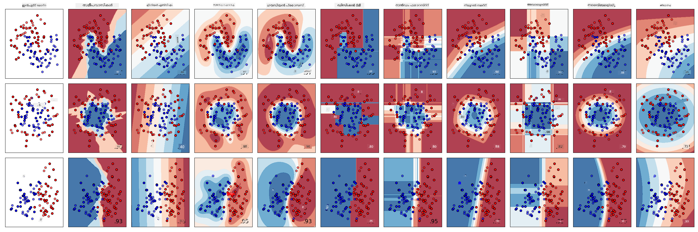
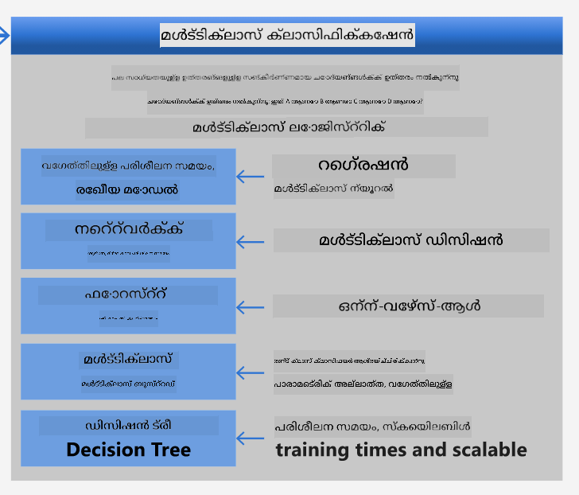
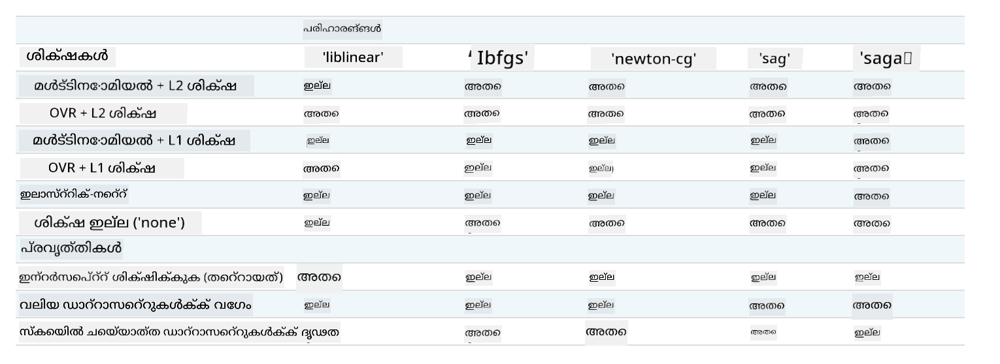

<!--
CO_OP_TRANSLATOR_METADATA:
{
  "original_hash": "1a6e9e46b34a2e559fbbfc1f95397c7b",
  "translation_date": "2025-12-19T15:32:50+00:00",
  "source_file": "4-Classification/2-Classifiers-1/README.md",
  "language_code": "ml"
}
-->
# ഭക്ഷണശൈലി ക്ലാസിഫയർമാർ 1

ഈ പാഠത്തിൽ, നിങ്ങൾ കഴിഞ്ഞ പാഠത്തിൽ നിന്ന് സംരക്ഷിച്ച, ഭക്ഷണശൈലികളെക്കുറിച്ചുള്ള സമതുലിതവും ശുദ്ധവുമായ ഡാറ്റയുള്ള ഡാറ്റാസെറ്റ് ഉപയോഗിക്കും.

നിങ്ങൾ ഈ ഡാറ്റാസെറ്റ് വിവിധ ക്ലാസിഫയർമാരുമായി ഉപയോഗിച്ച് _ഒരു ഗ്രൂപ്പ് ഘടകങ്ങളുടെ അടിസ്ഥാനത്തിൽ ഒരു നാഷണൽ ഭക്ഷണശൈലി പ്രവചിക്കും_. ഇതു ചെയ്യുമ്പോൾ, ക്ലാസിഫിക്കേഷൻ ടാസ്കുകൾക്കായി ആൽഗോരിതങ്ങൾ എങ്ങനെ ഉപയോഗിക്കാമെന്ന് കുറച്ച് കൂടുതൽ പഠിക്കും.

## [പ്രീ-ലെക്ചർ ക്വിസ്](https://ff-quizzes.netlify.app/en/ml/)
# തയ്യാറെടുപ്പ്

[പാഠം 1](../1-Introduction/README.md) പൂർത്തിയാക്കിയതായി കരുതുമ്പോൾ, ഈ നാല് പാഠങ്ങൾക്കായി റൂട്ട് `/data` ഫോൾഡറിൽ _cleaned_cuisines.csv_ ഫയൽ ഉണ്ടെന്ന് ഉറപ്പാക്കുക.

## അഭ്യാസം - ഒരു നാഷണൽ ഭക്ഷണശൈലി പ്രവചിക്കുക

1. ഈ പാഠത്തിലെ _notebook.ipynb_ ഫോൾഡറിൽ പ്രവർത്തിച്ച്, ആ ഫയലും Pandas ലൈബ്രറിയും ഇറക്കുമതി ചെയ്യുക:

    ```python
    import pandas as pd
    cuisines_df = pd.read_csv("../data/cleaned_cuisines.csv")
    cuisines_df.head()
    ```

    ഡാറ്റ ഇങ്ങനെ കാണപ്പെടും:

|     | Unnamed: 0 | cuisine | almond | angelica | anise | anise_seed | apple | apple_brandy | apricot | armagnac | ... | whiskey | white_bread | white_wine | whole_grain_wheat_flour | wine | wood | yam | yeast | yogurt | zucchini |
| --- | ---------- | ------- | ------ | -------- | ----- | ---------- | ----- | ------------ | ------- | -------- | --- | ------- | ----------- | ---------- | ----------------------- | ---- | ---- | --- | ----- | ------ | -------- |
| 0   | 0          | indian  | 0      | 0        | 0     | 0          | 0     | 0            | 0       | 0        | ... | 0       | 0           | 0          | 0                       | 0    | 0    | 0   | 0     | 0      | 0        |
| 1   | 1          | indian  | 1      | 0        | 0     | 0          | 0     | 0            | 0       | 0        | ... | 0       | 0           | 0          | 0                       | 0    | 0    | 0   | 0     | 0      | 0        |
| 2   | 2          | indian  | 0      | 0        | 0     | 0          | 0     | 0            | 0       | 0        | ... | 0       | 0           | 0          | 0                       | 0    | 0    | 0   | 0     | 0      | 0        |
| 3   | 3          | indian  | 0      | 0        | 0     | 0          | 0     | 0            | 0       | 0        | ... | 0       | 0           | 0          | 0                       | 0    | 0    | 0   | 0     | 0      | 0        |
| 4   | 4          | indian  | 0      | 0        | 0     | 0          | 0     | 0            | 0       | 0        | ... | 0       | 0           | 0          | 0                       | 0    | 0    | 0   | 0     | 1      | 0        |
  

1. ഇപ്പോൾ, കൂടുതൽ ലൈബ്രറികൾ ഇറക്കുമതി ചെയ്യുക:

    ```python
    from sklearn.linear_model import LogisticRegression
    from sklearn.model_selection import train_test_split, cross_val_score
    from sklearn.metrics import accuracy_score,precision_score,confusion_matrix,classification_report, precision_recall_curve
    from sklearn.svm import SVC
    import numpy as np
    ```

1. പരിശീലനത്തിനായി X, y കോർഡിനേറ്റുകൾ രണ്ട് ഡാറ്റാഫ്രെയിമുകളായി വിഭജിക്കുക. `cuisine` ലേബലുകളുടെ ഡാറ്റാഫ്രെയിം ആകാം:

    ```python
    cuisines_label_df = cuisines_df['cuisine']
    cuisines_label_df.head()
    ```

    ഇത് ഇങ്ങനെ കാണപ്പെടും:

    ```output
    0    indian
    1    indian
    2    indian
    3    indian
    4    indian
    Name: cuisine, dtype: object
    ```

1. ആ `Unnamed: 0` കോളവും `cuisine` കോളവും `drop()` ഉപയോഗിച്ച് ഒഴിവാക്കുക. ബാക്കി ഡാറ്റ പരിശീലന ഫീച്ചറുകളായി സേവ് ചെയ്യുക:

    ```python
    cuisines_feature_df = cuisines_df.drop(['Unnamed: 0', 'cuisine'], axis=1)
    cuisines_feature_df.head()
    ```

    നിങ്ങളുടെ ഫീച്ചറുകൾ ഇങ്ങനെ കാണപ്പെടും:

|      | almond | angelica | anise | anise_seed | apple | apple_brandy | apricot | armagnac | artemisia | artichoke |  ... | whiskey | white_bread | white_wine | whole_grain_wheat_flour | wine | wood |  yam | yeast | yogurt | zucchini |
| ---: | -----: | -------: | ----: | ---------: | ----: | -----------: | ------: | -------: | --------: | --------: | ---: | ------: | ----------: | ---------: | ----------------------: | ---: | ---: | ---: | ----: | -----: | -------: |
|    0 |      0 |        0 |     0 |          0 |     0 |            0 |       0 |        0 |         0 |         0 |  ... |       0 |           0 |          0 |                       0 |    0 |    0 |    0 |     0 |      0 |        0 | 0 |
|    1 |      1 |        0 |     0 |          0 |     0 |            0 |       0 |        0 |         0 |         0 |  ... |       0 |           0 |          0 |                       0 |    0 |    0 |    0 |     0 |      0 |        0 | 0 |
|    2 |      0 |        0 |     0 |          0 |     0 |            0 |       0 |        0 |         0 |         0 |  ... |       0 |           0 |          0 |                       0 |    0 |    0 |    0 |     0 |      0 |        0 | 0 |
|    3 |      0 |        0 |     0 |          0 |     0 |            0 |       0 |        0 |         0 |         0 |  ... |       0 |           0 |          0 |                       0 |    0 |    0 |    0 |     0 |      0 |        0 | 0 |
|    4 |      0 |        0 |     0 |          0 |     0 |            0 |       0 |        0 |         0 |         0 |  ... |       0 |           0 |          0 |                       0 |    0 |    0 |    0 |     0 |      1 |        0 | 0 |

ഇപ്പോൾ നിങ്ങൾ മോഡൽ പരിശീലിപ്പിക്കാൻ തയ്യാറാണ്!

## നിങ്ങളുടെ ക്ലാസിഫയർ തിരഞ്ഞെടുക്കൽ

ഇപ്പോൾ നിങ്ങളുടെ ഡാറ്റ ശുദ്ധവും പരിശീലനത്തിനും തയ്യാറുമാകുമ്പോൾ, ജോലിക്ക് ഏത് ആൽഗോരിതം ഉപയോഗിക്കണമെന്ന് തീരുമാനിക്കണം.

Scikit-learn ക്ലാസിഫിക്കേഷൻ സൂപ്പർവൈസ്ഡ് ലേണിങ്ങിന്റെ കീഴിൽ ഗ്രൂപ്പ് ചെയ്യുന്നു, ആ വിഭാഗത്തിൽ നിങ്ങൾക്ക് ക്ലാസിഫൈ ചെയ്യാനുള്ള നിരവധി മാർഗങ്ങൾ കാണാം. [വിവിധത്വം](https://scikit-learn.org/stable/supervised_learning.html) ആദ്യ കാഴ്ചയിൽ തന്നെ ആശ്ചര്യപ്പെടുത്തുന്നതാണ്. താഴെപ്പറയുന്ന രീതികൾ എല്ലാം ക്ലാസിഫിക്കേഷൻ സാങ്കേതികതകൾ ഉൾക്കൊള്ളുന്നു:

- ലീനിയർ മോഡലുകൾ
- സപ്പോർട്ട് വെക്ടർ മെഷീനുകൾ
- സ്റ്റോക്കാസ്റ്റിക് ഗ്രേഡിയന്റ് ഡിസെന്റ്
- അടുത്തുള്ള അയൽക്കാർ
- ഗൗസിയൻ പ്രോസസുകൾ
- ഡിസിഷൻ ട്രീകൾ
- എൻസംബിൾ രീതികൾ (വോട്ടിംഗ് ക്ലാസിഫയർ)
- മൾട്ടിക്ലാസ്, മൾട്ടി ഔട്ട്പുട്ട് ആൽഗോരിതങ്ങൾ (മൾട്ടിക്ലാസ്, മൾട്ടിലേബൽ ക്ലാസിഫിക്കേഷൻ, മൾട്ടിക്ലാസ്-മൾട്ടി ഔട്ട്പുട്ട് ക്ലാസിഫിക്കേഷൻ)

> [ന്യൂറൽ നെറ്റ്വർക്കുകൾ](https://scikit-learn.org/stable/modules/neural_networks_supervised.html#classification) ഡാറ്റ ക്ലാസിഫൈ ചെയ്യാൻ ഉപയോഗിക്കാം, പക്ഷേ അത് ഈ പാഠത്തിന്റെ പരിധിക്ക് പുറത്താണ്.

### ഏത് ക്ലാസിഫയർ തിരഞ്ഞെടുക്കണം?

അപ്പോൾ, ഏത് ക്ലാസിഫയർ തിരഞ്ഞെടുക്കണം? പലതും പരീക്ഷിച്ച് നല്ല ഫലം കാണുന്നത് പരീക്ഷിക്കാൻ ഒരു മാർഗമാണ്. Scikit-learn ഒരു [സൈഡ്-ബൈ-സൈഡ് താരതമ്യം](https://scikit-learn.org/stable/auto_examples/classification/plot_classifier_comparison.html) ഒരുക്കിയിട്ടുണ്ട്, KNeighbors, SVC രണ്ട് രീതികൾ, GaussianProcessClassifier, DecisionTreeClassifier, RandomForestClassifier, MLPClassifier, AdaBoostClassifier, GaussianNB, QuadraticDiscrinationAnalysis എന്നിവയുടെ ഫലങ്ങൾ ദൃശ്യമായി കാണിക്കുന്നു:


> Scikit-learn ഡോക്യുമെന്റേഷനിൽ നിന്നുള്ള പ്ലോട്ടുകൾ

> AutoML ഈ പ്രശ്നം ക്ലൗഡിൽ ഈ താരതമ്യങ്ങൾ നടത്തിക്കൊണ്ട് സുതാര്യമായി പരിഹരിക്കുന്നു, നിങ്ങളുടെ ഡാറ്റയ്ക്ക് ഏറ്റവും അനുയോജ്യമായ ആൽഗോരിതം തിരഞ്ഞെടുക്കാൻ സഹായിക്കുന്നു. [ഇവിടെ](https://docs.microsoft.com/learn/modules/automate-model-selection-with-azure-automl/?WT.mc_id=academic-77952-leestott) പരീക്ഷിക്കുക

### ഒരു മെച്ചപ്പെട്ട സമീപനം

വളരെ അനുമാനിച്ച് തിരഞ്ഞെടുക്കുന്നതിന് പകരം, ഡൗൺലോഡ് ചെയ്യാവുന്ന [ML ചീറ്റ് ഷീറ്റ്](https://docs.microsoft.com/azure/machine-learning/algorithm-cheat-sheet?WT.mc_id=academic-77952-leestott) ൽ ഉള്ള ആശയങ്ങൾ പിന്തുടരുക. ഇവിടെ, നമ്മുടെ മൾട്ടിക്ലാസ് പ്രശ്നത്തിന് ചില തിരഞ്ഞെടുപ്പുകൾ കാണാം:


> മൈക്രോസോഫ്റ്റിന്റെ ആൽഗോരിതം ചീറ്റ് ഷീറ്റിന്റെ ഒരു ഭാഗം, മൾട്ടിക്ലാസ് ക്ലാസിഫിക്കേഷൻ ഓപ്ഷനുകൾ വിശദീകരിക്കുന്നു

✅ ഈ ചീറ്റ് ഷീറ്റ് ഡൗൺലോഡ് ചെയ്ത് പ്രിന്റ് ചെയ്ത് നിങ്ങളുടെ ഭിത്തിയിൽ തൂക്കുക!

### കാരണവിവരണം

നമുക്ക് നമുക്ക് ഉള്ള നിയന്ത്രണങ്ങൾ പരിഗണിച്ച് വ്യത്യസ്ത സമീപനങ്ങൾക്കായി കാരണവിവരണം നോക്കാം:

- **ന്യൂറൽ നെറ്റ്വർക്കുകൾ വളരെ ഭാരമുള്ളവയാണ്**. നമ്മുടെ ശുദ്ധവും കുറഞ്ഞ ഡാറ്റാസെറ്റും, നോട്ട്ബുക്കുകൾ വഴി ലോക്കലായി പരിശീലനം നടത്തുന്നതും കണക്കിലെടുത്താൽ, ന്യൂറൽ നെറ്റ്വർക്കുകൾ ഈ ജോലിക്ക് ഭാരമുള്ളവയാണ്.
- **രണ്ട്-ക്ലാസ് ക്ലാസിഫയർ ഇല്ല**. രണ്ട്-ക്ലാസ് ക്ലാസിഫയർ ഉപയോഗിക്കാത്തതിനാൽ, ഒന്ന്-വേഴ്സ്-ആൾ (one-vs-all) ഒഴിവാക്കാം.
- **ഡിസിഷൻ ട്രീ അല്ലെങ്കിൽ ലോജിസ്റ്റിക് റെഗ്രഷൻ പ്രവർത്തിക്കാം**. ഒരു ഡിസിഷൻ ട്രീ പ്രവർത്തിക്കാം, അല്ലെങ്കിൽ മൾട്ടിക്ലാസ് ഡാറ്റയ്ക്ക് ലോജിസ്റ്റിക് റെഗ്രഷൻ.
- **മൾട്ടിക്ലാസ് ബൂസ്റ്റഡ് ഡിസിഷൻ ട്രീകൾ വ്യത്യസ്ത പ്രശ്നം പരിഹരിക്കുന്നു**. മൾട്ടിക്ലാസ് ബൂസ്റ്റഡ് ഡിസിഷൻ ട്രീ സാധാരണ റാങ്കിംഗ് നിർമ്മാണം പോലുള്ള നോൺപാരാമെട്രിക് ടാസ്കുകൾക്കാണ് അനുയോജ്യം, അതിനാൽ നമ്മുടെ ജോലിക്ക് ഉപയോഗപ്രദമല്ല.

### Scikit-learn ഉപയോഗിച്ച്

നാം Scikit-learn ഉപയോഗിച്ച് ഡാറ്റ വിശകലനം ചെയ്യും. എന്നാൽ, Scikit-learn-ൽ ലോജിസ്റ്റിക് റെഗ്രഷൻ ഉപയോഗിക്കുന്ന നിരവധി മാർഗങ്ങൾ ഉണ്ട്. [പാരാമീറ്ററുകൾ](https://scikit-learn.org/stable/modules/generated/sklearn.linear_model.LogisticRegression.html?highlight=logistic%20regressio#sklearn.linear_model.LogisticRegression) നോക്കുക.

പ്രധാനമായും രണ്ട് പാരാമീറ്ററുകൾ - `multi_class` ഉം `solver` ഉം - നമുക്ക് നിർദ്ദേശിക്കേണ്ടതാണ്, Scikit-learn-ൽ ലോജിസ്റ്റിക് റെഗ്രഷൻ നടത്തുമ്പോൾ. `multi_class` ഒരു പ്രത്യേക പെരുമാറ്റം പ്രയോഗിക്കുന്നു. `solver` ആൽഗോരിതം തിരഞ്ഞെടുക്കുന്നു. എല്ലാ സോൾവറുകളും എല്ലാ `multi_class` മൂല്യങ്ങളോടും പൊരുത്തപ്പെടുന്നില്ല.

ഡോക്യുമെന്റേഷനുസരിച്ച്, മൾട്ടിക്ലാസ് കേസിൽ, പരിശീലന ആൽഗോരിതം:

- **`multi_class` ഓപ്ഷൻ `ovr` ആണെങ്കിൽ ഒന്ന്-വേഴ്സ്-റെസ്റ്റ് (OvR) സ്കീം ഉപയോഗിക്കുന്നു**
- **`multi_class` ഓപ്ഷൻ `multinomial` ആണെങ്കിൽ ക്രോസ്-എൻട്രോപി ലോസ് ഉപയോഗിക്കുന്നു**. (ഇപ്പോൾ `multinomial` ഓപ്ഷൻ ‘lbfgs’, ‘sag’, ‘saga’, ‘newton-cg’ സോൾവറുകൾക്ക് മാത്രമേ പിന്തുണയുള്ളൂ.)"

> 🎓 ഇവിടെ 'സ്കീം' എന്നത് 'ovr' (ഒന്ന്-വേഴ്സ്-റെസ്റ്റ്) അല്ലെങ്കിൽ 'multinomial' ആകാം. ലോജിസ്റ്റിക് റെഗ്രഷൻ ബൈനറി ക്ലാസിഫിക്കേഷൻക്ക് രൂപകൽപ്പന ചെയ്തതിനാൽ, ഈ സ്കീമുകൾ മൾട്ടിക്ലാസ് ക്ലാസിഫിക്കേഷൻ ടാസ്കുകൾക്ക് മികച്ച പിന്തുണ നൽകുന്നു. [മൂലം](https://machinelearningmastery.com/one-vs-rest-and-one-vs-one-for-multi-class-classification/)

> 🎓 'സോൾവർ' എന്നത് "ഓപ്റ്റിമൈസേഷൻ പ്രശ്നത്തിൽ ഉപയോഗിക്കുന്ന ആൽഗോരിതം" എന്നാണ് നിർവചിക്കുന്നത്. [മൂലം](https://scikit-learn.org/stable/modules/generated/sklearn.linear_model.LogisticRegression.html?highlight=logistic%20regressio#sklearn.linear_model.LogisticRegression).

Scikit-learn ഈ പട്ടിക നൽകുന്നു, സോൾവറുകൾ വിവിധ ഡാറ്റാ ഘടനകളിൽ എങ്ങനെ പ്രവർത്തിക്കുന്നു എന്ന് വിശദീകരിക്കാൻ:



## അഭ്യാസം - ഡാറ്റ വിഭജിക്കുക

നിങ്ങൾ അടുത്ത പാഠത്തിൽ പഠിച്ച ലോജിസ്റ്റിക് റെഗ്രഷൻ ആദ്യ പരിശീലന ശ്രമമായി ഉപയോഗിക്കാം.
`train_test_split()` വിളിച്ച് നിങ്ങളുടെ ഡാറ്റ പരിശീലനവും പരിശോധനയും ഗ്രൂപ്പുകളായി വിഭജിക്കുക:

```python
X_train, X_test, y_train, y_test = train_test_split(cuisines_feature_df, cuisines_label_df, test_size=0.3)
```

## അഭ്യാസം - ലോജിസ്റ്റിക് റെഗ്രഷൻ പ്രയോഗിക്കുക

നിങ്ങൾ മൾട്ടിക്ലാസ് കേസ് ഉപയോഗിക്കുന്നതിനാൽ, ഏത് _സ്കീം_ ഉപയോഗിക്കണമെന്ന്, ഏത് _സോൾവർ_ സെറ്റ് ചെയ്യണമെന്ന് തിരഞ്ഞെടുക്കണം. മൾട്ടിക്ലാസ് സെറ്റിങ്ങിൽ `multi_class` `ovr` ആയും സോൾവർ **liblinear** ആയും സെറ്റ് ചെയ്ത് LogisticRegression ഉപയോഗിച്ച് പരിശീലിപ്പിക്കുക.

1. `multi_class` `ovr` ആയും സോൾവർ `liblinear` ആയും സെറ്റ് ചെയ്ത് ലോജിസ്റ്റിക് റെഗ്രഷൻ സൃഷ്ടിക്കുക:

    ```python
    lr = LogisticRegression(multi_class='ovr',solver='liblinear')
    model = lr.fit(X_train, np.ravel(y_train))
    
    accuracy = model.score(X_test, y_test)
    print ("Accuracy is {}".format(accuracy))
    ```

    ✅ സാധാരണയായി ഡിഫോൾട്ട് ആയി സെറ്റ് ചെയ്യുന്ന `lbfgs` പോലുള്ള മറ്റൊരു സോൾവർ പരീക്ഷിക്കുക

    > ശ്രദ്ധിക്കുക, ആവശ്യമായപ്പോൾ Pandas [`ravel`](https://pandas.pydata.org/pandas-docs/stable/reference/api/pandas.Series.ravel.html) ഫംഗ്ഷൻ ഉപയോഗിച്ച് ഡാറ്റ ഫ്ലാറ്റൻ ചെയ്യുക.

    കൃത്യത **80%** ക്കും മുകളിൽ നല്ലതാണ്!

1. ഡാറ്റയുടെ ഒരു വരി (#50) പരീക്ഷിച്ച് ഈ മോഡൽ പ്രവർത്തനം കാണാം:

    ```python
    print(f'ingredients: {X_test.iloc[50][X_test.iloc[50]!=0].keys()}')
    print(f'cuisine: {y_test.iloc[50]}')
    ```

    ഫലം പ്രിന്റ് ചെയ്യും:

   ```output
   ingredients: Index(['cilantro', 'onion', 'pea', 'potato', 'tomato', 'vegetable_oil'], dtype='object')
   cuisine: indian
   ```

   ✅ വ്യത്യസ്തമായ ഒരു വരി നമ്പർ പരീക്ഷിച്ച് ഫലങ്ങൾ പരിശോധിക്കുക

1. കൂടുതൽ ആഴത്തിൽ പരിശോധിക്കുമ്പോൾ, ഈ പ്രവചനത്തിന്റെ കൃത്യത പരിശോധിക്കാം:

    ```python
    test= X_test.iloc[50].values.reshape(-1, 1).T
    proba = model.predict_proba(test)
    classes = model.classes_
    resultdf = pd.DataFrame(data=proba, columns=classes)
    
    topPrediction = resultdf.T.sort_values(by=[0], ascending = [False])
    topPrediction.head()
    ```

    ഫലം പ്രിന്റ് ചെയ്യുന്നു - ഇന്ത്യൻ ഭക്ഷണമാണ് ഏറ്റവും സാധ്യതയുള്ള പ്രവചനമായി:

    |          |        0 |
    | -------: | -------: |
    |   indian | 0.715851 |
    |  chinese | 0.229475 |
    | japanese | 0.029763 |
    |   korean | 0.017277 |
    |     thai | 0.007634 |

    ✅ മോഡൽ ഈ ഭക്ഷണം ഇന്ത്യൻ ഭക്ഷണമാണെന്ന് എങ്ങനെ ഉറപ്പുള്ളതായി കാണിക്കുന്നു എന്ന് വിശദീകരിക്കാമോ?

1. റെഗ്രഷൻ പാഠങ്ങളിൽ ചെയ്തതുപോലെ ക്ലാസിഫിക്കേഷൻ റിപ്പോർട്ട് പ്രിന്റ് ചെയ്ത് കൂടുതൽ വിശദാംശങ്ങൾ നേടുക:

    ```python
    y_pred = model.predict(X_test)
    print(classification_report(y_test,y_pred))
    ```

    |              | precision | recall | f1-score | support |
    | ------------ | --------- | ------ | -------- | ------- |
    | chinese      | 0.73      | 0.71   | 0.72     | 229     |
    | indian       | 0.91      | 0.93   | 0.92     | 254     |
    | japanese     | 0.70      | 0.75   | 0.72     | 220     |
    | korean       | 0.86      | 0.76   | 0.81     | 242     |
    | thai         | 0.79      | 0.85   | 0.82     | 254     |
    | accuracy     | 0.80      | 1199   |          |         |
    | macro avg    | 0.80      | 0.80   | 0.80     | 1199    |
    | weighted avg | 0.80      | 0.80   | 0.80     | 1199    |

## 🚀ചലഞ്ച്

ഈ പാഠത്തിൽ, നിങ്ങൾ ശുദ്ധീകരിച്ച ഡാറ്റ ഉപയോഗിച്ച് ഒരു യന്ത്രം പഠന മോഡൽ നിർമ്മിച്ചു, ഇത് ഒരു സീരീസ് ഘടകങ്ങളുടെ അടിസ്ഥാനത്തിൽ ഒരു ദേശീയ ഭക്ഷണം പ്രവചിക്കാനാകും. ഡാറ്റ ക്ലാസിഫൈ ചെയ്യാൻ Scikit-learn നൽകുന്ന നിരവധി ഓപ്ഷനുകൾ വായിക്കാൻ ചില സമയം ചെലവഴിക്കുക. 'solver' എന്ന ആശയം കൂടുതൽ ആഴത്തിൽ പഠിച്ച് പിന്നിലെ പ്രവർത്തനം മനസ്സിലാക്കുക.

## [പാഠാനന്തര ക്വിസ്](https://ff-quizzes.netlify.app/en/ml/)

## അവലോകനം & സ്വയം പഠനം

ലോജിസ്റ്റിക് റെഗ്രഷന്റെ പിന്നിലെ ഗണിതം കുറച്ച് കൂടുതൽ പഠിക്കുക [ഈ പാഠത്തിൽ](https://people.eecs.berkeley.edu/~russell/classes/cs194/f11/lectures/CS194%20Fall%202011%20Lecture%2006.pdf)
## അസൈൻമെന്റ്

[സോൾവറുകൾ പഠിക്കുക](assignment.md)

---

<!-- CO-OP TRANSLATOR DISCLAIMER START -->
**അസൂയാ**:  
ഈ രേഖ AI വിവർത്തന സേവനം [Co-op Translator](https://github.com/Azure/co-op-translator) ഉപയോഗിച്ച് വിവർത്തനം ചെയ്തതാണ്. നാം കൃത്യതയ്ക്ക് ശ്രമിച്ചെങ്കിലും, സ്വയം പ്രവർത്തിക്കുന്ന വിവർത്തനങ്ങളിൽ പിശകുകൾ അല്ലെങ്കിൽ തെറ്റുകൾ ഉണ്ടാകാമെന്ന് ദയവായി ശ്രദ്ധിക്കുക. അതിന്റെ മാതൃഭാഷയിലുള്ള യഥാർത്ഥ രേഖയാണ് പ്രാമാണികമായ ഉറവിടം എന്ന് പരിഗണിക്കേണ്ടതാണ്. നിർണായകമായ വിവരങ്ങൾക്ക്, പ്രൊഫഷണൽ മനുഷ്യ വിവർത്തനം ശുപാർശ ചെയ്യപ്പെടുന്നു. ഈ വിവർത്തനം ഉപയോഗിക്കുന്നതിൽ നിന്നുണ്ടാകുന്ന ഏതെങ്കിലും തെറ്റിദ്ധാരണകൾക്കോ തെറ്റായ വ്യാഖ്യാനങ്ങൾക്കോ ഞങ്ങൾ ഉത്തരവാദികളല്ല.
<!-- CO-OP TRANSLATOR DISCLAIMER END -->