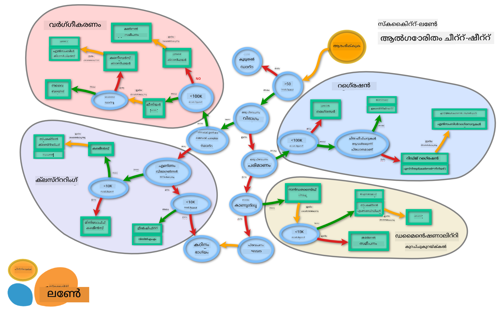

<!--
CO_OP_TRANSLATOR_METADATA:
{
  "original_hash": "49047911108adc49d605cddfb455749c",
  "translation_date": "2025-12-19T15:23:04+00:00",
  "source_file": "4-Classification/3-Classifiers-2/README.md",
  "language_code": "ml"
}
-->
# ഭക്ഷണശൈലി വർഗ്ഗീകരണങ്ങൾ 2

ഈ രണ്ടാം വർഗ്ഗീകരണ പാഠത്തിൽ, നിങ്ങൾ സംഖ്യാത്മക ഡാറ്റ വർഗ്ഗീകരിക്കുന്ന കൂടുതൽ മാർഗങ്ങൾ അന്വേഷിക്കും. മറ്റൊരു വർഗ്ഗീകരണ ഉപാധി തിരഞ്ഞെടുക്കുന്നതിന്റെ ഫലങ്ങൾക്കുറിച്ചും നിങ്ങൾ പഠിക്കും.

## [പ്രീ-ലെക്ചർ ക്വിസ്](https://ff-quizzes.netlify.app/en/ml/)

### മുൻകൂർ ആവശ്യകത

നിങ്ങൾ മുമ്പത്തെ പാഠങ്ങൾ പൂർത്തിയാക്കിയിട്ടുണ്ട് എന്ന് ഞങ്ങൾ കരുതുന്നു, കൂടാതെ ഈ 4-പാഠ ഫോളഡറിന്റെ റൂട്ടിൽ ഉള്ള `data` ഫോൾഡറിൽ _cleaned_cuisines.csv_ എന്ന ശുദ്ധീകരിച്ച ഡാറ്റാസെറ്റ് ഉണ്ട്.

### തയ്യാറെടുപ്പ്

നിങ്ങളുടെ _notebook.ipynb_ ഫയലിൽ ശുദ്ധീകരിച്ച ഡാറ്റാസെറ്റ് ലോഡ് ചെയ്തിട്ടുണ്ട്, കൂടാതെ മോഡൽ നിർമ്മാണ പ്രക്രിയയ്ക്ക് തയ്യാറായി X, y ഡാറ്റാഫ്രെയിമുകളായി വിഭജിച്ചിട്ടുണ്ട്.

## ഒരു വർഗ്ഗീകരണ മാപ്പ്

മുൻപ്, മൈക്രോസോഫ്റ്റിന്റെ ചീറ്റ്ഷീറ്റിന്റെ സഹായത്തോടെ ഡാറ്റ വർഗ്ഗീകരിക്കുന്നതിനുള്ള വിവിധ ഓപ്ഷനുകൾ നിങ്ങൾ പഠിച്ചിരുന്നു. Scikit-learn സമാനമായ, എന്നാൽ കൂടുതൽ സൂക്ഷ്മമായ ഒരു ചീറ്റ്ഷീറ്റ് നൽകുന്നു, ഇത് നിങ്ങളുടെ എസ്റ്റിമേറ്റർമാരെ (വർഗ്ഗീകരണ ഉപാധികൾക്ക് മറ്റൊരു പദം) കൂടുതൽ കുറയ്ക്കാൻ സഹായിക്കും:


> ടിപ്പ്: [ഈ മാപ്പ് ഓൺലൈനിൽ സന്ദർശിക്കുക](https://scikit-learn.org/stable/tutorial/machine_learning_map/) കൂടാതെ പാതയിലൂടെ ക്ലിക്ക് ചെയ്ത് ഡോക്യുമെന്റേഷൻ വായിക്കുക.

### പദ്ധതി

നിങ്ങളുടെ ഡാറ്റയെക്കുറിച്ച് വ്യക്തമായ ധാരണയുണ്ടായാൽ ഈ മാപ്പ് വളരെ സഹായകരമാണ്, കാരണം നിങ്ങൾ അതിന്റെ പാതകളിലൂടെ 'നടക്കാം' ഒരു തീരുമാനം എടുക്കാൻ:

- ഞങ്ങൾക്ക് >50 സാമ്പിളുകൾ ഉണ്ട്
- ഒരു വിഭാഗം പ്രവചിക്കണം
- ലേബൽ ചെയ്ത ഡാറ്റ ഉണ്ട്
- 100K സാമ്പിളുകൾക്കു താഴെയാണ്
- ✨ നാം ഒരു ലീനിയർ SVC തിരഞ്ഞെടുക്കാം
- അത് പ്രവർത്തിക്കാത്ത പക്ഷം, സംഖ്യാത്മക ഡാറ്റ ഉള്ളതിനാൽ
    - നാം ✨ KNeighbors Classifier പരീക്ഷിക്കാം
      - അത് പ്രവർത്തിക്കാത്ത പക്ഷം, ✨ SVC, ✨ Ensemble Classifiers പരീക്ഷിക്കുക

ഇത് പിന്തുടരാൻ വളരെ സഹായകരമായ ഒരു പാതയാണ്.

## അഭ്യാസം - ഡാറ്റ വിഭജിക്കുക

ഈ പാത പിന്തുടർന്ന്, നാം ഉപയോഗിക്കാൻ ചില ലൈബ്രറികൾ ഇറക്കുമതി ചെയ്യുന്നതിൽ നിന്ന് തുടങ്ങാം.

1. ആവശ്യമായ ലൈബ്രറികൾ ഇറക്കുമതി ചെയ്യുക:

    ```python
    from sklearn.neighbors import KNeighborsClassifier
    from sklearn.linear_model import LogisticRegression
    from sklearn.svm import SVC
    from sklearn.ensemble import RandomForestClassifier, AdaBoostClassifier
    from sklearn.model_selection import train_test_split, cross_val_score
    from sklearn.metrics import accuracy_score,precision_score,confusion_matrix,classification_report, precision_recall_curve
    import numpy as np
    ```

1. നിങ്ങളുടെ പരിശീലനവും ടെസ്റ്റ് ഡാറ്റയും വിഭജിക്കുക:

    ```python
    X_train, X_test, y_train, y_test = train_test_split(cuisines_feature_df, cuisines_label_df, test_size=0.3)
    ```

## ലീനിയർ SVC വർഗ്ഗീകരകൻ

സപ്പോർട്ട്-വെക്ടർ ക്ലസ്റ്ററിംഗ് (SVC) ML സാങ്കേതികവിദ്യകളായ Support-Vector machines കുടുംബത്തിലെ ഒരു ശാഖയാണ് (താഴെ ഇതിനെക്കുറിച്ച് കൂടുതൽ പഠിക്കുക). ഈ രീതിയിൽ, ലേബലുകൾ എങ്ങനെ ക്ലസ്റ്റർ ചെയ്യാമെന്ന് തീരുമാനിക്കാൻ 'kernel' തിരഞ്ഞെടുക്കാം. 'C' പാരാമീറ്റർ 'regularization' നെ സൂചിപ്പിക്കുന്നു, ഇത് പാരാമീറ്ററുകളുടെ സ്വാധീനം നിയന്ത്രിക്കുന്നു. kernel [വിവിധങ്ങളിലൊന്നായിരിക്കാം](https://scikit-learn.org/stable/modules/generated/sklearn.svm.SVC.html#sklearn.svm.SVC); ഇവിടെ നാം 'linear' ആയി സജ്ജമാക്കി ലീനിയർ SVC പ്രയോജനപ്പെടുത്തുന്നു. Probability ഡിഫോൾട്ട് 'false' ആണ്; ഇവിടെ 'true' ആയി സജ്ജമാക്കി സാധ്യതാ അളവുകൾ ശേഖരിക്കുന്നു. ഡാറ്റ ഷഫിൾ ചെയ്യാൻ random state '0' ആയി സജ്ജമാക്കിയിട്ടുണ്ട്.

### അഭ്യാസം - ലീനിയർ SVC പ്രയോഗിക്കുക

വർഗ്ഗീകരകങ്ങളുടെ ഒരു അറേ സൃഷ്ടിച്ച് തുടങ്ങുക. പരീക്ഷണങ്ങൾ നടത്തുമ്പോൾ ഈ അറേയിൽ ക്രമാനുസൃതമായി ചേർക്കും.

1. ലീനിയർ SVC ഉപയോഗിച്ച് തുടങ്ങുക:

    ```python
    C = 10
    # വ്യത്യസ്ത ക്ലാസിഫയർസുകൾ സൃഷ്ടിക്കുക.
    classifiers = {
        'Linear SVC': SVC(kernel='linear', C=C, probability=True,random_state=0)
    }
    ```

2. ലീനിയർ SVC ഉപയോഗിച്ച് മോഡൽ പരിശീലിപ്പിച്ച് റിപ്പോർട്ട് പ്രിന്റ് ചെയ്യുക:

    ```python
    n_classifiers = len(classifiers)
    
    for index, (name, classifier) in enumerate(classifiers.items()):
        classifier.fit(X_train, np.ravel(y_train))
    
        y_pred = classifier.predict(X_test)
        accuracy = accuracy_score(y_test, y_pred)
        print("Accuracy (train) for %s: %0.1f%% " % (name, accuracy * 100))
        print(classification_report(y_test,y_pred))
    ```

    ഫലം വളരെ നല്ലതാണ്:

    ```output
    Accuracy (train) for Linear SVC: 78.6% 
                  precision    recall  f1-score   support
    
         chinese       0.71      0.67      0.69       242
          indian       0.88      0.86      0.87       234
        japanese       0.79      0.74      0.76       254
          korean       0.85      0.81      0.83       242
            thai       0.71      0.86      0.78       227
    
        accuracy                           0.79      1199
       macro avg       0.79      0.79      0.79      1199
    weighted avg       0.79      0.79      0.79      1199
    ```

## K-Neighbors വർഗ്ഗീകരകൻ

K-Neighbors ML രീതികളായ "neighbors" കുടുംബത്തിലെ ഒരു ഭാഗമാണ്, ഇത് സൂപ്പർവൈസ്ഡ്, അൺസൂപ്പർവൈസ്ഡ് പഠനത്തിനും ഉപയോഗിക്കാം. ഈ രീതിയിൽ, മുൻകൂട്ടി നിർവ്വചിച്ച പോയിന്റുകളുടെ എണ്ണം സൃഷ്ടിച്ച്, ഡാറ്റ ഈ പോയിന്റുകളുടെ ചുറ്റും ശേഖരിച്ച് പൊതുവായ ലേബലുകൾ പ്രവചിക്കാനാകും.

### അഭ്യാസം - K-Neighbors വർഗ്ഗീകരകൻ പ്രയോഗിക്കുക

മുൻ വർഗ്ഗീകരകൻ നല്ലതായിരുന്നു, ഡാറ്റയുമായി നന്നായി പ്രവർത്തിച്ചു, പക്ഷേ നാം കൂടുതൽ കൃത്യത നേടാമോ എന്ന് നോക്കാം. K-Neighbors വർഗ്ഗീകരകൻ പരീക്ഷിക്കുക.

1. നിങ്ങളുടെ വർഗ്ഗീകരക അറേയിൽ ഒരു വരി ചേർക്കുക (ലീനിയർ SVC ഇനത്തിന് ശേഷം കോമ ചേർക്കുക):

    ```python
    'KNN classifier': KNeighborsClassifier(C),
    ```

    ഫലം കുറച്ച് മോശമാണ്:

    ```output
    Accuracy (train) for KNN classifier: 73.8% 
                  precision    recall  f1-score   support
    
         chinese       0.64      0.67      0.66       242
          indian       0.86      0.78      0.82       234
        japanese       0.66      0.83      0.74       254
          korean       0.94      0.58      0.72       242
            thai       0.71      0.82      0.76       227
    
        accuracy                           0.74      1199
       macro avg       0.76      0.74      0.74      1199
    weighted avg       0.76      0.74      0.74      1199
    ```

    ✅ [K-Neighbors](https://scikit-learn.org/stable/modules/neighbors.html#neighbors) കുറിച്ച് പഠിക്കുക

## Support Vector Classifier

Support-Vector വർഗ്ഗീകരകർ [Support-Vector Machine](https://wikipedia.org/wiki/Support-vector_machine) ML രീതികളുടെ കുടുംബത്തിലെ ഭാഗമാണ്, വർഗ്ഗീകരണവും റെഗ്രഷനും വേണ്ടി ഉപയോഗിക്കുന്നു. SVMകൾ "പരിശീലന ഉദാഹരണങ്ങളെ ബിന്ദുക്കളായി മാപ്പ് ചെയ്യുന്നു" രണ്ട് വിഭാഗങ്ങൾക്കിടയിലെ ദൂരം പരമാവധി ആക്കാൻ. പിന്നീട് വരുന്ന ഡാറ്റ ഈ സ്ഥലത്ത് മാപ്പ് ചെയ്ത് അവരുടെ വിഭാഗം പ്രവചിക്കാം.

### അഭ്യാസം - Support Vector Classifier പ്രയോഗിക്കുക

കുറച്ച് കൂടുതൽ കൃത്യതക്കായി Support Vector Classifier പരീക്ഷിക്കാം.

1. K-Neighbors ഇനത്തിന് ശേഷം കോമ ചേർക്കുക, പിന്നെ ഈ വരി ചേർക്കുക:

    ```python
    'SVC': SVC(),
    ```

    ഫലം വളരെ നല്ലതാണ്!

    ```output
    Accuracy (train) for SVC: 83.2% 
                  precision    recall  f1-score   support
    
         chinese       0.79      0.74      0.76       242
          indian       0.88      0.90      0.89       234
        japanese       0.87      0.81      0.84       254
          korean       0.91      0.82      0.86       242
            thai       0.74      0.90      0.81       227
    
        accuracy                           0.83      1199
       macro avg       0.84      0.83      0.83      1199
    weighted avg       0.84      0.83      0.83      1199
    ```

    ✅ [Support-Vectors](https://scikit-learn.org/stable/modules/svm.html#svm) കുറിച്ച് പഠിക്കുക

## Ensemble Classifiers

മുൻ പരീക്ഷണം വളരെ നല്ലതായിരുന്നു എങ്കിലും, പാതയുടെ അവസാനത്തേക്ക് പോകാം. 'Ensemble Classifiers', പ്രത്യേകിച്ച് Random Forest, AdaBoost പരീക്ഷിക്കാം:

```python
  'RFST': RandomForestClassifier(n_estimators=100),
  'ADA': AdaBoostClassifier(n_estimators=100)
```

ഫലം വളരെ നല്ലതാണ്, പ്രത്യേകിച്ച് Random Forest:

```output
Accuracy (train) for RFST: 84.5% 
              precision    recall  f1-score   support

     chinese       0.80      0.77      0.78       242
      indian       0.89      0.92      0.90       234
    japanese       0.86      0.84      0.85       254
      korean       0.88      0.83      0.85       242
        thai       0.80      0.87      0.83       227

    accuracy                           0.84      1199
   macro avg       0.85      0.85      0.84      1199
weighted avg       0.85      0.84      0.84      1199

Accuracy (train) for ADA: 72.4% 
              precision    recall  f1-score   support

     chinese       0.64      0.49      0.56       242
      indian       0.91      0.83      0.87       234
    japanese       0.68      0.69      0.69       254
      korean       0.73      0.79      0.76       242
        thai       0.67      0.83      0.74       227

    accuracy                           0.72      1199
   macro avg       0.73      0.73      0.72      1199
weighted avg       0.73      0.72      0.72      1199
```

✅ [Ensemble Classifiers](https://scikit-learn.org/stable/modules/ensemble.html) കുറിച്ച് പഠിക്കുക

ഈ മെഷീൻ ലേണിംഗ് രീതി "അനേകം അടിസ്ഥാന എസ്റ്റിമേറ്റർമാരുടെ പ്രവചനങ്ങൾ സംയോജിപ്പിക്കുന്നു" മോഡലിന്റെ ഗുണമേന്മ മെച്ചപ്പെടുത്താൻ. നമ്മുടെ ഉദാഹരണത്തിൽ, Random Trees, AdaBoost ഉപയോഗിച്ചു.

- [Random Forest](https://scikit-learn.org/stable/modules/ensemble.html#forest), ഒരു ശരാശരി രീതി, 'decision trees' ന്റെ 'കാടുകൾ' നിർമ്മിക്കുന്നു, ഓവർഫിറ്റിംഗ് ഒഴിവാക്കാൻ റാൻഡംനസ് ചേർക്കുന്നു. n_estimators പാരാമീറ്റർ മരങ്ങളുടെ എണ്ണം സജ്ജമാക്കുന്നു.

- [AdaBoost](https://scikit-learn.org/stable/modules/generated/sklearn.ensemble.AdaBoostClassifier.html) ഒരു ക്ലാസിഫയർ ഡാറ്റാസെറ്റിൽ ഫിറ്റ് ചെയ്ത്, അതേ ക്ലാസിഫയറിന്റെ പകർപ്പുകൾ അതേ ഡാറ്റാസെറ്റിൽ ഫിറ്റ് ചെയ്യുന്നു. തെറ്റായി വർഗ്ഗീകരിച്ച വസ്തുക്കളുടെ ഭാരം ശ്രദ്ധിച്ച് അടുത്ത ക്ലാസിഫയറിന്റെ ഫിറ്റ് ശരിയാക്കുന്നു.

---

## 🚀ചലഞ്ച്

ഈ സാങ്കേതികവിദ്യകളിൽ ഓരോതിലും നിങ്ങൾ ക്രമീകരിക്കാവുന്ന നിരവധി പാരാമീറ്ററുകൾ ഉണ്ട്. ഓരോതിന്റെ ഡിഫോൾട്ട് പാരാമീറ്ററുകൾ ഗവേഷണം ചെയ്ത്, ഈ പാരാമീറ്ററുകൾ ക്രമീകരിക്കുന്നത് മോഡലിന്റെ ഗുണമേന്മയ്ക്ക് എന്ത് അർത്ഥമാക്കുമെന്ന് ചിന്തിക്കുക.

## [പോസ്റ്റ്-ലെക്ചർ ക്വിസ്](https://ff-quizzes.netlify.app/en/ml/)

## അവലോകനം & സ്വയം പഠനം

ഈ പാഠങ്ങളിൽ ധാരാളം സാങ്കേതിക പദങ്ങൾ ഉണ്ട്, അതിനാൽ [ഈ പട്ടിക](https://docs.microsoft.com/dotnet/machine-learning/resources/glossary?WT.mc_id=academic-77952-leestott) ഉപയോഗിച്ച് ഒരു നിമിഷം അവലോകനം ചെയ്യുക!

## അസൈൻമെന്റ്

[പാരാമീറ്റർ കളി](assignment.md)

---

<!-- CO-OP TRANSLATOR DISCLAIMER START -->
**അസൂയാപത്രം**:  
ഈ രേഖ AI വിവർത്തന സേവനം [Co-op Translator](https://github.com/Azure/co-op-translator) ഉപയോഗിച്ച് വിവർത്തനം ചെയ്തതാണ്. നാം കൃത്യതയ്ക്ക് ശ്രമിച്ചിട്ടുണ്ടെങ്കിലും, യന്ത്രം ചെയ്ത വിവർത്തനങ്ങളിൽ പിശകുകൾ അല്ലെങ്കിൽ തെറ്റുകൾ ഉണ്ടാകാമെന്ന് ദയവായി ശ്രദ്ധിക്കുക. അതിന്റെ മാതൃഭാഷയിലുള്ള യഥാർത്ഥ രേഖ അധികാരപരമായ ഉറവിടമായി കണക്കാക്കപ്പെടണം. നിർണായകമായ വിവരങ്ങൾക്ക്, പ്രൊഫഷണൽ മനുഷ്യ വിവർത്തനം ശുപാർശ ചെയ്യപ്പെടുന്നു. ഈ വിവർത്തനം ഉപയോഗിക്കുന്നതിൽ നിന്നുണ്ടാകുന്ന ഏതെങ്കിലും തെറ്റിദ്ധാരണകൾക്കോ തെറ്റായ വ്യാഖ്യാനങ്ങൾക്കോ ഞങ്ങൾ ഉത്തരവാദികളല്ല.
<!-- CO-OP TRANSLATOR DISCLAIMER END -->