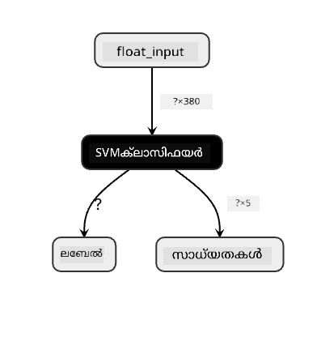
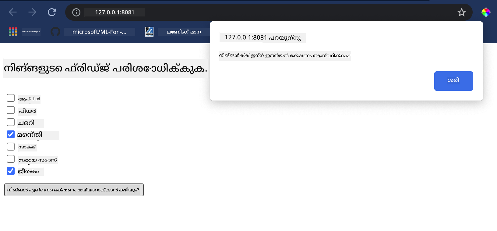

<!--
CO_OP_TRANSLATOR_METADATA:
{
  "original_hash": "61bdec27ed2da8b098cd9065405d9bb0",
  "translation_date": "2025-12-19T15:27:17+00:00",
  "source_file": "4-Classification/4-Applied/README.md",
  "language_code": "ml"
}
-->
# ഒരു ക്യൂസീൻ ശുപാർശ വെബ് ആപ്പ് നിർമ്മിക്കുക

ഈ പാഠത്തിൽ, നിങ്ങൾ മുമ്പത്തെ പാഠങ്ങളിൽ പഠിച്ച ചില സാങ്കേതിക വിദ്യകൾ ഉപയോഗിച്ച് ക്ലാസിഫിക്കേഷൻ മോഡൽ നിർമ്മിക്കുകയും ഈ പരമ്പരയിൽ മുഴുവൻ ഉപയോഗിച്ച രുചികരമായ ക്യൂസീൻ ഡാറ്റാസെറ്റ് ഉപയോഗിച്ച് അത് നിർമിക്കുകയും ചെയ്യും. കൂടാതെ, Onnx-ന്റെ വെബ് റൺടൈം ഉപയോഗിച്ച് സേവ് ചെയ്ത മോഡൽ ഉപയോഗിക്കുന്ന ഒരു ചെറിയ വെബ് ആപ്പ് നിർമ്മിക്കും.

മെഷീൻ ലേണിങ്ങിന്റെ ഏറ്റവും പ്രയോജനകരമായ പ്രായോഗിക ഉപയോഗങ്ങളിൽ ഒന്നാണ് ശുപാർശാ സംവിധാനങ്ങൾ നിർമ്മിക്കുന്നത്, ഇന്ന് നിങ്ങൾ ആ ദിശയിൽ ആദ്യപടി എടുക്കാം!

[](https://youtu.be/17wdM9AHMfg "Applied ML")

> 🎥 വീഡിയോക്കായി മുകളിൽ ചിത്രത്തിൽ ക്ലിക്ക് ചെയ്യുക: ജെൻ ലൂപ്പർ ക്ലാസിഫൈ ചെയ്ത ക്യൂസീൻ ഡാറ്റ ഉപയോഗിച്ച് വെബ് ആപ്പ് നിർമ്മിക്കുന്നു

## [പ്രീ-ലെക്ചർ ക്വിസ്](https://ff-quizzes.netlify.app/en/ml/)

ഈ പാഠത്തിൽ നിങ്ങൾ പഠിക്കാനിരിക്കുന്നത്:

- മോഡൽ നിർമ്മിച്ച് Onnx മോഡലായി സേവ് ചെയ്യുന്നത് എങ്ങനെ
- മോഡൽ പരിശോധിക്കാൻ Netron എങ്ങനെ ഉപയോഗിക്കാം
- നിങ്ങളുടെ മോഡൽ വെബ് ആപ്പിൽ ഇൻഫറൻസിനായി എങ്ങനെ ഉപയോഗിക്കാം

## നിങ്ങളുടെ മോഡൽ നിർമ്മിക്കുക

പ്രായോഗിക ML സിസ്റ്റങ്ങൾ നിർമ്മിക്കുന്നത് ഈ സാങ്കേതിക വിദ്യകൾ നിങ്ങളുടെ ബിസിനസ് സിസ്റ്റങ്ങളിൽ പ്രയോജനപ്പെടുത്തുന്നതിന്റെ ഒരു പ്രധാന ഭാഗമാണ്. Onnx ഉപയോഗിച്ച് നിങ്ങൾക്ക് നിങ്ങളുടെ വെബ് ആപ്പുകളിൽ മോഡലുകൾ ഉപയോഗിക്കാം (ആവശ്യമായാൽ ഓഫ്‌ലൈൻ സാഹചര്യത്തിലും ഉപയോഗിക്കാം).

[മുമ്പത്തെ പാഠത്തിൽ](../../3-Web-App/1-Web-App/README.md), നിങ്ങൾ UFO സൈറ്റിംഗുകളെക്കുറിച്ചുള്ള Regression മോഡൽ നിർമ്മിച്ച്, അത് "പിക്കിൾ" ചെയ്ത് Flask ആപ്പിൽ ഉപയോഗിച്ചിരുന്നു. ഈ ആർക്കിടെക്ചർ അറിയുന്നത് വളരെ പ്രയോജനകരമാണ്, പക്ഷേ അത് ഒരു ഫുൾ-സ്റ്റാക്ക് പൈത്തൺ ആപ്പാണ്, നിങ്ങളുടെ ആവശ്യങ്ങൾ ജാവാസ്ക്രിപ്റ്റ് ആപ്ലിക്കേഷൻ ഉപയോഗിക്കലും ഉൾക്കൊള്ളാം.

ഈ പാഠത്തിൽ, നിങ്ങൾ അടിസ്ഥാന ജാവാസ്ക്രിപ്റ്റ് അടിസ്ഥാനമാക്കിയുള്ള ഇൻഫറൻസ് സിസ്റ്റം നിർമ്മിക്കാം. ആദ്യം, മോഡൽ പരിശീലിപ്പിച്ച് Onnx ഉപയോഗിക്കാൻ മാറ്റണം.

## അഭ്യാസം - ക്ലാസിഫിക്കേഷൻ മോഡൽ പരിശീലിപ്പിക്കുക

ആദ്യം, നാം ഉപയോഗിച്ച ക്ലീനായ ക്യൂസീൻ ഡാറ്റാസെറ്റ് ഉപയോഗിച്ച് ക്ലാസിഫിക്കേഷൻ മോഡൽ പരിശീലിപ്പിക്കുക.

1. പ്രയോജനകരമായ ലൈബ്രറികൾ ഇറക്കുമതി ചെയ്യുക:

    ```python
    !pip install skl2onnx
    import pandas as pd 
    ```

    നിങ്ങളുടെ Scikit-learn മോഡൽ Onnx ഫോർമാറ്റിലേക്ക് മാറ്റാൻ '[skl2onnx](https://onnx.ai/sklearn-onnx/)' ആവശ്യമാണ്.

1. തുടർന്ന്, മുമ്പത്തെ പാഠങ്ങളിൽ ചെയ്തതുപോലെ `read_csv()` ഉപയോഗിച്ച് CSV ഫയൽ വായിച്ച് ഡാറ്റ കൈകാര്യം ചെയ്യുക:

    ```python
    data = pd.read_csv('../data/cleaned_cuisines.csv')
    data.head()
    ```

1. ആദ്യ രണ്ട് അനാവശ്യ കോളങ്ങൾ നീക്കം ചെയ്ത് ശേഷിക്കുന്ന ഡാറ്റ 'X' ആയി സേവ് ചെയ്യുക:

    ```python
    X = data.iloc[:,2:]
    X.head()
    ```

1. ലേബലുകൾ 'y' ആയി സേവ് ചെയ്യുക:

    ```python
    y = data[['cuisine']]
    y.head()
    
    ```

### പരിശീലന രീതി ആരംഭിക്കുക

നല്ല കൃത്യതയുള്ള 'SVC' ലൈബ്രറി ഉപയോഗിക്കും.

1. Scikit-learn-ൽ നിന്നുള്ള അനുയോജ്യമായ ലൈബ്രറികൾ ഇറക്കുമതി ചെയ്യുക:

    ```python
    from sklearn.model_selection import train_test_split
    from sklearn.svm import SVC
    from sklearn.model_selection import cross_val_score
    from sklearn.metrics import accuracy_score,precision_score,confusion_matrix,classification_report
    ```

1. പരിശീലനവും ടെസ്റ്റ് സെറ്റുകളും വേർതിരിക്കുക:

    ```python
    X_train, X_test, y_train, y_test = train_test_split(X,y,test_size=0.3)
    ```

1. മുമ്പത്തെ പാഠത്തിൽ ചെയ്തതുപോലെ SVC ക്ലാസിഫിക്കേഷൻ മോഡൽ നിർമ്മിക്കുക:

    ```python
    model = SVC(kernel='linear', C=10, probability=True,random_state=0)
    model.fit(X_train,y_train.values.ravel())
    ```

1. ഇപ്പോൾ, predict() വിളിച്ച് മോഡൽ പരീക്ഷിക്കുക:

    ```python
    y_pred = model.predict(X_test)
    ```

1. മോഡലിന്റെ ഗുണനിലവാരം പരിശോധിക്കാൻ ക്ലാസിഫിക്കേഷൻ റിപ്പോർട്ട് പ്രിന്റ് ചെയ്യുക:

    ```python
    print(classification_report(y_test,y_pred))
    ```

    മുമ്പ് കണ്ടതുപോലെ, കൃത്യത നല്ലതാണ്:

    ```output
                    precision    recall  f1-score   support
    
         chinese       0.72      0.69      0.70       257
          indian       0.91      0.87      0.89       243
        japanese       0.79      0.77      0.78       239
          korean       0.83      0.79      0.81       236
            thai       0.72      0.84      0.78       224
    
        accuracy                           0.79      1199
       macro avg       0.79      0.79      0.79      1199
    weighted avg       0.79      0.79      0.79      1199
    ```

### നിങ്ങളുടെ മോഡൽ Onnx-ലേക്ക് മാറ്റുക

ശരിയായ ടെൻസർ നമ്പർ ഉപയോഗിച്ച് മാറ്റം നടത്തുക. ഈ ഡാറ്റാസെറ്റിൽ 380 ഘടകങ്ങൾ ഉണ്ട്, അതിനാൽ `FloatTensorType`-ൽ ആ നമ്പർ രേഖപ്പെടുത്തണം:

1. 380 എന്ന ടെൻസർ നമ്പർ ഉപയോഗിച്ച് മാറ്റുക.

    ```python
    from skl2onnx import convert_sklearn
    from skl2onnx.common.data_types import FloatTensorType
    
    initial_type = [('float_input', FloatTensorType([None, 380]))]
    options = {id(model): {'nocl': True, 'zipmap': False}}
    ```

1. onx സൃഷ്ടിച്ച് **model.onnx** എന്ന ഫയലായി സേവ് ചെയ്യുക:

    ```python
    onx = convert_sklearn(model, initial_types=initial_type, options=options)
    with open("./model.onnx", "wb") as f:
        f.write(onx.SerializeToString())
    ```

    > ശ്രദ്ധിക്കുക, നിങ്ങളുടെ മാറ്റം സ്ക്രിപ്റ്റിൽ [ഓപ്ഷനുകൾ](https://onnx.ai/sklearn-onnx/parameterized.html) നൽകാം. ഈ കേസിൽ, 'nocl' സത്യം ആക്കുകയും 'zipmap' തെറ്റായി സജ്ജമാക്കുകയും ചെയ്തു. ഇത് ക്ലാസിഫിക്കേഷൻ മോഡലായതിനാൽ ZipMap നീക്കം ചെയ്യാനുള്ള ഓപ്ഷൻ ഉണ്ട് (അവശ്യമായില്ല). `nocl` മോഡലിൽ ക്ലാസ് വിവരങ്ങൾ ഉൾപ്പെടുന്നതിനെ സൂചിപ്പിക്കുന്നു. `nocl` 'True' ആക്കി മോഡലിന്റെ വലിപ്പം കുറയ്ക്കാം.

പൂർണ്ണ നോട്ട്ബുക്ക് റൺ ചെയ്താൽ Onnx മോഡൽ നിർമ്മിച്ച് ഈ ഫോൾഡറിൽ സേവ് ചെയ്യും.

## നിങ്ങളുടെ മോഡൽ കാണുക

Onnx മോഡലുകൾ Visual Studio കോഡിൽ വളരെ ദൃശ്യമായില്ല, പക്ഷേ മോഡൽ ശരിയായി നിർമ്മിച്ചതെന്ന് ഉറപ്പാക്കാൻ പല ഗവേഷകരും ഉപയോഗിക്കുന്ന നല്ല സൗജന്യ സോഫ്റ്റ്‌വെയർ ഉണ്ട്. [Netron](https://github.com/lutzroeder/Netron) ഡൗൺലോഡ് ചെയ്ത് model.onnx ഫയൽ തുറക്കുക. 380 ഇൻപുട്ടുകളും ക്ലാസിഫയർ ലിസ്റ്റും ഉള്ള ലളിതമായ മോഡൽ ദൃശ്യമായി കാണാം:



Netron നിങ്ങളുടെ മോഡലുകൾ കാണാൻ സഹായിക്കുന്ന ഉപകരണം ആണ്.

ഇപ്പോൾ ഈ മനോഹരമായ മോഡൽ വെബ് ആപ്പിൽ ഉപയോഗിക്കാൻ തയ്യാറാണ്. നിങ്ങളുടെ ഫ്രിഡ്ജിൽ നോക്കി ബാക്കി ഉള്ള ഘടകങ്ങൾ ഉപയോഗിച്ച് ഏത് ക്യൂസീൻ പാചകം ചെയ്യാമെന്ന് കണ്ടെത്താൻ സഹായിക്കുന്ന ഒരു ആപ്പ് നിർമ്മിക്കാം, നിങ്ങളുടെ മോഡൽ നിർദ്ദേശിക്കുന്നതുപോലെ.

## ശുപാർശാ വെബ് ആപ്പ് നിർമ്മിക്കുക

നിങ്ങളുടെ മോഡൽ നേരിട്ട് വെബ് ആപ്പിൽ ഉപയോഗിക്കാം. ഈ ആർക്കിടെക്ചർ ലോക്കലായി പോലും ഓൺലൈൻ അല്ലാതെ പ്രവർത്തിക്കാൻ അനുവദിക്കുന്നു. `model.onnx` ഫയൽ സേവ് ചെയ്ത ഫോൾഡറിൽ `index.html` ഫയൽ സൃഷ്ടിച്ച് തുടങ്ങുക.

1. ഈ _index.html_ ഫയലിൽ താഴെ കാണുന്ന മാർക്കപ്പ് ചേർക്കുക:

    ```html
    <!DOCTYPE html>
    <html>
        <header>
            <title>Cuisine Matcher</title>
        </header>
        <body>
            ...
        </body>
    </html>
    ```

1. ഇപ്പോൾ, `body` ടാഗുകൾക്കുള്ളിൽ, ചില ഘടകങ്ങൾ പ്രതിഫലിപ്പിക്കുന്ന ചെക്ക്ബോക്സുകളുടെ ലിസ്റ്റ് കാണിക്കാൻ ചെറിയ മാർക്കപ്പ് ചേർക്കുക:

    ```html
    <h1>Check your refrigerator. What can you create?</h1>
            <div id="wrapper">
                <div class="boxCont">
                    <input type="checkbox" value="4" class="checkbox">
                    <label>apple</label>
                </div>
            
                <div class="boxCont">
                    <input type="checkbox" value="247" class="checkbox">
                    <label>pear</label>
                </div>
            
                <div class="boxCont">
                    <input type="checkbox" value="77" class="checkbox">
                    <label>cherry</label>
                </div>
    
                <div class="boxCont">
                    <input type="checkbox" value="126" class="checkbox">
                    <label>fenugreek</label>
                </div>
    
                <div class="boxCont">
                    <input type="checkbox" value="302" class="checkbox">
                    <label>sake</label>
                </div>
    
                <div class="boxCont">
                    <input type="checkbox" value="327" class="checkbox">
                    <label>soy sauce</label>
                </div>
    
                <div class="boxCont">
                    <input type="checkbox" value="112" class="checkbox">
                    <label>cumin</label>
                </div>
            </div>
            <div style="padding-top:10px">
                <button onClick="startInference()">What kind of cuisine can you make?</button>
            </div> 
    ```

    ഓരോ ചെക്ക്ബോക്സിനും ഒരു മൂല്യം നൽകിയിട്ടുണ്ട്. ഇത് ഡാറ്റാസെറ്റിൽ ഘടകം കണ്ടെത്തുന്ന ഇൻഡക്സ് പ്രതിഫലിപ്പിക്കുന്നു. ഉദാഹരണത്തിന്, ആപ്പിൾ ആൽഫബറ്റിക് ലിസ്റ്റിൽ അഞ്ചാം കോളത്തിൽ ആണ്, അതിനാൽ മൂല്യം '4' ആണ് (0 മുതൽ എണ്ണുന്നത്). ഒരു ഘടകത്തിന്റെ ഇൻഡക്സ് കണ്ടെത്താൻ [ingredients spreadsheet](../../../../4-Classification/data/ingredient_indexes.csv) കാണാം.

    index.html ഫയലിൽ തുടർന്നു, അവസാന `</div>`-നു ശേഷം മോഡൽ വിളിക്കുന്ന ഒരു സ്ക്രിപ്റ്റ് ബ്ലോക്ക് ചേർക്കുക.

1. ആദ്യം, [Onnx Runtime](https://www.onnxruntime.ai/) ഇറക്കുമതി ചെയ്യുക:

    ```html
    <script src="https://cdn.jsdelivr.net/npm/onnxruntime-web@1.9.0/dist/ort.min.js"></script> 
    ```

    > Onnx Runtime നിങ്ങളുടെ Onnx മോഡലുകൾ വിവിധ ഹാർഡ്‌വെയർ പ്ലാറ്റ്‌ഫോമുകളിൽ ഓടിക്കാൻ സഹായിക്കുന്നു, ഒപ്റ്റിമൈസേഷനുകളും API-യും ഉൾപ്പെടെ.

1. റൺടൈം സജ്ജമാക്കിയ ശേഷം, അതിനെ വിളിക്കാം:

    ```html
    <script>
        const ingredients = Array(380).fill(0);
        
        const checks = [...document.querySelectorAll('.checkbox')];
        
        checks.forEach(check => {
            check.addEventListener('change', function() {
                // toggle the state of the ingredient
                // based on the checkbox's value (1 or 0)
                ingredients[check.value] = check.checked ? 1 : 0;
            });
        });

        function testCheckboxes() {
            // validate if at least one checkbox is checked
            return checks.some(check => check.checked);
        }

        async function startInference() {

            let atLeastOneChecked = testCheckboxes()

            if (!atLeastOneChecked) {
                alert('Please select at least one ingredient.');
                return;
            }
            try {
                // create a new session and load the model.
                
                const session = await ort.InferenceSession.create('./model.onnx');

                const input = new ort.Tensor(new Float32Array(ingredients), [1, 380]);
                const feeds = { float_input: input };

                // feed inputs and run
                const results = await session.run(feeds);

                // read from results
                alert('You can enjoy ' + results.label.data[0] + ' cuisine today!')

            } catch (e) {
                console.log(`failed to inference ONNX model`);
                console.error(e);
            }
        }
               
    </script>
    ```

ഈ കോഡിൽ പല കാര്യങ്ങളും നടക്കുന്നു:

1. 380 സാധ്യതയുള്ള മൂല്യങ്ങളുടെ (1 അല്ലെങ്കിൽ 0) ഒരു അറേ സൃഷ്ടിച്ചു, ഘടകം ചെക്ക്ബോക്സ് പരിശോധിച്ചിട്ടുണ്ടോ എന്നതിനെ ആശ്രയിച്ച് മോഡലിന് ഇൻഫറൻസിനായി അയയ്ക്കാൻ.
2. ചെക്ക്ബോക്സുകളുടെ അറേയും, ആപ്പ്ലിക്കേഷൻ ആരംഭിക്കുമ്പോൾ വിളിക്കുന്ന `init` ഫംഗ്ഷനിൽ അവ പരിശോധിക്കുന്ന മാർഗവും സൃഷ്ടിച്ചു. ചെക്ക്ബോക്സ് പരിശോധിച്ചാൽ, `ingredients` അറേ തിരഞ്ഞെടുക്കപ്പെട്ട ഘടകം പ്രതിഫലിപ്പിക്കാൻ മാറ്റം വരുത്തും.
3. ഏതെങ്കിലും ചെക്ക്ബോക്സ് പരിശോധിച്ചിട്ടുണ്ടോ എന്ന് പരിശോധിക്കുന്ന `testCheckboxes` ഫംഗ്ഷൻ സൃഷ്ടിച്ചു.
4. ബട്ടൺ അമർത്തുമ്പോൾ `startInference` ഫംഗ്ഷൻ ഉപയോഗിച്ച്, ഏതെങ്കിലും ചെക്ക്ബോക്സ് പരിശോധിച്ചിട്ടുണ്ടെങ്കിൽ ഇൻഫറൻസ് ആരംഭിക്കുന്നു.
5. ഇൻഫറൻസ് രീതി ഉൾപ്പെടുന്നു:
   1. മോഡൽ അസിങ്ക്രോണസ് ആയി ലോഡ് ചെയ്യൽ
   2. മോഡലിന് അയയ്ക്കാനുള്ള Tensor ഘടന സൃഷ്ടിക്കൽ
   3. പരിശീലന സമയത്ത് സൃഷ്ടിച്ച `float_input` ഇൻപുട്ട് പ്രതിഫലിപ്പിക്കുന്ന 'feeds' സൃഷ്ടിക്കൽ (Netron ഉപയോഗിച്ച് ആ പേര് പരിശോധിക്കാം)
   4. ഈ 'feeds' മോഡലിലേക്ക് അയച്ച് പ്രതികരണം കാത്തിരിക്കുക

## നിങ്ങളുടെ ആപ്പ് പരീക്ഷിക്കുക

Visual Studio Code-ൽ index.html ഫയൽ ഉള്ള ഫോൾഡറിൽ ടെർമിനൽ സെഷൻ തുറക്കുക. [http-server](https://www.npmjs.com/package/http-server) ഗ്ലോബലായി ഇൻസ്റ്റാൾ ചെയ്തിട്ടുണ്ടെന്ന് ഉറപ്പാക്കുക, പ്രോംപ്റ്റിൽ `http-server` ടൈപ്പ് ചെയ്യുക. ഒരു ലോക്കൽഹോസ്റ്റ് തുറക്കും, നിങ്ങളുടെ വെബ് ആപ്പ് കാണാം. വിവിധ ഘടകങ്ങൾ അടിസ്ഥാനമാക്കി ശുപാർശ ചെയ്യുന്ന ക്യൂസീൻ പരിശോധിക്കുക:



അഭിനന്ദനങ്ങൾ, നിങ്ങൾ കുറച്ച് ഫീൽഡുകളുള്ള 'ശുപാർശ' വെബ് ആപ്പ് സൃഷ്ടിച്ചു. ഈ സിസ്റ്റം വികസിപ്പിക്കാൻ കുറച്ച് സമയം ചെലവഴിക്കൂ!

## 🚀ചലഞ്ച്

നിങ്ങളുടെ വെബ് ആപ്പ് വളരെ ലഘുവാണ്, അതിനാൽ [ingredient_indexes](../../../../4-Classification/data/ingredient_indexes.csv) ഡാറ്റയിൽ നിന്നുള്ള ഘടകങ്ങളും അവയുടെ ഇൻഡക്സ് ഉപയോഗിച്ച് ഇത് വികസിപ്പിക്കുക. ഒരു ദേശീയ വിഭവം സൃഷ്ടിക്കാൻ ഏത് രുചി സംയോജനങ്ങൾ പ്രവർത്തിക്കുന്നു?

## [പോസ്റ്റ്-ലെക്ചർ ക്വിസ്](https://ff-quizzes.netlify.app/en/ml/)

## അവലോകനം & സ്വയം പഠനം

ഈ പാഠം ഭക്ഷ്യ ഘടകങ്ങൾക്കുള്ള ശുപാർശാ സംവിധാനം സൃഷ്ടിക്കുന്നതിന്റെ പ്രയോജനത്തെ കുറിച്ച് ചെറിയൊരു പരിചയം മാത്രമാണ് നൽകിയിരിക്കുന്നത്, ML അപ്ലിക്കേഷനുകളിൽ ഈ മേഖല ഉദാഹരണങ്ങളിൽ സമൃദ്ധമാണ്. ഈ സംവിധാനങ്ങൾ എങ്ങനെ നിർമ്മിക്കപ്പെടുന്നു എന്ന് കുറച്ച് കൂടുതൽ വായിക്കുക:

- https://www.sciencedirect.com/topics/computer-science/recommendation-engine
- https://www.technologyreview.com/2014/08/25/171547/the-ultimate-challenge-for-recommendation-engines/
- https://www.technologyreview.com/2015/03/23/168831/everything-is-a-recommendation/

## അസൈൻമെന്റ്

[പുതിയ ശുപാർശാ സംവിധാനം നിർമ്മിക്കുക](assignment.md)

---

<!-- CO-OP TRANSLATOR DISCLAIMER START -->
**അസൂയാ**:  
ഈ രേഖ AI വിവർത്തന സേവനം [Co-op Translator](https://github.com/Azure/co-op-translator) ഉപയോഗിച്ച് വിവർത്തനം ചെയ്തതാണ്. നാം കൃത്യതയ്ക്ക് ശ്രമിച്ചിട്ടുണ്ടെങ്കിലും, സ്വയം പ്രവർത്തിക്കുന്ന വിവർത്തനങ്ങളിൽ പിശകുകൾ അല്ലെങ്കിൽ തെറ്റുകൾ ഉണ്ടാകാമെന്ന് ദയവായി ശ്രദ്ധിക്കുക. അതിന്റെ മാതൃഭാഷയിലുള്ള യഥാർത്ഥ രേഖയാണ് പ്രാമാണികമായ ഉറവിടം എന്ന് പരിഗണിക്കേണ്ടതാണ്. നിർണായകമായ വിവരങ്ങൾക്ക്, പ്രൊഫഷണൽ മനുഷ്യ വിവർത്തനം ശുപാർശ ചെയ്യപ്പെടുന്നു. ഈ വിവർത്തനം ഉപയോഗിക്കുന്നതിൽ നിന്നുണ്ടാകുന്ന ഏതെങ്കിലും തെറ്റിദ്ധാരണകൾക്കോ തെറ്റായ വ്യാഖ്യാനങ്ങൾക്കോ ഞങ്ങൾ ഉത്തരവാദികളല്ല.
<!-- CO-OP TRANSLATOR DISCLAIMER END -->