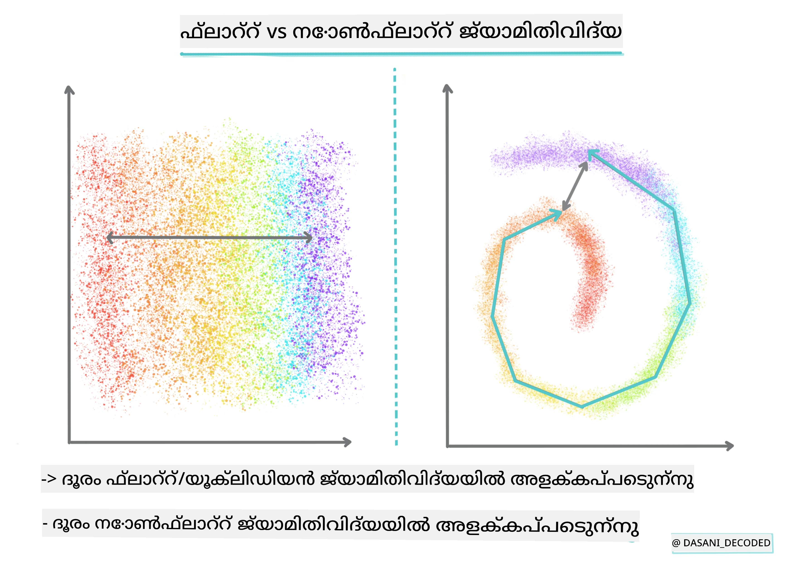
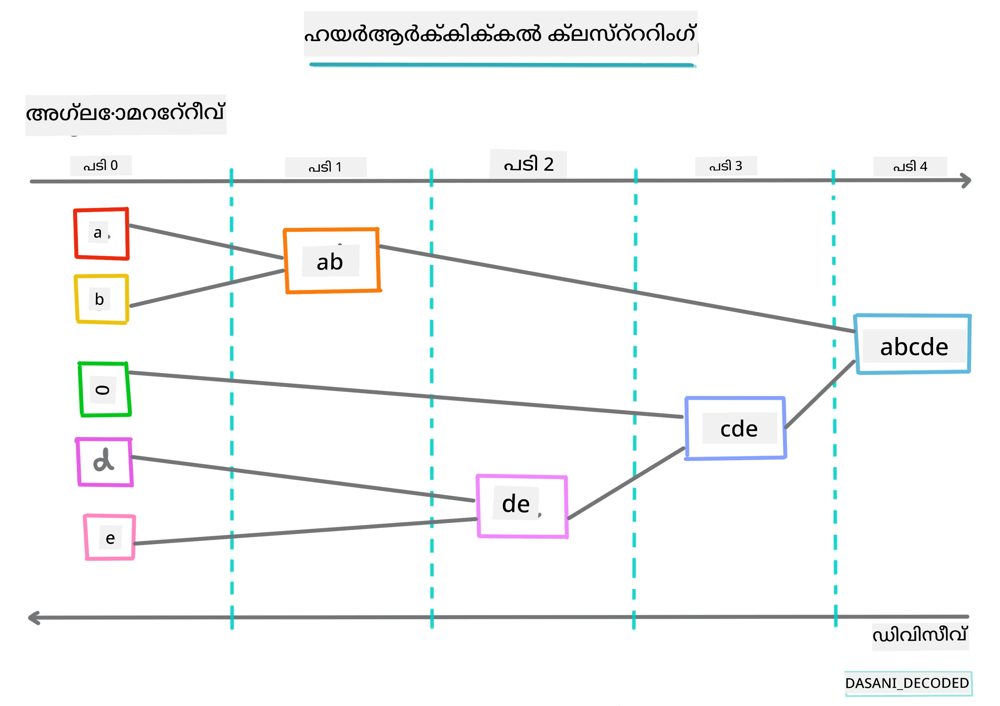
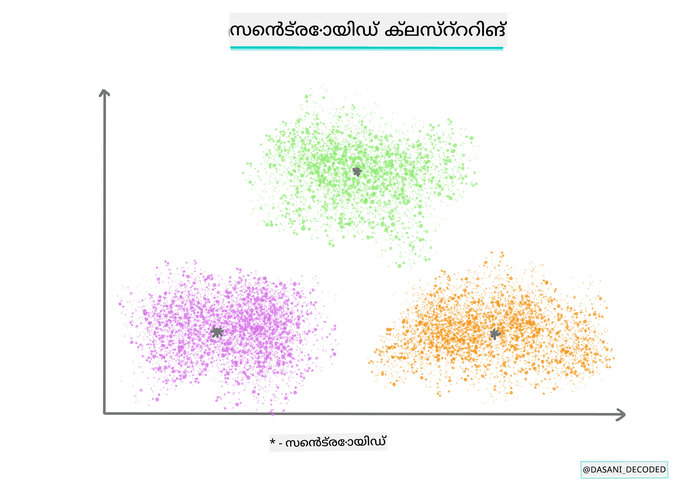
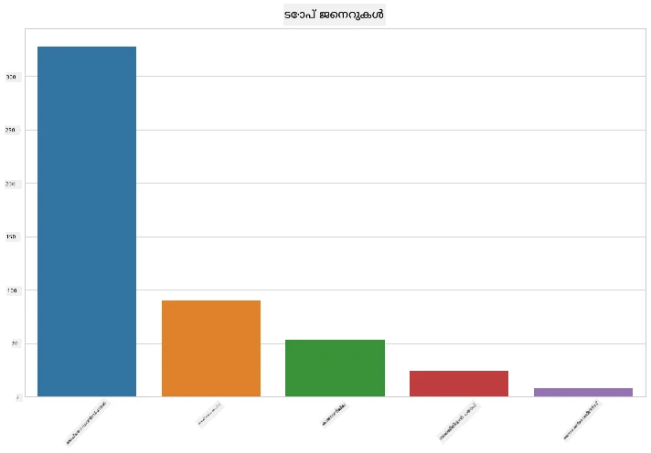
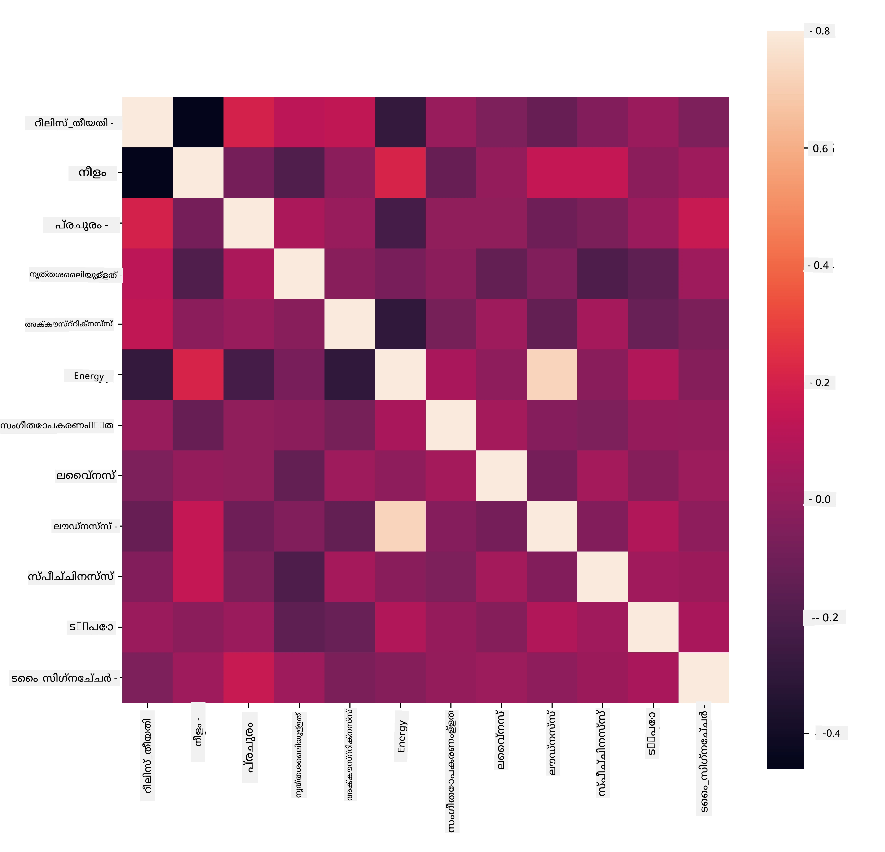
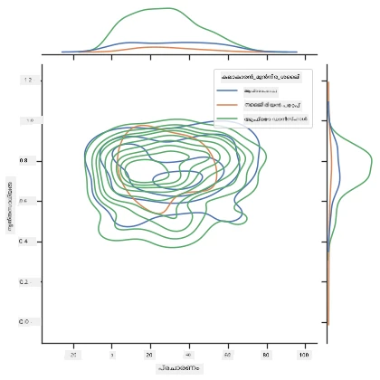
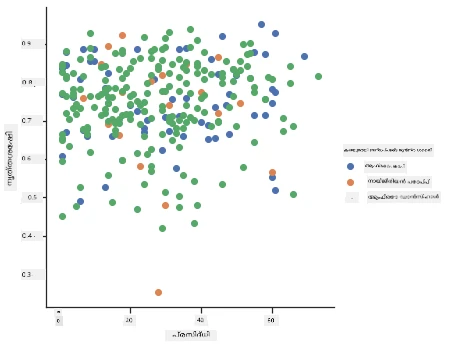

<!--
CO_OP_TRANSLATOR_METADATA:
{
  "original_hash": "730225ea274c9174fe688b21d421539d",
  "translation_date": "2025-12-19T14:59:24+00:00",
  "source_file": "5-Clustering/1-Visualize/README.md",
  "language_code": "ml"
}
-->
# ക്ലസ്റ്ററിംഗിലേക്ക് പരിചയം

ക്ലസ്റ്ററിംഗ് ഒരു തരത്തിലുള്ള [Unsupervised Learning](https://wikipedia.org/wiki/Unsupervised_learning) ആണ്, ഇത് ഒരു ഡാറ്റാസെറ്റ് ലേബൽ ചെയ്യപ്പെടാത്തതാണെന്ന് അല്ലെങ്കിൽ അതിന്റെ ഇൻപുട്ടുകൾ മുൻകൂട്ടി നിർവചിച്ച ഔട്ട്പുട്ടുകളുമായി പൊരുത്തപ്പെടാത്തതാണെന്ന് കരുതുന്നു. ഇത് ലേബൽ ചെയ്യപ്പെടാത്ത ഡാറ്റയിൽ നിന്നു വിവിധ ആൽഗോരിതങ്ങൾ ഉപയോഗിച്ച് ഡാറ്റയിൽ കാണുന്ന പാറ്റേണുകൾ അനുസരിച്ച് ഗ്രൂപ്പുകൾ നൽകുന്നു.

[](https://youtu.be/ty2advRiWJM "No One Like You by PSquare")

> 🎥 മുകളിൽ കാണുന്ന ചിത്രത്തിൽ ക്ലിക്ക് ചെയ്ത് ഒരു വീഡിയോ കാണുക. നിങ്ങൾ ക്ലസ്റ്ററിംഗ് ഉപയോഗിച്ച് മെഷീൻ ലേണിംഗ് പഠിക്കുമ്പോൾ, നൈജീരിയൻ ഡാൻസ് ഹാൾ ട്രാക്കുകൾ ആസ്വദിക്കുക - ഇത് 2014-ലെ PSquare യുടെ വളരെ പ്രശംസിക്കപ്പെട്ട പാട്ടാണ്.

## [പ്രീ-ലെക്ചർ ക്വിസ്](https://ff-quizzes.netlify.app/en/ml/)

### പരിചയം

[ക്ലസ്റ്ററിംഗ്](https://link.springer.com/referenceworkentry/10.1007%2F978-0-387-30164-8_124) ഡാറ്റാ എക്സ്പ്ലോറേഷനിൽ വളരെ ഉപകാരപ്രദമാണ്. നൈജീരിയൻ പ്രേക്ഷകർ സംഗീതം എങ്ങനെ ഉപഭോഗിക്കുന്നു എന്നതിൽ ട്രെൻഡുകളും പാറ്റേണുകളും കണ്ടെത്താൻ ഇത് സഹായിക്കുമോ എന്ന് നോക്കാം.

✅ ക്ലസ്റ്ററിംഗിന്റെ ഉപയോഗങ്ങളെ കുറിച്ച് ഒരു മിനിറ്റ് ചിന്തിക്കുക. യാഥാർത്ഥ്യത്തിൽ, നിങ്ങൾക്ക് വസ്ത്രങ്ങൾ തൊട്ടു തരംതിരിക്കേണ്ടി വന്നപ്പോൾ ക്ലസ്റ്ററിംഗ് സംഭവിക്കുന്നു 🧦👕👖🩲. ഡാറ്റാ സയൻസിൽ, ഉപയോക്താവിന്റെ ഇഷ്ടങ്ങൾ വിശകലനം ചെയ്യുമ്പോഴും, ലേബൽ ചെയ്യപ്പെടാത്ത ഡാറ്റാസെറ്റിന്റെ സവിശേഷതകൾ നിർണയിക്കുമ്പോഴും ക്ലസ്റ്ററിംഗ് സംഭവിക്കുന്നു. ക്ലസ്റ്ററിംഗ് ഒരു വിധത്തിൽ അഴുക്കും കലക്കവും മനസ്സിലാക്കാൻ സഹായിക്കുന്നു, ഒരു സോക്ക് ഡ്രോയർ പോലെ.

[](https://youtu.be/esmzYhuFnds "Introduction to Clustering")

> 🎥 മുകളിൽ കാണുന്ന ചിത്രത്തിൽ ക്ലിക്ക് ചെയ്ത് ഒരു വീഡിയോ കാണുക: MIT-യുടെ ജോൺ ഗുട്ടാഗ് ക്ലസ്റ്ററിംഗ് പരിചയപ്പെടുത്തുന്നു

പ്രൊഫഷണൽ സാഹചര്യത്തിൽ, ക്ലസ്റ്ററിംഗ് മാർക്കറ്റ് സെഗ്മെന്റേഷൻ, ഉദാഹരണത്തിന് ഏത് പ്രായസംഘം ഏത് വസ്തുക്കൾ വാങ്ങുന്നു എന്നത് നിർണയിക്കാൻ ഉപയോഗിക്കാം. മറ്റൊരു ഉപയോഗം അനോമലി ഡിറ്റക്ഷൻ ആയിരിക്കും, ഉദാഹരണത്തിന് ക്രെഡിറ്റ് കാർഡ് ഇടപാടുകളുടെ ഡാറ്റാസെറ്റിൽ നിന്ന് തട്ടിപ്പ് കണ്ടെത്താൻ. അല്ലെങ്കിൽ മെഡിക്കൽ സ്കാനുകളുടെ ബാച്ചിൽ ട്യൂമറുകൾ കണ്ടെത്താൻ ക്ലസ്റ്ററിംഗ് ഉപയോഗിക്കാം.

✅ ബാങ്കിംഗ്, ഇ-കൊമേഴ്സ്, ബിസിനസ് മേഖലകളിൽ നിങ്ങൾ എങ്ങനെ ക്ലസ്റ്ററിംഗ് നേരിട്ടു കാണാമെന്ന് ഒരു മിനിറ്റ് ചിന്തിക്കുക.

> 🎓 രസകരമായി, ക്ലസ്റ്റർ വിശകലനം 1930-കളിൽ ആൻത്രോപോളജി, സൈക്കോളജി മേഖലകളിൽ ആരംഭിച്ചു. ഇത് എങ്ങനെ ഉപയോഗിച്ചിരിക്കാമെന്ന് നിങ്ങൾക്ക് കണക്കാക്കാമോ?

അല്ലെങ്കിൽ, തിരയൽ ഫലങ്ങൾ ഗ്രൂപ്പുചെയ്യാൻ ഉപയോഗിക്കാം - ഷോപ്പിംഗ് ലിങ്കുകൾ, ചിത്രങ്ങൾ, റിവ്യൂകൾ എന്നിവയുടെ അടിസ്ഥാനത്തിൽ. വലിയ ഡാറ്റാസെറ്റുകൾ കുറയ്ക്കാനും കൂടുതൽ സൂക്ഷ്മമായ വിശകലനം നടത്താനും ക്ലസ്റ്ററിംഗ് സഹായിക്കുന്നു, അതിനാൽ മറ്റ് മോഡലുകൾ നിർമ്മിക്കുന്നതിന് മുമ്പ് ഡാറ്റയെ കുറിച്ച് പഠിക്കാൻ ഈ സാങ്കേതിക വിദ്യ ഉപയോഗിക്കാം.

✅ നിങ്ങളുടെ ഡാറ്റ ക്ലസ്റ്ററുകളായി ക്രമീകരിച്ച ശേഷം, അതിന് ക്ലസ്റ്റർ ഐഡി നൽകുന്നു, ഇത് ഡാറ്റാസെറ്റിന്റെ സ്വകാര്യത സംരക്ഷിക്കാൻ സഹായകമാണ്; ഒരു ഡാറ്റാ പോയിന്റിനെ കൂടുതൽ വെളിപ്പെടുത്തുന്ന തിരിച്ചറിയൽ ഡാറ്റയിലൂടെ അല്ല, ക്ലസ്റ്റർ ഐഡി ഉപയോഗിച്ച് സൂചിപ്പിക്കാം. ക്ലസ്റ്റർ ഐഡി ഉപയോഗിക്കുന്നതിന് മറ്റെന്തെങ്കിലും കാരണങ്ങൾ നിങ്ങൾക്ക് തോന്നുന്നുണ്ടോ?

ക്ലസ്റ്ററിംഗ് സാങ്കേതിക വിദ്യകളെ കുറിച്ച് കൂടുതൽ അറിയാൻ ഈ [Learn module](https://docs.microsoft.com/learn/modules/train-evaluate-cluster-models?WT.mc_id=academic-77952-leestott) കാണുക

## ക്ലസ്റ്ററിംഗ് ആരംഭിക്കുന്നത്

[Scikit-learn വലിയൊരു ശ്രേണി](https://scikit-learn.org/stable/modules/clustering.html) ക്ലസ്റ്ററിംഗ് നടത്താനുള്ള രീതികൾ നൽകുന്നു. നിങ്ങൾ തിരഞ്ഞെടുക്കുന്ന തരം നിങ്ങളുടെ ഉപയോഗ കേസിനനുസരിച്ചിരിക്കും. ഡോക്യുമെന്റേഷനുസരിച്ച്, ഓരോ രീതിക്കും വിവിധ ഗുണങ്ങൾ ഉണ്ട്. Scikit-learn പിന്തുണക്കുന്ന രീതികളും അവയുടെ അനുയോജ്യമായ ഉപയോഗ കേസുകളും താഴെ ലളിതമായി കൊടുത്തിരിക്കുന്നു:

| രീതി നാമം                  | ഉപയോഗ കേസ്                                                        |
| :--------------------------- | :----------------------------------------------------------------- |
| K-Means                      | പൊതുവായ ഉപയോഗം, ഇൻഡക്ടീവ്                                      |
| Affinity propagation         | നിരവധി, അസമതുല്യ ക്ലസ്റ്ററുകൾ, ഇൻഡക്ടീവ്                        |
| Mean-shift                   | നിരവധി, അസമതുല്യ ക്ലസ്റ്ററുകൾ, ഇൻഡക്ടീവ്                        |
| Spectral clustering          | കുറച്ച്, സമതുല്യ ക്ലസ്റ്ററുകൾ, ട്രാൻസ്ഡക്ടീവ്                      |
| Ward hierarchical clustering | നിരവധി, നിയന്ത്രിത ക്ലസ്റ്ററുകൾ, ട്രാൻസ്ഡക്ടീവ്                   |
| Agglomerative clustering     | നിരവധി, നിയന്ത്രിത, നോൺ യൂക്ലിഡിയൻ ദൂരം, ട്രാൻസ്ഡക്ടീവ്         |
| DBSCAN                       | നോൺ-ഫ്ലാറ്റ് ജ്യാമിതീയ, അസമതുല്യ ക്ലസ്റ്ററുകൾ, ട്രാൻസ്ഡക്ടീവ്     |
| OPTICS                       | നോൺ-ഫ്ലാറ്റ് ജ്യാമിതീയ, വ്യത്യസ്ത സാന്ദ്രതയുള്ള അസമതുല്യ ക്ലസ്റ്ററുകൾ, ട്രാൻസ്ഡക്ടീവ് |
| Gaussian mixtures            | ഫ്ലാറ്റ് ജ്യാമിതീയ, ഇൻഡക്ടീവ്                                    |
| BIRCH                        | വലിയ ഡാറ്റാസെറ്റ് ഔട്ട്‌ലൈയർമാരോടുകൂടി, ഇൻഡക്ടീവ്               |

> 🎓 ക്ലസ്റ്ററുകൾ സൃഷ്ടിക്കുന്ന വിധം, ഡാറ്റാ പോയിന്റുകൾ ഗ്രൂപ്പുകളായി എങ്ങനെ കൂട്ടിച്ചേർക്കുന്നു എന്നതുമായി ബന്ധപ്പെട്ടതാണ്. ചില പദങ്ങൾ വിശദീകരിക്കാം:
>
> 🎓 ['Transductive' vs. 'inductive'](https://wikipedia.org/wiki/Transduction_(machine_learning))
> 
> ട്രാൻസ്ഡക്ടീവ് ഇൻഫറൻസ് നിരീക്ഷിച്ച പരിശീലന കേസുകളിൽ നിന്നാണ് ഉത്ഭവിക്കുന്നത്, അവ പ്രത്യേക ടെസ്റ്റ് കേസുകളുമായി പൊരുത്തപ്പെടുന്നു. ഇൻഡക്ടീവ് ഇൻഫറൻസ് പരിശീലന കേസുകളിൽ നിന്നാണ് ഉത്ഭവിക്കുന്നത്, അവ പൊതുവായ നിയമങ്ങളിലേക്ക് മാപ്പ് ചെയ്യപ്പെടുന്നു, പിന്നീട് ആ നിയമങ്ങൾ ടെസ്റ്റ് കേസുകളിൽ പ്രയോഗിക്കുന്നു.
> 
> ഉദാഹരണം: നിങ്ങൾക്ക് ഭാഗികമായി മാത്രം ലേബൽ ചെയ്ത ഡാറ്റാസെറ്റ് ഉണ്ടെന്ന് കരുതുക. ചിലത് 'റെക്കോർഡുകൾ', ചിലത് 'സിഡികൾ', ചിലത് ശൂന്യമാണ്. ശൂന്യമായവയ്ക്ക് ലേബലുകൾ നൽകുക എന്നതാണ് നിങ്ങളുടെ ജോലി. ഇൻഡക്ടീവ് സമീപനം തിരഞ്ഞെടുക്കുകയാണെങ്കിൽ, 'റെക്കോർഡുകൾ'യും 'സിഡികളും' കണ്ടെത്താൻ മോഡൽ പരിശീലിപ്പിച്ച് ആ ലേബലുകൾ ലേബൽ ചെയ്യപ്പെടാത്ത ഡാറ്റയിൽ പ്രയോഗിക്കും. ഈ സമീപനം 'കാസറ്റുകൾ' എന്നതിനെ ശരിയായി തിരിച്ചറിയാൻ ബുദ്ധിമുട്ടും. മറുവശത്ത്, ട്രാൻസ്ഡക്ടീവ് സമീപനം ഈ അജ്ഞാത ഡാറ്റയെ കൂടുതൽ ഫലപ്രദമായി കൈകാര്യം ചെയ്യുന്നു, സമാനമായ വസ്തുക്കൾ ഗ്രൂപ്പുചെയ്യുകയും ഗ്രൂപ്പിന് ലേബൽ നൽകുകയും ചെയ്യുന്നു. ഈ സാഹചര്യത്തിൽ, ക്ലസ്റ്ററുകൾ 'വൃത്താകൃതിയിലുള്ള സംഗീത വസ്തുക്കൾ'യും 'ചതുരാകൃതിയിലുള്ള സംഗീത വസ്തുക്കൾ'യും പ്രതിഫലിപ്പിക്കാം.
> 
> 🎓 ['Non-flat' vs. 'flat' geometry](https://datascience.stackexchange.com/questions/52260/terminology-flat-geometry-in-the-context-of-clustering)
> 
> ഗണിതശാസ്ത്ര പദങ്ങൾ നിന്നാണ് നോൺ-ഫ്ലാറ്റ് vs. ഫ്ലാറ്റ് ജ്യാമിതീയ എന്നത് ഉത്ഭവിച്ചത്, ഇത് പോയിന്റുകൾ തമ്മിലുള്ള ദൂരം 'ഫ്ലാറ്റ്' ([Euclidean](https://wikipedia.org/wiki/Euclidean_geometry)) അല്ലെങ്കിൽ 'നോൺ-ഫ്ലാറ്റ്' (നോൺ-യൂക്ലിഡിയൻ) ജ്യാമിതീയ രീതികളിൽ അളക്കുന്നതിനെ സൂചിപ്പിക്കുന്നു.
>
> ഈ സന്ദർഭത്തിൽ 'ഫ്ലാറ്റ്' യൂക്ലിഡിയൻ ജ്യാമിതീയത്തെയാണ് സൂചിപ്പിക്കുന്നത് (ഇതിന്റെ ഭാഗങ്ങൾ 'പ്ലെയിൻ' ജ്യാമിതീയമായി പഠിപ്പിക്കുന്നു), നോൺ-ഫ്ലാറ്റ് നോൺ-യൂക്ലിഡിയൻ ജ്യാമിതീയമാണ്. മെഷീൻ ലേണിംഗുമായി ജ്യാമിതീയത്തിന് എന്ത് ബന്ധമുണ്ട്? ഗണിതശാസ്ത്രത്തിൽ ആധാരമാക്കിയ രണ്ട് മേഖലകളായതിനാൽ, ക്ലസ്റ്ററുകളിലെ പോയിന്റുകൾ തമ്മിലുള്ള ദൂരം അളക്കാനുള്ള ഒരു പൊതുവായ മാർഗ്ഗം വേണം, അത് 'ഫ്ലാറ്റ്' അല്ലെങ്കിൽ 'നോൺ-ഫ്ലാറ്റ്' രീതിയിലായിരിക്കും, ഡാറ്റയുടെ സ്വഭാവം അനുസരിച്ച്. [Euclidean distances](https://wikipedia.org/wiki/Euclidean_distance) രണ്ട് പോയിന്റുകൾ തമ്മിലുള്ള രേഖാഖണ്ഡത്തിന്റെ നീളമായി അളക്കപ്പെടുന്നു. [Non-Euclidean distances](https://wikipedia.org/wiki/Non-Euclidean_geometry) ഒരു വളവിലൂടെ അളക്കപ്പെടുന്നു. നിങ്ങളുടെ ഡാറ്റ, ദൃശ്യവൽക്കരിച്ചപ്പോൾ, ഒരു സമതലത്തിൽ ഇല്ലാത്തതുപോലെ തോന്നുകയാണെങ്കിൽ, അതിനെ കൈകാര്യം ചെയ്യാൻ പ്രത്യേക ആൽഗോരിതം ഉപയോഗിക്കേണ്ടി വരും.
>

> ഇൻഫോഗ്രാഫിക്: [ദാസാനി മടിപള്ളി](https://twitter.com/dasani_decoded)
> 
> 🎓 ['Distances'](https://web.stanford.edu/class/cs345a/slides/12-clustering.pdf)
> 
> ക്ലസ്റ്ററുകൾ അവരുടെ ദൂരം മാട്രിക്സ് (distance matrix) പ്രകാരം നിർവചിക്കപ്പെടുന്നു, ഉദാ: പോയിന്റുകൾ തമ്മിലുള്ള ദൂരം. ഈ ദൂരം ചില രീതികളിൽ അളക്കാം. യൂക്ലിഡിയൻ ക്ലസ്റ്ററുകൾ പോയിന്റ് മൂല്യങ്ങളുടെ ശരാശരിയാൽ നിർവചിക്കപ്പെടുന്നു, അവയ്ക്ക് 'സെൻട്രോയിഡ്' അല്ലെങ്കിൽ കേന്ദ്ര പോയിന്റ് ഉണ്ട്. ദൂരം ആ സെൻട്രോയിഡിലേക്കുള്ള ദൂരം അളക്കിയാണ്. നോൺ-യൂക്ലിഡിയൻ ദൂരം 'ക്ലസ്റ്റ്രോയിഡുകൾ' എന്നതിനെ സൂചിപ്പിക്കുന്നു, അത് മറ്റുള്ള പോയിന്റുകൾക്ക് ഏറ്റവും അടുത്തുള്ള പോയിന്റ് ആണ്. ക്ലസ്റ്റ്രോയിഡുകൾ പലവിധം നിർവചിക്കാം.
> 
> 🎓 ['Constrained'](https://wikipedia.org/wiki/Constrained_clustering)
> 
> [Constrained Clustering](https://web.cs.ucdavis.edu/~davidson/Publications/ICDMTutorial.pdf) ഈ അൺസൂപ്പർവൈസ്ഡ് രീതിയിൽ 'സെമി-സൂപ്പർവൈസ്ഡ്' പഠനം പരിചയപ്പെടുത്തുന്നു. പോയിന്റുകൾ തമ്മിലുള്ള ബന്ധങ്ങൾ 'cannot link' അല്ലെങ്കിൽ 'must-link' ആയി അടയാളപ്പെടുത്തുന്നു, അതിനാൽ ഡാറ്റാസെറ്റിൽ ചില നിയമങ്ങൾ ബാധകമാക്കുന്നു.
>
> ഉദാഹരണം: ഒരു ആൽഗോരിതം ലേബൽ ചെയ്യപ്പെടാത്ത അല്ലെങ്കിൽ ഭാഗികമായി ലേബൽ ചെയ്ത ഡാറ്റാസെറ്റിൽ സ്വതന്ത്രമായി പ്രവർത്തിക്കുമ്പോൾ, അത് സൃഷ്ടിക്കുന്ന ക്ലസ്റ്ററുകൾ ഗുണമേന്മയില്ലായ്മ കാണിക്കാം. മുകളിൽ നൽകിയ ഉദാഹരണത്തിൽ, ക്ലസ്റ്ററുകൾ 'വൃത്താകൃതിയിലുള്ള സംഗീത വസ്തുക്കൾ', 'ചതുരാകൃതിയിലുള്ള സംഗീത വസ്തുക്കൾ', 'ത്രികോണാകൃതിയിലുള്ള വസ്തുക്കൾ', 'കുക്കീസ്' എന്നിങ്ങനെ ഗ്രൂപ്പാക്കാം. ചില നിയന്ത്രണങ്ങൾ ("വസ്തു പ്ലാസ്റ്റിക്കിൽ നിന്നായിരിക്കണം", "വസ്തു സംഗീതം ഉത്പാദിപ്പിക്കാൻ കഴിയണം") നൽകിയാൽ ആൽഗോരിതം മികച്ച തിരഞ്ഞെടുപ്പുകൾ നടത്താൻ സഹായിക്കും.
> 
> 🎓 'Density'
> 
> 'നോയിസി' ആയ ഡാറ്റ 'ഡെൻസായി' കണക്കാക്കപ്പെടുന്നു. ഓരോ ക്ലസ്റ്ററിലെയും പോയിന്റുകൾ തമ്മിലുള്ള ദൂരം പരിശോധിച്ചാൽ, അത് കൂടുതൽ അല്ലെങ്കിൽ കുറവ് ഡെൻസായിരിക്കാം, അതായത് 'കൂട്ടം' ആയിരിക്കാം, അതിനാൽ ഈ ഡാറ്റ അനുയോജ്യമായ ക്ലസ്റ്ററിംഗ് രീതിയോടെ വിശകലനം ചെയ്യേണ്ടതാണ്. [ഈ ലേഖനം](https://www.kdnuggets.com/2020/02/understanding-density-based-clustering.html) K-Means ക്ലസ്റ്ററിംഗ് എതിരായി HDBSCAN ആൽഗോരിതങ്ങൾ ഉപയോഗിച്ച് അസമതുല്യ ക്ലസ്റ്റർ സാന്ദ്രതയുള്ള നോയിസി ഡാറ്റാസെറ്റ് എങ്ങനെ പരിശോധിക്കാമെന്ന് കാണിക്കുന്നു.

## ക്ലസ്റ്ററിംഗ് ആൽഗോരിതങ്ങൾ

100-ലധികം ക്ലസ്റ്ററിംഗ് ആൽഗോരിതങ്ങൾ ഉണ്ട്, അവയുടെ ഉപയോഗം ഡാറ്റയുടെ സ്വഭാവത്തെ ആശ്രയിച്ചിരിക്കുന്നു. പ്രധാന ചിലതിനെ കുറിച്ച് ചർച്ച ചെയ്യാം:

- **ഹയർആർക്കിക്കൽ ക്ലസ്റ്ററിംഗ്**. ഒരു വസ്തു അടുത്തുള്ള മറ്റൊരു വസ്തുവിന്റെ സമീപത പ്രകാരം വർഗ്ഗീകരിക്കപ്പെടുമ്പോൾ, ക്ലസ്റ്ററുകൾ അവരുടെ അംഗങ്ങളുടെ മറ്റുള്ള വസ്തുക്കളോടുള്ള ദൂരത്തിന്റെ അടിസ്ഥാനത്തിൽ രൂപപ്പെടുന്നു. Scikit-learn-ന്റെ അഗ്ലോമറേറ്റീവ് ക്ലസ്റ്ററിംഗ് ഹയർആർക്കിക്കൽ ആണ്.

   
   > ഇൻഫോഗ്രാഫിക്: [ദാസാനി മടിപള്ളി](https://twitter.com/dasani_decoded)

- **സെൻട്രോയിഡ് ക്ലസ്റ്ററിംഗ്**. ഈ ജനപ്രിയ ആൽഗോരിതം 'k' എന്ന ക്ലസ്റ്ററുകളുടെ എണ്ണം തിരഞ്ഞെടുക്കേണ്ടതുണ്ട്, തുടർന്ന് ആൽഗോരിതം ഒരു ക്ലസ്റ്ററിന്റെ കേന്ദ്ര പോയിന്റ് നിർണയിച്ച് ആ പോയിന്റിന്റെ ചുറ്റും ഡാറ്റാ ശേഖരിക്കുന്നു. [K-means clustering](https://wikipedia.org/wiki/K-means_clustering) സെൻട്രോയിഡ് ക്ലസ്റ്ററിംഗിന്റെ ജനപ്രിയ പതിപ്പാണ്. കേന്ദ്രം അടുത്ത ശരാശരിയാൽ നിർണയിക്കുന്നു, അതുകൊണ്ടാണ് പേര്. ക്ലസ്റ്ററിൽ നിന്നുള്ള ചതുരശ്ര ദൂരം കുറഞ്ഞു പോകുന്നു.

   
   > ഇൻഫോഗ്രാഫിക്: [ദാസാനി മടിപള്ളി](https://twitter.com/dasani_decoded)

- **വിതരണ അടിസ്ഥാനത്തിലുള്ള ക്ലസ്റ്ററിംഗ്**. സാംഖ്യിക മോഡലിംഗിൽ ആധാരമാക്കിയ, ഒരു ഡാറ്റാ പോയിന്റ് ഒരു ക്ലസ്റ്ററിന് പറ്റിയതായിരിക്കാനുള്ള സാധ്യത നിർണയിച്ച് അതനുസരിച്ച് അത് നിയോഗിക്കുന്നു. Gaussian മിശ്രിത രീതികൾ ഇതിൽപ്പെടുന്നു.

- **സാന്ദ്രത അടിസ്ഥാനത്തിലുള്ള ക്ലസ്റ്ററിംഗ്**. ഡാറ്റാ പോയിന്റുകൾ അവരുടെ സാന്ദ്രതയുടെ അടിസ്ഥാനത്തിൽ ക്ലസ്റ്ററുകളിലേക്ക് നിയോഗിക്കപ്പെടുന്നു, അഥവാ പരസ്പരം ചുറ്റിപ്പറ്റിയിരിക്കുന്നതിന്റെ അടിസ്ഥാനത്തിൽ. ഗ്രൂപ്പിൽ നിന്ന് ദൂരെ ഉള്ള പോയിന്റുകൾ ഔട്ട്‌ലൈയർസ് അല്ലെങ്കിൽ നോയിസ് ആയി കണക്കാക്കപ്പെടുന്നു. DBSCAN, Mean-shift, OPTICS ഈ തരത്തിലുള്ള ക്ലസ്റ്ററിംഗിൽപ്പെടുന്നു.

- **ഗ്രിഡ് അടിസ്ഥാനത്തിലുള്ള ക്ലസ്റ്ററിംഗ്**. ബഹുമാനദണ്ഡ ഡാറ്റാസെറ്റുകൾക്കായി ഒരു ഗ്രിഡ് സൃഷ്ടിച്ച് ഡാറ്റ ഗ്രിഡിന്റെ സെല്ലുകളിൽ വിഭജിച്ച് ക്ലസ്റ്ററുകൾ സൃഷ്ടിക്കുന്നു.

## അഭ്യാസം - നിങ്ങളുടെ ഡാറ്റ ക്ലസ്റ്റർ ചെയ്യുക

ക്ലസ്റ്ററിംഗ് സാങ്കേതിക വിദ്യയ്ക്ക് ശരിയായ ദൃശ്യവൽക്കരണം വളരെ സഹായകരമാണ്, അതിനാൽ നമ്മുടെ സംഗീത ഡാറ്റ ദൃശ്യവൽക്കരിച്ച് തുടങ്ങാം. ഈ അഭ്യാസം ഈ ഡാറ്റയുടെ സ്വഭാവത്തിന് ഏറ്റവും ഫലപ്രദമായി ഉപയോഗിക്കാവുന്ന ക്ലസ്റ്ററിംഗ് രീതികൾ തിരഞ്ഞെടുക്കാൻ സഹായിക്കും.

1. ഈ ഫോൾഡറിൽ ഉള്ള [_notebook.ipynb_](https://github.com/microsoft/ML-For-Beginners/blob/main/5-Clustering/1-Visualize/notebook.ipynb) ഫയൽ തുറക്കുക.

1. നല്ല ഡാറ്റാ ദൃശ്യവൽക്കരണത്തിനായി `Seaborn` പാക്കേജ് ഇറക്കുമതി ചെയ്യുക.

    ```python
    !pip install seaborn
    ```

1. [_nigerian-songs.csv_](https://github.com/microsoft/ML-For-Beginners/blob/main/5-Clustering/data/nigerian-songs.csv) ഫയലിൽ നിന്നുള്ള പാട്ടുകളുടെ ഡാറ്റ ചേർക്കുക. പാട്ടുകളെക്കുറിച്ചുള്ള ചില ഡാറ്റയുള്ള ഒരു ഡാറ്റാഫ്രെയിം ലോഡ് ചെയ്യുക. ലൈബ്രറികൾ ഇറക്കുമതി ചെയ്ത് ഡാറ്റ പുറത്തെടുക്കാൻ തയ്യാറാകുക:

    ```python
    import matplotlib.pyplot as plt
    import pandas as pd
    
    df = pd.read_csv("../data/nigerian-songs.csv")
    df.head()
    ```

    ഡാറ്റയുടെ ആദ്യ കുറച്ച് വരികൾ പരിശോധിക്കുക:

    |     | name                     | album                        | artist              | artist_top_genre | release_date | length | popularity | danceability | acousticness | energy | instrumentalness | liveness | loudness | speechiness | tempo   | time_signature |
    | --- | ------------------------ | ---------------------------- | ------------------- | ---------------- | ------------ | ------ | ---------- | ------------ | ------------ | ------ | ---------------- | -------- | -------- | ----------- | ------- | -------------- |
    | 0   | Sparky                   | Mandy & The Jungle           | Cruel Santino       | alternative r&b  | 2019         | 144000 | 48         | 0.666        | 0.851        | 0.42   | 0.534            | 0.11     | -6.699   | 0.0829      | 133.015 | 5              |
    | 1   | shuga rush               | EVERYTHING YOU HEARD IS TRUE | Odunsi (The Engine) | afropop          | 2020         | 89488  | 30         | 0.71         | 0.0822       | 0.683  | 0.000169         | 0.101    | -5.64    | 0.36        | 129.993 | 3              |
    | 2   | LITT!                    | LITT!                        | AYLØ                | indie r&b        | 2018         | 207758 | 40         | 0.836        | 0.272        | 0.564  | 0.000537         | 0.11     | -7.127   | 0.0424      | 130.005 | 4              |
    | 3   | Confident / Feeling Cool | Enjoy Your Life              | Lady Donli          | nigerian pop     | 2019         | 175135 | 14         | 0.894        | 0.798        | 0.611  | 0.000187         | 0.0964   | -4.961   | 0.113       | 111.087 | 4              |
    | 4   | wanted you               | rare.                        | Odunsi (The Engine) | afropop          | 2018         | 152049 | 25         | 0.702        | 0.116        | 0.833  | 0.91             | 0.348    | -6.044   | 0.0447      | 105.115 | 4              |

1. ഡാറ്റാഫ്രെയിമിനെക്കുറിച്ച് ചില വിവരങ്ങൾ നേടുക, `info()` വിളിച്ച്:

    ```python
    df.info()
    ```

   ഔട്ട്പുട്ട് ഇങ്ങനെ കാണപ്പെടും:

    ```output
    <class 'pandas.core.frame.DataFrame'>
    RangeIndex: 530 entries, 0 to 529
    Data columns (total 16 columns):
     #   Column            Non-Null Count  Dtype  
    ---  ------            --------------  -----  
     0   name              530 non-null    object 
     1   album             530 non-null    object 
     2   artist            530 non-null    object 
     3   artist_top_genre  530 non-null    object 
     4   release_date      530 non-null    int64  
     5   length            530 non-null    int64  
     6   popularity        530 non-null    int64  
     7   danceability      530 non-null    float64
     8   acousticness      530 non-null    float64
     9   energy            530 non-null    float64
     10  instrumentalness  530 non-null    float64
     11  liveness          530 non-null    float64
     12  loudness          530 non-null    float64
     13  speechiness       530 non-null    float64
     14  tempo             530 non-null    float64
     15  time_signature    530 non-null    int64  
    dtypes: float64(8), int64(4), object(4)
    memory usage: 66.4+ KB
    ```

1. നൾ മൂല്യങ്ങൾക്കായി ഇരട്ട പരിശോധന നടത്തുക, `isnull()` വിളിച്ച് സംഖ്യ 0 ആണെന്ന് ഉറപ്പാക്കുക:

    ```python
    df.isnull().sum()
    ```

    എല്ലാം ശരിയാണെന്ന് കാണുന്നു:

    ```output
    name                0
    album               0
    artist              0
    artist_top_genre    0
    release_date        0
    length              0
    popularity          0
    danceability        0
    acousticness        0
    energy              0
    instrumentalness    0
    liveness            0
    loudness            0
    speechiness         0
    tempo               0
    time_signature      0
    dtype: int64
    ```

1. ഡാറ്റ വിവരണം ചെയ്യുക:

    ```python
    df.describe()
    ```

    |       | release_date | length      | popularity | danceability | acousticness | energy   | instrumentalness | liveness | loudness  | speechiness | tempo      | time_signature |
    | ----- | ------------ | ----------- | ---------- | ------------ | ------------ | -------- | ---------------- | -------- | --------- | ----------- | ---------- | -------------- |
    | count | 530          | 530         | 530        | 530          | 530          | 530      | 530              | 530      | 530       | 530         | 530        | 530            |
    | mean  | 2015.390566  | 222298.1698 | 17.507547  | 0.741619     | 0.265412     | 0.760623 | 0.016305         | 0.147308 | -4.953011 | 0.130748    | 116.487864 | 3.986792       |
    | std   | 3.131688     | 39696.82226 | 18.992212  | 0.117522     | 0.208342     | 0.148533 | 0.090321         | 0.123588 | 2.464186  | 0.092939    | 23.518601  | 0.333701       |
    | min   | 1998         | 89488       | 0          | 0.255        | 0.000665     | 0.111    | 0                | 0.0283   | -19.362   | 0.0278      | 61.695     | 3              |
    | 25%   | 2014         | 199305      | 0          | 0.681        | 0.089525     | 0.669    | 0                | 0.07565  | -6.29875  | 0.0591      | 102.96125  | 4              |
    | 50%   | 2016         | 218509      | 13         | 0.761        | 0.2205       | 0.7845   | 0.000004         | 0.1035   | -4.5585   | 0.09795     | 112.7145   | 4              |
    | 75%   | 2017         | 242098.5    | 31         | 0.8295       | 0.403        | 0.87575  | 0.000234         | 0.164    | -3.331    | 0.177       | 125.03925  | 4              |
    | max   | 2020         | 511738      | 73         | 0.966        | 0.954        | 0.995    | 0.91             | 0.811    | 0.582     | 0.514       | 206.007    | 5              |

> 🤔 നാം ലേബൽ ചെയ്ത ഡാറ്റ ആവശ്യമില്ലാത്ത ഒരു അൺസൂപ്പർവൈസ്ഡ് ക്ലസ്റ്ററിംഗ് രീതിയുമായി പ്രവർത്തിക്കുമ്പോൾ, ഈ ലേബലുകളുള്ള ഡാറ്റ കാണിക്കുന്നത് എന്തുകൊണ്ടാണ്? ഡാറ്റ എക്സ്പ്ലോറേഷൻ ഘട്ടത്തിൽ ഇവ സഹായകരമാണ്, പക്ഷേ ക്ലസ്റ്ററിംഗ് ആൽഗോരിതങ്ങൾ പ്രവർത്തിക്കാൻ അവ ആവശ്യമായില്ല. നിങ്ങൾക്ക് കോളം തലക്കെട്ടുകൾ നീക്കം ചെയ്ത് ഡാറ്റ കോളം നമ്പറുകൾ ഉപയോഗിച്ച് കാണിക്കാം.

ഡാറ്റയുടെ പൊതുവായ മൂല്യങ്ങൾ നോക്കുക. ജനപ്രിയത 0 ആകാമെന്ന് ശ്രദ്ധിക്കുക, അതായത് റാങ്ക് ഇല്ലാത്ത പാട്ടുകൾ. അവ ഉടൻ നീക്കം ചെയ്യാം.

1. ഏറ്റവും ജനപ്രിയമായ ജാനറുകൾ കണ്ടെത്താൻ ബാർപ്ലോട്ട് ഉപയോഗിക്കുക:

    ```python
    import seaborn as sns
    
    top = df['artist_top_genre'].value_counts()
    plt.figure(figsize=(10,7))
    sns.barplot(x=top[:5].index,y=top[:5].values)
    plt.xticks(rotation=45)
    plt.title('Top genres',color = 'blue')
    ```

    

✅ കൂടുതൽ ടോപ്പ് മൂല്യങ്ങൾ കാണാൻ ആഗ്രഹിക്കുന്നുവെങ്കിൽ, ടോപ്പ് `[:5]` വലുതാക്കുക അല്ലെങ്കിൽ നീക്കം ചെയ്ത് എല്ലാം കാണുക.

ശ്രദ്ധിക്കുക, ടോപ്പ് ജാനർ 'Missing' എന്ന് കാണിച്ചാൽ, അത് Spotify ക്ലാസിഫൈ ചെയ്തിട്ടില്ല എന്നർത്ഥം, അതിനാൽ അത് നീക്കം ചെയ്യാം.

1. മിസ്സിംഗ് ഡാറ്റ ഫിൽട്ടർ ചെയ്ത് നീക്കം ചെയ്യുക

    ```python
    df = df[df['artist_top_genre'] != 'Missing']
    top = df['artist_top_genre'].value_counts()
    plt.figure(figsize=(10,7))
    sns.barplot(x=top.index,y=top.values)
    plt.xticks(rotation=45)
    plt.title('Top genres',color = 'blue')
    ```

    ഇപ്പോൾ ജാനറുകൾ വീണ്ടും പരിശോധിക്കുക:

    

1. ഇതുവരെ, ടോപ്പ് മൂന്ന് ജാനറുകൾ ഈ ഡാറ്റാസെറ്റിൽ ഭൂരിപക്ഷം കൈവശം വയ്ക്കുന്നു. `afro dancehall`, `afropop`, `nigerian pop` എന്നിവയിൽ ശ്രദ്ധ കേന്ദ്രീകരിക്കുക, കൂടാതെ ജനപ്രിയത 0 ഉള്ളവ നീക്കം ചെയ്യുക (അർത്ഥം, ഡാറ്റാസെറ്റിൽ ജനപ്രിയതയില്ലാത്തവ, നമ്മുടെ ആവശ്യങ്ങൾക്ക് ശബ്ദം ആയി കണക്കാക്കാം):

    ```python
    df = df[(df['artist_top_genre'] == 'afro dancehall') | (df['artist_top_genre'] == 'afropop') | (df['artist_top_genre'] == 'nigerian pop')]
    df = df[(df['popularity'] > 0)]
    top = df['artist_top_genre'].value_counts()
    plt.figure(figsize=(10,7))
    sns.barplot(x=top.index,y=top.values)
    plt.xticks(rotation=45)
    plt.title('Top genres',color = 'blue')
    ```

1. ഡാറ്റയിൽ ശക്തമായ ബന്ധം ഉണ്ടോ എന്ന് ഒരു വേഗത്തിലുള്ള പരിശോധന നടത്തുക:

    ```python
    corrmat = df.corr(numeric_only=True)
    f, ax = plt.subplots(figsize=(12, 9))
    sns.heatmap(corrmat, vmax=.8, square=True)
    ```

    

    ഏകദേശം ശക്തമായ ബന്ധം `energy` ഉം `loudness` ഉം തമ്മിലാണുള്ളത്, അതും അത്ഭുതകരമല്ല, കാരണം ശബ്ദം ഉയർന്ന സംഗീതം സാധാരണയായി ഊർജ്ജസ്വലമാണ്. മറ്റുള്ള ബന്ധങ്ങൾ വളരെ ദുർബലമാണ്. ഈ ഡാറ്റയിൽ ക്ലസ്റ്ററിംഗ് ആൽഗോരിതം എന്ത് കണ്ടെത്തും എന്ന് കാണുന്നത് രസകരമായിരിക്കും.

    > 🎓 ബന്ധം കാരണസംബന്ധം സൂചിപ്പിക്കുന്നില്ല! ബന്ധം തെളിവുണ്ട്, കാരണസംബന്ധം തെളിവില്ല. [ഒരു രസകരമായ വെബ്‌സൈറ്റ്](https://tylervigen.com/spurious-correlations) ഈ കാര്യത്തെ ഊന്നിപ്പറയുന്ന ദൃശ്യങ്ങൾ നൽകുന്നു.

ഈ ഡാറ്റാസെറ്റിൽ പാട്ടിന്റെ ജനപ്രിയതയും ഡാൻസബിലിറ്റിയും തമ്മിൽ ഏതെങ്കിലും ഏകീകൃതതയുണ്ടോ? ഒരു FacetGrid കാണിക്കുന്നു, ജാനറിനെ ആശ്രയിക്കാതെ ഏകീകൃതമായ വൃത്തങ്ങൾ വരുന്നു. നൈജീരിയൻ രുചികൾ ഈ ജാനറിനായി ഒരു നിശ്ചിത ഡാൻസബിലിറ്റി നിലയിൽ ഏകീകൃതമാകാമോ?

✅ വ്യത്യസ്ത ഡാറ്റാപോയിന്റുകൾ (energy, loudness, speechiness) പരീക്ഷിക്കുക, കൂടാതെ കൂടുതൽ അല്ലെങ്കിൽ വ്യത്യസ്ത സംഗീത ജാനറുകൾ പരീക്ഷിക്കുക. എന്ത് കണ്ടെത്താം? പൊതുവായ ഡാറ്റാ പോയിന്റുകളുടെ വ്യാപ്തി കാണാൻ `df.describe()` പട്ടിക നോക്കുക.

### അഭ്യാസം - ഡാറ്റ വിതരണവും

ജനപ്രിയതയുടെ അടിസ്ഥാനത്തിൽ ഈ മൂന്ന് ജാനറുകൾ ഡാൻസബിലിറ്റിയിൽ ഗണ്യമായ വ്യത്യാസമുണ്ടോ?

1. ജനപ്രിയതയും ഡാൻസബിലിറ്റിയും നൽകിയ x, y അക്ഷങ്ങളിൽ ടോപ്പ് മൂന്ന് ജാനറുകളുടെ ഡാറ്റ വിതരണവും പരിശോധിക്കുക.

    ```python
    sns.set_theme(style="ticks")
    
    g = sns.jointplot(
        data=df,
        x="popularity", y="danceability", hue="artist_top_genre",
        kind="kde",
    )
    ```

    പൊതുവായ ഏകീകൃത ബിന്ദുവിന്റെ ചുറ്റും ഏകീകൃത വൃത്തങ്ങൾ കണ്ടെത്താം, പോയിന്റുകളുടെ വിതരണത്തെ കാണിക്കുന്നു.

    > 🎓 ഈ ഉദാഹരണം KDE (Kernel Density Estimate) ഗ്രാഫ് ഉപയോഗിക്കുന്നു, ഇത് ഡാറ്റ തുടർച്ചയായ പ്രൊബബിലിറ്റി ഡെൻസിറ്റി വളർച്ച ഉപയോഗിച്ച് പ്രതിനിധാനം ചെയ്യുന്നു. ഇത് പല വിതരണങ്ങളുമായി പ്രവർത്തിക്കുമ്പോൾ ഡാറ്റ വ്യാഖ്യാനിക്കാൻ സഹായിക്കുന്നു.

    പൊതുവായി, ഈ മൂന്ന് ജാനറുകൾ ജനപ്രിയതയിലും ഡാൻസബിലിറ്റിയിലും അല്പം സാരമായ ഏകീകരണം കാണിക്കുന്നു. ഈ അല്പം ഏകീകരിച്ച ഡാറ്റയിൽ ക്ലസ്റ്ററുകൾ കണ്ടെത്തുന്നത് ഒരു വെല്ലുവിളിയാകും:

    

1. ഒരു സ്കാറ്റർ പ്ലോട്ട് സൃഷ്ടിക്കുക:

    ```python
    sns.FacetGrid(df, hue="artist_top_genre", height=5) \
       .map(plt.scatter, "popularity", "danceability") \
       .add_legend()
    ```

    സമാന അക്ഷങ്ങളുള്ള സ്കാറ്റർപ്ലോട്ട് ഏകീകൃത മാതൃക കാണിക്കുന്നു

    

പൊതുവായി, ക്ലസ്റ്ററിംഗിനായി, ഡാറ്റ ക്ലസ്റ്ററുകൾ കാണിക്കാൻ സ്കാറ്റർപ്ലോട്ടുകൾ ഉപയോഗിക്കാം, അതിനാൽ ഈ തരത്തിലുള്ള ദൃശ്യീകരണം നന്നായി പഠിക്കുക വളരെ പ്രയോജനകരമാണ്. അടുത്ത പാഠത്തിൽ, ഈ ഫിൽട്ടർ ചെയ്ത ഡാറ്റ ഉപയോഗിച്ച് k-means ക്ലസ്റ്ററിംഗ് ഉപയോഗിച്ച് ഈ ഡാറ്റയിൽ താൽപ്പര്യമുള്ള രീതിയിൽ ഒത്തുചേരുന്ന ഗ്രൂപ്പുകൾ കണ്ടെത്തും.

---

## 🚀ചലഞ്ച്

അടുത്ത പാഠത്തിനായി, നിങ്ങൾ കണ്ടെത്താനും പ്രൊഡക്ഷൻ പരിസരത്തിൽ ഉപയോഗിക്കാനും കഴിയുന്ന വിവിധ ക്ലസ്റ്ററിംഗ് ആൽഗോരിതങ്ങൾക്കുറിച്ച് ഒരു ചാർട്ട് തയ്യാറാക്കുക. ക്ലസ്റ്ററിംഗ് ഏത് തരത്തിലുള്ള പ്രശ്നങ്ങൾ പരിഹരിക്കാൻ ശ്രമിക്കുന്നു?

## [പോസ്റ്റ്-ലെക്ചർ ക്വിസ്](https://ff-quizzes.netlify.app/en/ml/)

## അവലോകനം & സ്വയം പഠനം

ക്ലസ്റ്ററിംഗ് ആൽഗോരിതങ്ങൾ പ്രയോഗിക്കുന്നതിന് മുമ്പ്, നിങ്ങളുടെ ഡാറ്റാസെറ്റിന്റെ സ്വഭാവം മനസ്സിലാക്കുന്നത് നല്ലതാണ്. ഈ വിഷയത്തിൽ കൂടുതൽ വായിക്കുക [ഇവിടെ](https://www.kdnuggets.com/2019/10/right-clustering-algorithm.html)

[ഈ സഹായകമായ ലേഖനം](https://www.freecodecamp.org/news/8-clustering-algorithms-in-machine-learning-that-all-data-scientists-should-know/) വിവിധ ക്ലസ്റ്ററിംഗ് ആൽഗോരിതങ്ങൾ വ്യത്യസ്ത ഡാറ്റ രൂപങ്ങളിൽ എങ്ങനെ പ്രവർത്തിക്കുന്നു എന്ന് വിശദീകരിക്കുന്നു.

## അസൈൻമെന്റ്

[ക്ലസ്റ്ററിംഗിനുള്ള മറ്റ് ദൃശ്യീകരണങ്ങൾ ഗവേഷണം ചെയ്യുക](assignment.md)

---

<!-- CO-OP TRANSLATOR DISCLAIMER START -->
**അസൂയാ**:  
ഈ രേഖ AI വിവർത്തന സേവനം [Co-op Translator](https://github.com/Azure/co-op-translator) ഉപയോഗിച്ച് വിവർത്തനം ചെയ്തതാണ്. നാം കൃത്യതയ്ക്ക് ശ്രമിച്ചിട്ടുണ്ടെങ്കിലും, സ്വയം പ്രവർത്തിക്കുന്ന വിവർത്തനങ്ങളിൽ പിശകുകൾ അല്ലെങ്കിൽ തെറ്റുകൾ ഉണ്ടാകാമെന്ന് ദയവായി ശ്രദ്ധിക്കുക. അതിന്റെ മാതൃഭാഷയിലുള്ള യഥാർത്ഥ രേഖയാണ് പ്രാമാണികമായ ഉറവിടം എന്ന് പരിഗണിക്കേണ്ടതാണ്. നിർണായകമായ വിവരങ്ങൾക്ക്, പ്രൊഫഷണൽ മനുഷ്യ വിവർത്തനം ശുപാർശ ചെയ്യപ്പെടുന്നു. ഈ വിവർത്തനം ഉപയോഗിക്കുന്നതിൽ നിന്നുണ്ടാകുന്ന ഏതെങ്കിലും തെറ്റിദ്ധാരണകൾക്കോ തെറ്റായ വ്യാഖ്യാനങ്ങൾക്കോ ഞങ്ങൾ ഉത്തരവാദികളല്ല.
<!-- CO-OP TRANSLATOR DISCLAIMER END -->