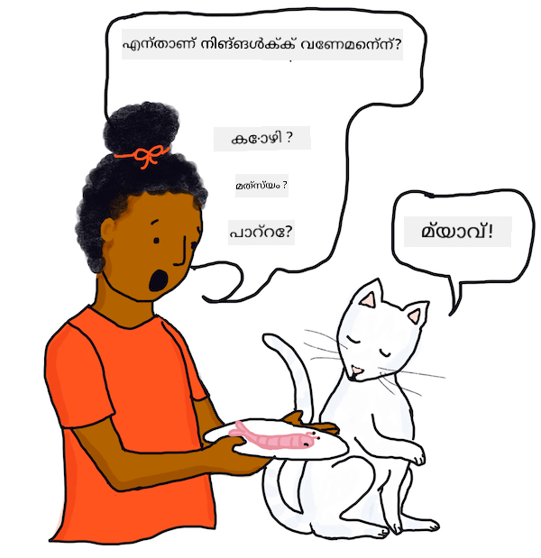

<!--
CO_OP_TRANSLATOR_METADATA:
{
  "original_hash": "1c2ec40cf55c98a028a359c27ef7e45a",
  "translation_date": "2025-12-19T14:28:04+00:00",
  "source_file": "6-NLP/1-Introduction-to-NLP/README.md",
  "language_code": "ml"
}
-->
# സ്വാഭാവിക ഭാഷാ പ്രോസസ്സിംഗിലേക്ക് പരിചയം

ഈ പാഠം *സ്വാഭാവിക ഭാഷാ പ്രോസസ്സിംഗ്* എന്ന *കമ്പ്യൂട്ടേഷണൽ ലിംഗ്വിസ്റ്റിക്സ്* എന്ന ഉപവിഭാഗത്തിന്റെ ഒരു സംക്ഷിപ്ത ചരിത്രവും പ്രധാന ആശയങ്ങളും ഉൾക്കൊള്ളുന്നു.

## [പ്രീ-ലെക്ചർ ക്വിസ്](https://ff-quizzes.netlify.app/en/ml/)

## പരിചയം

NLP, സാധാരണയായി അറിയപ്പെടുന്നത് പോലെ, മെഷീൻ ലേണിംഗ് പ്രയോഗിച്ചും പ്രൊഡക്ഷൻ സോഫ്റ്റ്‌വെയറിൽ ഉപയോഗിച്ചും ഏറ്റവും പ്രശസ്തമായ മേഖലകളിലൊന്നാണ്.

✅ നിങ്ങൾ ദിവസേന ഉപയോഗിക്കുന്ന സോഫ്റ്റ്‌വെയറുകളിൽ ഏതെങ്കിലും NLP ഉൾപ്പെടുത്തിയിട്ടുണ്ടെന്ന് നിങ്ങൾക്ക് തോന്നുന്നുണ്ടോ? നിങ്ങൾ സ്ഥിരമായി ഉപയോഗിക്കുന്ന വേഡ് പ്രോസസ്സിംഗ് പ്രോഗ്രാമുകളോ മൊബൈൽ ആപ്പുകളോ എന്തെങ്കിലും?

നിങ്ങൾ പഠിക്കാനിരിക്കുന്നവ:

- **ഭാഷകളുടെ ആശയം**. ഭാഷകൾ എങ്ങനെ വികസിച്ചു, പ്രധാന പഠന മേഖലകൾ എന്തെല്ലാമായിരുന്നു.
- **നിർവചനവും ആശയങ്ങളും**. കമ്പ്യൂട്ടറുകൾ ടെക്സ്റ്റ് എങ്ങനെ പ്രോസസ് ചെയ്യുന്നു എന്നതിനെക്കുറിച്ചുള്ള നിർവചനങ്ങളും ആശയങ്ങളും, പാഴ്സിംഗ്, വ്യാകരണം, നാമപദങ്ങളും ക്രിയാപദങ്ങളും തിരിച്ചറിയൽ ഉൾപ്പെടെ. ഈ പാഠത്തിൽ ചില കോഡിംഗ് പ്രവർത്തനങ്ങളുണ്ട്, കൂടാതെ ചില പ്രധാന ആശയങ്ങൾ പരിചയപ്പെടുത്തുന്നു, അവ അടുത്ത പാഠങ്ങളിൽ നിങ്ങൾക്ക് കോഡ് ചെയ്യാൻ പഠിക്കാം.

## കമ്പ്യൂട്ടേഷണൽ ലിംഗ്വിസ്റ്റിക്സ്

കമ്പ്യൂട്ടേഷണൽ ലിംഗ്വിസ്റ്റിക്സ് ദശകങ്ങളായി ഗവേഷണവും വികസനവും നടത്തുന്ന ഒരു മേഖലയാണ്, കമ്പ്യൂട്ടറുകൾ ഭാഷകളുമായി എങ്ങനെ പ്രവർത്തിക്കാമെന്നും, അവ മനസ്സിലാക്കാനും, വിവർത്തനം ചെയ്യാനും, ആശയവിനിമയം നടത്താനും കഴിയുമെന്നുമാണ് പഠിക്കുന്നത്. സ്വാഭാവിക ഭാഷാ പ്രോസസ്സിംഗ് (NLP) കമ്പ്യൂട്ടറുകൾ 'സ്വാഭാവിക' അല്ലെങ്കിൽ മനുഷ്യ ഭാഷകൾ എങ്ങനെ പ്രോസസ് ചെയ്യാമെന്നതിൽ കേന്ദ്രീകരിച്ച ഒരു ബന്ധപ്പെട്ട മേഖലയാണ്.

### ഉദാഹരണം - ഫോൺ ഡിക്ടേഷൻ

നിങ്ങൾ ടൈപ്പുചെയ്യാതെ നിങ്ങളുടെ ഫോൺക്ക് വാക്കുകൾ പറഞ്ഞിട്ടുണ്ടെങ്കിൽ അല്ലെങ്കിൽ ഒരു വെർച്വൽ അസിസ്റ്റന്റിനോട് ചോദിച്ചിട്ടുണ്ടെങ്കിൽ, നിങ്ങളുടെ സംസാരത്തെ ടെക്സ്റ്റ് രൂപത്തിലേക്ക് മാറ്റി പിന്നീട് നിങ്ങൾ സംസാരിച്ച ഭാഷയിൽ നിന്നു *പാഴ്സ്* ചെയ്തു. കണ്ടെത്തിയ കീവേഡുകൾ പിന്നീട് ഫോൺ അല്ലെങ്കിൽ അസിസ്റ്റന്റ് മനസ്സിലാക്കി പ്രവർത്തിക്കാൻ കഴിയുന്ന ഫോർമാറ്റിലേക്ക് പ്രോസസ് ചെയ്തു.


> യഥാർത്ഥ ഭാഷാശാസ്ത്രപരമായ ബോധം ബുദ്ധിമുട്ടാണ്! ചിത്രം [Jen Looper](https://twitter.com/jenlooper) യുടെ

### ഈ സാങ്കേതികവിദ്യ എങ്ങനെ സാധ്യമായി?

ഇത് സാധ്യമായത് ആരോ ഒരു കമ്പ്യൂട്ടർ പ്രോഗ്രാം എഴുതിയതിനാൽ ആണ്. കുറച്ച് ദശകങ്ങൾ മുൻപ്, ചില സയൻസ് ഫിക്ഷൻ എഴുത്തുകാർ ആളുകൾ പ്രധാനമായും അവരുടെ കമ്പ്യൂട്ടറുകളോട് സംസാരിക്കും, കമ്പ്യൂട്ടറുകൾ എപ്പോഴും അവർ പറയുന്നത് ശരിയായി മനസ്സിലാക്കും എന്ന് പ്രവചിച്ചിരുന്നു. ദുർഭാഗ്യവശാൽ, ഇത് പലർക്കും കരുതിയതേക്കാൾ ബുദ്ധിമുട്ടുള്ള പ്രശ്നമായിരുന്നു, ഇന്ന് ഇത് വളരെ മെച്ചപ്പെട്ട രീതിയിൽ മനസ്സിലാക്കപ്പെടുന്ന പ്രശ്നമാണ്, എന്നാൽ ഒരു വാചകത്തിന്റെ അർത്ഥം മനസ്സിലാക്കുന്നതിൽ 'പരിപൂർണ്ണ' സ്വാഭാവിക ഭാഷാ പ്രോസസ്സിംഗ് നേടുന്നതിൽ വലിയ വെല്ലുവിളികൾ ഉണ്ട്. പ്രത്യേകിച്ച് ഹാസ്യവും വാചകത്തിലെ സാർക്കാസം പോലുള്ള വികാരങ്ങൾ തിരിച്ചറിയുന്നതിൽ ഇത് ബുദ്ധിമുട്ടാണ്.

ഇപ്പോൾ, നിങ്ങൾക്ക് സ്കൂളിലെ ക്ലാസ്സുകൾ ഓർമ്മ വരാം, അപ്പോൾ അധ്യാപകൻ ഒരു വാചകത്തിലെ വ്യാകരണ ഭാഗങ്ങൾ പഠിപ്പിച്ചിരുന്നു. ചില രാജ്യങ്ങളിൽ വിദ്യാർത്ഥികൾ വ്യാകരണം, ഭാഷാശാസ്ത്രം പ്രത്യേക വിഷയമായി പഠിക്കുന്നു, എന്നാൽ പല സ്ഥലങ്ങളിലും ഈ വിഷയങ്ങൾ ഒരു ഭാഷ പഠനത്തിന്റെ ഭാഗമായാണ് ഉൾപ്പെടുത്തുന്നത്: പ്രാഥമിക വിദ്യാലയത്തിൽ നിങ്ങളുടെ ആദ്യഭാഷ (വായനയും എഴുത്തും പഠിക്കൽ) അല്ലെങ്കിൽ രണ്ടാം ഭാഷ പോസ്റ്റ്-പ്രൈമറി അല്ലെങ്കിൽ ഹൈസ്കൂളിൽ. നാമപദങ്ങളും ക്രിയാപദങ്ങളും അല്ലെങ്കിൽ ക്രിയാവിശേഷണങ്ങളും വിശേഷണങ്ങളും വേർതിരിക്കാൻ നിങ്ങൾ വിദഗ്ധനല്ലെങ്കിൽ ആശങ്കപ്പെടേണ്ടതില്ല!

*സിംപിൾ പ്രെസന്റ്* ഉം *പ്രെസന്റ് പ്രോഗ്രസീവ്* ഉം തമ്മിലുള്ള വ്യത്യാസം നിങ്ങൾക്ക് ബുദ്ധിമുട്ടുണ്ടെങ്കിൽ, നിങ്ങൾ ഒറ്റക്കല്ല. ഇത് പലർക്കും, ഭാഷയുടെ സ്വദേശികളായവർക്കും പോലും ബുദ്ധിമുട്ടുള്ളതാണ്. നല്ല വാർത്ത എന്തെന്നാൽ കമ്പ്യൂട്ടറുകൾ ഔപചാരിക നിയമങ്ങൾ പ്രയോഗിക്കുന്നതിൽ വളരെ നല്ലവരാണ്, നിങ്ങൾ ഒരു മനുഷ്യനെപ്പോലെ ഒരു വാചകം *പാഴ്സ്* ചെയ്യാൻ കഴിയുന്ന കോഡ് എഴുതാൻ പഠിക്കും. പിന്നീട് നിങ്ങൾ പരിശോധിക്കേണ്ട വലിയ വെല്ലുവിളി ഒരു വാചകത്തിന്റെ *അർത്ഥം*യും, *ഭാവന*യും മനസ്സിലാക്കലാണ്.

## മുൻകൂട്ടി അറിയേണ്ടതുകൾ

ഈ പാഠത്തിന് പ്രധാന മുൻകൂട്ടി അറിയേണ്ടത് ഈ പാഠത്തിന്റെ ഭാഷ വായിച്ച് മനസ്സിലാക്കാൻ കഴിയുന്നതാണ്. പരിഹരിക്കേണ്ട ഗണിത പ്രശ്നങ്ങളോ സമവാക്യങ്ങളോ ഇല്ല. ആദ്യ എഴുത്തുകാരൻ ഈ പാഠം ഇംഗ്ലീഷിൽ എഴുതിയിട്ടുണ്ടെങ്കിലും, ഇത് മറ്റ് ഭാഷകളിലേക്കും വിവർത്തനം ചെയ്തിട്ടുണ്ട്, അതിനാൽ നിങ്ങൾ ഒരു വിവർത്തനം വായിക്കാം. വ്യത്യസ്ത ഭാഷകളുടെ വ്യാകരണ നിയമങ്ങൾ താരതമ്യം ചെയ്യുന്നതിനായി പല ഭാഷകളും ഉപയോഗിച്ച ഉദാഹരണങ്ങൾ ഉണ്ട്. അവ വിവർത്തനം ചെയ്തിട്ടില്ല, പക്ഷേ വിശദീകരണ വാചകങ്ങൾ വിവർത്തനം ചെയ്തിട്ടുള്ളതിനാൽ അർത്ഥം വ്യക്തമായിരിക്കണം.

കോഡിംഗ് പ്രവർത്തനങ്ങൾക്ക്, നിങ്ങൾ Python ഉപയോഗിക്കും, ഉദാഹരണങ്ങൾ Python 3.8 ഉപയോഗിച്ചാണ്.

ഈ വിഭാഗത്തിൽ നിങ്ങൾക്ക് ആവശ്യമായതും ഉപയോഗിക്കുന്നതും:

- **Python 3 ബോധം**. Python 3 പ്രോഗ്രാമിംഗ് ഭാഷയുടെ ബോധം, ഈ പാഠം ഇൻപുട്ട്, ലൂപ്പുകൾ, ഫയൽ വായിക്കൽ, അറേകൾ എന്നിവ ഉപയോഗിക്കുന്നു.
- **Visual Studio Code + എക്സ്റ്റൻഷൻ**. Visual Studio Codeയും അതിന്റെ Python എക്സ്റ്റൻഷനും ഉപയോഗിക്കും. നിങ്ങൾക്ക് ഇഷ്ടമുള്ള Python IDE ഉപയോഗിക്കാം.
- **TextBlob**. [TextBlob](https://github.com/sloria/TextBlob) Python-ന് വേണ്ടി ലളിതമായ ടെക്സ്റ്റ് പ്രോസസ്സിംഗ് ലൈബ്രറിയാണ്. TextBlob സൈറ്റിലെ നിർദ്ദേശങ്ങൾ പിന്തുടർന്ന് നിങ്ങളുടെ സിസ്റ്റത്തിൽ ഇൻസ്റ്റാൾ ചെയ്യുക (കോർപറയും ഇൻസ്റ്റാൾ ചെയ്യുക, താഴെ കാണിച്ചിരിക്കുന്നതുപോലെ):

   ```bash
   pip install -U textblob
   python -m textblob.download_corpora
   ```

> 💡 ടിപ്പ്: Python നേരിട്ട് VS Code പരിസ്ഥിതികളിൽ ഓടിക്കാം. കൂടുതൽ വിവരങ്ങൾക്ക് [ഡോക്സ്](https://code.visualstudio.com/docs/languages/python?WT.mc_id=academic-77952-leestott) പരിശോധിക്കുക.

## യന്ത്രങ്ങളോട് സംസാരിക്കൽ

കമ്പ്യൂട്ടറുകൾ മനുഷ്യഭാഷ മനസ്സിലാക്കാൻ ശ്രമിച്ച ചരിത്രം ദശകങ്ങളായി തുടരുന്നു, സ്വാഭാവിക ഭാഷാ പ്രോസസ്സിംഗ് പരിഗണിച്ച ആദ്യ ശാസ്ത്രജ്ഞരിൽ ഒരാളായിരുന്നു *ആലൻ ട്യൂറിംഗ്*.

### 'ട്യൂറിംഗ് ടെസ്റ്റ്'

1950-കളിൽ *കൃത്രിമ ബുദ്ധിമുട്ട്* ഗവേഷണം നടത്തുമ്പോൾ, ട്യൂറിംഗ് ഒരു സംഭാഷണപരീക്ഷണം മനുഷ്യനും കമ്പ്യൂട്ടറിനും (ടൈപ്പുചെയ്ത കത്തുകളിലൂടെ) നൽകാമോ എന്ന് പരിഗണിച്ചു, അതിൽ സംഭാഷണത്തിലെ മനുഷ്യൻ മറ്റൊരു മനുഷ്യനോ കമ്പ്യൂട്ടറോ ആണെന്ന് ഉറപ്പില്ലാതിരിക്കണം.

ഒരു നിശ്ചിത സംഭാഷണ ദൈർഘ്യത്തിന് ശേഷം, മനുഷ്യൻ ഉത്തരങ്ങൾ കമ്പ്യൂട്ടറിൽ നിന്നാണോ എന്ന് തിരിച്ചറിയാൻ കഴിയാതെപോയാൽ, ആ കമ്പ്യൂട്ടർ *ചിന്തിക്കുന്ന*തായി പറയാമോ?

### പ്രചോദനം - 'ഇമിറ്റേഷൻ ഗെയിം'

ഈ ആശയം ഒരു പാർട്ടി ഗെയിം ആയ *The Imitation Game* എന്നതിൽ നിന്നാണ്, അതിൽ ഒരു ചോദ്യംചെയ്യുന്നവൻ ഒരു മുറിയിൽ ഒറ്റക്കാണ്, മറ്റൊരു മുറിയിൽ രണ്ട് ആളുകളുണ്ട്, അവരിൽ ആരാണ് പുരുഷനും ആരാണ് സ്ത്രീയെന്നു കണ്ടെത്തേണ്ടതാണ്. ചോദ്യംചെയ്യുന്നവൻ കുറിപ്പുകൾ അയയ്ക്കാം, മറുപടികൾ mystery വ്യക്തിയുടെ ലിംഗം വെളിപ്പെടുത്തുന്ന വിധം ചോദ്യങ്ങൾ ചിന്തിക്കണം. മറുപടികൾ നൽകുന്നവർ ചോദ്യംചെയ്യുന്നവനെ തെറ്റിദ്ധരിപ്പിക്കാൻ ശ്രമിക്കും, എന്നാൽ സത്യസന്ധമായി മറുപടി നൽകുന്ന പോലെ തോന്നിക്കണം.

### എലൈസ വികസിപ്പിക്കൽ

1960-കളിൽ MIT ശാസ്ത്രജ്ഞനായ *ജോസഫ് വൈസൻബാം* [*എലൈസ*](https://wikipedia.org/wiki/ELIZA) എന്ന കമ്പ്യൂട്ടർ 'തെറാപ്പിസ്റ്റ്' വികസിപ്പിച്ചു, അത് മനുഷ്യനോട് ചോദ്യങ്ങൾ ചോദിച്ച് അവരുടെ മറുപടികൾ മനസ്സിലാക്കുന്ന പോലെ തോന്നിക്കുകയായിരുന്നു. എങ്കിലും, എലൈസ ഒരു വാചകം പാഴ്സ് ചെയ്ത് ചില വ്യാകരണ ഘടകങ്ങളും കീവേഡുകളും തിരിച്ചറിയാമെങ്കിലും, വാചകം *മനസ്സിലാക്കിയതായി* പറയാനാകില്ല. എലൈസക്ക് "**I am** <u>sad</u>" എന്ന വാചകം നൽകിയാൽ, അത് വാചകത്തിലെ വാക്കുകൾ പുനഃക്രമീകരിച്ച് "How long have **you been** <u>sad</u>" എന്ന മറുപടി രൂപപ്പെടുത്താമായിരുന്നു.

ഇത് എലൈസ വാചകം മനസ്സിലാക്കി തുടർന്നുള്ള ചോദ്യം ചോദിക്കുന്നതായി തോന്നിക്കുകയായിരുന്നു, എന്നാൽ യാഥാർത്ഥത്തിൽ അത് കാലം മാറ്റുകയും ചില വാക്കുകൾ ചേർക്കുകയും ചെയ്തിരുന്നത് മാത്രമാണ്. എലൈസക്ക് മറുപടി നൽകാൻ കഴിയുന്ന കീവേഡ് തിരിച്ചറിയാനാകാതെപോയാൽ, പല വാചകങ്ങൾക്കും അനുയോജ്യമായ ഒരു യാദൃച്ഛിക മറുപടി നൽകും. എലൈസ എളുപ്പത്തിൽ തട്ടിപ്പിലാകാമായിരുന്നു, ഉദാഹരണത്തിന്, ഉപയോക്താവ് "**You are** a <u>bicycle</u>" എന്ന് എഴുതിയാൽ, "How long have **I been** a <u>bicycle</u>?" എന്ന മറുപടി നൽകും, കൂടുതൽ യുക്തിപൂർണമായ മറുപടി നൽകാതെ.

[](https://youtu.be/RMK9AphfLco "എലൈസുമായി സംഭാഷണം")

> 🎥 മുകളിൽ കാണുന്ന ചിത്രത്തിൽ ക്ലിക്ക് ചെയ്ത് യഥാർത്ഥ ELIZA പ്രോഗ്രാമിനെക്കുറിച്ചുള്ള വീഡിയോ കാണുക

> കുറിപ്പ്: നിങ്ങൾക്ക് ACM അക്കൗണ്ട് ഉണ്ടെങ്കിൽ 1966-ൽ പ്രസിദ്ധീകരിച്ച [Eliza](https://cacm.acm.org/magazines/1966/1/13317-elizaa-computer-program-for-the-study-of-natural-language-communication-between-man-and-machine/abstract) യുടെ യഥാർത്ഥ വിവരണം വായിക്കാം. അല്ലെങ്കിൽ [വിക്കിപീഡിയ](https://wikipedia.org/wiki/ELIZA)യിൽ Elizaയെക്കുറിച്ച് വായിക്കാം.

## അഭ്യാസം - അടിസ്ഥാന സംഭാഷണ ബോട്ട് കോഡിംഗ്

എലൈസ പോലുള്ള ഒരു സംഭാഷണ ബോട്ട്, ഉപയോക്തൃ ഇൻപുട്ട് എടുക്കുകയും ബുദ്ധിമുട്ടോടെ മനസ്സിലാക്കി പ്രതികരിക്കുന്നതുപോലെ തോന്നുകയും ചെയ്യുന്ന പ്രോഗ്രാമാണ്. എലൈസ പോലുള്ള ബോട്ടിന് നിരവധി നിയമങ്ങൾ ഉണ്ടായിരുന്നു ബുദ്ധിമുട്ടുള്ള സംഭാഷണം നടത്തുന്നതായി തോന്നിക്കാൻ. എന്നാൽ നമ്മുടെ ബോട്ടിന് ഒരു കഴിവ് മാത്രമേ ഉണ്ടാകൂ, അത് ഏതൊരു ലളിതമായ സംഭാഷണത്തിലും പ്രവർത്തിക്കാവുന്ന യാദൃച്ഛിക മറുപടികൾ ഉപയോഗിച്ച് സംഭാഷണം തുടരുക.

### പദ്ധതി

സംഭാഷണ ബോട്ട് നിർമ്മിക്കുമ്പോൾ നിങ്ങളുടെ ചുവടുകൾ:

1. ഉപയോക്താവിന് ബോട്ടുമായി എങ്ങനെ ഇടപഴകണമെന്ന് നിർദ്ദേശങ്ങൾ പ്രിന്റ് ചെയ്യുക
2. ഒരു ലൂപ്പ് ആരംഭിക്കുക
   1. ഉപയോക്തൃ ഇൻപുട്ട് സ്വീകരിക്കുക
   2. ഉപയോക്താവ് പുറത്തുകടക്കാൻ ആവശ്യപ്പെട്ടാൽ, പുറത്തുകടക്കുക
   3. ഉപയോക്തൃ ഇൻപുട്ട് പ്രോസസ് ചെയ്ത് മറുപടി നിർണയിക്കുക (ഈ കേസിൽ, മറുപടി സാധാരണ മറുപടികളുടെ യാദൃച്ഛിക തിരഞ്ഞെടുപ്പാണ്)
   4. മറുപടി പ്രിന്റ് ചെയ്യുക
3. പടിയിലേക്ക് 2 ലേക്ക് മടങ്ങുക

### ബോട്ട് നിർമ്മിക്കൽ

ഇപ്പോൾ ബോട്ട് സൃഷ്ടിക്കാം. ചില വാചകങ്ങൾ നിർവചിക്കുന്നതിൽ നിന്ന് തുടങ്ങാം.

1. Python-ൽ ഈ ബോട്ട് താഴെ കാണുന്ന യാദൃച്ഛിക മറുപടികളോടെ സ്വയം സൃഷ്ടിക്കുക:

    ```python
    random_responses = ["That is quite interesting, please tell me more.",
                        "I see. Do go on.",
                        "Why do you say that?",
                        "Funny weather we've been having, isn't it?",
                        "Let's change the subject.",
                        "Did you catch the game last night?"]
    ```

    നിങ്ങൾക്ക് സഹായം നൽകാൻ ചില സാമ്പിൾ ഔട്ട്പുട്ട് (ഉപയോക്തൃ ഇൻപുട്ട് `>` അടിയന്തിര വരികളിലാണ്):

    ```output
    Hello, I am Marvin, the simple robot.
    You can end this conversation at any time by typing 'bye'
    After typing each answer, press 'enter'
    How are you today?
    > I am good thanks
    That is quite interesting, please tell me more.
    > today I went for a walk     
    Did you catch the game last night?
    > I did, but my team lost
    Funny weather we've been having, isn't it?
    > yes but I hope next week is better
    Let's change the subject.
    > ok, lets talk about music
    Why do you say that?
    > because I like music!
    Why do you say that?
    > bye
    It was nice talking to you, goodbye!
    ```

    ഈ ടാസ്കിന് ഒരു സാധ്യതയുള്ള പരിഹാരം [ഇവിടെ](https://github.com/microsoft/ML-For-Beginners/blob/main/6-NLP/1-Introduction-to-NLP/solution/bot.py) കാണാം

    ✅ നിർത്തി ചിന്തിക്കുക

    1. യാദൃച്ഛിക മറുപടികൾ ബോട്ട് അവരെ മനസ്സിലാക്കിയതായി തോന്നിക്കാൻ 'തട്ടിപ്പു' ചെയ്യുമോ എന്ന് നിങ്ങൾ കരുതുന്നുണ്ടോ?
    2. ബോട്ട് കൂടുതൽ ഫലപ്രദമാകാൻ എന്ത് സവിശേഷതകൾ വേണം?
    3. ഒരു ബോട്ട് വാചകത്തിന്റെ അർത്ഥം യഥാർത്ഥത്തിൽ 'മനസ്സിലാക്കുകയാണെങ്കിൽ', സംഭാഷണത്തിലെ മുൻവാചകങ്ങളുടെ അർത്ഥം 'ഓർമ്മിക്കാൻ' അതിന് ആവശ്യമുണ്ടോ?

---

## 🚀ചലഞ്ച്

മുകളിൽ "നിർത്തി ചിന്തിക്കുക" എന്ന ഘടകങ്ങളിൽ ഒന്നിനെ തിരഞ്ഞെടുക്കുക, അതിനെ കോഡിൽ നടപ്പിലാക്കാൻ ശ്രമിക്കുക അല്ലെങ്കിൽ പുസ്‌തകത്തിൽ പ്യൂഡോകോഡ് ഉപയോഗിച്ച് പരിഹാരം എഴുതുക.

അടുത്ത പാഠത്തിൽ, സ്വാഭാവിക ഭാഷ പാഴ്സിംഗിനും മെഷീൻ ലേണിംഗിനും മറ്റ് പല സമീപനങ്ങളും നിങ്ങൾ പഠിക്കും.

## [പോസ്റ്റ്-ലെക്ചർ ക്വിസ്](https://ff-quizzes.netlify.app/en/ml/)

## അവലോകനം & സ്വയം പഠനം

താഴെ കൊടുത്തിരിക്കുന്ന റഫറൻസുകൾ കൂടുതൽ വായനാ അവസരങ്ങളായി കാണുക.

### റഫറൻസുകൾ

1. ഷുബർട്ട്, ലെൻഹാർട്ട്, "Computational Linguistics", *The Stanford Encyclopedia of Philosophy* (Spring 2020 Edition), എഡ്വാർഡ് എൻ. സാൽറ്റ (എഡിറ്റർ), URL = <https://plato.stanford.edu/archives/spr2020/entries/computational-linguistics/>.
2. പ്രിൻസ്ടൺ യൂണിവേഴ്സിറ്റി "About WordNet." [WordNet](https://wordnet.princeton.edu/). പ്രിൻസ്ടൺ യൂണിവേഴ്സിറ്റി. 2010.

## അസൈൻമെന്റ്

[ഒരു ബോട്ട് തിരയുക](assignment.md)

---

<!-- CO-OP TRANSLATOR DISCLAIMER START -->
**അസൂയാ**:  
ഈ രേഖ AI വിവർത്തന സേവനം [Co-op Translator](https://github.com/Azure/co-op-translator) ഉപയോഗിച്ച് വിവർത്തനം ചെയ്തതാണ്. നാം കൃത്യതയ്ക്ക് ശ്രമിച്ചെങ്കിലും, സ്വയം പ്രവർത്തിക്കുന്ന വിവർത്തനങ്ങളിൽ പിശകുകൾ അല്ലെങ്കിൽ തെറ്റുകൾ ഉണ്ടാകാമെന്ന് ദയവായി ശ്രദ്ധിക്കുക. അതിന്റെ മാതൃഭാഷയിലുള്ള യഥാർത്ഥ രേഖ പ്രാമാണികമായ ഉറവിടമായി കണക്കാക്കണം. നിർണായക വിവരങ്ങൾക്ക്, പ്രൊഫഷണൽ മനുഷ്യ വിവർത്തനം ശുപാർശ ചെയ്യപ്പെടുന്നു. ഈ വിവർത്തനത്തിന്റെ ഉപയോഗത്തിൽ നിന്നുണ്ടാകുന്ന ഏതെങ്കിലും തെറ്റിദ്ധാരണകൾക്കോ തെറ്റായ വ്യാഖ്യാനങ്ങൾക്കോ ഞങ്ങൾ ഉത്തരവാദികളല്ല.
<!-- CO-OP TRANSLATOR DISCLAIMER END -->