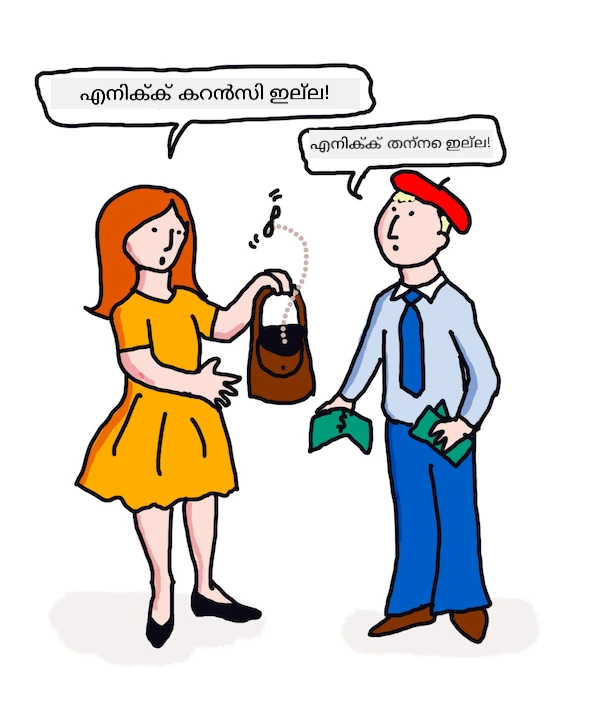

<!--
CO_OP_TRANSLATOR_METADATA:
{
  "original_hash": "be03c8182982b87ced155e4e9d1438e8",
  "translation_date": "2025-12-19T14:16:31+00:00",
  "source_file": "6-NLP/3-Translation-Sentiment/README.md",
  "language_code": "ml"
}
-->
# ML ഉപയോഗിച്ച് വിവർത്തനവും മനോഭാവ വിശകലനവും

മുൻപത്തെ പാഠങ്ങളിൽ നിങ്ങൾ `TextBlob` ഉപയോഗിച്ച് ഒരു അടിസ്ഥാന ബോട്ട് എങ്ങനെ നിർമ്മിക്കാമെന്ന് പഠിച്ചു, ഇത് നൗൺ ഫ്രേസ് എക്സ്ട്രാക്ഷൻ പോലുള്ള അടിസ്ഥാന NLP പ്രവർത്തനങ്ങൾ നടത്താൻ ML പിന്നിൽ ഉൾപ്പെടുത്തിയ ഒരു ലൈബ്രറിയാണ്. കംപ്യൂട്ടേഷണൽ ലിംഗ്വിസ്റ്റിക്സിലെ മറ്റൊരു പ്രധാന വെല്ലുവിളി ഒരു സംസാരിച്ചോ എഴുതിയോ ഭാഷയിൽ നിന്നു മറ്റൊരു ഭാഷയിലേക്ക് വാചകത്തിന്റെ കൃത്യമായ _വിവർത്തനം_ ആണ്.

## [പ്രീ-ലെക്ചർ ക്വിസ്](https://ff-quizzes.netlify.app/en/ml/)

വിവർത്തനം വളരെ കഠിനമായ പ്രശ്നമാണ്, കാരണം ആയിരക്കണക്കിന് ഭാഷകൾ ഉണ്ട്, ഓരോന്നിന്റെയും വ്യത്യസ്ത വ്യാകരണ നിയമങ്ങൾ ഉണ്ടാകാം. ഒരു സമീപനം ഒരു ഭാഷയുടെ ഔപചാരിക വ്യാകരണ നിയമങ്ങൾ, ഉദാഹരണത്തിന് ഇംഗ്ലീഷ്, ഒരു ഭാഷ-സ്വതന്ത്ര ഘടനയിലേക്ക് മാറ്റി, പിന്നീട് മറ്റൊരു ഭാഷയിലേക്ക് തിരിച്ചുവിവർത്തനം ചെയ്യുക എന്നതാണ്. ഈ സമീപനം നിങ്ങൾക്ക് താഴെപ്പറയുന്ന ഘട്ടങ്ങൾ സ്വീകരിക്കേണ്ടതുണ്ടെന്ന് സൂചിപ്പിക്കുന്നു:

1. **അറിയുക**. ഇൻപുട്ട് ഭാഷയിലെ വാക്കുകൾ നൗൺ, ക്രിയ തുടങ്ങിയവയായി തിരിച്ചറിയുക അല്ലെങ്കിൽ ടാഗ് ചെയ്യുക.
2. **വിവർത്തനം സൃഷ്ടിക്കുക**. ലക്ഷ്യഭാഷയുടെ ഫോർമാറ്റിൽ ഓരോ വാക്കിന്റെയും നേരിട്ടുള്ള വിവർത്തനം ഉത്പാദിപ്പിക്കുക.

### ഉദാഹരണ വാചകം, ഇംഗ്ലീഷിൽ നിന്ന് അയറിഷിലേക്ക്

'ഇംഗ്ലീഷ്' ഭാഷയിൽ, വാചകം _I feel happy_ മൂന്ന് വാക്കുകളാണ് ക്രമത്തിൽ:

- **വിഷയം** (I)
- **ക്രിയ** (feel)
- **വിശേഷണം** (happy)

എങ്കിലും, 'അയറിഷ്' ഭാഷയിൽ, അതേ വാചകത്തിന് വ്യത്യസ്തമായ വ്യാകരണ ഘടനയുണ്ട് - "*happy*" അല്ലെങ്കിൽ "*sad*" പോലുള്ള വികാരങ്ങൾ നിങ്ങൾക്ക് *ഉപരി* ആയി പ്രകടിപ്പിക്കപ്പെടുന്നു.

ഇംഗ്ലീഷ് വാചകം `I feel happy` അയറിഷിൽ `Tá athas orm` ആകും. ഒരു *ശബ്ദാർത്ഥ* വിവർത്തനം `Happy is upon me` ആകും.

അയറിഷ് സംസാരിക്കുന്നവർ ഇംഗ്ലീഷിലേക്ക് വിവർത്തനം ചെയ്യുമ്പോൾ വാക്കുകളും വാചക ഘടനയും വ്യത്യസ്തമായാലും വാചകത്തിന്റെ അർത്ഥം മനസ്സിലാക്കുന്നതിനാൽ `I feel happy` എന്ന് പറയും, `Happy is upon me` അല്ല.

അയറിഷ് വാചകത്തിന്റെ ഔപചാരിക ക്രമം:

- **ക്രിയ** (Tá അല്ലെങ്കിൽ is)
- **വിശേഷണം** (athas, അല്ലെങ്കിൽ happy)
- **വിഷയം** (orm, അല്ലെങ്കിൽ upon me)

## വിവർത്തനം

ഒരു നൈവ് വിവർത്തന പ്രോഗ്രാം വാക്കുകൾ മാത്രം വിവർത്തനം ചെയ്യാം, വാചക ഘടന അവഗണിച്ച്.

✅ നിങ്ങൾ ഒരു മുതിർന്നവനായി രണ്ടാമത്തെ (അല്ലെങ്കിൽ മൂന്നാമത്തെ അല്ലെങ്കിൽ കൂടുതൽ) ഭാഷ പഠിച്ചിട്ടുണ്ടെങ്കിൽ, ആദ്യം നിങ്ങളുടെ മാതൃഭാഷയിൽ ചിന്തിച്ച്, ഒരു ആശയം വാക്ക് വാക്കായി രണ്ടാമത്തെ ഭാഷയിലേക്ക് വിവർത്തനം ചെയ്ത്, പിന്നീട് അത് സംസാരിക്കാൻ തുടങ്ങിയിട്ടുണ്ടാകും. ഇത് നൈവ് വിവർത്തന കമ്പ്യൂട്ടർ പ്രോഗ്രാമുകൾ ചെയ്യുന്നതിന് സമാനമാണ്. ഈ ഘട്ടം കടന്നുപോകുന്നത് പ്രാവീണ്യം നേടാൻ പ്രധാനമാണ്!

നൈവ് വിവർത്തനം തെറ്റായ (കഴിഞ്ഞാൽ രസകരമായ) വിവർത്തനങ്ങൾക്ക് കാരണമാകും: `I feel happy` അയറിഷിൽ ശബ്ദാർത്ഥം പോലെ `Mise bhraitheann athas` ആയി വിവർത്തനം ചെയ്യപ്പെടുന്നു. അതിന്റെ അർത്ഥം (ശബ്ദാർത്ഥം) `me feel happy` ആണ്, ഇത് സാധുവായ അയറിഷ് വാചകം അല്ല. ഇംഗ്ലീഷും അയറിഷും അടുത്തടുത്ത ദ്വീപുകളിൽ സംസാരിക്കുന്ന ഭാഷകളായിട്ടും വ്യത്യസ്ത വ്യാകരണ ഘടനകളുള്ള വ്യത്യസ്ത ഭാഷകളാണ്.

> അയറിഷ് ഭാഷാശാസ്ത്രപരമ്പരകളെക്കുറിച്ച് [ഇവിടെ](https://www.youtube.com/watch?v=mRIaLSdRMMs) ചില വീഡിയോകൾ കാണാം

### മെഷീൻ ലേണിംഗ് സമീപനങ്ങൾ

ഇതുവരെ, നിങ്ങൾ സ്വാഭാവിക ഭാഷാ പ്രോസസ്സിംഗിന് ഔപചാരിക നിയമങ്ങൾ അടിസ്ഥാനമാക്കിയ സമീപനം പഠിച്ചു. മറ്റൊരു സമീപനം വാക്കുകളുടെ അർത്ഥം അവഗണിച്ച്, പാറ്റേണുകൾ കണ്ടെത്താൻ മെഷീൻ ലേണിംഗ് ഉപയോഗിക്കുക എന്നതാണ്. ഇത് വിവർത്തനത്തിൽ പ്രവർത്തിക്കാം, നിങ്ങൾക്ക് ഉത്ഭവവും ലക്ഷ്യഭാഷയിലും ഉള്ള വലിയ വാചകശേഖരം (*corpus*) ഉണ്ടെങ്കിൽ.

ഉദാഹരണത്തിന്, 1813-ൽ ജെയിൻ ഓസ്റ്റിൻ എഴുതിയ പ്രശസ്തമായ ഇംഗ്ലീഷ് നോവൽ *Pride and Prejudice* എടുത്തു നോക്കാം. നിങ്ങൾ ഇംഗ്ലീഷിലും മനുഷ്യൻ വിവർത്തനം ചെയ്ത ഫ്രഞ്ച് പതിപ്പിലും പുസ്തകം പരിശോധിച്ചാൽ, ഒരു ഭാഷയിലെ വാചകങ്ങൾ മറ്റൊരഭാഷയിലേക്ക് _പ്രയോഗപരമായി_ വിവർത്തനം ചെയ്തിട്ടുണ്ടെന്ന് കണ്ടെത്താം. നിങ്ങൾ അത് ഉടൻ ചെയ്യാൻ പോകുന്നു.

ഉദാഹരണത്തിന്, `I have no money` എന്ന ഇംഗ്ലീഷ് വാചകം ഫ്രഞ്ചിലേക്ക് ശബ്ദാർത്ഥമായി വിവർത്തനം ചെയ്താൽ, അത് `Je n'ai pas de monnaie` ആകാം. "Monnaie" ഒരു പ്രയാസമുള്ള ഫ്രഞ്ച് 'false cognate' ആണ്, 'money' ഉം 'monnaie' ഉം സമാനാർത്ഥകങ്ങൾ അല്ല. മനുഷ്യൻ നൽകുന്ന നല്ല വിവർത്തനം `Je n'ai pas d'argent` ആകും, കാരണം ഇത് നിങ്ങൾക്ക് പണം ഇല്ല എന്ന അർത്ഥം കൂടുതൽ വ്യക്തമാക്കുന്നു ('monnaie' യുടെ അർത്ഥം 'loose change' ആണ്).



> ചിത്രം [Jen Looper](https://twitter.com/jenlooper) യുടെതാണ്

ഒരു ML മോഡലിന് മനുഷ്യൻ നൽകിയ വിവർത്തനങ്ങൾ മതിയായ തോതിൽ ഉണ്ടെങ്കിൽ, അത് മുൻപ് പരിഭാഷപ്പെടുത്തിയ വാചകങ്ങളിൽ സാധാരണ പാറ്റേണുകൾ കണ്ടെത്തി വിവർത്തനങ്ങളുടെ കൃത്യത മെച്ചപ്പെടുത്താൻ കഴിയും.

### അഭ്യാസം - വിവർത്തനം

നിങ്ങൾക്ക് `TextBlob` ഉപയോഗിച്ച് വാചകങ്ങൾ വിവർത്തനം ചെയ്യാം. പ്രശസ്തമായ **Pride and Prejudice** ന്റെ ആദ്യ വരി പരീക്ഷിക്കൂ:

```python
from textblob import TextBlob

blob = TextBlob(
    "It is a truth universally acknowledged, that a single man in possession of a good fortune, must be in want of a wife!"
)
print(blob.translate(to="fr"))

```
  
`TextBlob` വിവർത്തനത്തിൽ നല്ല പ്രകടനം കാണിക്കുന്നു: "C'est une vérité universellement reconnue, qu'un homme célibataire en possession d'une bonne fortune doit avoir besoin d'une femme!".

വാസ്തവത്തിൽ, TextBlob ന്റെ വിവർത്തനം 1932-ലെ V. Leconte, Ch. Pressoir എന്നിവരുടെ ഫ്രഞ്ച് വിവർത്തനത്തേക്കാൾ കൂടുതൽ കൃത്യമാണ് എന്ന് വാദിക്കാം:

"C'est une vérité universelle qu'un célibataire pourvu d'une belle fortune doit avoir envie de se marier, et, si peu que l'on sache de son sentiment à cet egard, lorsqu'il arrive dans une nouvelle résidence, cette idée est si bien fixée dans l'esprit de ses voisins qu'ils le considèrent sur-le-champ comme la propriété légitime de l'une ou l'autre de leurs filles."

ഈ സാഹചര്യത്തിൽ, ML-നിർദ്ദേശിച്ച വിവർത്തനം മനുഷ്യ വിവർത്തനക്കാരനേക്കാൾ മികച്ചതാണ്, കാരണം മനുഷ്യൻ 'വിവക്ഷത'ക്കായി എഴുത്തുകാരന്റെ വാക്കുകളിൽ അനാവശ്യമായി വാക്കുകൾ ചേർക്കുന്നു.

> എന്താണ് ഇവിടെ നടക്കുന്നത്? TextBlob വിവർത്തനത്തിൽ എങ്ങനെ ഇത്ര നല്ലതാകുന്നു? പിന്നിൽ Google translate ഉപയോഗിക്കുന്നു, ഇത് ലക്ഷക്കണക്കിന് വാചകങ്ങൾ വിശകലനം ചെയ്ത് ഏറ്റവും നല്ല വിവർത്തനങ്ങൾ പ്രവചിക്കുന്ന ഒരു സങ്കീർണ്ണ AI ആണ്. ഇതിൽ യാതൊരു മാനുവൽ പ്രവർത്തനവും ഇല്ല, `blob.translate` ഉപയോഗിക്കാൻ ഇന്റർനെറ്റ് കണക്ഷൻ വേണം.

✅ കൂടുതൽ വാചകങ്ങൾ പരീക്ഷിക്കൂ. ML-വുമോ മനുഷ്യ വിവർത്തനവുമോ മികച്ചത്? ഏത് സാഹചര്യങ്ങളിൽ?

## മനോഭാവ വിശകലനം

മെഷീൻ ലേണിംഗ് വളരെ നല്ല രീതിയിൽ പ്രവർത്തിക്കുന്ന മറ്റൊരു മേഖല മനോഭാവ വിശകലനമാണ്. ഒരു non-ML സമീപനം 'സ pozitive'യും 'negative' ഉം ആയ വാക്കുകളും വാചകങ്ങളും തിരിച്ചറിയുക എന്നതാണ്. പുതിയ ഒരു വാചകം ലഭിച്ചാൽ, പോസിറ്റീവ്, നെഗറ്റീവ്, ന്യൂട്രൽ വാക്കുകളുടെ മൊത്തം മൂല്യം കണക്കാക്കി ആകെ മനോഭാവം കണ്ടെത്തുക.

ഈ സമീപനം എളുപ്പത്തിൽ തട്ടിപ്പിലാകാം, Marvin ടാസ്കിൽ നിങ്ങൾ കണ്ടതുപോലെ - `Great, that was a wonderful waste of time, I'm glad we are lost on this dark road` എന്ന വാചകം സാർകാസം നിറഞ്ഞ നെഗറ്റീവ് മനോഭാവമുള്ളതാണ്, പക്ഷേ ലളിതമായ ആൽഗോരിതം 'great', 'wonderful', 'glad' പോസിറ്റീവ് ആയി, 'waste', 'lost', 'dark' നെഗറ്റീവ് ആയി കണ്ടെത്തുന്നു. ഈ വിരുദ്ധ വാക്കുകൾ ആകെ മനോഭാവത്തെ സ്വാധീനിക്കുന്നു.

✅ ഒരു നിമിഷം നിർത്തി മനുഷ്യർ സാർകാസം എങ്ങനെ പ്രകടിപ്പിക്കുന്നുവെന്ന് ചിന്തിക്കൂ. ടോൺ ഇൻഫ്ലെക്ഷൻ വലിയ പങ്ക് വഹിക്കുന്നു. "Well, that film was awesome" എന്ന വാചകം വ്യത്യസ്ത രീതിയിൽ പറയാൻ ശ്രമിച്ച് നിങ്ങളുടെ ശബ്ദം അർത്ഥം എങ്ങനെ കൈമാറുന്നു എന്ന് കണ്ടെത്തൂ.

### ML സമീപനങ്ങൾ

ML സമീപനം നെഗറ്റീവ്, പോസിറ്റീവ് ഉള്ള വാചകങ്ങൾ - ട്വീറ്റുകൾ, സിനിമാ അവലോകനങ്ങൾ, അല്ലെങ്കിൽ മനുഷ്യൻ സ്കോർ നൽകിയ എഴുത്ത് ഉള്ളവ - കൈമാറി ശേഖരിക്കുക എന്നതാണ്. പിന്നീട് NLP സാങ്കേതിക വിദ്യകൾ ഉപയോഗിച്ച് അഭിപ്രായങ്ങളും സ്കോറുകളും വിശകലനം ചെയ്ത് പാറ്റേണുകൾ കണ്ടെത്തും (ഉദാ: പോസിറ്റീവ് സിനിമാ അവലോകനങ്ങളിൽ 'Oscar worthy' എന്ന വാചകം നെഗറ്റീവ് അവലോകനങ്ങളിൽക്കാൾ കൂടുതലായി കാണപ്പെടും, അല്ലെങ്കിൽ പോസിറ്റീവ് റെസ്റ്റോറന്റ് അവലോകനങ്ങളിൽ 'gourmet' നെഗറ്റീവ് അവലോകനങ്ങളിൽക്കാൾ കൂടുതലായി പറയപ്പെടും).

> ⚖️ **ഉദാഹരണം**: ഒരു രാഷ്ട്രീയക്കാരന്റെ ഓഫിസിൽ നിങ്ങൾ ജോലി ചെയ്യുന്നു, പുതിയ ഒരു നിയമം ചർച്ചയിലുണ്ട്. ജനങ്ങൾ അതിനെ പിന്തുണയ്ക്കുന്ന അല്ലെങ്കിൽ എതിർക്കുന്ന ഇമെയിലുകൾ അയയ്ക്കുന്നു. നിങ്ങൾക്ക് ഇമെയിലുകൾ വായിച്ച് രണ്ട് തരം പൈലുകളായി (*for* and *against*) വേർതിരിക്കാനുള്ള ചുമതല ഉണ്ടെന്ന് കരുതുക. ഇമെയിലുകൾ 많으면 എല്ലാം വായിക്കാൻ ബുദ്ധിമുട്ടാകും. ഒരു ബോട്ട് എല്ലാം വായിച്ച് മനസ്സിലാക്കി ഏത് ഇമെയിൽ ഏത് പൈലിൽ പോകുമെന്ന് പറയുമെങ്കിൽ എത്ര നല്ലതായിരിക്കും?  
>  
> അതിന് മെഷീൻ ലേണിംഗ് ഉപയോഗിക്കാം. *against* ഇമെയിലുകളുടെ ഒരു ഭാഗവും *for* ഇമെയിലുകളുടെ ഒരു ഭാഗവും ഉപയോഗിച്ച് മോഡൽ പരിശീലിപ്പിക്കും. മോഡൽ വാക്കുകളും പാറ്റേണുകളും *against* അല്ലെങ്കിൽ *for* ഇമെയിലുകളിൽ കൂടുതലായി കാണപ്പെടുന്നവയായി തിരിച്ചറിയും, പക്ഷേ ഉള്ളടക്കം മനസ്സിലാക്കില്ല. പരിശീലനത്തിന് ഉപയോഗിക്കാത്ത ചില ഇമെയിലുകൾ ഉപയോഗിച്ച് മോഡൽ പരീക്ഷിച്ച് നിങ്ങൾ നൽകിയ നിഗമനത്തോട് ഒത്തുപോകുന്നുണ്ടോ എന്ന് നോക്കാം. മോഡലിന്റെ കൃത്യതയിൽ സന്തോഷം ഉണ്ടെങ്കിൽ, ഭാവിയിലെ ഇമെയിലുകൾ വായിക്കാതെ തന്നെ പ്രോസസ്സ് ചെയ്യാം.

✅ ഈ പ്രക്രിയ മുമ്പത്തെ പാഠങ്ങളിൽ നിങ്ങൾ ഉപയോഗിച്ച പ്രക്രിയകളെപ്പോലെ തോന്നുന്നുണ്ടോ?

## അഭ്യാസം - മനോഭാവ വാചകങ്ങൾ

മനോഭാവം -1 മുതൽ 1 വരെ ഉള്ള *polarity* ഉപയോഗിച്ച് അളക്കുന്നു, -1 ഏറ്റവും നെഗറ്റീവ്, 1 ഏറ്റവും പോസിറ്റീവ്. മനോഭാവം 0 - 1 സ്കോറിൽ ഒബ്ജക്റ്റിവിറ്റി (0)യും സബ്ജക്റ്റിവിറ്റി (1)യും അളക്കുന്നു.

ജെയിൻ ഓസ്റ്റിന്റെ *Pride and Prejudice* വീണ്ടും നോക്കൂ. [Project Gutenberg](https://www.gutenberg.org/files/1342/1342-h/1342-h.htm) ൽ പുസ്തകം ലഭ്യമാണ്. താഴെ ഒരു ചെറിയ പ്രോഗ്രാം പുസ്തകത്തിലെ ആദ്യവും അവസാനവുമായ വാചകങ്ങളുടെ മനോഭാവം വിശകലനം ചെയ്ത് polarity, സബ്ജക്റ്റിവിറ്റി/ഒബ്ജക്റ്റിവിറ്റി സ്കോർ പ്രദർശിപ്പിക്കുന്നു.

`TextBlob` ലൈബ്രറി (മുകളിൽ വിവരിച്ചതു പോലെ) ഉപയോഗിച്ച് `sentiment` കണ്ടെത്തുക (സ്വന്തം sentiment കാൽക്കുലേറ്റർ എഴുതേണ്ടതില്ല) ഈ ടാസ്കിൽ.

```python
from textblob import TextBlob

quote1 = """It is a truth universally acknowledged, that a single man in possession of a good fortune, must be in want of a wife."""

quote2 = """Darcy, as well as Elizabeth, really loved them; and they were both ever sensible of the warmest gratitude towards the persons who, by bringing her into Derbyshire, had been the means of uniting them."""

sentiment1 = TextBlob(quote1).sentiment
sentiment2 = TextBlob(quote2).sentiment

print(quote1 + " has a sentiment of " + str(sentiment1))
print(quote2 + " has a sentiment of " + str(sentiment2))
```
  
താഴെപ്പറയുന്ന ഔട്ട്പുട്ട് കാണും:

```output
It is a truth universally acknowledged, that a single man in possession of a good fortune, must be in want # of a wife. has a sentiment of Sentiment(polarity=0.20952380952380953, subjectivity=0.27142857142857146)

Darcy, as well as Elizabeth, really loved them; and they were
     both ever sensible of the warmest gratitude towards the persons
      who, by bringing her into Derbyshire, had been the means of
      uniting them. has a sentiment of Sentiment(polarity=0.7, subjectivity=0.8)
```
  
## വെല്ലുവിളി - sentiment polarity പരിശോധിക്കുക

നിങ്ങളുടെ ടാസ്ക്, sentiment polarity ഉപയോഗിച്ച് *Pride and Prejudice* യിൽ പൂർണ്ണമായും പോസിറ്റീവ് വാചകങ്ങൾ പൂർണ്ണമായും നെഗറ്റീവ് വാചകങ്ങളെക്കാൾ കൂടുതലാണോ എന്ന് കണ്ടെത്തുക. polarity സ്കോർ 1 അല്ലെങ്കിൽ -1 ആണെങ്കിൽ അതിനെ പൂർണ്ണമായും പോസിറ്റീവ് അല്ലെങ്കിൽ നെഗറ്റീവ് എന്ന് കരുതാം.

**പടികൾ:**

1. Project Gutenberg-ൽ നിന്ന് [Pride and Prejudice](https://www.gutenberg.org/files/1342/1342-h/1342-h.htm) .txt ഫയൽ ഡൗൺലോഡ് ചെയ്യുക. ഫയലിന്റെ തുടക്കത്തിലും അവസാനം ഉള്ള മെറ്റാഡേറ്റ നീക്കം ചെയ്ത് യഥാർത്ഥ എഴുത്ത് മാത്രം വയ്ക്കുക
2. Python-ൽ ഫയൽ തുറന്ന് ഉള്ളടക്കം സ്ട്രിംഗ് ആയി എടുക്കുക
3. പുസ്തക സ്ട്രിംഗ് ഉപയോഗിച്ച് TextBlob സൃഷ്ടിക്കുക
4. പുസ്തകത്തിലെ ഓരോ വാചകവും ലൂപ്പിൽ വിശകലനം ചെയ്യുക
   1. polarity 1 അല്ലെങ്കിൽ -1 ആണെങ്കിൽ വാചകം പോസിറ്റീവ് അല്ലെങ്കിൽ നെഗറ്റീവ് സന്ദേശങ്ങളുടെ ലിസ്റ്റിൽ സൂക്ഷിക്കുക
5. അവസാനം, എല്ലാ പോസിറ്റീവ് വാചകങ്ങളും നെഗറ്റീവ് വാചകങ്ങളും (വ്യത്യസ്തമായി) പ്രിന്റ് ചെയ്യുക, കൂടാതെ ഓരോതിന്റെ എണ്ണം കാണിക്കുക.

ഇവിടെ ഒരു സാമ്പിൾ [പരിഹാരം](https://github.com/microsoft/ML-For-Beginners/blob/main/6-NLP/3-Translation-Sentiment/solution/notebook.ipynb) ഉണ്ട്.

✅ അറിവ് പരിശോധിക്കൽ

1. sentiment വാക്കുകളുടെ അടിസ്ഥാനത്തിലാണ്, പക്ഷേ കോഡ് വാക്കുകൾ *അർത്ഥമാക്കുന്നുണ്ടോ*?
2. sentiment polarity കൃത്യമാണെന്ന് നിങ്ങൾ കരുതുന്നുണ്ടോ, അല്ലെങ്കിൽ സ്കോറുകളുമായി നിങ്ങൾ *ഒത്തുപോകുന്നുണ്ടോ*?  
   1. പ്രത്യേകിച്ച്, താഴെപ്പറയുന്ന വാചകങ്ങളുടെ പൂർണ്ണമായും **പോസിറ്റീവ്** polarity-യുമായി നിങ്ങൾ ഒത്തുപോകുന്നുണ്ടോ?  
      * “What an excellent father you have, girls!” said she, when the door was shut.  
      * “Your examination of Mr. Darcy is over, I presume,” said Miss Bingley; “and pray what is the result?” “I am perfectly convinced by it that Mr. Darcy has no defect.  
      * How wonderfully these sort of things occur!  
      * I have the greatest dislike in the world to that sort of thing.  
      * Charlotte is an excellent manager, I dare say.  
      * “This is delightful indeed!  
      * I am so happy!  
      * Your idea of the ponies is delightful.  
   2. അടുത്ത 3 വാചകങ്ങൾ പൂർണ്ണമായും പോസിറ്റീവ് polarity ലഭിച്ചു, പക്ഷേ വായിച്ചാൽ അവ പോസിറ്റീവ് അല്ല. sentiment analysis അവ പോസിറ്റീവ് എന്ന് കരുതിയത് എന്തുകൊണ്ടാണ്?  
      * Happy shall I be, when his stay at Netherfield is over!” “I wish I could say anything to comfort you,” replied Elizabeth; “but it is wholly out of my power.  
      * If I could but see you as happy!  
      * Our distress, my dear Lizzy, is very great.  
   3. താഴെപ്പറയുന്ന വാചകങ്ങളുടെ പൂർണ്ണമായും **നെഗറ്റീവ്** polarity-യുമായി നിങ്ങൾ ഒത്തുപോകുന്നുണ്ടോ?  
      - Everybody is disgusted with his pride.  
      - “I should like to know how he behaves among strangers.” “You shall hear then—but prepare yourself for something very dreadful.  
      - The pause was to Elizabeth’s feelings dreadful.  
      - It would be dreadful!  

✅ ജെയിൻ ഓസ്റ്റിന്റെ ആരാധകർക്ക് അറിയാം, അവർ അവരുടെ പുസ്തകങ്ങൾ ഇംഗ്ലീഷ് റെജൻസി സമൂഹത്തിലെ കൂടുതൽ വാസ്തവവിരുദ്ധമായ വശങ്ങൾ വിമർശിക്കാൻ ഉപയോഗിക്കുന്നു. *Pride and Prejudice* ന്റെ പ്രധാന കഥാപാത്രം എലിസബത്ത് ബെനെറ്റ് (എഴുത്തുകാരനുപോലെ) ഒരു സൂക്ഷ്മ സാമൂഹിക നിരീക്ഷകയാണ്, അവളുടെ ഭാഷ പലപ്പോഴും വളരെ സൂക്ഷ്മമാണ്. കഥയിലെ പ്രണയവ്യക്തി മിസ്റ്റർ ഡാർസി പോലും എലിസബത്തിന്റെ കളിയാട്ടവും ചിരിപ്പിക്കുന്ന ഭാഷ ഉപയോഗവും ശ്രദ്ധിച്ചിട്ടുണ്ട്: "I have had the pleasure of your acquaintance long enough to know that you find great enjoyment in occasionally professing opinions which in fact are not your own."

---

## 🚀 വെല്ലുവിളി

ഉപയോക്തൃ ഇൻപുട്ടിൽ നിന്ന് മറ്റ് സവിശേഷതകൾ എടുക്കുന്നതിലൂടെ Marvin-നെ കൂടുതൽ മെച്ചപ്പെടുത്താമോ?

## [പോസ്റ്റ്-ലെക്ചർ ക്വിസ്](https://ff-quizzes.netlify.app/en/ml/)
## അവലോകനം & സ്വയം പഠനം

വാചകത്തിൽ നിന്നുള്ള മനോഭാവം എടുക്കാനുള്ള നിരവധി മാർഗ്ഗങ്ങളുണ്ട്. ഈ സാങ്കേതികവിദ്യ ഉപയോഗിക്കുന്ന ബിസിനസ് പ്രയോഗങ്ങളെക്കുറിച്ച് ചിന്തിക്കുക. ഇത് എങ്ങനെ തെറ്റിക്കാമെന്ന് ചിന്തിക്കുക. [Azure Text Analysis](https://docs.microsoft.com/azure/cognitive-services/Text-Analytics/how-tos/text-analytics-how-to-sentiment-analysis?tabs=version-3-1?WT.mc_id=academic-77952-leestott) പോലുള്ള മനോഭാവം വിശകലനം ചെയ്യുന്ന സങ്കീർണ്ണമായ എന്റർപ്രൈസ്-സജ്ജമായ സിസ്റ്റങ്ങളേക്കുറിച്ച് കൂടുതൽ വായിക്കുക. മുകളിൽ നൽകിയ പ്രൈഡ് ആൻഡ് പ്രെജുഡിസ് വാചകങ്ങളിൽ ചിലത് പരീക്ഷിച്ച് സൂക്ഷ്മത കണ്ടെത്താൻ കഴിയുന്നുണ്ടോ എന്ന് നോക്കുക.

## അസൈൻമെന്റ്

[Poetic license](assignment.md)

---

<!-- CO-OP TRANSLATOR DISCLAIMER START -->
**അസൂയാ**:  
ഈ രേഖ AI വിവർത്തന സേവനം [Co-op Translator](https://github.com/Azure/co-op-translator) ഉപയോഗിച്ച് വിവർത്തനം ചെയ്തതാണ്. നാം കൃത്യതയ്ക്ക് ശ്രമിച്ചിട്ടുണ്ടെങ്കിലും, സ്വയം പ്രവർത്തിക്കുന്ന വിവർത്തനങ്ങളിൽ പിശകുകൾ അല്ലെങ്കിൽ തെറ്റുകൾ ഉണ്ടാകാമെന്ന് ദയവായി ശ്രദ്ധിക്കുക. അതിന്റെ മാതൃഭാഷയിലുള്ള യഥാർത്ഥ രേഖയാണ് പ്രാമാണികമായ ഉറവിടം എന്ന് പരിഗണിക്കേണ്ടതാണ്. നിർണായകമായ വിവരങ്ങൾക്ക്, പ്രൊഫഷണൽ മനുഷ്യ വിവർത്തനം ശുപാർശ ചെയ്യപ്പെടുന്നു. ഈ വിവർത്തനം ഉപയോഗിക്കുന്നതിൽ നിന്നുണ്ടാകുന്ന ഏതെങ്കിലും തെറ്റിദ്ധാരണകൾക്കോ തെറ്റായ വ്യാഖ്യാനങ്ങൾക്കോ ഞങ്ങൾ ഉത്തരവാദികളല്ല.
<!-- CO-OP TRANSLATOR DISCLAIMER END -->