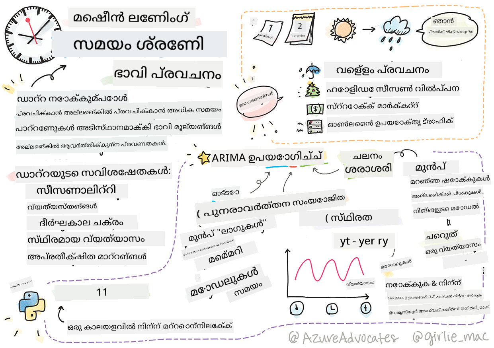
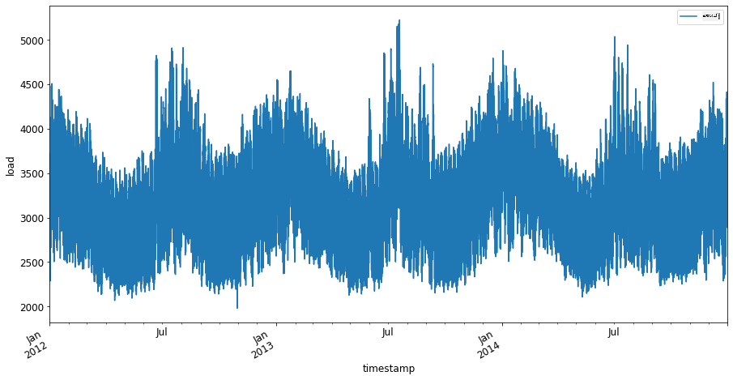
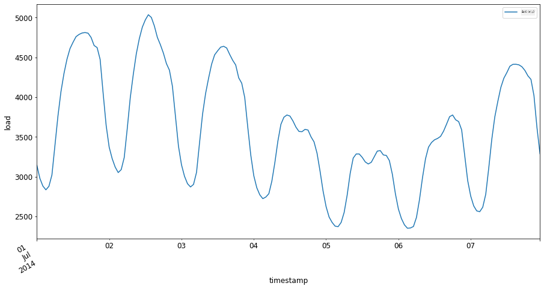

<!--
CO_OP_TRANSLATOR_METADATA:
{
  "original_hash": "662b509c39eee205687726636d0a8455",
  "translation_date": "2025-12-19T16:04:38+00:00",
  "source_file": "7-TimeSeries/1-Introduction/README.md",
  "language_code": "ml"
}
-->
# ടൈം സീരീസ് ഫോറ്കാസ്റ്റിംഗിലേക്ക് പരിചയം



> സ്കെച്ച്നോട്ട് [Tomomi Imura](https://www.twitter.com/girlie_mac) tarafından

ഈ പാഠത്തിലും അടുത്ത പാഠത്തിലും, നിങ്ങൾ ടൈം സീരീസ് ഫോറ്കാസ്റ്റിംഗിനെ കുറിച്ച് കുറച്ച് പഠിക്കും, ഇത് ഒരു ML ശാസ്ത്രജ്ഞന്റെ repertoire-യിലെ ഒരു രസകരവും മൂല്യവത്തുമായ ഭാഗമാണ്, മറ്റ് വിഷയങ്ങളേക്കാൾ കുറച്ച് അറിയപ്പെടാത്തത്. ടൈം സീരീസ് ഫോറ്കാസ്റ്റിംഗ് ഒരു തരത്തിലുള്ള 'ക്രിസ്റ്റൽ ബോൾ' ആണ്: വില പോലുള്ള ഒരു ചാരത്തിന്റെ കഴിഞ്ഞ പ്രകടനത്തെ അടിസ്ഥാനമാക്കി, അതിന്റെ ഭാവിയിലെ സാധ്യത മൂല്യം പ്രവചിക്കാം.

[](https://youtu.be/cBojo1hsHiI "ടൈം സീരീസ് ഫോറ്കാസ്റ്റിംഗിലേക്ക് പരിചയം")

> 🎥 ടൈം സീരീസ് ഫോറ്കാസ്റ്റിംഗിനെക്കുറിച്ചുള്ള വീഡിയോയ്ക്ക് മുകളിൽ ചിത്രത്തിൽ ക്ലിക്ക് ചെയ്യുക

## [പ്രീ-ലെക്ചർ ക്വിസ്](https://ff-quizzes.netlify.app/en/ml/)

വില നിർണ്ണയം, ഇൻവെന്ററി, സപ്ലൈ ചെയിൻ പ്രശ്നങ്ങൾ എന്നിവയുടെ നേരിട്ടുള്ള പ്രയോഗം കണക്കിലെടുത്താൽ, ഇത് ബിസിനസിന് യഥാർത്ഥ മൂല്യമുള്ള ഒരു ഉപകാരപ്രദവും രസകരവുമായ മേഖലയാണ്. ഭാവിയിലെ പ്രകടനം മെച്ചപ്പെടുത്താൻ കൂടുതൽ洞察ങ്ങൾ നേടാൻ ഡീപ് ലേണിംഗ് സാങ്കേതികവിദ്യകൾ ഉപയോഗിക്കാൻ തുടങ്ങിയിട്ടുണ്ടെങ്കിലും, ടൈം സീരീസ് ഫോറ്കാസ്റ്റിംഗ് ക്ലാസിക് ML സാങ്കേതികവിദ്യകളാൽ വളരെ അറിയപ്പെടുന്ന ഒരു മേഖലയായി തുടരുന്നു.

> പെൻ സ്റ്റേറ്റിന്റെ ഉപകാരപ്രദമായ ടൈം സീരീസ് പാഠ്യപദ്ധതി [ഇവിടെ](https://online.stat.psu.edu/stat510/lesson/1) ലഭ്യമാണ്

## പരിചയം

നിങ്ങൾക്ക് ഒരു സ്മാർട്ട് പാർക്കിംഗ് മീറ്ററുകളുടെ ഒരു അറേ കൈകാര്യം ചെയ്യുന്നു എന്ന് കരുതുക, അവ എത്രത്തോളം ഉപയോഗിക്കപ്പെടുന്നു, എത്ര സമയം ഉപയോഗിക്കപ്പെടുന്നു എന്നതിനെക്കുറിച്ച് ഡാറ്റ നൽകുന്നു.

> മീറ്ററിന്റെ കഴിഞ്ഞ പ്രകടനത്തെ അടിസ്ഥാനമാക്കി, വിതരണവും ആവശ്യവും നിയമങ്ങൾ അനുസരിച്ച് അതിന്റെ ഭാവിയിലെ മൂല്യം പ്രവചിക്കാമെങ്കിൽ?

നിങ്ങളുടെ ലക്ഷ്യം നേടാൻ എപ്പോൾ പ്രവർത്തിക്കണമെന്ന് കൃത്യമായി പ്രവചിക്കുന്നത് ടൈം സീരീസ് ഫോറ്കാസ്റ്റിംഗിലൂടെ കൈകാര്യം ചെയ്യാവുന്ന ഒരു വെല്ലുവിളിയാണ്. പാർക്കിംഗ് സ്ഥലം അന്വേഷിക്കുമ്പോൾ തിരക്കുള്ള സമയങ്ങളിൽ കൂടുതൽ ചാർജ് ചെയ്യുന്നത് ആളുകളെ സന്തോഷിപ്പിക്കില്ല, പക്ഷേ ഇത് തെരുവുകൾ ശുചിയാക്കാൻ വരുമാനം സൃഷ്ടിക്കാൻ ഉറപ്പുള്ള മാർഗ്ഗമായിരിക്കും!

ടൈം സീരീസ് ആൽഗോരിതങ്ങളുടെ ചില തരം പരിശോധിച്ച്, ചില ഡാറ്റ ശുചിയാക്കി തയ്യാറാക്കാൻ ഒരു നോട്ട്‌ബുക്ക് ആരംഭിക്കാം. നിങ്ങൾ വിശകലനം ചെയ്യാൻ പോകുന്ന ഡാറ്റ GEFCom2014 ഫോറ്കാസ്റ്റിംഗ് മത്സരം നിന്നെടുത്തതാണ്. ഇത് 2012 മുതൽ 2014 വരെ 3 വർഷത്തെ മണിക്കൂർ അടിസ്ഥാനത്തിലുള്ള വൈദ്യുതി ലോഡ്, താപനില മൂല്യങ്ങൾ ഉൾക്കൊള്ളുന്നു. വൈദ്യുതി ലോഡിന്റെയും താപനിലയുടെയും ചരിത്ര മാതൃകകൾ പരിഗണിച്ച്, വൈദ്യുതി ലോഡിന്റെ ഭാവിയിലെ മൂല്യങ്ങൾ പ്രവചിക്കാം.

ഈ ഉദാഹരണത്തിൽ, നിങ്ങൾ ചരിത്ര ലോഡ് ഡാറ്റ മാത്രം ഉപയോഗിച്ച് ഒരു ടൈം സ്റ്റെപ്പ് മുന്നോട്ട് ഫോറ്കാസ്റ്റ് ചെയ്യുന്നത് പഠിക്കും. എന്നാൽ തുടങ്ങുന്നതിന് മുമ്പ്, പിന്നിൽ എന്താണ് നടക്കുന്നത് എന്ന് മനസ്സിലാക്കുന്നത് ഉപകാരപ്രദമാണ്.

## ചില നിർവചനങ്ങൾ

'ടൈം സീരീസ്' എന്ന പദം കാണുമ്പോൾ, അതിന്റെ ഉപയോഗം വിവിധ സാഹചര്യങ്ങളിൽ മനസ്സിലാക്കേണ്ടതാണ്.

🎓 **ടൈം സീരീസ്**

ഗണിതശാസ്ത്രത്തിൽ, "ടൈം സീരീസ് എന്നത് സമയക്രമത്തിൽ സൂചിപ്പിച്ച (അഥവാ പട്ടികപ്പെടുത്തിയ അല്ലെങ്കിൽ ഗ്രാഫ് ചെയ്ത) ഡാറ്റ പോയിന്റുകളുടെ ഒരു ശ്രേണി ആണ്. സാധാരണയായി, ടൈം സീരീസ് ഒരു തുടർച്ചയായ സമാന ഇടവേളകളിൽ എടുത്ത ഒരു ശ്രേണിയാണ്." ഒരു ടൈം സീരീസിന്റെ ഉദാഹരണം [ഡോ ജോൺസ് ഇൻഡസ്ട്രിയൽ അവറേജ്](https://wikipedia.org/wiki/Time_series) യുടെ ദിവസേന അവസാന മൂല്യമാണ്. ടൈം സീരീസ് പ്ലോട്ടുകളും സാങ്കേതിക മോഡലിംഗും സിഗ്നൽ പ്രോസസ്സിംഗ്, കാലാവസ്ഥ പ്രവചനം, ഭൂകമ്പ പ്രവചനം തുടങ്ങിയ മേഖലകളിൽ സാധാരണയായി കാണപ്പെടുന്നു, ഇവിടങ്ങളിൽ സംഭവങ്ങൾ സംഭവിക്കുകയും ഡാറ്റ പോയിന്റുകൾ സമയക്രമത്തിൽ പ്ലോട്ട് ചെയ്യപ്പെടുകയും ചെയ്യുന്നു.

🎓 **ടൈം സീരീസ് വിശകലനം**

ടൈം സീരീസ് വിശകലനം, മുകളിൽ പറഞ്ഞ ടൈം സീരീസ് ഡാറ്റയുടെ വിശകലനമാണ്. ടൈം സീരീസ് ഡാറ്റ വ്യത്യസ്ത രൂപങ്ങൾ സ്വീകരിക്കാം, ഉദാഹരണത്തിന് 'ഇന്ററപ്റ്റഡ് ടൈം സീരീസ്' എന്നത് ഒരു ഇടപെടൽ സംഭവത്തിന് മുമ്പും ശേഷവും ടൈം സീരീസിന്റെ വളർച്ചയിൽ മാതൃകകൾ കണ്ടെത്തുന്നു. ടൈം സീരീസിനായി ആവശ്യമായ വിശകലന തരം ഡാറ്റയുടെ സ്വഭാവത്തെ ആശ്രയിച്ചിരിക്കുന്നു. ടൈം സീരീസ് ഡാറ്റ സ്വയം സംഖ്യകളോ അക്ഷരങ്ങളോ ആയ ശ്രേണിയായിരിക്കും.

വിശകലനം നടത്താൻ വിവിധ രീതികൾ ഉപയോഗിക്കുന്നു, ഫ്രീക്വൻസി-ഡൊമെയ്ൻ, ടൈം-ഡൊമെയ്ൻ, ലീനിയർ, നോൺലീനിയർ തുടങ്ങിയവ ഉൾപ്പെടെ. ഈ തരത്തിലുള്ള ഡാറ്റ വിശകലനം ചെയ്യാനുള്ള നിരവധി മാർഗ്ഗങ്ങളെക്കുറിച്ച് [കൂടുതൽ പഠിക്കുക](https://www.itl.nist.gov/div898/handbook/pmc/section4/pmc4.htm).

🎓 **ടൈം സീരീസ് ഫോറ്കാസ്റ്റിംഗ്**

ടൈം സീരീസ് ഫോറ്കാസ്റ്റിംഗ്, മുമ്പ് ശേഖരിച്ച ഡാറ്റയിൽ കാണിച്ച മാതൃകകളുടെ അടിസ്ഥാനത്തിൽ ഭാവിയിലെ മൂല്യങ്ങൾ പ്രവചിക്കാൻ ഒരു മോഡൽ ഉപയോഗിക്കുന്നതാണ്. ടൈം സീരീസ് ഡാറ്റയെ x വേരിയബിളുകളായി ഉപയോഗിച്ച് റെഗ്രഷൻ മോഡലുകൾ ഉപയോഗിച്ച് പരിശോധിക്കാമെങ്കിലും, ഇത്തരം ഡാറ്റ പ്രത്യേക മോഡലുകൾ ഉപയോഗിച്ച് വിശകലനം ചെയ്യുന്നത് മികച്ചതാണ്.

ടൈം സീരീസ് ഡാറ്റ ഒരു ക്രമീകരിച്ച നിരീക്ഷണങ്ങളുടെ പട്ടികയാണ്, ലീനിയർ റെഗ്രഷൻ ഉപയോഗിച്ച് വിശകലനം ചെയ്യാവുന്ന ഡാറ്റയല്ല. ഏറ്റവും സാധാരണമായത് ARIMA ആണ്, ഇത് "Autoregressive Integrated Moving Average" എന്ന വാക്കുകളുടെ ചുരുക്കമാണ്.

[ARIMA മോഡലുകൾ](https://online.stat.psu.edu/stat510/lesson/1/1.1) "ഒരു ശ്രേണിയുടെ നിലവിലെ മൂല്യം കഴിഞ്ഞ മൂല്യങ്ങളോടും കഴിഞ്ഞ പ്രവചന പിശകുകളോടും ബന്ധിപ്പിക്കുന്നു." ഇവ ടൈം-ഡൊമെയ്ൻ ഡാറ്റ വിശകലനത്തിന് ഏറ്റവും അനുയോജ്യമാണ്, ഇവിടെ ഡാറ്റ സമയക്രമത്തിൽ ക്രമീകരിച്ചിരിക്കുന്നു.

> ARIMA മോഡലുകളുടെ പല തരങ്ങളും ഉണ്ട്, അവയെക്കുറിച്ച് [ഇവിടെ](https://people.duke.edu/~rnau/411arim.htm) പഠിക്കാം, അടുത്ത പാഠത്തിൽ നിങ്ങൾ അവയെ കുറിച്ച് പരിചയപ്പെടും.

അടുത്ത പാഠത്തിൽ, നിങ്ങൾ [Univariate Time Series](https://itl.nist.gov/div898/handbook/pmc/section4/pmc44.htm) ഉപയോഗിച്ച് ARIMA മോഡൽ നിർമ്മിക്കും, ഇത് സമയം കടന്നുപോകുമ്പോൾ മൂല്യം മാറുന്ന ഒരു വേരിയബിളിൽ കേന്ദ്രീകരിക്കുന്നു. ഈ തരത്തിലുള്ള ഡാറ്റയുടെ ഒരു ഉദാഹരണം [ഈ ഡാറ്റാസെറ്റ്](https://itl.nist.gov/div898/handbook/pmc/section4/pmc4411.htm) ആണ്, ഇത് മൗന ലോ ഒബ്സർവേറ്ററിയിലെ മാസാന്ത CO2 സാന്ദ്രത രേഖപ്പെടുത്തുന്നു:

|  CO2   | YearMonth | Year  | Month |
| :----: | :-------: | :---: | :---: |
| 330.62 |  1975.04  | 1975  |   1   |
| 331.40 |  1975.13  | 1975  |   2   |
| 331.87 |  1975.21  | 1975  |   3   |
| 333.18 |  1975.29  | 1975  |   4   |
| 333.92 |  1975.38  | 1975  |   5   |
| 333.43 |  1975.46  | 1975  |   6   |
| 331.85 |  1975.54  | 1975  |   7   |
| 330.01 |  1975.63  | 1975  |   8   |
| 328.51 |  1975.71  | 1975  |   9   |
| 328.41 |  1975.79  | 1975  |  10   |
| 329.25 |  1975.88  | 1975  |  11   |
| 330.97 |  1975.96  | 1975  |  12   |

✅ ഈ ഡാറ്റാസെറ്റിൽ സമയം കടന്നുപോകുമ്പോൾ മാറുന്ന വേരിയബിള്‍ തിരിച്ചറിയുക

## ടൈം സീരീസ് ഡാറ്റയുടെ പരിഗണിക്കേണ്ട സവിശേഷതകൾ

ടൈം സീരീസ് ഡാറ്റ നോക്കുമ്പോൾ, അതിന് [ചില സവിശേഷതകൾ](https://online.stat.psu.edu/stat510/lesson/1/1.1) ഉണ്ടെന്ന് കാണാം, അവയെ പരിഗണിച്ച് അതിന്റെ മാതൃകകൾ മെച്ചമായി മനസ്സിലാക്കാൻ നിങ്ങൾ ശ്രമിക്കണം. ടൈം സീരീസ് ഡാറ്റ ഒരു 'സിഗ്നൽ' നൽകുന്നുവെന്ന് കരുതുമ്പോൾ, ഈ സവിശേഷതകൾ 'ശബ്ദം' എന്ന നിലയിൽ കാണാം. ഈ 'ശബ്ദം' കുറയ്ക്കാൻ ചില സാങ്കേതിക രീതികൾ ഉപയോഗിച്ച് ഈ സവിശേഷതകളെ കുറച്ചുകുറയ്ക്കേണ്ടി വരും.

ടൈം സീരീസുമായി പ്രവർത്തിക്കാൻ നിങ്ങൾ അറിയേണ്ട ചില ആശയങ്ങൾ:

🎓 **ട്രെൻഡുകൾ**

ട്രെൻഡുകൾ സമയക്രമത്തിൽ അളക്കാവുന്ന വർദ്ധനവുകളും കുറവുകളും ആണ്. [കൂടുതൽ വായിക്കുക](https://machinelearningmastery.com/time-series-trends-in-python). ടൈം സീരീസിന്റെ സാന്ദർഭ്യത്തിൽ, ട്രെൻഡുകൾ എങ്ങനെ ഉപയോഗിക്കാമെന്നും, ആവശ്യമെങ്കിൽ എങ്ങനെ നീക്കം ചെയ്യാമെന്നും ആണ്.

🎓 **[സീസണാലിറ്റി](https://machinelearningmastery.com/time-series-seasonality-with-python/)**

സീസണാലിറ്റി എന്നത് കാലക്രമികമായ ചലനങ്ങളാണ്, ഉദാഹരണത്തിന് അവധിക്കാല തിരക്കുകൾ വിൽപ്പനയെ ബാധിക്കാം. [ഇവിടെ നോക്കൂ](https://itl.nist.gov/div898/handbook/pmc/section4/pmc443.htm) വിവിധ തരത്തിലുള്ള പ്ലോട്ടുകൾ ഡാറ്റയിൽ സീസണാലിറ്റി എങ്ങനെ കാണിക്കുന്നു എന്ന്.

🎓 **ഔട്ട്‌ലൈയേഴ്സ്**

ഔട്ട്‌ലൈയേഴ്സ് സാധാരണ ഡാറ്റ വ്യത്യാസത്തിൽ നിന്ന് വളരെ അകലെയാണ്.

🎓 **ദീർഘകാല ചക്രം**

സീസണാലിറ്റിയിൽ സ്വതന്ത്രമായി, ഡാറ്റ ഒരു ദീർഘകാല ചക്രം കാണിക്കാം, ഉദാഹരണത്തിന് ഒരു സാമ്പത്തിക മന്ദഗതിയെന്നത് ഒരു വർഷത്തിലധികം നീണ്ടുനിൽക്കാം.

🎓 **സ്ഥിരമായ വ്യത്യാസം**

സമയം കടന്നുപോകുമ്പോൾ, ചില ഡാറ്റ സ്ഥിരമായ ചലനങ്ങൾ കാണിക്കുന്നു, ഉദാഹരണത്തിന് ദിവസവും രാത്രിയും ഊർജ്ജ ഉപയോഗം.

🎓 **അപ്രതീക്ഷിത മാറ്റങ്ങൾ**

ഡാറ്റയിൽ അപ്രതീക്ഷിതമായ മാറ്റങ്ങൾ കാണാം, കൂടുതൽ വിശകലനം ആവശ്യമുള്ളതായിരിക്കും. ഉദാഹരണത്തിന് COVID മൂലം ബിസിനസുകൾ അടച്ചുപൂട്ടിയത് ഡാറ്റയിൽ മാറ്റങ്ങൾ ഉണ്ടാക്കി.

✅ [ഈ സാമ്പിൾ ടൈം സീരീസ് പ്ലോട്ട്](https://www.kaggle.com/kashnitsky/topic-9-part-1-time-series-analysis-in-python) നോക്കൂ, ഇത് ചില വർഷങ്ങളിലായി ദിവസേന കളിയിൽ ചെലവഴിച്ച കറൻസി കാണിക്കുന്നു. മുകളിൽ പറഞ്ഞ സവിശേഷതകളിൽ ഏതെങ്കിലും ഈ ഡാറ്റയിൽ തിരിച്ചറിയാമോ?


## അഭ്യാസം - വൈദ്യുതി ഉപയോഗ ഡാറ്റയുമായി ആരംഭിക്കുക

കഴിഞ്ഞ ഉപയോഗം അടിസ്ഥാനമാക്കി ഭാവിയിലെ വൈദ്യുതി ഉപയോഗം പ്രവചിക്കാൻ ഒരു ടൈം സീരീസ് മോഡൽ സൃഷ്ടിക്കാൻ തുടങ്ങാം.

> ഈ ഉദാഹരണത്തിലെ ഡാറ്റ GEFCom2014 ഫോറ്കാസ്റ്റിംഗ് മത്സരം നിന്നെടുത്തതാണ്. ഇത് 2012 മുതൽ 2014 വരെ 3 വർഷത്തെ മണിക്കൂർ അടിസ്ഥാനത്തിലുള്ള വൈദ്യുതി ലോഡ്, താപനില മൂല്യങ്ങൾ ഉൾക്കൊള്ളുന്നു.
>
> ടാവോ ഹോങ്, പിയർ പിൻസൺ, ഷു ഫാൻ, ഹമിദ്‌റേസാ സാരിപൂർ, അൽബർട്ടോ ട്രൊക്കോളി, റോബ് ജെ. ഹൈൻഡ്മാൻ, "പ്രൊബബിലിസ്റ്റിക് എനർജി ഫോറ്കാസ്റ്റിംഗ്: ഗ്ലോബൽ എനർജി ഫോറ്കാസ്റ്റിംഗ് കോംപറ്റിഷൻ 2014 ആൻഡ് ബിയോണ്ട്", ഇന്റർനാഷണൽ ജേണൽ ഓഫ് ഫോറ്കാസ്റ്റിംഗ്, വോൾ.32, നമ്പർ 3, പേജ് 896-913, ജൂലൈ-സെപ്റ്റംബർ, 2016.

1. ഈ പാഠത്തിന്റെ `working` ഫോൾഡറിൽ, _notebook.ipynb_ ഫയൽ തുറക്കുക. ഡാറ്റ ലോഡ് ചെയ്യാനും ദൃശ്യവൽക്കരിക്കാനും സഹായിക്കുന്ന ലൈബ്രറികൾ ചേർക്കുക

    ```python
    import os
    import matplotlib.pyplot as plt
    from common.utils import load_data
    %matplotlib inline
    ```

    ശ്രദ്ധിക്കുക, നിങ്ങൾ ഉൾപ്പെടുത്തിയ `common` ഫോൾഡറിൽ നിന്നുള്ള ഫയലുകൾ ഉപയോഗിക്കുന്നു, ഇത് നിങ്ങളുടെ പരിസ്ഥിതി സജ്ജമാക്കുകയും ഡാറ്റ ഡൗൺലോഡ് ചെയ്യുന്നതും കൈകാര്യം ചെയ്യുന്നു.

2. തുടർന്ന്, `load_data()` വിളിച്ച് ഡാറ്റ ഒരു ഡാറ്റാഫ്രെയിമായി പരിശോധിച്ച് `head()` ഉപയോഗിക്കുക:

    ```python
    data_dir = './data'
    energy = load_data(data_dir)[['load']]
    energy.head()
    ```

    തീയതിയും ലോഡും പ്രതിനിധീകരിക്കുന്ന രണ്ട് കോളങ്ങൾ ഉണ്ടെന്ന് കാണാം:

    |                     |  load  |
    | :-----------------: | :----: |
    | 2012-01-01 00:00:00 | 2698.0 |
    | 2012-01-01 01:00:00 | 2558.0 |
    | 2012-01-01 02:00:00 | 2444.0 |
    | 2012-01-01 03:00:00 | 2402.0 |
    | 2012-01-01 04:00:00 | 2403.0 |

3. ഇപ്പോൾ, `plot()` വിളിച്ച് ഡാറ്റ പ്ലോട്ട് ചെയ്യുക:

    ```python
    energy.plot(y='load', subplots=True, figsize=(15, 8), fontsize=12)
    plt.xlabel('timestamp', fontsize=12)
    plt.ylabel('load', fontsize=12)
    plt.show()
    ```

    

4. ഇപ്പോൾ, 2014 ജൂലൈയുടെ ആദ്യ ആഴ്ച `[from date]: [to date]` മാതൃകയിൽ `energy`-ക്ക് ഇൻപുട്ടായി നൽകി പ്ലോട്ട് ചെയ്യുക:

    ```python
    energy['2014-07-01':'2014-07-07'].plot(y='load', subplots=True, figsize=(15, 8), fontsize=12)
    plt.xlabel('timestamp', fontsize=12)
    plt.ylabel('load', fontsize=12)
    plt.show()
    ```

    

    മനോഹരമായ പ്ലോട്ട്! ഈ പ്ലോട്ടുകൾ നോക്കി മുകളിൽ പറഞ്ഞ സവിശേഷതകളിൽ ഏതെങ്കിലും തിരിച്ചറിയാമോ? ഡാറ്റ ദൃശ്യവൽക്കരിച്ച് നാം എന്ത് നിഗമനം വരുത്താം?

അടുത്ത പാഠത്തിൽ, നിങ്ങൾ ARIMA മോഡൽ നിർമ്മിച്ച് ചില ഫോറ്കാസ്റ്റുകൾ സൃഷ്ടിക്കും.

---

## 🚀ചലഞ്ച്

ടൈം സീരീസ് ഫോറ്കാസ്റ്റിംഗിൽ നിന്ന് പ്രയോജനം ലഭിക്കാവുന്ന എല്ലാ വ്യവസായങ്ങളും അന്വേഷണ മേഖലകളും ഒരു പട്ടിക തയ്യാറാക്കുക. ഈ സാങ്കേതികവിദ്യകളുടെ പ്രയോഗം കലകളിൽ, ഇക്കണോമെട്രിക്സിൽ, പരിസ്ഥിതിശാസ്ത്രത്തിൽ, റീട്ടെയിലിൽ, വ്യവസായത്തിൽ, ഫിനാൻസിൽ എന്നിവിടങ്ങളിൽ ഉണ്ടാകാമോ? മറ്റെവിടെയെങ്കിലും?

## [പോസ്റ്റ്-ലെക്ചർ ക്വിസ്](https://ff-quizzes.netlify.app/en/ml/)

## അവലോകനം & സ്വയം പഠനം

ഇവിടെ ഉൾപ്പെടുത്താത്തതായിരുന്നാലും, ന്യുറൽ നെറ്റ്വർക്കുകൾ ചിലപ്പോൾ ടൈം സീരീസ് ഫോറ്കാസ്റ്റിംഗിന്റെ ക്ലാസിക് രീതികൾ മെച്ചപ്പെടുത്താൻ ഉപയോഗിക്കുന്നു. അവയെക്കുറിച്ച് കൂടുതൽ വായിക്കുക [ഈ ലേഖനത്തിൽ](https://medium.com/microsoftazure/neural-networks-for-forecasting-financial-and-economic-time-series-6aca370ff412)

## അസൈൻമെന്റ്

[കൂടുതൽ ടൈം സീരീസുകൾ ദൃശ്യവൽക്കരിക്കുക](assignment.md)

---

<!-- CO-OP TRANSLATOR DISCLAIMER START -->
**അസൂയാ**:  
ഈ രേഖ AI വിവർത്തന സേവനം [Co-op Translator](https://github.com/Azure/co-op-translator) ഉപയോഗിച്ച് വിവർത്തനം ചെയ്തതാണ്. നാം കൃത്യതയ്ക്ക് ശ്രമിച്ചിട്ടുണ്ടെങ്കിലും, സ്വയം പ്രവർത്തിക്കുന്ന വിവർത്തനങ്ങളിൽ പിശകുകൾ അല്ലെങ്കിൽ തെറ്റുകൾ ഉണ്ടാകാമെന്ന് ദയവായി ശ്രദ്ധിക്കുക. അതിന്റെ മാതൃഭാഷയിലുള്ള യഥാർത്ഥ രേഖയാണ് പ്രാമാണികമായ ഉറവിടം എന്ന് പരിഗണിക്കേണ്ടതാണ്. നിർണായകമായ വിവരങ്ങൾക്ക്, പ്രൊഫഷണൽ മനുഷ്യ വിവർത്തനം ശുപാർശ ചെയ്യപ്പെടുന്നു. ഈ വിവർത്തനം ഉപയോഗിക്കുന്നതിൽ നിന്നുണ്ടാകുന്ന ഏതെങ്കിലും തെറ്റിദ്ധാരണകൾക്കോ തെറ്റായ വ്യാഖ്യാനങ്ങൾക്കോ ഞങ്ങൾ ഉത്തരവാദികളല്ല.
<!-- CO-OP TRANSLATOR DISCLAIMER END -->