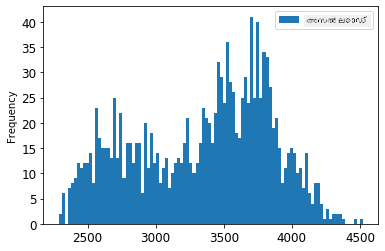
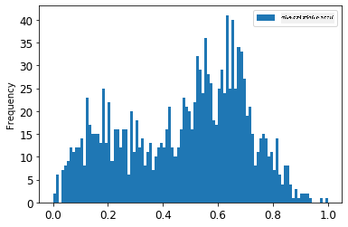
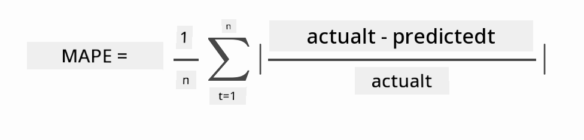

<!--
CO_OP_TRANSLATOR_METADATA:
{
  "original_hash": "917dbf890db71a322f306050cb284749",
  "translation_date": "2025-12-19T16:10:59+00:00",
  "source_file": "7-TimeSeries/2-ARIMA/README.md",
  "language_code": "ml"
}
-->
# ARIMA ഉപയോഗിച്ച് ടൈം സീരീസ് പ്രവചനം

മുൻപത്തെ പാഠത്തിൽ, നിങ്ങൾ ടൈം സീരീസ് പ്രവചനത്തെ കുറിച്ച് കുറച്ച് പഠിച്ചു, കൂടാതെ ഒരു സമയപരിധിയിൽ വൈദ്യുതി ലോഡിന്റെ ചലനങ്ങൾ കാണിക്കുന്ന ഒരു ഡാറ്റാസെറ്റ് ലോഡ് ചെയ്തു.

[](https://youtu.be/IUSk-YDau10 "Introduction to ARIMA")

> 🎥 മുകളിൽ കാണുന്ന ചിത്രത്തിൽ ക്ലിക്ക് ചെയ്യുക ഒരു വീഡിയോക്കായി: ARIMA മോഡലുകളുടെ ഒരു സംക്ഷിപ്ത പരിചയം. ഉദാഹരണം R-ൽ ചെയ്തതാണ്, പക്ഷേ ആശയങ്ങൾ സർവത്രമാണ്.

## [പ്രീ-ലെക്ചർ ക്വിസ്](https://ff-quizzes.netlify.app/en/ml/)

## പരിചയം

ഈ പാഠത്തിൽ, നിങ്ങൾ [ARIMA: *A*uto*R*egressive *I*ntegrated *M*oving *A*verage](https://wikipedia.org/wiki/Autoregressive_integrated_moving_average) ഉപയോഗിച്ച് മോഡലുകൾ നിർമ്മിക്കുന്ന ഒരു പ്രത്യേക മാർഗം കണ്ടെത്തും. ARIMA മോഡലുകൾ പ്രത്യേകിച്ച് [non-stationarity](https://wikipedia.org/wiki/Stationary_process) കാണിക്കുന്ന ഡാറ്റയ്ക്ക് അനുയോജ്യമാണ്.

## പൊതുവായ ആശയങ്ങൾ

ARIMA ഉപയോഗിക്കാൻ കഴിയാൻ, നിങ്ങൾ അറിയേണ്ട ചില ആശയങ്ങൾ ഉണ്ട്:

- 🎓 **സ്റ്റേഷനറിറ്റി**. സാംഖ്യിക പശ്ചാത്തലത്തിൽ, സ്റ്റേഷനറിറ്റി എന്നത് സമയത്തിൽ മാറ്റം വരുത്തുമ്പോഴും വിതരണത്തിൽ മാറ്റമില്ലാത്ത ഡാറ്റയെ സൂചിപ്പിക്കുന്നു. നൺ-സ്റ്റേഷനറി ഡാറ്റ, അതായത് ട്രെൻഡുകൾ മൂലം ചലനങ്ങൾ കാണിക്കുന്ന ഡാറ്റ, വിശകലനം ചെയ്യാൻ മാറ്റം വരുത്തേണ്ടതാണ്. ഉദാഹരണത്തിന്, സീസണാലിറ്റി ഡാറ്റയിൽ ചലനങ്ങൾ കൊണ്ടുവരാം, ഇത് 'സീസണൽ-ഡിഫറൻസിംഗ്' പ്രക്രിയയിലൂടെ നീക്കം ചെയ്യാം.

- 🎓 **[ഡിഫറൻസിംഗ്](https://wikipedia.org/wiki/Autoregressive_integrated_moving_average#Differencing)**. ഡാറ്റ ഡിഫറൻസിംഗ്, വീണ്ടും സാംഖ്യിക പശ്ചാത്തലത്തിൽ, നൺ-സ്റ്റേഷനറി ഡാറ്റയെ സ്റ്റേഷനറി ആക്കാൻ അതിന്റെ സ്ഥിരമല്ലാത്ത ട്രെൻഡ് നീക്കംചെയ്യുന്ന പ്രക്രിയയാണ്. "ഡിഫറൻസിംഗ് ഒരു ടൈം സീരീസിന്റെ തലത്തിലെ മാറ്റങ്ങൾ നീക്കംചെയ്യുന്നു, ട്രെൻഡ്, സീസണാലിറ്റി ഇല്ലാതാക്കുന്നു, അതിനാൽ ടൈം സീരീസിന്റെ ശരാശരി സ്ഥിരമാക്കുന്നു." [ഷിക്ഷിയോങ് et al ലേഖനം](https://arxiv.org/abs/1904.07632)

## ടൈം സീരീസ് പശ്ചാത്തലത്തിൽ ARIMA

ARIMAയുടെ ഭാഗങ്ങൾ വിശദീകരിച്ച്, ഇത് ടൈം സീരീസ് മോഡലിംഗിൽ എങ്ങനെ സഹായിക്കുന്നുവെന്ന് മനസ്സിലാക്കാം.

- **AR - ഓട്ടോറെഗ്രസീവ്**. ഓട്ടോറെഗ്രസീവ് മോഡലുകൾ, പേരുപോലെ, നിങ്ങളുടെ ഡാറ്റയിലെ മുൻകാല മൂല്യങ്ങളെ (ലാഗുകൾ) പരിശോധിച്ച് അവയെക്കുറിച്ച് അനുമാനങ്ങൾ നടത്തുന്നു. ഉദാഹരണത്തിന്, പेंसിൽ മാസവിൽപ്പനയുടെ ഡാറ്റ. ഓരോ മാസത്തെയും വിൽപ്പന 'വികസിക്കുന്ന വ്യത്യാസം' ആയി കണക്കാക്കുന്നു. ഈ മോഡൽ "വികസിക്കുന്ന വ്യത്യാസം അതിന്റെ സ്വന്തം മുൻകാല മൂല്യങ്ങളിൽ റഗ്രസ്സ് ചെയ്യപ്പെടുന്നു." [വിക്കിപീഡിയ](https://wikipedia.org/wiki/Autoregressive_integrated_moving_average)

- **I - ഇന്റഗ്രേറ്റഡ്**. സമാനമായ 'ARMA' മോഡലുകളുമായി താരതമ്യപ്പെടുത്തുമ്പോൾ, ARIMAയിലെ 'I' അതിന്റെ *[ഇന്റഗ്രേറ്റഡ്](https://wikipedia.org/wiki/Order_of_integration)* ഭാഗത്തെ സൂചിപ്പിക്കുന്നു. ഡാറ്റ 'ഇന്റഗ്രേറ്റ്' ചെയ്യപ്പെടുന്നു, ഡിഫറൻസിംഗ് ഘട്ടങ്ങൾ പ്രയോഗിച്ച് നൺ-സ്റ്റേഷനറി നീക്കംചെയ്യാൻ.

- **MA - മൂവിംഗ് അവറേജ്**. ഈ മോഡലിന്റെ [മൂവിംഗ്-അവറേജ്](https://wikipedia.org/wiki/Moving-average_model) ഭാഗം നിലവിലെ ലാഗുകളും മുൻകാല മൂല്യങ്ങളും നിരീക്ഷിച്ച് ഔട്ട്പുട്ട് വ്യത്യാസം നിർണ്ണയിക്കുന്നു.

അവസാനമായി: ARIMA ടൈം സീരീസ് ഡാറ്റയുടെ പ്രത്യേക രൂപം ഏറ്റവും അടുത്ത് ഫിറ്റ് ചെയ്യാൻ ഉപയോഗിക്കുന്നു.

## അഭ്യാസം - ARIMA മോഡൽ നിർമ്മിക്കുക

ഈ പാഠത്തിലെ [_/working_](https://github.com/microsoft/ML-For-Beginners/tree/main/7-TimeSeries/2-ARIMA/working) ഫോൾഡർ തുറന്ന് [_notebook.ipynb_](https://github.com/microsoft/ML-For-Beginners/blob/main/7-TimeSeries/2-ARIMA/working/notebook.ipynb) ഫയൽ കണ്ടെത്തുക.

1. `statsmodels` പൈതൺ ലൈബ്രറി ലോഡ് ചെയ്യാൻ നോട്ട്‌ബുക്ക് റൺ ചെയ്യുക; ARIMA മോഡലുകൾക്കായി ഇത് ആവശ്യമാണ്.

1. ആവശ്യമായ ലൈബ്രറികൾ ലോഡ് ചെയ്യുക

1. ഇപ്പോൾ, ഡാറ്റ പ്ലോട്ടിംഗിന് ഉപകാരപ്രദമായ കൂടുതൽ ലൈബ്രറികൾ ലോഡ് ചെയ്യുക:

    ```python
    import os
    import warnings
    import matplotlib.pyplot as plt
    import numpy as np
    import pandas as pd
    import datetime as dt
    import math

    from pandas.plotting import autocorrelation_plot
    from statsmodels.tsa.statespace.sarimax import SARIMAX
    from sklearn.preprocessing import MinMaxScaler
    from common.utils import load_data, mape
    from IPython.display import Image

    %matplotlib inline
    pd.options.display.float_format = '{:,.2f}'.format
    np.set_printoptions(precision=2)
    warnings.filterwarnings("ignore") # മുന്നറിയിപ്പ് സന്ദേശങ്ങൾ അവഗണിക്കാൻ വ്യക്തമാക്കുക
    ```

1. `/data/energy.csv` ഫയലിൽ നിന്നുള്ള ഡാറ്റ പാൻഡാസ് ഡാറ്റാഫ്രെയിമിലേക്ക് ലോഡ് ചെയ്ത് നോക്കുക:

    ```python
    energy = load_data('./data')[['load']]
    energy.head(10)
    ```

1. 2012 ജനുവരി മുതൽ 2014 ഡിസംബർ വരെ ലഭ്യമായ എല്ലാ എനർജി ഡാറ്റയും പ്ലോട്ട് ചെയ്യുക. കഴിഞ്ഞ പാഠത്തിൽ കണ്ട ഡാറ്റയാണിത്, അതിനാൽ അത്ഭുതങ്ങൾ ഉണ്ടാകില്ല:

    ```python
    energy.plot(y='load', subplots=True, figsize=(15, 8), fontsize=12)
    plt.xlabel('timestamp', fontsize=12)
    plt.ylabel('load', fontsize=12)
    plt.show()
    ```

    ഇപ്പോൾ, മോഡൽ നിർമ്മിക്കാം!

### പരിശീലനവും പരിശോധനയും ഡാറ്റാസെറ്റുകൾ സൃഷ്ടിക്കുക

ഇപ്പോൾ നിങ്ങളുടെ ഡാറ്റ ലോഡ് ചെയ്തിരിക്കുന്നു, അതിനാൽ അത് ട്രെയിൻ, ടെസ്റ്റ് സെറ്റുകളായി വേർതിരിക്കാം. മോഡൽ ട്രെയിൻ സെറ്റിൽ പരിശീലിപ്പിക്കും. സാധാരണ പോലെ, മോഡൽ പരിശീലനം പൂർത്തിയായ ശേഷം, ടെസ്റ്റ് സെറ്റ് ഉപയോഗിച്ച് അതിന്റെ കൃത്യത വിലയിരുത്തും. ടെസ്റ്റ് സെറ്റ് ട്രെയിൻ സെറ്റിനേക്കാൾ പിന്നീട് വരുന്ന സമയപരിധി ഉൾക്കൊള്ളണം, അതിനാൽ മോഡൽ ഭാവിയിലെ സമയങ്ങളിൽ നിന്നുള്ള വിവരങ്ങൾ നേടാതിരിക്കണം.

1. 2014 സെപ്റ്റംബർ 1 മുതൽ ഒക്ടോബർ 31 വരെ രണ്ട് മാസത്തെ കാലയളവ് ട്രെയിൻ സെറ്റിന് അനുവദിക്കുക. ടെസ്റ്റ് സെറ്റ് 2014 നവംബർ 1 മുതൽ ഡിസംബർ 31 വരെ രണ്ട് മാസത്തെ കാലയളവാണ്:

    ```python
    train_start_dt = '2014-11-01 00:00:00'
    test_start_dt = '2014-12-30 00:00:00'
    ```

    ഈ ഡാറ്റ ദിനംപ്രതി എനർജി ഉപഭോഗം പ്രതിഫലിപ്പിക്കുന്നതിനാൽ ശക്തമായ സീസണൽ പാറ്റേൺ ഉണ്ട്, എന്നാൽ ഉപഭോഗം ഏറ്റവും അടുത്ത ദിവസങ്ങളിലെ ഉപഭോഗത്തോട് ഏറ്റവും സമാനമാണ്.

1. വ്യത്യാസങ്ങൾ ദൃശ്യവൽക്കരിക്കുക:

    ```python
    energy[(energy.index < test_start_dt) & (energy.index >= train_start_dt)][['load']].rename(columns={'load':'train'}) \
        .join(energy[test_start_dt:][['load']].rename(columns={'load':'test'}), how='outer') \
        .plot(y=['train', 'test'], figsize=(15, 8), fontsize=12)
    plt.xlabel('timestamp', fontsize=12)
    plt.ylabel('load', fontsize=12)
    plt.show()
    ```

    

    അതിനാൽ, ഡാറ്റ പരിശീലനത്തിന് ചെറിയ ഒരു സമയവിൻഡോ ഉപയോഗിക്കുന്നത് മതിയാകും.

    > കുറിപ്പ്: ARIMA മോഡൽ ഫിറ്റിംഗിനായി ഉപയോഗിക്കുന്ന ഫംഗ്ഷൻ ഇൻ-സാമ്പിൾ വാലിഡേഷൻ ഉപയോഗിക്കുന്നതിനാൽ, വാലിഡേഷൻ ഡാറ്റ ഒഴിവാക്കും.

### പരിശീലനത്തിനായി ഡാറ്റ തയ്യാറാക്കുക

ഇപ്പോൾ, ഡാറ്റ ഫിൽട്ടറിംഗ്, സ്കെയിലിംഗ് എന്നിവ നടത്തി പരിശീലനത്തിനായി തയ്യാറാക്കണം. ആവശ്യമായ സമയപരിധികളും കോളങ്ങളുമുള്ള ഡാറ്റ ഫിൽട്ടർ ചെയ്ത്, ഡാറ്റ 0,1 ഇടവേളയിൽ പ്രൊജക്ട് ചെയ്യാൻ സ്കെയിൽ ചെയ്യുക.

1. മുൻപിൽ പറഞ്ഞ സമയപരിധികളിൽ മാത്രമുള്ള ഡാറ്റ ഫിൽട്ടർ ചെയ്ത് 'load' കോളവും തീയതിയും ഉൾപ്പെടുത്തുക:

    ```python
    train = energy.copy()[(energy.index >= train_start_dt) & (energy.index < test_start_dt)][['load']]
    test = energy.copy()[energy.index >= test_start_dt][['load']]

    print('Training data shape: ', train.shape)
    print('Test data shape: ', test.shape)
    ```

    ഡാറ്റയുടെ ആകൃതി കാണാം:

    ```output
    Training data shape:  (1416, 1)
    Test data shape:  (48, 1)
    ```

1. ഡാറ്റ (0, 1) പരിധിയിൽ സ്കെയിൽ ചെയ്യുക.

    ```python
    scaler = MinMaxScaler()
    train['load'] = scaler.fit_transform(train)
    train.head(10)
    ```

1. ഒറിജിനൽ ഡാറ്റയും സ്കെയിൽ ചെയ്ത ഡാറ്റയും ദൃശ്യവൽക്കരിക്കുക:

    ```python
    energy[(energy.index >= train_start_dt) & (energy.index < test_start_dt)][['load']].rename(columns={'load':'original load'}).plot.hist(bins=100, fontsize=12)
    train.rename(columns={'load':'scaled load'}).plot.hist(bins=100, fontsize=12)
    plt.show()
    ```

    

    > ഒറിജിനൽ ഡാറ്റ

    

    > സ്കെയിൽ ചെയ്ത ഡാറ്റ

1. സ്കെയിൽ ചെയ്ത ഡാറ്റ കാൽബ്രേറ്റ് ചെയ്തതിനുശേഷം, ടെസ്റ്റ് ഡാറ്റയും സ്കെയിൽ ചെയ്യാം:

    ```python
    test['load'] = scaler.transform(test)
    test.head()
    ```

### ARIMA നടപ്പിലാക്കുക

ഇപ്പോൾ ARIMA നടപ്പിലാക്കാനുള്ള സമയം! നിങ്ങൾ മുമ്പ് ഇൻസ്റ്റാൾ ചെയ്ത `statsmodels` ലൈബ്രറി ഉപയോഗിക്കും.

ഇപ്പോൾ നിങ്ങൾക്ക് ചില ഘട്ടങ്ങൾ പിന്തുടരേണ്ടതാണ്

   1. `SARIMAX()` വിളിച്ച് മോഡൽ നിർവചിക്കുക, മോഡൽ പാരാമീറ്ററുകൾ p, d, q, P, D, Q നൽകുക.
   2. fit() ഫംഗ്ഷൻ വിളിച്ച് മോഡൽ പരിശീലനത്തിനായി തയ്യാറാക്കുക.
   3. `forecast()` ഫംഗ്ഷൻ വിളിച്ച് പ്രവചനങ്ങൾ നടത്തുക, പ്രവചിക്കേണ്ട ഘട്ടങ്ങളുടെ എണ്ണം (horizon) വ്യക്തമാക്കുക.

> 🎓 ഈ പാരാമീറ്ററുകൾ എന്തിനാണ്? ARIMA മോഡലിൽ ടൈം സീരീസിന്റെ പ്രധാന ഘടകങ്ങൾ മോഡലാക്കാൻ 3 പാരാമീറ്ററുകൾ ഉണ്ട്: സീസണാലിറ്റി, ട്രെൻഡ്, ശബ്ദം. ഇവയാണ്:

`p`: മോഡലിന്റെ ഓട്ടോ-റെഗ്രസീവ് ഭാഗവുമായി ബന്ധപ്പെട്ട പാരാമീറ്റർ, *മുൻകാല* മൂല്യങ്ങൾ ഉൾക്കൊള്ളുന്നു.
`d`: മോഡലിന്റെ ഇന്റഗ്രേറ്റഡ് ഭാഗവുമായി ബന്ധപ്പെട്ട പാരാമീറ്റർ, ടൈം സീരീസിൽ *ഡിഫറൻസിംഗ്* (🎓 മുകളിൽ ഡിഫറൻസിംഗ് ഓർമ്മിക്കുക) പ്രയോഗിക്കുന്നതിനെ ബാധിക്കുന്നു.
`q`: മോഡലിന്റെ മൂവിംഗ്-അവറേജ് ഭാഗവുമായി ബന്ധപ്പെട്ട പാരാമീറ്റർ.

> കുറിപ്പ്: നിങ്ങളുടെ ഡാറ്റയിൽ സീസണൽ ഘടകം ഉണ്ടെങ്കിൽ - ഈ ഡാറ്റയിൽ ഉണ്ട് - സീസണൽ ARIMA മോഡൽ (SARIMA) ഉപയോഗിക്കും. അപ്പോൾ മറ്റൊരു പാരാമീറ്റർ സെറ്റ് ഉപയോഗിക്കണം: `P`, `D`, `Q` - ഇവ `p`, `d`, `q` പോലെയാണ്, പക്ഷേ മോഡലിന്റെ സീസണൽ ഘടകങ്ങളെ സൂചിപ്പിക്കുന്നു.

1. നിങ്ങളുടെ ഇഷ്ടമുള്ള horizon മൂല്യം സെറ്റ് ചെയ്യുക. 3 മണിക്കൂർ ശ്രമിക്കാം:

    ```python
    # മുന്നോട്ടു പ്രവചിക്കാൻ ഘട്ടങ്ങളുടെ എണ്ണം വ്യക്തമാക്കുക
    HORIZON = 3
    print('Forecasting horizon:', HORIZON, 'hours')
    ```

    ARIMA മോഡലിന്റെ പാരാമീറ്ററുകൾക്ക് മികച്ച മൂല്യങ്ങൾ തിരഞ്ഞെടുക്കുന്നത് സങ്കീർണ്ണവും സമയമെടുക്കുന്നതുമായ പ്രക്രിയയാണ്. നിങ്ങൾക്ക് [`pyramid` ലൈബ്രറിയിലെ `auto_arima()` ഫംഗ്ഷൻ](https://alkaline-ml.com/pmdarima/0.9.0/modules/generated/pyramid.arima.auto_arima.html) ഉപയോഗിക്കാം.

1. ഇപ്പോൾ ചില മാനുവൽ തിരഞ്ഞെടുപ്പുകൾ പരീക്ഷിച്ച് നല്ല മോഡൽ കണ്ടെത്തുക.

    ```python
    order = (4, 1, 0)
    seasonal_order = (1, 1, 0, 24)

    model = SARIMAX(endog=train, order=order, seasonal_order=seasonal_order)
    results = model.fit()

    print(results.summary())
    ```

    ഫലങ്ങളുടെ പട്ടിക പ്രിന്റ് ചെയ്യും.

നിങ്ങൾ ആദ്യ മോഡൽ നിർമ്മിച്ചു! ഇപ്പോൾ അത് വിലയിരുത്താനുള്ള മാർഗം കണ്ടെത്തണം.

### നിങ്ങളുടെ മോഡൽ വിലയിരുത്തുക

നിങ്ങളുടെ മോഡൽ വിലയിരുത്താൻ,所谓 `walk forward` വാലിഡേഷൻ നടത്താം. പ്രായോഗികമായി, ടൈം സീരീസ് മോഡലുകൾ പുതിയ ഡാറ്റ ലഭിക്കുമ്പോൾ വീണ്ടും പരിശീലിപ്പിക്കുന്നു. ഇതിലൂടെ ഓരോ സമയ ഘട്ടത്തിലും മികച്ച പ്രവചനങ്ങൾ നടത്താൻ കഴിയും.

ടൈം സീരീസ് ആരംഭത്തിൽ നിന്ന് ഈ സാങ്കേതിക വിദ്യ ഉപയോഗിച്ച്, ട്രെയിൻ ഡാറ്റ സെറ്റിൽ മോഡൽ പരിശീലിപ്പിക്കുക. തുടർന്ന് അടുത്ത സമയ ഘട്ടത്തിൽ പ്രവചനമാക്കുക. പ്രവചനത്തെ അറിയപ്പെടുന്ന മൂല്യവുമായി താരതമ്യം ചെയ്യുക. ട്രെയിൻ സെറ്റ് അറിയപ്പെടുന്ന മൂല്യം ഉൾക്കൊള്ളിച്ച് വിപുലീകരിക്കുക, പ്രക്രിയ ആവർത്തിക്കുക.

> കുറിപ്പ്: കൂടുതൽ കാര്യക്ഷമമായ പരിശീലനത്തിനായി ട്രെയിൻ സെറ്റ് വിൻഡോ സ്ഥിരമായി സൂക്ഷിക്കുക, പുതിയ നിരീക്ഷണം ചേർക്കുമ്പോൾ തുടക്കത്തിലെ നിരീക്ഷണം നീക്കംചെയ്യുക.

ഈ പ്രക്രിയ മോഡൽ പ്രായോഗികമായി എങ്ങനെ പ്രവർത്തിക്കും എന്നതിന്റെ കൂടുതൽ ശക്തമായ അളവുകോൽ നൽകുന്നു. എന്നാൽ ഇതിന് നിരവധി മോഡലുകൾ സൃഷ്ടിക്കേണ്ടതായതിനാൽ കംപ്യൂട്ടേഷൻ ചെലവ് കൂടുതലാണ്. ഡാറ്റ ചെറിയതായോ മോഡൽ ലളിതമായോ ആയാൽ ഇത് അംഗീകരിക്കാവുന്നതാണ്, പക്ഷേ വലിയ തോതിൽ പ്രശ്നമാകാം.

വാക്ക്-ഫോർവേഡ് വാലിഡേഷൻ ടൈം സീരീസ് മോഡൽ വിലയിരുത്തലിന്റെ സ്വർണ്ണ മാനദണ്ഡമാണ്, നിങ്ങളുടെ സ്വന്തം പ്രോജക്റ്റുകൾക്കായി ഇത് ശുപാർശ ചെയ്യുന്നു.

1. ആദ്യം, ഓരോ HORIZON ഘട്ടത്തിനും ഒരു ടെസ്റ്റ് ഡാറ്റ പോയിന്റ് സൃഷ്ടിക്കുക.

    ```python
    test_shifted = test.copy()

    for t in range(1, HORIZON+1):
        test_shifted['load+'+str(t)] = test_shifted['load'].shift(-t, freq='H')

    test_shifted = test_shifted.dropna(how='any')
    test_shifted.head(5)
    ```

    |            |          | load | load+1 | load+2 |
    | ---------- | -------- | ---- | ------ | ------ |
    | 2014-12-30 | 00:00:00 | 0.33 | 0.29   | 0.27   |
    | 2014-12-30 | 01:00:00 | 0.29 | 0.27   | 0.27   |
    | 2014-12-30 | 02:00:00 | 0.27 | 0.27   | 0.30   |
    | 2014-12-30 | 03:00:00 | 0.27 | 0.30   | 0.41   |
    | 2014-12-30 | 04:00:00 | 0.30 | 0.41   | 0.57   |

    ഡാറ്റ അതിന്റെ horizon പോയിന്റ് അനുസരിച്ച് ഹോരിസോണ്ടലായി മാറ്റിയിരിക്കുന്നു.

1. ടെസ്റ്റ് ഡാറ്റയിൽ ഈ സ്ലൈഡിംഗ് വിൻഡോ സമീപനം ഉപയോഗിച്ച് പ്രവചനങ്ങൾ നടത്തുക, ടെസ്റ്റ് ഡാറ്റയുടെ നീളത്തോളം ലൂപ്പ് നടത്തുക:

    ```python
    %%time
    training_window = 720 # പരിശീലനത്തിന് 30 ദിവസം (720 മണിക്കൂർ) സമർപ്പിക്കുക

    train_ts = train['load']
    test_ts = test_shifted

    history = [x for x in train_ts]
    history = history[(-training_window):]

    predictions = list()

    order = (2, 1, 0)
    seasonal_order = (1, 1, 0, 24)

    for t in range(test_ts.shape[0]):
        model = SARIMAX(endog=history, order=order, seasonal_order=seasonal_order)
        model_fit = model.fit()
        yhat = model_fit.forecast(steps = HORIZON)
        predictions.append(yhat)
        obs = list(test_ts.iloc[t])
        # പരിശീലന വിൻഡോ നീക്കുക
        history.append(obs[0])
        history.pop(0)
        print(test_ts.index[t])
        print(t+1, ': predicted =', yhat, 'expected =', obs)
    ```

    പരിശീലനം നടക്കുന്നത് കാണാം:

    ```output
    2014-12-30 00:00:00
    1 : predicted = [0.32 0.29 0.28] expected = [0.32945389435989236, 0.2900626678603402, 0.2739480752014323]

    2014-12-30 01:00:00
    2 : predicted = [0.3  0.29 0.3 ] expected = [0.2900626678603402, 0.2739480752014323, 0.26812891674127126]

    2014-12-30 02:00:00
    3 : predicted = [0.27 0.28 0.32] expected = [0.2739480752014323, 0.26812891674127126, 0.3025962399283795]
    ```

1. പ്രവചനങ്ങളെ യഥാർത്ഥ ലോഡുമായി താരതമ്യം ചെയ്യുക:

    ```python
    eval_df = pd.DataFrame(predictions, columns=['t+'+str(t) for t in range(1, HORIZON+1)])
    eval_df['timestamp'] = test.index[0:len(test.index)-HORIZON+1]
    eval_df = pd.melt(eval_df, id_vars='timestamp', value_name='prediction', var_name='h')
    eval_df['actual'] = np.array(np.transpose(test_ts)).ravel()
    eval_df[['prediction', 'actual']] = scaler.inverse_transform(eval_df[['prediction', 'actual']])
    eval_df.head()
    ```

    ഔട്ട്പുട്ട്
    |     |            | timestamp | h   | prediction | actual   |
    | --- | ---------- | --------- | --- | ---------- | -------- |
    | 0   | 2014-12-30 | 00:00:00  | t+1 | 3,008.74   | 3,023.00 |
    | 1   | 2014-12-30 | 01:00:00  | t+1 | 2,955.53   | 2,935.00 |
    | 2   | 2014-12-30 | 02:00:00  | t+1 | 2,900.17   | 2,899.00 |
    | 3   | 2014-12-30 | 03:00:00  | t+1 | 2,917.69   | 2,886.00 |
    | 4   | 2014-12-30 | 04:00:00  | t+1 | 2,946.99   | 2,963.00 |

    മണിക്കൂറിൽ ഓരോ ഡാറ്റയുടെ പ്രവചനവും യഥാർത്ഥ ലോഡുമായി താരതമ്യം ചെയ്യുക. ഇത് എത്രത്തോളം കൃത്യമാണെന്ന് കാണുക.

### മോഡൽ കൃത്യത പരിശോധിക്കുക

എല്ലാ പ്രവചനങ്ങളിലും മോഡലിന്റെ ശരാശരി ആബ്സല്യൂട്ട് ശതമാന പിശക് (MAPE) പരിശോധിച്ച് കൃത്യത വിലയിരുത്തുക.

> **🧮 ഗണിതം കാണിക്കുക**
>
> 
>
>  [MAPE](https://www.linkedin.com/pulse/what-mape-mad-msd-time-series-allameh-statistics/) മുൻകൂട്ടി കണക്കാക്കലിന്റെ കൃത്യത മുകളിൽ നൽകിയ ഫോർമുല ഉപയോഗിച്ച് നിർവചിച്ച അനുപാതമായി കാണിക്കാൻ ഉപയോഗിക്കുന്നു. actual<sub>t</sub>നും predicted<sub>t</sub>നും ഇടയിലെ വ്യത്യാസം actual<sub>t</sub>ൽ വിഭജിക്കുന്നു. "ഈ കണക്കിൽ ആബ്സല്യൂട്ട് മൂല്യം ഓരോ മുൻകൂട്ടി കണക്കാക്കിയ സമയബിന്ദുവിനും കൂട്ടിച്ചേർത്ത് ഫിറ്റുചെയ്ത ബിന്ദുക്കളുടെ എണ്ണം n-ൽ വിഭജിക്കുന്നു." [wikipedia](https://wikipedia.org/wiki/Mean_absolute_percentage_error)

1. സമവാക്യം കോഡിൽ പ്രകടിപ്പിക്കുക:

    ```python
    if(HORIZON > 1):
        eval_df['APE'] = (eval_df['prediction'] - eval_df['actual']).abs() / eval_df['actual']
        print(eval_df.groupby('h')['APE'].mean())
    ```

1. ഒരു ഘട്ടത്തിന്റെ MAPE കണക്കാക്കുക:

    ```python
    print('One step forecast MAPE: ', (mape(eval_df[eval_df['h'] == 't+1']['prediction'], eval_df[eval_df['h'] == 't+1']['actual']))*100, '%')
    ```

    ഒരു ഘട്ടം മുൻകൂട്ടി MAPE:  0.5570581332313952 %

1. ബഹുഘട്ട മുൻകൂട്ടി MAPE പ്രിന്റ് ചെയ്യുക:

    ```python
    print('Multi-step forecast MAPE: ', mape(eval_df['prediction'], eval_df['actual'])*100, '%')
    ```

    ```output
    Multi-step forecast MAPE:  1.1460048657704118 %
    ```

    കുറഞ്ഞ സംഖ്യ നല്ലതാണ്: MAPE 10 ഉള്ള ഒരു മുൻകൂട്ടി 10% വ്യത്യാസമുള്ളതാണ് എന്ന് പരിഗണിക്കുക.

1. എന്നാൽ എപ്പോഴും, ഈ തരത്തിലുള്ള കൃത്യതാ അളവ് ദൃശ്യമായി കാണുന്നത് എളുപ്പമാണ്, അതിനാൽ ഇത് പ്ലോട്ട് ചെയ്യാം:

    ```python
     if(HORIZON == 1):
        ## ഒറ്റ ഘട്ട പ്രവചനത്തിന്റെ ഗ്രാഫ് വരയ്ക്കുന്നു
        eval_df.plot(x='timestamp', y=['actual', 'prediction'], style=['r', 'b'], figsize=(15, 8))

    else:
        ## ബഹുഘട്ട പ്രവചനത്തിന്റെ ഗ്രാഫ് വരയ്ക്കുന്നു
        plot_df = eval_df[(eval_df.h=='t+1')][['timestamp', 'actual']]
        for t in range(1, HORIZON+1):
            plot_df['t+'+str(t)] = eval_df[(eval_df.h=='t+'+str(t))]['prediction'].values

        fig = plt.figure(figsize=(15, 8))
        ax = plt.plot(plot_df['timestamp'], plot_df['actual'], color='red', linewidth=4.0)
        ax = fig.add_subplot(111)
        for t in range(1, HORIZON+1):
            x = plot_df['timestamp'][(t-1):]
            y = plot_df['t+'+str(t)][0:len(x)]
            ax.plot(x, y, color='blue', linewidth=4*math.pow(.9,t), alpha=math.pow(0.8,t))

        ax.legend(loc='best')

    plt.xlabel('timestamp', fontsize=12)
    plt.ylabel('load', fontsize=12)
    plt.show()
    ```

    

🏆 വളരെ നല്ല ഒരു പ്ലോട്ട്, നല്ല കൃത്യതയുള്ള ഒരു മോഡൽ കാണിക്കുന്നു. നല്ല ജോലി!

---

## 🚀ചലഞ്ച്

ടൈം സീരീസ് മോഡലിന്റെ കൃത്യത പരിശോധിക്കുന്ന മാർഗങ്ങൾ അന്വേഷിക്കുക. ഈ പാഠത്തിൽ MAPE-യെ കുറിച്ച് touched ചെയ്തിട്ടുണ്ട്, പക്ഷേ നിങ്ങൾ ഉപയോഗിക്കാവുന്ന മറ്റ് രീതികൾ ഉണ്ടോ? അവയെ ഗവേഷിച്ച് കുറിപ്പിടുക. സഹായകമായ ഒരു ഡോക്യുമെന്റ് [ഇവിടെ](https://otexts.com/fpp2/accuracy.html) ലഭ്യമാണ്.

## [പാഠം കഴിഞ്ഞുള്ള ക്വിസ്](https://ff-quizzes.netlify.app/en/ml/)

## അവലോകനം & സ്വയം പഠനം

ഈ പാഠം ARIMA ഉപയോഗിച്ച ടൈം സീരീസ് ഫോറ്കാസ്റ്റിംഗിന്റെ അടിസ്ഥാനങ്ങൾ മാത്രമാണ് സ്പർശിക്കുന്നത്. ടൈം സീരീസ് മോഡലുകൾ നിർമ്മിക്കുന്ന മറ്റ് മാർഗങ്ങൾ പഠിക്കാൻ [ഈ റിപോസിറ്ററി](https://microsoft.github.io/forecasting/)യും അതിന്റെ വിവിധ മോഡൽ തരംകളും പരിശോധിച്ച് നിങ്ങളുടെ അറിവ് ആഴപ്പെടുത്തുക.

## അസൈൻമെന്റ്

[ഒരു പുതിയ ARIMA മോഡൽ](assignment.md)

---

<!-- CO-OP TRANSLATOR DISCLAIMER START -->
**അസൂയാ**:  
ഈ രേഖ AI വിവർത്തന സേവനം [Co-op Translator](https://github.com/Azure/co-op-translator) ഉപയോഗിച്ച് വിവർത്തനം ചെയ്തതാണ്. നാം കൃത്യതയ്ക്ക് ശ്രമിച്ചെങ്കിലും, സ്വയം പ്രവർത്തിക്കുന്ന വിവർത്തനങ്ങളിൽ പിശകുകൾ അല്ലെങ്കിൽ തെറ്റുകൾ ഉണ്ടാകാമെന്ന് ദയവായി ശ്രദ്ധിക്കുക. അതിന്റെ മാതൃഭാഷയിലുള്ള യഥാർത്ഥ രേഖയാണ് പ്രാമാണികമായ ഉറവിടം എന്ന് പരിഗണിക്കേണ്ടതാണ്. നിർണായക വിവരങ്ങൾക്ക്, പ്രൊഫഷണൽ മനുഷ്യ വിവർത്തനം ശുപാർശ ചെയ്യപ്പെടുന്നു. ഈ വിവർത്തനം ഉപയോഗിക്കുന്നതിൽ നിന്നുണ്ടാകുന്ന ഏതെങ്കിലും തെറ്റിദ്ധാരണകൾക്കോ തെറ്റായ വ്യാഖ്യാനങ്ങൾക്കോ ഞങ്ങൾ ഉത്തരവാദികളല്ല.
<!-- CO-OP TRANSLATOR DISCLAIMER END -->