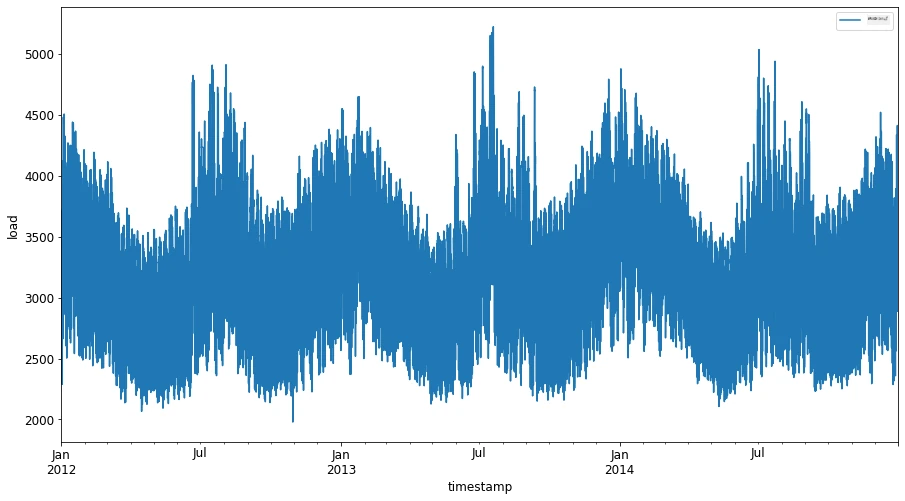
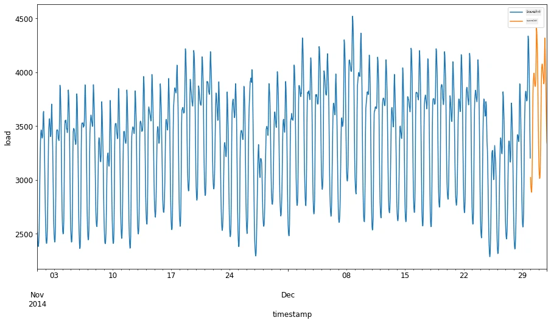
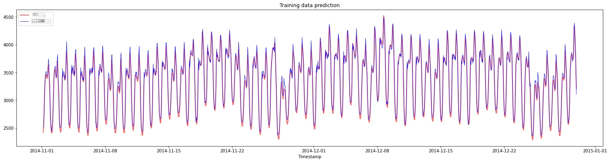
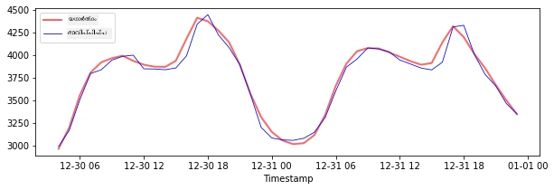
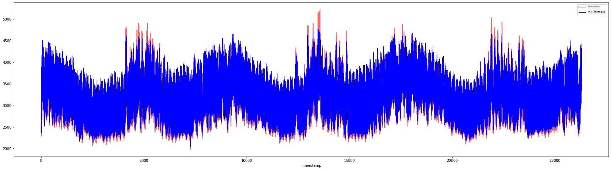

<!--
CO_OP_TRANSLATOR_METADATA:
{
  "original_hash": "482bccabe1df958496ea71a3667995cd",
  "translation_date": "2025-12-19T15:58:16+00:00",
  "source_file": "7-TimeSeries/3-SVR/README.md",
  "language_code": "ml"
}
-->
# Support Vector Regressor ഉപയോഗിച്ച് ടൈം സീരീസ് പ്രവചനം

മുൻപത്തെ പാഠത്തിൽ, ടൈം സീരീസ് പ്രവചനങ്ങൾ നടത്താൻ ARIMA മോഡൽ എങ്ങനെ ഉപയോഗിക്കാമെന്ന് നിങ്ങൾ പഠിച്ചു. ഇപ്പോൾ നിങ്ങൾ തുടർച്ചയായ ഡാറ്റ പ്രവചിക്കാൻ ഉപയോഗിക്കുന്ന ഒരു റെഗ്രസർ മോഡലായ Support Vector Regressor മോഡലിനെക്കുറിച്ച് നോക്കാൻ പോകുന്നു.

## [പ്രീ-ലെക്ചർ ക്വിസ്](https://ff-quizzes.netlify.app/en/ml/) 

## പരിചയം

ഈ പാഠത്തിൽ, നിങ്ങൾ റെഗ്രഷനിനായി [**SVM**: **S**upport **V**ector **M**achine](https://en.wikipedia.org/wiki/Support-vector_machine) ഉപയോഗിച്ച് മോഡലുകൾ നിർമ്മിക്കുന്ന ഒരു പ്രത്യേക മാർഗം കണ്ടെത്തും, അല്ലെങ്കിൽ **SVR: Support Vector Regressor**.

### ടൈം സീരീസ് സാന്ദർഭ്യത്തിൽ SVR [^1]

ടൈം സീരീസ് പ്രവചനത്തിൽ SVR-ന്റെ പ്രാധാന്യം മനസ്സിലാക്കുന്നതിന് മുമ്പ്, നിങ്ങൾ അറിയേണ്ട ചില പ്രധാന ആശയങ്ങൾ ഇവയാണ്:

- **Regression:** നൽകിയ ഇൻപുട്ടുകളുടെ ഒരു സെറ്റിൽ നിന്ന് തുടർച്ചയായ മൂല്യങ്ങൾ പ്രവചിക്കാൻ ഉപയോഗിക്കുന്ന സൂപ്പർവൈസ്ഡ് ലേണിംഗ് സാങ്കേതിക വിദ്യ. ഫീച്ചർ സ്പേസിൽ ഏറ്റവും കൂടുതൽ ഡാറ്റ പോയിന്റുകൾ ഉള്ള ഒരു വളവ് (അഥവാ രേഖ) ഫിറ്റ് ചെയ്യുക എന്നതാണ് ആശയം. കൂടുതൽ വിവരങ്ങൾക്ക് [ഇവിടെ ക്ലിക്ക് ചെയ്യുക](https://en.wikipedia.org/wiki/Regression_analysis).
- **Support Vector Machine (SVM):** ക്ലാസിഫിക്കേഷൻ, റെഗ്രഷൻ, ഔട്ട്‌ലൈയർ കണ്ടെത്തൽ എന്നിവയ്ക്ക് ഉപയോഗിക്കുന്ന ഒരു തരം സൂപ്പർവൈസ്ഡ് മെഷീൻ ലേണിംഗ് മോഡൽ. മോഡൽ ഫീച്ചർ സ്പേസിലെ ഒരു ഹൈപ്പർപ്ലെയിൻ ആണ്, ക്ലാസിഫിക്കേഷനിൽ അതു ഒരു അതിരായി പ്രവർത്തിക്കുകയും, റെഗ്രഷനിൽ ഏറ്റവും മികച്ച ഫിറ്റ് രേഖയായി പ്രവർത്തിക്കുകയും ചെയ്യുന്നു. SVM-ൽ, ഡാറ്റാസെറ്റ് ഉയർന്ന ഡൈമെൻഷനുകളുള്ള സ്പേസിലേക്ക് മാറ്റാൻ സാധിക്കുന്ന Kernel ഫംഗ്ഷൻ സാധാരണയായി ഉപയോഗിക്കുന്നു, അതിലൂടെ ഡാറ്റകൾ എളുപ്പത്തിൽ വേർതിരിക്കാവുന്നതാകും. SVM-കളെക്കുറിച്ച് കൂടുതൽ വിവരങ്ങൾക്ക് [ഇവിടെ ക്ലിക്ക് ചെയ്യുക](https://en.wikipedia.org/wiki/Support-vector_machine).
- **Support Vector Regressor (SVR):** SVM-ന്റെ ഒരു തരം, ഏറ്റവും കൂടുതൽ ഡാറ്റ പോയിന്റുകൾ ഉള്ള മികച്ച ഫിറ്റ് രേഖ (SVM-ൽ ഹൈപ്പർപ്ലെയിൻ) കണ്ടെത്താൻ.

### എന്തുകൊണ്ട് SVR? [^1]

കഴിഞ്ഞ പാഠത്തിൽ നിങ്ങൾ ARIMA-യെക്കുറിച്ച് പഠിച്ചു, ഇത് ടൈം സീരീസ് ഡാറ്റ പ്രവചിക്കാൻ വളരെ വിജയകരമായ ഒരു സാങ്കേതിക രേഖാമൂലക രീതി ആണ്. എന്നാൽ, പലപ്പോഴും ടൈം സീരീസ് ഡാറ്റയിൽ *നോൺ-ലിനിയാരിറ്റി* ഉണ്ടാകാറുണ്ട്, ഇത് ലിനിയാർ മോഡലുകൾ ഉപയോഗിച്ച് മാപ്പ് ചെയ്യാനാകില്ല. ഇത്തരം സാഹചര്യങ്ങളിൽ, റെഗ്രഷൻ ടാസ്കുകൾക്കായി ഡാറ്റയിലെ നോൺ-ലിനിയാരിറ്റി പരിഗണിക്കുന്ന SVM-ന്റെ കഴിവ് SVR-നെ ടൈം സീരീസ് പ്രവചനത്തിൽ വിജയകരമാക്കുന്നു.

## അഭ്യാസം - SVR മോഡൽ നിർമ്മിക്കുക

ഡാറ്റാ തയ്യാറാക്കലിന്റെ ആദ്യ കുറച്ച് ഘട്ടങ്ങൾ മുൻപത്തെ [ARIMA](https://github.com/microsoft/ML-For-Beginners/tree/main/7-TimeSeries/2-ARIMA) പാഠത്തിലെ പോലെ തന്നെയാണ്.

ഈ പാഠത്തിലെ [_/working_](https://github.com/microsoft/ML-For-Beginners/tree/main/7-TimeSeries/3-SVR/working) ഫോൾഡർ തുറന്ന് [_notebook.ipynb_](https://github.com/microsoft/ML-For-Beginners/blob/main/7-TimeSeries/3-SVR/working/notebook.ipynb) ഫയൽ കണ്ടെത്തുക.[^2]

1. നോട്ട്‌ബുക്ക് റൺ ചെയ്ത് ആവശ്യമായ ലൈബ്രറികൾ ഇറക്കുമതി ചെയ്യുക:  [^2]

   ```python
   import sys
   sys.path.append('../../')
   ```

   ```python
   import os
   import warnings
   import matplotlib.pyplot as plt
   import numpy as np
   import pandas as pd
   import datetime as dt
   import math
   
   from sklearn.svm import SVR
   from sklearn.preprocessing import MinMaxScaler
   from common.utils import load_data, mape
   ```

2. `/data/energy.csv` ഫയലിൽ നിന്നുള്ള ഡാറ്റ പാൻഡാസ് ഡാറ്റാഫ്രെയിമിലേക്ക് ലോഡ് ചെയ്ത് നോക്കുക:  [^2]

   ```python
   energy = load_data('../../data')[['load']]
   ```

3. 2012 ജനുവരി മുതൽ 2014 ഡിസംബർ വരെ ലഭ്യമായ എല്ലാ എനർജി ഡാറ്റയും പ്ലോട്ട് ചെയ്യുക: [^2]

   ```python
   energy.plot(y='load', subplots=True, figsize=(15, 8), fontsize=12)
   plt.xlabel('timestamp', fontsize=12)
   plt.ylabel('load', fontsize=12)
   plt.show()
   ```

   

   ഇപ്പോൾ, നമുക്ക് SVR മോഡൽ നിർമ്മിക്കാം.

### ട്രെയിനിംഗ്, ടെസ്റ്റിംഗ് ഡാറ്റാസെറ്റുകൾ സൃഷ്ടിക്കുക

ഇപ്പോൾ നിങ്ങളുടെ ഡാറ്റ ലോഡ് ചെയ്തിരിക്കുന്നു, അതിനാൽ അത് ട്രെയിൻ, ടെസ്റ്റ് സെറ്റുകളായി വേർതിരിക്കാം. പിന്നീട് SVR-ക്ക് ആവശ്യമായ ടൈം-സ്റ്റെപ്പ് അടിസ്ഥാനമാക്കിയുള്ള ഡാറ്റാസെറ്റ് സൃഷ്ടിക്കാൻ ഡാറ്റ പുനരാകൃതമാക്കും. മോഡൽ ട്രെയിൻ സെറ്റിൽ പരിശീലിപ്പിക്കും. മോഡൽ പരിശീലനം പൂർത്തിയായ ശേഷം, ട്രെയിനിംഗ് സെറ്റ്, ടെസ്റ്റിംഗ് സെറ്റ്, പിന്നെ മുഴുവൻ ഡാറ്റാസെറ്റിൽ അതിന്റെ കൃത്യത വിലയിരുത്തും. ടെസ്റ്റ് സെറ്റ് ട്രെയിനിംഗ് സെറ്റിൽ നിന്നുള്ള പിന്നീട് കാലയളവിൽ നിന്നുള്ളതായിരിക്കണം, അതിലൂടെ മോഡൽ ഭാവിയിലെ സമയങ്ങളിൽ നിന്നുള്ള വിവരങ്ങൾ നേടാതിരിക്കണം [^2] (*ഓവർഫിറ്റിംഗ്* എന്നറിയപ്പെടുന്ന സ്ഥിതി).

1. 2014 സെപ്റ്റംബർ 1 മുതൽ ഒക്ടോബർ 31 വരെ രണ്ട് മാസത്തെ കാലയളവ് ട്രെയിനിംഗ് സെറ്റിന് അനുവദിക്കുക. ടെസ്റ്റ് സെറ്റ് 2014 നവംബർ 1 മുതൽ ഡിസംബർ 31 വരെ രണ്ട് മാസത്തെ കാലയളവ് ഉൾക്കൊള്ളും: [^2]

   ```python
   train_start_dt = '2014-11-01 00:00:00'
   test_start_dt = '2014-12-30 00:00:00'
   ```

2. വ്യത്യാസങ്ങൾ ദൃശ്യവൽക്കരിക്കുക: [^2]

   ```python
   energy[(energy.index < test_start_dt) & (energy.index >= train_start_dt)][['load']].rename(columns={'load':'train'}) \
       .join(energy[test_start_dt:][['load']].rename(columns={'load':'test'}), how='outer') \
       .plot(y=['train', 'test'], figsize=(15, 8), fontsize=12)
   plt.xlabel('timestamp', fontsize=12)
   plt.ylabel('load', fontsize=12)
   plt.show()
   ```

   


### ട്രെയിനിംഗിനായി ഡാറ്റ തയ്യാറാക്കുക

ഇപ്പോൾ, നിങ്ങളുടെ ഡാറ്റ ഫിൽട്ടർ ചെയ്ത് സ്കെയിൽ ചെയ്ത് ട്രെയിനിംഗിനായി തയ്യാറാക്കണം. ആവശ്യമായ സമയപരിധികളും കോളങ്ങളുമായി മാത്രം നിങ്ങളുടെ ഡാറ്റാസെറ്റ് ഫിൽട്ടർ ചെയ്യുക, ഡാറ്റ 0,1 ഇടവേളയിൽ പ്രൊജക്ട് ചെയ്യാൻ സ്കെയ്ലിംഗ് നടത്തുക.

1. മുൻകൂട്ടി പറഞ്ഞ സമയപരിധികളിൽ മാത്രവും 'load' എന്ന ആവശ്യമായ കോളവും തീയതിയും ഉൾപ്പെടെ ഒറിജിനൽ ഡാറ്റാസെറ്റ് ഫിൽട്ടർ ചെയ്യുക: [^2]

   ```python
   train = energy.copy()[(energy.index >= train_start_dt) & (energy.index < test_start_dt)][['load']]
   test = energy.copy()[energy.index >= test_start_dt][['load']]
   
   print('Training data shape: ', train.shape)
   print('Test data shape: ', test.shape)
   ```

   ```output
   Training data shape:  (1416, 1)
   Test data shape:  (48, 1)
   ```
   
2. ട്രെയിനിംഗ് ഡാറ്റ 0 മുതൽ 1 വരെയുള്ള പരിധിയിലാക്കുക: [^2]

   ```python
   scaler = MinMaxScaler()
   train['load'] = scaler.fit_transform(train)
   ```
   
4. ഇപ്പോൾ, ടെസ്റ്റിംഗ് ഡാറ്റ സ്കെയിൽ ചെയ്യുക: [^2]

   ```python
   test['load'] = scaler.transform(test)
   ```

### ടൈം-സ്റ്റെപ്പുകളുള്ള ഡാറ്റ സൃഷ്ടിക്കുക [^1]

SVR-ക്കായി, ഇൻപുട്ട് ഡാറ്റ `[batch, timesteps]` എന്ന രൂപത്തിലാക്കണം. അതിനാൽ നിലവിലുള്ള `train_data`യും `test_data`യും പുനരാകൃതമാക്കുന്നു, പുതിയ ഒരു ഡൈമെൻഷൻ ടൈംസ്റ്റെപ്പുകളെ സൂചിപ്പിക്കുന്നു.

```python
# നംപൈ അറേകളിലേക്ക് മാറ്റുന്നു
train_data = train.values
test_data = test.values
```

ഈ ഉദാഹരണത്തിൽ, `timesteps = 5` എടുത്തിരിക്കുന്നു. അതായത്, മോഡലിന് നൽകുന്ന ഇൻപുട്ടുകൾ ആദ്യ 4 ടൈംസ്റ്റെപ്പുകളിലെ ഡാറ്റയാണ്, ഔട്ട്പുട്ട് 5-ആം ടൈംസ്റ്റെപ്പിലെ ഡാറ്റ ആയിരിക്കും.

```python
timesteps=5
```

നസ്റ്റ് ചെയ്ത ലിസ്റ്റ് കോംപ്രഹെൻഷൻ ഉപയോഗിച്ച് ട്രെയിനിംഗ് ഡാറ്റ 2D ടെൻസറിലേക്ക് മാറ്റുന്നു:

```python
train_data_timesteps=np.array([[j for j in train_data[i:i+timesteps]] for i in range(0,len(train_data)-timesteps+1)])[:,:,0]
train_data_timesteps.shape
```

```output
(1412, 5)
```

ടെസ്റ്റിംഗ് ഡാറ്റ 2D ടെൻസറിലേക്ക് മാറ്റുന്നു:

```python
test_data_timesteps=np.array([[j for j in test_data[i:i+timesteps]] for i in range(0,len(test_data)-timesteps+1)])[:,:,0]
test_data_timesteps.shape
```

```output
(44, 5)
```

ട്രെയിനിംഗ്, ടെസ്റ്റിംഗ് ഡാറ്റയിൽ നിന്ന് ഇൻപുട്ടുകളും ഔട്ട്പുട്ടുകളും തിരഞ്ഞെടുക്കുന്നു:

```python
x_train, y_train = train_data_timesteps[:,:timesteps-1],train_data_timesteps[:,[timesteps-1]]
x_test, y_test = test_data_timesteps[:,:timesteps-1],test_data_timesteps[:,[timesteps-1]]

print(x_train.shape, y_train.shape)
print(x_test.shape, y_test.shape)
```

```output
(1412, 4) (1412, 1)
(44, 4) (44, 1)
```

### SVR നടപ്പിലാക്കുക [^1]

ഇപ്പോൾ, SVR നടപ്പിലാക്കാനുള്ള സമയം. ഈ നടപ്പിലാക്കലിനെക്കുറിച്ച് കൂടുതൽ വായിക്കാൻ, [ഈ ഡോക്യുമെന്റേഷൻ](https://scikit-learn.org/stable/modules/generated/sklearn.svm.SVR.html) കാണാം. നമ്മുടെ നടപ്പിലാക്കലിനായി, താഴെ പറയുന്ന ഘട്ടങ്ങൾ പിന്തുടരുന്നു:

  1. `SVR()` വിളിച്ച് മോഡൽ നിർവചിക്കുക, മോഡൽ ഹൈപ്പർപാരാമീറ്ററുകൾ kernel, gamma, c, epsilon നൽകുക
  2. `fit()` ഫംഗ്ഷൻ വിളിച്ച് മോഡൽ ട്രെയിനിംഗ് ഡാറ്റയ്ക്ക് തയ്യാറാക്കുക
  3. `predict()` ഫംഗ്ഷൻ വിളിച്ച് പ്രവചനങ്ങൾ നടത്തുക

ഇപ്പോൾ SVR മോഡൽ സൃഷ്ടിക്കുന്നു. ഇവിടെ [RBF kernel](https://scikit-learn.org/stable/modules/svm.html#parameters-of-the-rbf-kernel) ഉപയോഗിക്കുന്നു, ഹൈപ്പർപാരാമീറ്ററുകൾ gamma, C, epsilon യഥാക്രമം 0.5, 10, 0.05 ആയി സജ്ജീകരിക്കുന്നു.

```python
model = SVR(kernel='rbf',gamma=0.5, C=10, epsilon = 0.05)
```

#### ട്രെയിനിംഗ് ഡാറ്റയിൽ മോഡൽ ഫിറ്റ് ചെയ്യുക [^1]

```python
model.fit(x_train, y_train[:,0])
```

```output
SVR(C=10, cache_size=200, coef0=0.0, degree=3, epsilon=0.05, gamma=0.5,
    kernel='rbf', max_iter=-1, shrinking=True, tol=0.001, verbose=False)
```

#### മോഡൽ പ്രവചനങ്ങൾ നടത്തുക [^1]

```python
y_train_pred = model.predict(x_train).reshape(-1,1)
y_test_pred = model.predict(x_test).reshape(-1,1)

print(y_train_pred.shape, y_test_pred.shape)
```

```output
(1412, 1) (44, 1)
```

നിങ്ങൾ SVR നിർമ്മിച്ചു! ഇപ്പോൾ അതിന്റെ മൂല്യനിർണയം നടത്താം.

### നിങ്ങളുടെ മോഡൽ വിലയിരുത്തുക [^1]

വിലയിരുത്തലിനായി, ആദ്യം ഡാറ്റയെ അതിന്റെ ഒറിജിനൽ സ്കെയിലിലേക്ക് തിരികെ സ്കെയിൽ ചെയ്യാം. തുടർന്ന് പ്രകടനം പരിശോധിക്കാൻ, ഒറിജിനൽ, പ്രവചിച്ച ടൈം സീരീസ് പ്ലോട്ട് ചെയ്യുകയും MAPE ഫലം പ്രിന്റ് ചെയ്യുകയും ചെയ്യും.

പ്രവചിച്ചും ഒറിജിനൽ ഔട്ട്പുട്ടും സ്കെയിൽ ചെയ്യുക:

```python
# പ്രവചനങ്ങൾ സ്കെയിൽ ചെയ്യുന്നു
y_train_pred = scaler.inverse_transform(y_train_pred)
y_test_pred = scaler.inverse_transform(y_test_pred)

print(len(y_train_pred), len(y_test_pred))
```

```python
# യഥാർത്ഥ മൂല്യങ്ങളെ സ്കെയിൽ ചെയ്യുന്നു
y_train = scaler.inverse_transform(y_train)
y_test = scaler.inverse_transform(y_test)

print(len(y_train), len(y_test))
```

#### ട്രെയിനിംഗ്, ടെസ്റ്റിംഗ് ഡാറ്റയിൽ മോഡൽ പ്രകടനം പരിശോധിക്കുക [^1]

ഡാറ്റാസെറ്റിൽ നിന്നുള്ള ടൈംസ്റ്റാമ്പുകൾ എടുക്കുന്നു, പ്ലോട്ടിന്റെ x-അക്സിസിൽ കാണിക്കാൻ. ആദ്യ ```timesteps-1``` മൂല്യങ്ങൾ ആദ്യ ഔട്ട്പുട്ടിന് ഇൻപുട്ടായി ഉപയോഗിക്കുന്നതിനാൽ, ഔട്ട്പുട്ടിന്റെ ടൈംസ്റ്റാമ്പുകൾ അതിന് ശേഷം തുടങ്ങും.

```python
train_timestamps = energy[(energy.index < test_start_dt) & (energy.index >= train_start_dt)].index[timesteps-1:]
test_timestamps = energy[test_start_dt:].index[timesteps-1:]

print(len(train_timestamps), len(test_timestamps))
```

```output
1412 44
```

ട്രെയിനിംഗ് ഡാറ്റയുടെ പ്രവചനങ്ങൾ പ്ലോട്ട് ചെയ്യുക:

```python
plt.figure(figsize=(25,6))
plt.plot(train_timestamps, y_train, color = 'red', linewidth=2.0, alpha = 0.6)
plt.plot(train_timestamps, y_train_pred, color = 'blue', linewidth=0.8)
plt.legend(['Actual','Predicted'])
plt.xlabel('Timestamp')
plt.title("Training data prediction")
plt.show()
```



ട്രെയിനിംഗ് ഡാറ്റയ്ക്ക് MAPE പ്രിന്റ് ചെയ്യുക

```python
print('MAPE for training data: ', mape(y_train_pred, y_train)*100, '%')
```

```output
MAPE for training data: 1.7195710200875551 %
```

ടെസ്റ്റിംഗ് ഡാറ്റയുടെ പ്രവചനങ്ങൾ പ്ലോട്ട് ചെയ്യുക

```python
plt.figure(figsize=(10,3))
plt.plot(test_timestamps, y_test, color = 'red', linewidth=2.0, alpha = 0.6)
plt.plot(test_timestamps, y_test_pred, color = 'blue', linewidth=0.8)
plt.legend(['Actual','Predicted'])
plt.xlabel('Timestamp')
plt.show()
```



ടെസ്റ്റിംഗ് ഡാറ്റയ്ക്ക് MAPE പ്രിന്റ് ചെയ്യുക

```python
print('MAPE for testing data: ', mape(y_test_pred, y_test)*100, '%')
```

```output
MAPE for testing data:  1.2623790187854018 %
```

🏆 ടെസ്റ്റിംഗ് ഡാറ്റാസെറ്റിൽ നിങ്ങൾക്ക് വളരെ നല്ല ഫലം ലഭിച്ചു!

### മുഴുവൻ ഡാറ്റാസെറ്റിൽ മോഡൽ പ്രകടനം പരിശോധിക്കുക [^1]

```python
# ലോഡ് മൂല്യങ്ങൾ numpy അറേ ആയി എടുക്കുന്നു
data = energy.copy().values

# സ്കെയിലിംഗ്
data = scaler.transform(data)

# മോഡൽ ഇൻപുട്ട് ആവശ്യകത അനുസരിച്ച് 2D ടെൻസറായി മാറ്റുന്നു
data_timesteps=np.array([[j for j in data[i:i+timesteps]] for i in range(0,len(data)-timesteps+1)])[:,:,0]
print("Tensor shape: ", data_timesteps.shape)

# ഡാറ്റയിൽ നിന്ന് ഇൻപുട്ടുകളും ഔട്ട്പുട്ടുകളും തിരഞ്ഞെടുക്കുന്നു
X, Y = data_timesteps[:,:timesteps-1],data_timesteps[:,[timesteps-1]]
print("X shape: ", X.shape,"\nY shape: ", Y.shape)
```

```output
Tensor shape:  (26300, 5)
X shape:  (26300, 4) 
Y shape:  (26300, 1)
```

```python
# മോഡൽ പ്രവചനങ്ങൾ നടത്തുക
Y_pred = model.predict(X).reshape(-1,1)

# വിപരീത സ്കെയിൽ ചെയ്ത് പുനരാകൃതി നൽകുക
Y_pred = scaler.inverse_transform(Y_pred)
Y = scaler.inverse_transform(Y)
```

```python
plt.figure(figsize=(30,8))
plt.plot(Y, color = 'red', linewidth=2.0, alpha = 0.6)
plt.plot(Y_pred, color = 'blue', linewidth=0.8)
plt.legend(['Actual','Predicted'])
plt.xlabel('Timestamp')
plt.show()
```



```python
print('MAPE: ', mape(Y_pred, Y)*100, '%')
```

```output
MAPE:  2.0572089029888656 %
```


🏆 വളരെ നല്ല പ്ലോട്ടുകൾ, നല്ല കൃത്യതയുള്ള മോഡൽ കാണിക്കുന്നു. അഭിനന്ദനങ്ങൾ!

---

## 🚀ചലഞ്ച്

- മോഡൽ സൃഷ്ടിക്കുമ്പോൾ ഹൈപ്പർപാരാമീറ്ററുകൾ (gamma, C, epsilon) മാറ്റി പരീക്ഷിച്ച് ടെസ്റ്റിംഗ് ഡാറ്റയിൽ ഏറ്റവും നല്ല ഫലം നൽകുന്ന ഹൈപ്പർപാരാമീറ്ററുകളുടെ സെറ്റ് കണ്ടെത്തുക. ഈ ഹൈപ്പർപാരാമീറ്ററുകളെക്കുറിച്ച് കൂടുതൽ അറിയാൻ [ഈ ഡോക്യുമെന്റ്](https://scikit-learn.org/stable/modules/svm.html#parameters-of-the-rbf-kernel) കാണുക.
- മോഡലിനായി വ്യത്യസ്ത kernel ഫംഗ്ഷനുകൾ ഉപയോഗിച്ച് പരീക്ഷിച്ച് ഡാറ്റാസെറ്റിൽ അവയുടെ പ്രകടനം വിശകലനം ചെയ്യുക. സഹായകമായ ഒരു ഡോക്യുമെന്റ് [ഇവിടെ](https://scikit-learn.org/stable/modules/svm.html#kernel-functions) ലഭ്യമാണ്.
- പ്രവചനത്തിനായി തിരിഞ്ഞ് നോക്കാൻ മോഡലിന് `timesteps`-ന്റെ വ്യത്യസ്ത മൂല്യങ്ങൾ ഉപയോഗിച്ച് പരീക്ഷിക്കുക.

## [പോസ്റ്റ്-ലെക്ചർ ക്വിസ്](https://ff-quizzes.netlify.app/en/ml/)

## അവലോകനം & സ്വയം പഠനം

ഈ പാഠം ടൈം സീരീസ് പ്രവചനത്തിനായി SVR-ന്റെ പ്രയോഗം പരിചയപ്പെടുത്തുകയാണ്. SVR-നെക്കുറിച്ച് കൂടുതൽ വായിക്കാൻ, [ഈ ബ്ലോഗ്](https://www.analyticsvidhya.com/blog/2020/03/support-vector-regression-tutorial-for-machine-learning/) കാണാം. ഈ [scikit-learn ഡോക്യുമെന്റേഷൻ](https://scikit-learn.org/stable/modules/svm.html) സാധാരണയായി SVM-കളെക്കുറിച്ച്, [SVR-കളെക്കുറിച്ച്](https://scikit-learn.org/stable/modules/svm.html#regression) കൂടാതെ ഉപയോഗിക്കാവുന്ന വ്യത്യസ്ത [kernel ഫംഗ്ഷനുകൾ](https://scikit-learn.org/stable/modules/svm.html#kernel-functions) എന്നിവയും വിശദമായി വിശദീകരിക്കുന്നു.

## അസൈൻമെന്റ്

[ഒരു പുതിയ SVR മോഡൽ](assignment.md)


## ക്രെഡിറ്റുകൾ


[^1]: ഈ വിഭാഗത്തിലെ എഴുത്ത്, കോഡ്, ഔട്ട്പുട്ട് [@AnirbanMukherjeeXD](https://github.com/AnirbanMukherjeeXD) നൽകിയതാണ്
[^2]: ഈ വിഭാഗത്തിലെ എഴുത്ത്, കോഡ്, ഔട്ട്പുട്ട് [ARIMA](https://github.com/microsoft/ML-For-Beginners/tree/main/7-TimeSeries/2-ARIMA) നിന്നെടുത്തതാണ്

---

<!-- CO-OP TRANSLATOR DISCLAIMER START -->
**അസൂയാ**:  
ഈ രേഖ AI വിവർത്തന സേവനം [Co-op Translator](https://github.com/Azure/co-op-translator) ഉപയോഗിച്ച് വിവർത്തനം ചെയ്തതാണ്. നാം കൃത്യതയ്ക്ക് ശ്രമിച്ചിട്ടുണ്ടെങ്കിലും, സ്വയം പ്രവർത്തിക്കുന്ന വിവർത്തനങ്ങളിൽ പിശകുകൾ അല്ലെങ്കിൽ തെറ്റുകൾ ഉണ്ടാകാമെന്ന് ദയവായി ശ്രദ്ധിക്കുക. അതിന്റെ മാതൃഭാഷയിലുള്ള യഥാർത്ഥ രേഖ പ്രാമാണികമായ ഉറവിടമായി കണക്കാക്കണം. നിർണായക വിവരങ്ങൾക്ക്, പ്രൊഫഷണൽ മനുഷ്യ വിവർത്തനം ശുപാർശ ചെയ്യപ്പെടുന്നു. ഈ വിവർത്തനം ഉപയോഗിക്കുന്നതിൽ നിന്നുണ്ടാകുന്ന ഏതെങ്കിലും തെറ്റിദ്ധാരണകൾക്കോ തെറ്റായ വ്യാഖ്യാനങ്ങൾക്കോ ഞങ്ങൾ ഉത്തരവാദികളല്ല.
<!-- CO-OP TRANSLATOR DISCLAIMER END -->