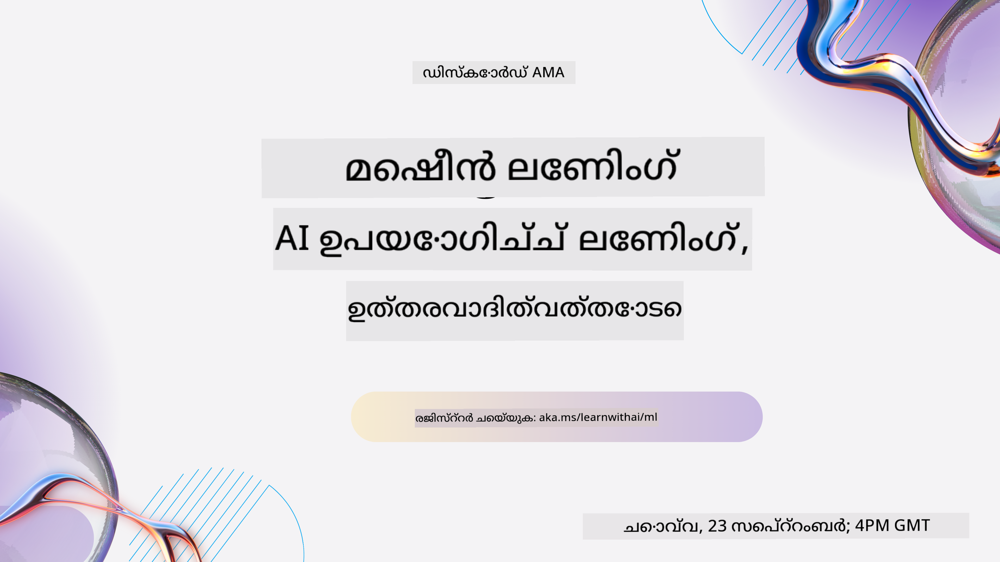
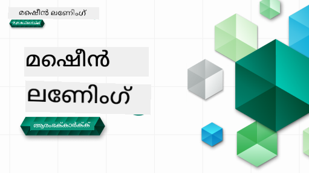

<!--
CO_OP_TRANSLATOR_METADATA:
{
  "original_hash": "c300f2380d9da91b7de8c707f69ce99b",
  "translation_date": "2025-12-19T12:50:32+00:00",
  "source_file": "README.md",
  "language_code": "ml"
}
-->

### 🌐 ബഹുഭാഷാ പിന്തുണ

#### GitHub ആക്ഷൻ വഴി പിന്തുണ (സ്വയം പ്രവർത്തിക്കുന്നതും എല്ലായ്പ്പോഴും പുതുക്കപ്പെട്ടതും)

<!-- CO-OP TRANSLATOR LANGUAGES TABLE START -->
[Arabic](../ar/README.md) | [Bengali](../bn/README.md) | [Bulgarian](../bg/README.md) | [Burmese (Myanmar)](../my/README.md) | [Chinese (Simplified)](../zh/README.md) | [Chinese (Traditional, Hong Kong)](../hk/README.md) | [Chinese (Traditional, Macau)](../mo/README.md) | [Chinese (Traditional, Taiwan)](../tw/README.md) | [Croatian](../hr/README.md) | [Czech](../cs/README.md) | [Danish](../da/README.md) | [Dutch](../nl/README.md) | [Estonian](../et/README.md) | [Finnish](../fi/README.md) | [French](../fr/README.md) | [German](../de/README.md) | [Greek](../el/README.md) | [Hebrew](../he/README.md) | [Hindi](../hi/README.md) | [Hungarian](../hu/README.md) | [Indonesian](../id/README.md) | [Italian](../it/README.md) | [Japanese](../ja/README.md) | [Kannada](../kn/README.md) | [Korean](../ko/README.md) | [Lithuanian](../lt/README.md) | [Malay](../ms/README.md) | [Malayalam](./README.md) | [Marathi](../mr/README.md) | [Nepali](../ne/README.md) | [Nigerian Pidgin](../pcm/README.md) | [Norwegian](../no/README.md) | [Persian (Farsi)](../fa/README.md) | [Polish](../pl/README.md) | [Portuguese (Brazil)](../br/README.md) | [Portuguese (Portugal)](../pt/README.md) | [Punjabi (Gurmukhi)](../pa/README.md) | [Romanian](../ro/README.md) | [Russian](../ru/README.md) | [Serbian (Cyrillic)](../sr/README.md) | [Slovak](../sk/README.md) | [Slovenian](../sl/README.md) | [Spanish](../es/README.md) | [Swahili](../sw/README.md) | [Swedish](../sv/README.md) | [Tagalog (Filipino)](../tl/README.md) | [Tamil](../ta/README.md) | [Telugu](../te/README.md) | [Thai](../th/README.md) | [Turkish](../tr/README.md) | [Ukrainian](../uk/README.md) | [Urdu](../ur/README.md) | [Vietnamese](../vi/README.md)
<!-- CO-OP TRANSLATOR LANGUAGES TABLE END -->

#### ഞങ്ങളുടെ സമൂഹത്തിൽ ചേരുക

ഞങ്ങൾക്ക് ഒരു Discord ലേൺ വിത്ത് AI സീരീസ് തുടരുകയാണ്, കൂടുതൽ അറിയാനും ഞങ്ങളോടൊപ്പം ചേരാനും [Learn with AI Series](https://aka.ms/learnwithai/discord) സന്ദർശിക്കുക, 2025 സെപ്റ്റംബർ 18 - 30 വരെ. GitHub Copilot ഉപയോഗിച്ച് ഡാറ്റാ സയൻസിനുള്ള ടിപ്പുകളും ട്രിക്കുകളും നിങ്ങൾക്ക് ലഭിക്കും.

# തുടക്കക്കാർക്കുള്ള മെഷീൻ ലേണിംഗ് - ഒരു പാഠ്യപദ്ധതി

> 🌍 ലോക സംസ്കാരങ്ങളിലൂടെ മെഷീൻ ലേണിംഗ് അന്വേഷിക്കുമ്പോൾ ലോകം ചുറ്റി യാത്ര ചെയ്യാം 🌍

Microsoft-യിലെ ക്ലൗഡ് അഡ്വക്കേറ്റുകൾ 12 ആഴ്ച, 26 പാഠങ്ങൾ ഉൾക്കൊള്ളുന്ന **മെഷീൻ ലേണിംഗ്** പാഠ്യപദ്ധതി അവതരിപ്പിക്കാൻ സന്തോഷിക്കുന്നു. ഈ പാഠ്യപദ്ധതിയിൽ, നിങ്ങൾക്ക് ചിലപ്പോൾ **ക്ലാസിക് മെഷീൻ ലേണിംഗ്** എന്ന് വിളിക്കപ്പെടുന്നതിനെക്കുറിച്ച് പഠിക്കാം, പ്രധാനമായും Scikit-learn ലൈബ്രറി ഉപയോഗിച്ച്, ഡീപ്പ് ലേണിംഗ് ഒഴിവാക്കി, അത് ഞങ്ങളുടെ [AI for Beginners' curriculum](https://aka.ms/ai4beginners) ൽ ഉൾപ്പെടുത്തിയിട്ടുണ്ട്. ഈ പാഠങ്ങൾ ഞങ്ങളുടെ ['Data Science for Beginners' curriculum](https://aka.ms/ds4beginners) യോടൊപ്പം ചേർത്ത് പഠിക്കാം.

ലോകത്തിന്റെ വിവിധ ഭാഗങ്ങളിൽ നിന്നുള്ള ഡാറ്റയിൽ ഈ ക്ലാസിക് സാങ്കേതിക വിദ്യകൾ പ്രയോഗിച്ച് ഞങ്ങളോടൊപ്പം ലോകം ചുറ്റി യാത്ര ചെയ്യൂ. ഓരോ പാഠവും മുൻപും ശേഷവും ക്വിസുകൾ, പാഠം പൂർത്തിയാക്കാനുള്ള എഴുത്ത് നിർദ്ദേശങ്ങൾ, പരിഹാരം, അസൈൻമെന്റ് എന്നിവ ഉൾക്കൊള്ളുന്നു. ഞങ്ങളുടെ പ്രോജക്ട് അടിസ്ഥാനത്തിലുള്ള പഠനരീതി പുതിയ കഴിവുകൾ 'പിടിപ്പിക്കാൻ' സഹായിക്കുന്ന ഒരു തെളിയിച്ച മാർഗമാണ്.

**✍️ ഞങ്ങളുടെ എഴുത്തുകാരെ ഹൃദയം നിറഞ്ഞ നന്ദി** Jen Looper, Stephen Howell, Francesca Lazzeri, Tomomi Imura, Cassie Breviu, Dmitry Soshnikov, Chris Noring, Anirban Mukherjee, Ornella Altunyan, Ruth Yakubu, Amy Boyd

**🎨 ചിത്രകാരന്മാർക്ക് നന്ദി** Tomomi Imura, Dasani Madipalli, Jen Looper

**🙏 പ്രത്യേക നന്ദി 🙏 Microsoft Student Ambassador എഴുത്തുകാരും റിവ്യൂവർമാരും ഉള്ളടക്ക സംഭാവനക്കാർക്കും**, പ്രത്യേകിച്ച് Rishit Dagli, Muhammad Sakib Khan Inan, Rohan Raj, Alexandru Petrescu, Abhishek Jaiswal, Nawrin Tabassum, Ioan Samuila, Snigdha Agarwal

**🤩 Microsoft Student Ambassadors Eric Wanjau, Jasleen Sondhi, Vidushi Gupta-യ്ക്ക് R പാഠങ്ങൾക്കുള്ള അധിക നന്ദി!**

# ആരംഭിക്കുന്നത്

ഈ ഘട്ടങ്ങൾ പിന്തുടരുക:
1. **റിപ്പോസിറ്ററി ഫോർക്ക് ചെയ്യുക**: ഈ പേജിന്റെ മുകളിൽ വലത് വശത്ത് "Fork" ബട്ടൺ ക്ലിക്ക് ചെയ്യുക.
2. **റിപ്പോസിറ്ററി ക്ലോൺ ചെയ്യുക**:   `git clone https://github.com/microsoft/ML-For-Beginners.git`

> [ഈ കോഴ്സിനുള്ള എല്ലാ അധിക വിഭവങ്ങളും ഞങ്ങളുടെ Microsoft Learn ശേഖരത്തിൽ കണ്ടെത്തുക](https://learn.microsoft.com/en-us/collections/qrqzamz1nn2wx3?WT.mc_id=academic-77952-bethanycheum)

> 🔧 **സഹായം വേണോ?** ഇൻസ്റ്റാളേഷൻ, സെറ്റപ്പ്, പാഠങ്ങൾ പ്രവർത്തിപ്പിക്കൽ സംബന്ധിച്ച സാധാരണ പ്രശ്നങ്ങൾക്ക് പരിഹാരങ്ങൾക്കായി ഞങ്ങളുടെ [Troubleshooting Guide](TROUBLESHOOTING.md) പരിശോധിക്കുക.

**[വിദ്യാർത്ഥികൾ](https://aka.ms/student-page)**, ഈ പാഠ്യപദ്ധതി ഉപയോഗിക്കാൻ, മുഴുവൻ റിപോ നിങ്ങളുടെ സ്വന്തം GitHub അക്കൗണ്ടിലേക്ക് ഫോർക്ക് ചെയ്ത് സ്വയം അല്ലെങ്കിൽ ഗ്രൂപ്പുമായി അഭ്യാസങ്ങൾ പൂർത്തിയാക്കുക:

- പ്രീ-ലെക്ചർ ക്വിസ് ആരംഭിക്കുക.
- ലെക്ചർ വായിച്ച് പ്രവർത്തനങ്ങൾ പൂർത്തിയാക്കുക, ഓരോ അറിവ് പരിശോധനയിലും നിർത്തി ആലോചിക്കുക.
- പരിഹാര കോഡ് ഓടിക്കുന്നതിന് പകരം പാഠങ്ങൾ മനസ്സിലാക്കി പ്രോജക്ടുകൾ സൃഷ്ടിക്കാൻ ശ്രമിക്കുക; എന്നാൽ ആ കോഡ് ഓരോ പ്രോജക്ട്-കേന്ദ്രിത പാഠത്തിലെ `/solution` ഫോൾഡറുകളിൽ ലഭ്യമാണ്.
- പോസ്റ്റ്-ലെക്ചർ ക്വിസ് എടുക്കുക.
- ചലഞ്ച് പൂർത്തിയാക്കുക.
- അസൈൻമെന്റ് പൂർത്തിയാക്കുക.
- ഒരു പാഠം ഗ്രൂപ്പ് പൂർത്തിയാക്കിയ ശേഷം, [Discussion Board](https://github.com/microsoft/ML-For-Beginners/discussions) സന്ദർശിച്ച് അനുയോജ്യമായ PAT റൂബ്രിക് പൂരിപ്പിച്ച് "learn out loud" ചെയ്യുക. 'PAT' എന്നത് പ്രോഗ്രസ് അസസ്മെന്റ് ടൂൾ ആണ്, നിങ്ങളുടെ പഠനം മെച്ചപ്പെടുത്താൻ പൂരിപ്പിക്കുന്ന ഒരു റൂബ്രിക്. മറ്റുള്ള PAT-കൾക്ക് പ്രതികരിക്കാനും കഴിയും, അതിലൂടെ നാം ഒരുമിച്ച് പഠിക്കാം.

> കൂടുതൽ പഠനത്തിനായി, ഈ [Microsoft Learn](https://docs.microsoft.com/en-us/users/jenlooper-2911/collections/k7o7tg1gp306q4?WT.mc_id=academic-77952-leestott) മോഡ്യൂളുകളും പഠന പാതകളും പിന്തുടരാൻ ഞങ്ങൾ ശുപാർശ ചെയ്യുന്നു.

**അധ്യാപകർ**, ഈ പാഠ്യപദ്ധതി ഉപയോഗിക്കുന്നതിനുള്ള ചില നിർദ്ദേശങ്ങൾ ഞങ്ങൾ [ഉൾപ്പെടുത്തിയിട്ടുണ്ട്](for-teachers.md).

---

## വീഡിയോ വാക്ക്‌ത്രൂകൾ

ചില പാഠങ്ങൾ ചെറു വീഡിയോകളായി ലഭ്യമാണ്. ഈ വീഡിയോകൾ പാഠങ്ങളിൽ നേരിട്ട് കാണാനോ, [ML for Beginners പ്ലേലിസ്റ്റ് Microsoft Developer YouTube ചാനലിൽ](https://aka.ms/ml-beginners-videos) ചിത്രത്തിൽ ക്ലിക്ക് ചെയ്ത് കാണാനോ കഴിയും.

---

## ടീം പരിചയം

**ഗിഫ്** [Mohit Jaisal](https://linkedin.com/in/mohitjaisal)

> 🎥 പ്രോജക്ടും അതിനെ സൃഷ്ടിച്ച ആളുകളും കുറിച്ചുള്ള വീഡിയോയ്ക്ക് മുകളിൽ കാണുന്ന ചിത്രത്തിൽ ക്ലിക്ക് ചെയ്യുക!

---

## പഠനരീതി

ഈ പാഠ്യപദ്ധതി നിർമ്മിക്കുമ്പോൾ ഞങ്ങൾ രണ്ട് പഠന സിദ്ധാന്തങ്ങൾ തിരഞ്ഞെടുക്കുകയുണ്ടായി: പ്രായോഗികമായ **പ്രോജക്ട്-അധിഷ്ഠിതം** ആകണം, കൂടാതെ **സാധാരണ ക്വിസുകൾ** ഉൾക്കൊള്ളണം. കൂടാതെ, ഈ പാഠ്യപദ്ധതിക്ക് ഒരു പൊതു **തീം** ഉണ്ട്, അത് ഏകോപനം നൽകുന്നു.

ഉള്ളടക്കം പ്രോജക്ടുകളുമായി പൊരുത്തപ്പെടുന്നതു ഉറപ്പാക്കുന്നതിലൂടെ, വിദ്യാർത്ഥികൾക്ക് കൂടുതൽ ആകർഷകവും ആശയങ്ങൾ കൂടുതൽ ദീർഘകാലം നിലനിൽക്കുന്നതുമായ ഒരു പഠനാനുഭവം ലഭിക്കും. ക്ലാസിന് മുമ്പുള്ള കുറഞ്ഞ സമ്മർദ്ദമുള്ള ക്വിസ് വിദ്യാർത്ഥിയുടെ പഠന ഉദ്ദേശ്യം സജ്ജമാക്കുന്നു, ക്ലാസിന് ശേഷം മറ്റൊരു ക്വിസ് കൂടുതൽ ഓർമ്മപ്പെടുത്തലിനായി സഹായിക്കുന്നു. ഈ പാഠ്യപദ്ധതി ലവച്ഛേദ്യവും രസകരവുമാണ്, മുഴുവനായോ ഭാഗികമായോ പഠിക്കാവുന്നതാണ്. പ്രോജക്ടുകൾ ചെറിയതിൽ നിന്ന് ആരംഭിച്ച് 12 ആഴ്ചകളുടെ അവസാനം കൂടുതൽ സങ്കീർണ്ണമാകുന്നു. ഈ പാഠ്യപദ്ധതിയിൽ ML-ന്റെ യഥാർത്ഥ ലോക പ്രയോഗങ്ങളെക്കുറിച്ചുള്ള ഒരു പോസ്റ്റ്‌സ്‌ക്രിപ്റ്റും ഉൾക്കൊള്ളുന്നു, ഇത് അധിക ക്രെഡിറ്റിനോ ചർച്ചയ്ക്കോ ഉപയോഗിക്കാം.

> ഞങ്ങളുടെ [Code of Conduct](CODE_OF_CONDUCT.md), [Contributing](CONTRIBUTING.md), [Translation](TRANSLATIONS.md), [Troubleshooting](TROUBLESHOOTING.md) മാർഗ്ഗനിർദ്ദേശങ്ങൾ കാണുക. നിങ്ങളുടെ നിർമാണാത്മക പ്രതികരണങ്ങൾ സ്വാഗതം ചെയ്യുന്നു!

## ഓരോ പാഠത്തിലും ഉൾപ്പെടുന്നത്

- ഐച്ഛിക സ്കെച്ച്നോട്ട്
- ഐച്ഛിക സഹായക വീഡിയോ
- വീഡിയോ വാക്ക്‌ത്രൂ (ചില പാഠങ്ങൾക്കായി മാത്രം)
- [പ്രീ-ലെക്ചർ വാര്മപ്പ് ക്വിസ്](https://ff-quizzes.netlify.app/en/ml/)
- എഴുത്തുപാഠം
- പ്രോജക്ട്-അധിഷ്ഠിത പാഠങ്ങൾക്കായി, പ്രോജക്ട് നിർമ്മിക്കുന്നതിനുള്ള ഘട്ടം ഘട്ടമായ മാർഗ്ഗനിർദ്ദേശങ്ങൾ
- അറിവ് പരിശോധനകൾ
- ഒരു ചലഞ്ച്
- സഹായക വായന
- അസൈൻമെന്റ്
- [പോസ്റ്റ്-ലെക്ചർ ക്വിസ്](https://ff-quizzes.netlify.app/en/ml/)

> **ഭാഷകളെക്കുറിച്ചുള്ള ഒരു കുറിപ്പ്**: ഈ പാഠങ്ങൾ പ്രധാനമായും Python-ൽ എഴുതപ്പെട്ടതാണ്, എന്നാൽ പലതും R-ലും ലഭ്യമാണ്. R പാഠം പൂർത്തിയാക്കാൻ, `/solution` ഫോൾഡറിൽ പോയി R പാഠങ്ങൾ കണ്ടെത്തുക. അവയിൽ .rmd എക്സ്റ്റൻഷൻ ഉണ്ട്, ഇത് **R Markdown** ഫയലിനെ പ്രതിനിധീകരിക്കുന്നു, ഇത് `code chunks` (R അല്ലെങ്കിൽ മറ്റ് ഭാഷകളിൽ) ഒപ്പം `YAML header` (PDF പോലുള്ള ഔട്ട്പുട്ടുകൾ എങ്ങനെ ഫോർമാറ്റ് ചെയ്യാമെന്ന് നിർദ്ദേശിക്കുന്നു) അടങ്ങിയ ഒരു Markdown ഡോക്യുമെന്റ് ആണെന്ന് സൂചിപ്പിക്കുന്നു. അതിനാൽ, ഇത് ഡാറ്റാ സയൻസിനുള്ള ഒരു ഉദാഹരണാത്മക എഴുത്ത് ഘടനയായി പ്രവർത്തിക്കുന്നു, കാരണം നിങ്ങൾക്ക് നിങ്ങളുടെ കോഡ്, അതിന്റെ ഔട്ട്പുട്ട്, നിങ്ങളുടെ ചിന്തകൾ Markdown-ൽ എഴുതാൻ കഴിയും. കൂടാതെ, R Markdown ഡോക്യുമെന്റുകൾ PDF, HTML, Word പോലുള്ള ഔട്ട്പുട്ട് ഫോർമാറ്റുകളിലേക്ക് മാറ്റാം.

> **ക്വിസുകളെക്കുറിച്ചുള്ള ഒരു കുറിപ്പ്**: എല്ലാ ക്വിസുകളും [Quiz App ഫോൾഡറിൽ](../../quiz-app) ഉൾക്കൊള്ളുന്നു, മൂന്ന് ചോദ്യങ്ങളുള്ള 52 ക്വിസുകൾ. അവ പാഠങ്ങളിൽ നിന്ന് ലിങ്ക് ചെയ്തിട്ടുണ്ട്, പക്ഷേ ക്വിസ് ആപ്പ് ലോക്കലായി ഓടിക്കാം; ലോക്കലായി ഹോസ്റ്റ് ചെയ്യാനോ Azure-ലേക്ക് ഡിപ്ലോയ് ചെയ്യാനോ `quiz-app` ഫോൾഡറിലെ നിർദ്ദേശങ്ങൾ പിന്തുടരുക.

| പാഠം നമ്പർ |                             വിഷയം                              |                   പാഠം ഗ്രൂപ്പിംഗ്                   | പഠന ലക്ഷ്യങ്ങൾ                                                                                                             |                                                              ലിങ്കുചെയ്ത പാഠം                                                               |                        എഴുത്തുകാരൻ                        |
| :-----------: | :------------------------------------------------------------: | :-------------------------------------------------: | ------------------------------------------------------------------------------------------------------------------------------- | :--------------------------------------------------------------------------------------------------------------------------------------: | :--------------------------------------------------: |
|      01       |                മെഷീൻ ലേണിങ്ങിലേക്ക് പരിചയം                |      [Introduction](1-Introduction/README.md)       | മെഷീൻ ലേണിങ്ങിന്റെ അടിസ്ഥാന ആശയങ്ങൾ പഠിക്കുക                                                                                |                                             [Lesson](1-Introduction/1-intro-to-ML/README.md)                                             |                       മുഹമ്മദ്                       |
|      02       |                മെഷീൻ ലേണിങ്ങിന്റെ ചരിത്രം                 |      [Introduction](1-Introduction/README.md)       | ഈ മേഖലയെ അടിസ്ഥാനമാക്കിയുള്ള ചരിത്രം പഠിക്കുക                                                                                         |                                            [Lesson](1-Introduction/2-history-of-ML/README.md)                                            |                     ജെൻ ആൻഡ് എമി                      |
|      03       |                 നീതിയും മെഷീൻ ലേണിങ്ങും                  |      [Introduction](1-Introduction/README.md)       | ML മോഡലുകൾ നിർമ്മിക്കുമ്പോഴും പ്രയോഗിക്കുമ്പോഴും വിദ്യാർത്ഥികൾ പരിഗണിക്കേണ്ട നീതിയുമായി ബന്ധപ്പെട്ട പ്രധാന തത്ത്വചിന്തന വിഷയങ്ങൾ എന്തെല്ലാമാണ്? |                                              [Lesson](1-Introduction/3-fairness/README.md)                                               |                        ടോമോമി                        |
|      04       |                മെഷീൻ ലേണിങ്ങിനുള്ള സാങ്കേതിക വിദ്യകൾ                 |      [Introduction](1-Introduction/README.md)       | ML ഗവേഷകർ ML മോഡലുകൾ നിർമ്മിക്കാൻ ഉപയോഗിക്കുന്ന സാങ്കേതിക വിദ്യകൾ എന്തെല്ലാമാണ്?                                                                       |                                          [Lesson](1-Introduction/4-techniques-of-ML/README.md)                                           |                    ക്രിസ് ആൻഡ് ജെൻ                     |
|      05       |                   റെഗ്രഷനിലേക്ക് പരിചയം                   |        [Regression](2-Regression/README.md)         | റെഗ്രഷൻ മോഡലുകൾക്കായി Python, Scikit-learn ഉപയോഗിച്ച് ആരംഭിക്കുക                                                                  |         [Python](2-Regression/1-Tools/README.md) • [R](../../2-Regression/1-Tools/solution/R/lesson_1.html)         |      ജെൻ • എറിക് വാൻജൗ       |
|      06       |                നോർത്ത് അമേരിക്കൻ പംപ്കിൻ വിലകൾ 🎃                |        [Regression](2-Regression/README.md)         | ML-നായി ഡാറ്റ ദൃശ്യവൽക്കരിക്കുകയും ശുദ്ധീകരിക്കുകയും ചെയ്യുക                                                                                  |          [Python](2-Regression/2-Data/README.md) • [R](../../2-Regression/2-Data/solution/R/lesson_2.html)          |      ജെൻ • എറിക് വാൻജൗ       |
|      07       |                നോർത്ത് അമേരിക്കൻ പംപ്കിൻ വിലകൾ 🎃                |        [Regression](2-Regression/README.md)         | ലീനിയർ, പോളിനോമിയൽ റെഗ്രഷൻ മോഡലുകൾ നിർമ്മിക്കുക                                                                                   |        [Python](2-Regression/3-Linear/README.md) • [R](../../2-Regression/3-Linear/solution/R/lesson_3.html)        |      ജെൻ ആൻഡ് ഡ്മിത്രി • എറിക് വാൻജൗ       |
|      08       |                നോർത്ത് അമേരിക്കൻ പംപ്കിൻ വിലകൾ 🎃                |        [Regression](2-Regression/README.md)         | ലോജിസ്റ്റിക് റെഗ്രഷൻ മോഡൽ നിർമ്മിക്കുക                                                                                               |     [Python](2-Regression/4-Logistic/README.md) • [R](../../2-Regression/4-Logistic/solution/R/lesson_4.html)      |      ജെൻ • എറിക് വാൻജൗ       |
|      09       |                          ഒരു വെബ് ആപ്പ് 🔌                          |           [Web App](3-Web-App/README.md)            | പരിശീലിപ്പിച്ച മോഡൽ ഉപയോഗിക്കാൻ ഒരു വെബ് ആപ്പ് നിർമ്മിക്കുക                                                                                       |                                                 [Python](3-Web-App/1-Web-App/README.md)                                                  |                         ജെൻ                          |
|      10       |                 ക്ലാസിഫിക്കേഷനിലേക്ക് പരിചയം                 |    [Classification](4-Classification/README.md)     | നിങ്ങളുടെ ഡാറ്റ ശുദ്ധീകരിക്കുക, തയ്യാറാക്കുക, ദൃശ്യവൽക്കരിക്കുക; ക്ലാസിഫിക്കേഷനിലേക്ക് പരിചയം                                                            | [Python](4-Classification/1-Introduction/README.md) • [R](../../4-Classification/1-Introduction/solution/R/lesson_10.html)  | ജെൻ ആൻഡ് കാസ്സി • എറിക് വാൻജൗ |
|      11       |             രുചികരമായ ഏഷ്യൻ, ഇന്ത്യൻ ഭക്ഷണങ്ങൾ 🍜             |    [Classification](4-Classification/README.md)     | ക്ലാസിഫയർസിലേക്ക് പരിചയം                                                                                                     | [Python](4-Classification/2-Classifiers-1/README.md) • [R](../../4-Classification/2-Classifiers-1/solution/R/lesson_11.html) | ജെൻ ആൻഡ് കാസ്സി • എറിക് വാൻജൗ |
|      12       |             രുചികരമായ ഏഷ്യൻ, ഇന്ത്യൻ ഭക്ഷണങ്ങൾ 🍜             |    [Classification](4-Classification/README.md)     | കൂടുതൽ ക്ലാസിഫയർസ്                                                                                                                | [Python](4-Classification/3-Classifiers-2/README.md) • [R](../../4-Classification/3-Classifiers-2/solution/R/lesson_12.html) | ജെൻ ആൻഡ് കാസ്സി • എറിക് വാൻജൗ |
|      13       |             രുചികരമായ ഏഷ്യൻ, ഇന്ത്യൻ ഭക്ഷണങ്ങൾ 🍜             |    [Classification](4-Classification/README.md)     | നിങ്ങളുടെ മോഡൽ ഉപയോഗിച്ച് ഒരു ശുപാർശ വെബ് ആപ്പ് നിർമ്മിക്കുക                                                                                    |                                              [Python](4-Classification/4-Applied/README.md)                                              |                         ജെൻ                          |
|      14       |                   ക്ലസ്റ്ററിങ്ങിലേക്ക് പരിചയം                   |        [Clustering](5-Clustering/README.md)         | നിങ്ങളുടെ ഡാറ്റ ശുദ്ധീകരിക്കുക, തയ്യാറാക്കുക, ദൃശ്യവൽക്കരിക്കുക; ക്ലസ്റ്ററിങ്ങിലേക്ക് പരിചയം                                                                |         [Python](5-Clustering/1-Visualize/README.md) • [R](../../5-Clustering/1-Visualize/solution/R/lesson_14.html)         |      ജെൻ • എറിക് വാൻജൗ       |
|      15       |              നൈജീരിയൻ സംഗീത രുചികൾ അന്വേഷിക്കൽ 🎧              |        [Clustering](5-Clustering/README.md)         | K-മീൻസ് ക്ലസ്റ്ററിങ്ങ് രീതി അന്വേഷിക്കുക                                                                                           |           [Python](5-Clustering/2-K-Means/README.md) • [R](../../5-Clustering/2-K-Means/solution/R/lesson_15.html)           |      ജെൻ • എറിക് വാൻജൗ       |
|      16       |        നാചുറൽ ലാംഗ്വേജ് പ്രോസസ്സിങ്ങിലേക്ക് പരിചയം ☕️         |   [Natural language processing](6-NLP/README.md)    | ഒരു ലളിതമായ ബോട്ട് നിർമ്മിച്ച് NLP അടിസ്ഥാനങ്ങൾ പഠിക്കുക                                                                             |                                             [Python](6-NLP/1-Introduction-to-NLP/README.md)                                              |                       സ്റ്റീഫൻ                        |
|      17       |                      സാധാരണ NLP ടാസ്കുകൾ ☕️                      |   [Natural language processing](6-NLP/README.md)    | ഭാഷാ ഘടനകളുമായി ഇടപഴകുമ്പോൾ ആവശ്യമായ സാധാരണ ടാസ്കുകൾ മനസ്സിലാക്കി നിങ്ങളുടെ NLP അറിവ് കൂടുതൽ ആഴത്തിൽ പഠിക്കുക                          |                                                    [Python](6-NLP/2-Tasks/README.md)                                                     |                       സ്റ്റീഫൻ                        |
|      18       |             വിവർത്തനവും സന്റിമെന്റ് വിശകലനവും ♥️              |   [Natural language processing](6-NLP/README.md)    | ജെയിൻ ഓസ്റ്റന്റെ സഹായത്തോടെ വിവർത്തനവും സന്റിമെന്റ് വിശകലനവും                                                                             |                                            [Python](6-NLP/3-Translation-Sentiment/README.md)                                             |                       സ്റ്റീഫൻ                        |
|      19       |                  യൂറോപ്പിലെ റൊമാന്റിക് ഹോട്ടലുകൾ ♥️                  |   [Natural language processing](6-NLP/README.md)    | ഹോട്ടൽ റിവ്യൂസ് ഉപയോഗിച്ച് സന്റിമെന്റ് വിശകലനം 1                                                                                         |                                               [Python](6-NLP/4-Hotel-Reviews-1/README.md)                                                |                       സ്റ്റീഫൻ                        |
|      20       |                  യൂറോപ്പിലെ റൊമാന്റിക് ഹോട്ടലുകൾ ♥️                  |   [Natural language processing](6-NLP/README.md)    | ഹോട്ടൽ റിവ്യൂസ് ഉപയോഗിച്ച് സന്റിമെന്റ് വിശകലനം 2                                                                                         |                                               [Python](6-NLP/5-Hotel-Reviews-2/README.md)                                                |                       സ്റ്റീഫൻ                        |
|      21       |            ടൈം സീരീസ് ഫോറ്കാസ്റ്റിങ്ങിലേക്ക് പരിചയം             |        [Time series](7-TimeSeries/README.md)        | ടൈം സീരീസ് ഫോറ്കാസ്റ്റിങ്ങിലേക്ക് പരിചയം                                                                                         |                                             [Python](7-TimeSeries/1-Introduction/README.md)                                              |                      ഫ്രാൻസെസ്ക                      |
|      22       | ⚡️ ലോക വൈദ്യുതി ഉപയോഗം ⚡️ - ARIMA ഉപയോഗിച്ച് ടൈം സീരീസ് ഫോറ്കാസ്റ്റിംഗ് |        [Time series](7-TimeSeries/README.md)        | ARIMA ഉപയോഗിച്ച് ടൈം സീരീസ് ഫോറ്കാസ്റ്റിംഗ്                                                                                              |                                                 [Python](7-TimeSeries/2-ARIMA/README.md)                                                 |                      ഫ്രാൻസെസ്ക                      |
|      23       |  ⚡️ ലോക വൈദ്യുതി ഉപയോഗം ⚡️ - SVR ഉപയോഗിച്ച് ടൈം സീരീസ് ഫോറ്കാസ്റ്റിംഗ്  |        [Time series](7-TimeSeries/README.md)        | Support Vector Regressor ഉപയോഗിച്ച് ടൈം സീരീസ് ഫോറ്കാസ്റ്റിംഗ്                                                                           |                                                  [Python](7-TimeSeries/3-SVR/README.md)                                                  |                       അനിർബാൻ                        |
|      24       |             റീ ഇൻഫോഴ്‌സ്‌മെന്റ് ലേണിങ്ങിലേക്ക് പരിചയം             | [Reinforcement learning](8-Reinforcement/README.md) | Q-ലേണിംഗ് ഉപയോഗിച്ച് റീ ഇൻഫോഴ്‌സ്‌മെന്റ് ലേണിങ്ങിലേക്ക് പരിചയം                                                                          |                                             [Python](8-Reinforcement/1-QLearning/README.md)                                              |                        ഡ്മിത്രി                        |
|      25       |                 പീറ്റർ വംശിയെ ഒഴിവാക്കാൻ സഹായിക്കുക! 🐺                  | [Reinforcement learning](8-Reinforcement/README.md) | റീ ഇൻഫോഴ്‌സ്‌മെന്റ് ലേണിങ്ങ് ജിം                                                                                                      |                                                [Python](8-Reinforcement/2-Gym/README.md)                                                 |                        ഡ്മിത്രി                        |
|  Postscript   |            യഥാർത്ഥ ലോക ML സാഹചര്യങ്ങളും പ്രയോഗങ്ങളും            |      [ML in the Wild](9-Real-World/README.md)       | ക്ലാസിക്കൽ ML-ന്റെ രസകരവും വെളിപ്പെടുത്തലും നിറഞ്ഞ യഥാർത്ഥ ലോക പ്രയോഗങ്ങൾ                                                               |                                             [Lesson](9-Real-World/1-Applications/README.md)                                              |                         ടീം                         |
|  Postscript   |            RAI ഡാഷ്ബോർഡ് ഉപയോഗിച്ച് ML മോഡൽ ഡീബഗ്ഗിംഗ്          |      [ML in the Wild](9-Real-World/README.md)       | റസ്പോൺസിബിൾ AI ഡാഷ്ബോർഡ് ഘടകങ്ങൾ ഉപയോഗിച്ച് മെഷീൻ ലേണിങ്ങിൽ മോഡൽ ഡീബഗ്ഗിംഗ്                                                              |                                             [Lesson](9-Real-World/2-Debugging-ML-Models/README.md)                                              |                         റുത് യാകുബു                       |

> [ഈ കോഴ്സിനുള്ള എല്ലാ അധിക വിഭവങ്ങളും ഞങ്ങളുടെ Microsoft Learn ശേഖരത്തിൽ കണ്ടെത്തുക](https://learn.microsoft.com/en-us/collections/qrqzamz1nn2wx3?WT.mc_id=academic-77952-bethanycheum)

## ഓഫ്‌ലൈൻ ആക്‌സസ്

[Docsify](https://docsify.js.org/#/) ഉപയോഗിച്ച് നിങ്ങൾക്ക് ഈ ഡോക്യുമെന്റേഷൻ ഓഫ്‌ലൈൻ പ്രവർത്തിപ്പിക്കാം. ഈ റിപോ ഫോർക്ക് ചെയ്യുക, നിങ്ങളുടെ ലോക്കൽ മെഷീനിൽ [Docsify ഇൻസ്റ്റാൾ ചെയ്യുക](https://docsify.js.org/#/quickstart), പിന്നീട് ഈ റിപോയുടെ റൂട്ട് ഫോൾഡറിൽ `docsify serve` ടൈപ്പ് ചെയ്യുക. വെബ്സൈറ്റ് നിങ്ങളുടെ ലോക്കൽഹോസ്റ്റിൽ പോർട്ട് 3000-ൽ സർവ് ചെയ്യും: `localhost:3000`.

## PDFകൾ

കുറിക്കുലത്തിന്റെ PDF ലിങ്കുകളോടെ [ഇവിടെ](https://microsoft.github.io/ML-For-Beginners/pdf/readme.pdf) കണ്ടെത്തുക.

## 🎒 മറ്റ് കോഴ്സുകൾ

ഞങ്ങളുടെ ടീം മറ്റ് കോഴ്സുകളും നിർമ്മിക്കുന്നു! പരിശോധിക്കുക:

<!-- CO-OP TRANSLATOR OTHER COURSES START -->
### LangChain

---

### Azure / Edge / MCP / Agents

---
 
### Generative AI Series

[-9333EA?style=for-the-badge&labelColor=E5E7EB&color=9333EA)](https://github.com/microsoft/Generative-AI-for-beginners-dotnet?WT.mc_id=academic-105485-koreyst)
[-C084FC?style=for-the-badge&labelColor=E5E7EB&color=C084FC)](https://github.com/microsoft/generative-ai-for-beginners-java?WT.mc_id=academic-105485-koreyst)
[-E879F9?style=for-the-badge&labelColor=E5E7EB&color=E879F9)](https://github.com/microsoft/generative-ai-with-javascript?WT.mc_id=academic-105485-koreyst)

---
 
### കോർ ലേണിംഗ്

---
 
### കോപൈലറ്റ് സീരീസ്

<!-- CO-OP TRANSLATOR OTHER COURSES END -->

## സഹായം നേടുക

നിങ്ങൾക്ക് AI ആപ്പുകൾ നിർമ്മിക്കുന്നതിൽ തടസ്സം നേരിടുകയോ എന്തെങ്കിലും ചോദ്യങ്ങളുണ്ടാകുകയോ ചെയ്താൽ, MCP-യിൽ fellow learners-ഉം പരിചയസമ്പന്നരായ ഡെവലപ്പർമാരും ചേർന്ന് ചർച്ചകളിൽ പങ്കെടുക്കുക. ചോദ്യങ്ങൾ സ്വാഗതം ചെയ്യപ്പെടുന്ന, അറിവ് സ്വതന്ത്രമായി പങ്കുവെക്കുന്ന ഒരു പിന്തുണയുള്ള സമൂഹമാണ് ഇത്.

നിങ്ങൾക്ക് ഉൽപ്പന്ന ഫീഡ്ബാക്കോ നിർമ്മാണത്തിൽ പിഴവുകളോ ഉണ്ടെങ്കിൽ സന്ദർശിക്കുക:

---

<!-- CO-OP TRANSLATOR DISCLAIMER START -->
**അസൂയാപത്രം**:  
ഈ രേഖ AI വിവർത്തന സേവനം [Co-op Translator](https://github.com/Azure/co-op-translator) ഉപയോഗിച്ച് വിവർത്തനം ചെയ്തതാണ്. നാം കൃത്യതയ്ക്ക് ശ്രമിച്ചിട്ടുണ്ടെങ്കിലും, സ്വയം പ്രവർത്തിക്കുന്ന വിവർത്തനങ്ങളിൽ പിശകുകൾ അല്ലെങ്കിൽ തെറ്റുകൾ ഉണ്ടാകാമെന്ന് ദയവായി ശ്രദ്ധിക്കുക. അതിന്റെ മാതൃഭാഷയിലുള്ള യഥാർത്ഥ രേഖയാണ് പ്രാമാണികമായ ഉറവിടം എന്ന് പരിഗണിക്കേണ്ടതാണ്. നിർണായകമായ വിവരങ്ങൾക്ക്, പ്രൊഫഷണൽ മനുഷ്യ വിവർത്തനം ശുപാർശ ചെയ്യപ്പെടുന്നു. ഈ വിവർത്തനം ഉപയോഗിക്കുന്നതിൽ നിന്നുണ്ടാകുന്ന ഏതെങ്കിലും തെറ്റിദ്ധാരണകൾക്കോ തെറ്റായ വ്യാഖ്യാനങ്ങൾക്കോ ഞങ്ങൾ ഉത്തരവാദികളല്ല.
<!-- CO-OP TRANSLATOR DISCLAIMER END -->