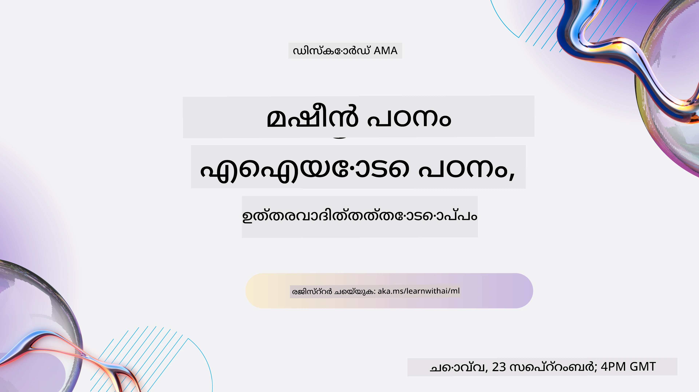
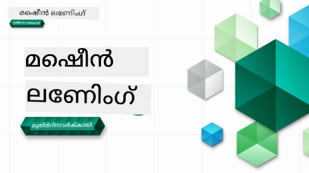

[](https://github.com/microsoft/ML-For-Beginners/blob/master/LICENSE)
[](https://GitHub.com/microsoft/ML-For-Beginners/graphs/contributors/)
[](https://GitHub.com/microsoft/ML-For-Beginners/issues/)
[](https://GitHub.com/microsoft/ML-For-Beginners/pulls/)
[](http://makeapullrequest.com)

[](https://GitHub.com/microsoft/ML-For-Beginners/watchers/)
[](https://GitHub.com/microsoft/ML-For-Beginners/network/)
[](https://GitHub.com/microsoft/ML-For-Beginners/stargazers/)

### 🌐 ബഹുഭാഷാ പിന്തുണ

#### GitHub Action വഴി പിന്തുണ (സ്വയം പ്രവർത്തനക്ഷമവും എപ്പോഴും അപ്‌ടേക്ക് ആണ്)

<!-- CO-OP TRANSLATOR LANGUAGES TABLE START -->
[Arabic](../ar/README.md) | [Bengali](../bn/README.md) | [Bulgarian](../bg/README.md) | [Burmese (Myanmar)](../my/README.md) | [Chinese (Simplified)](../zh-CN/README.md) | [Chinese (Traditional, Hong Kong)](../zh-HK/README.md) | [Chinese (Traditional, Macau)](../zh-MO/README.md) | [Chinese (Traditional, Taiwan)](../zh-TW/README.md) | [Croatian](../hr/README.md) | [Czech](../cs/README.md) | [Danish](../da/README.md) | [Dutch](../nl/README.md) | [Estonian](../et/README.md) | [Finnish](../fi/README.md) | [French](../fr/README.md) | [German](../de/README.md) | [Greek](../el/README.md) | [Hebrew](../he/README.md) | [Hindi](../hi/README.md) | [Hungarian](../hu/README.md) | [Indonesian](../id/README.md) | [Italian](../it/README.md) | [Japanese](../ja/README.md) | [Kannada](../kn/README.md) | [Khmer](../km/README.md) | [Korean](../ko/README.md) | [Lithuanian](../lt/README.md) | [Malay](../ms/README.md) | [Malayalam](./README.md) | [Marathi](../mr/README.md) | [Nepali](../ne/README.md) | [Nigerian Pidgin](../pcm/README.md) | [Norwegian](../no/README.md) | [Persian (Farsi)](../fa/README.md) | [Polish](../pl/README.md) | [Portuguese (Brazil)](../pt-BR/README.md) | [Portuguese (Portugal)](../pt-PT/README.md) | [Punjabi (Gurmukhi)](../pa/README.md) | [Romanian](../ro/README.md) | [Russian](../ru/README.md) | [Serbian (Cyrillic)](../sr/README.md) | [Slovak](../sk/README.md) | [Slovenian](../sl/README.md) | [Spanish](../es/README.md) | [Swahili](../sw/README.md) | [Swedish](../sv/README.md) | [Tagalog (Filipino)](../tl/README.md) | [Tamil](../ta/README.md) | [Telugu](../te/README.md) | [Thai](../th/README.md) | [Turkish](../tr/README.md) | [Ukrainian](../uk/README.md) | [Urdu](../ur/README.md) | [Vietnamese](../vi/README.md)

> **লোকালি ക്ലോൺ ചെയ്യുന്നത് ഇഷ്ടപ്പെടുമോ?**
>
> ഈ റെപ്പോസിറ്ററിയിൽ 50+ ഭാഷാ പരിഭാഷകൾ ഉൾപ്പെട്ടിരിക്കുന്നു, ഇത് ഡൗൺലോഡ് വലിപ്പം വളരെ വർദ്ധിപ്പിക്കുന്നു. പരിഭാഷകൾ ഇല്ലാതെ ക്ലോൺ ചെയ്യാൻ sparse checkout ഉപയോഗിക്കുക:
>
> **Bash / macOS / Linux:**
> ```bash
> git clone --filter=blob:none --sparse https://github.com/microsoft/ML-For-Beginners.git
> cd ML-For-Beginners
> git sparse-checkout set --no-cone '/*' '!translations' '!translated_images'
> ```
>
> **CMD (Windows):**
> ```cmd
> git clone --filter=blob:none --sparse https://github.com/microsoft/ML-For-Beginners.git
> cd ML-For-Beginners
> git sparse-checkout set --no-cone "/*" "!translations" "!translated_images"
> ```
>
> ഇത് കോഴ്സ് പൂർത്തിയാക്കാൻ ആവശ്യമായ എല്ലാം നൽകുന്നു, ഓരോതരം വേഗത്തിലാണ് ഡൗൺലോഡ് നടക്കുന്നത്.
<!-- CO-OP TRANSLATOR LANGUAGES TABLE END -->

#### നമ്മുടെ സമൂഹത്തിലേക്ക് ചേരൂ

[](https://discord.gg/nTYy5BXMWG)

നമുക്ക് ഒരു Discord learn with AI സീരിസ് നടക്കുകയാണ്, കൂടുതൽ അറിയാനും 2025 സെപ്റ്റംബർ 18 - 30 വരെ [Learn with AI Series](https://aka.ms/learnwithai/discord)യിൽ ചേർന്നുകൊള്ളൂ. GitHub Copilot ഡേറ്റാ സയൻസിനായി ഉപയോഗിക്കുന്ന ടിപ്‌സും ട്രിക്ക്സും നിങ്ങൾക്ക് ലഭിക്കും.



# തുടക്കക്കാർക്കുള്ള മെഷീൻ ലേണിംഗ് - ഒരു പാഠപദ്ധതി

> 🌍 ലോക സംസ്കാരങ്ങളുടെ വഴി പരീക്ഷിച്ച് മെഷീൻ ലേണിംഗ് പഠിക്കാം 🌍

മൈക്രോസോഫ്റ്റ് ക്ലൗഡ് അഡ്വൊക്കേറ്റ്സ് 12 ആഴ്ചയും 26 പാഠഭാഗങ്ങളുള്ള പാഠപദ്ധതി **മെഷീൻ ലേണിംഗ്** സംബന്ധിച്ചാണ് അവതരിപ്പിക്കുന്നത്. ഈ പാഠപദ്ധതിയിൽ നിങ്ങൾ സ്കൈറ്റ്-ലേൺ പ്രധാനമായും ഉപയോഗിച്ച് ചിലപ്പോൾ **ക്ലാസിക് മെഷീൻ ലേണിംഗ്** എന്ന് വിളിക്കുന്നതു പഠിക്കും, ഡീപ് ലേണിംഗ് ഒഴിവാക്കിയുള്ളത്, അതെല്ലാം ഞങ്ങളുടെ [AI for Beginners' curriculum](https://aka.ms/ai4beginners) ൽ ഉൾപ്പെടുത്തിയിരിക്കുന്നു. ഈ പാഠങ്ങൾ നമ്മുടെ ['Data Science for Beginners' curriculum](https://aka.ms/ds4beginners) സഖ്യപ്പെടുത്താം.

ലോകമെമ്പാടുമുള്ള ഡേറ്റയ്ക്ക് ഈ ക്ലാസിക് സാങ്കേതിക വിദ്യകൾ പ്രയോഗിച്ച് ഞങ്ങളோപ്പി യാത്രചെയ്യാം. ഓരോ പാഠത്തിലും മുൻകൂർ.quiz, പിൻകൂർ.quiz, എഴുത്ത് നിർദ്ദേശങ്ങൾ, പരിഹാരം, അസൈൻമെന്റ് എന്നിവയുണ്ട്. പ്രോജക്ട് അടിസ്ഥാനമാക്കിയുള്ള പഠന രീതിയാൽ പഠിച്ചുകൊണ്ട് നിർമ്മിക്കുന്നതിലൂടെ പുതിയ സ്കില്ലുകൾ മെച്ചപ്പെടുത്താം.

**✍️ ഞങ്ങളുടെ എഴുത്തുകാരെ ശക്തമായി നന്ദി**: Jen Looper, Stephen Howell, Francesca Lazzeri, Tomomi Imura, Cassie Breviu, Dmitry Soshnikov, Chris Noring, Anirban Mukherjee, Ornella Altunyan, Ruth Yakubu, Amy Boyd

**🎨 ചിത്രകാരന്മാർക്കും നന്ദി**: Tomomi Imura, Dasani Madipalli, Jen Looper

**🙏 പ്രത്യേക നന്ദി 🙏 Microsoft Student Ambassador എഴുത്തുകാർ, റിവ്യൂവർക്കാർ, ഉള്ളടക്ക സംഭാവനക്കാരായ** Rishit Dagli, Muhammad Sakib Khan Inan, Rohan Raj, Alexandru Petrescu, Abhishek Jaiswal, Nawrin Tabassum, Ioan Samuila, Snigdha Agarwal

**🤩 Microsoft Student Ambassadors Eric Wanjau, Jasleen Sondhi, Vidushi Gupta യ്ക്ക് പ്രത്യേക നന്ദി R പാഠങ്ങൾക്കായി!**

# ആരംഭിക്കാം

ഈ ഘട്ടങ്ങൾ പാലിക്കുക:
1. **റെപ്പോസിറ്ററി ഫോർക്കുചെയ്യുക**: ഈ പേജിന്റെ വലതു മുകളിൽ "Fork" ബട്ടൺ ക്ലിക് ചെയ്യുക.
2. **റെപ്പോസിറ്ററി ക്ലോൺ ചെയ്യുക**: `git clone https://github.com/microsoft/ML-For-Beginners.git`

> 💡 **വേഗത്തിൽ ആരംഭിക്കാം:** Python പ്രാദേശികമായി ഇൻസ്റ്റാൾ ചെയ്‌തില്ലെങ്കിലും ബ്രൗസറിൽ തുടങ്ങാൻ ആഗ്രഹിക്കുകയാണോ? നിങ്ങളുടെ ഫോർക്കിന് ക്ലൗഡ് വികസന പരിസ്ഥിതി സൃഷ്ടിക്കാൻ [GitHub Codespaces](https://github.com/features/codespaces) ഉപയോഗിക്കുക. ക്രീൻ **Code** മെനു തുറന്ന്, **Codespaces** തിരഞ്ഞെടുക്കുക, കോഡ്‌സ്‌പേസ് സൃഷ്ടിച്ച് ഓരോ പാഠത്തിനും ആവശ്യമായ ഡിപ്പെൻഡൻസികൾ ഇൻസ്റ്റോൾ ചെയ്യുക.

> [ഈ കോഴ്സിന് വേണ്ട എല്ലാ അധികസാമഗ്രികളും നമ്മുടെ Microsoft Learn ശേഖരത്തിൽ കണ്ടെത്തുക](https://learn.microsoft.com/en-us/collections/qrqzamz1nn2wx3?WT.mc_id=academic-77952-bethanycheum)

> 🔧 **സഹായം വേണോ?** ഇൻസ്റ്റലേഷൻ, സെറ്റപ്പ്, പാഠങ്ങൾ നടത്തുന്നതുമായി ബന്ധപ്പെട്ട സാധാരണ പ്രശ്നങ്ങൾക്ക് പരിഹാരങ്ങൾക്കായി നമ്മുടെ [Troubleshooting Guide](TROUBLESHOOTING.md) കാണുക.


**[വിദ്യാർത്ഥികൾ](https://aka.ms/student-page)**, ഈ പാഠപദ്ധതി ഉപയോഗിക്കാൻ, പൂർണ്ണ റെപ്പോ നിങ്ങൾ സ്വന്തം GitHub അക്കൗണ്ടിലേക്ക് ഫോർക്കുചെയ്ത്, സ്വയം അല്ലെങ്കിൽ കൂട്ടമായി വ്യായാമങ്ങൾ പൂർത്തിയാക്കുക:

- പ്രിലക്ചർ quiz ആരംഭിക്കുക.
- ലക്ചർ വായിച്ചും പ്രവർത്തനങ്ങൾ പൂർത്തിയാക്കിയും, ഓരോ അറിവ് പരിശോധനയിൽ വിശുദ്ധി അനുസരിച്ച് മുന്നോട്ട് പോവുക.
- പ്രൊജക്ട് നിർമ്മിക്കാൻ പാഠങ്ങൾ മനസ്സിലാക്കാൻ ശ്രമിക്കുക, പരിഹാര കോഡ് ഓടിക്കാതെ; എന്നാൽ ആ കോഡ് ഓരോ പ്രൊജക്ട് അധിഷ്ഠിത പാഠങ്ങളിലെ `/solution` ഫോൾഡർ ഉപയോഗിച്ച് ലഭ്യമാണ്.
- പോസ്റ്റ്ലക്ചർ quiz പൂർത്തിയാക്കുക.
- ചാലഞ്ച് പൂർത്തിയാക്കുക.
- അസൈൻമെന്റ് പൂർത്തിയാക്കുക.
- ഒരു പാഠ ഗ്രൂപ്പ് പൂർത്തിയാക്കുമ്പോൾ, [Discussion Board](https://github.com/microsoft/ML-For-Beginners/discussions) സന്ദർശിച്ച് യഥാർത്ഥമായ പഠനത്തിനായി യോജിച്ച PAT രൂപം പൂരിപ്പിക്കുക. PAT - ഒരു പ്രോഗ്രസ് അസസ്മെന്റ് ടൂൾ, നിങ്ങളുടെ പഠനം കൊണ്ടുപോകാൻ സഹായിക്കുന്നു. മറ്റ് PATകളിലും പ്രതികരിച്ച് നമുക്ക് ഒരുമിച്ച് പഠിക്കാം.

> കൂടുതൽ പഠനത്തിന്, [Microsoft Learn](https://docs.microsoft.com/en-us/users/jenlooper-2911/collections/k7o7tg1gp306q4?WT.mc_id=academic-77952-leestott) മോഡ്യൂളുകളും ലേർണിംഗ് പാതകളും പിന്തുടരാൻ ഞങ്ങൾ ശിപാർശ ചെയ്യുന്നു.

**അവഗണനകൾക്ക്**, ഈ പാഠപദ്ധതി ഉപയോഗിക്കാൻ കുറച്ച് [സुझാവുകൾ](for-teachers.md) ഞങ്ങൾ ഉൾപ്പെടുത്തിയിട്ടുണ്ട്.

---

## വീഡിയോ വാക്ക്‌ത്രൂകൾ

ചില പാഠങ്ങൾ ചെറിയ വീഡിയോകളായി ലഭ്യമാണ്. എല്ലാം പാഠങ്ങളിൽ നേരിട്ട് കാണാനോ, അല്ലെങ്കിൽ [ML for Beginners പ്ലേലിസ്റ്റ് Microsoft Developer YouTube ചാനലിൽ](https://aka.ms/ml-beginners-videos) താഴെ ചിത്രത്തിൽ ക്ലിക് ചെയ്ത് കാണാനോ കഴിയും.

[](https://aka.ms/ml-beginners-videos)

---

## സംഘത്തെ പരിചയപ്പെടുക

[](https://youtu.be/Tj1XWrDSYJU)

**ഗിഫ്** [Mohit Jaisal](https://linkedin.com/in/mohitjaisal)

> 🎥 പ്രോജക്ടും സൃഷ്ടിച്ച ആളുകളുടെയും ഒരു വീഡിയോ കാണാൻ മുകളിലുള്ള ചിത്രം ക്ലിക്ക് ചെയ്യുക!

---

## പാഠപദ്ധതി സിദ്ധാന്തം

ഈ പാഠപദ്ധതി രൂപകൽപ്പന ചെയ്യുമ്പോൾ രണ്ട് പാഠപദ്ധതി സിദ്ധാന്തങ്ങൾ ഞങ്ങൾ തെരഞ്ഞെടുത്തിരിക്കുന്നു: പ്രായോഗികമായ **പ്രോജക്ട് അടിസ്ഥാനമാക്കിയുള്ളത്** എന്നും തുച്ഛമായ **അടുത്തിടെ നടക്കുന്ന ചോദ്യോത്തരങ്ങൾ** ഉണ്ടായിരിക്കും എന്നും. കൂടാതെ, ഒരു സാധാരണ **തലക്കെട്ട്** ഒരുങ്ങുന്നു.

ഉള്ളടക്കം പ്രോജക്ടുകളുമായി പൊരുത്തപ്പെടിലും, വിദ്യാർത്ഥികൾക്കു് ആകർഷകമായ ഓർമ്മ ശക്തി വർദ്ധിപ്പിക്കും. ക്ലാസ് മുൻപ് കുറഞ്ഞ സമ്മർദ്ദമുള്ള ക്വിസ്സ് വിഷയ പഠനത്തിനുള്ള മനസ്സിന്റെ ഉദ്ദേശ്യം സജ്ജീകരിക്കും, ക്ലാസ് ശേഷം രണ്ടാം ക്വിസ്സ് കൂടുതൽ സംരക്ഷണത്തിനാകും. പാഠപദ്ധതി ചടുലവും രസകരവുമാണ്, മുഴുവനായും അല്ലെങ്കിൽ ഭാഗികമായും പഠിക്കാം. പ്രോജക്ടുകൾ ആരംഭത്തിൽ ലഘുവായും 12-ആഴ്ച്ച കാലയളവിൽ കൂടുതൽ പ്രകീർത്തനപരമാവും. ഈ പാഠപദ്ധതിയിൽ ML യുടെ യാഥാർത്ഥ്യ ഉപയോഗങ്ങളെപ്പറ്റി ഒരു പിൻവചനവും ഉൾപ്പെടുത്തിയിട്ടുണ്ട്, ഇത് അധിക ക്രെഡിറ്റായി ഉപയോഗിക്കാനോ ചർച്ചയ്ക്ക് അടിസ്ഥാനമാക്കാനോ കഴിയും.

> ഞങ്ങളുടെ [യോഗ്യതാ നിയമം](CODE_OF_CONDUCT.md), [സംഭാവന](CONTRIBUTING.md), [പരിഭാഷകൾ](..), [പ്രശ്ന പരിഹാര മാർഗ്ഗനിർദ്ദേശങ്ങൾ](TROUBLESHOOTING.md) കാണുക. നിങ്ങളുടെ സാധ്യതാമയമായ പ്രതികരണം ഞങ്ങൾക്കായി അഭ്യർത്ഥിക്കുന്നു!

## ഓരോ പാഠത്തിലും ഉൾപ്പെടുന്നതുകൾ

- ഇച്ഛാനുസൃത സ്കെച്ചിനോട്ട്
- ഇച്ഛാനുസൃത അധിക വീഡിയോ
- വീഡിയോ വാക്ക്‌ത്രൂ (ചില പാഠങ്ങൾക്കായി മാത്രം)
- [പ്രിലക്ചർ വാർമപ്പ് ക്വിസ്സ്](https://ff-quizzes.netlify.app/en/ml/)
- എഴുതിയ പാഠം
- പ്രോജക്ട് അടിസ്ഥാനമാക്കിയ പാഠങ്ങൾക്ക്, പ്രോജക്ട് നിർമ്മിക്കാൻ ഘട്ടം ഘട്ടമായുള്ള മാർഗ്ഗനിർദ്ദേശങ്ങൾ
- അറിവ് പരിശോധകൾ
- ഒരു ചാലഞ്ച്
- അധിക വായന
- അസൈൻമെന്റ്
- [പോസ്റ്റ്ലക്ചർ ക്വിസ്സ്](https://ff-quizzes.netlify.app/en/ml/)

> **ഭാഷകളെക്കുറിച്ചുള്ള ഒരു കുറിപ്പ്**: ഈ പാഠങ്ങൾ പ്രധാനമായും Pythonയിൽ എഴുതപ്പെട്ടതാണ്, എന്നാൽ പലതും R ൽയും ലഭ്യമാണ്. ഒരു R പാഠം പൂർത്തിയാക്കാൻ `/solution` ഫോൾഡറിൽ പോയി R പാഠങ്ങൾ അന്വേഷിക്കുക. അവയിൽ .rmd വിപുലീകരണം ഉണ്ട്, ഇത് **R Markdown** ഫയലാണ്, ഇത് `code chunks` (R അല്ലെങ്കിൽ മറ്റ് ഭാഷകളിൽ) നും `YAML header` (PDF പോലുള്ള ഔട്ട്പുട്ട് എങ്ങനെ ഫോർമാറ്റ് ചെയ്യണമെന്ന് ഗൈഡ് ചെയ്‌തത്) നും അടങ്ങിയ ഒരു Markdown ഡോക്യുമെന്റ് ആണെന്നു വ്യാഖ്യാനിക്കാം. അതിനാൽ, ഇത് ഒരു മികച്ച ഡേറ്റാ സയൻസ് ഓഥറിങ് ഫ്രെയിംവർക് ആയി പ്രവർത്തിക്കുന്നു, നിങ്ങളുടെ കോഡ്, അതിന്റെ ഔട്ട്പുട്ട്, നിങ്ങളുടെ ആശയങ്ങൾ മുതലായവ Markdown-ൽ എഴുതി സംയോജിപ്പിക്കാനാകും. കൂടാതെ, R Markdown ഡോക്യുമെന്റുകൾ PDF, HTML, അല്ലെങ്കിൽ Word പോലുള്ള ഔട്ട്പുട്ട് ഫോർമാറ്റുകളിലേക്ക് മാറ്റാം.

> **ക്വിസ്സുകളെക്കുറിച്ചുള്ള കുറിപ്പ്**: എല്ലാ ക്വിസ്സുകളും [Quiz App ഫോൾഡറിൽ](../../quiz-app) ആണ്, ഓരോന്നിലും മൂന്ന് ചോദ്യങ്ങളുള്ള 52 ക്വിസ്സുകളുണ്ട്. അവ പാഠങ്ങളിൽ നിന്ന് ലിങ്കുചെയ്തിട്ടുണ്ട്, കൂടാതെ quiz app പ്രാദേശികമായി ഓടിക്കാനോ Azure-യിൽ ലൊക്കൽ ഹോസ്റ്റ് ചെയ്യാനോ `quiz-app` ഫോൾഡറിൽ നൽകിയ നിർദ്ദേശങ്ങൾ പിന്തുടരുക.

| പാഠത്തിന്റെ ക്രമസംഖ്യ |                             വിഷയം                              |                   പാഠ ഗ്രൂപ്പിംഗ്                   | പഠന ലക്ഷ്യങ്ങൾ                                                                                                             |                                                              അനുബന്ധ പാഠം                                                               |                        എഴുത്തുകാരൻ                        |
| :-----------: | :------------------------------------------------------------: | :-------------------------------------------------: | ------------------------------------------------------------------------------------------------------------------------------- | :--------------------------------------------------------------------------------------------------------------------------------------: | :--------------------------------------------------: |
|      01       |                യന്ത്രം പഠനത്തിലേക്കുള്ള പരിചയം                |      [Introduction](1-Introduction/README.md)       | യന്ത്രം പഠനത്തിന് പിന്നിലെ അടിസ്ഥാന ആശയങ്ങൾ പഠിക്കുക                                                                                 |                                             [Lesson](1-Introduction/1-intro-to-ML/README.md)                                             |                       മുഹമ്മദ്                       |
|      02       |                യന്ത്രം പഠനത്തിന്റെ ചരിത്രം                 |      [Introduction](1-Introduction/README.md)       | ഈ ഫീൽഡിന്റെ പിന്നിലുള്ള ചരിത്രം പഠിക്കുക                                                                                          |                                            [Lesson](1-Introduction/2-history-of-ML/README.md)                                            |                     ജെൻ ആൻഡ് എമി                      |
|      03       |                 നീതിയും യന്ത്രം പഠനവും                  |      [Introduction](1-Introduction/README.md)       | ML മോഡലുകൾ നിർമ്മിക്കാനും പ്രയോഗിക്കാനും വിദ്യാർത്ഥികൾ പരിഗണിക്കേണ്ട പ്രധാന തത്ത്വചിന്താപരമായ വിഷയങ്ങൾ എന്തെല്ലാമാണ്?                       |                                              [Lesson](1-Introduction/3-fairness/README.md)                                               |                        ടോಮೊമി                        |
|      04       |                യന്ത്രം പഠനസാങ്കേതികവിദ്യകൾ                 |      [Introduction](1-Introduction/README.md)       | ML ഗവേഷകർ ML മോഡലുകൾ നിർമ്മിക്കാൻ ഉപയോഗിക്കുന്ന സാങ്കേതികവിദ്യകൾ എന്തെല്ലാമാണ്?                                                        |                                          [Lesson](1-Introduction/4-techniques-of-ML/README.md)                                           |                    ക്രിസ് ആൻഡ് ജെൻ                     |
|      05       |                   റീഗ്രഷനിലേക്ക് പരിചയം                   |        [Regression](2-Regression/README.md)         | റീഗ്രഷൻ മോഡലുകളിൽ പൈത്തൺ, സ്കൈകിറ്റ്-ലേണുമായി ആരംഭിക്കുക                                                                        |         [Python](2-Regression/1-Tools/README.md) • [R](../../2-Regression/1-Tools/solution/R/lesson_1.html)         |      ജെൻ • എറിക് വാൻജാവ്       |
|      06       |                ഉത്തര അമേരിക്കൻ പംപ്കിൻ വിലകൾ 🎃                |        [Regression](2-Regression/README.md)         | ML-ക്കായി ഡാറ്റാ ശുചീകരിക്കുകയും കാഴ്ചവെക്കുകയും ചെയ്യുക                                                                              |          [Python](2-Regression/2-Data/README.md) • [R](../../2-Regression/2-Data/solution/R/lesson_2.html)          |      ജെൻ • എറിക് വാൻജാവ്       |
|      07       |                ഉത്തര അമേരിക്കൻ പംപ്കിൻ വിലകൾ 🎃                |        [Regression](2-Regression/README.md)         | ലീനിയർ, പോളിനോമിയൽ റീഗ്രഷൻ മോഡലുകൾ നിർമ്മിക്കുക                                                                                |        [Python](2-Regression/3-Linear/README.md) • [R](../../2-Regression/3-Linear/solution/R/lesson_3.html)        |      ജെൻ ആൻഡ് ദിമിത്രി • എറിക് വാൻജാവ്       |
|      08       |                ഉത്തര അമേരിക്കൻ പംപ്കിൻ വിലകൾ 🎃                |        [Regression](2-Regression/README.md)         | ലൊജിസ്റ്റിക് റീഗ്രഷൻ മോഡൽ നിർമ്മിക്കുക                                                                                             |     [Python](2-Regression/4-Logistic/README.md) • [R](../../2-Regression/4-Logistic/solution/R/lesson_4.html)      |      ജെൻ • എറിക് വാൻജാവ്       |
|      09       |                          ഒരു വെബ് ആപ്പ് 🔌                          |           [Web App](3-Web-App/README.md)            | പരിശീലിപ്പിച്ച മോഡലിൽ കയറ്റി ഉപയോഗിക്കാൻ വെബ് ആപ്പ് നിർമ്മിക്കുക                                                                       |                                                 [Python](3-Web-App/1-Web-App/README.md)                                                  |                         ജെൻ                          |
|      10       |                 ക്ലാസിഫിക്കേഷനിലേക്ക് പരിചയം                 |    [Classification](4-Classification/README.md)     | ഡാറ്റ ശുചീകരിക്കുക, തയ്യാറാക്കുക, കാഴ്ചവെക്കുക; ക്ലാസിഫിക്കേഷൻ പരിചയം                                                               | [Python](4-Classification/1-Introduction/README.md) • [R](../../4-Classification/1-Introduction/solution/R/lesson_10.html)  | ജെൻ ആൻഡ് കാസ്സി • എറിക് വാൻജാവ് |
|      11       |             രുചികരമായ ഏഷ്യൻ, ഇന്ത്യൻ ഭക്ഷണങ്ങൾ 🍜             |    [Classification](4-Classification/README.md)     | ക്ലാസിഫയർസിലേക്കുള്ള പരിചയം                                                                                                       | [Python](4-Classification/2-Classifiers-1/README.md) • [R](../../4-Classification/2-Classifiers-1/solution/R/lesson_11.html) | ജെൻ ആൻഡ് കാസ്സി • എറിക് വാൻജാവ് |
|      12       |             രുചികരമായ ഏഷ്യൻ, ഇന്ത്യൻ ഭക്ഷണങ്ങൾ 🍜             |    [Classification](4-Classification/README.md)     | കൂടുതൽ ക്ലാസിഫയർസുകൾ                                                                                                             | [Python](4-Classification/3-Classifiers-2/README.md) • [R](../../4-Classification/3-Classifiers-2/solution/R/lesson_12.html) | ജെൻ ആൻഡ് കാസ്സി • എറിക് വാൻജാവ് |
|      13       |             രുചികരമായ ഏഷ്യൻ, ഇന്ത്യൻ ഭക്ഷണങ്ങൾ 🍜             |    [Classification](4-Classification/README.md)     | നിങ്ങളുടെ മോഡൽ ഉപയോഗിച്ച് ഒരു ശുപാർശ വെബ് ആപ്പ് നിർമ്മിക്കുക                                                                          |                                              [Python](4-Classification/4-Applied/README.md)                                              |                         ജെൻ                          |
|      14       |                   ക്ലസ്റ്ററിങ്ങിലേക്ക് പരിചയം                   |        [Clustering](5-Clustering/README.md)         | ഡാറ്റ ശുചീകരിക്കുക, തയ്യാറാക്കുക, കാഴ്ചവെക്കുക; ക്ലസ്റ്ററിങ്ങിന്റെ പരിചയം                                                               |         [Python](5-Clustering/1-Visualize/README.md) • [R](../../5-Clustering/1-Visualize/solution/R/lesson_14.html)         |      ജെൻ • എറിക് വാൻജാവ്       |
|      15       |              നൈജീരിയൻ സംഗീത രുചികൾ അനുഭവിക്കുക 🎧              |        [Clustering](5-Clustering/README.md)         | കെ-മീന്സ് ക്ലസ്റ്ററിങ് മെത്തഡ് അനുഭവിക്കുക                                                                                           |           [Python](5-Clustering/2-K-Means/README.md) • [R](../../5-Clustering/2-K-Means/solution/R/lesson_15.html)           |      ജെൻ • എറിക് വാൻജാവ്       |
|      16       |        സ്വാഭാവിക ഭാഷ പ്രോസസ്സിംഗിൽ പരിചയം ☕️         |   [Natural language processing](6-NLP/README.md)    | ഒരു ലളിതമായ ബോട്ട് നിർമിച്ച് NLP അടിസ്ഥാനങ്ങൾ പഠിക്കുക                                                                                 |                                             [Python](6-NLP/1-Introduction-to-NLP/README.md)                                              |                       സ്റ്റീഫൻ                        |
|      17       |                      സാധാരണ NLP പ്രവൃത്തികൾ ☕️                      |   [Natural language processing](6-NLP/README.md)    | ഭാഷാ ഘടനകൾ കൈകാര്യം ചെയ്യുമ്പോൾ ആവശ്യമുള്ള സാധാരണ പ്രവൃത്തികൾ മനസിലാക്കി NLP ജ്ഞാനം വളർത്തുക                                  |                                                    [Python](6-NLP/2-Tasks/README.md)                                                     |                       സ്റ്റീഫൻ                        |
|      18       |             പരിഭാഷയും സംവേദന വിശകലനവും ♥️              |   [Natural language processing](6-NLP/README.md)    | ജെയ്ന് ഓസ്റ്റിൻ ഉപയോഗിച്ച് പരിഭാഷയും സംവേദന വിശകലനവും                                                                                 |                                            [Python](6-NLP/3-Translation-Sentiment/README.md)                                             |                       സ്റ്റീഫൻ                        |
|      19       |                  യൂറോപ്പിലെ പ്രണയബഹുള ഹോട്ടലുകൾ ♥️                  |   [Natural language processing](6-NLP/README.md)    | ഹോട്ടൽ കമന്റുകളുമായി സംവേദന വിശകലനം 1                                                                                        |                                               [Python](6-NLP/4-Hotel-Reviews-1/README.md)                                                |                       സ്റ്റീഫൻ                        |
|      20       |                  യൂറോപ്പിലെ പ്രണയബഹുള ഹോട്ടലുകൾ ♥️                  |   [Natural language processing](6-NLP/README.md)    | ഹോട്ടൽ കമന്റുകളുമായി സംവേദന വിശകലനം 2                                                                                        |                                               [Python](6-NLP/5-Hotel-Reviews-2/README.md)                                                |                       സ്റ്റീഫൻ                        |
|      21       |            ടൈം സീരിസ് ഫോറികാസ്റ്റിംഗിലേക്ക് പരിചയം             |        [Time series](7-TimeSeries/README.md)        | ടൈം സീരിസ് ഫോറികാസ്റ്റിംഗിലേക്ക് പരിചയം                                                                                         |                                             [Python](7-TimeSeries/1-Introduction/README.md)                                              |                      ഫ്രാൻസസ്ക                     |
|      22       | ⚡️ ലോക വൈദ്യുതി ഉപഭോഗം ⚡️ - ARIMA ഉപയോഗിച്ച് ടൈം സീരിസ് ഫോറികാസ്റ്റിംഗ് |        [Time series](7-TimeSeries/README.md)        | ARIMA ഉപയോഗിച്ച് ടൈം സീരിസ് ഫോറികാസ്റ്റിംഗ്                                                                                              |                                                 [Python](7-TimeSeries/2-ARIMA/README.md)                                                 |                      ഫ്രാൻസസ്ക                     |
|      23       |  ⚡️ ലോക വൈദ്യുതി ഉപഭോഗം ⚡️ - SVR ഉപയോഗിച്ച് ടൈം സീരിസ് ഫോറികാസ്റ്റിംഗ്  |        [Time series](7-TimeSeries/README.md)        | Support Vector Regressor ഉപയോഗിച്ച് ടൈം സീരിസ് ഫോറികാസ്റ്റിംഗ്                                                                           |                                                  [Python](7-TimeSeries/3-SVR/README.md)                                                  |                       അനിർബൻ                        |
|      24       |             റീന്ഫോഴ്‌സ്‌മെന്റ് ലേണിംഗിലേക്ക് പരിചയം             | [Reinforcement learning](8-Reinforcement/README.md) | Q-ലേണിംഗ് ഉപയോഗിച്ച് റീന്ഫോഴ്‌സ്‌മെന്റ് ലേണിംഗിലേക്ക് പരിചയം                                                                          |                                             [Python](8-Reinforcement/1-QLearning/README.md)                                              |                        ദിമിത്രി                        |
|      25       |                 പീറ്റർ ഓർമിക്കാതെ മൃഗത്തെ ഒഴിവാക്കാൻ സഹായിക്കുക! 🐺                  | [Reinforcement learning](8-Reinforcement/README.md) | റീന്ഫോഴ്‌സ്‌മെന്റ് ലേണിംഗ് ജിം                                                                                                      |                                                [Python](8-Reinforcement/2-Gym/README.md)                                                 |                        ദിമിത്രി                        |
|  Postscript   |            യാഥാർത്ഥ്യത്തിലെ ML സാഹചര്യങ്ങളും പ്രയോഗങ്ങളും            |      [ML in the Wild](9-Real-World/README.md)       | ക്ലാസിക്കൽ ML ന്റെ രസകരവും വെളിച്ചം വിടുന്ന യഥാർത്ഥ ലോക പ്രയോഗങ്ങൾ                                                               |                                             [Lesson](9-Real-World/1-Applications/README.md)                                              |                         ടീം                         |
|  Postscript   |            RAI ഡാഷ്ബോർഡ് ഉപയോഗിച്ച് ML മോഡൽ ഡീബഗ്ഗിംഗ്            |      [ML in the Wild](9-Real-World/README.md)       | റസ്പോൺസിബിൾ AI ഡാഷ്ബോർഡ് ഘടകങ്ങൾ ഉപയോഗിച്ച് യന്ത്രം പഠന മոդൽ ഡീബഗ്ഗിംഗ്                                                              |                                             [Lesson](9-Real-World/2-Debugging-ML-Models/README.md)                                              |                     റുത്ത് യാകുബു                      |

> [ഈ കോഴ്സിനായുള്ള എല്ലാ അധിക സ്രോതസ്സുകളും ഞങ്ങളുടെ മൈക്രോസോഫ്റ്റ് ലേൺ ശേഖരത്തിൽ കണ്ടെത്തുക](https://learn.microsoft.com/en-us/collections/qrqzamz1nn2wx3?WT.mc_id=academic-77952-bethanycheum)

## ഓഫ്‌ലൈൻ ആക്‌സസ്

[Docsify](https://docsify.js.org/#/) ഉപയോഗിച്ച് ഈ ഡോക്യുമെന്റേഷൻ ഓഫ്‌ലൈൻ പ്രവർത്തിപ്പിക്കാം. ഈ റീപൊ ഫോർക്ക് ചെയ്ത്, ലൊക്കൽ മെഷീനിൽ [Docsify ഇൻസ്റ്റാൾ](https://docsify.js.org/#/quickstart) ചെയ്യുക, തുടർന്ന് റീപ്പോവിന്റെ റൂട്ടിലെ ഫോൾഡറിൽ `docsify serve` ടൈപ്പ് ചെയ്യുക. വെബ്‌സൈറ്റ് നിങ്ങൾത്തിന്റെ ലോക്കൽഹോസ്റ്റിൽ പോർട്ട് 3000ൽ സർവ് ചെയ്യും: `localhost:3000`.

## PDF ഫയലുകൾ

ലിങ്കുകൾ ഉൾപ്പെടെയുള്ള പാഠ്യപദ്ധതിയുടെ pdf [ഇവിടെ](https://microsoft.github.io/ML-For-Beginners/pdf/readme.pdf) കണ്ടെത്തുക.


## 🎒 മറ്റ് കോഴ്സുകൾ

നമ്മുടെ ടീം മറ്റ് കോഴ്സുകൾ ഒരുക്കുന്നു! പരിശോധിക്കുക:

<!-- CO-OP TRANSLATOR OTHER COURSES START -->
### ലാംഗ്‌ചെയിൻ
[](https://aka.ms/langchain4j-for-beginners)
[](https://aka.ms/langchainjs-for-beginners?WT.mc_id=m365-94501-dwahlin)
[](https://github.com/microsoft/langchain-for-beginners?WT.mc_id=m365-94501-dwahlin)
---

### അസ്യൂർ / എഡ്ജ് / MCP / ഏജന്റുകൾ
[](https://github.com/microsoft/AZD-for-beginners?WT.mc_id=academic-105485-koreyst)
[](https://github.com/microsoft/edgeai-for-beginners?WT.mc_id=academic-105485-koreyst)
[](https://github.com/microsoft/mcp-for-beginners?WT.mc_id=academic-105485-koreyst)
[](https://github.com/microsoft/ai-agents-for-beginners?WT.mc_id=academic-105485-koreyst)

---
 
### ജനറേറ്റീവ് AI സീരീസ്
[](https://github.com/microsoft/generative-ai-for-beginners?WT.mc_id=academic-105485-koreyst)
[-9333EA?style=for-the-badge&labelColor=E5E7EB&color=9333EA)](https://github.com/microsoft/Generative-AI-for-beginners-dotnet?WT.mc_id=academic-105485-koreyst)
[-C084FC?style=for-the-badge&labelColor=E5E7EB&color=C084FC)](https://github.com/microsoft/generative-ai-for-beginners-java?WT.mc_id=academic-105485-koreyst)
[-E879F9?style=for-the-badge&labelColor=E5E7EB&color=E879F9)](https://github.com/microsoft/generative-ai-with-javascript?WT.mc_id=academic-105485-koreyst)

---
 
### കോർ ലേണിംഗ്
[](https://aka.ms/ml-beginners?WT.mc_id=academic-105485-koreyst)
[](https://aka.ms/datascience-beginners?WT.mc_id=academic-105485-koreyst)
[](https://aka.ms/ai-beginners?WT.mc_id=academic-105485-koreyst)
[](https://github.com/microsoft/Security-101?WT.mc_id=academic-96948-sayoung)
[](https://aka.ms/webdev-beginners?WT.mc_id=academic-105485-koreyst)
[](https://aka.ms/iot-beginners?WT.mc_id=academic-105485-koreyst)
[](https://github.com/microsoft/xr-development-for-beginners?WT.mc_id=academic-105485-koreyst)

---
 
### കോപൈലറ്റ് സീരീസ്
[](https://aka.ms/GitHubCopilotAI?WT.mc_id=academic-105485-koreyst)
[](https://github.com/microsoft/mastering-github-copilot-for-dotnet-csharp-developers?WT.mc_id=academic-105485-koreyst)
[](https://github.com/microsoft/CopilotAdventures?WT.mc_id=academic-105485-koreyst)
<!-- CO-OP TRANSLATOR OTHER COURSES END -->

## സഹായം നേടുക

യന്ത്രം പഠനം പഠിക്കുമ്പോഴും AI ആപ്പുകൾ നിർമ്മിക്കുമ്പോഴും പ്രശ്നങ്ങൾ നേരിടുകയോ സംശയങ്ങൾ ഉണ്ടാകുകയോ ചെയ്താൽ, ആശങ്കപ്പെടേണ്ടതില്ല — സഹായം ലഭ്യമാണ്.

മറ്റ് പഠനാർത്ഥികളുമായി, ഡെവലപ്പർമാരുമായും ചർച്ചകളിൽ പങ്കെടുത്തു, ചോദ്യങ്ങൾ ചോദിക്കുകയും നിങ്ങളുടെ ആശയങ്ങൾ കമ്മ്യൂണിറ്റിയുമായി പങ്കിടുകയും ചെയ്യാം.

- ചോദ്യങ്ങൾ ചോദിക്കാൻ, മറ്റുള്ളവരുമായി പഠിക്കാൻ കമ്മ്യൂണിറ്റിയിൽ ചേരുക
- യന്ത്രം പഠന ആശയങ്ങൾക്കും പ്രൊജക്ട് ആശയങ്ങൾക്കും ചർച്ച ചെയ്യുക
- പരിചയസമ്പന്നരായ ഡെവലപ്പർമാരിൽ നിന്ന് മാർഗനിർദ്ദേശം ലഭിക്കുക

ഒരു സഹായകരമായ കമ്മ്യൂണിറ്റി നിങ്ങളുടെ കഴിവുകൾ വളർത്താനും പ്രശ്നങ്ങൾ വേഗത്തിൽ പരിഹരിക്കാനും മികച്ച വഴി ആണ്.

[Microsoft Foundry Discord Community](https://discord.gg/nTYy5BXMWG)

പിശകുകൾ, തെറ്റുകൾ ഉണ്ടെങ്കിൽ അല്ലാതെയുള്ള ശ്രേമ നല്കലുകൾ ഉണ്ടെങ്കിൽ, ഈ റീപോസിറ്ററിയിൽ **Issue** തുറന്ന് പ്രശ്നം റിപ്പോർട്ട് ചെയ്യാം.

ഉൽപ്പന്ന പ്രതികരണങ്ങൾക്ക് അല്ലെങ്കിൽ നിലവിലുള്ള കമ്മ്യൂണിറ്റി പോസ്റ്റുകൾ തിരയാൻ, ഡെവലപ്പർ ഫോറം സന്ദർശിക്കുക:

[](https://aka.ms/foundry/forum)

## അധിക പഠന ടിപ്പുകൾ

- ഓരോ പാഠത്തിനും ശേഷം നോട്ട്‌ബുക്കുകൾ പരിശോധിച്ച് മികച്ചറിയുക.
- ആൾഗോരിതങ്ങൾ സ്വയം പ്രവർത്തിപ്പിക്കാൻ പരിശീലിക്കുക.
- പഠിച്ച ആശയങ്ങൾ ഉപയോഗിച്ച് യാഥാർത്ഥ്യ ഡാറ്റാസെറ്റുകൾ പഠിക്കുക.

---

<!-- CO-OP TRANSLATOR DISCLAIMER START -->
**അറിയിപ്പ്**:
ഈ രേഖ AI പരിഭാഷാ സേവനം [Co-op Translator](https://github.com/Azure/co-op-translator) ഉപയോഗിച്ച് പരിഭാഷപ്പെടുത്തിയതാണ്. ഞങ്ങൾ കൃത്യതയ്ക്കായി ശ്രമിക്കുന്നുവെങ്കിലും, ഓട്ടോമേറ്റഡ് പരിഭാഷകളിൽ പിഴവുകൾ അല്ലെങ്കിൽ തെറ്റായ വിവരങ്ങൾ ഉണ്ടാകാൻ സാധ്യതയുണ്ട്. അതിന്റെ സ്വാഭാവിക ഭാഷയിലുള്ള അസൽ രേഖയാണ് പ്രാമാണികമായ ഉറവിടമായി പരിഗണിക്കേണ്ടത്. നിർണായകമായ വിവരങ്ങൾക്ക്, പ്രൊഫഷണൽ മനുഷ്യ പരിഭാഷ ശുപാർശ ചെയ്യുന്നു. ഈ പരിഭാഷ ഉപയോഗിച്ച് ഉണ്ടാകുന്ന തെറ്റിദ്ധാരണകൾ അല്ലെങ്കിൽ തെറ്റായ വ്യാഖ്യാനങ്ങൾക്കായി ഞങ്ങൾ ഉത്തരവാദികളല്ല.
<!-- CO-OP TRANSLATOR DISCLAIMER END -->