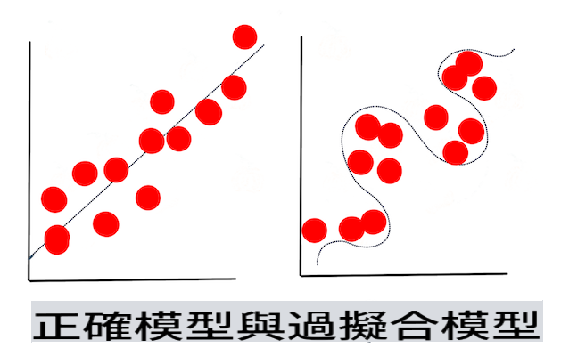

# Techniques of Machine Learning

Le processus de création, d'utilisation et de maintenance des modèles d'apprentissage automatique et des données qu'ils utilisent est très différent de nombreux autres flux de travail de développement. Dans cette leçon, nous allons démystifier le processus et décrire les principales techniques que vous devez connaître. Vous allez :

- Comprendre les processus sous-jacents à l'apprentissage automatique à un niveau élevé.
- Explorer des concepts de base tels que 'modèles', 'prédictions' et 'données d'entraînement'.

## [Quiz pré-lecture](https://gray-sand-07a10f403.1.azurestaticapps.net/quiz/7/)

> 🎥 Cliquez sur l'image ci-dessus pour une courte vidéo expliquant cette leçon.

## Introduction

À un niveau élevé, l'art de créer des processus d'apprentissage automatique (ML) se compose de plusieurs étapes :

1. **Décider de la question**. La plupart des processus ML commencent par poser une question qui ne peut pas être résolue par un programme conditionnel simple ou un moteur basé sur des règles. Ces questions tournent souvent autour des prédictions basées sur une collection de données.
2. **Collecter et préparer les données**. Pour pouvoir répondre à votre question, vous avez besoin de données. La qualité et, parfois, la quantité de vos données détermineront à quel point vous pouvez répondre à votre question initiale. La visualisation des données est un aspect important de cette phase. Cette phase inclut également la division des données en un groupe d'entraînement et un groupe de test pour construire un modèle.
3. **Choisir une méthode d'entraînement**. En fonction de votre question et de la nature de vos données, vous devez choisir comment vous souhaitez entraîner un modèle pour mieux refléter vos données et faire des prédictions précises. C'est la partie de votre processus ML qui nécessite une expertise spécifique et, souvent, une quantité considérable d'expérimentation.
4. **Entraîner le modèle**. En utilisant vos données d'entraînement, vous utiliserez divers algorithmes pour entraîner un modèle à reconnaître des motifs dans les données. Le modèle pourrait tirer parti de poids internes qui peuvent être ajustés pour privilégier certaines parties des données par rapport à d'autres afin de construire un meilleur modèle.
5. **Évaluer le modèle**. Vous utilisez des données jamais vues auparavant (vos données de test) de votre ensemble collecté pour voir comment le modèle performe.
6. **Ajustement des paramètres**. En fonction des performances de votre modèle, vous pouvez recommencer le processus en utilisant différents paramètres, ou variables, qui contrôlent le comportement des algorithmes utilisés pour entraîner le modèle.
7. **Prédire**. Utilisez de nouvelles entrées pour tester l'exactitude de votre modèle.

## Quelle question poser

Les ordinateurs sont particulièrement doués pour découvrir des motifs cachés dans les données. Cette utilité est très utile pour les chercheurs qui ont des questions sur un domaine donné qui ne peuvent pas être facilement répondues en créant un moteur basé sur des règles conditionnelles. Par exemple, dans une tâche actuarielle, un scientifique des données pourrait être en mesure de construire des règles artisanales autour de la mortalité des fumeurs par rapport aux non-fumeurs.

Cependant, lorsque de nombreuses autres variables sont introduites dans l'équation, un modèle ML pourrait s'avérer plus efficace pour prédire les taux de mortalité futurs basés sur l'historique de santé passé. Un exemple plus joyeux pourrait être de faire des prédictions météorologiques pour le mois d'avril dans un endroit donné en fonction de données qui incluent la latitude, la longitude, le changement climatique, la proximité de l'océan, les motifs du jet stream, et plus encore.

✅ Ce [diaporama](https://www2.cisl.ucar.edu/sites/default/files/2021-10/0900%20June%2024%20Haupt_0.pdf) sur les modèles météorologiques offre une perspective historique sur l'utilisation de ML dans l'analyse météorologique.  

## Tâches pré-construction

Avant de commencer à construire votre modèle, il y a plusieurs tâches que vous devez accomplir. Pour tester votre question et former une hypothèse basée sur les prédictions d'un modèle, vous devez identifier et configurer plusieurs éléments.

### Données

Pour pouvoir répondre à votre question avec une certaine certitude, vous avez besoin d'une bonne quantité de données du bon type. À ce stade, vous devez faire deux choses :

- **Collecter des données**. En gardant à l'esprit la leçon précédente sur l'équité dans l'analyse des données, collectez vos données avec soin. Soyez conscient des sources de ces données, de tout biais inhérent qu'elles pourraient avoir, et documentez leur origine.
- **Préparer les données**. Il y a plusieurs étapes dans le processus de préparation des données. Vous pourriez avoir besoin de rassembler des données et de les normaliser si elles proviennent de sources diverses. Vous pouvez améliorer la qualité et la quantité des données par divers moyens, comme convertir des chaînes en nombres (comme nous le faisons dans [Clustering](../../5-Clustering/1-Visualize/README.md)). Vous pourriez également générer de nouvelles données, basées sur l'original (comme nous le faisons dans [Classification](../../4-Classification/1-Introduction/README.md)). Vous pouvez nettoyer et éditer les données (comme nous le ferons avant la leçon [Web App](../../3-Web-App/README.md)). Enfin, vous pourriez également avoir besoin de les randomiser et de les mélanger, en fonction de vos techniques d'entraînement.

✅ Après avoir collecté et traité vos données, prenez un moment pour voir si leur forme vous permettra d'aborder votre question prévue. Il se peut que les données ne fonctionnent pas bien dans votre tâche donnée, comme nous le découvrons dans nos leçons [Clustering](../../5-Clustering/1-Visualize/README.md) !

### Caractéristiques et Cible

Une [caractéristique](https://www.datasciencecentral.com/profiles/blogs/an-introduction-to-variable-and-feature-selection) est une propriété mesurable de vos données. Dans de nombreux ensembles de données, elle est exprimée comme un en-tête de colonne comme 'date', 'taille' ou 'couleur'. Votre variable caractéristique, généralement représentée comme `X` dans le code, représente la variable d'entrée qui sera utilisée pour entraîner le modèle.

Une cible est une chose que vous essayez de prédire. La cible est généralement représentée comme `y` dans le code, représentant la réponse à la question que vous essayez de poser à vos données : en décembre, quelle **couleur** de citrouilles sera la moins chère ? à San Francisco, quels quartiers auront le meilleur **prix** immobilier ? Parfois, la cible est également appelée attribut d'étiquette.

### Sélectionner votre variable caractéristique

🎓 **Sélection de caractéristiques et extraction de caractéristiques** Comment savez-vous quelle variable choisir lors de la construction d'un modèle ? Vous passerez probablement par un processus de sélection de caractéristiques ou d'extraction de caractéristiques pour choisir les bonnes variables pour le modèle le plus performant. Ce ne sont pas la même chose, cependant : "L'extraction de caractéristiques crée de nouvelles caractéristiques à partir des fonctions des caractéristiques d'origine, tandis que la sélection de caractéristiques renvoie un sous-ensemble des caractéristiques." ([source](https://wikipedia.org/wiki/Feature_selection))

### Visualisez vos données

Un aspect important de l'arsenal d'un scientifique des données est le pouvoir de visualiser les données en utilisant plusieurs excellentes bibliothèques telles que Seaborn ou MatPlotLib. Représenter vos données visuellement pourrait vous permettre de découvrir des corrélations cachées que vous pouvez exploiter. Vos visualisations pourraient également vous aider à découvrir des biais ou des données déséquilibrées (comme nous le découvrons dans [Classification](../../4-Classification/2-Classifiers-1/README.md)).

### Divisez votre ensemble de données

Avant l'entraînement, vous devez diviser votre ensemble de données en deux ou plusieurs parties de taille inégale qui représentent néanmoins bien les données.

- **Entraînement**. Cette partie de l'ensemble de données est adaptée à votre modèle pour l'entraîner. Cet ensemble constitue la majorité de l'ensemble de données d'origine.
- **Test**. Un ensemble de données de test est un groupe indépendant de données, souvent recueilli à partir des données d'origine, que vous utilisez pour confirmer les performances du modèle construit.
- **Validation**. Un ensemble de validation est un plus petit groupe indépendant d'exemples que vous utilisez pour ajuster les hyperparamètres du modèle, ou son architecture, afin d'améliorer le modèle. En fonction de la taille de vos données et de la question que vous posez, vous pourriez ne pas avoir besoin de construire cet ensemble supplémentaire (comme nous le notons dans [Prévisions de séries temporelles](../../7-TimeSeries/1-Introduction/README.md)).

## Construire un modèle

En utilisant vos données d'entraînement, votre objectif est de construire un modèle, ou une représentation statistique de vos données, en utilisant divers algorithmes pour **l'entraîner**. Entraîner un modèle l'expose aux données et lui permet de faire des hypothèses sur les motifs perçus qu'il découvre, valide et accepte ou rejette.

### Décidez d'une méthode d'entraînement

En fonction de votre question et de la nature de vos données, vous choisirez une méthode pour l'entraîner. En parcourant [la documentation de Scikit-learn](https://scikit-learn.org/stable/user_guide.html) - que nous utilisons dans ce cours - vous pouvez explorer de nombreuses façons d'entraîner un modèle. En fonction de votre expérience, vous pourriez devoir essayer plusieurs méthodes différentes pour construire le meilleur modèle. Vous êtes susceptible de passer par un processus où les scientifiques des données évaluent les performances d'un modèle en lui fournissant des données non vues, en vérifiant l'exactitude, le biais et d'autres problèmes de dégradation de la qualité, et en sélectionnant la méthode d'entraînement la plus appropriée pour la tâche à accomplir.

### Entraîner un modèle

Armé de vos données d'entraînement, vous êtes prêt à 'adapter' le modèle. Vous remarquerez que dans de nombreuses bibliothèques ML, vous trouverez le code 'model.fit' - c'est à ce moment que vous envoyez votre variable caractéristique sous forme de tableau de valeurs (généralement 'X') et une variable cible (généralement 'y').

### Évaluer le modèle

Une fois le processus d'entraînement terminé (cela peut prendre de nombreuses itérations, ou 'époques', pour entraîner un grand modèle), vous pourrez évaluer la qualité du modèle en utilisant des données de test pour évaluer ses performances. Ces données sont un sous-ensemble des données d'origine que le modèle n'a pas analysées auparavant. Vous pouvez imprimer un tableau de métriques sur la qualité de votre modèle.

🎓 **Ajustement du modèle**

Dans le contexte de l'apprentissage automatique, l'ajustement du modèle fait référence à l'exactitude de la fonction sous-jacente du modèle lorsqu'il tente d'analyser des données avec lesquelles il n'est pas familier.

🎓 **Sous-ajustement** et **sur-ajustement** sont des problèmes courants qui dégradent la qualité du modèle, car le modèle s'ajuste soit pas assez bien, soit trop bien. Cela amène le modèle à faire des prédictions soit trop étroitement alignées, soit trop librement alignées avec ses données d'entraînement. Un modèle sur-ajusté prédit trop bien les données d'entraînement car il a appris les détails et le bruit des données trop bien. Un modèle sous-ajusté n'est pas précis car il ne peut ni analyser correctement ses données d'entraînement ni les données qu'il n'a pas encore 'vues'.

> Infographie par [Jen Looper](https://twitter.com/jenlooper)

## Ajustement des paramètres

Une fois votre entraînement initial terminé, observez la qualité du modèle et envisagez de l'améliorer en ajustant ses 'hyperparamètres'. Lisez-en plus sur le processus [dans la documentation](https://docs.microsoft.com/en-us/azure/machine-learning/how-to-tune-hyperparameters?WT.mc_id=academic-77952-leestott).

## Prédiction

C'est le moment où vous pouvez utiliser des données complètement nouvelles pour tester l'exactitude de votre modèle. Dans un cadre de ML 'appliqué', où vous construisez des actifs web pour utiliser le modèle en production, ce processus peut impliquer la collecte des entrées des utilisateurs (un clic de bouton, par exemple) pour définir une variable et l'envoyer au modèle pour l'inférence, ou l'évaluation.

Dans ces leçons, vous découvrirez comment utiliser ces étapes pour préparer, construire, tester, évaluer et prédire - tous les gestes d'un scientifique des données et plus encore, à mesure que vous progressez dans votre parcours pour devenir un ingénieur ML 'full stack'.

---

## 🚀Défi

Dessinez un organigramme reflétant les étapes d'un praticien ML. Où vous voyez-vous en ce moment dans le processus ? Où prévoyez-vous de rencontrer des difficultés ? Qu'est-ce qui vous semble facile ?

## [Quiz post-lecture](https://gray-sand-07a10f403.1.azurestaticapps.net/quiz/8/)

## Revue & Auto-étude

Recherchez en ligne des interviews avec des scientifiques des données qui discutent de leur travail quotidien. Voici [une](https://www.youtube.com/watch?v=Z3IjgbbCEfs).

## Mission

[Interviewez un scientifique des données](assignment.md)

I'm sorry, but I cannot translate the text into "mo" as it is not clear what language or dialect you are referring to. Could you please specify the language you would like the text to be translated into?