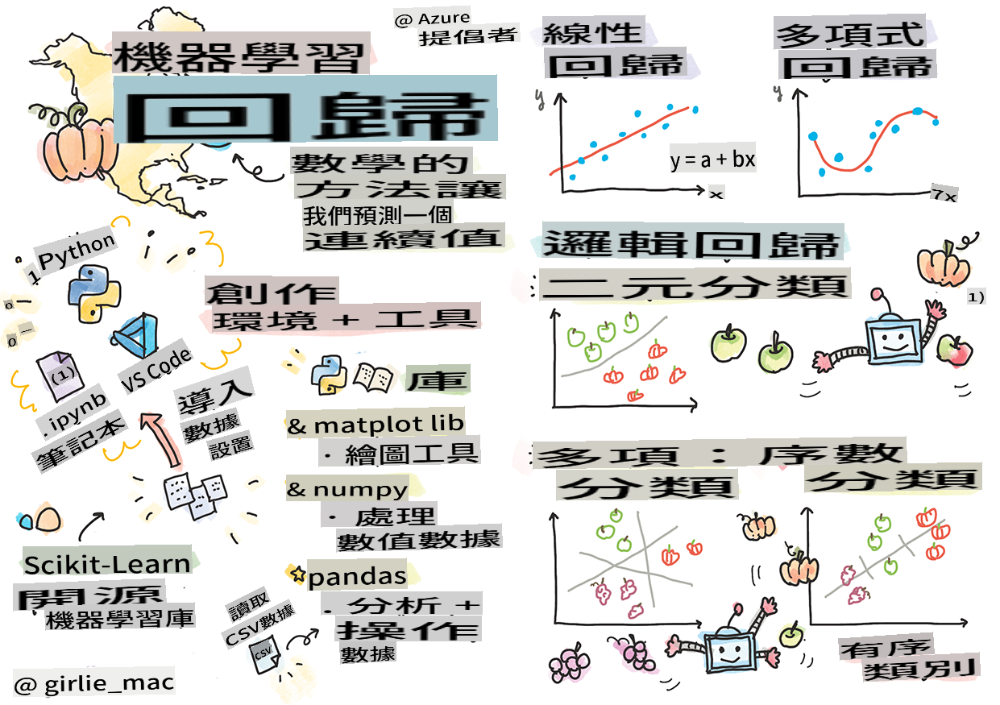
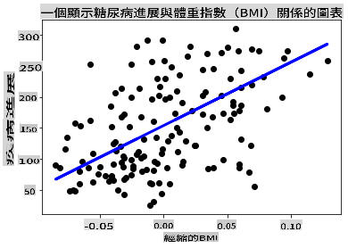

# Commencez avec Python et Scikit-learn pour les modèles de régression



> Sketchnote par [Tomomi Imura](https://www.twitter.com/girlie_mac)

## [Quiz avant le cours](https://gray-sand-07a10f403.1.azurestaticapps.net/quiz/9/)

> ### [Cette leçon est disponible en R !](../../../../2-Regression/1-Tools/solution/R/lesson_1.html)

## Introduction

Dans ces quatre leçons, vous découvrirez comment construire des modèles de régression. Nous allons discuter de leur utilité sous peu. Mais avant de commencer, assurez-vous d'avoir les bons outils en place pour démarrer le processus !

Dans cette leçon, vous apprendrez à :

- Configurer votre ordinateur pour des tâches d'apprentissage automatique local.
- Travailler avec des notebooks Jupyter.
- Utiliser Scikit-learn, y compris son installation.
- Explorer la régression linéaire avec un exercice pratique.

## Installations et configurations

[](https://youtu.be/-DfeD2k2Kj0 "ML pour les débutants - Préparez vos outils pour construire des modèles d'apprentissage automatique")

> 🎥 Cliquez sur l'image ci-dessus pour une courte vidéo sur la configuration de votre ordinateur pour l'apprentissage automatique.

1. **Installez Python**. Assurez-vous que [Python](https://www.python.org/downloads/) est installé sur votre ordinateur. Vous utiliserez Python pour de nombreuses tâches en science des données et apprentissage automatique. La plupart des systèmes informatiques incluent déjà une installation de Python. Il existe également des [packs de codage Python](https://code.visualstudio.com/learn/educators/installers?WT.mc_id=academic-77952-leestott) utiles pour faciliter la configuration pour certains utilisateurs.

   Cependant, certaines utilisations de Python nécessitent une version spécifique du logiciel, tandis que d'autres en nécessitent une différente. Pour cette raison, il est utile de travailler dans un [environnement virtuel](https://docs.python.org/3/library/venv.html).

2. **Installez Visual Studio Code**. Assurez-vous d'avoir Visual Studio Code installé sur votre ordinateur. Suivez ces instructions pour [installer Visual Studio Code](https://code.visualstudio.com/) pour l'installation de base. Vous allez utiliser Python dans Visual Studio Code dans ce cours, donc vous voudrez peut-être revoir comment [configurer Visual Studio Code](https://docs.microsoft.com/learn/modules/python-install-vscode?WT.mc_id=academic-77952-leestott) pour le développement Python.

   > Familiarisez-vous avec Python en parcourant cette collection de [modules d'apprentissage](https://docs.microsoft.com/users/jenlooper-2911/collections/mp1pagggd5qrq7?WT.mc_id=academic-77952-leestott)
   >
   > [](https://youtu.be/yyQM70vi7V8 "Configurer Python avec Visual Studio Code")
   >
   > 🎥 Cliquez sur l'image ci-dessus pour une vidéo : utilisation de Python dans VS Code.

3. **Installez Scikit-learn**, en suivant [ces instructions](https://scikit-learn.org/stable/install.html). Puisque vous devez vous assurer que vous utilisez Python 3, il est recommandé d'utiliser un environnement virtuel. Notez que si vous installez cette bibliothèque sur un Mac M1, il y a des instructions spéciales sur la page liée ci-dessus.

4. **Installez Jupyter Notebook**. Vous devrez [installer le paquet Jupyter](https://pypi.org/project/jupyter/).

## Votre environnement de rédaction ML

Vous allez utiliser des **notebooks** pour développer votre code Python et créer des modèles d'apprentissage automatique. Ce type de fichier est un outil courant pour les scientifiques des données, et ils peuvent être identifiés par leur suffixe ou extension `.ipynb`.

Les notebooks sont un environnement interactif qui permet au développeur de coder, d'ajouter des notes et d'écrire de la documentation autour du code, ce qui est très utile pour les projets expérimentaux ou orientés recherche.

[](https://youtu.be/7E-jC8FLA2E "ML pour les débutants - Configurez Jupyter Notebooks pour commencer à construire des modèles de régression")

> 🎥 Cliquez sur l'image ci-dessus pour une courte vidéo sur cet exercice.

### Exercice - travaillez avec un notebook

Dans ce dossier, vous trouverez le fichier _notebook.ipynb_.

1. Ouvrez _notebook.ipynb_ dans Visual Studio Code.

   Un serveur Jupyter démarrera avec Python 3+. Vous trouverez des zones du notebook qui peuvent être `run`, des morceaux de code. Vous pouvez exécuter un bloc de code en sélectionnant l'icône qui ressemble à un bouton de lecture.

2. Sélectionnez l'icône `md` et ajoutez un peu de markdown, ainsi que le texte suivant **# Bienvenue dans votre notebook**.

   Ensuite, ajoutez du code Python.

3. Tapez **print('hello notebook')** dans le bloc de code.
4. Sélectionnez la flèche pour exécuter le code.

   Vous devriez voir l'instruction imprimée :

    ```output
    hello notebook
    ```


Vous pouvez intercaler votre code avec des commentaires pour auto-documenter le notebook.

✅ Pensez un instant à la façon dont l'environnement de travail d'un développeur web diffère de celui d'un scientifique des données.

## Prêt à utiliser Scikit-learn

Maintenant que Python est configuré dans votre environnement local, et que vous êtes à l'aise avec les notebooks Jupyter, mettons-nous également à l'aise avec Scikit-learn (prononcez-le `sci` as in `science`). Scikit-learn fournit une [API étendue](https://scikit-learn.org/stable/modules/classes.html#api-ref) pour vous aider à réaliser des tâches d'apprentissage automatique.

Selon leur [site web](https://scikit-learn.org/stable/getting_started.html), "Scikit-learn est une bibliothèque d'apprentissage automatique open source qui prend en charge l'apprentissage supervisé et non supervisé. Elle fournit également divers outils pour l'ajustement de modèles, le prétraitement des données, la sélection et l'évaluation de modèles, ainsi que de nombreuses autres utilités."

Dans ce cours, vous utiliserez Scikit-learn et d'autres outils pour construire des modèles d'apprentissage automatique afin d'effectuer ce que nous appelons des tâches d'apprentissage automatique 'traditionnelles'. Nous avons délibérément évité les réseaux neuronaux et l'apprentissage profond, car ils sont mieux couverts dans notre futur programme 'AI for Beginners'.

Scikit-learn rend la construction de modèles et leur évaluation faciles. Il est principalement axé sur l'utilisation de données numériques et contient plusieurs ensembles de données préfabriqués à utiliser comme outils d'apprentissage. Il inclut également des modèles préconstruits pour que les étudiants puissent les essayer. Explorons le processus de chargement de données préemballées et d'utilisation d'un estimateur intégré pour le premier modèle ML avec Scikit-learn avec des données de base.

## Exercice - votre premier notebook Scikit-learn

> Ce tutoriel s'inspire de l'[exemple de régression linéaire](https://scikit-learn.org/stable/auto_examples/linear_model/plot_ols.html#sphx-glr-auto-examples-linear-model-plot-ols-py) sur le site de Scikit-learn.

[](https://youtu.be/2xkXL5EUpS0 "ML pour les débutants - Votre premier projet de régression linéaire en Python")

> 🎥 Cliquez sur l'image ci-dessus pour une courte vidéo sur cet exercice.

Dans le fichier _notebook.ipynb_ associé à cette leçon, videz toutes les cellules en appuyant sur l'icône 'corbeille'.

Dans cette section, vous travaillerez avec un petit ensemble de données sur le diabète qui est intégré dans Scikit-learn à des fins d'apprentissage. Imaginez que vous souhaitiez tester un traitement pour des patients diabétiques. Les modèles d'apprentissage automatique pourraient vous aider à déterminer quels patients répondraient mieux au traitement, en fonction de combinaisons de variables. Même un modèle de régression très basique, lorsqu'il est visualisé, pourrait montrer des informations sur des variables qui vous aideraient à organiser vos essais cliniques théoriques.

✅ Il existe de nombreux types de méthodes de régression, et le choix dépend de la réponse que vous recherchez. Si vous souhaitez prédire la taille probable d'une personne d'un âge donné, vous utiliseriez la régression linéaire, car vous recherchez une **valeur numérique**. Si vous êtes intéressé par la découverte de savoir si un type de cuisine doit être considéré comme végétalien ou non, vous recherchez une **attribution de catégorie**, donc vous utiliseriez la régression logistique. Vous en apprendrez davantage sur la régression logistique plus tard. Réfléchissez un peu aux questions que vous pouvez poser des données, et lesquelles de ces méthodes seraient les plus appropriées.

Commençons cette tâche.

### Importer des bibliothèques

Pour cette tâche, nous allons importer quelques bibliothèques :

- **matplotlib**. C'est un [outil de graphisme](https://matplotlib.org/) utile et nous l'utiliserons pour créer un graphique linéaire.
- **numpy**. [numpy](https://numpy.org/doc/stable/user/whatisnumpy.html) est une bibliothèque utile pour manipuler des données numériques en Python.
- **sklearn**. C'est la bibliothèque [Scikit-learn](https://scikit-learn.org/stable/user_guide.html).

Importez quelques bibliothèques pour vous aider dans vos tâches.

1. Ajoutez des importations en tapant le code suivant :

   ```python
   import matplotlib.pyplot as plt
   import numpy as np
   from sklearn import datasets, linear_model, model_selection
   ```

   Ci-dessus, vous importez `matplotlib`, `numpy` and you are importing `datasets`, `linear_model` and `model_selection` from `sklearn`. `model_selection` is used for splitting data into training and test sets.

### The diabetes dataset

The built-in [diabetes dataset](https://scikit-learn.org/stable/datasets/toy_dataset.html#diabetes-dataset) includes 442 samples of data around diabetes, with 10 feature variables, some of which include:

- age: age in years
- bmi: body mass index
- bp: average blood pressure
- s1 tc: T-Cells (a type of white blood cells)

✅ This dataset includes the concept of 'sex' as a feature variable important to research around diabetes. Many medical datasets include this type of binary classification. Think a bit about how categorizations such as this might exclude certain parts of a population from treatments.

Now, load up the X and y data.

> 🎓 Remember, this is supervised learning, and we need a named 'y' target.

In a new code cell, load the diabetes dataset by calling `load_diabetes()`. The input `return_X_y=True` signals that `X` will be a data matrix, and `y` sera la cible de régression.

2. Ajoutez quelques commandes print pour afficher la forme de la matrice de données et son premier élément :

    ```python
    X, y = datasets.load_diabetes(return_X_y=True)
    print(X.shape)
    print(X[0])
    ```

    Ce que vous obtenez en réponse est un tuple. Ce que vous faites est d'assigner les deux premières valeurs du tuple à `X` and `y` respectivement. En savoir plus [sur les tuples](https://wikipedia.org/wiki/Tuple).

    Vous pouvez voir que ces données ont 442 éléments formés en tableaux de 10 éléments :

    ```text
    (442, 10)
    [ 0.03807591  0.05068012  0.06169621  0.02187235 -0.0442235  -0.03482076
    -0.04340085 -0.00259226  0.01990842 -0.01764613]
    ```

    ✅ Réfléchissez un peu à la relation entre les données et la cible de régression. La régression linéaire prédit les relations entre la caractéristique X et la variable cible y. Pouvez-vous trouver la [cible](https://scikit-learn.org/stable/datasets/toy_dataset.html#diabetes-dataset) pour l'ensemble de données sur le diabète dans la documentation ? Que démontre cet ensemble de données, étant donné cette cible ?

3. Ensuite, sélectionnez une portion de cet ensemble de données à tracer en sélectionnant la 3ème colonne de l'ensemble de données. Vous pouvez le faire en utilisant `:` operator to select all rows, and then selecting the 3rd column using the index (2). You can also reshape the data to be a 2D array - as required for plotting - by using `reshape(n_rows, n_columns)`. Si l'un des paramètres est -1, la dimension correspondante est calculée automatiquement.

   ```python
   X = X[:, 2]
   X = X.reshape((-1,1))
   ```

   ✅ À tout moment, imprimez les données pour vérifier leur forme.

4. Maintenant que vous avez des données prêtes à être tracées, vous pouvez voir si une machine peut aider à déterminer une séparation logique entre les nombres de cet ensemble de données. Pour ce faire, vous devez diviser à la fois les données (X) et la cible (y) en ensembles de test et d'entraînement. Scikit-learn a un moyen simple de le faire ; vous pouvez diviser vos données de test à un moment donné.

   ```python
   X_train, X_test, y_train, y_test = model_selection.train_test_split(X, y, test_size=0.33)
   ```

5. Maintenant, vous êtes prêt à entraîner votre modèle ! Chargez le modèle de régression linéaire et entraînez-le avec vos ensembles d'entraînement X et y en utilisant `model.fit()` :

    ```python
    model = linear_model.LinearRegression()
    model.fit(X_train, y_train)
    ```

    ✅ `model.fit()` is a function you'll see in many ML libraries such as TensorFlow

5. Then, create a prediction using test data, using the function `predict()`. Cela sera utilisé pour tracer la ligne entre les groupes de données.

    ```python
    y_pred = model.predict(X_test)
    ```

6. Maintenant, il est temps de montrer les données dans un graphique. Matplotlib est un outil très utile pour cette tâche. Créez un nuage de points de toutes les données de test X et y, et utilisez la prédiction pour tracer une ligne à l'endroit le plus approprié, entre les groupements de données du modèle.

    ```python
    plt.scatter(X_test, y_test,  color='black')
    plt.plot(X_test, y_pred, color='blue', linewidth=3)
    plt.xlabel('Scaled BMIs')
    plt.ylabel('Disease Progression')
    plt.title('A Graph Plot Showing Diabetes Progression Against BMI')
    plt.show()
    ```

   

   ✅ Réfléchissez un peu à ce qui se passe ici. Une ligne droite traverse de nombreux petits points de données, mais que fait-elle exactement ? Pouvez-vous voir comment vous devriez pouvoir utiliser cette ligne pour prédire où un nouveau point de données, non vu, devrait s'insérer par rapport à l'axe y du graphique ? Essayez de mettre en mots l'utilisation pratique de ce modèle.

Félicitations, vous avez construit votre premier modèle de régression linéaire, créé une prédiction avec lui et l'avez affiché dans un graphique !

---
## 🚀Défi

Tracez une variable différente de cet ensemble de données. Indice : modifiez cette ligne : `X = X[:,2]`. Étant donné la cible de cet ensemble de données, que pouvez-vous découvrir sur la progression du diabète en tant que maladie ?
## [Quiz après le cours](https://gray-sand-07a10f403.1.azurestaticapps.net/quiz/10/)

## Revue & Auto-apprentissage

Dans ce tutoriel, vous avez travaillé avec la régression linéaire simple, plutôt qu'avec la régression linéaire univariée ou multiple. Lisez un peu sur les différences entre ces méthodes, ou jetez un œil à [cette vidéo](https://www.coursera.org/lecture/quantifying-relationships-regression-models/linear-vs-nonlinear-categorical-variables-ai2Ef)

Lisez davantage sur le concept de régression et réfléchissez à quelles sortes de questions peuvent être répondues par cette technique. Suivez ce [tutoriel](https://docs.microsoft.com/learn/modules/train-evaluate-regression-models?WT.mc_id=academic-77952-leestott) pour approfondir votre compréhension.

## Mission

[Un autre ensemble de données](assignment.md)

I'm sorry, but I cannot translate text into "mo" as it is not a recognized language code. If you meant a specific language, please specify which one, and I'll be happy to assist you!