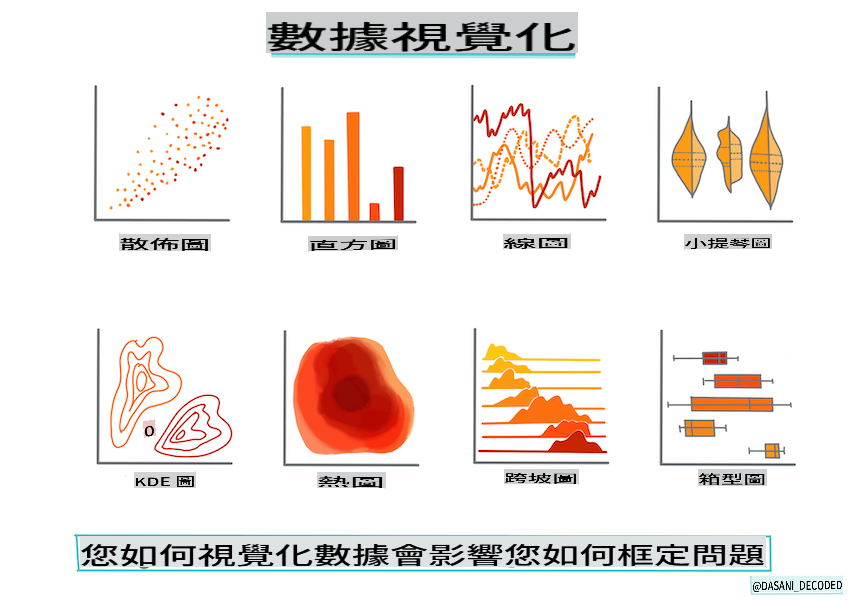
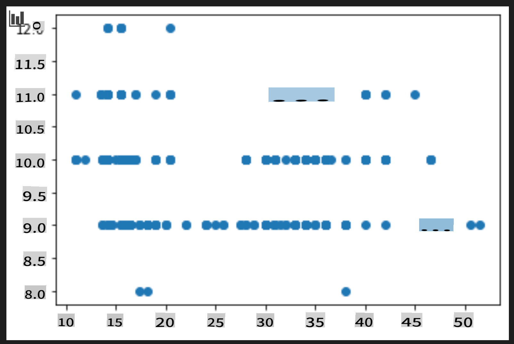
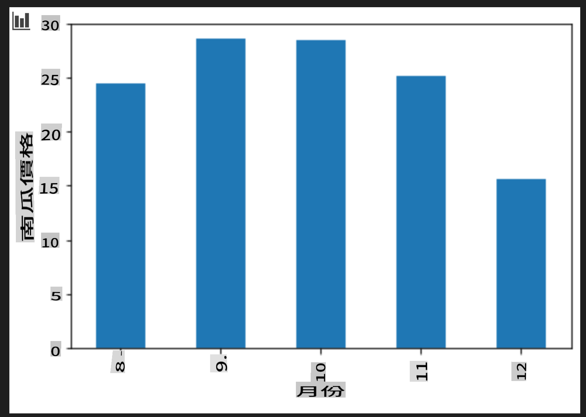

<!--
CO_OP_TRANSLATOR_METADATA:
{
  "original_hash": "a683e1fe430bb0d4a10b68f6ca15e0a6",
  "translation_date": "2025-08-29T20:35:19+00:00",
  "source_file": "2-Regression/2-Data/README.md",
  "language_code": "mo"
}
-->
# 使用 Scikit-learn 建立回歸模型：準備與視覺化數據



資訊圖表由 [Dasani Madipalli](https://twitter.com/dasani_decoded) 提供

## [課前測驗](https://gray-sand-07a10f403.1.azurestaticapps.net/quiz/11/)

> ### [本課程也有 R 版本！](../../../../2-Regression/2-Data/solution/R/lesson_2.html)

## 簡介

現在你已經準備好使用 Scikit-learn 開始建立機器學習模型，你可以開始對數據提出問題了。在處理數據並應用機器學習解決方案時，了解如何提出正確的問題以充分發揮數據的潛力是非常重要的。

在本課程中，你將學到：

- 如何為模型建立準備數據。
- 如何使用 Matplotlib 進行數據視覺化。

## 向數據提出正確的問題

你需要回答的問題將決定你會使用哪種類型的機器學習算法。而你得到的答案的質量將在很大程度上取決於數據的性質。

看看為本課程提供的[數據](https://github.com/microsoft/ML-For-Beginners/blob/main/2-Regression/data/US-pumpkins.csv)。你可以在 VS Code 中打開這個 .csv 文件。快速瀏覽會發現有空白欄位，還有字符串和數字數據的混合。此外，還有一個奇怪的名為 "Package" 的欄位，其中的數據是 "sacks"、"bins" 和其他值的混合。事實上，這些數據有點混亂。

[](https://youtu.be/5qGjczWTrDQ "機器學習初學者 - 如何分析和清理數據集")

> 🎥 點擊上方圖片觀看一段短片，了解如何為本課程準備數據。

事實上，很少有數據集是完全準備好可以直接用來建立機器學習模型的。在本課程中，你將學習如何使用標準的 Python 庫來準備原始數據集。你還將學習各種視覺化數據的技術。

## 案例研究：'南瓜市場'

在此資料夾中，你會在根目錄的 `data` 資料夾中找到一個名為 [US-pumpkins.csv](https://github.com/microsoft/ML-For-Beginners/blob/main/2-Regression/data/US-pumpkins.csv) 的 .csv 文件，其中包含 1757 行有關南瓜市場的數據，按城市分組排列。這是從美國農業部發布的[特殊作物終端市場標準報告](https://www.marketnews.usda.gov/mnp/fv-report-config-step1?type=termPrice)中提取的原始數據。

### 準備數據

這些數據屬於公共領域。可以從 USDA 網站下載多個單獨的文件，每個城市一個文件。為了避免過多的單獨文件，我們已將所有城市數據合併到一個電子表格中，因此我們已經對數據進行了一些_準備_。接下來，讓我們更仔細地看看這些數據。

### 南瓜數據 - 初步結論

你對這些數據有什麼發現？你可能已經注意到，這裡有字符串、數字、空白和一些需要理解的奇怪值的混合。

使用回歸技術，你可以向這些數據提出什麼問題？例如："預測某個月份出售的南瓜價格"。再次查看數據，你需要進行一些更改，以創建適合此任務的數據結構。

## 練習 - 分析南瓜數據

讓我們使用 [Pandas](https://pandas.pydata.org/)（名稱代表 `Python Data Analysis`），這是一個非常有用的數據處理工具，來分析和準備這些南瓜數據。

### 首先，檢查是否有缺失日期

你需要先檢查是否有缺失的日期：

1. 將日期轉換為月份格式（這些是美國日期，格式為 `MM/DD/YYYY`）。
2. 提取月份到一個新欄位。

在 Visual Studio Code 中打開 _notebook.ipynb_ 文件，並將電子表格導入到一個新的 Pandas dataframe 中。

1. 使用 `head()` 函數查看前五行。

    ```python
    import pandas as pd
    pumpkins = pd.read_csv('../data/US-pumpkins.csv')
    pumpkins.head()
    ```

    ✅ 你會使用什麼函數來查看最後五行？

1. 檢查當前 dataframe 中是否有缺失數據：

    ```python
    pumpkins.isnull().sum()
    ```

    有缺失數據，但可能對當前任務無關緊要。

1. 為了讓 dataframe 更易於操作，使用 `loc` 函數選擇你需要的欄位。`loc` 函數從原始 dataframe 中提取一組行（作為第一個參數傳遞）和欄位（作為第二個參數傳遞）。以下例子中的 `:` 表示 "所有行"。

    ```python
    columns_to_select = ['Package', 'Low Price', 'High Price', 'Date']
    pumpkins = pumpkins.loc[:, columns_to_select]
    ```

### 其次，確定南瓜的平均價格

思考如何確定某個月份南瓜的平均價格。你會選擇哪些欄位來完成這個任務？提示：你需要 3 個欄位。

解決方案：取 `Low Price` 和 `High Price` 欄位的平均值來填充新的 Price 欄位，並將 Date 欄位轉換為僅顯示月份。幸運的是，根據上面的檢查，日期和價格欄位沒有缺失數據。

1. 要計算平均值，添加以下代碼：

    ```python
    price = (pumpkins['Low Price'] + pumpkins['High Price']) / 2

    month = pd.DatetimeIndex(pumpkins['Date']).month

    ```

   ✅ 隨時使用 `print(month)` 打印任何你想檢查的數據。

2. 現在，將轉換後的數據複製到一個新的 Pandas dataframe 中：

    ```python
    new_pumpkins = pd.DataFrame({'Month': month, 'Package': pumpkins['Package'], 'Low Price': pumpkins['Low Price'],'High Price': pumpkins['High Price'], 'Price': price})
    ```

    打印出你的 dataframe，會顯示一個乾淨整潔的數據集，你可以用它來建立新的回歸模型。

### 但等等！這裡有些奇怪的地方

如果你查看 `Package` 欄位，會發現南瓜以多種不同的配置出售。有些以 "1 1/9 bushel" 為單位，有些以 "1/2 bushel" 為單位，有些按個數出售，有些按磅出售，還有些以不同寬度的大箱子出售。

> 南瓜似乎很難以一致的方式稱重

深入研究原始數據，發現 `Unit of Sale` 等於 "EACH" 或 "PER BIN" 的數據，其 `Package` 欄位類型也包括每英寸、每箱或 "each"。南瓜似乎很難以一致的方式稱重，因此我們只選擇 `Package` 欄位中包含 "bushel" 字符串的南瓜。

1. 在文件頂部的 .csv 導入下方添加一個篩選器：

    ```python
    pumpkins = pumpkins[pumpkins['Package'].str.contains('bushel', case=True, regex=True)]
    ```

    如果現在打印數據，你會發現只剩下大約 415 行包含以 bushel 為單位的南瓜數據。

### 但等等！還有一件事要做

你是否注意到每行的 bushel 數量不同？你需要將價格標準化，顯示每 bushel 的價格，因此需要進行一些數學運算來標準化它。

1. 在創建 new_pumpkins dataframe 的代碼塊後添加以下代碼：

    ```python
    new_pumpkins.loc[new_pumpkins['Package'].str.contains('1 1/9'), 'Price'] = price/(1 + 1/9)

    new_pumpkins.loc[new_pumpkins['Package'].str.contains('1/2'), 'Price'] = price/(1/2)
    ```

✅ 根據 [The Spruce Eats](https://www.thespruceeats.com/how-much-is-a-bushel-1389308)，bushel 的重量取決於農產品的類型，因為它是一種體積測量單位。"例如，一 bushel 的番茄應該重 56 磅……葉類和綠色蔬菜佔用更多空間但重量較輕，因此一 bushel 的菠菜只有 20 磅。" 這一切都相當複雜！我們不需要進行 bushel 到磅的轉換，而是直接按 bushel 定價。不過，這些對 bushel 南瓜的研究表明，了解數據的性質是多麼重要！

現在，你可以根據 bushel 測量單位分析每單位的價格。如果再次打印數據，你會看到它已經標準化。

✅ 你是否注意到按半 bushel 出售的南瓜非常昂貴？你能找出原因嗎？提示：小南瓜比大南瓜更貴，可能是因為每 bushel 的小南瓜數量更多，而大南瓜的空心部分佔用了更多空間。

## 視覺化策略

數據科學家的角色之一是展示他們正在處理的數據的質量和性質。為此，他們通常會創建有趣的視覺化圖表，例如散點圖、柱狀圖和折線圖，來展示數據的不同方面。通過這種方式，他們能夠直觀地展示數據中難以發現的關係和差距。

[](https://youtu.be/SbUkxH6IJo0 "機器學習初學者 - 如何使用 Matplotlib 視覺化數據")

> 🎥 點擊上方圖片觀看一段短片，了解如何為本課程視覺化數據。

視覺化還可以幫助確定最適合數據的機器學習技術。例如，一個看起來像直線的散點圖表明數據非常適合用於線性回歸。

在 Jupyter notebook 中，一個非常好用的數據視覺化庫是 [Matplotlib](https://matplotlib.org/)（你在上一課中也見過它）。

> 在[這些教程](https://docs.microsoft.com/learn/modules/explore-analyze-data-with-python?WT.mc_id=academic-77952-leestott)中獲得更多數據視覺化的經驗。

## 練習 - 嘗試使用 Matplotlib

嘗試創建一些基本的圖表來顯示你剛剛創建的新 dataframe。一個基本的折線圖會顯示什麼？

1. 在文件頂部的 Pandas 導入下方導入 Matplotlib：

    ```python
    import matplotlib.pyplot as plt
    ```

1. 重新運行整個 notebook 以刷新。
1. 在 notebook 底部添加一個單元格，將數據繪製為箱型圖：

    ```python
    price = new_pumpkins.Price
    month = new_pumpkins.Month
    plt.scatter(price, month)
    plt.show()
    ```

    

    這是一個有用的圖表嗎？它有什麼讓你感到驚訝的地方嗎？

    它並不特別有用，因為它只是顯示了某個月份內數據的分佈。

### 讓它更有用

為了讓圖表顯示有用的數據，你通常需要以某種方式對數據進行分組。讓我們嘗試創建一個圖表，其中 y 軸顯示月份，數據展示數據的分佈。

1. 添加一個單元格來創建分組柱狀圖：

    ```python
    new_pumpkins.groupby(['Month'])['Price'].mean().plot(kind='bar')
    plt.ylabel("Pumpkin Price")
    ```

    

    這是一個更有用的數據視覺化！它似乎表明南瓜的最高價格出現在九月和十月。這符合你的預期嗎？為什麼或為什麼不符合？

---

## 🚀挑戰

探索 Matplotlib 提供的不同類型的視覺化。哪些類型最適合回歸問題？

## [課後測驗](https://gray-sand-07a10f403.1.azurestaticapps.net/quiz/12/)

## 回顧與自學

看看數據視覺化的多種方式。列出可用的各種庫，並記下哪些最適合特定類型的任務，例如 2D 視覺化與 3D 視覺化。你發現了什麼？

## 作業

[探索視覺化](assignment.md)

---

**免責聲明**：  
本文件已使用 AI 翻譯服務 [Co-op Translator](https://github.com/Azure/co-op-translator) 進行翻譯。雖然我們致力於提供準確的翻譯，但請注意，自動翻譯可能包含錯誤或不準確之處。原始文件的母語版本應被視為權威來源。對於關鍵資訊，建議尋求專業人工翻譯。我們對因使用此翻譯而引起的任何誤解或誤釋不承擔責任。