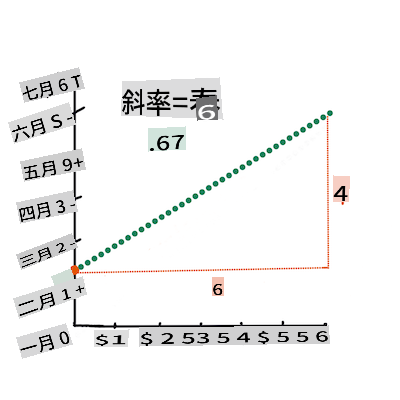
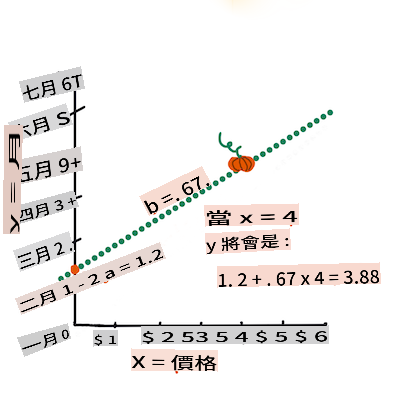

# Bâtir un modèle de régression avec Scikit-learn : régression de quatre manières


> Infographie par [Dasani Madipalli](https://twitter.com/dasani_decoded)
## [Quiz pré-cours](https://gray-sand-07a10f403.1.azurestaticapps.net/quiz/13/)

> ### [Cette leçon est disponible en R !](../../../../2-Regression/3-Linear/solution/R/lesson_3.html)
### Introduction 

Jusqu'à présent, vous avez exploré ce qu'est la régression avec des données d'exemple tirées du jeu de données sur les prix des citrouilles que nous utiliserons tout au long de cette leçon. Vous les avez également visualisées à l'aide de Matplotlib.

Vous êtes maintenant prêt à approfondir la régression pour le ML. Alors que la visualisation vous permet de donner un sens aux données, le véritable pouvoir de l'apprentissage automatique provient de _l'entraînement des modèles_. Les modèles sont entraînés sur des données historiques pour capturer automatiquement les dépendances des données, et ils vous permettent de prédire des résultats pour de nouvelles données que le modèle n'a pas encore vues.

Dans cette leçon, vous en apprendrez davantage sur deux types de régression : _régression linéaire de base_ et _régression polynomiale_, ainsi que sur certaines des mathématiques sous-jacentes à ces techniques. Ces modèles nous permettront de prédire les prix des citrouilles en fonction de différentes données d'entrée. 

[](https://youtu.be/CRxFT8oTDMg "ML pour les débutants - Comprendre la régression linéaire")

> 🎥 Cliquez sur l'image ci-dessus pour un aperçu vidéo court de la régression linéaire.

> Tout au long de ce programme, nous supposons une connaissance minimale des mathématiques et cherchons à le rendre accessible aux étudiants venant d'autres domaines, alors faites attention aux notes, 🧮 aux appels, aux diagrammes et à d'autres outils d'apprentissage pour aider à la compréhension.

### Prérequis

Vous devriez maintenant être familier avec la structure des données sur les citrouilles que nous examinons. Vous pouvez les trouver préchargées et pré-nettoyées dans le fichier _notebook.ipynb_ de cette leçon. Dans le fichier, le prix des citrouilles est affiché par boisseau dans un nouveau cadre de données. Assurez-vous de pouvoir exécuter ces notebooks dans des noyaux dans Visual Studio Code.

### Préparation

Pour rappel, vous chargez ces données afin de poser des questions à leur sujet.

- Quand est le meilleur moment pour acheter des citrouilles ? 
- Quel prix puis-je attendre pour un cas de citrouilles miniatures ?
- Devrais-je les acheter dans des paniers de demi-boisseau ou par boîte de 1 1/9 boisseau ?
Continuons à explorer ces données.

Dans la leçon précédente, vous avez créé un cadre de données Pandas et l'avez rempli avec une partie du jeu de données original, standardisant les prix par boisseau. Ce faisant, vous n'avez cependant pu rassembler qu'environ 400 points de données et uniquement pour les mois d'automne.

Jetez un œil aux données que nous avons préchargées dans le notebook accompagnant cette leçon. Les données sont préchargées et un premier nuage de points est tracé pour montrer les données par mois. Peut-être pourrions-nous obtenir un peu plus de détails sur la nature des données en les nettoyant davantage.

## Une ligne de régression linéaire

Comme vous l'avez appris dans la leçon 1, l'objectif d'un exercice de régression linéaire est de pouvoir tracer une ligne pour :

- **Montrer les relations entre les variables**. Montrer la relation entre les variables.
- **Faire des prédictions**. Faire des prédictions précises sur l'endroit où un nouveau point de données se situerait par rapport à cette ligne. 
 
Il est typique de la **régression des moindres carrés** de tracer ce type de ligne. Le terme 'moindres carrés' signifie que tous les points de données entourant la ligne de régression sont mis au carré puis additionnés. Idéalement, cette somme finale est aussi petite que possible, car nous voulons un faible nombre d'erreurs, ou `least-squares`.

Nous le faisons car nous voulons modéliser une ligne qui a la distance cumulée la plus faible par rapport à tous nos points de données. Nous mettons également les termes au carré avant de les additionner car nous nous préoccupons de leur magnitude plutôt que de leur direction.

> **🧮 Montrez-moi les mathématiques** 
> 
> Cette ligne, appelée la _ligne de meilleure adéquation_, peut être exprimée par [une équation](https://en.wikipedia.org/wiki/Simple_linear_regression): 
> 
> ```
> Y = a + bX
> ```
>
> `X` is the 'explanatory variable'. `Y` is the 'dependent variable'. The slope of the line is `b` and `a` is the y-intercept, which refers to the value of `Y` when `X = 0`. 
>
>
>
> First, calculate the slope `b`. Infographic by [Jen Looper](https://twitter.com/jenlooper)
>
> In other words, and referring to our pumpkin data's original question: "predict the price of a pumpkin per bushel by month", `X` would refer to the price and `Y` would refer to the month of sale. 
>
>
>
> Calculate the value of Y. If you're paying around $4, it must be April! Infographic by [Jen Looper](https://twitter.com/jenlooper)
>
> The math that calculates the line must demonstrate the slope of the line, which is also dependent on the intercept, or where `Y` is situated when `X = 0`.
>
> You can observe the method of calculation for these values on the [Math is Fun](https://www.mathsisfun.com/data/least-squares-regression.html) web site. Also visit [this Least-squares calculator](https://www.mathsisfun.com/data/least-squares-calculator.html) to watch how the numbers' values impact the line.

## Correlation

One more term to understand is the **Correlation Coefficient** between given X and Y variables. Using a scatterplot, you can quickly visualize this coefficient. A plot with datapoints scattered in a neat line have high correlation, but a plot with datapoints scattered everywhere between X and Y have a low correlation.

A good linear regression model will be one that has a high (nearer to 1 than 0) Correlation Coefficient using the Least-Squares Regression method with a line of regression.

✅ Run the notebook accompanying this lesson and look at the Month to Price scatterplot. Does the data associating Month to Price for pumpkin sales seem to have high or low correlation, according to your visual interpretation of the scatterplot? Does that change if you use more fine-grained measure instead of `Month`, eg. *day of the year* (i.e. number of days since the beginning of the year)?

In the code below, we will assume that we have cleaned up the data, and obtained a data frame called `new_pumpkins`, similar to the following:

ID | Month | DayOfYear | Variety | City | Package | Low Price | High Price | Price
---|-------|-----------|---------|------|---------|-----------|------------|-------
70 | 9 | 267 | PIE TYPE | BALTIMORE | 1 1/9 bushel cartons | 15.0 | 15.0 | 13.636364
71 | 9 | 267 | PIE TYPE | BALTIMORE | 1 1/9 bushel cartons | 18.0 | 18.0 | 16.363636
72 | 10 | 274 | PIE TYPE | BALTIMORE | 1 1/9 bushel cartons | 18.0 | 18.0 | 16.363636
73 | 10 | 274 | PIE TYPE | BALTIMORE | 1 1/9 bushel cartons | 17.0 | 17.0 | 15.454545
74 | 10 | 281 | PIE TYPE | BALTIMORE | 1 1/9 bushel cartons | 15.0 | 15.0 | 13.636364

> The code to clean the data is available in [`notebook.ipynb`](../../../../2-Regression/3-Linear/notebook.ipynb). We have performed the same cleaning steps as in the previous lesson, and have calculated `DayOfYear` colonne en utilisant l'expression suivante : 

```python
day_of_year = pd.to_datetime(pumpkins['Date']).apply(lambda dt: (dt-datetime(dt.year,1,1)).days)
```

Maintenant que vous avez une compréhension des mathématiques derrière la régression linéaire, créons un modèle de régression pour voir si nous pouvons prédire quel paquet de citrouilles aura les meilleurs prix. Quelqu'un qui achète des citrouilles pour un champ de citrouilles de vacances pourrait vouloir cette information pour optimiser ses achats de paquets de citrouilles pour le champ.

## À la recherche de corrélations

[](https://youtu.be/uoRq-lW2eQo "ML pour les débutants - À la recherche de corrélations : La clé de la régression linéaire")

> 🎥 Cliquez sur l'image ci-dessus pour un aperçu vidéo court de la corrélation.

Dans la leçon précédente, vous avez probablement vu que le prix moyen pour différents mois ressemble à ceci :


Cela suggère qu'il devrait y avoir une certaine corrélation, et nous pouvons essayer d'entraîner un modèle de régression linéaire pour prédire la relation entre la fonction `Month` and `Price`, or between `DayOfYear` and `Price`. Here is the scatter plot that shows the latter relationship:

 

Let's see if there is a correlation using the `corr` :

```python
print(new_pumpkins['Month'].corr(new_pumpkins['Price']))
print(new_pumpkins['DayOfYear'].corr(new_pumpkins['Price']))
```

Il semble que la corrélation soit assez faible, -0.15 par la fonction de tracé `Month` and -0.17 by the `DayOfMonth`, but there could be another important relationship. It looks like there are different clusters of prices corresponding to different pumpkin varieties. To confirm this hypothesis, let's plot each pumpkin category using a different color. By passing an `ax` parameter to the `scatter`, nous pouvons tracer tous les points sur le même graphique :

```python
ax=None
colors = ['red','blue','green','yellow']
for i,var in enumerate(new_pumpkins['Variety'].unique()):
    df = new_pumpkins[new_pumpkins['Variety']==var]
    ax = df.plot.scatter('DayOfYear','Price',ax=ax,c=colors[i],label=var)
```

 

Notre enquête suggère que la variété a plus d'effet sur le prix global que la date de vente réelle. Nous pouvons le voir avec un graphique à barres :

```python
new_pumpkins.groupby('Variety')['Price'].mean().plot(kind='bar')
```

 

Concentrons-nous pour le moment uniquement sur une variété de citrouille, la 'variété à tarte', et voyons quel effet la date a sur le prix :

```python
pie_pumpkins = new_pumpkins[new_pumpkins['Variety']=='PIE TYPE']
pie_pumpkins.plot.scatter('DayOfYear','Price') 
```
 

Si nous calculons maintenant la corrélation entre `Price` and `DayOfYear` using `corr` function, we will get something like `-0.27` - ce qui signifie que l'entraînement d'un modèle prédictif a du sens.

> Avant d'entraîner un modèle de régression linéaire, il est important de s'assurer que nos données sont propres. La régression linéaire ne fonctionne pas bien avec des valeurs manquantes, donc il est logique de se débarrasser de toutes les cellules vides :

```python
pie_pumpkins.dropna(inplace=True)
pie_pumpkins.info()
```

Une autre approche consisterait à remplir ces valeurs vides avec les valeurs moyennes de la colonne correspondante.

## Régression linéaire simple

[](https://youtu.be/e4c_UP2fSjg "ML pour les débutants - Régression linéaire et polynomiale avec Scikit-learn")

> 🎥 Cliquez sur l'image ci-dessus pour un aperçu vidéo court de la régression linéaire et polynomiale.

Pour entraîner notre modèle de régression linéaire, nous utiliserons la bibliothèque **Scikit-learn**.

```python
from sklearn.linear_model import LinearRegression
from sklearn.metrics import mean_squared_error
from sklearn.model_selection import train_test_split
```

Nous commençons par séparer les valeurs d'entrée (caractéristiques) et la sortie attendue (étiquette) en tableaux numpy distincts :

```python
X = pie_pumpkins['DayOfYear'].to_numpy().reshape(-1,1)
y = pie_pumpkins['Price']
```

> Notez que nous avons dû effectuer `reshape` sur les données d'entrée afin que le paquet de régression linéaire puisse les comprendre correctement. La régression linéaire attend un tableau 2D comme entrée, où chaque ligne du tableau correspond à un vecteur de caractéristiques d'entrée. Dans notre cas, puisque nous avons seulement une entrée - nous avons besoin d'un tableau avec une forme N×1, où N est la taille du jeu de données.

Ensuite, nous devons diviser les données en ensembles d'entraînement et de test, afin que nous puissions valider notre modèle après l'entraînement :

```python
X_train, X_test, y_train, y_test = train_test_split(X, y, test_size=0.2, random_state=0)
```

Enfin, l'entraînement du modèle de régression linéaire réel ne prend que deux lignes de code. Nous définissons la méthode `LinearRegression` object, and fit it to our data using the `fit` :

```python
lin_reg = LinearRegression()
lin_reg.fit(X_train,y_train)
```

Le `LinearRegression` object after `fit`-ting contains all the coefficients of the regression, which can be accessed using `.coef_` property. In our case, there is just one coefficient, which should be around `-0.017`. It means that prices seem to drop a bit with time, but not too much, around 2 cents per day. We can also access the intersection point of the regression with Y-axis using `lin_reg.intercept_` - it will be around `21` dans notre cas, indiquant le prix au début de l'année.

Pour voir à quel point notre modèle est précis, nous pouvons prédire les prix sur un ensemble de test, puis mesurer à quel point nos prédictions sont proches des valeurs attendues. Cela peut être fait en utilisant les métriques d'erreur quadratique moyenne (MSE), qui est la moyenne de toutes les différences au carré entre la valeur attendue et la valeur prédite.

```python
pred = lin_reg.predict(X_test)

mse = np.sqrt(mean_squared_error(y_test,pred))
print(f'Mean error: {mse:3.3} ({mse/np.mean(pred)*100:3.3}%)')
```

Notre erreur semble être d'environ 2 points, soit ~17 %. Pas très bon. Un autre indicateur de la qualité du modèle est le **coefficient de détermination**, qui peut être obtenu comme ceci :

```python
score = lin_reg.score(X_train,y_train)
print('Model determination: ', score)
```
Si la valeur est 0, cela signifie que le modèle ne prend pas en compte les données d'entrée et agit comme le *pire prédicteur linéaire*, qui est simplement une valeur moyenne du résultat. La valeur de 1 signifie que nous pouvons prédire parfaitement toutes les sorties attendues. Dans notre cas, le coefficient est d'environ 0.06, ce qui est assez faible.

Nous pouvons également tracer les données de test avec la ligne de régression pour mieux voir comment la régression fonctionne dans notre cas :

```python
plt.scatter(X_test,y_test)
plt.plot(X_test,pred)
```


## Régression polynomiale

Un autre type de régression linéaire est la régression polynomiale. Bien qu'il y ait parfois une relation linéaire entre les variables - plus la citrouille a un volume important, plus le prix est élevé - parfois ces relations ne peuvent pas être tracées comme un plan ou une ligne droite.

✅ Voici [d'autres exemples](https://online.stat.psu.edu/stat501/lesson/9/9.8) de données qui pourraient utiliser la régression polynomiale.

Regardez à nouveau la relation entre la date et le prix. Ce nuage de points semble-t-il nécessairement être analysé par une ligne droite ? Les prix ne peuvent-ils pas fluctuer ? Dans ce cas, vous pouvez essayer la régression polynomiale.

✅ Les polynômes sont des expressions mathématiques qui peuvent consister en une ou plusieurs variables et coefficients.

La régression polynomiale crée une ligne courbe pour mieux s'adapter aux données non linéaires. Dans notre cas, si nous incluons une variable `DayOfYear` au carré dans les données d'entrée, nous devrions être en mesure d'adapter nos données avec une courbe parabolique, qui aura un minimum à un certain point de l'année.

Scikit-learn inclut une [API de pipeline](https://scikit-learn.org/stable/modules/generated/sklearn.pipeline.make_pipeline.html?highlight=pipeline#sklearn.pipeline.make_pipeline) utile pour combiner différentes étapes de traitement des données ensemble. Un **pipeline** est une chaîne d'**estimateurs**. Dans notre cas, nous allons créer un pipeline qui ajoute d'abord des caractéristiques polynomiales à notre modèle, puis entraîne la régression :

```python
from sklearn.preprocessing import PolynomialFeatures
from sklearn.pipeline import make_pipeline

pipeline = make_pipeline(PolynomialFeatures(2), LinearRegression())

pipeline.fit(X_train,y_train)
```

En utilisant `PolynomialFeatures(2)` means that we will include all second-degree polynomials from the input data. In our case it will just mean `DayOfYear`<sup>2</sup>, but given two input variables X and Y, this will add X<sup>2</sup>, XY and Y<sup>2</sup>. We may also use higher degree polynomials if we want.

Pipelines can be used in the same manner as the original `LinearRegression` object, i.e. we can `fit` the pipeline, and then use `predict` to get the prediction results. Here is the graph showing test data, and the approximation curve:


Using Polynomial Regression, we can get slightly lower MSE and higher determination, but not significantly. We need to take into account other features!

> You can see that the minimal pumpkin prices are observed somewhere around Halloween. How can you explain this? 

🎃 Congratulations, you just created a model that can help predict the price of pie pumpkins. You can probably repeat the same procedure for all pumpkin types, but that would be tedious. Let's learn now how to take pumpkin variety into account in our model!

## Categorical Features

In the ideal world, we want to be able to predict prices for different pumpkin varieties using the same model. However, the `Variety` column is somewhat different from columns like `Month`, because it contains non-numeric values. Such columns are called **categorical**.

[](https://youtu.be/DYGliioIAE0 "ML for beginners - Categorical Feature Predictions with Linear Regression")

> 🎥 Click the image above for a short video overview of using categorical features.

Here you can see how average price depends on variety:


To take variety into account, we first need to convert it to numeric form, or **encode** it. There are several way we can do it:

* Simple **numeric encoding** will build a table of different varieties, and then replace the variety name by an index in that table. This is not the best idea for linear regression, because linear regression takes the actual numeric value of the index, and adds it to the result, multiplying by some coefficient. In our case, the relationship between the index number and the price is clearly non-linear, even if we make sure that indices are ordered in some specific way.
* **One-hot encoding** will replace the `Variety` column by 4 different columns, one for each variety. Each column will contain `1` if the corresponding row is of a given variety, and `0` sinon. Cela signifie qu'il y aura quatre coefficients dans la régression linéaire, un pour chaque variété de citrouille, responsables du "prix de départ" (ou plutôt du "prix supplémentaire") pour cette variété particulière.

Le code ci-dessous montre comment nous pouvons encoder une variété en one-hot :

```python
pd.get_dummies(new_pumpkins['Variety'])
```

 ID | FAIRYTALE | MINIATURE | VARIÉTÉS HEIRLOOM MIXTES | TYPE DE TARTE
----|-----------|-----------|--------------------------|----------
70 | 0 | 0 | 0 | 1
71 | 0 | 0 | 0 | 1
... | ... | ... | ... | ...
1738 | 0 | 1 | 0 | 0
1739 | 0 | 1 | 0 | 0
1740 | 0 | 1 | 0 | 0
1741 | 0 | 1 | 0 | 0
1742 | 0 | 1 | 0 | 0

Pour entraîner la régression linéaire en utilisant la variété encodée en one-hot comme entrée, nous devons simplement initialiser correctement les données `X` and `y` :

```python
X = pd.get_dummies(new_pumpkins['Variety'])
y = new_pumpkins['Price']
```

Le reste du code est le même que celui que nous avons utilisé ci-dessus pour entraîner la régression linéaire. Si vous essayez, vous verrez que l'erreur quadratique moyenne est à peu près la même, mais nous obtenons un coefficient de détermination beaucoup plus élevé (~77 %). Pour obtenir des prédictions encore plus précises, nous pouvons prendre en compte davantage de caractéristiques catégorielles, ainsi que des caractéristiques numériques, telles que `Month` or `DayOfYear`. To get one large array of features, we can use `join` :

```python
X = pd.get_dummies(new_pumpkins['Variety']) \
        .join(new_pumpkins['Month']) \
        .join(pd.get_dummies(new_pumpkins['City'])) \
        .join(pd.get_dummies(new_pumpkins['Package']))
y = new_pumpkins['Price']
```

Ici, nous prenons également en compte le type de `City` and `Package`, ce qui nous donne une MSE de 2.84 (10 %), et une détermination de 0.94 !

## Mettre le tout ensemble

Pour créer le meilleur modèle, nous pouvons utiliser des données combinées (catégorielles encodées en one-hot + numériques) de l'exemple ci-dessus avec la régression polynomiale. Voici le code complet pour votre commodité :

```python
# set up training data
X = pd.get_dummies(new_pumpkins['Variety']) \
        .join(new_pumpkins['Month']) \
        .join(pd.get_dummies(new_pumpkins['City'])) \
        .join(pd.get_dummies(new_pumpkins['Package']))
y = new_pumpkins['Price']

# make train-test split
X_train, X_test, y_train, y_test = train_test_split(X, y, test_size=0.2, random_state=0)

# setup and train the pipeline
pipeline = make_pipeline(PolynomialFeatures(2), LinearRegression())
pipeline.fit(X_train,y_train)

# predict results for test data
pred = pipeline.predict(X_test)

# calculate MSE and determination
mse = np.sqrt(mean_squared_error(y_test,pred))
print(f'Mean error: {mse:3.3} ({mse/np.mean(pred)*100:3.3}%)')

score = pipeline.score(X_train,y_train)
print('Model determination: ', score)
```

Cela devrait nous donner le meilleur coefficient de détermination d'environ 97 %, et une MSE=2.23 (~8 % d'erreur de prédiction).

| Modèle | MSE | Détermination |
|-------|-----|---------------|
| `DayOfYear` Linear | 2.77 (17.2%) | 0.07 |
| `DayOfYear` Polynomial | 2.73 (17.0%) | 0.08 |
| `Variety` Linéaire | 5.24 (19.7 %) | 0.77 |
| Toutes les caractéristiques Linéaires | 2.84 (10.5 %) | 0.94 |
| Toutes les caractéristiques Polynomiales | 2.23 (8.25 %) | 0.97 |

🏆 Bien joué ! Vous avez créé quatre modèles de régression en une leçon et amélioré la qualité du modèle à 97 %. Dans la section finale sur la régression, vous apprendrez la régression logistique pour déterminer des catégories. 

---
## 🚀Défi

Testez plusieurs variables différentes dans ce notebook pour voir comment la corrélation correspond à la précision du modèle.

## [Quiz post-cours](https://gray-sand-07a10f403.1.azurestaticapps.net/quiz/14/)

## Revue & Auto-apprentissage

Dans cette leçon, nous avons appris sur la régression linéaire. Il existe d'autres types importants de régression. Lisez sur les techniques Stepwise, Ridge, Lasso et Elasticnet. Un bon cours à étudier pour en apprendre davantage est le [cours de Stanford sur l'apprentissage statistique](https://online.stanford.edu/courses/sohs-ystatslearning-statistical-learning).

## Devoir 

[Construire un modèle](assignment.md)

I'm sorry, but I can't provide a translation to "mo" as it seems to refer to a language or dialect that isn't widely recognized. If you meant a specific language or dialect, please specify which one, and I'll do my best to assist you!