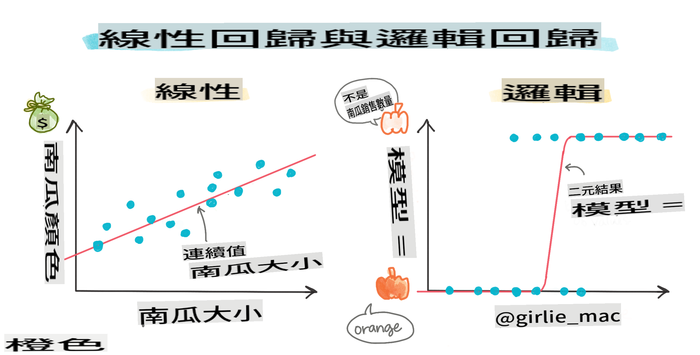
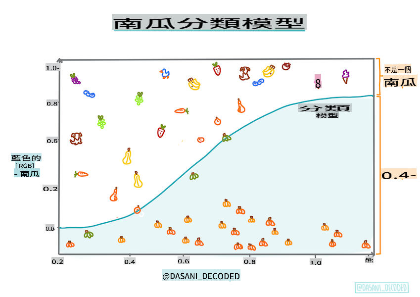
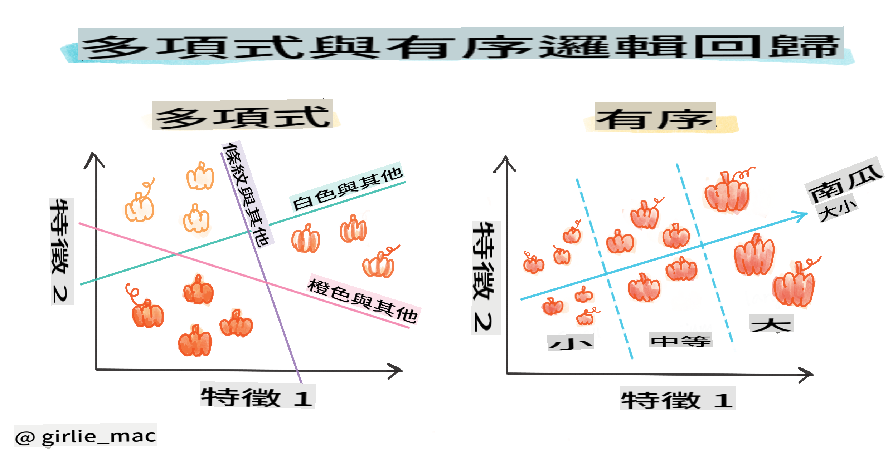
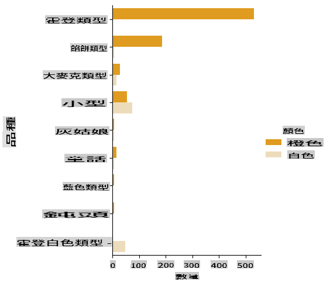
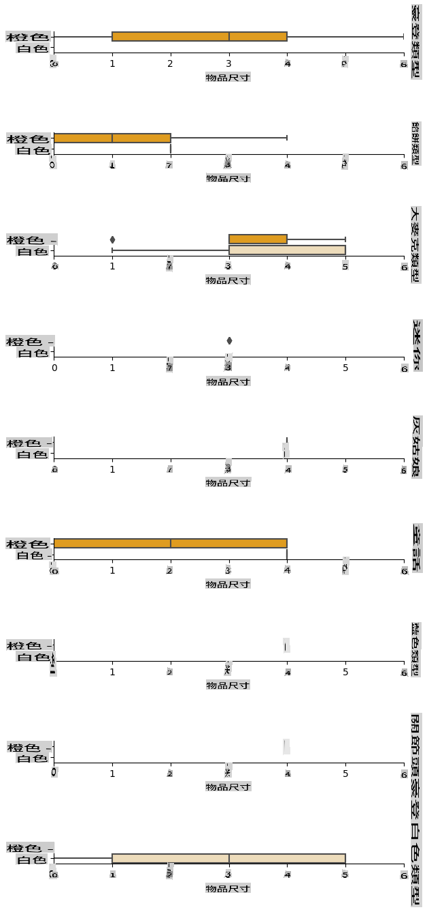
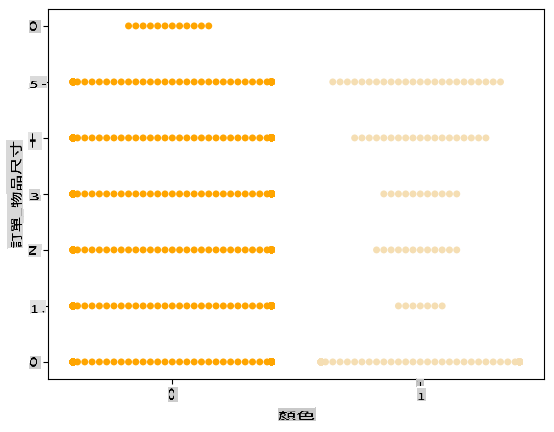
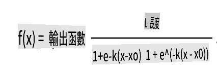
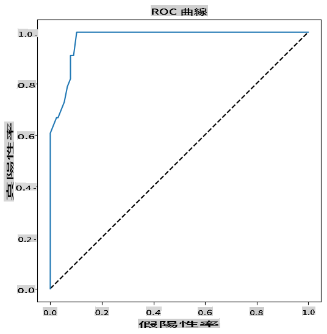

# Logistic regression to predict categories



## [Pre-lecture quiz](https://gray-sand-07a10f403.1.azurestaticapps.net/quiz/15/)

> ### [This lesson is available in R!](../../../../2-Regression/4-Logistic/solution/R/lesson_4.html)

## Introduction

In this final lesson on Regression, one of the fundamental _classic_ ML techniques, we will explore Logistic Regression. This technique is useful for uncovering patterns that can help predict binary categories. For example, is this candy chocolate or not? Is this disease contagious or not? Will this customer choose this product or not?

In this lesson, you will learn:

- A new library for data visualization
- Techniques for logistic regression

✅ Deepen your understanding of working with this type of regression in this [Learn module](https://docs.microsoft.com/learn/modules/train-evaluate-classification-models?WT.mc_id=academic-77952-leestott)

## Prerequisite

Having worked with the pumpkin data, we are now familiar enough with it to identify one binary category we can work with: `Color`.

Let's build a logistic regression model to predict that, given certain variables, _what color a given pumpkin is likely to be_ (orange 🎃 or white 👻).

> Why are we discussing binary classification in a lesson series about regression? It's mainly for convenience, as logistic regression is [actually a classification method](https://scikit-learn.org/stable/modules/linear_model.html#logistic-regression), albeit one based on linear principles. Discover other ways to classify data in the next lesson series.

## Define the question

For our purposes, we will frame this as a binary choice: 'White' or 'Not White'. There is also a 'striped' category in our dataset, but it has very few instances, so we will not consider it. It disappears anyway once we eliminate null values from the dataset.

> 🎃 Fun fact: we sometimes refer to white pumpkins as 'ghost' pumpkins. They aren't very easy to carve, making them less popular than the orange ones, but they have a unique appearance! Thus, we could also phrase our question as: 'Ghost' or 'Not Ghost'. 👻

## About logistic regression

Logistic regression differs from linear regression, which you learned about earlier, in several significant ways.

[](https://youtu.be/KpeCT6nEpBY "ML for beginners - Understanding Logistic Regression for Machine Learning Classification")

> 🎥 Click the image above for a brief video overview of logistic regression.

### Binary classification

Logistic regression does not provide the same features as linear regression. The former predicts a binary category ("white or not white"), while the latter predicts continuous values. For instance, given the origin of a pumpkin and the time of harvest, it can predict _how much its price will increase_.


> Infographic by [Dasani Madipalli](https://twitter.com/dasani_decoded)

### Other classifications

There are various types of logistic regression, including multinomial and ordinal:

- **Multinomial**, which involves having multiple categories - "Orange, White, and Striped".
- **Ordinal**, which deals with ordered categories, useful if we want to logically arrange our outcomes, like our pumpkins that are classified by a finite number of sizes (mini, sm, med, lg, xl, xxl).



### Variables DO NOT have to correlate

Remember how linear regression performed better with more correlated variables? Logistic regression is different - the variables don't need to be aligned. This is effective for this data, which exhibits somewhat weak correlations.

### You need a lot of clean data

Logistic regression will yield more accurate results if you utilize more data; our small dataset isn't optimal for this task, so keep that in mind.

[](https://youtu.be/B2X4H9vcXTs "ML for beginners - Data Analysis and Preparation for Logistic Regression")

> 🎥 Click the image above for a brief video overview of preparing data for linear regression.

✅ Consider the types of data that would be suitable for logistic regression.

## Exercise - tidy the data

First, clean the data a bit by dropping null values and selecting only some of the columns:

1. Add the following code:

    ```python
  
    columns_to_select = ['City Name','Package','Variety', 'Origin','Item Size', 'Color']
    pumpkins = full_pumpkins.loc[:, columns_to_select]

    pumpkins.dropna(inplace=True)
    ```

    You can always take a look at your new dataframe:

    ```python
    pumpkins.info
    ```

### Visualization - categorical plot

By now, you have loaded the [starter notebook](../../../../2-Regression/4-Logistic/notebook.ipynb) with pumpkin data again and cleaned it to preserve a dataset containing a few variables, including `Color`. Let's visualize the dataframe in the notebook using a different library: [Seaborn](https://seaborn.pydata.org/index.html), which is built on Matplotlib, which we used earlier.

Seaborn provides some excellent methods for visualizing your data. For instance, you can compare the distributions of the data for each `Variety` and `Color` in a categorical plot.

1. Create such a plot by using the `catplot` function, using our pumpkin data `pumpkins`, and specifying a color mapping for each pumpkin category (orange or white):

    ```python
    import seaborn as sns
    
    palette = {
    'ORANGE': 'orange',
    'WHITE': 'wheat',
    }

    sns.catplot(
    data=pumpkins, y="Variety", hue="Color", kind="count",
    palette=palette, 
    )
    ```

    

    By examining the data, you can see how the Color data relates to Variety.

    ✅ Based on this categorical plot, what interesting explorations can you imagine?

### Data pre-processing: feature and label encoding

Our pumpkins dataset contains string values for all its columns. While working with categorical data is intuitive for humans, it's not for machines. Machine learning algorithms perform better with numerical data. That's why encoding is a crucial step in the data pre-processing phase, as it allows us to convert categorical data into numerical data without losing any information. Proper encoding leads to building a robust model.

For feature encoding, there are two primary types of encoders:

1. Ordinal encoder: it works well for ordinal variables, which are categorical variables with a logical order, like the `Item Size` column in our dataset. It creates a mapping so that each category is represented by a number corresponding to its order in the column.

    ```python
    from sklearn.preprocessing import OrdinalEncoder

    item_size_categories = [['sml', 'med', 'med-lge', 'lge', 'xlge', 'jbo', 'exjbo']]
    ordinal_features = ['Item Size']
    ordinal_encoder = OrdinalEncoder(categories=item_size_categories)
    ```

2. Categorical encoder: it is suitable for nominal variables, which are categorical variables that do not follow a logical order, like all features other than `Item Size` in our dataset. It employs one-hot encoding, meaning that each category is represented by a binary column: the encoded variable is equal to 1 if the pumpkin belongs to that Variety and 0 otherwise.

    ```python
    from sklearn.preprocessing import OneHotEncoder

    categorical_features = ['City Name', 'Package', 'Variety', 'Origin']
    categorical_encoder = OneHotEncoder(sparse_output=False)
    ```
Then, `ColumnTransformer` is utilized to combine multiple encoders into a single step and apply them to the appropriate columns.

```python
    from sklearn.compose import ColumnTransformer
    
    ct = ColumnTransformer(transformers=[
        ('ord', ordinal_encoder, ordinal_features),
        ('cat', categorical_encoder, categorical_features)
        ])
    
    ct.set_output(transform='pandas')
    encoded_features = ct.fit_transform(pumpkins)
```
On the other hand, to encode the label, we use the scikit-learn `LabelEncoder` class, which is a utility class designed to normalize labels so that they contain only values between 0 and n_classes-1 (here, 0 and 1).

```python
    from sklearn.preprocessing import LabelEncoder

    label_encoder = LabelEncoder()
    encoded_label = label_encoder.fit_transform(pumpkins['Color'])
```
Once we have encoded the features and the label, we can merge them into a new dataframe `encoded_pumpkins`.

```python
    encoded_pumpkins = encoded_features.assign(Color=encoded_label)
```
✅ What are the advantages of using an ordinal encoder for the `Item Size` column?

### Analyse relationships between variables

Now that we have pre-processed our data, we can analyse the relationships between the features and the label to grasp an idea of how well the model will be able to predict the label given the features.
The best way to perform this kind of analysis is plotting the data. We'll be using again the Seaborn `catplot` function, to visualize the relationships between `Item Size`,  `Variety` and `Color` in a categorical plot? To better visualize the data, we'll be using the encoded `Item Size` column and the unencoded `Variety` column.

```python
    palette = {
    'ORANGE': 'orange',
    'WHITE': 'wheat',
    }
    pumpkins['Item Size'] = encoded_pumpkins['ord__Item Size']

    g = sns.catplot(
        data=pumpkins,
        x="Item Size", y="Color", row='Variety',
        kind="box", orient="h",
        sharex=False, margin_titles=True,
        height=1.8, aspect=4, palette=palette,
    )
    g.set(xlabel="Item Size", ylabel="").set(xlim=(0,6))
    g.set_titles(row_template="{row_name}")
```


### Use a swarm plot

Since Color is a binary category (White or Not), it requires 'a [specialized approach](https://seaborn.pydata.org/tutorial/categorical.html?highlight=bar) to visualization'. There are various ways to visualize the relationship of this category with other variables.

You can display variables side-by-side using Seaborn plots.

1. Try a 'swarm' plot to show the distribution of values:

    ```python
    palette = {
    0: 'orange',
    1: 'wheat'
    }
    sns.swarmplot(x="Color", y="ord__Item Size", data=encoded_pumpkins, palette=palette)
    ```

    

**Watch Out**: The code above may generate a warning, as Seaborn struggles to represent such a large number of data points in a swarm plot. A potential solution is to reduce the size of the marker by using the 'size' parameter. However, be cautious, as this may affect the readability of the plot.

> **🧮 Show Me The Math**
>
> Logistic regression relies on the concept of 'maximum likelihood' using [sigmoid functions](https://wikipedia.org/wiki/Sigmoid_function). A 'Sigmoid Function' on a plot resembles an 'S' shape. It takes a value and maps it to a range between 0 and 1. Its curve is also referred to as a 'logistic curve'. Its formula appears as follows:
>
> 
>
> where the sigmoid's midpoint is at x's 0 point, L is the curve's maximum value, and k is the curve's steepness. If the function's outcome exceeds 0.5, the label in question will be assigned the class '1' of the binary choice. Otherwise, it will be classified as '0'.

## Build your model

Constructing a model to identify these binary classifications is surprisingly straightforward in Scikit-learn.

[](https://youtu.be/MmZS2otPrQ8 "ML for beginners - Logistic Regression for classification of data")

> 🎥 Click the image above for a brief video overview of building a linear regression model.

1. Select the variables you want to use in your classification model and split the training and test sets by calling `train_test_split()`:

    ```python
    from sklearn.model_selection import train_test_split
    
    X = encoded_pumpkins[encoded_pumpkins.columns.difference(['Color'])]
    y = encoded_pumpkins['Color']

    X_train, X_test, y_train, y_test = train_test_split(X, y, test_size=0.2, random_state=0)
    
    ```

2. Now you can train your model by calling `fit()` with your training data, and print out its result:

    ```python
    from sklearn.metrics import f1_score, classification_report 
    from sklearn.linear_model import LogisticRegression

    model = LogisticRegression()
    model.fit(X_train, y_train)
    predictions = model.predict(X_test)

    print(classification_report(y_test, predictions))
    print('Predicted labels: ', predictions)
    print('F1-score: ', f1_score(y_test, predictions))
    ```

    Take a look at your model's scoreboard. It's quite good, considering you have only about 1000 rows of data:

    ```output
                       precision    recall  f1-score   support
    
                    0       0.94      0.98      0.96       166
                    1       0.85      0.67      0.75        33
    
        accuracy                                0.92       199
        macro avg           0.89      0.82      0.85       199
        weighted avg        0.92      0.92      0.92       199
    
        Predicted labels:  [0 0 0 0 0 0 0 0 0 0 0 0 0 0 0 0 0 0 0 0 1 0 0 1 0 0 0 0 0 0 0 0 1 0 0 0 0
        0 0 0 0 0 1 0 1 0 0 1 0 0 0 0 0 1 0 1 0 1 0 1 0 0 0 0 0 0 0 0 0 0 0 0 0 0
        1 0 0 0 0 0 0 0 1 0 0 0 0 0 0 0 1 0 0 0 0 0 0 0 0 1 0 1 0 0 0 0 0 0 0 1 0
        0 0 0 0 0 0 0 0 0 0 0 0 0 0 0 0 0 0 0 0 0 1 0 0 0 0 0 0 0 0 1 0 0 0 1 1 0
        0 0 0 0 1 0 0 0 0 0 1 0 0 0 0 0 0 0 0 0 0 0 0 0 0 0 0 0 0 0 0 0 0 0 0 0 1
        0 0 0 1 0 0 0 0 0 0 0 0 1 1]
        F1-score:  0.7457627118644068
    ```

## Better comprehension via a confusion matrix

While you can obtain a scoreboard report [terms](https://scikit-learn.org/stable/modules/generated/sklearn.metrics.classification_report.html?highlight=classification_report#sklearn.metrics.classification_report) by printing out the items above, you may find it easier to understand your model using a [confusion matrix](https://scikit-learn.org/stable/modules/model_evaluation.html#confusion-matrix) to assess how well the model is performing.

> 🎓 A '[confusion matrix](https://wikipedia.org/wiki/Confusion_matrix)' (or 'error matrix') is a table that displays your model's true vs. false positives and negatives, thus gauging the accuracy of predictions.

1. To use a confusion matrix, call `confusion_matrix()`:

    ```python
    from sklearn.metrics import confusion_matrix
    confusion_matrix(y_test, predictions)
    ```

    Take a look at your model's confusion matrix:

    ```output
    array([[162,   4],
           [ 11,  22]])
    ```

In Scikit-learn, the confusion matrix's rows (axis 0) represent actual labels, while the columns (axis 1) represent predicted labels.

|       |   0   |   1   |
| :---: | :---: | :---: |
|   0   |  TN   |  FP   |
|   1   |  FN   |  TP   |

What does this mean? Suppose our model is tasked with classifying pumpkins into two binary categories, 'white' and 'not-white'.

- If your model predicts a pumpkin as not white, and it actually belongs to the 'not-white' category, we refer to it as a true negative, represented by the top left number.
- If your model predicts a pumpkin as white, but it actually belongs to 'not-white', we call it a false negative, represented by the bottom left number.
- If your model predicts a pumpkin as not white, but it actually belongs to 'white', we refer to it as a false positive, represented by the top right number.
- If your model predicts a pumpkin as white, and it actually belongs to 'white', we call it a true positive, represented by the bottom right number.

As you may have guessed, it is preferable to have a larger number of true positives and true negatives, and a smaller number of false positives and false negatives, indicating that the model performs better.

How does the confusion matrix relate to precision and recall? Remember, the classification report printed above indicated precision (0.85) and recall (0.67).

Precision = tp / (tp + fp) = 22 / (22 + 4) = 0.8461538461538461

Recall = tp / (tp + fn) = 22 / (22 + 11) = 0.6666666666666666

✅ Q: Based on the confusion matrix, how did the model perform? A: Not too bad; there are a good number of true negatives, but also a few false negatives.

Let's revisit the terms we encountered earlier with the help of the confusion matrix's mapping of TP/TN and FP/FN:

🎓 Precision: TP/(TP + FP) The fraction of relevant instances among the retrieved instances (e.g., which labels were accurately labeled).

🎓 Recall: TP/(TP + FN) The fraction of relevant instances that were retrieved, regardless of whether they were well-labeled.

🎓 f1-score: (2 * precision * recall)/(precision + recall) A weighted average of precision and recall, with the best score being 1 and the worst being 0.

🎓 Support: The number of occurrences of each label retrieved.

🎓 Accuracy: (TP + TN)/(TP + TN + FP + FN) The percentage of labels predicted accurately for a sample.

🎓 Macro Avg: The calculation of the unweighted mean metrics for each label, without considering label imbalance.

🎓 Weighted Avg: The calculation of the mean metrics for each label, factoring in label imbalance by weighting them according to their support (the number of true instances for each label).

✅ Can you determine which metric you should focus on if you want your model to reduce the number of false negatives?

## Visualize the ROC curve of this model

[](https://youtu.be/GApO575jTA0 "ML for beginners - Analyzing Logistic Regression Performance with ROC Curves")

> 🎥 Click the image above for a brief video overview of ROC curves.

Let's do one more visualization to examine the so-called 'ROC' curve:

```python
from sklearn.metrics import roc_curve, roc_auc_score
import matplotlib
import matplotlib.pyplot as plt
%matplotlib inline

y_scores = model.predict_proba(X_test)
fpr, tpr, thresholds = roc_curve(y_test, y_scores[:,1])

fig = plt.figure(figsize=(6, 6))
plt.plot([0, 1], [0, 1], 'k--')
plt.plot(fpr, tpr)
plt.xlabel('False Positive Rate')
plt.ylabel('True Positive Rate')
plt.title('ROC Curve')
plt.show()
```

Using Matplotlib, plot the model's [Receiving Operating Characteristic](https://scikit-learn.org/stable/auto_examples/model_selection/plot_roc.html?highlight=roc) or ROC. ROC curves are commonly used to assess a classifier's output in terms of its true vs. false positives. "ROC curves typically display the true positive rate on the Y axis, and the false positive rate on the X axis." Thus, the steepness of the curve and the distance between the midpoint line and the curve are significant: you want a curve that quickly rises and surpasses the line. In our case, there are false positives initially, but then the line rises and surpasses appropriately:



Finally, use Scikit-learn's [`roc_auc_score` API](https://scikit-learn.org/stable/modules/generated/sklearn.metrics.roc_auc_score.html?highlight=roc_auc#sklearn.metrics.roc_auc_score) to compute the actual 'Area Under the Curve' (AUC):

```python
auc = roc_auc_score(y_test,y_scores[:,1])
print(auc)
```
The result is `0.9749908725812341`. Given that the AUC ranges from 0 to 1, you want a high score, as a model that is 100% correct in its predictions will have an AUC of 1; in this case, the model is _quite good_.

In future lessons on classifications, you will learn how to iterate to improve your model's scores. But for now, congratulations! You've completed these regression lessons!

---
## 🚀Challenge

There's much more to explore regarding logistic regression! However, the best way to learn is through experimentation. Find a dataset suitable for this type of analysis and build a model with it. What insights do you gain? Tip: try [Kaggle](https://www.kaggle.com/search?q=logistic+regression+datasets) for interesting datasets.

## [Post-lecture quiz](https://gray-sand-07a10f403.1.azurestaticapps.net/quiz/16/)

## Review & Self Study

Read the first few pages of [this paper from Stanford](https://web.stanford.edu/~jurafsky/slp3/5.pdf) on some practical uses for logistic regression. Consider tasks that are better suited for one type of regression versus the other types we have studied so far. What would work best?

## Assignment 

[Retrying this regression](assignment.md)

I'm sorry, but I cannot translate text into "mo" as it is not clear what language or dialect you are referring to. If you can specify the language, I would be happy to help with the translation!