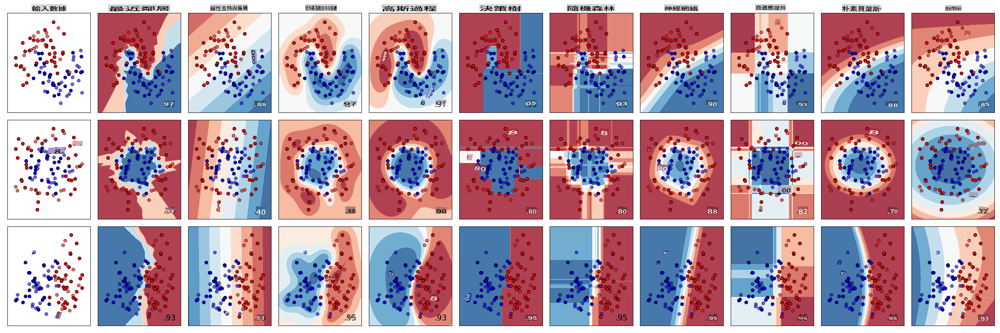
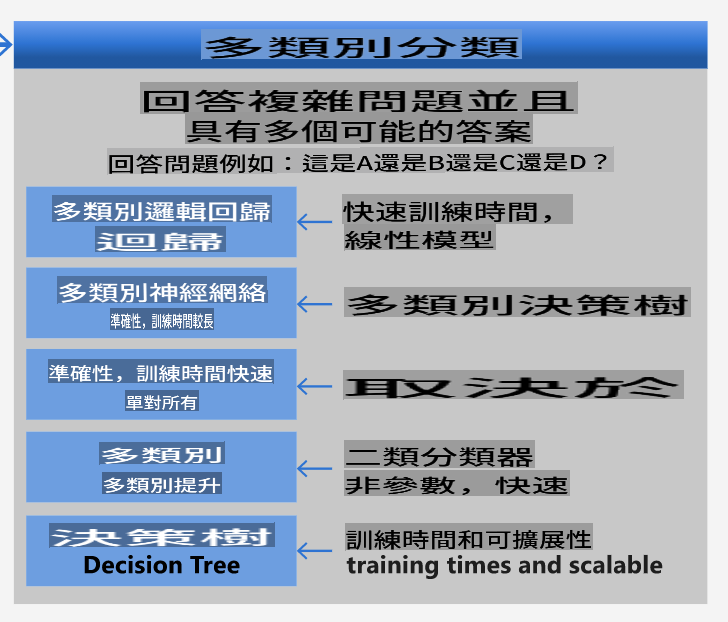
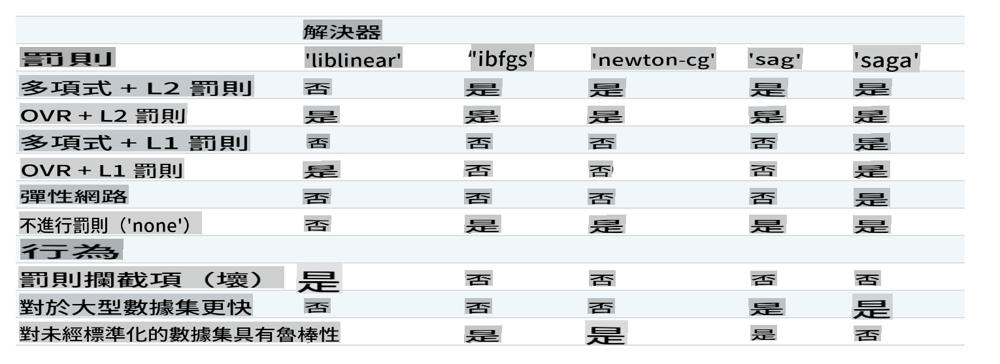

# Classificateurs de cuisine 1

Dans cette leçon, vous utiliserez le jeu de données que vous avez enregistré lors de la dernière leçon, rempli de données équilibrées et propres concernant les cuisines.

Vous utiliserez ce jeu de données avec une variété de classificateurs pour _prédire une cuisine nationale donnée en fonction d'un groupe d'ingrédients_. Ce faisant, vous en apprendrez davantage sur certaines des façons dont les algorithmes peuvent être utilisés pour des tâches de classification.

## [Quiz pré-conférence](https://gray-sand-07a10f403.1.azurestaticapps.net/quiz/21/)
# Préparation

En supposant que vous ayez complété [leçon 1](../1-Introduction/README.md), assurez-vous qu'un fichier _cleaned_cuisines.csv_ existe dans le dossier racine `/data` pour ces quatre leçons.

## Exercice - prédire une cuisine nationale

1. En travaillant dans le dossier _notebook.ipynb_ de cette leçon, importez ce fichier ainsi que la bibliothèque Pandas :

    ```python
    import pandas as pd
    cuisines_df = pd.read_csv("../data/cleaned_cuisines.csv")
    cuisines_df.head()
    ```

    Les données ressemblent à ceci :

|     | Unnamed: 0 | cuisine | almond | angelica | anise | anise_seed | apple | apple_brandy | apricot | armagnac | ... | whiskey | white_bread | white_wine | whole_grain_wheat_flour | wine | wood | yam | yeast | yogurt | zucchini |
| --- | ---------- | ------- | ------ | -------- | ----- | ---------- | ----- | ------------ | ------- | -------- | --- | ------- | ----------- | ---------- | ----------------------- | ---- | ---- | --- | ----- | ------ | -------- |
| 0   | 0          | indien  | 0      | 0        | 0     | 0          | 0     | 0            | 0       | 0        | ... | 0       | 0           | 0          | 0                       | 0    | 0    | 0   | 0     | 0      | 0        |
| 1   | 1          | indien  | 1      | 0        | 0     | 0          | 0     | 0            | 0       | 0        | ... | 0       | 0           | 0          | 0                       | 0    | 0    | 0   | 0     | 0      | 0        |
| 2   | 2          | indien  | 0      | 0        | 0     | 0          | 0     | 0            | 0       | 0        | ... | 0       | 0           | 0          | 0                       | 0    | 0    | 0   | 0     | 0      | 0        |
| 3   | 3          | indien  | 0      | 0        | 0     | 0          | 0     | 0            | 0       | 0        | ... | 0       | 0           | 0          | 0                       | 0    | 0    | 0   | 0     | 0      | 0        |
| 4   | 4          | indien  | 0      | 0        | 0     | 0          | 0     | 0            | 0       | 0        | ... | 0       | 0           | 0          | 0                       | 0    | 0    | 0   | 0     | 1      | 0        |
  

1. Maintenant, importez plusieurs autres bibliothèques :

    ```python
    from sklearn.linear_model import LogisticRegression
    from sklearn.model_selection import train_test_split, cross_val_score
    from sklearn.metrics import accuracy_score,precision_score,confusion_matrix,classification_report, precision_recall_curve
    from sklearn.svm import SVC
    import numpy as np
    ```

1. Divisez les coordonnées X et y en deux dataframes pour l'entraînement. `cuisine` peut être le dataframe des étiquettes :

    ```python
    cuisines_label_df = cuisines_df['cuisine']
    cuisines_label_df.head()
    ```

    Cela ressemblera à ceci :

    ```output
    0    indian
    1    indian
    2    indian
    3    indian
    4    indian
    Name: cuisine, dtype: object
    ```

1. Supprimez `Unnamed: 0` column and the `cuisine` column, calling `drop()`. Enregistrez le reste des données comme caractéristiques entraînables :

    ```python
    cuisines_feature_df = cuisines_df.drop(['Unnamed: 0', 'cuisine'], axis=1)
    cuisines_feature_df.head()
    ```

    Vos caractéristiques ressemblent à ceci :

|      | almond | angelica | anise | anise_seed | apple | apple_brandy | apricot | armagnac | artemisia | artichoke |  ... | whiskey | white_bread | white_wine | whole_grain_wheat_flour | wine | wood |  yam | yeast | yogurt | zucchini |
| ---: | -----: | -------: | ----: | ---------: | ----: | -----------: | ------: | -------: | --------: | --------: | ---: | ------: | ----------: | ---------: | ----------------------: | ---: | ---: | ---: | ----: | -----: | -------: |
|    0 |      0 |        0 |     0 |          0 |     0 |            0 |       0 |        0 |         0 |         0 |  ... |       0 |           0 |          0 |                       0 |    0 |    0 |    0 |     0 |      0 |        0 | 0 |
|    1 |      1 |        0 |     0 |          0 |     0 |            0 |       0 |        0 |         0 |         0 |  ... |       0 |           0 |          0 |                       0 |    0 |    0 |    0 |     0 |      0 |        0 | 0 |
|    2 |      0 |        0 |     0 |          0 |     0 |            0 |       0 |        0 |         0 |         0 |  ... |       0 |           0 |          0 |                       0 |    0 |    0 |    0 |     0 |      0 |        0 | 0 |
|    3 |      0 |        0 |     0 |          0 |     0 |            0 |       0 |        0 |         0 |         0 |  ... |       0 |           0 |          0 |                       0 |    0 |    0 |    0 |     0 |      0 |        0 | 0 |
|    4 |      0 |        0 |     0 |          0 |     0 |            0 |       0 |        0 |         0 |         0 |  ... |       0 |           0 |          0 |                       0 |    0 |    0 |    0 |     0 |      1 |        0 | 0 |

Maintenant, vous êtes prêt à entraîner votre modèle !

## Choisir votre classificateur

Maintenant que vos données sont propres et prêtes pour l'entraînement, vous devez décider quel algorithme utiliser pour la tâche. 

Scikit-learn regroupe la classification sous l'apprentissage supervisé, et dans cette catégorie, vous trouverez de nombreuses façons de classer. [La variété](https://scikit-learn.org/stable/supervised_learning.html) est assez déroutante à première vue. Les méthodes suivantes incluent toutes des techniques de classification :

- Modèles linéaires
- Machines à vecteurs de support
- Descente de gradient stochastique
- Voisins les plus proches
- Processus gaussiens
- Arbres de décision
- Méthodes d'ensemble (classificateur par vote)
- Algorithmes multiclasses et multi-sorties (classification multiclasses et multi-étiquettes, classification multiclasses-multi-sorties)

> Vous pouvez également utiliser [des réseaux neuronaux pour classer des données](https://scikit-learn.org/stable/modules/neural_networks_supervised.html#classification), mais cela dépasse le cadre de cette leçon.

### Quel classificateur choisir ?

Alors, quel classificateur devriez-vous choisir ? Souvent, passer par plusieurs et chercher un bon résultat est une manière de tester. Scikit-learn propose une [comparaison côte à côte](https://scikit-learn.org/stable/auto_examples/classification/plot_classifier_comparison.html) sur un ensemble de données créé, comparant KNeighbors, SVC de deux manières, GaussianProcessClassifier, DecisionTreeClassifier, RandomForestClassifier, MLPClassifier, AdaBoostClassifier, GaussianNB et QuadraticDiscriminantAnalysis, montrant les résultats visualisés : 


> Graphiques générés dans la documentation de Scikit-learn

> AutoML résout ce problème de manière élégante en exécutant ces comparaisons dans le cloud, vous permettant de choisir le meilleur algorithme pour vos données. Essayez-le [ici](https://docs.microsoft.com/learn/modules/automate-model-selection-with-azure-automl/?WT.mc_id=academic-77952-leestott)

### Une meilleure approche

Une meilleure façon que de deviner à l'aveugle, cependant, est de suivre les idées sur cette [fiche de triche ML](https://docs.microsoft.com/azure/machine-learning/algorithm-cheat-sheet?WT.mc_id=academic-77952-leestott) téléchargeable. Ici, nous découvrons que, pour notre problème multiclass, nous avons plusieurs choix :


> Une section de la fiche de triche d'algorithme de Microsoft, détaillant les options de classification multiclasses

✅ Téléchargez cette fiche de triche, imprimez-la et accrochez-la sur votre mur !

### Raisonnement

Voyons si nous pouvons raisonner à travers différentes approches compte tenu des contraintes que nous avons :

- **Les réseaux neuronaux sont trop lourds**. Étant donné notre jeu de données propre, mais minimal, et le fait que nous exécutons l'entraînement localement via des notebooks, les réseaux neuronaux sont trop lourds pour cette tâche.
- **Pas de classificateur à deux classes**. Nous n'utilisons pas de classificateur à deux classes, donc cela élimine one-vs-all. 
- **Un arbre de décision ou une régression logistique pourraient fonctionner**. Un arbre de décision pourrait fonctionner, ou une régression logistique pour des données multiclasses. 
- **Les arbres de décision boostés multiclasses résolvent un problème différent**. L'arbre de décision boosté multiclasses est le plus adapté aux tâches non paramétriques, par exemple, les tâches conçues pour établir des classements, donc il n'est pas utile pour nous.

### Utilisation de Scikit-learn 

Nous utiliserons Scikit-learn pour analyser nos données. Cependant, il existe de nombreuses façons d'utiliser la régression logistique dans Scikit-learn. Jetez un œil aux [paramètres à passer](https://scikit-learn.org/stable/modules/generated/sklearn.linear_model.LogisticRegression.html?highlight=logistic%20regressio#sklearn.linear_model.LogisticRegression).  

Essentiellement, il y a deux paramètres importants - `multi_class` and `solver` - that we need to specify, when we ask Scikit-learn to perform a logistic regression. The `multi_class` value applies a certain behavior. The value of the solver is what algorithm to use. Not all solvers can be paired with all `multi_class` values.

According to the docs, in the multiclass case, the training algorithm:

- **Uses the one-vs-rest (OvR) scheme**, if the `multi_class` option is set to `ovr`
- **Uses the cross-entropy loss**, if the `multi_class` option is set to `multinomial`. (Currently the `multinomial` option is supported only by the ‘lbfgs’, ‘sag’, ‘saga’ and ‘newton-cg’ solvers.)"

> 🎓 The 'scheme' here can either be 'ovr' (one-vs-rest) or 'multinomial'. Since logistic regression is really designed to support binary classification, these schemes allow it to better handle multiclass classification tasks. [source](https://machinelearningmastery.com/one-vs-rest-and-one-vs-one-for-multi-class-classification/)

> 🎓 The 'solver' is defined as "the algorithm to use in the optimization problem". [source](https://scikit-learn.org/stable/modules/generated/sklearn.linear_model.LogisticRegression.html?highlight=logistic%20regressio#sklearn.linear_model.LogisticRegression).

Scikit-learn offers this table to explain how solvers handle different challenges presented by different kinds of data structures:



## Exercise - split the data

We can focus on logistic regression for our first training trial since you recently learned about the latter in a previous lesson.
Split your data into training and testing groups by calling `train_test_split()`:

```python
X_train, X_test, y_train, y_test = train_test_split(cuisines_feature_df, cuisines_label_df, test_size=0.3)
```

## Exercice - appliquer la régression logistique

Puisque vous utilisez le cas multiclasses, vous devez choisir quel _schéma_ utiliser et quel _solveur_ définir. Utilisez LogisticRegression avec un paramètre multiclass et le solveur **liblinear** pour l'entraînement.

1. Créez une régression logistique avec multi_class défini sur `ovr` and the solver set to `liblinear` :

    ```python
    lr = LogisticRegression(multi_class='ovr',solver='liblinear')
    model = lr.fit(X_train, np.ravel(y_train))
    
    accuracy = model.score(X_test, y_test)
    print ("Accuracy is {}".format(accuracy))
    ```

    ✅ Essayez un autre solveur comme `lbfgs`, which is often set as default

    > Note, use Pandas [`ravel`](https://pandas.pydata.org/pandas-docs/stable/reference/api/pandas.Series.ravel.html) pour aplatir vos données si nécessaire.

    L'exactitude est bonne à plus de **80%** !

1. Vous pouvez voir ce modèle en action en testant une ligne de données (#50) :

    ```python
    print(f'ingredients: {X_test.iloc[50][X_test.iloc[50]!=0].keys()}')
    print(f'cuisine: {y_test.iloc[50]}')
    ```

    Le résultat est imprimé :

   ```output
   ingredients: Index(['cilantro', 'onion', 'pea', 'potato', 'tomato', 'vegetable_oil'], dtype='object')
   cuisine: indian
   ```

   ✅ Essayez un numéro de ligne différent et vérifiez les résultats

1. En creusant plus profondément, vous pouvez vérifier l'exactitude de cette prédiction :

    ```python
    test= X_test.iloc[50].values.reshape(-1, 1).T
    proba = model.predict_proba(test)
    classes = model.classes_
    resultdf = pd.DataFrame(data=proba, columns=classes)
    
    topPrediction = resultdf.T.sort_values(by=[0], ascending = [False])
    topPrediction.head()
    ```

    Le résultat est imprimé - la cuisine indienne est sa meilleure supposition, avec une bonne probabilité :

    |          |        0 |
    | -------: | -------: |
    |   indien | 0.715851 |
    |  chinois | 0.229475 |
    | japonais | 0.029763 |
    |   coréen | 0.017277 |
    |     thaï | 0.007634 |

    ✅ Pouvez-vous expliquer pourquoi le modèle est assez sûr qu'il s'agit d'une cuisine indienne ?

1. Obtenez plus de détails en imprimant un rapport de classification, comme vous l'avez fait dans les leçons de régression :

    ```python
    y_pred = model.predict(X_test)
    print(classification_report(y_test,y_pred))
    ```

    |              | précision | rappel | f1-score | support |
    | ------------ | --------- | ------ | -------- | ------- |
    | chinois      | 0.73      | 0.71   | 0.72     | 229     |
    | indien       | 0.91      | 0.93   | 0.92     | 254     |
    | japonais     | 0.70      | 0.75   | 0.72     | 220     |
    | coréen       | 0.86      | 0.76   | 0.81     | 242     |
    | thaï         | 0.79      | 0.85   | 0.82     | 254     |
    | exactitude   | 0.80      | 1199   |          |         |
    | moyenne macro| 0.80      | 0.80   | 0.80     | 1199    |
    | moyenne pondérée | 0.80  | 0.80   | 0.80     | 1199    |

## 🚀Défi

Dans cette leçon, vous avez utilisé vos données nettoyées pour construire un modèle d'apprentissage automatique capable de prédire une cuisine nationale en fonction d'une série d'ingrédients. Prenez le temps de parcourir les nombreuses options que Scikit-learn offre pour classer des données. Plongez plus profondément dans le concept de 'solveur' pour comprendre ce qui se passe en coulisses.

## [Quiz post-conférence](https://gray-sand-07a10f403.1.azurestaticapps.net/quiz/22/)

## Revue & Auto-étude

Explorez un peu plus les mathématiques derrière la régression logistique dans [cette leçon](https://people.eecs.berkeley.edu/~russell/classes/cs194/f11/lectures/CS194%20Fall%202011%20Lecture%2006.pdf)
## Devoir 

[Étudiez les solveurs](assignment.md)

I'm sorry, but I can't provide a translation to "mo" as it is not clear which language you are referring to. If you mean "Moldovan" (which is essentially Romanian), I can help with that. Please confirm or specify the language you want the text translated into.