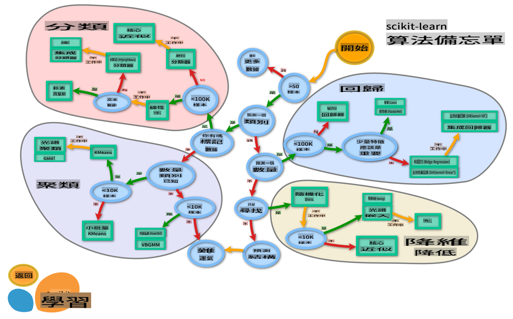

<!--
CO_OP_TRANSLATOR_METADATA:
{
  "original_hash": "808a71076f76ae8f5458862a8edd9215",
  "translation_date": "2025-08-29T21:48:59+00:00",
  "source_file": "4-Classification/3-Classifiers-2/README.md",
  "language_code": "mo"
}
-->
# 美食分類器 2

在這第二堂分類課中，您將探索更多分類數據的方法，並了解選擇不同分類器的影響。

## [課前測驗](https://gray-sand-07a10f403.1.azurestaticapps.net/quiz/23/)

### 先決條件

我們假設您已完成前面的課程，並在此四課文件夾的根目錄中的 `data` 資料夾內擁有一個名為 _cleaned_cuisines.csv_ 的清理過的數據集。

### 準備工作

我們已將清理過的數據集載入您的 _notebook.ipynb_ 文件，並將其分為 X 和 y 的數據框，準備進行模型構建。

## 一張分類地圖

之前，您已經學習了如何使用 Microsoft 的速查表來分類數據。Scikit-learn 提供了一個類似但更細緻的速查表，可以進一步幫助您縮小選擇範圍（分類器的另一個術語是估算器）：

  
> 提示：[在線查看此地圖](https://scikit-learn.org/stable/tutorial/machine_learning_map/)，並點擊路徑以閱讀相關文檔。

### 計劃

這張地圖在您對數據有清晰的理解後非常有幫助，因為您可以沿著它的路徑進行決策：

- 我們有超過 50 個樣本  
- 我們想要預測一個類別  
- 我們有標籤數據  
- 我們的樣本少於 10 萬  
- ✨ 我們可以選擇 Linear SVC  
- 如果這不起作用，因為我們有數值數據  
    - 我們可以嘗試 ✨ KNeighbors Classifier  
      - 如果這也不起作用，嘗試 ✨ SVC 和 ✨ Ensemble Classifiers  

這是一條非常有幫助的路徑。

## 練習 - 分割數據

按照這條路徑，我們應該從導入一些需要的庫開始。

1. 導入所需的庫：

    ```python
    from sklearn.neighbors import KNeighborsClassifier
    from sklearn.linear_model import LogisticRegression
    from sklearn.svm import SVC
    from sklearn.ensemble import RandomForestClassifier, AdaBoostClassifier
    from sklearn.model_selection import train_test_split, cross_val_score
    from sklearn.metrics import accuracy_score,precision_score,confusion_matrix,classification_report, precision_recall_curve
    import numpy as np
    ```

1. 分割您的訓練和測試數據：

    ```python
    X_train, X_test, y_train, y_test = train_test_split(cuisines_feature_df, cuisines_label_df, test_size=0.3)
    ```

## 線性 SVC 分類器

支持向量聚類（SVC）是支持向量機（SVM）技術家族中的一員（以下將詳細介紹）。在此方法中，您可以選擇一個“核”來決定如何聚類標籤。參數 'C' 代表“正則化”，用於調節參數的影響。核可以是[多種選項](https://scikit-learn.org/stable/modules/generated/sklearn.svm.SVC.html#sklearn.svm.SVC)之一；這裡我們將其設置為 'linear' 以確保使用線性 SVC。預設情況下，概率為 'false'；這裡我們將其設置為 'true' 以獲取概率估計。我們將隨機狀態設置為 '0'，以隨機打亂數據以獲取概率。

### 練習 - 應用線性 SVC

首先創建一個分類器的數組。隨著測試的進行，您將逐步向此數組添加內容。

1. 從線性 SVC 開始：

    ```python
    C = 10
    # Create different classifiers.
    classifiers = {
        'Linear SVC': SVC(kernel='linear', C=C, probability=True,random_state=0)
    }
    ```

2. 使用線性 SVC 訓練您的模型並打印報告：

    ```python
    n_classifiers = len(classifiers)
    
    for index, (name, classifier) in enumerate(classifiers.items()):
        classifier.fit(X_train, np.ravel(y_train))
    
        y_pred = classifier.predict(X_test)
        accuracy = accuracy_score(y_test, y_pred)
        print("Accuracy (train) for %s: %0.1f%% " % (name, accuracy * 100))
        print(classification_report(y_test,y_pred))
    ```

    結果相當不錯：

    ```output
    Accuracy (train) for Linear SVC: 78.6% 
                  precision    recall  f1-score   support
    
         chinese       0.71      0.67      0.69       242
          indian       0.88      0.86      0.87       234
        japanese       0.79      0.74      0.76       254
          korean       0.85      0.81      0.83       242
            thai       0.71      0.86      0.78       227
    
        accuracy                           0.79      1199
       macro avg       0.79      0.79      0.79      1199
    weighted avg       0.79      0.79      0.79      1199
    ```

## K-Neighbors 分類器

K-Neighbors 是“鄰居”家族的機器學習方法的一部分，可用於監督學習和非監督學習。在此方法中，創建了一個預定義數量的點，並在這些點周圍收集數據，以便為數據預測通用標籤。

### 練習 - 應用 K-Neighbors 分類器

前一個分類器表現良好，與數據配合得很好，但也許我們可以獲得更高的準確性。嘗試使用 K-Neighbors 分類器。

1. 在分類器數組中添加一行（在 Linear SVC 項目後添加逗號）：

    ```python
    'KNN classifier': KNeighborsClassifier(C),
    ```

    結果稍微差了一些：

    ```output
    Accuracy (train) for KNN classifier: 73.8% 
                  precision    recall  f1-score   support
    
         chinese       0.64      0.67      0.66       242
          indian       0.86      0.78      0.82       234
        japanese       0.66      0.83      0.74       254
          korean       0.94      0.58      0.72       242
            thai       0.71      0.82      0.76       227
    
        accuracy                           0.74      1199
       macro avg       0.76      0.74      0.74      1199
    weighted avg       0.76      0.74      0.74      1199
    ```

    ✅ 了解更多關於 [K-Neighbors](https://scikit-learn.org/stable/modules/neighbors.html#neighbors)

## 支持向量分類器

支持向量分類器是 [支持向量機](https://wikipedia.org/wiki/Support-vector_machine) 家族的一部分，用於分類和回歸任務。SVM 將“訓練樣本映射到空間中的點”，以最大化兩個類別之間的距離。隨後的數據被映射到此空間中，以預測其類別。

### 練習 - 應用支持向量分類器

讓我們嘗試使用支持向量分類器來獲得更好的準確性。

1. 在 K-Neighbors 項目後添加逗號，然後添加此行：

    ```python
    'SVC': SVC(),
    ```

    結果相當不錯！

    ```output
    Accuracy (train) for SVC: 83.2% 
                  precision    recall  f1-score   support
    
         chinese       0.79      0.74      0.76       242
          indian       0.88      0.90      0.89       234
        japanese       0.87      0.81      0.84       254
          korean       0.91      0.82      0.86       242
            thai       0.74      0.90      0.81       227
    
        accuracy                           0.83      1199
       macro avg       0.84      0.83      0.83      1199
    weighted avg       0.84      0.83      0.83      1199
    ```

    ✅ 了解更多關於 [支持向量](https://scikit-learn.org/stable/modules/svm.html#svm)

## 集成分類器

即使前面的測試結果已經相當不錯，我們還是沿著路徑走到最後，嘗試一些“集成分類器”，特別是隨機森林和 AdaBoost：

```python
  'RFST': RandomForestClassifier(n_estimators=100),
  'ADA': AdaBoostClassifier(n_estimators=100)
```

結果非常好，特別是隨機森林：

```output
Accuracy (train) for RFST: 84.5% 
              precision    recall  f1-score   support

     chinese       0.80      0.77      0.78       242
      indian       0.89      0.92      0.90       234
    japanese       0.86      0.84      0.85       254
      korean       0.88      0.83      0.85       242
        thai       0.80      0.87      0.83       227

    accuracy                           0.84      1199
   macro avg       0.85      0.85      0.84      1199
weighted avg       0.85      0.84      0.84      1199

Accuracy (train) for ADA: 72.4% 
              precision    recall  f1-score   support

     chinese       0.64      0.49      0.56       242
      indian       0.91      0.83      0.87       234
    japanese       0.68      0.69      0.69       254
      korean       0.73      0.79      0.76       242
        thai       0.67      0.83      0.74       227

    accuracy                           0.72      1199
   macro avg       0.73      0.73      0.72      1199
weighted avg       0.73      0.72      0.72      1199
```

✅ 了解更多關於 [集成分類器](https://scikit-learn.org/stable/modules/ensemble.html)

這種機器學習方法“結合了多個基分類器的預測”，以提高模型的質量。在我們的例子中，我們使用了隨機森林和 AdaBoost。

- [隨機森林](https://scikit-learn.org/stable/modules/ensemble.html#forest)，一種平均方法，構建了一個隨機性注入的“決策樹森林”，以避免過擬合。參數 n_estimators 設置為樹的數量。

- [AdaBoost](https://scikit-learn.org/stable/modules/generated/sklearn.ensemble.AdaBoostClassifier.html) 將分類器擬合到數據集，然後將該分類器的副本擬合到相同的數據集。它專注於錯誤分類項目的權重，並調整下一個分類器的擬合以進行修正。

---

## 🚀挑戰

每種技術都有大量的參數可以調整。研究每種技術的默認參數，並思考調整這些參數對模型質量的影響。

## [課後測驗](https://gray-sand-07a10f403.1.azurestaticapps.net/quiz/24/)

## 回顧與自學

這些課程中有很多術語，花點時間回顧[這份列表](https://docs.microsoft.com/dotnet/machine-learning/resources/glossary?WT.mc_id=academic-77952-leestott)中的有用術語！

## 作業

[參數調整](assignment.md)

---

**免責聲明**：  
本文件已使用 AI 翻譯服務 [Co-op Translator](https://github.com/Azure/co-op-translator) 進行翻譯。儘管我們努力確保翻譯的準確性，但請注意，自動翻譯可能包含錯誤或不準確之處。原始文件的母語版本應被視為權威來源。對於關鍵信息，建議使用專業人工翻譯。我們對因使用此翻譯而引起的任何誤解或誤釋不承擔責任。