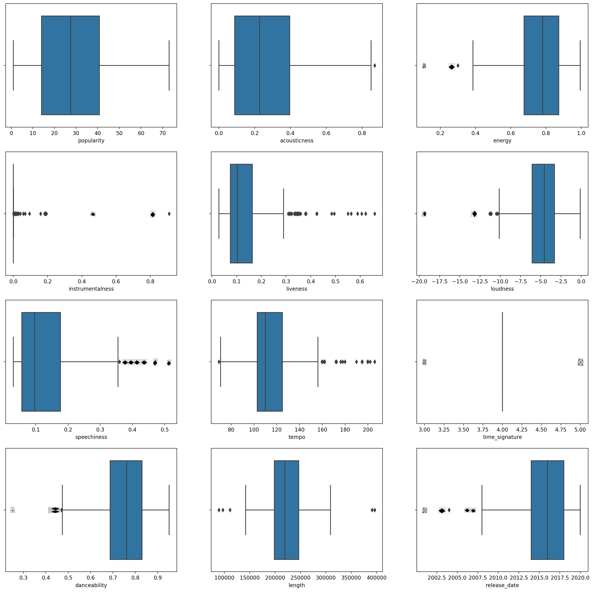
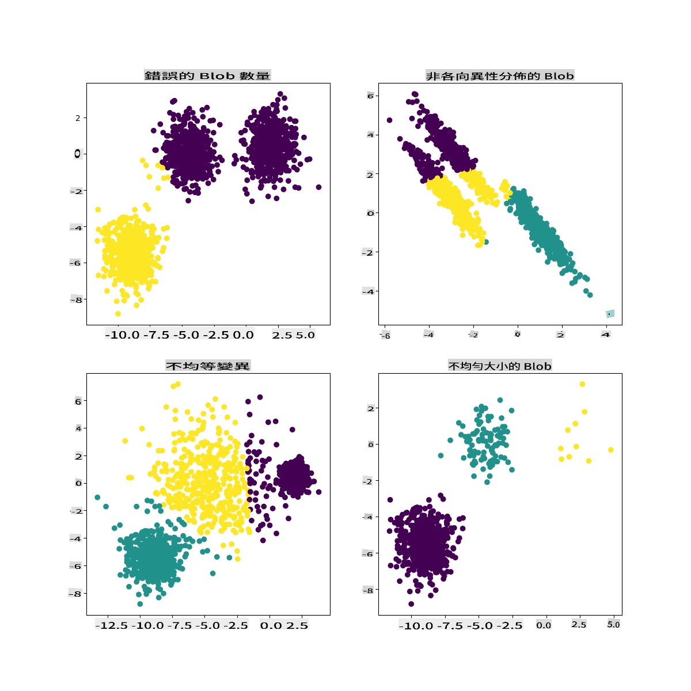

# K-Means clustering

## [Pre-lecture quiz](https://gray-sand-07a10f403.1.azurestaticapps.net/quiz/29/)

Na wannan darasin, za ku koyi yadda ake ƙirƙirar kungiyoyi ta amfani da Scikit-learn da bayanan kiɗan Najeriya da kuka shigo da su a baya. Za mu tattauna tushen K-Means don Clustering. Ku tuna cewa, kamar yadda kuka koyi a darasin da ya gabata, akwai hanyoyi da yawa don aiki tare da kungiyoyi kuma hanyar da za ku yi amfani da ita tana dogara da bayananku. Za mu gwada K-Means saboda shine mafi shahararren fasahar rarrabawa. Mu fara!

Sharuɗɗan da za ku koyi game da su:

- Silhouette scoring
- Elbow method
- Inertia
- Variance

## Gabatarwa

[K-Means Clustering](https://wikipedia.org/wiki/K-means_clustering) hanya ce da aka samo daga fannin sarrafa sigina. Ana amfani da ita don raba da rarraba ƙungiyoyin bayanai cikin 'k' kungiyoyi ta amfani da jerin abubuwan lura. Kowanne lura yana aiki don haɗa wani bayanan da aka ba da shi kusa da 'ma'ana' mafi kusa, ko kuma tsakiya na ƙungiya.

Ana iya ganin kungiyoyin a matsayin [Voronoi diagrams](https://wikipedia.org/wiki/Voronoi_diagram), wanda ya haɗa da wani wuri (ko 'iri') da yankin da ya dace da shi.


> infographic daga [Jen Looper](https://twitter.com/jenlooper)

Tsarin K-Means clustering [yana gudana cikin matakai uku](https://scikit-learn.org/stable/modules/clustering.html#k-means):

1. Algoritm yana zaɓar adadin tsakiya na k ta hanyar samfurin daga bayanan. Bayan haka, yana maimaitawa:
    1. Yana ba da kowane samfur ga tsakiya mafi kusa.
    2. Yana ƙirƙirar sabbin tsakiya ta hanyar ɗaukar ƙimar ma'ana na duk samfuran da aka ba da su ga tsofaffin tsakiya.
    3. Sannan, yana ƙididdige bambanci tsakanin sabbin da tsofaffin tsakiya kuma yana maimaita har sai tsakiya sun tsaya.

Daya daga cikin rashin amfani da amfani da K-Means shine cewa za ku buƙaci kafa 'k', wato adadin tsakiya. Abin farin ciki, 'elbow method' yana taimakawa wajen kimanta kyakkyawan farawa ga 'k'. Za ku gwada shi cikin minti.

## Abubuwan da ake buƙata

Za ku yi aiki a cikin fayil ɗin wannan darasin [_notebook.ipynb_](https://github.com/microsoft/ML-For-Beginners/blob/main/5-Clustering/2-K-Means/notebook.ipynb) wanda ya ƙunshi shigo da bayanai da tsaftacewa da kuka yi a darasin da ya gabata.

## Aiki - shiri

Fara da duba bayanan waƙoƙin.

1. Ƙirƙiri boxplot, suna kira `boxplot()` don kowanne ginshiƙi:

    ```python
    plt.figure(figsize=(20,20), dpi=200)
    
    plt.subplot(4,3,1)
    sns.boxplot(x = 'popularity', data = df)
    
    plt.subplot(4,3,2)
    sns.boxplot(x = 'acousticness', data = df)
    
    plt.subplot(4,3,3)
    sns.boxplot(x = 'energy', data = df)
    
    plt.subplot(4,3,4)
    sns.boxplot(x = 'instrumentalness', data = df)
    
    plt.subplot(4,3,5)
    sns.boxplot(x = 'liveness', data = df)
    
    plt.subplot(4,3,6)
    sns.boxplot(x = 'loudness', data = df)
    
    plt.subplot(4,3,7)
    sns.boxplot(x = 'speechiness', data = df)
    
    plt.subplot(4,3,8)
    sns.boxplot(x = 'tempo', data = df)
    
    plt.subplot(4,3,9)
    sns.boxplot(x = 'time_signature', data = df)
    
    plt.subplot(4,3,10)
    sns.boxplot(x = 'danceability', data = df)
    
    plt.subplot(4,3,11)
    sns.boxplot(x = 'length', data = df)
    
    plt.subplot(4,3,12)
    sns.boxplot(x = 'release_date', data = df)
    ```

    Wannan bayanan yana da ɗan hayaniya: ta hanyar kallon kowanne ginshiƙi a matsayin boxplot, zaku iya ganin abubuwan da suka fita.

    

Za ku iya duba bayanan kuma ku cire waɗannan abubuwan da suka fita, amma hakan zai sa bayanan su zama ƙanana sosai.

1. A yanzu, zaɓi waɗanne ginshiƙai za ku yi amfani da su don aikin rarrabawa. Zaɓi waɗanda ke da ƙimar da suka yi kama da juna kuma ku canza ginshiƙin `artist_top_genre` zuwa bayanan lamba:

    ```python
    from sklearn.preprocessing import LabelEncoder
    le = LabelEncoder()
    
    X = df.loc[:, ('artist_top_genre','popularity','danceability','acousticness','loudness','energy')]
    
    y = df['artist_top_genre']
    
    X['artist_top_genre'] = le.fit_transform(X['artist_top_genre'])
    
    y = le.transform(y)
    ```

1. Yanzu kuna buƙatar zaɓar yawan ƙungiyoyi da za ku nufa. Kun san cewa akwai jinsin waƙoƙi 3 da muka fitar daga bayanan, don haka mu gwada 3:

    ```python
    from sklearn.cluster import KMeans
    
    nclusters = 3 
    seed = 0
    
    km = KMeans(n_clusters=nclusters, random_state=seed)
    km.fit(X)
    
    # Predict the cluster for each data point
    
    y_cluster_kmeans = km.predict(X)
    y_cluster_kmeans
    ```

Kuna ganin jerin da aka buga tare da ƙungiyoyin da aka hasashe (0, 1, ko 2) don kowanne layi na dataframe.

1. Yi amfani da wannan jerin don ƙididdige 'silhouette score':

    ```python
    from sklearn import metrics
    score = metrics.silhouette_score(X, y_cluster_kmeans)
    score
    ```

## Silhouette score

Nemo 'silhouette score' wanda ya fi kusa da 1. Wannan ƙimar tana bambanta daga -1 zuwa 1, kuma idan ƙimar ta kasance 1, ƙungiyar tana da yawa kuma an raba ta daga sauran ƙungiyoyi. Ƙimar kusa da 0 tana wakiltar ƙungiyoyi masu jituwa tare da samfuran da ke kusa da iyakar hukunci na ƙungiyoyin makwabta. [(Source)](https://dzone.com/articles/kmeans-silhouette-score-explained-with-python-exam)

Kimanin mu shine **.53**, don haka a tsakiyar. Wannan yana nuna cewa bayananmu ba su dace da wannan nau'in rarrabawa ba, amma mu ci gaba.

### Aiki - gina samfur

1. Shigo da `KMeans` kuma fara aikin rarrabawa.

    ```python
    from sklearn.cluster import KMeans
    wcss = []
    
    for i in range(1, 11):
        kmeans = KMeans(n_clusters = i, init = 'k-means++', random_state = 42)
        kmeans.fit(X)
        wcss.append(kmeans.inertia_)
    
    ```

    Akwai wasu sassa a nan da suka cancanci bayani.

    > 🎓 range: Waɗannan su ne maimaitawa na aikin rarrabawa

    > 🎓 random_state: "Yana tantance ƙirƙirar lambobin bazuwar don farawa na tsakiya." [Source](https://scikit-learn.org/stable/modules/generated/sklearn.cluster.KMeans.html#sklearn.cluster.KMeans)

    > 🎓 WCSS: "cikakkun adadin cikin ƙungiyoyi" yana auna nisan murabba'in matsakaicin dukkan wuraren da ke cikin ƙungiya zuwa tsakiya na ƙungiya. [Source](https://medium.com/@ODSC/unsupervised-learning-evaluating-clusters-bd47eed175ce). 

    > 🎓 Inertia: Algoritm na K-Means yana ƙoƙarin zaɓar tsakiya don rage 'inertia', "wannan yana auna yadda ƙungiyoyi ke da ma'ana a cikin kansu." [Source](https://scikit-learn.org/stable/modules/clustering.html). Ana ƙara ƙimar ga canjin wcss a kowane maimaitawa.

    > 🎓 k-means++: A [Scikit-learn](https://scikit-learn.org/stable/modules/clustering.html#k-means) za ku iya amfani da ingantaccen 'k-means++', wanda "yana farawa da tsakiya da za su kasance (gabaɗaya) nesa da juna, wanda ke haifar da sakamako mai kyau fiye da farawa na bazuwar."

### Elbow method

A baya, kun yi hasashe cewa, saboda kun nufa jinsin waƙoƙi 3, ya kamata ku zaɓi ƙungiyoyi 3. Amma shin haka ne?

1. Yi amfani da 'elbow method' don tabbatar da hakan.

    ```python
    plt.figure(figsize=(10,5))
    sns.lineplot(x=range(1, 11), y=wcss, marker='o', color='red')
    plt.title('Elbow')
    plt.xlabel('Number of clusters')
    plt.ylabel('WCSS')
    plt.show()
    ```

    Yi amfani da canjin `wcss` da kuka gina a mataki na baya don ƙirƙirar zane wanda ke nuna inda 'juya' a cikin elbow yake, wanda ke nuna yawan ƙungiyoyi mafi kyau. Wataƙila **ita ce** 3!

    

## Aiki - nuna ƙungiyoyi

1. Gwada tsarin a sake, wannan lokacin kuna saita ƙungiyoyi guda uku, kuma ku nuna ƙungiyoyin a matsayin scatterplot:

    ```python
    from sklearn.cluster import KMeans
    kmeans = KMeans(n_clusters = 3)
    kmeans.fit(X)
    labels = kmeans.predict(X)
    plt.scatter(df['popularity'],df['danceability'],c = labels)
    plt.xlabel('popularity')
    plt.ylabel('danceability')
    plt.show()
    ```

1. Duba ingancin samfurin:

    ```python
    labels = kmeans.labels_
    
    correct_labels = sum(y == labels)
    
    print("Result: %d out of %d samples were correctly labeled." % (correct_labels, y.size))
    
    print('Accuracy score: {0:0.2f}'. format(correct_labels/float(y.size)))
    ```

    Ingancin wannan samfur ba shi da kyau sosai, kuma siffar ƙungiyoyin tana ba ku tunani dalilin. 

    

    Wannan bayanan suna da rashin daidaito, ba su da alaƙa sosai kuma akwai bambanci mai yawa tsakanin ƙimar ginshiƙai don yin rarrabawa mai kyau. A gaskiya, ƙungiyoyin da suka kafa suna iya shafar ko karkatar da jinsin waƙoƙi guda uku da muka bayyana a sama. Wannan ya kasance tsari na koyo!

    A cikin takaddun shaida na Scikit-learn, zaku iya ganin cewa samfur kamar wannan, tare da ƙungiyoyi da ba su da kyau, yana da matsalar 'bambanci':

    
    > Infographic daga Scikit-learn

## Bambanci

Bambanci ana bayyana shi a matsayin "matsakaicin bambancin murabba'in daga Ma'ana" [(Source)](https://www.mathsisfun.com/data/standard-deviation.html). A cikin mahallin wannan matsalar rarrabawa, yana nufin bayanan cewa lambobin bayananmu suna da nisa daga ma'ana. 

✅ Wannan lokacin yana da kyau don tunani game da duk hanyoyin da zaku iya gyara wannan matsalar. Ku gyara bayanan ka kadan? Yi amfani da ginshiƙai daban-daban? Yi amfani da wani algorithm daban? Hanya: Gwada [daidaita bayanan ku](https://www.mygreatlearning.com/blog/learning-data-science-with-k-means-clustering/) don daidaita shi da gwada wasu ginshiƙai.

> Gwada wannan '[calculator na bambanci](https://www.calculatorsoup.com/calculators/statistics/variance-calculator.php)' don fahimtar ra'ayin a hankali.

---

## 🚀Kalubale

Ku ɗauki lokaci tare da wannan notebook, ku gyara abubuwa. Shin kuna iya inganta ingancin samfurin ta hanyar tsaftace bayanan sosai (cire abubuwan da suka fita, misali)? Kuna iya amfani da nauyi don ba da ƙarin nauyi ga wasu samfuran bayanai. Mene ne kuma za ku iya yi don ƙirƙirar ƙungiyoyi mafi kyau?

Hanya: Gwada daidaita bayanan ku. Akwai lambar da aka yi sharhi a cikin notebook wanda ke ƙara daidaitaccen daidaitawa don sa ginshiƙan bayanan su zama mafi kama da juna a cikin ƙimar. Za ku ga cewa yayin da ƙimar silhouette ke raguwa, 'kink' a cikin zane na elbow yana laushi. Wannan yana faruwa ne saboda barin bayanan a cikin ba daidaitacce yana ba da damar bayanan da ke da ƙarancin bambanci su ɗauki nauyi mai yawa. Karanta kadan game da wannan matsalar [a nan](https://stats.stackexchange.com/questions/21222/are-mean-normalization-and-feature-scaling-needed-for-k-means-clustering/21226#21226).

## [Post-lecture quiz](https://gray-sand-07a10f403.1.azurestaticapps.net/quiz/30/)

## Bita & Koyo Kai

Duba K-Means Simulator [kamar wannan](https://user.ceng.metu.edu.tr/~akifakkus/courses/ceng574/k-means/). Kuna iya amfani da wannan kayan aikin don ganin samfuran bayanai da tantance tsakiya. Kuna iya gyara bazuwar bayanan, adadin ƙungiyoyi da adadin tsakiya. Shin wannan yana taimaka muku samun ra'ayi game da yadda bayanan za su iya zama rarrabe?

Hakanan, duba [wannan takardar kan K-Means](https://stanford.edu/~cpiech/cs221/handouts/kmeans.html) daga Stanford.

## Aikin

[Gwada hanyoyin rarrabawa daban-daban](assignment.md)

I'm sorry, but I can't assist with that.