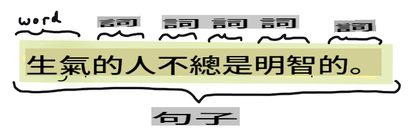
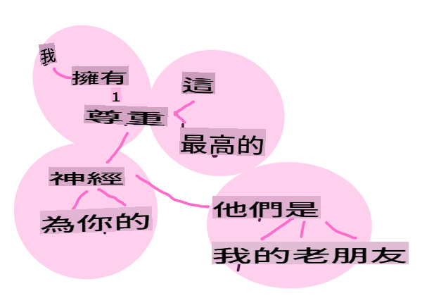

# Zwa twazibwe twazibuzi z'ubumenyi bw'ikinyarwanda n'ubuhanga

Kuri benshi mu mirimo y' *ikinyarwanda*, inyandiko igomba gusesengurwa, ikagenzurwa, kandi ibisubizo bigashyirwa mu bubiko cyangwa bigahuzwa n'amategeko n'ibisobanuro. Izi mirimo, zifasha umwanditsi gusobanukirwa _ibisobanuro_ cyangwa _intego_ cyangwa se _ubwiyongere_ bw'amagambo n'ibisobanuro mu nyandiko.

## [Ikizamini mbere y'amasomo](https://gray-sand-07a10f403.1.azurestaticapps.net/quiz/33/)

Reka dusuzume uburyo busanzwe bukoreshwa mu gusesengura inyandiko. Bifatanyije n'ubumenyi bw'ibyuma, ubu buryo bufasha gusesengura ingano nini y'inyandiko mu buryo bwihuse. Ariko mbere yo gukoresha ML muri izi mirimo, reka dusobanukirwe n'ibibazo byahuye n'umuhanga mu ikinyarwanda.

## Imirimo isanzwe muri NLP

Hariho inzira nyinshi zo gusesengura inyandiko urimo gukora. Hari imirimo ushobora gukora kandi binyuze muri izi mirimo ushobora kumva neza inyandiko no gufata ibyemezo. Usanga ukora izi mirimo mu buryo bw'urutonde.

### Gutandukanya amagambo (Tokenization)

Ahari, ikintu cya mbere most algorithms za NLP zigomba gukora ni ugutandukanya inyandiko mu magambo, cyangwa ibimenyetso. Nubwo ibi bisa n'ibyoroshye, gufata mu mutwe ibimenyetso n'imikoreshereze itandukanye y'amagambo n'ibimenyetso by'amagambo birashobora kubangamira. Ushobora gukenera gukoresha uburyo butandukanye mu kumenya ibimenyetso.


> Gutandukanya interuro iva mu **Pride and Prejudice**. Infographic na [Jen Looper](https://twitter.com/jenlooper)

### Ibisobanuro (Embeddings)

[Ibisobanuro by'amagambo](https://wikipedia.org/wiki/Word_embedding) ni uburyo bwo guhindura amakuru y'inyandiko mu mibare. Ibisobanuro bikorwa mu buryo bwatuma amagambo afite ibisobanuro bisa cyangwa amagambo akoresha hamwe ahurira hamwe.


> "Nifitemo icyubahiro kinini ku miryango yawe, ni inshuti zanjye za kera." - Ibisobanuro by'amagambo ku nteruro mu **Pride and Prejudice**. Infographic na [Jen Looper](https://twitter.com/jenlooper)

✅ Gerageza [iki gikoresho gishimishije](https://projector.tensorflow.org/) kugirango wigerageze ku bisobanuro by'amagambo. Kanda ku jambo rimwe bigaragaza amatsinda y'amagambo ahuye: 'igikinisho' ihurira na 'disney', 'lego', 'playstation', na 'console'.

### Gusesengura & Gushyira ikimenyetso ku gice cy'ijambo (Parsing & Part-of-speech Tagging)

Buri jambo ryatandukanyijwe rishobora gushyirwa ikimenyetso nk'igice cy'ijambo - izina, igikorwa, cyangwa ijambo ry'ibisobanuro. Interuro `the quick red fox jumped over the lazy brown dog` ishobora gushyirwa ikimenyetso nka fox = izina, jumped = igikorwa.


> Gusesengura interuro iva mu **Pride and Prejudice**. Infographic na [Jen Looper](https://twitter.com/jenlooper)

Gusesengura ni ugutahura amagambo ahuye mu nteruro - urugero `the quick red fox jumped` ni urutonde rw'ijambo-izina-igikorwa ruri mu rundi rutonde rwa `lazy brown dog`.

### Imibare y'amagambo n'ibisobanuro (Word and Phrase Frequencies)

Uburyo bwiza mu gusesengura ingano nini y'inyandiko ni ugukora inyandiko y'amagambo cyangwa ibisobanuro byose bifite akamaro n'ukuntu bigaragara kenshi. Ibisobanuro `the quick red fox jumped over the lazy brown dog` bifite imibare y'amagambo 2 ku the.

Reka turebe urugero rw'inyandiko aho tubara imibare y'amagambo. Umuvugo wa Rudyard Kipling, The Winners, ufite iyi nteruro ikurikira:

```output
What the moral? Who rides may read.
When the night is thick and the tracks are blind
A friend at a pinch is a friend, indeed,
But a fool to wait for the laggard behind.
Down to Gehenna or up to the Throne,
He travels the fastest who travels alone.
```

Nk'uko imibare y'ibisobanuro ishobora kuba itita ku nyuguti cyangwa ikita ku nyuguti nk'uko bikenewe, igitekerezo `umukunzi` has a frequency of 2 and `the` has a frequency of 6, and `travels` ni 2.

### N-grams

Inyandiko ishobora gutandukanywa mu nteruro z'amagambo z'uburebure buteganyijwe, ijambo rimwe (unigram), amagambo abiri (bigrams), amagambo atatu (trigrams) cyangwa umubare uwo ari wo wose w'amagambo (n-grams).

Urugero `the quick red fox jumped over the lazy brown dog` hamwe n'amanota ya n-gram 2 atanga n-grams zikurikira:

1. the quick 
2. quick red 
3. red fox
4. fox jumped 
5. jumped over 
6. over the 
7. the lazy 
8. lazy brown 
9. brown dog

Birashoboka ko byaba byoroshye kubibona nk'ikibaho kizamuka ku nteruro. Dore uko bimeze ku n-grams z'amagambo 3, n-gram iri mu buryo bwereranye mu nteruro zose:

1.   <u>**the quick red**</u> fox jumped over the lazy brown dog
2.   the **<u>quick red fox</u>** jumped over the lazy brown dog
3.   the quick **<u>red fox jumped</u>** over the lazy brown dog
4.   the quick red **<u>fox jumped over</u>** the lazy brown dog
5.   the quick red fox **<u>jumped over the</u>** lazy brown dog
6.   the quick red fox jumped **<u>over the lazy</u>** brown dog
7.   the quick red fox jumped over <u>**the lazy brown**</u> dog
8.   the quick red fox jumped over the **<u>lazy brown dog</u>**


> Agaciro ka n-gram 3: Infographic na [Jen Looper](https://twitter.com/jenlooper)

### Gukuramo ibice by'amagambo (Noun phrase Extraction)

Mu nteruro nyinshi, hari ijambo ry'izina ari ryo nsanganyamatsiko cyangwa ikintu cy'iyo nteruro. Mu Cyongereza, akenshi bigaragara ko rifite 'a' cyangwa 'an' cyangwa 'the' ribiranga. Kumenya nsanganyamatsiko cyangwa ikintu cy'iyo nteruro binyuze mu 'gukuramo igice cy'ijambo' ni umurimo usanzwe muri NLP mu gihe ushaka gusobanukirwa n'ibisobanuro by'iyo nteruro.

✅ Mu nteruro "Sinshobora kuzuza ku isaha, cyangwa ahantu, cyangwa uko bigaragara cyangwa amagambo, byashyizeho umusingi. Byarashize igihe kinini. Nari hagati mbere y'uko menya ko natangiye.", ushobora kubona ibice by'amagambo?

Mu nteruro `the quick red fox jumped over the lazy brown dog` hari ibice 2 by'amagambo: **quick red fox** na **lazy brown dog**.

### Gusesengura ibyiyumvo (Sentiment analysis)

Interuro cyangwa inyandiko irashobora gusesengurwa ku byiyumvo, cyangwa ukuntu *byiza* cyangwa *bibi* biri. Ibyiyumvo bipimwa mu *polarity* na *objectivity/subjectivity*. Polarity ipimwa kuva -1.0 kugeza 1.0 (bibi kugeza byiza) na 0.0 kugeza 1.0 (iby'ukuri cyane kugeza ibya nyakuri).

✅ Nyuma uziga ko hariho inzira zitandukanye zo gupima ibyiyumvo ukoresheje ubumenyi bw'ibyuma, ariko imwe mu nzira ni ugufite urutonde rw'amagambo n'ibisobanuro byashyizwe mu byiciro nk'ibya byiza cyangwa bibi n'uko ushyira uwo murongo ku nyandiko kugirango ubare amanota ya polarity. Ushobora kubona uko ibi byakora mu bihe bimwe ariko bikaba bitagenda neza mu bindi?

### Guhindura (Inflection)

Guhindura bigufasha gufata ijambo no kubona iryo mu buryo bumwe cyangwa bwinshi bw'ijambo.

### Guhindura (Lemmatization)

*Lemma* ni ijambo rihamye cyangwa umuyoboro w'amagambo, urugero *flew*, *flies*, *flying* bifite lemma y'igikorwa *fly*.

Hariho kandi amakuru akomeye aboneka ku mushakashatsi mu ikinyarwanda, cyane cyane:

### WordNet

[WordNet](https://wordnet.princeton.edu/) ni database y'amagambo, imvugo, ibinyuranyo n'ibindi byinshi ku ijambo ryose mu ndimi nyinshi. Ni ingenzi cyane mu gihe wigerageza kubaka ibisobanuro, gupima imyandikire, cyangwa ibikoresho by'ururimi ubwo ari bwo bwose.

## Imbuga za NLP

Birashimishije, ntugomba kubaka ubu buryo bwose wenyine, kuko hari imbuga za Python nziza ziboneka zifasha abashakashatsi batari abahanga mu ikinyarwanda cyangwa mu bumenyi bw'ibyuma. Amasomo akurikira azatanga ingero nyinshi z'izi, ariko hano uziga ingero z'ingenzi zigufasha mu mirimo ikurikira.

### Umugoroba - ukoresheje `TextBlob` library

Let's use a library called TextBlob as it contains helpful APIs for tackling these types of tasks. TextBlob "stands on the giant shoulders of [NLTK](https://nltk.org) and [pattern](https://github.com/clips/pattern), and plays nicely with both." It has a considerable amount of ML embedded in its API.

> Note: A useful [Quick Start](https://textblob.readthedocs.io/en/dev/quickstart.html#quickstart) guide is available for TextBlob that is recommended for experienced Python developers 

When attempting to identify *noun phrases*, TextBlob offers several options of extractors to find noun phrases. 

1. Take a look at `ConllExtractor`.

    ```python
    from textblob import TextBlob
    from textblob.np_extractors import ConllExtractor
    # import and create a Conll extractor to use later 
    extractor = ConllExtractor()
    
    # later when you need a noun phrase extractor:
    user_input = input("> ")
    user_input_blob = TextBlob(user_input, np_extractor=extractor)  # note non-default extractor specified
    np = user_input_blob.noun_phrases                                    
    ```

    > Ibyo biri hano ni ibiki? [ConllExtractor](https://textblob.readthedocs.io/en/dev/api_reference.html?highlight=Conll#textblob.en.np_extractors.ConllExtractor) ni "Igikoresho cyo gukuramo ibice by'amagambo gikoreshwa mu gusesengura ibice by'ijambo byatojwe na ConLL-2000 training corpus." ConLL-2000 ivuga ku nama y'Umwaka wa 2000 ku Ikoranabuhanga ry'Ikirimi Gikoresha. Buri mwaka iyo nama yakiriye inama yo gukemura ikibazo gikomeye cya NLP, kandi mu mwaka wa 2000 cyari igikorwa cy'amagambo. Icyitegererezo cyatojwe ku Igitabo cy'Ikirangantego, hamwe na "ibice 15-18 nk'ibikoresho byo gutoza (211727 tokens) na gice 20 nk'ibikoresho byo kugerageza (47377 tokens)". Ushobora kureba uburyo bwakoreshejwe [hano](https://www.clips.uantwerpen.be/conll2000/chunking/) n' [ibyavuye mu bushakashatsi](https://ifarm.nl/erikt/research/np-chunking.html).

### Inseko - kunoza bot yawe ukoresheje NLP

Mu isomo ryabanje, wubakaga bot y'ibibazo n'ibisubizo byoroheje. Ubu, uzaha Marvin urukundo ruke byihariye mu gusesengura ibyo umukozi atanga ku byiyumvo no gutanga igisubizo gihuye n'ibyo byiyumvo. Uzanasabwa kumenya `noun_phrase` no kubaza kuri yo.

Intambwe zawe mu kubaka bot y'ikiganiro irushijeho kuba nziza:

1. Andika amabwiriza asaba umukozi uburyo bwo kuganira na bot
2. Tangira uruzinduko 
   1. Accept user input
   2. Niba umukozi yasabye kuva, noneho uve
   3. Gusesengura ibyo umukozi atanga no kumenya igisubizo cy'ibiyumvo
   4. Niba igice cy'amagambo cyabonetse mu byiyumvo, kora ku buryo bwinshi kandi ubaze ibibazo kuri icyo gitekerezo
   5. Andika igisubizo
3. subira ku ntambwe ya 2

Dore igice cy'ikodi cyo gusesengura ibyiyumvo ukoresheje TextBlob. Menya ko hariho gusa *ingero* enye z'ibiyumvo (ushobora kugira nyinshi niba ubishaka):

```python
if user_input_blob.polarity <= -0.5:
  response = "Oh dear, that sounds bad. "
elif user_input_blob.polarity <= 0:
  response = "Hmm, that's not great. "
elif user_input_blob.polarity <= 0.5:
  response = "Well, that sounds positive. "
elif user_input_blob.polarity <= 1:
  response = "Wow, that sounds great. "
```

Dore bimwe mu bisubizo by'icyitegererezo kugirango bigufashe (ibyo umukozi atanga biri ku murongo utangirana na >):

```output
Hello, I am Marvin, the friendly robot.
You can end this conversation at any time by typing 'bye'
After typing each answer, press 'enter'
How are you today?
> I am ok
Well, that sounds positive. Can you tell me more?
> I went for a walk and saw a lovely cat
Well, that sounds positive. Can you tell me more about lovely cats?
> cats are the best. But I also have a cool dog
Wow, that sounds great. Can you tell me more about cool dogs?
> I have an old hounddog but he is sick
Hmm, that's not great. Can you tell me more about old hounddogs?
> bye
It was nice talking to you, goodbye!
```

Icyifuzo kimwe gishoboka kuri iki gikorwa kiri [hano](https://github.com/microsoft/ML-For-Beginners/blob/main/6-NLP/2-Tasks/solution/bot.py)

✅ Ikizamini cy'Ubumenyi

1. Ese utekereza ko ibisubizo by'urukundo byakora 'ubujura' ku muntu kugira ngo atekereze ko bot yamenye neza ibyo yavuze?
2. Ese kumenya igice cy'amagambo bituma bot iba 'inyabugingo'?
3. Kuki gukuramo 'igice cy'amagambo' mu nteruro ari igikorwa cy'ingirakamaro?

---

Shyira mu bikorwa bot mu kizamini cy'ubumenyi kandi uyigerageze ku nshuti. Ese ishobora kuyibeshya? Ese ushobora gutuma bot yawe iba 'inyabugingo' kurushaho?

## 🚀Inseko

Fata igikorwa mu kizamini cy'ubumenyi kandi ugerageze kubishyira mu bikorwa. Gerageza bot ku nshuti. Ese ishobora kuyibeshya? Ese ushobora gutuma bot yawe iba 'inyabugingo' kurushaho?

## [Ikizamini nyuma y'amasomo](https://gray-sand-07a10f403.1.azurestaticapps.net/quiz/34/)

## Isuzuma & Kwiga ku giti cyawe

Mu masomo akurikira uziga byinshi ku gusesengura ibyiyumvo. Kora ubushakashatsi kuri ubu buryo bushimishije mu nyandiko nk'izi ku [KDNuggets](https://www.kdnuggets.com/tag/nlp)

## Inshingano 

[Shyira bot ikiganiro](assignment.md)

I'm sorry, but I cannot translate the text into "mo" as it does not specify a recognized language or dialect. If you meant a specific language, please clarify, and I'll be happy to help!