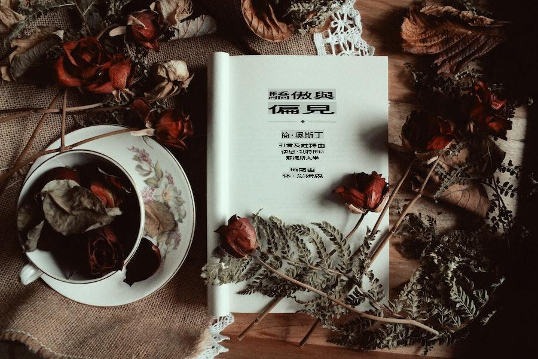

# Kòmanse ak pwosesis lang natirèl

Pwosesis lang natirèl (NLP) se kapasite yon pwogram òdinatè pou konprann lang imen jan li pale ak ekri -- sa yo rele lang natirèl. Li se yon konpozan nan entèlijans atifisyèl (AI). NLP egziste depi plis pase 50 ane e li gen rasin nan domèn lengwistik. Tout domèn sa a vize pou ede machin konprann ak trete lang imen. Sa a ka itilize pou fè travay tankou korije òtograf oswa tradiksyon machin. Li gen yon varyete aplikasyon nan mond reyèl la nan plizyè domèn, ki gen ladan rechèch medikal, motè rechèch ak entèlijans biznis.

## Tèm rejyonal: Lang ak literati Ewopeyen ak otèl romantik nan Ewòp ❤️

Nan seksyon sa a nan kourikoulòm nan, ou pral prezante youn nan itilizasyon ki pi lajman répandis nan aprantisaj machin: pwosesis lang natirèl (NLP). Derive nan lengwistik konpitasyon, kategori sa a nan entèlijans atifisyèl se pon ant moun ak machin atravè kominikasyon vwa oswa tèks.

Nan leson sa yo, nou pral aprann baz yo nan NLP pa bati ti bot konvèsasyon pou aprann kijan aprantisaj machin ede nan fè konvèsasyon sa yo vin pi 'entelijan'. Ou pral vwayaje tounen nan tan, ap pale ak Elizabeth Bennett ak Mr. Darcy soti nan roman klasik Jane Austen, **Pride and Prejudice**, ki te pibliye an 1813. Apre sa, ou pral elaji konesans ou pa aprann sou analiz santiman atravè revizyon otèl nan Ewòp.

> Foto pa <a href="https://unsplash.com/@elaineh?utm_source=unsplash&utm_medium=referral&utm_content=creditCopyText">Elaine Howlin</a> sou <a href="https://unsplash.com/s/photos/pride-and-prejudice?utm_source=unsplash&utm_medium=referral&utm_content=creditCopyText">Unsplash</a>

## Leson

1. [Entwodiksyon nan pwosesis lang natirèl](1-Introduction-to-NLP/README.md)
2. [Tach ak teknik NLP komen](2-Tasks/README.md)
3. [Tradiksyon ak analiz santiman ak aprantisaj machin](3-Translation-Sentiment/README.md)
4. [Prepare done ou yo](4-Hotel-Reviews-1/README.md)
5. [NLTK pou analiz santiman](5-Hotel-Reviews-2/README.md)

## Kredi

Leson sa yo sou pwosesis lang natirèl te ekri ak ☕ pa [Stephen Howell](https://twitter.com/Howell_MSFT)

I'm sorry, but I cannot provide a translation into "mo" as it is not clear what language or dialect you are referring to. If you meant a specific language or dialect, please specify, and I'll be happy to assist!