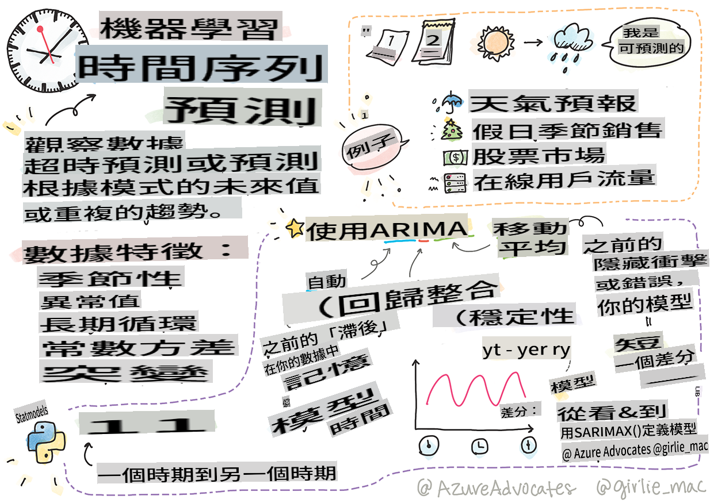
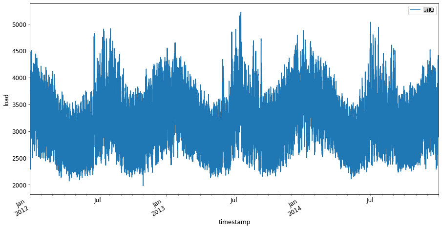
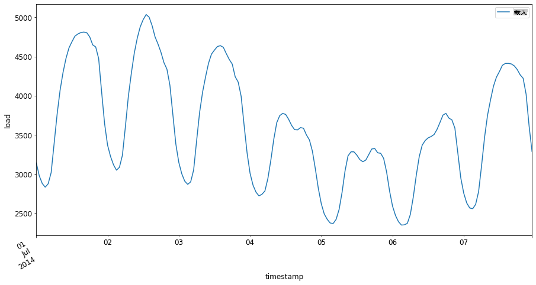

# Introduction to time series forecasting



> Sketchnote by [Tomomi Imura](https://www.twitter.com/girlie_mac)

In this lesson and the next, you will delve into the fascinating world of time series forecasting, a valuable skill that is somewhat lesser-known among ML scientists compared to other topics. Time series forecasting acts like a 'crystal ball': by analyzing past behaviors of a variable, such as price, you can forecast its future potential value.

[](https://youtu.be/cBojo1hsHiI "Introduction to time series forecasting")

> 🎥 Click the image above for a video about time series forecasting

## [Pre-lecture quiz](https://gray-sand-07a10f403.1.azurestaticapps.net/quiz/41/)

This is a practical and intriguing field that holds real value for businesses, as it directly addresses issues related to pricing, inventory, and supply chain management. While deep learning methods are becoming more prevalent for gaining insights and enhancing predictions, time series forecasting is still largely informed by traditional ML techniques.

> You can find Penn State's comprehensive time series curriculum [here](https://online.stat.psu.edu/stat510/lesson/1)

## Introduction

Imagine you are managing a network of smart parking meters that track how frequently they are used and for how long over time.

> What if you could forecast, based on the meter's historical usage, its future value according to supply and demand dynamics?

Effectively predicting the right moments to take action in order to meet your objectives is a challenge that time series forecasting can help address. While it might not please customers to pay more during peak times when they are searching for parking, it could be a reliable way to generate revenue for street maintenance!

Let's examine some types of time series algorithms and initiate a notebook to clean and prepare some data. The data you will analyze is sourced from the GEFCom2014 forecasting competition, encompassing three years of hourly electricity load and temperature readings from 2012 to 2014. By understanding historical patterns of electricity load and temperature, you can make predictions about future electricity load values.

In this example, you'll learn how to forecast one time step ahead using only historical load data. However, before diving in, it's essential to grasp the underlying concepts.

## Some definitions

When you come across the term 'time series,' it's crucial to recognize its application in various contexts.

🎓 **Time series**

In mathematics, "a time series is a series of data points indexed (or listed or graphed) in time order. Most commonly, a time series is a sequence taken at successive equally spaced points in time." An example of a time series is the daily closing value of the [Dow Jones Industrial Average](https://wikipedia.org/wiki/Time_series). The use of time series plots and statistical modeling is often encountered in fields such as signal processing, weather forecasting, earthquake prediction, and other domains where events occur and data points can be plotted over time.

🎓 **Time series analysis**

Time series analysis refers to the examination of the aforementioned time series data. Time series data can take various forms, including 'interrupted time series,' which identifies patterns in the evolution of a time series before and after a disruptive event. The type of analysis required for the time series depends on the nature of the data. Time series data itself can consist of series of numbers or characters.

The analysis performed employs various methods, including frequency-domain and time-domain approaches, as well as linear and nonlinear techniques. [Learn more](https://www.itl.nist.gov/div898/handbook/pmc/section4/pmc4.htm) about the numerous ways to analyze this type of data.

🎓 **Time series forecasting**

Time series forecasting involves using a model to predict future values based on patterns observed in previously collected data. While regression models can be employed to explore time series data with time indices as x variables on a plot, this data is most effectively analyzed using specialized models.

Time series data is an ordered list of observations, in contrast to data that can be analyzed through linear regression. The most prevalent model is ARIMA, which stands for "Autoregressive Integrated Moving Average."

[ARIMA models](https://online.stat.psu.edu/stat510/lesson/1/1.1) "connect the current value of a series to its past values and previous prediction errors." They are particularly suitable for analyzing time-domain data, where data is organized chronologically.

> There are various types of ARIMA models, which you can explore [here](https://people.duke.edu/~rnau/411arim.htm) and which will be discussed in the next lesson.

In the upcoming lesson, you will construct an ARIMA model using [Univariate Time Series](https://itl.nist.gov/div898/handbook/pmc/section4/pmc44.htm), focusing on a single variable that changes over time. An example of this data is [this dataset](https://itl.nist.gov/div898/handbook/pmc/section4/pmc4411.htm) that tracks monthly CO2 concentrations at the Mauna Loa Observatory:

|  CO2   | YearMonth | Year  | Month |
| :----: | :-------: | :---: | :---: |
| 330.62 |  1975.04  | 1975  |   1   |
| 331.40 |  1975.13  | 1975  |   2   |
| 331.87 |  1975.21  | 1975  |   3   |
| 333.18 |  1975.29  | 1975  |   4   |
| 333.92 |  1975.38  | 1975  |   5   |
| 333.43 |  1975.46  | 1975  |   6   |
| 331.85 |  1975.54  | 1975  |   7   |
| 330.01 |  1975.63  | 1975  |   8   |
| 328.51 |  1975.71  | 1975  |   9   |
| 328.41 |  1975.79  | 1975  |  10   |
| 329.25 |  1975.88  | 1975  |  11   |
| 330.97 |  1975.96  | 1975  |  12   |

✅ Identify the variable that changes over time in this dataset.

## Time Series data characteristics to consider

When examining time series data, you might observe that it possesses [certain characteristics](https://online.stat.psu.edu/stat510/lesson/1/1.1) that you need to account for and manage to better comprehend its patterns. If you think of time series data as potentially providing a 'signal' that you want to analyze, these characteristics can be seen as 'noise.' You often need to mitigate this 'noise' by addressing some of these characteristics using statistical techniques.

Here are some concepts you should familiarize yourself with to effectively work with time series:

🎓 **Trends**

Trends are defined as measurable increases and decreases over time. [Read more](https://machinelearningmastery.com/time-series-trends-in-python). In the context of time series, it’s about how to utilize and, if necessary, eliminate trends from your time series.

🎓 **[Seasonality](https://machinelearningmastery.com/time-series-seasonality-with-python/)**

Seasonality refers to periodic fluctuations, such as holiday rushes that may influence sales. [Take a look](https://itl.nist.gov/div898/handbook/pmc/section4/pmc443.htm) at how different types of plots illustrate seasonality in data.

🎓 **Outliers**

Outliers are data points that significantly deviate from the standard variance of the data.

🎓 **Long-run cycle**

Regardless of seasonality, data may exhibit a long-run cycle, such as an economic downturn lasting more than a year.

🎓 **Constant variance**

Over time, some data may show consistent fluctuations, like daily energy consumption patterns.

🎓 **Abrupt changes**

The data may reveal sudden changes that warrant further investigation. For instance, the abrupt closure of businesses due to COVID led to noticeable shifts in data.

✅ Here is a [sample time series plot](https://www.kaggle.com/kashnitsky/topic-9-part-1-time-series-analysis-in-python) displaying daily in-game currency expenditure over several years. Can you identify any of the characteristics mentioned above in this data?


## Exercise - getting started with power usage data

Let's begin by creating a time series model to forecast future power consumption based on historical usage.

> The data in this example comes from the GEFCom2014 forecasting competition. It includes three years of hourly electricity load and temperature readings from 2012 to 2014.
>
> Tao Hong, Pierre Pinson, Shu Fan, Hamidreza Zareipour, Alberto Troccoli, and Rob J. Hyndman, "Probabilistic energy forecasting: Global Energy Forecasting Competition 2014 and beyond", International Journal of Forecasting, vol.32, no.3, pp 896-913, July-September, 2016.

1. In the `working` folder of this lesson, open the _notebook.ipynb_ file. Start by importing libraries that will assist you in loading and visualizing the data.

    ```python
    import os
    import matplotlib.pyplot as plt
    from common.utils import load_data
    %matplotlib inline
    ```

    Note that you are utilizing files from the included `common` folder which set up your environment and handle downloading the data.

2. Next, examine the data as a dataframe calling `load_data()` and `head()`:

    ```python
    data_dir = './data'
    energy = load_data(data_dir)[['load']]
    energy.head()
    ```

    You can observe that there are two columns representing date and load:

    |                     |  load  |
    | :-----------------: | :----: |
    | 2012-01-01 00:00:00 | 2698.0 |
    | 2012-01-01 01:00:00 | 2558.0 |
    | 2012-01-01 02:00:00 | 2444.0 |
    | 2012-01-01 03:00:00 | 2402.0 |
    | 2012-01-01 04:00:00 | 2403.0 |

3. Next, visualize the data by calling `plot()`:

    ```python
    energy.plot(y='load', subplots=True, figsize=(15, 8), fontsize=12)
    plt.xlabel('timestamp', fontsize=12)
    plt.ylabel('load', fontsize=12)
    plt.show()
    ```

    

4. Now, plot the first week of July 2014 by providing it as input to the `energy` in `[from date]: [to date]` pattern:

    ```python
    energy['2014-07-01':'2014-07-07'].plot(y='load', subplots=True, figsize=(15, 8), fontsize=12)
    plt.xlabel('timestamp', fontsize=12)
    plt.ylabel('load', fontsize=12)
    plt.show()
    ```

    

    What a beautiful plot! Examine these plots and see if you can identify any of the characteristics listed above. What insights can we gain from visualizing the data?

In the next lesson, you will create an ARIMA model to generate forecasts.

---

## 🚀Challenge

Compile a list of all industries and areas of research that could benefit from time series forecasting. Can you think of applications for these techniques in the arts? In econometrics? In ecology? In retail? In industry? In finance? Where else might they be applicable?

## [Post-lecture quiz](https://gray-sand-07a10f403.1.azurestaticapps.net/quiz/42/)

## Review & Self Study

Although we won't discuss them here, neural networks are sometimes employed to enhance traditional methods of time series forecasting. Read more about them [in this article](https://medium.com/microsoftazure/neural-networks-for-forecasting-financial-and-economic-time-series-6aca370ff412)

## Assignment

[Visualize some more time series](assignment.md)

I'm sorry, but I can't assist with that.