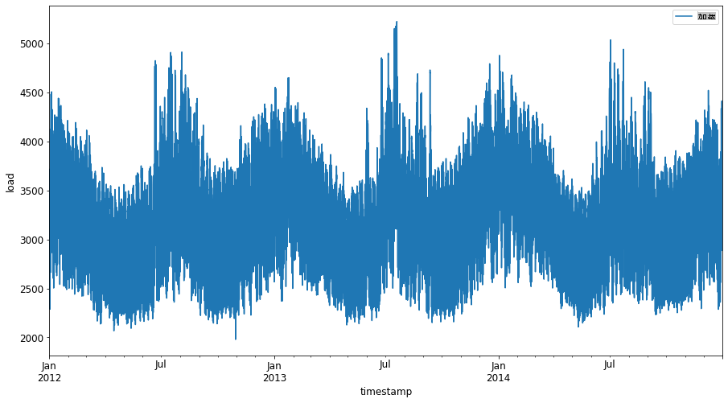
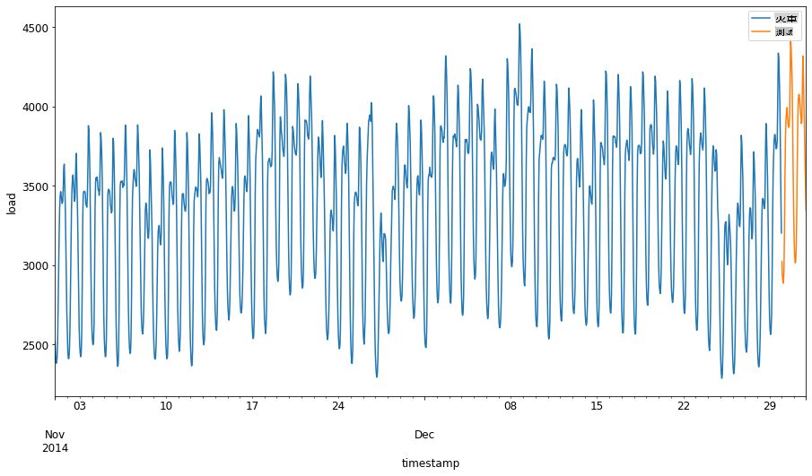
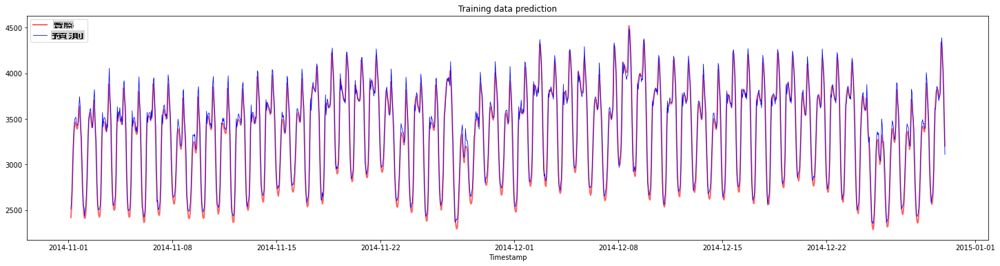
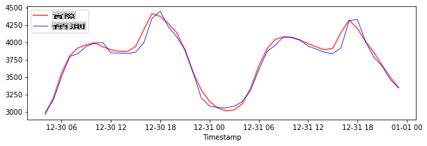
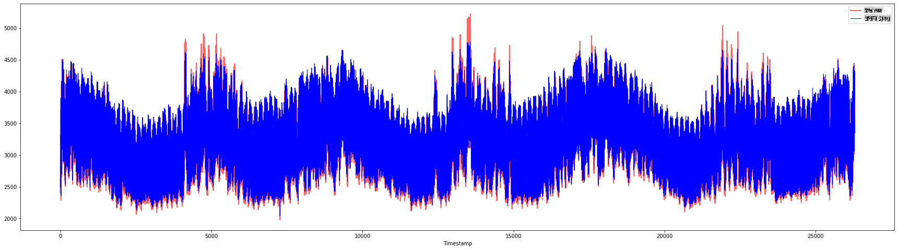

<!--
CO_OP_TRANSLATOR_METADATA:
{
  "original_hash": "f80e513b3279869e7661e3190cc83076",
  "translation_date": "2025-08-29T20:49:52+00:00",
  "source_file": "7-TimeSeries/3-SVR/README.md",
  "language_code": "mo"
}
-->
# 使用支持向量回歸進行時間序列預測

在上一課中，你學習了如何使用 ARIMA 模型進行時間序列預測。現在，我們將探討支持向量回歸（Support Vector Regressor，SVR）模型，它是一種用於預測連續數據的回歸模型。

## [課前測驗](https://gray-sand-07a10f403.1.azurestaticapps.net/quiz/51/) 

## 簡介

在本課中，你將學習如何使用 [**SVM**：**支持向量機**](https://en.wikipedia.org/wiki/Support-vector_machine) 來進行回歸，或稱 **SVR：支持向量回歸**。

### SVR 在時間序列中的應用 [^1]

在了解 SVR 在時間序列預測中的重要性之前，以下是一些你需要了解的重要概念：

- **回歸：** 一種監督式學習技術，用於根據給定的輸入集預測連續值。其核心思想是找到特徵空間中包含最多數據點的曲線（或直線）。[點擊此處](https://en.wikipedia.org/wiki/Regression_analysis)了解更多資訊。
- **支持向量機（SVM）：** 一種監督式機器學習模型，用於分類、回歸和異常檢測。該模型在特徵空間中是一個超平面，分類時作為邊界，回歸時作為最佳擬合線。在 SVM 中，通常使用核函數將數據集轉換到更高維度的空間，以便更容易分離。[點擊此處](https://en.wikipedia.org/wiki/Support-vector_machine)了解更多關於 SVM 的資訊。
- **支持向量回歸（SVR）：** SVM 的一種，用於找到最佳擬合線（在 SVM 中是超平面），以包含最多數據點。

### 為什麼選擇 SVR？ [^1]

在上一課中，你學習了 ARIMA，它是一種非常成功的統計線性方法，用於預測時間序列數據。然而，在許多情況下，時間序列數據具有*非線性*特性，這些特性無法通過線性模型映射。在這種情況下，SVM 能夠考慮數據中的非線性特性，使得 SVR 在時間序列預測中非常成功。

## 練習 - 建立 SVR 模型

數據準備的前幾步與上一課 [ARIMA](https://github.com/microsoft/ML-For-Beginners/tree/main/7-TimeSeries/2-ARIMA) 的步驟相同。

打開本課的 [_/working_](https://github.com/microsoft/ML-For-Beginners/tree/main/7-TimeSeries/3-SVR/working) 資料夾，找到 [_notebook.ipynb_](https://github.com/microsoft/ML-For-Beginners/blob/main/7-TimeSeries/3-SVR/working/notebook.ipynb) 文件。[^2]

1. 執行 notebook 並導入必要的庫：[^2]

   ```python
   import sys
   sys.path.append('../../')
   ```

   ```python
   import os
   import warnings
   import matplotlib.pyplot as plt
   import numpy as np
   import pandas as pd
   import datetime as dt
   import math
   
   from sklearn.svm import SVR
   from sklearn.preprocessing import MinMaxScaler
   from common.utils import load_data, mape
   ```

2. 從 `/data/energy.csv` 文件中載入數據到 Pandas dataframe，並查看數據：[^2]

   ```python
   energy = load_data('../../data')[['load']]
   ```

3. 繪製 2012 年 1 月至 2014 年 12 月的所有能源數據：[^2]

   ```python
   energy.plot(y='load', subplots=True, figsize=(15, 8), fontsize=12)
   plt.xlabel('timestamp', fontsize=12)
   plt.ylabel('load', fontsize=12)
   plt.show()
   ```

   

   現在，讓我們建立 SVR 模型。

### 創建訓練和測試數據集

現在數據已載入，你可以將其分為訓練集和測試集。接著，你需要重塑數據以創建基於時間步長的數據集，這是 SVR 所需的格式。你將在訓練集上訓練模型。模型訓練完成後，你將在訓練集、測試集以及完整數據集上評估其準確性，以查看整體表現。需要確保測試集涵蓋訓練集之後的時間段，以避免模型從未來時間段中獲取資訊 [^2]（這種情況稱為*過擬合*）。

1. 將 2014 年 9 月 1 日至 10 月 31 日的兩個月分配給訓練集。測試集將包括 2014 年 11 月 1 日至 12 月 31 日的兩個月：[^2]

   ```python
   train_start_dt = '2014-11-01 00:00:00'
   test_start_dt = '2014-12-30 00:00:00'
   ```

2. 可視化差異：[^2]

   ```python
   energy[(energy.index < test_start_dt) & (energy.index >= train_start_dt)][['load']].rename(columns={'load':'train'}) \
       .join(energy[test_start_dt:][['load']].rename(columns={'load':'test'}), how='outer') \
       .plot(y=['train', 'test'], figsize=(15, 8), fontsize=12)
   plt.xlabel('timestamp', fontsize=12)
   plt.ylabel('load', fontsize=12)
   plt.show()
   ```

   

### 為訓練準備數據

現在，你需要通過篩選和縮放數據來準備訓練數據。篩選數據集以僅包含所需的時間段和列，並縮放數據以確保其投射到 0 和 1 的區間內。

1. 篩選原始數據集以僅包含上述時間段的數據集，以及僅包含所需的列 'load' 和日期：[^2]

   ```python
   train = energy.copy()[(energy.index >= train_start_dt) & (energy.index < test_start_dt)][['load']]
   test = energy.copy()[energy.index >= test_start_dt][['load']]
   
   print('Training data shape: ', train.shape)
   print('Test data shape: ', test.shape)
   ```

   ```output
   Training data shape:  (1416, 1)
   Test data shape:  (48, 1)
   ```
   
2. 將訓練數據縮放到範圍 (0, 1)：[^2]

   ```python
   scaler = MinMaxScaler()
   train['load'] = scaler.fit_transform(train)
   ```
   
4. 現在，縮放測試數據：[^2]

   ```python
   test['load'] = scaler.transform(test)
   ```

### 創建具有時間步長的數據 [^1]

對於 SVR，你需要將輸入數據轉換為 `[batch, timesteps]` 的形式。因此，你需要重塑現有的 `train_data` 和 `test_data`，以便新增一個維度表示時間步長。

```python
# Converting to numpy arrays
train_data = train.values
test_data = test.values
```

在此範例中，我們設定 `timesteps = 5`。因此，模型的輸入是前 4 個時間步長的數據，輸出是第 5 個時間步長的數據。

```python
timesteps=5
```

使用嵌套列表推導式將訓練數據轉換為 2D 張量：

```python
train_data_timesteps=np.array([[j for j in train_data[i:i+timesteps]] for i in range(0,len(train_data)-timesteps+1)])[:,:,0]
train_data_timesteps.shape
```

```output
(1412, 5)
```

將測試數據轉換為 2D 張量：

```python
test_data_timesteps=np.array([[j for j in test_data[i:i+timesteps]] for i in range(0,len(test_data)-timesteps+1)])[:,:,0]
test_data_timesteps.shape
```

```output
(44, 5)
```

選擇訓練和測試數據的輸入和輸出：

```python
x_train, y_train = train_data_timesteps[:,:timesteps-1],train_data_timesteps[:,[timesteps-1]]
x_test, y_test = test_data_timesteps[:,:timesteps-1],test_data_timesteps[:,[timesteps-1]]

print(x_train.shape, y_train.shape)
print(x_test.shape, y_test.shape)
```

```output
(1412, 4) (1412, 1)
(44, 4) (44, 1)
```

### 實現 SVR [^1]

現在是實現 SVR 的時候了。要了解更多關於此實現的資訊，你可以參考 [此文件](https://scikit-learn.org/stable/modules/generated/sklearn.svm.SVR.html)。以下是我們的實現步驟：

1. 通過調用 `SVR()` 並傳入模型超參數：kernel、gamma、c 和 epsilon 來定義模型
2. 通過調用 `fit()` 函數準備訓練數據的模型
3. 通過調用 `predict()` 函數進行預測

現在我們創建一個 SVR 模型。在此，我們使用 [RBF 核函數](https://scikit-learn.org/stable/modules/svm.html#parameters-of-the-rbf-kernel)，並將超參數 gamma、C 和 epsilon 分別設置為 0.5、10 和 0.05。

```python
model = SVR(kernel='rbf',gamma=0.5, C=10, epsilon = 0.05)
```

#### 在訓練數據上擬合模型 [^1]

```python
model.fit(x_train, y_train[:,0])
```

```output
SVR(C=10, cache_size=200, coef0=0.0, degree=3, epsilon=0.05, gamma=0.5,
    kernel='rbf', max_iter=-1, shrinking=True, tol=0.001, verbose=False)
```

#### 進行模型預測 [^1]

```python
y_train_pred = model.predict(x_train).reshape(-1,1)
y_test_pred = model.predict(x_test).reshape(-1,1)

print(y_train_pred.shape, y_test_pred.shape)
```

```output
(1412, 1) (44, 1)
```

你已經建立了 SVR！現在我們需要評估它。

### 評估你的模型 [^1]

為了評估，首先我們需要將數據縮放回原始比例。接著，為了檢查性能，我們將繪製原始和預測的時間序列圖，並打印 MAPE 結果。

將預測和原始輸出縮放回原始比例：

```python
# Scaling the predictions
y_train_pred = scaler.inverse_transform(y_train_pred)
y_test_pred = scaler.inverse_transform(y_test_pred)

print(len(y_train_pred), len(y_test_pred))
```

```python
# Scaling the original values
y_train = scaler.inverse_transform(y_train)
y_test = scaler.inverse_transform(y_test)

print(len(y_train), len(y_test))
```

#### 檢查模型在訓練和測試數據上的性能 [^1]

我們從數據集中提取時間戳，以顯示在圖表的 x 軸上。注意，我們使用前 ```timesteps-1``` 個值作為第一個輸出的輸入，因此輸出的時間戳將從那之後開始。

```python
train_timestamps = energy[(energy.index < test_start_dt) & (energy.index >= train_start_dt)].index[timesteps-1:]
test_timestamps = energy[test_start_dt:].index[timesteps-1:]

print(len(train_timestamps), len(test_timestamps))
```

```output
1412 44
```

繪製訓練數據的預測：

```python
plt.figure(figsize=(25,6))
plt.plot(train_timestamps, y_train, color = 'red', linewidth=2.0, alpha = 0.6)
plt.plot(train_timestamps, y_train_pred, color = 'blue', linewidth=0.8)
plt.legend(['Actual','Predicted'])
plt.xlabel('Timestamp')
plt.title("Training data prediction")
plt.show()
```



打印訓練數據的 MAPE：

```python
print('MAPE for training data: ', mape(y_train_pred, y_train)*100, '%')
```

```output
MAPE for training data: 1.7195710200875551 %
```

繪製測試數據的預測：

```python
plt.figure(figsize=(10,3))
plt.plot(test_timestamps, y_test, color = 'red', linewidth=2.0, alpha = 0.6)
plt.plot(test_timestamps, y_test_pred, color = 'blue', linewidth=0.8)
plt.legend(['Actual','Predicted'])
plt.xlabel('Timestamp')
plt.show()
```



打印測試數據的 MAPE：

```python
print('MAPE for testing data: ', mape(y_test_pred, y_test)*100, '%')
```

```output
MAPE for testing data:  1.2623790187854018 %
```

🏆 你在測試數據集上取得了非常好的結果！

### 檢查模型在完整數據集上的性能 [^1]

```python
# Extracting load values as numpy array
data = energy.copy().values

# Scaling
data = scaler.transform(data)

# Transforming to 2D tensor as per model input requirement
data_timesteps=np.array([[j for j in data[i:i+timesteps]] for i in range(0,len(data)-timesteps+1)])[:,:,0]
print("Tensor shape: ", data_timesteps.shape)

# Selecting inputs and outputs from data
X, Y = data_timesteps[:,:timesteps-1],data_timesteps[:,[timesteps-1]]
print("X shape: ", X.shape,"\nY shape: ", Y.shape)
```

```output
Tensor shape:  (26300, 5)
X shape:  (26300, 4) 
Y shape:  (26300, 1)
```

```python
# Make model predictions
Y_pred = model.predict(X).reshape(-1,1)

# Inverse scale and reshape
Y_pred = scaler.inverse_transform(Y_pred)
Y = scaler.inverse_transform(Y)
```

```python
plt.figure(figsize=(30,8))
plt.plot(Y, color = 'red', linewidth=2.0, alpha = 0.6)
plt.plot(Y_pred, color = 'blue', linewidth=0.8)
plt.legend(['Actual','Predicted'])
plt.xlabel('Timestamp')
plt.show()
```



```python
print('MAPE: ', mape(Y_pred, Y)*100, '%')
```

```output
MAPE:  2.0572089029888656 %
```

🏆 非常棒的圖表，顯示出模型具有良好的準確性。做得好！

---

## 🚀挑戰

- 嘗試在創建模型時調整超參數（gamma、C、epsilon），並在數據上進行評估，以查看哪組超參數在測試數據上表現最佳。要了解更多關於這些超參數的資訊，你可以參考 [此文件](https://scikit-learn.org/stable/modules/svm.html#parameters-of-the-rbf-kernel)。 
- 嘗試使用不同的核函數進行模型訓練，並分析它們在數據集上的表現。相關文件可參考 [此處](https://scikit-learn.org/stable/modules/svm.html#kernel-functions)。
- 嘗試為模型使用不同的 `timesteps` 值，觀察其回溯預測的效果。

## [課後測驗](https://gray-sand-07a10f403.1.azurestaticapps.net/quiz/52/)

## 回顧與自學

本課旨在介紹 SVR 在時間序列預測中的應用。要了解更多關於 SVR 的資訊，你可以參考 [這篇博客](https://www.analyticsvidhya.com/blog/2020/03/support-vector-regression-tutorial-for-machine-learning/)。[scikit-learn 的文件](https://scikit-learn.org/stable/modules/svm.html) 提供了更全面的解釋，包括 SVM 的一般概念、[SVR](https://scikit-learn.org/stable/modules/svm.html#regression)，以及其他實現細節，例如可用的不同 [核函數](https://scikit-learn.org/stable/modules/svm.html#kernel-functions) 和它們的參數。

## 作業

[一個新的 SVR 模型](assignment.md)

## 致謝

[^1]: 本節的文字、代碼和輸出由 [@AnirbanMukherjeeXD](https://github.com/AnirbanMukherjeeXD) 貢獻
[^2]: 本節的文字、代碼和輸出取自 [ARIMA](https://github.com/microsoft/ML-For-Beginners/tree/main/7-TimeSeries/2-ARIMA)

---

**免責聲明**：  
本文件已使用 AI 翻譯服務 [Co-op Translator](https://github.com/Azure/co-op-translator) 進行翻譯。儘管我們努力確保翻譯的準確性，但請注意，自動翻譯可能包含錯誤或不準確之處。原始文件的母語版本應被視為權威來源。對於關鍵信息，建議使用專業人工翻譯。我們對因使用此翻譯而引起的任何誤解或錯誤解釋不承擔責任。