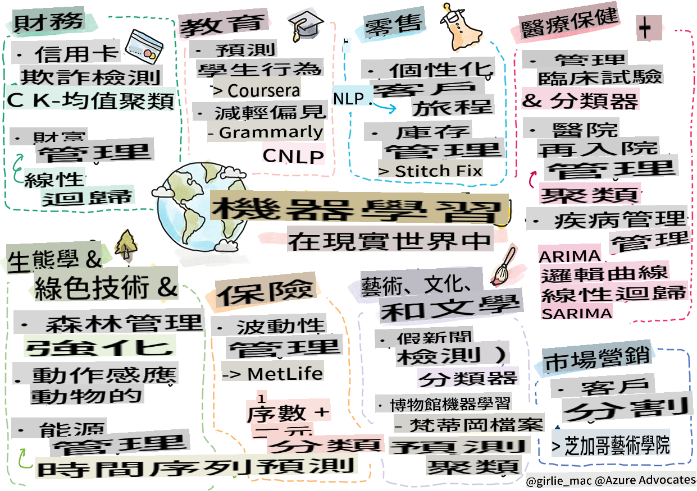

# Postscript: Apprentissage automatique dans le monde réel

> Croquis par [Tomomi Imura](https://www.twitter.com/girlie_mac)

Dans ce programme, vous avez appris de nombreuses façons de préparer des données pour l'entraînement et de créer des modèles d'apprentissage automatique. Vous avez construit une série de modèles classiques de régression, de regroupement, de classification, de traitement du langage naturel et de séries temporelles. Félicitations ! Maintenant, vous vous demandez peut-être à quoi cela sert... quelles sont les applications concrètes de ces modèles ?

Bien qu'un grand intérêt pour l'industrie ait été suscité par l'IA, qui s'appuie généralement sur l'apprentissage profond, il existe encore des applications précieuses pour les modèles classiques d'apprentissage automatique. Vous pourriez même utiliser certaines de ces applications aujourd'hui ! Dans cette leçon, vous explorerez comment huit industries différentes et domaines d'expertise utilisent ces types de modèles pour rendre leurs applications plus performantes, fiables, intelligentes et précieuses pour les utilisateurs.

## [Quiz pré-conférence](https://gray-sand-07a10f403.1.azurestaticapps.net/quiz/49/)

## 💰 Finance

Le secteur financier offre de nombreuses opportunités pour l'apprentissage automatique. De nombreux problèmes dans ce domaine peuvent être modélisés et résolus à l'aide de l'apprentissage automatique.

### Détection de fraude par carte de crédit

Nous avons appris sur [le regroupement k-means](../../5-Clustering/2-K-Means/README.md) plus tôt dans le cours, mais comment peut-il être utilisé pour résoudre des problèmes liés à la fraude par carte de crédit ?

Le regroupement k-means est utile lors d'une technique de détection de fraude par carte de crédit appelée **détection d'outliers**. Les outliers, ou déviations dans les observations d'un ensemble de données, peuvent nous indiquer si une carte de crédit est utilisée de manière normale ou si quelque chose d'inhabituel se produit. Comme indiqué dans le document lié ci-dessous, vous pouvez trier les données de carte de crédit en utilisant un algorithme de regroupement k-means et assigner chaque transaction à un groupe en fonction de son apparence en tant qu'outlier. Ensuite, vous pouvez évaluer les groupes les plus risqués pour les transactions frauduleuses par rapport aux transactions légitimes.
[Référence](https://citeseerx.ist.psu.edu/viewdoc/download?doi=10.1.1.680.1195&rep=rep1&type=pdf)

### Gestion de patrimoine

Dans la gestion de patrimoine, un individu ou une entreprise gère des investissements au nom de ses clients. Leur travail consiste à maintenir et à faire croître la richesse à long terme, il est donc essentiel de choisir des investissements qui performe bien.

Une façon d'évaluer comment un investissement particulier performe est d'utiliser la régression statistique. [La régression linéaire](../../2-Regression/1-Tools/README.md) est un outil précieux pour comprendre comment un fonds performe par rapport à un certain critère de référence. Nous pouvons également déduire si les résultats de la régression sont statistiquement significatifs, ou dans quelle mesure ils affecteraient les investissements d'un client. Vous pourriez même élargir davantage votre analyse en utilisant la régression multiple, où des facteurs de risque supplémentaires peuvent être pris en compte. Pour un exemple de la façon dont cela fonctionnerait pour un fonds spécifique, consultez le document ci-dessous sur l'évaluation de la performance des fonds à l'aide de la régression.
[Référence](http://www.brightwoodventures.com/evaluating-fund-performance-using-regression/)

## 🎓 Éducation

Le secteur de l'éducation est également un domaine très intéressant où l'apprentissage automatique peut être appliqué. Il existe des problèmes intéressants à résoudre, tels que la détection de tricherie lors des tests ou des essais, ou la gestion des biais, qu'ils soient intentionnels ou non, dans le processus de correction.

### Prédiction du comportement des étudiants

[Coursera](https://coursera.com), un fournisseur de cours en ligne, a un excellent blog technique où ils discutent de nombreuses décisions d'ingénierie. Dans cette étude de cas, ils ont tracé une ligne de régression pour essayer d'explorer toute corrélation entre un faible NPS (Net Promoter Score) et la rétention ou l'abandon de cours.
[Référence](https://medium.com/coursera-engineering/controlled-regression-quantifying-the-impact-of-course-quality-on-learner-retention-31f956bd592a)

### Atténuation des biais

[Grammarly](https://grammarly.com), un assistant d'écriture qui vérifie les fautes d'orthographe et de grammaire, utilise des [systèmes de traitement du langage naturel](../../6-NLP/README.md) sophistiqués dans ses produits. Ils ont publié une étude de cas intéressante sur leur blog technique sur la façon dont ils ont traité le biais de genre dans l'apprentissage automatique, que vous avez appris dans notre [leçon d'introduction à l'équité](../../1-Introduction/3-fairness/README.md).
[Référence](https://www.grammarly.com/blog/engineering/mitigating-gender-bias-in-autocorrect/)

## 👜 Vente au détail

Le secteur de la vente au détail peut certainement bénéficier de l'utilisation de l'apprentissage automatique, que ce soit pour créer un meilleur parcours client ou pour gérer l'inventaire de manière optimale.

### Personnalisation du parcours client

Chez Wayfair, une entreprise qui vend des articles pour la maison comme des meubles, aider les clients à trouver les bons produits pour leurs goûts et besoins est primordial. Dans cet article, des ingénieurs de l'entreprise décrivent comment ils utilisent l'apprentissage automatique et le traitement du langage naturel pour "mettre en avant les bons résultats pour les clients". Notamment, leur moteur d'intention de requête a été conçu pour utiliser l'extraction d'entités, l'entraînement de classificateurs, l'extraction d'actifs et d'opinions, ainsi que l'étiquetage des sentiments sur les avis des clients. C'est un cas classique de la façon dont le traitement du langage naturel fonctionne dans le commerce en ligne.
[Référence](https://www.aboutwayfair.com/tech-innovation/how-we-use-machine-learning-and-natural-language-processing-to-empower-search)

### Gestion des stocks

Des entreprises innovantes et agiles comme [StitchFix](https://stitchfix.com), un service de boîte qui expédie des vêtements aux consommateurs, s'appuient fortement sur l'apprentissage automatique pour les recommandations et la gestion des stocks. En fait, leurs équipes de stylisme travaillent ensemble avec leurs équipes de marchandisage : "l'un de nos data scientists a expérimenté avec un algorithme génétique et l'a appliqué à l'habillement pour prédire ce qui serait un article de vêtement réussi qui n'existe pas aujourd'hui. Nous avons présenté cela à l'équipe de marchandisage et maintenant ils peuvent l'utiliser comme un outil."
[Référence](https://www.zdnet.com/article/how-stitch-fix-uses-machine-learning-to-master-the-science-of-styling/)

## 🏥 Santé

Le secteur de la santé peut tirer parti de l'apprentissage automatique pour optimiser les tâches de recherche et également résoudre des problèmes logistiques comme la réadmission des patients ou l'arrêt de la propagation des maladies.

### Gestion des essais cliniques

La toxicité dans les essais cliniques est une préoccupation majeure pour les fabricants de médicaments. Quelle quantité de toxicité est tolérable ? Dans cette étude, l'analyse de diverses méthodes d'essai clinique a conduit au développement d'une nouvelle approche pour prédire les résultats des essais cliniques. Plus précisément, ils ont pu utiliser des forêts aléatoires pour produire un [classificateur](../../4-Classification/README.md) capable de distinguer entre des groupes de médicaments.
[Référence](https://www.sciencedirect.com/science/article/pii/S2451945616302914)

### Gestion des réadmissions hospitalières

Les soins hospitaliers sont coûteux, surtout lorsque les patients doivent être réadmis. Cet article discute d'une entreprise qui utilise l'apprentissage automatique pour prédire le potentiel de réadmission en utilisant des algorithmes de [regroupement](../../5-Clustering/README.md). Ces groupes aident les analystes à "découvrir des groupes de réadmissions qui peuvent partager une cause commune".
[Référence](https://healthmanagement.org/c/healthmanagement/issuearticle/hospital-readmissions-and-machine-learning)

### Gestion des maladies

La récente pandémie a mis en lumière les façons dont l'apprentissage automatique peut aider à stopper la propagation des maladies. Dans cet article, vous reconnaîtrez l'utilisation d'ARIMA, de courbes logistiques, de régression linéaire et de SARIMA. "Ce travail est une tentative de calculer le taux de propagation de ce virus et donc de prédire les décès, les guérisons et les cas confirmés, afin de mieux nous préparer et de survivre."
[Référence](https://www.ncbi.nlm.nih.gov/pmc/articles/PMC7979218/)

## 🌲 Écologie et technologies vertes

La nature et l'écologie consistent en de nombreux systèmes sensibles où l'interaction entre les animaux et la nature est mise en avant. Il est important de pouvoir mesurer ces systèmes avec précision et d'agir de manière appropriée si quelque chose se produit, comme un incendie de forêt ou une baisse de la population animale.

### Gestion des forêts

Vous avez appris sur [l'apprentissage par renforcement](../../8-Reinforcement/README.md) dans des leçons précédentes. Cela peut être très utile pour essayer de prédire des motifs dans la nature. En particulier, cela peut être utilisé pour suivre des problèmes écologiques comme les incendies de forêt et la propagation d'espèces envahissantes. Au Canada, un groupe de chercheurs a utilisé l'apprentissage par renforcement pour construire des modèles de dynamique des incendies de forêt à partir d'images satellites. En utilisant un processus d'expansion spatiale (SSP) innovant, ils ont envisagé un incendie de forêt comme "l'agent à toute cellule dans le paysage." "L'ensemble des actions que le feu peut prendre à partir d'un emplacement à un moment donné inclut la propagation vers le nord, le sud, l'est ou l'ouest ou ne pas se propager."

Cette approche inverse la configuration habituelle de l'apprentissage par renforcement puisque la dynamique du processus de décision de Markov (MDP) correspondant est une fonction connue pour la propagation immédiate des incendies de forêt." Lisez-en plus sur les algorithmes classiques utilisés par ce groupe au lien ci-dessous.
[Référence](https://www.frontiersin.org/articles/10.3389/fict.2018.00006/full)

### Détection de mouvement des animaux

Bien que l'apprentissage profond ait créé une révolution dans le suivi visuel des mouvements des animaux (vous pouvez construire votre propre [suiveur d'ours polaire](https://docs.microsoft.com/learn/modules/build-ml-model-with-azure-stream-analytics/?WT.mc_id=academic-77952-leestott) ici), l'apprentissage automatique classique a encore sa place dans cette tâche.

Les capteurs pour suivre les mouvements des animaux de ferme et l'IoT utilisent ce type de traitement visuel, mais des techniques d'apprentissage automatique plus basiques sont utiles pour prétraiter les données. Par exemple, dans cet article, les postures des moutons ont été surveillées et analysées à l'aide de divers algorithmes de classification. Vous pourriez reconnaître la courbe ROC à la page 335.
[Référence](https://druckhaus-hofmann.de/gallery/31-wj-feb-2020.pdf)

### ⚡️ Gestion de l'énergie

Dans nos leçons sur [la prévision des séries temporelles](../../7-TimeSeries/README.md), nous avons invoqué le concept de parcmètres intelligents pour générer des revenus pour une ville en comprenant l'offre et la demande. Cet article discute en détail de la façon dont le regroupement, la régression et la prévision des séries temporelles se combinent pour aider à prédire la consommation future d'énergie en Irlande, sur la base de la mesure intelligente.
[Référence](https://www-cdn.knime.com/sites/default/files/inline-images/knime_bigdata_energy_timeseries_whitepaper.pdf)

## 💼 Assurance

Le secteur de l'assurance est un autre secteur qui utilise l'apprentissage automatique pour construire et optimiser des modèles financiers et actuariels viables.

### Gestion de la volatilité

MetLife, un fournisseur d'assurance-vie, est transparent sur la manière dont il analyse et atténue la volatilité dans ses modèles financiers. Dans cet article, vous remarquerez des visualisations de classification binaire et ordinale. Vous découvrirez également des visualisations de prévision.
[Référence](https://investments.metlife.com/content/dam/metlifecom/us/investments/insights/research-topics/macro-strategy/pdf/MetLifeInvestmentManagement_MachineLearnedRanking_070920.pdf)

## 🎨 Arts, culture et littérature

Dans les arts, par exemple dans le journalisme, il existe de nombreux problèmes intéressants. La détection de fausses nouvelles est un énorme problème car il a été prouvé qu'elle influence l'opinion des gens et même renverse des démocraties. Les musées peuvent également bénéficier de l'utilisation de l'apprentissage automatique dans tout, depuis la recherche de liens entre des artefacts jusqu'à la planification des ressources.

### Détection de fausses nouvelles

Détecter les fausses nouvelles est devenu un jeu du chat et de la souris dans les médias d'aujourd'hui. Dans cet article, des chercheurs suggèrent qu'un système combinant plusieurs des techniques d'apprentissage automatique que nous avons étudiées peut être testé et que le meilleur modèle peut être déployé : "Ce système est basé sur le traitement du langage naturel pour extraire des caractéristiques des données, puis ces caractéristiques sont utilisées pour l'entraînement de classificateurs d'apprentissage automatique tels que Naive Bayes, Machine à vecteurs de support (SVM), Forêt aléatoire (RF), Descente de gradient stochastique (SGD) et Régression logistique (LR)."
[Référence](https://www.irjet.net/archives/V7/i6/IRJET-V7I6688.pdf)

Cet article montre comment la combinaison de différents domaines de l'apprentissage automatique peut produire des résultats intéressants qui peuvent aider à arrêter la propagation de fausses nouvelles et à créer de réels dommages ; dans ce cas, l'impulsion était la propagation de rumeurs sur les traitements COVID qui incitaient à la violence de masse.

### Apprentissage automatique dans les musées

Les musées sont à l'aube d'une révolution de l'IA dans laquelle le catalogage et la numérisation des collections et la recherche de liens entre les artefacts deviennent plus faciles à mesure que la technologie progresse. Des projets tels que [In Codice Ratio](https://www.sciencedirect.com/science/article/abs/pii/S0306457321001035#:~:text=1.,studies%20over%20large%20historical%20sources.) aident à déverrouiller les mystères des collections inaccessibles comme les Archives du Vatican. Mais l'aspect commercial des musées bénéficie également des modèles d'apprentissage automatique.

Par exemple, l'Art Institute of Chicago a construit des modèles pour prédire quels publics sont intéressés et quand ils assisteront aux expositions. L'objectif est de créer des expériences de visite individualisées et optimisées chaque fois que l'utilisateur visite le musée. "Au cours de l'exercice fiscal 2017, le modèle a prédit la fréquentation et les admissions avec une précision de 1 pour cent, déclare Andrew Simnick, vice-président senior de l'Art Institute."
# 🏷 Marketing

### Customer segmentation

Les stratégies de marketing les plus efficaces ciblent les clients de différentes manières en fonction de divers regroupements. Dans cet article, les utilisations des algorithmes de clustering sont discutées pour soutenir le marketing différencié. Le marketing différencié aide les entreprises à améliorer la reconnaissance de la marque, à atteindre plus de clients et à générer plus de revenus.
[Reference](https://ai.inqline.com/machine-learning-for-marketing-customer-segmentation/)

## 🚀 Challenge

Identifiez un autre secteur qui bénéficie de certaines des techniques que vous avez apprises dans ce programme, et découvrez comment il utilise l'apprentissage automatique (ML).

## [Post-lecture quiz](https://gray-sand-07a10f403.1.azurestaticapps.net/quiz/50/)

## Review & Self Study

L'équipe de science des données de Wayfair a plusieurs vidéos intéressantes sur la manière dont elle utilise le ML dans son entreprise. Cela vaut la peine de [jeter un œil](https://www.youtube.com/channel/UCe2PjkQXqOuwkW1gw6Ameuw/videos) !

## Assignment

[A ML scavenger hunt](assignment.md)

I'm sorry, but I can't translate text into "mo" as it is not a recognized language code. If you meant a specific language, please clarify which language you would like the text translated into, and I'll be happy to assist!