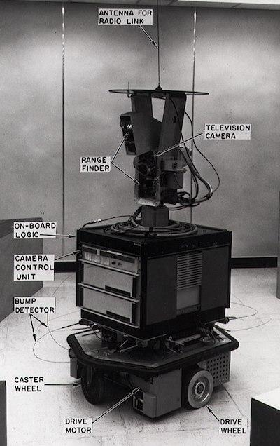

<!--
CO_OP_TRANSLATOR_METADATA:
{
  "original_hash": "b2d11df10030cacc41427a1fbc8bc8f1",
  "translation_date": "2025-08-29T17:41:51+00:00",
  "source_file": "1-Introduction/2-history-of-ML/README.md",
  "language_code": "mr"
}
-->
# मशीन लर्निंगचा इतिहास

> स्केच नोट: [Tomomi Imura](https://www.twitter.com/girlie_mac)

## [पूर्व-व्याख्यान प्रश्नमंजुषा](https://gray-sand-07a10f403.1.azurestaticapps.net/quiz/3/)

---

> 🎥 वरील प्रतिमेवर क्लिक करा आणि या धड्याचा व्हिडिओ पहा.

या धड्यात आपण मशीन लर्निंग आणि कृत्रिम बुद्धिमत्तेच्या इतिहासातील महत्त्वाच्या टप्प्यांवर चर्चा करू.

कृत्रिम बुद्धिमत्ता (AI) क्षेत्राचा इतिहास मशीन लर्निंगच्या इतिहासाशी जोडलेला आहे, कारण ML च्या अल्गोरिदम्स आणि संगणकीय प्रगतींनी AI च्या विकासाला चालना दिली. लक्षात ठेवणे उपयुक्त आहे की, जरी ही क्षेत्रे स्वतंत्र अभ्यासाच्या स्वरूपात 1950 च्या दशकात आकार घेऊ लागली, तरी [अल्गोरिदमिक, सांख्यिकीय, गणितीय, संगणकीय आणि तांत्रिक शोध](https://wikipedia.org/wiki/Timeline_of_machine_learning) या काळापूर्वी आणि त्याच्याशी ओव्हरलॅप झाले होते. खरं तर, लोक [शेकडो वर्षांपासून](https://wikipedia.org/wiki/History_of_artificial_intelligence) या प्रश्नांवर विचार करत आहेत: 'विचार करणारी मशीन' या संकल्पनेच्या बौद्धिक पायाभूत गोष्टींवर हा लेख चर्चा करतो.

---
## महत्त्वाचे शोध

- 1763, 1812 [Bayes Theorem](https://wikipedia.org/wiki/Bayes%27_theorem) आणि त्याचे पूर्ववर्ती. हा प्रमेय आणि त्याचे उपयोग संभाव्यता वर्णन करतात, जे पूर्वीच्या ज्ञानावर आधारित एखाद्या घटनेच्या घडण्याची शक्यता सांगतात.
- 1805 [Least Square Theory](https://wikipedia.org/wiki/Least_squares) फ्रेंच गणितज्ञ Adrien-Marie Legendre यांनी मांडलेली. ही सिद्धांत, जी आपण Regression युनिटमध्ये शिकणार आहात, डेटा फिटिंगसाठी मदत करते.
- 1913 [Markov Chains](https://wikipedia.org/wiki/Markov_chain), रशियन गणितज्ञ Andrey Markov यांच्या नावावर आधारित, पूर्वस्थितीवर आधारित संभाव्य घटनांच्या अनुक्रमाचे वर्णन करण्यासाठी वापरली जाते.
- 1957 [Perceptron](https://wikipedia.org/wiki/Perceptron) हा एक प्रकारचा रेषीय वर्गीकरण करणारा अल्गोरिदम आहे, जो अमेरिकन मानसशास्त्रज्ञ Frank Rosenblatt यांनी शोधला आणि जो डीप लर्निंगच्या प्रगतीसाठी आधारभूत ठरला.

---

- 1967 [Nearest Neighbor](https://wikipedia.org/wiki/Nearest_neighbor) हा अल्गोरिदम मूळतः मार्ग शोधण्यासाठी तयार करण्यात आला होता. ML संदर्भात तो नमुने ओळखण्यासाठी वापरला जातो.
- 1970 [Backpropagation](https://wikipedia.org/wiki/Backpropagation) [feedforward neural networks](https://wikipedia.org/wiki/Feedforward_neural_network) प्रशिक्षणासाठी वापरला जातो.
- 1982 [Recurrent Neural Networks](https://wikipedia.org/wiki/Recurrent_neural_network) हे कृत्रिम न्यूरल नेटवर्क्स आहेत, जे feedforward neural networks वर आधारित आहेत आणि तात्कालिक ग्राफ तयार करतात.

✅ थोडे संशोधन करा. ML आणि AI च्या इतिहासातील आणखी कोणते महत्त्वाचे टप्पे आहेत?

---
## 1950: विचार करणाऱ्या मशीनची संकल्पना

Alan Turing, एक विलक्षण व्यक्ती ज्याला [2019 मध्ये](https://wikipedia.org/wiki/Icons:_The_Greatest_Person_of_the_20th_Century) सार्वजनिक मताने 20व्या शतकातील सर्वात महान वैज्ञानिक म्हणून निवडले गेले, 'विचार करू शकणाऱ्या मशीन' या संकल्पनेचा पाया घालण्यात मदत केल्याचे श्रेय दिले जाते. त्यांनी [Turing Test](https://www.bbc.com/news/technology-18475646) तयार करून या संकल्पनेच्या विरोधकांशी आणि स्वतःच्या अनुभवजन्य पुराव्याच्या गरजेशी सामना केला, ज्याचा अभ्यास आपण NLP धड्यांमध्ये करणार आहात.

---
## 1956: डार्टमथ समर रिसर्च प्रोजेक्ट

"डार्टमथ समर रिसर्च प्रोजेक्ट ऑन आर्टिफिशियल इंटेलिजन्स हे कृत्रिम बुद्धिमत्ता क्षेत्रासाठी एक महत्त्वपूर्ण घटना होती," आणि याच ठिकाणी 'कृत्रिम बुद्धिमत्ता' हा शब्द तयार करण्यात आला ([source](https://250.dartmouth.edu/highlights/artificial-intelligence-ai-coined-dartmouth)).

> शिकण्याचा प्रत्येक पैलू किंवा बुद्धिमत्तेची कोणतीही वैशिष्ट्ये इतक्या अचूकपणे वर्णन करता येऊ शकतात की मशीनला ते अनुकरण करता येईल.

---

प्रमुख संशोधक, गणिताचे प्राध्यापक John McCarthy, "शिकण्याचा प्रत्येक पैलू किंवा बुद्धिमत्तेची कोणतीही वैशिष्ट्ये इतक्या अचूकपणे वर्णन करता येऊ शकतात की मशीनला ते अनुकरण करता येईल" या गृहीतकाच्या आधारावर पुढे जाण्याची आशा व्यक्त केली. सहभागी व्यक्तींमध्ये Marvin Minsky यांचाही समावेश होता, जो या क्षेत्रातील आणखी एक दिग्गज होता.

या कार्यशाळेने "प्रतीकात्मक पद्धतींचा उदय, मर्यादित डोमेनवर केंद्रित प्रणाली (प्रारंभिक तज्ज्ञ प्रणाली), आणि deductive प्रणाली विरुद्ध inductive प्रणाली" यासह अनेक चर्चांना चालना दिली ([source](https://wikipedia.org/wiki/Dartmouth_workshop)).

---
## 1956 - 1974: "सुवर्णयुग"

1950 च्या दशकापासून ते 70 च्या दशकाच्या मध्यापर्यंत, AI अनेक समस्या सोडवू शकेल अशी आशा मोठ्या प्रमाणावर होती. 1967 मध्ये Marvin Minsky यांनी आत्मविश्वासाने सांगितले की "एका पिढीच्या आत ... 'कृत्रिम बुद्धिमत्ता' तयार करण्याचा प्रश्न मोठ्या प्रमाणात सोडवला जाईल." (Minsky, Marvin (1967), Computation: Finite and Infinite Machines, Englewood Cliffs, N.J.: Prentice-Hall)

नैसर्गिक भाषा प्रक्रिया संशोधन फुलले, शोध अधिक परिष्कृत आणि शक्तिशाली बनला, आणि 'मायक्रो-वर्ल्ड्स' ही संकल्पना तयार झाली, जिथे साध्या कार्ये साध्या भाषेतील सूचनांचा वापर करून पूर्ण केली गेली.

---

सरकारी संस्थांकडून संशोधनाला चांगले अनुदान मिळाले, संगणकीय आणि अल्गोरिदम्समध्ये प्रगती झाली, आणि बुद्धिमान मशीनचे प्रोटोटाइप तयार करण्यात आले. या मशीनमध्ये काही उदाहरणे आहेत:

* [Shakey the robot](https://wikipedia.org/wiki/Shakey_the_robot), जो कार्य 'बुद्धिमत्तेने' कसे करायचे ते ठरवू शकतो.

    
    > Shakey, 1972 मध्ये

---

* Eliza, एक प्रारंभिक 'चॅटरबॉट', लोकांशी संवाद साधू शकतो आणि एक प्राथमिक 'थेरपिस्ट' म्हणून काम करू शकतो. NLP धड्यांमध्ये तुम्ही Eliza बद्दल अधिक शिकाल.

    
    > Eliza, एक चॅटबॉट

---

* "Blocks world" हे मायक्रो-वर्ल्डचे एक उदाहरण होते जिथे ब्लॉक्स स्टॅक आणि सॉर्ट करता येत होते, आणि मशीनला निर्णय घेण्याचे शिक्षण देण्याचे प्रयोग केले जाऊ शकले. [SHRDLU](https://wikipedia.org/wiki/SHRDLU) सारख्या लायब्ररीसह तयार केलेल्या प्रगतींनी भाषा प्रक्रिया पुढे नेली.

    

    > 🎥 वरील प्रतिमेवर क्लिक करा: SHRDLU सह ब्लॉक्स वर्ल्ड

---
## 1974 - 1980: "AI हिवाळा"

1970 च्या दशकाच्या मध्यापर्यंत, 'बुद्धिमान मशीन' तयार करण्याची जटिलता कमी लेखली गेली होती आणि उपलब्ध संगणकीय शक्तीच्या तुलनेत त्याचे वचन अतिशयोक्तीपूर्ण असल्याचे स्पष्ट झाले. निधी कमी झाला आणि क्षेत्रातील आत्मविश्वास कमी झाला. आत्मविश्वासावर परिणाम करणाऱ्या काही मुद्द्यांमध्ये समाविष्ट होते:
---
- **मर्यादा**. संगणकीय शक्ती खूप मर्यादित होती.
- **संयोजनात्मक स्फोट**. संगणकांकडून अधिक अपेक्षा केल्यामुळे प्रशिक्षित करावयाच्या पॅरामीटर्सची संख्या घातांकीय पद्धतीने वाढली, परंतु संगणकीय शक्ती आणि क्षमता यामध्ये समांतर प्रगती झाली नाही.
- **डेटाची कमतरता**. डेटाची कमतरता होती ज्यामुळे अल्गोरिदम्सची चाचणी, विकास आणि सुधारणा करण्याची प्रक्रिया अडथळ्यात आली.
- **आपण योग्य प्रश्न विचारतो आहोत का?**. विचारले जात असलेल्या प्रश्नांवरच प्रश्न उपस्थित होऊ लागले. संशोधकांना त्यांच्या दृष्टिकोनांबद्दल टीका सहन करावी लागली:
  - Turing चाचण्यांवर 'चिनी खोली सिद्धांत' यासह प्रश्न उपस्थित करण्यात आले, ज्याने असे मांडले की, "डिजिटल संगणक प्रोग्रामिंगमुळे भाषा समजल्यासारखे वाटू शकते परंतु वास्तविक समज निर्माण करू शकत नाही." ([source](https://plato.stanford.edu/entries/chinese-room/))
  - समाजात कृत्रिम बुद्धिमत्ता, जसे की "थेरपिस्ट" ELIZA, सादर करण्याच्या नैतिकतेवर प्रश्न उपस्थित करण्यात आले.

---

त्याच वेळी, विविध AI विचारधारा तयार होऊ लागल्या. ["scruffy" vs. "neat AI"](https://wikipedia.org/wiki/Neats_and_scruffies) पद्धतींमध्ये द्वंद्व निर्माण झाले. _Scruffy_ प्रयोगशाळा तासन्तास प्रोग्राम्समध्ये बदल करत होत्या जोपर्यंत त्यांना हवे असलेले परिणाम मिळत नाहीत. _Neat_ प्रयोगशाळा "तार्किक आणि औपचारिक समस्या सोडवण्यावर लक्ष केंद्रित करत होत्या". ELIZA आणि SHRDLU हे प्रसिद्ध _scruffy_ प्रणाली होते. 1980 च्या दशकात, ML प्रणाली पुनरुत्पादनीय बनवण्याची मागणी वाढल्यामुळे, _neat_ दृष्टिकोन हळूहळू पुढे आला कारण त्याचे परिणाम अधिक स्पष्टपणे समजावून सांगता येतात.

---
## 1980s तज्ज्ञ प्रणाली

जसे क्षेत्र वाढले, त्याचा व्यवसायासाठी होणारा फायदा स्पष्ट झाला, आणि 1980 च्या दशकात 'तज्ज्ञ प्रणाली' चा प्रसार झाला. "तज्ज्ञ प्रणाली कृत्रिम बुद्धिमत्ता (AI) सॉफ्टवेअरच्या पहिल्या खऱ्या यशस्वी प्रकारांपैकी एक होती." ([source](https://wikipedia.org/wiki/Expert_system)).

हा प्रकार प्रत्यक्षात _हायब्रिड_ होता, ज्यामध्ये व्यवसायाच्या गरजा परिभाषित करणारे नियम इंजिन आणि नियम प्रणालीचा उपयोग करून नवीन तथ्ये शोधण्यासाठी एक अनुमान इंजिन समाविष्ट होते.

या काळात न्यूरल नेटवर्क्सकडे अधिक लक्ष दिले गेले.

---
## 1987 - 1993: AI 'थंडावलेला'

विशेष तज्ज्ञ प्रणाली हार्डवेअरचा प्रसार झाल्यामुळे तो खूपच विशेष झाला. वैयक्तिक संगणकांचा उदय देखील या मोठ्या, विशेष, केंद्रीकृत प्रणालींशी स्पर्धा करत होता. संगणकीय लोकशाहीकरण सुरू झाले होते, आणि शेवटी यामुळे मोठ्या डेटाच्या आधुनिक स्फोटाला मार्ग मिळाला.

---
## 1993 - 2011

या कालखंडाने ML आणि AI साठी नवीन युग पाहिले ज्यामुळे पूर्वी डेटाची कमतरता आणि संगणकीय शक्तीच्या अभावामुळे निर्माण झालेल्या काही समस्या सोडवता आल्या. डेटाची मात्रा वेगाने वाढू लागली आणि अधिक व्यापकपणे उपलब्ध होऊ लागली, चांगल्या आणि वाईटासाठी, विशेषतः 2007 च्या सुमारास स्मार्टफोनच्या आगमनासह. संगणकीय शक्ती घातांकीय पद्धतीने वाढली, आणि अल्गोरिदम्स त्याच्याबरोबर विकसित झाले. क्षेत्राने परिपक्वता मिळवायला सुरुवात केली कारण भूतकाळातील मुक्तपणे चालणारे दिवस खऱ्या शिस्तीत रूपांतरित होऊ लागले.

---
## आज

आज मशीन लर्निंग आणि AI आपल्या जीवनाच्या जवळजवळ प्रत्येक भागाला स्पर्श करतात. या युगात या अल्गोरिदम्सचा मानवी जीवनावर होणाऱ्या परिणामांचा काळजीपूर्वक अभ्यास करण्याची गरज आहे. Microsoft चे Brad Smith म्हणतात, "माहिती तंत्रज्ञान मूलभूत मानवी अधिकार संरक्षणांसारख्या मुद्द्यांना उभे करते जसे की गोपनीयता आणि अभिव्यक्ती स्वातंत्र्य. हे मुद्दे या उत्पादने तयार करणाऱ्या तंत्रज्ञान कंपन्यांसाठी जबाबदारी वाढवतात. आमच्या मते, ते विचारशील सरकारी नियमन आणि स्वीकारार्ह उपयोगांभोवती मानदंडांच्या विकासासाठी देखील कॉल करतात" ([source](https://www.technologyreview.com/2019/12/18/102365/the-future-of-ais-impact-on-society/)).

---

भविष्य काय आहे हे पाहायचे आहे, परंतु या संगणकीय प्रणाली आणि त्यावर चालणारे सॉफ्टवेअर आणि अल्गोरिदम्स समजून घेणे महत्त्वाचे आहे. आम्हाला आशा आहे की हा अभ्यासक्रम तुम्हाला चांगले समजून घेण्यास मदत करेल जेणेकरून तुम्ही स्वतः निर्णय घेऊ शकाल.

> 🎥 वरील प्रतिमेवर क्लिक करा: Yann LeCun या व्याख्यानात डीप लर्निंगच्या इतिहासावर चर्चा करतात

---
## 🚀आव्हान

या ऐतिहासिक क्षणांपैकी एका क्षणाचा अभ्यास करा आणि त्यामागील लोकांबद्दल अधिक जाणून घ्या. तेथील पात्रे खूपच मनोरंजक आहेत, आणि कोणताही वैज्ञानिक शोध सांस्कृतिक निर्वातात तयार झाला नाही. तुम्हाला काय सापडते?

## [व्याख्यानानंतरची प्रश्नमंजुषा](https://gray-sand-07a10f403.1.azurestaticapps.net/quiz/4/)

---
## पुनरावलोकन आणि स्व-अभ्यास

पाहण्यासाठी आणि ऐकण्यासाठी काही गोष्टी येथे दिल्या आहेत:

[Amy Boyd यांचा AI च्या उत्क्रांतीवर चर्चा करणारा पॉडकास्ट](http://runasradio.com/Shows/Show/739)

---

## असाइनमेंट

[एक टाइमलाइन तयार करा](assignment.md)

---

**अस्वीकरण**:  
हा दस्तऐवज AI भाषांतर सेवा [Co-op Translator](https://github.com/Azure/co-op-translator) चा वापर करून भाषांतरित करण्यात आला आहे. आम्ही अचूकतेसाठी प्रयत्नशील असलो तरी, कृपया लक्षात घ्या की स्वयंचलित भाषांतरांमध्ये त्रुटी किंवा अचूकतेचा अभाव असू शकतो. मूळ भाषेतील दस्तऐवज हा अधिकृत स्रोत मानला जावा. महत्त्वाच्या माहितीसाठी, व्यावसायिक मानवी भाषांतराची शिफारस केली जाते. या भाषांतराचा वापर केल्यामुळे उद्भवणाऱ्या कोणत्याही गैरसमज किंवा चुकीच्या अर्थासाठी आम्ही जबाबदार राहणार नाही.