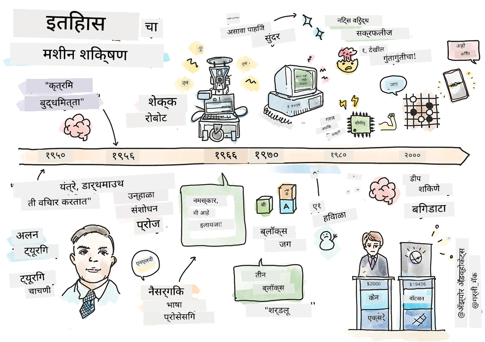
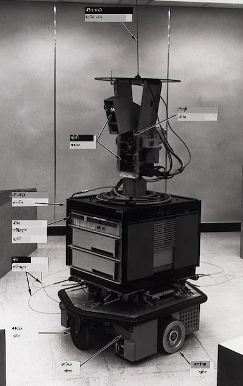
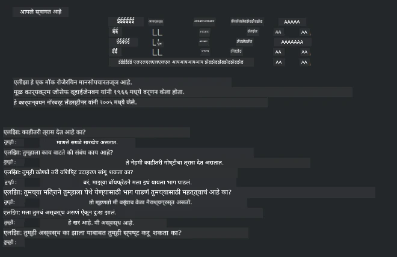

# मशीन लर्निंगचा इतिहास

> स्केचनोट [टॉमоми इमुरा](https://www.twitter.com/girlie_mac) यांनी तयार केलेला

## [पूर्व-वक्तृत्व क्विझ](https://ff-quizzes.netlify.app/en/ml/)

---

> 🎥 या धड्याद्वारे काम करत असलेल्या एका लहान व्हिडिओसाठी वरील प्रतिमेवर क्लिक करा.

या धड्यात, आपण मशीन लर्निंग आणि कृत्रिम बुद्धिमत्तेच्या इतिहासातील प्रमुख टप्प्यांवरून प्रवास करू.

कृत्रिम बुद्धिमत्ता (एआय) या क्षेत्राचा इतिहास मशीन लर्निंगच्या इतिहासाशी गुंतलेला आहे, कारण एमएलला आधार देणारे अल्गोरिदम व संगणकीय प्रगती एआयच्या विकासात मदत करतात. लक्षात ठेवणे उपयोगी आहे की, या क्षेत्रांनी वेगळ्या संशोधनाच्या भागांप्रमाणे 1950च्या दशकात स्वरूप घेतले, परंतु महत्त्वपूर्ण [अल्गोरिदमिक, सांख्यिकीय, गणितीय, संगणकीय व तांत्रिक शोध] (https://wikipedia.org/wiki/Timeline_of_machine_learning) यांनी या काळापूर्वी आणि त्याच वेळी कार्य केले. खरंतर, लोक या प्रश्नांवर [शेकडा वर्षे](https://wikipedia.org/wiki/History_of_artificial_intelligence) विचार करत आले आहेत: हा लेख 'विचार करणाऱ्या यंत्राच्या' या कल्पनेच्या ऐतिहासिक मानसिक आधारांबाबत चर्चा करतो.

---
## महत्त्वाचे शोध

- 1763, 1812 [बेस प्रमेय](https://wikipedia.org/wiki/Bayes%27_theorem) आणि त्याच्या पूर्वज. हे प्रमेय आणि त्याच्या अनुप्रयोगांवर आधारित परिणामकारकता आहे, जे पूर्वीच्या माहितीवर आधारित घटनेच्या शक्यतेचे वर्णन करतात.
- 1805 फ्रेंच गणितज्ञ अड्रियन-मारी लेजंद्र यांनी तयार केलेली [लीस्ट स्क्वेअर थिअरी](https://wikipedia.org/wiki/Least_squares). ही सिद्धांत, जी आपण आमच्या रिग्रेशन युनिटमध्ये शिकाल, डेटा फिटिंगसाठी मदत करते.
- 1913 [मार्कोव्ह चेन](https://wikipedia.org/wiki/Markov_chain), रशियन गणितज्ञ आंद्रे मार्कोव्ह यांच्या नावावर, ही शक्य घटनांच्या अनुक्रमाचे वर्णन करण्यासाठी वापरली जाते.
- 1957 [परसेप्ट्रॉन](https://wikipedia.org/wiki/Perceptron) हे अमेरिकन मानसशास्त्रज्ञ फ्रँक रोजनब्लॅट यांनी शोधलेले एक रेषीय वर्गीकरण आहे जे डीप लर्निंगमध्ये प्रगतीला आधार देते.

---

- 1967 [निकटतम शेजारी](https://wikipedia.org/wiki/Nearest_neighbor) हा मूळतः मार्ग शोधण्यासाठी तयार केलेला अल्गोरिदम आहे. एमएल संदर्भात, तो पॅटर्न ओळखण्यासाठी वापरला जातो.
- 1970 [बॅकप्रोपगेशन](https://wikipedia.org/wiki/Backpropagation) वापरून [फीडफॉरवर्ड न्यूरल नेटवर्क](https://wikipedia.org/wiki/Feedforward_neural_network) प्रशिक्षित केले जातात.
- 1982 [रेक करण्य न्यूरल नेटवर्क](https://wikipedia.org/wiki/Recurrent_neural_network) हा फीडफॉरवर्ड न्यूरल नेटवर्कमधून तयार केलेला कृत्रिम न्यूरल नेटवर्क आहे जो कालक्रमिक ग्राफ तयार करतो.

✅ थोडे संशोधन करा. मशीन लर्निंग आणि AI च्या इतिहासातील दुसरे कोणते महत्त्वाचे तारखा लक्ष वेधून घेतात?

---
## 1950: विचार करणारी यंत्रे

अॅलन ट्युरिंग, एक खरोखरच विलक्षण व्यक्ती ज्यास [2019 मध्ये जनतेने](https://wikipedia.org/wiki/Icons:_The_Greatest_Person_of_the_20th_Century) 20 व्या शतकाचा महानतम शास्त्रज्ञ म्हणून निवडले, 'विचार करू शकणाऱ्या यंत्राच्या' संकल्पनेची पायाभरणी करण्यात मदत केल्याचा दावा केला जातो. त्यांनी विरोधकांशी संघर्ष केला आणि या संकल्पनेच्या अनुभवजन्य पुराव्याची गरज भागवण्यासाठी [ट्युरिंग टेस्ट](https://www.bbc.com/news/technology-18475646) तयार केली, जी आपण आपल्या NLP धड्यांत पाहणार आहोत.

---
## 1956: डार्टमाऊथ समर रिसर्च प्रोजेक्ट

"कृत्रिम बुद्धिमत्तेवरील डार्टमाऊथ समर रिसर्च प्रोजेक्ट हा एआय क्षेत्रासाठी एक प्रमुख घटना होती," आणि येथेच 'कृत्रिम बुद्धिमत्ता' या संज्ञेची निर्मिती झाली ([स्रोत](https://250.dartmouth.edu/highlights/artificial-intelligence-ai-coined-dartmouth)).

> शिक्षणाचा किंवा बुद्धिमत्तेच्या कोणत्याही वैशिष्ट्याचा प्रत्येक पैलू इतक्या अचूकतेने वर्णन केला जाऊ शकतो की ते अनुकरण करणारे यंत्र तयार केले जाऊ शकते.

---

प्रकल्पाचे प्रमुख संशोधक, गणितप्रोफेसर जॉन मॅकार्थी, "हा अनुमान आहे की शिक्षण किंवा बुद्धिमत्तेच्या कोणत्याही वैशिष्ट्याला इतक्या अचूकतेने वर्णन करता येते की यंत्र तयार करून ते अनुकरण करता येईल" अशी आशा बाळगत होते. सहभागी यामध्ये क्षेत्रातील दुसरे एक दिग्गज, मार्विन मिंस्की होते.

या कार्यशाळेने "प्रतीकात्मक पद्धतींचा उदय, मर्यादित क्षेत्रांवर लक्ष केंद्रीत सिस्टीम्स (प्रारंभिक विशेषज्ञ प्रणाली), आणि सूक्ष्म प्रणाली विरुद्ध प्रेरित प्रणाली" या विषयांवर अनेक चर्चांना प्रोत्साहन दिले होते. ([स्रोत](https://wikipedia.org/wiki/Dartmouth_workshop)).

---
## 1956 - 1974: "सुवर्णकाल"

1950 पासून मध्य 70 पर्यंत, AI अनेक समस्या सोडवेल अशी आशा होती. 1967 मध्ये, मार्विन मिंस्की आत्मविश्वासाने म्हणाले की "एक पिढीच्या आत ... 'कृत्रिम बुद्धिमत्ता' तयार करण्याचा प्रश्न संपुष्टात येईल." (मिंस्की, मार्विन (1967), कम्प्युटेशन: फाइनेट आणि इनफाइनेट मशिन्स, इंग्लवुड क्लिफ्स, एन.जे.: प्रेंटिस-हॉल)

नॅचरल लँग्वेज प्रोसेसिंग संशोधनाला चालना मिळाली, शोधाचा विकास झाला आणि शक्तिशाली झाला, तसेच 'मायक्रो-वर्ल्ड' संकल्पना निर्माण झाली, जिथे साध्या भाषेतील सूचनांद्वारे सोप्या कामांना पूर्ण केले गेले.

---

संशोधनासाठी सरकारी एजन्सीजकडून चांगली आर्थिक मदत मिळाली, संगणक व अल्गोरिदममध्ये प्रगती झाली, आणि बुद्धिमान यंत्रांच्या प्रोटोटाइप तयार झाले. यापैकी काही यंत्रे म्हणजे:

* [शेकी द रोबोट](https://wikipedia.org/wiki/Shakey_the_robot), ज्याला बुद्धिमत्तेने काम कसे करायचे याचा निर्णय घेता येई.

    
    > 1972 मधील शेकी

---

* एलिझा, एक आग्ली 'चॅटरबोट', जी लोकांशी संवाद साधू शकत असे आणि प्राथमिक 'थेरपिस्ट' म्हणून काम करू शकत असे. NLP धड्यांत आपल्याला एलिझा बद्दल अधिक माहिती मिळेल.

    
    > एलिझाचा एक आवृत्ती, एक चॅटबॉट

---

* "ब्लॉक्स वर्ल्ड" हा एक मायक्रो-वर्ल्ड होता जिथे ब्लॉक्सना ढगावता येत असे आणि छाटता येत असे, आणि मशीनला निर्णय घेण्यासाठी शिकवण्याचा प्रयोग केला जात असे. [SHRDLU](https://wikipedia.org/wiki/SHRDLU) सारख्या लायब्ररींच्या मदतीने भाषेचे संशोधन पुढे चालले.

    

    > 🎥 वरील प्रतिमेवर क्लिक करा व्हिडिओसाठी: SHRDLU सह ब्लॉक्स वर्ल्ड

---
## 1974 - 1980: "एआय विंटर"

मध्य 1970 च्या दशकाच्या आसपास, 'बुद्धिमान यंत्रे' तयार करण्याची गुंतागुंत खूप कमी गणली गेली होती आणि उपलब्ध संगणकीय क्षमता विचारात घेता त्याचे आश्वासन जास्त दाखवण्यात आले होते, हे स्पष्ट झाले. निधी संपुष्टात आला आणि आत्मविश्वास कमी झाला. काही मुद्दे जे आत्मविश्वासावर परिणाम करत होते त्यात समाविष्ट आहेत:
---
- **मर्यादा**. संगणकीय शक्ति खूप मर्यादित होती.
- **संयोजक विस्फोट**. जास्त मागणीमुळे प्रशिक्षित करावयाच्या पॅरामीटर्सची संख्या घनघोरपणे वाढली, पण संगणकीय शक्ति आणि क्षमता यातील समान विकास नव्हता.
- **डेटाची कमतरता**. डेटा कमतरतेमुळे अल्गोरिदम चाचणी, विकास, आणि सुधारणेची प्रक्रिया बाधित झाली.
- **आपण योग्य प्रश्न विचारत आहोत काय?**. विचारलेल्या प्रश्नांवरच प्रश्न उपस्थित होऊ लागले. संशोधकांना त्यांच्या दृष्टिकोनांचा टीका सहन करावी लागली:
  - ट्युरिंग चाचणीवर प्रश्न उभा राहिला, जसे की 'चायनीज रूम थिअरी'ने मांडले की, "डिजिटल संगणकाला प्रोग्रामिंग करून तो भाषा समजत असल्यासारखा दिसू शकतो पण खरे समजूतदारपणा निर्माण करू शकत नाही." ([स्रोत](https://plato.stanford.edu/entries/chinese-room/))
  - समाजात 'थेरपिस्ट' एलिझा सारख्या कृत्रिम बुद्धिमत्ता आणण्याच्या नैतिकतेवर प्रश्न उपस्थित झाला.

---

त्याच वेळी, विविध AI विचारसरणी तयार होऊ लागल्या. ["स्क्रफी" विरुद्ध "नीट AI"](https://wikipedia.org/wiki/Neats_and_scruffies) या द्वैताने मार्ग दाखविला. _स्क्रफी_ प्रयोगशाळा तासोंत प्रोग्राममध्ये बदल करत काही निष्कर्ष मिळवायचा प्रयत्न करत असे. _नीट_ प्रयोगशाळा "तार्किक आणि औपचारिक समस्या सोडवण्यावर" लक्ष केंद्रित करत असे. एलिझा आणि SHRDLU हे प्रसिद्ध _स्क्रफी_ प्रणाली होती. 1980 च्या दशकात, जेव्हा ML प्रणाली पुनरुत्पादक बनवण्याची मागणी वाढली, तेव्हा _नीट_ दृष्टिकोन हळूहळू आघाडीवर आला कारण त्याचे परिणाम अधिक स्पष्ट होते.

---
## 1980 चे दशक - विशेषज्ञ प्रणाली

क्षेत्र वाढल्यामुळे त्याचा व्यवसायात उपयोग स्पष्ट झाला, आणि 1980 च्या दशकात 'विशेषज्ञ प्रणाली'ची प्रचंड लोकप्रियता झाली. "विशेषज्ञ प्रणाली ही कृत्रिम बुद्धिमत्तेच्या (AI) खऱ्या यशस्वी सॉफ्टवेअर प्रकारांपैकी प्राथमिक होती." ([स्रोत](https://wikipedia.org/wiki/Expert_system)).

ही प्रणाली प्रत्यक्षात _हायब्रिड_ आहे, ज्यात व्यवसायिक आवश्यकतांसाठी नियम इंजिन आणि नियम प्रणालीचा उपयोग करून नवीन तथ्ये शोधणारी इनफरन्स इंजिन असते.

या काळात न्यूरल नेटवर्कला वाढती लक्षवेधी झाली.

---
## 1987 - 1993: AI 'चिल'

विशेषज्ञ प्रणाली हार्डवेअरच्या प्रचंड वाढीमुळे ती खूप विशेषीकृत झाली. पर्सनल कॉम्प्युटरचा उदय यांसोबत स्पर्धा करू लागला. संगणक सुलभ झाली आणि मग मोठा डेटा संकटकाळातून बाहेर आला.

---
## 1993 - 2011

या काळात एमएल आणि AI ला आधीच्या डेटाची आणि संगणकीय शक्तीची कमतरता दूर करून काही समस्या सोडवण्याची संधी मिळाली. डेटाची प्रमाणिक वाढ झाली आणि त्याचा अधिक व्यापक उपयोग होऊ लागला, विशेषतः 2007 नजीक स्मार्टफोनच्या उदयामुळे. संगणकीय शक्ति घनघोर वाढली आणि अल्गोरिदमचीही प्रगती झाली. क्षेत्र अधिक प्रगल्भ झाले कारण आधीच्या मुक्त दिवसानी शिस्तबद्ध क्षेत्राला आकार दिला.

---
## आज

आज मशीन लर्निंग आणि AI आपल्या जीवनाचा जवळपास प्रत्येक भागाशी निगडित आहे. या युगात या अल्गोरिदम्सचे धोके आणि संभाव्य परिणाम समजून घेणे आवश्यक आहे. मायक्रोसॉफ्टचे ब्रॅड स्मिथ म्हणाले आहेत, "माहिती तंत्रज्ञानानं गोपनीयता आणि अभिव्यक्ती स्वातंत्र्य यांसारख्या मूलतत्त्व मानवाधिकारांच्या संरक्षणाशी संबंधित समस्या वाढविल्या आहेत. यामुळे तंत्रज्ञान कंपन्यांवर जबाबदारी वाढते. आमच्या मते, या उत्पादनांच्या बाबतीत विचारपूर्वक सरकारनियमन आणि स्वीकार्य वापरासंबंधी नियम विकसित होणे आवश्यक आहे." ([स्रोत](https://www.technologyreview.com/2019/12/18/102365/the-future-of-ais-impact-on-society/)).

---

भविष्य काय घेऊन येईल हे पाहणे बाकी आहे, पण या संगणक प्रणाली आणि त्यावर चालणारे सॉफ्टवेअर व अल्गोरिदम समजून घेणे महत्त्वाचे आहे. आम्ही आशा करतो की या अभ्यासक्रमामुळे आपल्याला चांगले समज प्राप्त होईल जेणेकरून आपण स्वतः निर्णय घेऊ शकता.

> 🎥 वरील प्रतिमेवर क्लिक करा व्हिडिओसाठी: यान लेकून डीप लर्निंगचा इतिहास या व्याख्यानात स्पष्ट करतात

---
## 🚀आव्हान

या ऐतिहासिक क्षणांपैकी एका मध्ये खोल संशोधन करा आणि त्यांच्या मागील लोकांबद्दल अधिक जाणून घ्या. येथे मनोरंजक व्यक्तिमत्त्वे आहेत, आणि कोणत्याही वैज्ञानिक शोधाची निर्मिती केवळ संस्कृतीच्या रिकामटेकड्याने केली जात नाही. आपण काय शोधता?

## [पश्चात-वक्तृत्व क्विझ](https://ff-quizzes.netlify.app/en/ml/)

---
## पुनरावलोकन व स्वअध्ययन

येथे काही पाहायला आणि ऐकायला आयटम आहेत:

[एमी बॉयड इथे AI च्या उत्क्रांतीवर चर्चा करतात](http://runasradio.com/Shows/Show/739)

---

## असाइनमेंट

[एक टाइमलाईन तयार करा](assignment.md)

---

<!-- CO-OP TRANSLATOR DISCLAIMER START -->
**अस्वीकरण**:
हा दस्तऐवज AI भाषांतर सेवा [Co-op Translator](https://github.com/Azure/co-op-translator) चा वापर करून अनुवादित केला आहे. जरी आम्ही अचूकतेसाठी प्रयत्न करतो, तरी कृपया लक्षात घ्या की स्वयंचलित भाषांतरांमध्ये त्रुटी किंवा अचूकतेची कमतरता असू शकते. मूळ दस्तऐवज त्याच्या मूळ भाषेत अधिकृत स्रोत मानला पाहिजे. महत्त्वाची माहिती असल्यास, व्यावसायिक मानवी भाषांतराची शिफारस केली जाते. या भाषांतराच्या वापरामुळे उद्भवणाऱ्या कोणत्याही गैरसमज किंवा चुकीच्या अर्थलावणीसाठी आम्ही जबाबदार नाही.
<!-- CO-OP TRANSLATOR DISCLAIMER END -->