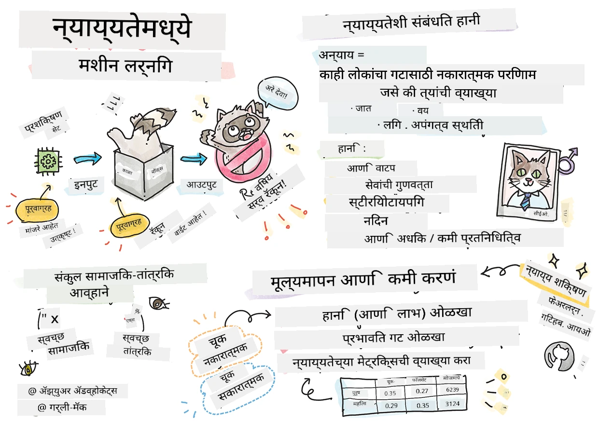

# जबाबदार AI सह मशीन लर्निंग सोल्यूशन्स तयार करणे
 

> स्केचनोट [Tomomi Imura](https://www.twitter.com/girlie_mac) यांच्याकडून

## [पूर्व-व्याख्यान क्विझ](https://ff-quizzes.netlify.app/en/ml/)
 
## परिचय

या अभ्यासक्रमात, आपण शोधायला सुरुवात कराल की मशीन लर्निंग आपले दररोजचे जीवन कसे प्रभावित करत आहे आणि करीत आहे. अगोदरच, प्रणाली आणि मॉडेल दररोजच्या निर्णय घेण्यात सहभागी आहेत, जसे की आरोग्य देखभाल निदान, कर्ज मंजुरी किंवा फसवणूक शोधणे. त्यामुळे, हे मॉडेल विश्वसनीय निकाल देण्यासाठी चांगले काम करणे आवश्यक आहे. कोणत्याही सॉफ्टवेअर अनुप्रयोगाप्रमाणे, AI प्रणाली अपेक्षा पूर्ण करू शकत नाहीत किंवा अपेक्षित निकाल देऊ शकतात. त्यामुळे, AI मॉडेलच्या वर्तनाचे समजून घेणे आणि स्पष्ट करणे आवश्यक आहे.

विचार करा की जेव्हा आपण मॉडेल तयार करताना वापरत असलेला डेटा काही विशिष्ट लोकसंख्याशास्त्र जसे की जात, लिंग, राजकीय दृष्टीकोन, धर्म किंवा असममितपणे अशा लोकसंख्यांसाठी प्रतिनिधित्व करणारा नसेल तर काय होईल? जेव्हा मॉडेलचे परिणाम एखाद्या लोकसंख्यास प्राधान्य देण्यासाठी समजले जातात तेव्हा काय होते? अनुप्रयोगासाठी काय परिणाम होतो? शिवाय, जेव्हा मॉडेलचा परिणाम प्रतिकूल असेल आणि लोकांसाठी हानिकारक असेल तेव्हा काय होईल? AI प्रणालींच्या वर्तनासाठी कोण जबाबदार आहे? या काही प्रश्नांचा आपण या अभ्यासक्रमात शोध घेऊ.

या धडे दरम्यान, आपण:

- मशीन लर्निंगमधील निष्पक्षतेचे आणि निष्पक्षतेशी संबंधित हानिकारक परिणाम यांचे महत्त्व जाणून घ्या.
- विश्वासार्हता आणि सुरक्षिततेसाठी अपवादात्मक परिस्थिती आणि असामान्य परिस्थितींचे अन्वेषण करण्याच्या पद्धतीशी परिचित व्हा.
- सर्वांना सशक्त करण्यासाठी समावेशक प्रणाली डिझाइन करण्याच्या गरजेचा समज प्राप्त करा.
- डेटा आणि लोकांच्या गोपनीयता आणि सुरक्षिततेचे संरक्षण करणे किती महत्त्वाचे आहे, हे जाणून घ्या.
- AI मॉडेलच्या वर्तनाचे स्पष्टीकरण देण्यासाठी ग्लास बॉक्स दृष्टिकोन असण्याचे महत्त्व बघा.
- AI प्रणालींमध्ये विश्वास निर्माण करण्यासाठी जबाबदारी किती आवश्यक आहे, याची जाणीव ठेवा.

## पूर्व-आवश्यकता

पूर्व-आवश्यकतेसाठी, कृपया "Responsible AI Principles" लर्न पाथ घ्या आणि खालील विषयावर व्हिडिओ पहा:

जबाबदार AI बद्दल अधिक जाणून घेण्यासाठी हा [लर्निंग पाथ](https://docs.microsoft.com/learn/modules/responsible-ai-principles/?WT.mc_id=academic-77952-leestott) फॉलो करा

> 🎥 व्हिडिओसाठी वरील प्रतिमा क्लिक करा: Microsoft's Approach to Responsible AI

## निष्पक्षता

AI प्रणाली प्रत्येकाला निष्पक्ष वागवायला हवी आणि संबंधित लोकसमुहांना भिन्न प्रकारे परिणाम करण्यापासून टाळाव्या. उदाहरणार्थ, जेव्हा AI प्रणाली वैद्यकीय उपचार, कर्ज अर्ज, किंवा नोकरी संदर्भात मार्गदर्शन करतात, तेव्हा त्यांनी अशाच लक्षणे, आर्थिक परिस्थिती, किंवा व्यावसायिक पात्रता असलेल्या सर्व लोकांना समान शिफारशी कराव्यात. आपल्यापैकी प्रत्येकजण जन्मजात पूर्वग्रह घेऊन चालतो ज्यामुळे आपल्या निर्णयांमध्ये प्रभाव पडतो. ह्या पूर्वग्रहांना आम्ही AI प्रणालींसाठी प्रशिक्षण देण्यासाठी वापरलेल्या डेटामधूनही आढळून येते. असे मनुष्याने जाणूनबुजून न करता देखील होऊ शकते. डेटा मध्ये पूर्वग्रह घेत आहात की नाही हे जाणणे अनेकदा कठीण असते.

**“अनिष्पक्षता”** म्हणजे एखाद्या लोकसमूहावर नकारात्मक परिणाम किंवा “हानि” अशी जसे की जात, लिंग, वय, किंवा अपंगत्वाच्या आधारे ठरवल्या गेलेल्या लोकांवर होणारी हानी. मुख्य निष्पक्षतेशी संबंधित हानिकारक परिणाम खालीलप्रमाणे वर्गीकृत करता येतात:

- **विनियोजन**, उदाहरणार्थ, एखाद्या लिंग किंवा वंशाला इतरांवर प्राधान्य दिले गेले.
- **सेवेची गुणवत्ता**. जर एक विशिष्ट परिस्थितीसाठी डेटा प्रशिक्षित केला पण वास्तव अधिक गुंतागुंतीचे असेल तर ते कमी गुणवत्ता असलेल्या सेवेकडे नेतं. उदाहरणार्थ, हात धुण्याचा साबण देणारी यंत्रणा काळा त्वचा असलेल्या लोकांना ओळखू शकत नसणे. [संदर्भ](https://gizmodo.com/why-cant-this-soap-dispenser-identify-dark-skin-1797931773)
- **अपमान**. एखाद्या व्यक्ती किंवा वस्तूचे अन्यायकारकपणे टीका करणे किंवा लेबल करणे. उदाहरणार्थ, चित्र लेबेलिंग तंत्रज्ञानाने काळ्या त्वचेच्या लोकांची चित्रे गोरिल्ला म्हणून चुकीने ग्रुप केल्या होत्या.
- **अधिक किंवा कमी प्रतिनिधित्व**. कल्पना अशी की एखादा समुह विशिष्ट व्यवसायात दिसत नाही, आणि कोणताही सेवा किंवा कार्य जे ते पुढे नेते तितका हानीकारक असतो.
- **सामान्यीकरण**. दिलेल्या गटाशी पूर्व-निर्धारित वैशिष्ट्ये जोडणे. उदाहरणार्थ, इंग्रजी ते तुर्की भाषांतरण प्रणालीत लिंगाधारित सामान्यीकरणामुळे चूका होण्याची शक्यता.

> तुर्कीमध्ये भाषांतर

> परत इंग्रजीमध्ये भाषांतर

AI प्रणाली डिझाइन करताना आणि चाचणी घेताना आपल्याला खात्री करावी लागेल की AI निष्पक्ष आहे आणि पूर्वग्रहित किंवा भेदभाव करणारे निर्णय घेण्यासाठी प्रोग्राम केलेले नाही, जे मानवी लोक देखील करू शकत नाहीत. AI आणि मशीन लर्निंग मधील निष्पक्षता सुनिश्चित करणे एक गुंतागुंतीची सामाजिक-तांत्रिक आव्हान आहे.

### विश्वासार्हता आणि सुरक्षितता

विश्वास निर्माण करण्यासाठी, AI प्रणाली विश्वासार्ह, सुरक्षित आणि सामान्य तसेच अनपेक्षित परिस्थितीत सुसंगत असणे आवश्यक आहे. AI प्रणाली कशा परिस्थितीत कशी वागतील हे जाणून घेणे महत्त्वाचे आहे, विशेषतः जेव्हा त्या अपवादात्मक असतात. AI सोल्यूशन्स तयार करताना विविध परिस्थितींशी कसे हाताळावे यावर भर देणे गरजेचे आहे. उदाहरणार्थ, स्वयंचलित कार लोकांच्या सुरक्षिततेला सर्वोच्च प्राधान्य देते. परिणामी, त्या कारला AI ने सर्व संभाव्य परिस्थितींचा विचार करावा लागतो जसे की रात्री, वादळी हवामान, अपघात, रस्त्यावरील कामे इत्यादी. AI प्रणाली विविध परिस्थितीला किती चांगल्या प्रकारे हाताळतात यावर तिच्या डिझाइनर किंवा डेव्हलपरच्या तयारीचे प्रतिबिंब दिसते.

> [🎥 व्हिडिओसाठी येथे क्लिक करा: ](https://www.microsoft.com/videoplayer/embed/RE4vvIl)

### समावेशकता

AI प्रणाली अशा प्रकारे डिझाइन कराव्यात की ते प्रत्येकाला सहभागी करून सशक्त करतील. AI प्रणाली डिझाइन आणि अंमलबजावणी करताना डेटा वैज्ञानिक आणि AI डेव्हलपर अनपेक्षित तह टाळण्यासाठी संभाव्य अडथळ्यांची ओळख करतात आणि त्यांचे निराकरण करतात. उदाहरणार्थ, जगभरात 1 अब्ज लोक अपंग आहेत. AI च्या प्रगतीमुळे ते त्यांच्या दैनंदिन आयुष्यात सुलभपणे माहिती आणि संधींपर्यंत पोहोचू शकतात. अडथळे ओलांडून AI उत्पादनांचे नवोन्मेष आणि विकास करण्याच्या संधी निर्माण होतात.

> [🎥 इथे क्लिक करा: AI मध्ये समावेशन](https://www.microsoft.com/videoplayer/embed/RE4vl9v)

### सुरक्षा आणि गोपनीयता

AI प्रणाली सुरक्षित असावीत आणि लोकांच्या गोपनीयतेचा आदर करावा. लोक त्या प्रणालींवर कमी विश्वास ठेवतात ज्या त्यांच्या गोपनीयता, माहिती किंवा जीवन धोक्यात आणू शकतात. मशीन लर्निंग मॉडेल्स प्रशिक्षण देताना आम्ही उत्तम निकालांसाठी डेटावर अवलंबून असतो. त्यामुळे, डेटाचा स्रोत आणि अखंडता विचारात घेतली पाहिजे. उदाहरणार्थ, डेटा वापरकर्त्याने सबमिट केलेला आहे का सर्वसामान्यपणे उपलब्ध आहे? त्यानंतर, डेटा वापरून AI प्रणाली विकसित करताना गोपनीय माहितीचे संरक्षण करणे आणि हल्ल्यांशी लढणे आवश्यक आहे. AI अधिक प्रमाणात वापरात येत असल्याने गोपनीयता आणि महत्त्वपूर्ण वैयक्तिक व व्यावसायिक माहितीचे संरक्षण अधिक महत्त्वाचे आणि गुंतागुंतीचे होत आहे. गोपनीयता आणि डेटा सुरक्षा समस्यांवर विशेष लक्ष देणे आवश्यक आहे कारण AI प्रणाली अचूक आणि माहितीपूर्ण अंदाज व निर्णय घेण्यासाठी डेटावर अवलंबून असतात.

> [🎥 येथे क्लिक करा: AI मध्ये सुरक्षा](https://www.microsoft.com/videoplayer/embed/RE4voJF)

- उद्योग म्हणून, आम्ही गोपनीयता आणि सुरक्षा क्षेत्रांत महत्त्वपूर्ण प्रगती केली आहे, जी विशेषतः GDPR (General Data Protection Regulation) सारख्या नियमांमुळे झाली आहे.
- तरीही AI प्रणालींसाठी, अधिक वैयक्तिक डेटा आवश्यक असून सिस्टम अधिक वैयक्तिक आणि कार्यक्षम करण्याच्या गरजेमुळे गोपनीयतेत तणाव असतो.
- इंटरनेटसह कनेक्टेड संगणकांच्या उदयाप्रमाणे, AI संबंधित सुरक्षा समस्यांतही मोठ्या प्रमाणात वाढ झाली आहे.
- त्याच वेळी, AI चा वापर सुरक्षा सुधारण्यासाठीही होतो आहे. उदाहरणार्थ, आजकाल बहुतेक आधुनिक अँटी-व्हायरस स्कॅनर्स AI युक्ति वापरून चालतात.
- आम्हाला आपले डेटा सायन्स प्रक्रिया नवीनतम गोपनीयता आणि सुरक्षा धोरणांसह सुसंगत ठेवावे लागतील.

### पारदर्शकता
AI प्रणाली समजण्याजोगी असावीत. पारदर्शकतेचा महत्त्वाचा भाग म्हणजे AI प्रणाली आणि त्यांच्या घटकांचे वर्तन स्पष्ट करणे. AI प्रणालींचे समज वाढविण्यासाठी भागधारकांनी शोधून काढले पाहिजे की ते कसे आणि का कार्य करतात जेणेकरून ते संभाव्य कार्यक्षमता प्रश्न, सुरक्षा आणि गोपनीयता चिंता, पूर्वग्रह, वगळण्याच्या प्रथांविषयी, किंवा अनपेक्षित परिणाम ओळखू शकतील. आम्हाला असा विश्वास आहे की AI प्रणाली वापरणारे लोक ईमानदारीने आणि स्पष्टपणे सांगायला हवे की ते कधी, का आणि कसे वापरतात तसेच वापरत असलेल्या सिस्टमची मर्यादा काय आहेत. उदाहरणार्थ, जर एक बँक ग्राहक कर्ज निर्णयांसाठी AI प्रणाली वापरत असेल, तर परिणाम तपासणे आणि कोणता डेटा सिस्टमच्या शिफारशींवर प्रभाव टाकतो हे समजणे महत्त्वाचे आहे. सरकारे उद्योगांमध्ये AI ला नियमन करत आहेत, म्हणून डेटा वैज्ञानिक आणि संस्थांनी AI सिस्टम नियमांचे पालन करते का ते समजावून सांगणे आवश्यक आहे, विशेषतः जेव्हा अपेक्षित परिणामीत.

> [🎥 येथे क्लिक करा: AI मध्ये पारदर्शकता](https://www.microsoft.com/videoplayer/embed/RE4voJF)

- AI प्रणाली इतक्या गुंतागुंतीच्या असल्यामुळे, त्यांचा कार्य कसे होते आणि निकालांचे अर्थ लावणे कठीण आहे.
- अशा समजुतीच्या अभावामुळे हे सिस्टम कसे व्यवस्थापित, ऑपरेशनल आणि दस्तऐवजीकरण केले जातात यावर परिणाम होतो.
- सर्वात महत्त्वाचे म्हणजे, परिणामांवर आधारित निर्णय घेण्यात हा अभाव परिणाम करतो.

### जबाबदारी
 
जे लोक AI प्रणाली डिझाइन व वापरात आणतात त्यांना त्यांच्या प्रणाली कशा चालतात याची जबाबदारी घ्यावी लागते. विशेषतः चेहरा ओळखण्याच्या तंत्रज्ञानासारख्या संवेदनशील वापरासंबंधित तंत्रज्ञानात जबाबदारी महत्त्वाची आहे. अलीकडे, चेहरा ओळखण्याच्या तंत्रज्ञानाची मागणी वाढली आहे, विशेषतः कायदे अंमलबजावणी संघटनांकडून जे हरवलेली मुले शोधण्यात वापरतात. तरीही, ही तंत्रज्ञान सरकारकडून लोकांच्या मूलभूत स्वातंत्र्यांवर धोका आणण्यासाठीही वापरली जाऊ शकते, उदा. विशिष्ट व्यक्तींवर सातत्य surveillance करण्यासाठी. त्यामुळे, डेटा वैज्ञानिक आणि संस्था त्यांचे AI प्रणाली व्यक्तींवर किंवा समाजावर कसा परिणाम करतात यासाठी जबाबदार असायला हवे.

> 🎥 वरील प्रतिमा क्लिक करा: Mass Surveillance Through Facial Recognition चे इशारे

शेवटी, आपल्या पिढीसाठी, जी पहिली पिढी आहे जी AI समाजात आणत आहे, सर्वाधिक मोठा प्रश्न आहे की संगणक लोकांशी जबाबदार राहतील कसे आणि जे लोक संगणक डिझाइन करतात ते सर्वांसाठी जबाबदार राहतील कसे.

## परिणाम मूल्यांकन

मशीन लर्निंग मॉडेल प्रशिक्षित करण्यापूर्वी, AI प्रणालीचा हेतू समजून घेण्यासाठी परिणाम मूल्यांकन करणे महत्त्वाचे आहे; उद्दिष्ट काय आहे; कुठे हे तैनात केले जाईल; आणि कोण प्रणालीशी संवाद साधेल. हे समीक्षा करणाऱ्या किंवा प्रणाली चाचणी करणाऱ्या लोकांना संभाव्य धोके आणि अपेक्षित परिणाम ओळखताना विचारात घेण्यास मदत करते.

परिणाम मूल्यांकन करताना लक्ष द्यावयाच्या क्षेत्रांमध्ये समाविष्ट आहे:

* **व्यक्तींवर प्रतिकूल परिणाम**. प्रणाली व न वापरले जाणारे प्रतिबंध, समर्थन नसलेली वापर किंवा ज्ञात मर्यादा याबद्दल जागरूक राहणे अत्यंत आवश्यक आहे जेणेकरून प्रणाली असा वापर होणार नाही ज्यामुळे व्यक्तींना हानी पोहोचेल.
* **डेटा आवश्यकता**. प्रणाली डेटा कसा आणि कुठे वापरेल हे समजणे समीक्षकांना डेटा आवश्यकता (उदा., GDPR किंवा HIPAA नियमांचे) लक्षात ठेवण्यासाठी मदत करते. शिवाय, डेटा स्रोत आणि प्रमाण पुरेसे आहे का तपासले पाहिजे.
* **परिणाम सारांश**. प्रणाली वापरल्यामुळे उद्भवू शकणाऱ्या संभाव्य हान्यांची यादी तयार करा. ML जीवनचक्रादरम्यान, ओळखलेल्या समस्यांचे निराकरण झाले आहे की नाही हे बघा.
* सहा मुख्य तत्त्वांसाठी **लक्ष्ये**. प्रत्येक तत्त्वांमधील लक्ष्य पूर्ण झाले आहे का आणि काही त्रुटी आहेत का याचे मूल्यमापन करा.

## जबाबदार AI सह डीबगिंग

सॉफ्टवेअर अनुप्रयोग डीबगिंग प्रमाणेच, AI प्रणाली डीबगिंग ही प्रणालीतील त्रुटी ओळखण्याची व सोडविण्याची आवश्यक प्रक्रिया आहे. अनेक कारणे असू शकतात ज्या एक मॉडेल अपेक्षेप्रमाणे किंवा जबाबदारीपूर्वक काम करत नाही. बहुतेक पारंपारिक मॉडेल कार्यप्रदर्शन मेट्रिक्स हे मॉडेलच्या एकत्रित कार्याचे मात्रात्मक मूल्यांकन करतात, ज्यामुळे जबाबदार AI तत्त्वांचे उल्लंघन कसे होत आहे हे विश्लेषित करता येत नाही. अजूनही, मशीन लर्निंग मॉडेल हे एक ब्लॅक बॉक्स आहे ज्यामुळे त्याचा निकाल काय प्रेरित करेल किंवा चुका झाल्यास स्पष्टकरण देणे कठीण होते. या कोर्समध्ये पुढे, आपण Responsible AI डॅशबोर्ड वापरून AI प्रणाली डीबग करणे शिकू. हा डॅशबोर्ड डेटा वैज्ञानिक आणि AI डेव्हलपरसाठी संपूर्ण साधन देतो:

* **त्रुटी विश्लेषण**. प्रणालीच्या निष्पक्षता किंवा विश्वासार्हतेवर परिणाम करणाऱ्या त्रुटी वितरण ओळखण्यासाठी.
* **मॉडेल पूर्वावलोकन**. डेटा समूहांमधील कार्यक्षमतेतील असमानता शोधण्यासाठी.
* **डेटा विश्लेषण**. डेटा वितरण समजण्यासाठी आणि संभाव्य पूर्वग्रह ओळखण्यासाठी ज्यामुळे निष्पक्षता, समावेशन व विश्वासार्हतेचे प्रश्न उद्भवू शकतात.
* **मॉडेल समज**. मॉडेलच्या भाकितांवर प्रभाव टाकणाऱ्या घटकांचा आढावा घ्या. हे मॉडेलच्या वर्तनाचे स्पष्टीकरण देण्यासाठी महत्त्वाचे आहे, जे पारदर्शकता आणि जबाबदारीसाठी आवश्यक आहे.

## 🚀 आव्हान
 
हानिकारक परिणाम प्रथमच उद्भवू नयेत यासाठी, आपल्याला:

- प्रणालींवर काम करणाऱ्या लोकांमध्ये वैविध्यपूर्ण पार्श्वभूमी आणि दृष्टीकोन असावेत
- आपल्या समाजातील विविधतेचे प्रतिबिंब दाखवणाऱ्या डेटासेटमध्ये गुंतवणूक करावी
- मशीन लर्निंगच्या संपूर्ण जीवनचक्रात संभाव्य जबाबदार AI चे शोध घेणे आणि दुरुस्ती करण्याच्या अधिक चांगल्या पद्धती विकसित कराव्यात

वास्तविक जीवनातील अशा परिस्थितींचा विचार करा जिथे मॉडेलचा अविश्वासार्हपणा मॉडेल तयार करणे आणि वापरण्यात स्पष्ट आहे. आणखी काय विचारले पाहिजे?

## [पश्चात्ताप व्याख्यान क्विझ](https://ff-quizzes.netlify.app/en/ml/)

## पुनरावलोकन व स्वअध्ययन
 

या धड्यात, आपण मशीन लर्निंगमधील न्याय आणि अन्याय या संकल्पनांच्या काही मूलभूत गोष्टी शिकलात.  
 
या विषयांवर अधिक खोलवर जाण्यासाठी हा कार्यशाळा पहा: 

- जबाबदार AI च्या शोधासाठी: Besmira Nushi, Mehrnoosh Sameki आणि Amit Sharma यांचेद्वारे तत्त्वांना व्यवहारात आणणे

> 🎥 वरील प्रतिमेवर क्लिक करा व्हिडिओसाठी: Besmira Nushi, Mehrnoosh Sameki आणि Amit Sharma यांचेद्वारे RAI Toolbox: जबाबदार AI तयार करण्यासाठी एक मुक्त स्रोत फ्रेमवर्क

तसेच, वाचा: 

- Microsoft चे RAI संसाधन केंद्र: [Responsible AI Resources – Microsoft AI](https://www.microsoft.com/ai/responsible-ai-resources?activetab=pivot1%3aprimaryr4) 

- Microsoft चे FATE संशोधन समूह: [FATE: Fairness, Accountability, Transparency, and Ethics in AI - Microsoft Research](https://www.microsoft.com/research/theme/fate/) 

RAI Toolbox: 

- [Responsible AI Toolbox GitHub संग्रहालय](https://github.com/microsoft/responsible-ai-toolbox)

Azure मशीन लर्निंगच्या न्याय सुनिश्चित करण्यासाठीच्या साधनांविषयी वाचा:

- [Azure Machine Learning](https://docs.microsoft.com/azure/machine-learning/concept-fairness-ml?WT.mc_id=academic-77952-leestott) 

## असाइनमेंट

[RAI Toolbox अन्वेषण करा](assignment.md)

---

<!-- CO-OP TRANSLATOR DISCLAIMER START -->
**अस्वीकरण**:
हा दस्तऐवज AI भाषांतर सेवा [Co-op Translator](https://github.com/Azure/co-op-translator) चा वापर करून अनुवादित केला आहे. जरी आम्ही अचूकतेसाठी प्रयत्न करतो, तरी कृपया लक्षात घ्या की स्वयंचलित भाषांतरांमध्ये त्रुटी किंवा अचूकतेची कमतरता असू शकते. मूळ दस्तऐवज त्याच्या मूळ भाषेत अधिकृत स्रोत मानला पाहिजे. महत्त्वाची माहिती असल्यास, व्यावसायिक मानवी भाषांतराची शिफारस केली जाते. या भाषांतराच्या वापरामुळे उद्भवणाऱ्या कोणत्याही गैरसमज किंवा चुकीच्या अर्थलावणीसाठी आम्ही जबाबदार नाही.
<!-- CO-OP TRANSLATOR DISCLAIMER END -->