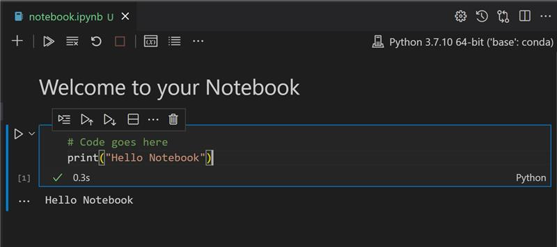

<!--
CO_OP_TRANSLATOR_METADATA:
{
  "original_hash": "6b1cb0e46d4c5b747eff6e3607642760",
  "translation_date": "2025-08-29T16:47:46+00:00",
  "source_file": "2-Regression/1-Tools/README.md",
  "language_code": "mr"
}
-->
# Python आणि Scikit-learn वापरून Regression Models सुरू करा


> स्केच नोट [Tomomi Imura](https://www.twitter.com/girlie_mac) यांनी तयार केले आहे

## [पूर्व-व्याख्यान क्विझ](https://gray-sand-07a10f403.1.azurestaticapps.net/quiz/9/)

> ### [हा धडा R मध्ये उपलब्ध आहे!](../../../../2-Regression/1-Tools/solution/R/lesson_1.html)

## परिचय

या चार धड्यांमध्ये, तुम्ही regression models कसे तयार करायचे ते शिकाल. हे मॉडेल्स कशासाठी वापरले जातात यावर लवकरच चर्चा करू. पण काहीही करण्यापूर्वी, प्रक्रिया सुरू करण्यासाठी योग्य साधने तुमच्याकडे आहेत याची खात्री करा!

या धड्यात, तुम्ही शिकाल:

- स्थानिक मशीन लर्निंग कार्यांसाठी तुमच्या संगणकाचे कॉन्फिगरेशन कसे करायचे.
- Jupyter notebooks कसे वापरायचे.
- Scikit-learn वापरणे, त्यात स्थापना समाविष्ट आहे.
- Linear regression हाताळणीच्या सरावासह एक्सप्लोर करणे.

## स्थापना आणि कॉन्फिगरेशन

[](https://youtu.be/-DfeD2k2Kj0 "मशीन लर्निंगसाठी सुरुवात - मशीन लर्निंग मॉडेल्स तयार करण्यासाठी तुमची साधने सेट करा")

> 🎥 वरील प्रतिमेवर क्लिक करा आणि तुमच्या संगणकासाठी ML कॉन्फिगरेशन कसे करायचे ते पाहा.

1. **Python स्थापित करा**. खात्री करा की [Python](https://www.python.org/downloads/) तुमच्या संगणकावर स्थापित आहे. तुम्ही डेटा सायन्स आणि मशीन लर्निंगसाठी Python वापरणार आहात. बहुतेक संगणक प्रणालींमध्ये आधीच Python स्थापित असते. काही वापरकर्त्यांसाठी सेटअप सुलभ करण्यासाठी उपयुक्त [Python Coding Packs](https://code.visualstudio.com/learn/educators/installers?WT.mc_id=academic-77952-leestott) देखील उपलब्ध आहेत.

   काही Python वापरांसाठी एका विशिष्ट आवृत्तीची आवश्यकता असते, तर इतरांसाठी वेगळी आवृत्ती लागते. यासाठी, [virtual environment](https://docs.python.org/3/library/venv.html) मध्ये काम करणे उपयुक्त ठरते.

2. **Visual Studio Code स्थापित करा**. खात्री करा की Visual Studio Code तुमच्या संगणकावर स्थापित आहे. [Visual Studio Code स्थापित करण्यासाठी](https://code.visualstudio.com/) या सूचनांचे अनुसरण करा. या कोर्समध्ये तुम्ही Visual Studio Code मध्ये Python वापरणार आहात, त्यामुळे Python विकासासाठी [Visual Studio Code कसे कॉन्फिगर करायचे](https://docs.microsoft.com/learn/modules/python-install-vscode?WT.mc_id=academic-77952-leestott) याबद्दल जाणून घ्या.

   > Python वापरण्यासाठी [Learn modules](https://docs.microsoft.com/users/jenlooper-2911/collections/mp1pagggd5qrq7?WT.mc_id=academic-77952-leestott) चा सराव करा.
   >
   > [](https://youtu.be/yyQM70vi7V8 "Visual Studio Code सह Python सेटअप करा")
   >
   > 🎥 वरील प्रतिमेवर क्लिक करा आणि VS Code मध्ये Python कसे वापरायचे ते पाहा.

3. **Scikit-learn स्थापित करा**, [या सूचनांचे अनुसरण करून](https://scikit-learn.org/stable/install.html). Python 3 वापरण्याची खात्री करण्यासाठी virtual environment वापरण्याची शिफारस केली जाते. जर तुम्ही M1 Mac वर हे लायब्ररी स्थापित करत असाल, तर वरील पृष्ठावर विशेष सूचना आहेत.

4. **Jupyter Notebook स्थापित करा**. तुम्हाला [Jupyter package](https://pypi.org/project/jupyter/) स्थापित करावे लागेल.

## तुमचे ML लेखन वातावरण

तुम्ही **notebooks** वापरून Python कोड विकसित कराल आणि मशीन लर्निंग मॉडेल्स तयार कराल. डेटा सायंटिस्ट्ससाठी हा एक सामान्य साधन प्रकार आहे, आणि त्यांना `.ipynb` या विस्ताराने ओळखले जाते.

Notebooks एक इंटरॅक्टिव्ह वातावरण आहे जेथे तुम्ही कोड लिहू शकता आणि त्याभोवती टिपा आणि दस्तऐवज जोडू शकता, जे प्रायोगिक किंवा संशोधन प्रकल्पांसाठी उपयुक्त ठरते.

[](https://youtu.be/7E-jC8FLA2E "मशीन लर्निंगसाठी सुरुवात - Regression Models तयार करण्यासाठी Jupyter Notebooks सेट करा")

> 🎥 वरील प्रतिमेवर क्लिक करा आणि या सरावासाठी Jupyter Notebooks कसे सेट करायचे ते पाहा.

### सराव - Notebook सह काम करा

या फोल्डरमध्ये, तुम्हाला _notebook.ipynb_ नावाची फाईल सापडेल.

1. _notebook.ipynb_ Visual Studio Code मध्ये उघडा.

   Jupyter server Python 3+ सह सुरू होईल. तुम्हाला notebook मध्ये `run` करण्यायोग्य कोड ब्लॉक्स सापडतील. कोड ब्लॉक चालवण्यासाठी प्ले बटणासारख्या चिन्हावर क्लिक करा.

2. `md` चिन्ह निवडा आणि markdown मध्ये **# Welcome to your notebook** हा मजकूर जोडा.

   त्यानंतर, काही Python कोड जोडा.

3. कोड ब्लॉकमध्ये **print('hello notebook')** टाइप करा.
4. कोड चालवण्यासाठी बाण निवडा.

   तुम्हाला प्रिंट केलेला मजकूर दिसेल:

    ```output
    hello notebook
    ```



तुम्ही तुमच्या कोडमध्ये टिप्पण्या जोडून notebook स्वतःच दस्तऐवजीकरण करू शकता.

✅ विचार करा की वेब डेव्हलपरचे कार्य वातावरण डेटा सायंटिस्टच्या कार्य वातावरणापेक्षा किती वेगळे आहे.

## Scikit-learn सह सुरुवात

आता Python तुमच्या स्थानिक वातावरणात सेट केले आहे, आणि तुम्ही Jupyter notebooks मध्ये आरामदायक आहात, चला Scikit-learn मध्येही तितकेच आरामदायक होऊया. Scikit-learn (याला `sci` म्हणतात, जसे `science`) ML कार्ये करण्यासाठी एक [विस्तृत API](https://scikit-learn.org/stable/modules/classes.html#api-ref) प्रदान करते.

त्यांच्या [वेबसाइटनुसार](https://scikit-learn.org/stable/getting_started.html), "Scikit-learn ही एक ओपन सोर्स मशीन लर्निंग लायब्ररी आहे जी supervised आणि unsupervised learning ला समर्थन देते. यामध्ये मॉडेल फिटिंग, डेटा प्रीप्रोसेसिंग, मॉडेल निवड आणि मूल्यांकन, आणि इतर अनेक उपयुक्तता साधने समाविष्ट आहेत."

या कोर्समध्ये, तुम्ही Scikit-learn आणि इतर साधने वापरून 'पारंपरिक मशीन लर्निंग' कार्ये कराल. आम्ही neural networks आणि deep learning टाळले आहे, कारण ते आमच्या आगामी 'AI for Beginners' अभ्यासक्रमात चांगल्या प्रकारे समाविष्ट केले जातील.

Scikit-learn मॉडेल्स तयार करणे आणि त्यांचे मूल्यांकन करणे सोपे करते. हे प्रामुख्याने संख्यात्मक डेटावर लक्ष केंद्रित करते आणि शिकण्यासाठी तयार केलेले datasets समाविष्ट करते. चला, Scikit-learn च्या काही मूलभूत डेटासह पहिला ML मॉडेल तयार करण्याची प्रक्रिया एक्सप्लोर करूया.

## सराव - तुमचा पहिला Scikit-learn notebook

> हा ट्युटोरियल Scikit-learn च्या [linear regression उदाहरणाने](https://scikit-learn.org/stable/auto_examples/linear_model/plot_ols.html#sphx-glr-auto-examples-linear-model-plot-ols-py) प्रेरित आहे.

[](https://youtu.be/2xkXL5EUpS0 "मशीन लर्निंगसाठी सुरुवात - Python मध्ये तुमचा पहिला Linear Regression प्रकल्प")

> 🎥 वरील प्रतिमेवर क्लिक करा आणि या सरावासाठी मार्गदर्शन पाहा.

_notebook.ipynb_ फाईलमधील सर्व सेल्स 'trash can' चिन्हावर क्लिक करून साफ करा.

या विभागात, तुम्ही Scikit-learn मध्ये शिकण्यासाठी तयार केलेल्या diabetes dataset सह काम कराल. कल्पना करा की तुम्हाला diabetic रुग्णांसाठी उपचार चाचणी करायची आहे. मशीन लर्निंग मॉडेल्स तुम्हाला कोणते रुग्ण उपचारांना चांगला प्रतिसाद देतील हे ठरवण्यासाठी मदत करू शकतात. अगदी मूलभूत regression मॉडेल देखील, जेव्हा व्हिज्युअलाइझ केले जाते, तेव्हा तुम्हाला clinical trials आयोजित करण्यासाठी उपयुक्त माहिती देऊ शकते.

✅ Regression पद्धतींच्या विविध प्रकारांबद्दल विचार करा. तुम्हाला एखाद्या व्यक्तीच्या वयावर आधारित उंचीचा अंदाज घ्यायचा असल्यास, तुम्ही linear regression वापराल, कारण तुम्ही **संख्यात्मक मूल्य** शोधत आहात. जर तुम्हाला एखाद्या प्रकारच्या खाद्यपदार्थाला vegan मानावे की नाही हे शोधायचे असेल, तर तुम्ही **category assignment** शोधत आहात, त्यामुळे logistic regression वापराल. Logistic regression बद्दल तुम्ही नंतर अधिक शिकाल. डेटा संबंधित काही प्रश्नांबद्दल विचार करा आणि कोणती पद्धत अधिक योग्य असेल हे ठरवा.

चला, या कार्याला सुरुवात करूया.

### लायब्ररी आयात करा

या कार्यासाठी आम्ही काही लायब्ररी आयात करू:

- **matplotlib**. हे एक उपयुक्त [ग्राफिंग साधन](https://matplotlib.org/) आहे आणि आम्ही याचा वापर line plot तयार करण्यासाठी करू.
- **numpy**. [numpy](https://numpy.org/doc/stable/user/whatisnumpy.html) ही Python मध्ये संख्यात्मक डेटा हाताळण्यासाठी उपयुक्त लायब्ररी आहे.
- **sklearn**. ही [Scikit-learn](https://scikit-learn.org/stable/user_guide.html) लायब्ररी आहे.

तुमच्या कार्यांसाठी काही लायब्ररी आयात करा.

1. खालील कोड टाइप करून आयात जोडा:

   ```python
   import matplotlib.pyplot as plt
   import numpy as np
   from sklearn import datasets, linear_model, model_selection
   ```

   वरील कोडमध्ये तुम्ही `matplotlib`, `numpy` आयात करत आहात आणि `sklearn` मधून `datasets`, `linear_model` आणि `model_selection` आयात करत आहात. `model_selection` डेटा प्रशिक्षण आणि चाचणी सेट्समध्ये विभाजित करण्यासाठी वापरले जाते.

### Diabetes dataset

Scikit-learn मध्ये तयार केलेल्या [diabetes dataset](https://scikit-learn.org/stable/datasets/toy_dataset.html#diabetes-dataset) मध्ये diabetes संबंधित 442 नमुने आहेत, ज्यामध्ये 10 वैशिष्ट्ये आहेत. त्यापैकी काही:

- age: वय वर्षांमध्ये
- bmi: बॉडी मास इंडेक्स
- bp: सरासरी रक्तदाब
- s1 tc: T-Cells (पांढऱ्या रक्त पेशींचा एक प्रकार)

✅ या dataset मध्ये 'sex' ही एक वैशिष्ट्य आहे, जी diabetes संशोधनासाठी महत्त्वाची मानली जाते. वैद्यकीय datasets मध्ये अशा प्रकारचे binary वर्गीकरण सामान्यतः समाविष्ट असते. अशा वर्गीकरणांमुळे लोकसंख्येच्या काही भागांना उपचारांपासून वगळले जाऊ शकते याबद्दल विचार करा.

आता X आणि y डेटा लोड करा.

> 🎓 लक्षात ठेवा, हे supervised learning आहे, आणि आपल्याला 'y' target आवश्यक आहे.

एका नवीन कोड सेलमध्ये, `load_diabetes()` कॉल करून diabetes dataset लोड करा. `return_X_y=True` इनपुटमुळे `X` डेटा मॅट्रिक्स असेल, आणि `y` regression target असेल.

1. डेटा मॅट्रिक्सचे आकार आणि त्याचा पहिला घटक दाखवण्यासाठी काही print कमांड जोडा:

    ```python
    X, y = datasets.load_diabetes(return_X_y=True)
    print(X.shape)
    print(X[0])
    ```

    तुम्हाला प्रतिसाद म्हणून tuple मिळत आहे. तुम्ही tuple मधील दोन पहिल्या मूल्ये अनुक्रमे `X` आणि `y` ला असाइन करत आहात. [tuples बद्दल अधिक जाणून घ्या](https://wikipedia.org/wiki/Tuple).

    तुम्ही पाहू शकता की या डेटामध्ये 442 आयटम्स आहेत, जे 10 घटकांच्या arrays मध्ये आहेत:

    ```text
    (442, 10)
    [ 0.03807591  0.05068012  0.06169621  0.02187235 -0.0442235  -0.03482076
    -0.04340085 -0.00259226  0.01990842 -0.01764613]
    ```

    ✅ डेटा आणि regression target यांच्यातील संबंधाबद्दल विचार करा. Linear regression feature X आणि target variable y यांच्यातील संबंधांचा अंदाज लावते. [diabetes dataset साठी target](https://scikit-learn.org/stable/datasets/toy_dataset.html#diabetes-dataset) शोधा. हा dataset काय दर्शवतो?

2. नंतर, या dataset चा एक भाग प्लॉट करण्यासाठी निवडा, dataset च्या तिसऱ्या कॉलमची निवड करा. `:` ऑपरेटर वापरून सर्व रांगा निवडा, आणि नंतर index (2) वापरून तिसरा कॉलम निवडा. डेटा 2D array मध्ये रूपांतरित करण्यासाठी `reshape(n_rows, n_columns)` वापरा. जर एक पॅरामीटर -1 असेल, तर संबंधित परिमाण आपोआप गणना केली जाते.

   ```python
   X = X[:, 2]
   X = X.reshape((-1,1))
   ```

   ✅ कोणत्याही वेळी, डेटा प्रिंट करून त्याचा आकार तपासा.

3. आता तुमच्याकडे प्लॉट करण्यासाठी डेटा तयार आहे, तुम्ही मशीनला या dataset मधील संख्यांमध्ये logical split ठरवण्यासाठी मदत करू शकता. यासाठी, तुम्हाला डेटा (X) आणि target (y) दोन्ही test आणि training sets मध्ये विभाजित करावे लागेल. Scikit-learn मध्ये हे सोपे आहे; तुम्ही तुमचा test डेटा दिलेल्या बिंदूवर विभाजित करू शकता.

   ```python
   X_train, X_test, y_train, y_test = model_selection.train_test_split(X, y, test_size=0.33)
   ```

4. आता तुमचे मॉडेल प्रशिक्षणासाठी तयार आहे! Linear regression मॉडेल लोड करा आणि `model.fit()` वापरून तुमच्या X आणि y training sets सह त्याचे प्रशिक्षण घ्या:

    ```python
    model = linear_model.LinearRegression()
    model.fit(X_train, y_train)
    ```

    ✅ `model.fit()` ही TensorFlow सारख्या अनेक ML लायब्ररींमध्ये दिसणारी function आहे.

5. नंतर, `predict()` function वापरून test डेटा वापरून एक prediction तयार करा. हे डेटा गटांमधील रेषा काढण्यासाठी वापरले जाईल.

    ```python
    y_pred = model.predict(X_test)
    ```

6. आता डेटा प्लॉटमध्ये दाखवण्याची वेळ आली आहे. Matplotlib हे यासाठी खूप उपयुक्त साधन आहे. सर्व X आणि y test डेटा scatterplot मध्ये तयार करा, आणि prediction वापरून डेटा गटांमधील योग्य ठिकाणी रेषा काढा.

    ```python
    plt.scatter(X_test, y_test,  color='black')
    plt.plot(X_test, y_pred, color='blue', linewidth=3)
    plt.xlabel('Scaled BMIs')
    plt.ylabel('Disease Progression')
    plt.title('A Graph Plot Showing Diabetes Progression Against BMI')
    plt.show()
    ```

   
✅ विचार करा की येथे नेमके काय चालले आहे. अनेक छोटे डेटा बिंदूंच्या माध्यमातून एक सरळ रेषा जात आहे, पण ती नेमके काय करत आहे? तुम्हाला दिसते का की तुम्ही या रेषेचा उपयोग करून नवीन, न पाहिलेला डेटा बिंदू प्लॉटच्या y अक्षाशी कसा संबंधित आहे हे अंदाज लावू शकता? या मॉडेलचा व्यावहारिक उपयोग शब्दांत मांडण्याचा प्रयत्न करा.

अभिनंदन, तुम्ही तुमचे पहिले रेषीय प्रतिगमन मॉडेल तयार केले, त्याचा उपयोग करून अंदाज तयार केला आणि ते प्लॉटमध्ये प्रदर्शित केले!

---
## 🚀चॅलेंज

या डेटासेटमधून वेगळा व्हेरिएबल प्लॉट करा. सूचना: ही ओळ संपादित करा: `X = X[:,2]`. या डेटासेटच्या लक्ष्यानुसार, तुम्ही मधुमेह या आजाराच्या प्रगतीबद्दल काय शोधू शकता?

## [पाठानंतरचा क्विझ](https://gray-sand-07a10f403.1.azurestaticapps.net/quiz/10/)

## पुनरावलोकन आणि स्व-अभ्यास

या ट्युटोरियलमध्ये, तुम्ही साध्या रेषीय प्रतिगमनासोबत काम केले, बहुविध किंवा एकच व्हेरिएबल असलेल्या प्रतिगमनाऐवजी. या पद्धतींमधील फरकांबद्दल थोडे वाचा किंवा [हा व्हिडिओ](https://www.coursera.org/lecture/quantifying-relationships-regression-models/linear-vs-nonlinear-categorical-variables-ai2Ef) पाहा.

प्रतिगमनाच्या संकल्पनेबद्दल अधिक वाचा आणि कोणत्या प्रकारचे प्रश्न या तंत्राद्वारे उत्तर दिले जाऊ शकतात याचा विचार करा. तुमचे ज्ञान वाढवण्यासाठी [हा ट्युटोरियल](https://docs.microsoft.com/learn/modules/train-evaluate-regression-models?WT.mc_id=academic-77952-leestott) घ्या.

## असाइनमेंट

[वेगळा डेटासेट](assignment.md)

---

**अस्वीकरण**:  
हा दस्तऐवज AI भाषांतर सेवा [Co-op Translator](https://github.com/Azure/co-op-translator) वापरून भाषांतरित करण्यात आला आहे. आम्ही अचूकतेसाठी प्रयत्नशील असलो तरी कृपया लक्षात ठेवा की स्वयंचलित भाषांतरांमध्ये त्रुटी किंवा अचूकतेचा अभाव असू शकतो. मूळ भाषेतील दस्तऐवज हा अधिकृत स्रोत मानावा. महत्त्वाच्या माहितीसाठी व्यावसायिक मानवी भाषांतराची शिफारस केली जाते. या भाषांतराचा वापर करून उद्भवलेल्या कोणत्याही गैरसमज किंवा चुकीच्या अर्थासाठी आम्ही जबाबदार राहणार नाही.