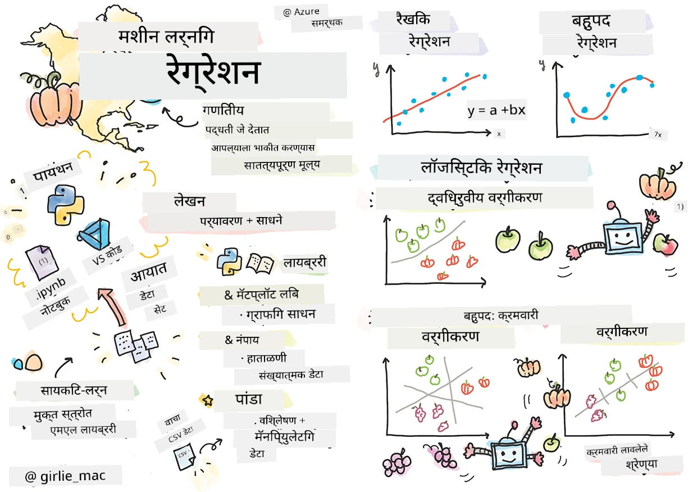
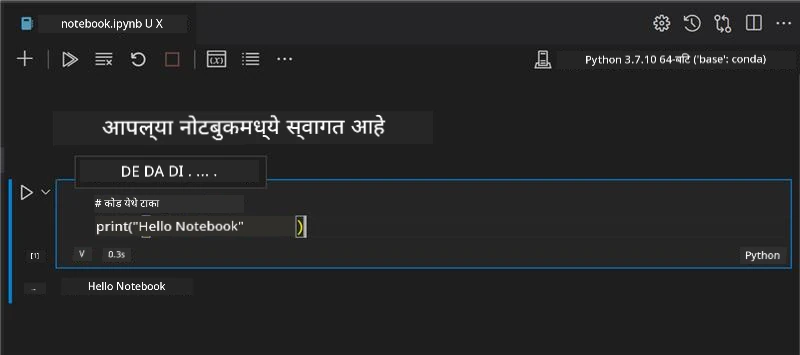
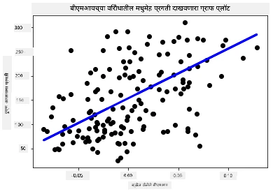

# पुनरावृत्ती मॉडेलसाठी Python आणि Scikit-learn सह सुरुवात करा



> स्केच नोट [Tomomi Imura](https://www.twitter.com/girlie_mac) यांचा

## [पूर्व-पाठ प्रश्नोत्तरी](https://ff-quizzes.netlify.app/en/ml/)

> ### [हा धडा R मध्ये उपलब्ध आहे!](../../../../2-Regression/1-Tools/solution/R/lesson_1.html)

## परिचय

या चार धड्यांमध्ये, आपण पुनरावृत्ती मॉडेल्स कसे तयार करायचे हे शोधणार आहात. आपण लवकरच या मॉडेल्ससाठी काय उपयोग होतो ते चर्चा करू. पण काहीही करण्यापूर्वी, खात्री करा की आपल्या जवळ योग्य साधने आहेत ज्यामुळे प्रक्रिया सुरू करता येईल!

या धड्यात, आपण शिकाल कसे:

- आपल्या संगणकाला स्थानिक मशीन लर्निंग कार्यांसाठी सेटअप करा.
- Jupyter नोटबुक्ससह काम करा.
- Scikit-learn वापरा, स्थापना समाविष्ट आहे.
- एक प्रत्यक्ष हाताळणीसह रेषीय पुनरावृत्तीचा अभ्यास करा.

## स्थापना आणि कॉन्फिगरेशन

[](https://youtu.be/-DfeD2k2Kj0 "ML प्रारंभिकांसाठी - तुमची साधने तयार करा")

> 🎥 ML साठी संगणक कॉन्फिगर करण्यासंबंधी थोडक व्हिडिओ पाहण्यासाठी वरील प्रतिमेवर क्लिक करा.

1. **Python स्थापित करा**. खात्री करा की [Python](https://www.python.org/downloads/) आपल्याला संगणकावर स्थापित आहे. आपण Python अनेक डेटा सायन्स आणि मशीन लर्निंग कार्यांसाठी वापरणार आहात. अनेक संगणकांमध्ये Python आधीपासूनच स्थापित असलेला असतो. काही वापरकर्त्यांसाठी सेटअप सुलभ करण्यासाठी उपयोगी [Python कोडिंग पॅक्स](https://code.visualstudio.com/learn/educators/installers?WT.mc_id=academic-77952-leestott) देखील उपलब्ध आहेत.

   काही Python चा वापर एका आवृत्तीमध्ये असतो, तर काही दुसऱ्या आवृत्तीची गरज असते. म्हणूनच, [वर्च्युअल एन्व्हायर्नमेंट](https://docs.python.org/3/library/venv.html) मध्ये काम करणे उपयोगी ठरते.

2. **Visual Studio Code स्थापित करा**. खात्री करा की आपल्याकडे Visual Studio Code स्थापित आहे. मूलभूत स्थापना करण्यासाठी [Visual Studio Code कसे स्थापित करायचे](https://code.visualstudio.com/) याचे निर्देश पाळा. आपण या कोर्समध्ये Visual Studio Code मध्ये Python वापरणार आहात, त्यामुळे Python विकासासाठी Visual Studio Code कसे कॉन्फिगर करायचे याचा आढावा घेणे अनिवार्य आहे. [Visual Studio Code कॉन्फिगरेशन](https://docs.microsoft.com/learn/modules/python-install-vscode?WT.mc_id=academic-77952-leestott) कसे करायचे ते पाहा.

   > Python सोबत आरामदायी होण्यासाठी या [Learn modules](https://docs.microsoft.com/users/jenlooper-2911/collections/mp1pagggd5qrq7?WT.mc_id=academic-77952-leestott) मध्ये काम करा.
   >
   > [](https://youtu.be/yyQM70vi7V8 "Visual Studio Code सह Python सेटअप करा")
   >
   > 🎥 VS Code मध्ये Python कसा वापरायचा याबाबत व्हिडिओ पाहण्यासाठी प्रतिमेवर क्लिक करा.

3. **Scikit-learn स्थापित करा**, [या सूचनांचे](https://scikit-learn.org/stable/install.html) पालन करून. आपण Python 3 वापरत असल्याची खात्री करावी लागते, म्हणून वर्च्युअल एन्व्हायर्नमेंट वापरण्याचा सल्ला दिला जातो. लक्षात घ्या की, आपल्याला हे M1 Mac वर स्थापित करायचे असल्यास, वर दिलेल्या लिंकवर खास सूचना उपलब्ध आहेत.

1. **Jupyter Notebook स्थापित करा**. आपण [Jupyter पॅकेज](https://pypi.org/project/jupyter/) स्थापित करणे आवश्यक आहे.

## आपले ML लेखन वातावरण

आपण Python कोड विकसित करण्यासाठी आणि मशीन लर्निंग मॉडेल्स तयार करण्यासाठी **नोटबुक्स** वापरणार आहात. अशा प्रकारचे फायली डेटा सायंटिस्टसाठी सामान्य साधन असून त्यांचा प्रत्यय `.ipynb` या प्रत्ययाने ओळखला जातो.

नोटबुक्स हे एक परस्परसंवादी वातावरण आहे जे विकासकाला कोड करण्यास आणि कोडबाबत नोट्स व दस्तऐवज लिहिण्यास अनुमती देते, जे अनुभवात्मक किंवा संशोधन-उन्मुख प्रकल्पांसाठी फारच उपयुक्त आहे.

[](https://youtu.be/7E-jC8FLA2E "ML प्रारंभिकांसाठी - पुनरावृत्ती मॉडेल तयार करण्यासाठी Jupyter नोटबुक सेट करा")

> 🎥 या व्यायामाद्वारे कार्यरत व्हिडिओ पाहण्यासाठी वरील प्रतिमेवर क्लिक करा.

### व्यायाम - नोटबुकसोबत काम करा

या फोल्डरमध्ये, आपण _notebook.ipynb_ फाइल पाहू शकता.

1. Visual Studio Code मध्ये _notebook.ipynb_ उघडा.

   Python 3+ सह Jupyter सर्व्हर सुरू होईल. नोटबुकमध्ये काही ठिकाणी कोड ब्लॉक्स `run` करता येतात. एखादा कोड ब्लॉक चालवायला, प्ले बटणासारखा असलेला आयकॉन निवडा.

1. `md` आयकॉन निवडा आणि थोडा Markdown आणि पुढील मजकूर **# Welcome to your notebook** जोडा.

   नंतर काही Python कोड जोडा.

1. कोड ब्लॉकमध्ये **print('hello notebook')** टाइप करा.
1. कोड चालविण्यासाठी बाण आयकॉन निवडा.

   तुम्हाला मुद्रित विधान दिसेल:

    ```output
    hello notebook
    ```



तुम्ही तुमचा कोड टिप्पणींसह एका नोटबुकमध्ये दस्तऐवजीकरणासाठी मिसळू शकता.

✅ एक मिनिट थांबा आणि विचार करा की वेब विकसकाचे कामाचे वातावरण आणि डेटा सायंटिस्टचे कामाचे वातावरण किती वेगळे आहे.

## Scikit-learn सह सुरू करा

आता Python आपल्या स्थानिक वातावरणामध्ये सेट झाला आहे आणि आपण Jupyter नोटबुक्ससह परिचित आहात, चला Scikit-learn (हे `sci` म्हणजे `science` सारखे उच्चारले जाते) ज्यासह समान परिचित होऊया. Scikit-learn तुम्हाला ML कार्य करण्यासाठी मोठ्या प्रमाणात API देतो.

त्यांच्या [वेबसाईट](https://scikit-learn.org/stable/getting_started.html) नुसार, "Scikit-learn हे एक मुक्त स्रोत मशीन लर्निंग लायब्ररी आहे जे सुपरवाइज्ड आणि अनसुपरवाइज्ड लर्निंग समर्थित करते. हे मॉडेल फिटिंग, डेटा पूर्वप्रक्रिया, मॉडेल निवड आणि मूल्यांकन यासाठी विविध साधने देते."

या कोर्समध्ये, आपण Scikit-learn आणि इतर साधने वापरून पारंपरिक मशीन लर्निंग कार्ये पार पाडणारे मशीन लर्निंग मॉडेल्स तयार करणार आहोत. आम्ही नेहमीच्या न्यूरल नेटवर्क्स आणि डीप लर्निंग टाळले आहे, ते आमच्या येत्या 'AI for Beginners' अभ्यासक्रमात चांगल्या प्रकारे समजावले जातील.

Scikit-learn मॉडेल तयार करणे आणि त्यांचे मूल्यांकन करणे सोपे करते. हा मुख्यतः संख्यात्मक डेटासाठी लक्ष केंद्रित करतो आणि शिकण्यासाठी अनेक तयार केलेले डेटासेट्स समाविष्ट करतो. यात पूर्व-निर्मित मॉडेल्सही आहेत, ज्याचा विद्यार्थी प्रयत्न करू शकतात. चला प्रीपॅकज्ड डेटा लोड करणे आणि स्थापत्याकार वापरून प्रथम ML मॉडेल तयार करण्याची प्रक्रिया पाहूया.

## व्यायाम - तुमचा पहिला Scikit-learn नोटबुक

> हा ट्युटोरियल Scikit-learn च्या [रेषीय पुनरावृत्ती उदाहरणावर](https://scikit-learn.org/stable/auto_examples/linear_model/plot_ols.html#sphx-glr-auto-examples-linear-model-plot-ols-py) आधारित आहे.


[](https://youtu.be/2xkXL5EUpS0 "ML प्रारंभिकांसाठी - तुमचा पहिला रेषीय पुनरावृत्ती प्रकल्प")

> 🎥 या व्यायामामुळे कार्यरत व्हिडिओ पाहण्यासाठी प्रतिमेवर क्लिक करा.

_notebook.ipynb_ फायलीमध्ये, या धड्याशी संलग्न असलेल्या सर्व सेल काढा 'trash can' आयकॉनवर क्लिक करून.

या विभागात, आपण Scikit-learn मध्ये शिकण्यासाठी तयार केलेल्या मध्यम आकाराच्या डायबिटीज डेटासेटसह काम करणार आहात. समजा तुम्हाला डायबिटीक रुग्णांसाठी उपचाराची चाचणी करायची आहे. मशीन लर्निंग मॉडेल तुम्हाला ठरवण्यास मदत करू शकतात की कोणते रुग्ण उपचारावर चांगले प्रतिसाद देतील, भिन्न चलांच्या संयोजनावरून. अगदी प्राथमिक पुनरावृत्ती मॉडेल, जे दृश्यात आणले आहे, ते चलांबद्दल अशी माहिती दाखवू शकते जी तुमच्या तात्विक नैदानिक चाचण्यांचे आयोजन करण्यास मदत करू शकते.

✅ पुनरावृत्तीच्या अनेक प्रकार आहेत, आणि आपल्याला कोणता वापरायचा हे तुम्ही शोधत असलेल्या उत्तरावर अवलंबून आहे. जर तुम्हाला एखाद्या वयाच्या व्यक्तीची संभाव्य उंची भविष्यवाणी करायची असेल, तर तुम्ही रेषीय पुनरावृत्ती वापराल कारण तुम्हाला **संख्यात्मक मूल्य** हवे आहे. जर तुम्हाला शोधायचे असेल की कुठल्या प्रकारच्या खाद्यपदार्थाचे वर्गीकरण व्हेगन म्हणून करायचे आहे का नाही, तर तुम्हाला **श्रेणी-नियुक्ती** पाहिजे असेल, म्हणून तुम्ही लॉजिस्टिक पुनरावृत्ती वापराल. लॉजिस्टिक पुनरावृत्तीबद्दल आपण पुढे शिकलो. डेटा विषयी तुम्ही विचार कराल असे काही प्रश्न आणि त्यासाठी कोणती पद्धत योग्य ठरेल हे थोडे विचार करा.

चला या कार्यावर सुरुवात करूया.

### लायब्ररी आयात करा

या कार्यासाठी आपण काही लायब्ररी आयात करू:

- **matplotlib**. हे एक उपयुक्त [ग्राफिंग साधन](https://matplotlib.org/) आहे आणि आपण याचा वापर रेषा प्लॉटसाठी करू.
- **numpy**. [numpy](https://numpy.org/doc/stable/user/whatisnumpy.html) हा Python मध्ये संख्यात्मक डेटाचा हाताळणीसाठी उपयुक्त लायब्ररी आहे.
- **sklearn**. ही [Scikit-learn](https://scikit-learn.org/stable/user_guide.html) लायब्ररी आहे.

तुमच्या कार्यांसाठी काही लायब्ररी आयात करा.

1. पुढील कोड टाइप करून आयात जोडा:

   ```python
   import matplotlib.pyplot as plt
   import numpy as np
   from sklearn import datasets, linear_model, model_selection
   ```

   वरील कोडमध्ये आपण `matplotlib`, `numpy` आयात करत आहात आणि `sklearn` मधून `datasets`, `linear_model` आणि `model_selection` आयात करत आहात. `model_selection` डेटा प्रशिक्षण आणि चाचणी संचात विभागण्यासाठी वापरला जातो.

### डायबिटीज डेटासेट

अंतर्भूत [diabetes dataset](https://scikit-learn.org/stable/datasets/toy_dataset.html#diabetes-dataset) मध्ये डायबिटीज संदर्भातील 442 नमुने आहेत, ज्यामध्ये 10 वैशिष्ट्य चल आहेत, ज्यात काही आहेत:

- age: वय वर्षांत
- bmi: शरीर द्रव्यमान निर्देशांक
- bp: सरासरी रक्तदाब
- s1 tc: टी-सेल्स (पांढऱ्या रक्तकणांचा प्रकार)

✅ या डेटासेटमध्ये 'sex' नावाचा एक वैशिष्ट्य चल आहे जो डायबिटीज संशोधनासाठी महत्त्वाचा आहे. अनेक वैद्यकीय डेटासेट्समध्ये अशा द्विअर्थ वर्गीकरणाचा समावेश असतो. असा विचार करा की अशा प्रकारच्या वर्गीकरणामुळे लोकसंख्येचा काही भाग उपचारापासून वगळला जाऊ शकतो.

आता X आणि y डेटा लोड करा.

> 🎓 लक्षात ठेवा, हे सुपरवाइज्ड लर्निंग आहे, आणि आम्हाला एका नाव असलेल्या 'y' टारगेटची गरज आहे.

एका नवीन कोड सेलमध्ये, `load_diabetes()` कॉल करून डायबिटीज डेटासेट लोड करा. इनपुट `return_X_y=True` सूचित करतो की `X` हा डेटाचा मॅट्रिक्स असेल आणि `y` पुर्नावृत्ती टारगेट असेल.

1. काही प्रिंट कमांडसाठी डेटा मॅट्रिक्सचा आकार आणि त्याचा पहिला घटक दाखवा:

    ```python
    X, y = datasets.load_diabetes(return_X_y=True)
    print(X.shape)
    print(X[0])
    ```

    तुमची मिळालेली प्रतिक्रिया एक ट्युपल आहे. तुम्ही ट्युपलच्या पहिल्या दोन मूल्यांना अनुक्रमे `X` आणि `y` शी जोडत आहात. अधिक जाणून घेण्यासाठी [ट्युपल बद्दल](https://wikipedia.org/wiki/Tuple) पहा.

    तुम्हाला दिसेल की या डेटामध्ये 442 नोंदी आहेत ज्या 10 घटकांच्या अॅरेमध्ये आहेत:

    ```text
    (442, 10)
    [ 0.03807591  0.05068012  0.06169621  0.02187235 -0.0442235  -0.03482076
    -0.04340085 -0.00259226  0.01990842 -0.01764613]
    ```

    ✅ डेटा आणि पुर्नावृत्ती टारगेट यामधील संबंधावर विचार करा. रेषीय पुनरावृत्ती वैशिष्ट्य X आणि टारगेट y यामधील संबंध भाकीत करते. डेटासेटच्या कागदपत्रीत [टारगेट](https://scikit-learn.org/stable/datasets/toy_dataset.html#diabetes-dataset) कोणता आहे ते पाहा? हा डेटासेट कोणत्या गोष्टीचे प्रदर्शन करतो?

2. नंतर, या डेटासेटचा एक भाग निवडा ज्यासाठी प्लॉट करायचा आहे, म्हणजे डेटासेटचा 3रा स्तंभ निवडा. तुम्ही `:` ऑपरेटर वापरून सर्व पंक्ती निवडू शकता, आणि नंतर 3रा स्तंभ (इंडेक्स 2) निवडू शकता. तुम्ही `reshape(n_rows, n_columns)` वापरून डेटा 2D अॅरेमध्ये देखील आणू शकता - प्लॉटिंगसाठी आवश्यक. जर एक पॅरामीटर -1 असेल, तर संबंधित परिमाण आपोआप गणना केले जाते.

   ```python
   X = X[:, 2]
   X = X.reshape((-1,1))
   ```

   ✅ कधीही डेटा तपासण्यासाठी त्याचा आकार प्रिंट करा.

3. आता डेटा प्लॉट करण्यास तयार असल्याने, पाहू या की मशीन या डेटासेटमधील संख्यांमध्ये तर्कशीर विभागणी ठरवू शकते का. यासाठी, तुम्हाला डेटा (X) आणि टारगेट (y) हे दोन्ही प्रशिक्षण आणि चाचणी संचात विभाजित करावे लागतील. Scikit-learn मध्ये हे करणे सोपे आहे; तुम्ही दिलेल्या बिंदूवर तुमचा चाचणी डेटा विभाजित करू शकता.

   ```python
   X_train, X_test, y_train, y_test = model_selection.train_test_split(X, y, test_size=0.33)
   ```

4. आता तुम्ही तुमचा मॉडेल प्रशिक्षित करण्यास तयार आहात! रेषीय पुनरावृत्ती मॉडेल लोड करा आणि `model.fit()` वापरून तुमचा X आणि y प्रशिक्षण संचाने प्रशिक्षित करा:

    ```python
    model = linear_model.LinearRegression()
    model.fit(X_train, y_train)
    ```

    ✅ `model.fit()` हे अनेक ML लायब्ररींमध्ये वापरले जाणारे फंक्शन आहे जसे TensorFlow मध्ये.

5. नंतर, चाचणी डेटा वापरून `predict()` फंक्शनने भाकीत तयार करा. हे मॉडेलच्या डेटागटांदरम्यान रेषा काढण्यासाठी वापरले जाईल.

    ```python
    y_pred = model.predict(X_test)
    ```

6. आता डेटा प्लॉटमध्ये दाखवण्याची वेळ आली आहे. matplotlib हे या कार्यासाठी फारच उपयुक्त साधन आहे. सर्व X आणि y चाचणी डेटाचा स्कॅटरप्लॉट तयार करा, आणि भाकीत वापरून मॉडेलच्या डेटागटांदरम्यान योग्य ठिकाणी रेषा काढा.

    ```python
    plt.scatter(X_test, y_test,  color='black')
    plt.plot(X_test, y_pred, color='blue', linewidth=3)
    plt.xlabel('Scaled BMIs')
    plt.ylabel('Disease Progression')
    plt.title('A Graph Plot Showing Diabetes Progression Against BMI')
    plt.show()
    ```

   


   ✅ येथे काय घडत आहे याबद्दल थोडं विचार करा. एक सरळ रेषा अनेक लहान डेटा बिंदूंमधून जात आहे, पण ती नेमकी काय करत आहे? तुम्हाला दिसतंय का की तुम्हाला या रेषेचा वापर करून नवीन, अद्याप न पाहिलेल्या डेटा पॉइंटला प्लॉटच्या y अक्षाच्या संदर्भात कुठे बसवायचं हे अंदाज लावता येईल? या मॉडेलच्या व्यावहारिक वापराबद्दल शब्दांमध्ये मांडण्याचा प्रयत्न करा.

अभिनंदन, तुम्ही तुमचा पहिला रेखीय प्रतिगमन मॉडेल तयार केला, त्याच्याशी भविष्यकाळी अंदाज लावला आणि तो प्लॉटमध्ये प्रदर्शित केला!

---
## 🚀आव्हान

या डेटासेटमधल्या वेगळ्या चलाचा प्लॉट करा. इशारा: हा ओळ संपादित करा: `X = X[:,2]`. या डेटासेटच्या लक्ष्याला पाहता, तुम्हाला मधुमेह या रोगाच्या प्रगतीबद्दल काय शोधायला मिळतं?
## [व्याख्यानानंतरचे प्रश्नसंच](https://ff-quizzes.netlify.app/en/ml/)

## पुनरावलोकन आणि स्वअध्ययन

या शिक्षणात, तुम्ही सोपा रेखीय प्रतिगमन वापरला आहे, एकक किंवा बहुविध रेखीय प्रतिगमन नव्हे. या पद्धतींच्या फरकांबद्दल थोडे वाचा, किंवा [हा व्हिडिओ](https://www.coursera.org/lecture/quantifying-relationships-regression-models/linear-vs-nonlinear-categorical-variables-ai2Ef) पाहा.

प्रतिगमन या संकल्पनेबद्दल अधिक माहिती वाचा आणि कोणत्या प्रकारच्या प्रश्नांना या तंत्राने उत्तर दिलं जाऊ शकतं हे विचार करा. तुमचं ज्ञान खोल करण्यासाठी हा [ट्युटोरियल](https://docs.microsoft.com/learn/modules/train-evaluate-regression-models?WT.mc_id=academic-77952-leestott) करा.

## कामगिरी

[वेगळा डेटासेट](assignment.md)

---

<!-- CO-OP TRANSLATOR DISCLAIMER START -->
**अस्वीकरण**:
हा दस्तऐवज AI भाषांतर सेवा [Co-op Translator](https://github.com/Azure/co-op-translator) चा वापर करून अनुवादित केला आहे. जरी आम्ही अचूकतेसाठी प्रयत्न करतो, तरी कृपया लक्षात घ्या की स्वयंचलित भाषांतरांमध्ये त्रुटी किंवा अचूकतेची कमतरता असू शकते. मूळ दस्तऐवज त्याच्या मूळ भाषेत अधिकृत स्रोत मानला पाहिजे. महत्त्वाची माहिती असल्यास, व्यावसायिक मानवी भाषांतराची शिफारस केली जाते. या भाषांतराच्या वापरामुळे उद्भवणाऱ्या कोणत्याही गैरसमज किंवा चुकीच्या अर्थलावणीसाठी आम्ही जबाबदार नाही.
<!-- CO-OP TRANSLATOR DISCLAIMER END -->