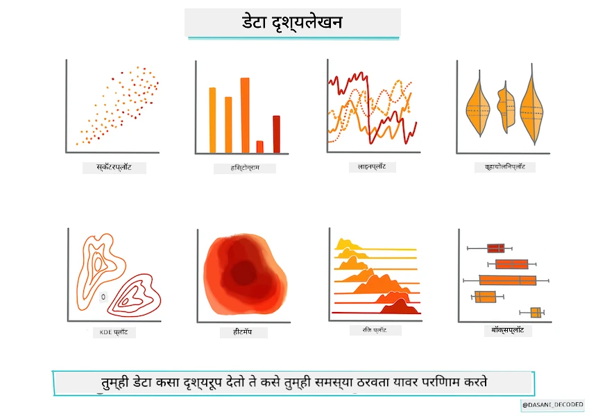
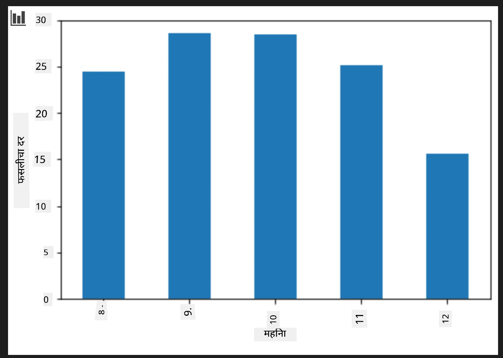
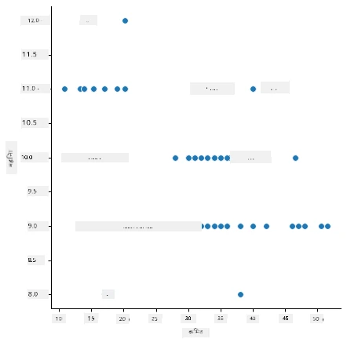
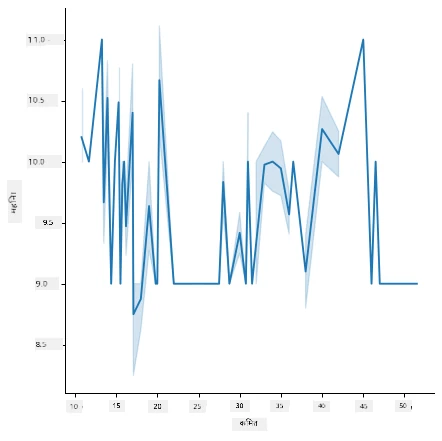
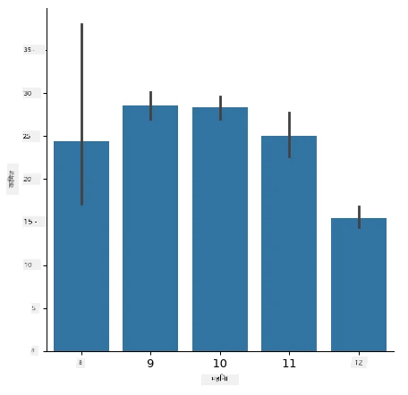
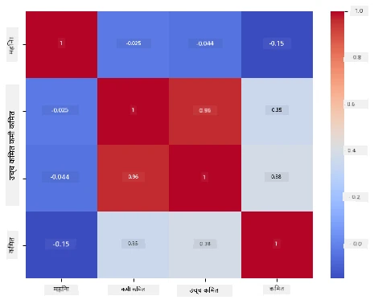

# Scikit-learn वापरून एक रिग्रेशन मॉडेल तयार करा: डेटा तयार करा आणि दृश्य रूपात सादर करा



इन्फोग्राफिक [दसानी मादीपल्ली](https://twitter.com/dasani_decoded) यांच्याकडून

## [पूर्व-व्याख्यान प्रश्नमंजुषा](https://ff-quizzes.netlify.app/en/ml/)

> ### [हा धडा R मध्ये उपलब्ध आहे!](../../../../2-Regression/2-Data/solution/R/lesson_2.html)

## प्रस्तावना

आता तुम्ही Scikit-learn सह मशीन लर्निंग मॉडेल बांधणीसाठी आवश्यक साधने सेटअप केलीत, त्यामुळे आता तुम्हाला तुमच्या डेटावर प्रश्न विचारण्यास तयार आहात. डेटा वापरताना आणि ML उपाय लागू करताना, योग्य प्रश्न कसे विचारायचे हे समजून घेणे फार आवश्यक आहे जेणेकरून तुमच्या डेटासेटच्या क्षमता योग्यरित्या उकलता येतील.

या धड्यामध्ये तुम्ही शिकाल:

- मॉडेल-बांधणीसाठी तुमचा डेटा कसा तयार करायचा.
- डेटा दृश्य रूपात सादर करण्यासाठी Matplotlib कसा वापरायचा.
- अधिक अभिव्यक्तीपूर्ण डेटा दृश्यासाठी Seaborn वापरण्यासाठी कसे.

## तुमच्या डेटावर योग्य प्रश्न विचारणे

जे प्रश्न तुम्हाला उत्तर हवे आहे ते ठरवेल तुम्ही कोणत्या प्रकारचे ML अल्गोरिदम वापराल. आणि मिळालेल्या उत्तराची गुणवत्ता तुमच्या डेटाच्या स्वरूपावर अवलंबून असेल.

या धड्यासाठी दिलेला [डेटा](https://github.com/microsoft/ML-For-Beginners/blob/main/2-Regression/data/US-pumpkins.csv) पहा. तुम्ही हा .csv फाइल VS Code मध्ये उघडू शकता. त्वरित पाहिल्यावर काही रिकाम्या जागा आणि स्ट्रिंग्ज व संख्यात्मक डेटाचा संगम दिसतो. 'Package' नावाचा एक विचित्र स्तंभही आहे ज्यामध्ये 'sacks', 'bins' आणि इतर मूल्यमिश्रण आहे. डेटा प्रत्यक्षात थोडा गोंधळलेला आहे.

[](https://youtu.be/5qGjczWTrDQ "ML for beginners - How to Analyze and Clean a Dataset")

> 🎥 या चित्रावर क्लिक करून या धड्यासाठी डेटा तयार करण्याचे एक लहान व्हिडिओ पाहा.

प्रत्यक्षात, पूर्णपणे वापरण्यास तयार असा डेटा सेट देणे फारसा सामान्य नाही. या धड्यात, तुम्ही पारंपरिक Python लायब्ररी वापरून कच्चा डेटा सेट कसा तयार करायचा ते शिकाल. तुम्हाला डेटा दृश्य सादर करण्याच्या विविध तंत्रांचीही ओळख होईल.

## केस स्टडी: 'द पंपकिन मार्केट'

या फोल्डरमध्ये 'data' रूट फोल्डरमध्ये [US-pumpkins.csv](https://github.com/microsoft/ML-For-Beginners/blob/main/2-Regression/data/US-pumpkins.csv) नावाची .csv फाइल आहे ज्यात शहरांनुसार गटबद्ध केलेल्या पंपकिन मार्केटचा 1757 ओळींचा डेटा आहे. हा डेटा संयुक्त राज्य कृषी विभागाद्वारे वितरित [Specialty Crops Terminal Markets Standard Reports](https://www.marketnews.usda.gov/mnp/fv-report-config-step1?type=termPrice) मधून काढलेला कच्चा डेटा आहे.

### डेटा तयार करणे

हा डेटा सार्वजनिक क्षेत्रातील आहे. तो USDA वेबसाईटवरून शहरानिहाय अनेक वेगळ्या फाइल्समध्ये डाउनलोड करता येऊ शकतो. जास्त फाइल टाळण्यासाठी, आम्ही सर्व शहरांचे डेटा एका स्प्रेडशीटमध्ये एकत्र केले आहेत, त्यामुळे डेटा थोडा तयार केलेला आहे. आता, डेटा आणखी जवळून पाहूया.

### पंपकिन डेटाबाबत प्राथमिक निष्कर्ष

या डेटाबद्दल तुम्हाला काय लक्षात येते? तुम्हाला आधीच दिसले की यात स्ट्रिंग्ज, संख्या, रिकाम्या जागा आणि विचित्र मूल्यांचा संगम आहे ज्यांना तुम्हाला अर्थ लावावा लागेल.

या डेटावर तुम्ही रिग्रेशन तंत्र वापरून कोणता प्रश्न विचारू शकता? "ठराविक महिन्यात विक्रीसाठी पंपकिनचा किंमत भाकीत करा" हा प्रश्न कसा राहील? पुन्हा डेटा पाहताना, या कामासाठी आवश्यक डेटा स्ट्रक्चर तयार करण्यासाठी काही बदल करावे लागतील.
## सराव - पंपकिन डेटा विश्लेषण करा

चला [Pandas](https://pandas.pydata.org/) वापरूया, (नाम `Python Data Analysis` प्रतीक) जो डेटा तयार करण्यासाठी उपयुक्त साधन आहे, आणि या पंपकिन डेटाचा विश्लेषण आणि तयारी करूया.

### प्रथम, हरवलेले तारखे तपासा

तुम्हाला प्रथम हरवलेल्या तारखा तपासण्याने सुरुवात करायची आहे:

1. तारखा महिन्याच्या स्वरूपात रूपांतरित करा (ही तारीखा US स्वरूपात आहेत, म्हणजे `MM/DD/YYYY`).
2. महिन्याला नवीन स्तंभात काढा.

_notebook.ipynb_ फाइल Visual Studio Code मध्ये उघडा आणि नवीन Pandas डेटा फ्रेममध्ये स्प्रेडशीट आयात करा.

1. `head()` फंक्शन वापरून सुरुवातीच्या पाच ओळी पहा.

    ```python
    import pandas as pd
    pumpkins = pd.read_csv('../data/US-pumpkins.csv')
    pumpkins.head()
    ```

    ✅ शेवटच्या पाच ओळी पाहण्यासाठी कोणता फंक्शन वापराल?

1. सध्या डेटाफ्रेममध्ये हरवलेला डेटा आहे का ते तपासा:

    ```python
    pumpkins.isnull().sum()
    ```

    हरवलेला डेटा आहे, पण कदाचित हा कार्यासाठी असा वाईट परिणाम होणार नाही.

1. तुमचा डेटाफ्रेम सोपा करण्यासाठी, तुम्हाला आवश्यक स्तंभ निवडा, `loc` फंक्शन वापरून जो मूळ डेटा फ्रेममधून रो (पहिल्या पॅरामीटर) आणि स्तंभ (दुसऱ्या पॅरामीटर) निवडतो. खालील `:` म्हणजे "सर्व रो".

    ```python
    columns_to_select = ['Package', 'Low Price', 'High Price', 'Date']
    pumpkins = pumpkins.loc[:, columns_to_select]
    ```

### दुसरे, पंपकिनची सरासरी किमत ठरवा

एका निश्चित महिन्यातील पंपकिनची सरासरी किंमत कशी ठरवाल? या कामासाठी कोणती स्तंभ काढाल? संकेत: तुम्हाला 3 स्तंभांची गरज आहे.

उत्तर: `Low Price` आणि `High Price` स्तंभांची सरासरी काढून नवीन `Price` स्तंभ भरा, आणि `Date` स्तंभ फक्त महिन्यासाठी रूपांतरित करा. वर दिलेल्या तपासणीनुसार, तारीख किंवा किमतीसाठी हरवलेला डेटा नाही.

1. सरासरी काढण्यासाठी पुढील कोड जोडा:

    ```python
    price = (pumpkins['Low Price'] + pumpkins['High Price']) / 2

    month = pd.DatetimeIndex(pumpkins['Date']).month

    ```

   ✅ `print(month)` वापरून तुम्हाला पाहिजे ते काहीही तपासण्यासाठी छापू शकता.

2. आता, तुमचा रूपांतरित डेटा एका नवीन Pandas डेटा फ्रेममध्ये कॉपी करा:

    ```python
    new_pumpkins = pd.DataFrame({'Month': month, 'Package': pumpkins['Package'], 'Low Price': pumpkins['Low Price'],'High Price': pumpkins['High Price'], 'Price': price})
    ```

    तुमचा डेटाफ्रेम छापल्यावर तुम्हाला एक स्वच्छ, नीटनेटका डेटासेट दिसेल ज्यावर तुम्ही तुमचा रिग्रेशन मॉडेल तयार करू शकता.

### पण थांबा! इथे काहीतरी विचित्र आहे

`Package` स्तंभ पहा, पंपकिन अनेक वेगवेगळ्या प्रकारांनी विकले जातात. काही '1 1/9 bushel' मोजमापात विकले जातात, काही '1/2 bushel' मध्ये, काही पंपकिनप्रमाणे, काही पाउंडप्रमाणे, आणि काही फरकलेल्या रुंदीच्या मोठ्या बॉक्समध्ये.

> पंपकिनचे वजन एकसारखे ठरवणे खूप कठीण वाटते

मूळ डेटामध्ये पाहिल्यास, 'Unit of Sale' जर 'EACH' किंवा 'PER BIN' असेल तर `Package` चा प्रकार प्रति इंच, प्रति बिन, किंवा 'each' असतो. पंपकिनचे वजन एका प्रकारे ठरवणे कठीण असल्याने, चल करा केवळ ज्या पंपकिनच्या `Package` स्तंभात 'bushel' आहे त्याचं फिल्टर करा.

1. फाइलच्या सुरुवातीला, .csv आयाताखाली फिल्टर जोडा:

    ```python
    pumpkins = pumpkins[pumpkins['Package'].str.contains('bushel', case=True, regex=True)]
    ```

    आता जर डेटा छापला तर एवढेच दिसेल की तुम्हाला 'bushel' च्या पंपकिनच्या अंदाजे 415 ओळींचा डेटा मिळतोय.

### पण थांबा! आणखी एक गोष्ट करायची आहे

लक्षात आलं का की bushel चे प्रमाण प्रत्येक रो वर वेगवेगळे आहे? तुम्हाला किमती बसलेली दाखवावी लागतील, म्हणून काही गणित करून त्यास मानकीकृत करा.

1. `new_pumpkins` डेटा फ्रेम तयार केल्यानंतर ही ओळी जोडा:

    ```python
    new_pumpkins.loc[new_pumpkins['Package'].str.contains('1 1/9'), 'Price'] = price/(1 + 1/9)

    new_pumpkins.loc[new_pumpkins['Package'].str.contains('1/2'), 'Price'] = price/(1/2)
    ```

✅ [The Spruce Eats](https://www.thespruceeats.com/how-much-is-a-bushel-1389308) नुसार, bushel चे वजन उत्पादनानुसार बदलते कारण ते प्रमाण मोजण्याचं एक वॉल्यूम मोजमाप आहे. "टमाटराचा बशेल साधारण 56 पौंडांचा असतो... परंतु पालेभाज्या जास्त जागा घ्यतात पण वजन कमी असल्यामुळे पालकाचा बशेल फक्त 20 पौंडांचा असतो." ही बाब सारखीच गुंतागुंतीची आहे! चल तर वजनाप्रमाणे रुपांतर करण्याची काळजी करू नका, फक्त बशेलमुळे किमती ठरवा. मात्र हे बशेलच्या पंपकिनचा अभ्यास दाखवतो की तुमच्या डेटाचा स्वभाव समजून घेणे किती आवश्यक आहे!

आता तुम्ही त्यांच्या बशेल मोजमापावर आधारित किंमतींचे विश्लेषण करू शकता. जर तुम्ही डेटा पुन्हा छापलात तर कसा मानकीकृत आहे ते दिसेल.

✅ लक्षात आलं का पंपकिन जे अर्ध्या बशेलने विकले जातात ते फार महाग आहेत? का असेल याचा विचार करा? संकेत: लहान पंपकिन मोठ्यांच्या तुलनेने खूप जास्त महाग असू शकतात कारण एका मोठ्या खोबणीदार पाई पंपकिनमुळे रिकाम्या जागा जास्त असते, त्यामुळे प्रति बशेल त्यांची संख्या जास्त असते.

## दृश्य रूपात सादरीकरणाच्या धोरणा

डेटा सायंटिस्टच्या भूमिकेचा एक भाग म्हणजे ते काम करत असलेल्या डेटाच्या गुणवत्तेचा आणि स्वरूपाचा दाखला देणे. हे साध्य करण्यासाठी, ते अनेकदा मनोरंजक दृश्य रूपात सादरीकरण, प्लॉट्स, ग्राफ्स, आणि चार्ट तयार करतात जे डेटा चे वेगवेगळे पैलू दाखवतात. अशा प्रकारे, ते दृश्यमानपणे अशा नात्यां आणि रिकाम्या जागा दाखवू शकतात ज्या इतरथा शोधणे कठीण असते.

[](https://youtu.be/SbUkxH6IJo0 "ML for beginners - How to Visualize Data with Matplotlib")

> 🎥 या चित्रावर क्लिक करून या धड्यासाठी डेटा दृश्य रूपात दाखवण्याचे एक लहान व्हिडिओ पाहा.

दृश्य रूपात सादरीकरणाने मशीन लर्निंग तंत्रासाठी योग्य पर्याय निश्चित करण्यासही मदत होते. जसे की, जर एक scatterplot रेषेला अनुसरते वाटत असेल तर डेटा linear regression करण्यासाठी योग्य असू शकतो.

Jupyter नोटबुकमध्ये काम करणारी एक डेटा दृश्य रूपात सादरीकरण लायब्ररी म्हणजे [Matplotlib](https://matplotlib.org/) (ज्याला तुम्ही मागील धड्यांतही पाहिलं आहे).

> डेटा दृश्य रूपात अधिक अनुभव मिळवण्यासाठी [हे ट्युटोरियल्स](https://docs.microsoft.com/learn/modules/explore-analyze-data-with-python?WT.mc_id=academic-77952-leestott) पाहा.

## सराव - Matplotlib सह प्रयोग करा

तुम्ही तयार केलेल्या नवीन डेटा फ्रेमसाठी काही मूलभूत प्लॉट तयार करण्याचा प्रयत्न करा. मूलभूत रेषीय प्लॉट काय दर्शवेल?

1. फाइलच्या वर Pandas आयाताखाली Matplotlib आयात करा:

    ```python
    import matplotlib.pyplot as plt
    ```

1. संपूर्ण नोटबुक पुन्हा चालवा.
1. नोटबुकच्या शेवटी डेटा बॉक्स प्लॉट म्हणून दाखवण्यासाठी सेल जोडा:

    ```python
    price = new_pumpkins.Price
    month = new_pumpkins.Month
    plt.scatter(price, month)
    plt.show()
    ```

    

    हा प्लॉट उपयुक्त आहे का? यात काही आश्चर्यकारक आहे का?

    हा फारसा उपयोगी नाही कारण तो केवळ तुमच्या डेटाला एका महिन्यात बिंदूंमध्ये दर्शवितो.

### याला उपयोगी बनवा

डेटा वापरून उपयोगी चार्ट दर्शवण्यासाठी तुम्हाला सहजपणे डेटा कसा गटबद्ध करायचा हे करावे लागते. चला, एक प्लॉट तयार करू जिथे y-अक्षावर महिने असतील आणि डेटा विक्षेप दाखवेल.

1. गटबद्ध बार चार्ट तयार करण्यासाठी सेल जोडा:

    ```python
    new_pumpkins.groupby(['Month'])['Price'].mean().plot(kind='bar')
    plt.ylabel("Pumpkin Price")
    ```

    

    हा अधिक उपयुक्त डेटा दृश्य रूपात सादरीकरण आहे! असे दिसते की पंपकिनसाठी सर्वोच्च किंमत सप्टेंबर आणि ऑक्टोबरमध्ये आहे. हे तुमच्या अपेक्षेशी सुसंगत आहे का? का किंवा का नाही?

## सराव - Seaborn सह प्रयोग करा

Matplotlib शक्तिशाली आहे, पण त्यासाठी बराच कोड लिहावा लागतो एक आकर्षक चार्ट तयार करण्यासाठी. [Seaborn](https://seaborn.pydata.org/) ही Matplotlib वर आधारित लायब्ररी आहे जी सांख्यिक डेटा दृश्यासाठी डिझाइन केलेली आहे. ती थेट Pandas डेटा फ्रेमसह काम करते, आकर्षक डीफॉल्ट स्टाइल लागू करते, आणि खूप कमी कोड वापरून माहितीपूर्ण प्लॉट तयार करू देते. Seaborn Matplotlib ऑब्जेक्ट्स परत करते म्हणून तुम्ही Matplotlib विषयी आधीच जाणणं वापरून निकाल बरोबर करू शकता.

> जर तुम्ही अजून Seaborn इंस्टॉल केला नसेल तर, `pip install seaborn` वापरून त्यास इंस्टॉल करा.

1. नोटबुकच्या वर इतर आयाताखाली Seaborn आयात करा. पारंपारिकरित्या तो `sns` नावाने आयात केला जातो:

    ```python
    import seaborn as sns
    ```

### नातेसंबंध दाखवण्यासाठी scatter plot

मॉडेल तयार करण्यापूर्वी डेटामध्ये नाते शोधणे महत्त्वाचे असते. [scatter plot](https://en.wikipedia.org/wiki/Scatter_plot) त्यासाठी उत्तम साधन आहे: जर बिंदू एखाद्या रेषेला अनुसरतात, तर दोन चल सहसंबंधित असू शकतात, जे linear regression साठी चांगली चिन्हे आहेत.

1. आधीच्या किमत-ते-महिना scatter plot पुन्हा Seaborn च्या [`relplot()`](https://seaborn.pydata.org/generated/seaborn.relplot.html) वापरून करा, जे थेट तुमच्या डेटा फ्रेम स्तंभांसह काम करतो:

    ```python
    sns.relplot(x="Price", y="Month", data=new_pumpkins)
    ```

    

    लक्षात घ्या कसे तुम्ही स्तंभांची नावे आणि डेटा फ्रेम पास करता, आणि Seaborn तुम्हाला अक्षांच्या लेबलांची काळजी घेतो.

2. तुम्ही `kind="line"` पास करून रेषीय प्लॉटमध्ये बदल करू शकता. Seaborn रेषेभोवती आत्मविश्वास अंतर दर्शवणारी सावलीपट्टी (shaded band) काढतो:

    ```python
    sns.relplot(x="Price", y="Month", kind="line", data=new_pumpkins)
    ```

    

    हा विशेष डेटा फार गोंधळलेला आहे, त्यामुळे रेषीय प्लॉट हा सर्वोत्तम पर्याय नाही — पण Seaborn मध्ये कसा सहज चार्ट प्रकार बदलायचा हे दाखवतो.

### वितरण दर्शवण्यासाठी बार चार्ट


पूर्वी तुम्ही मॅटप्लॉटलिबसह बार चार्ट तयार करण्यासाठी डेटा हाताने गटबद्ध केला होता. सिबॉर्नचा [`catplot()`](https://seaborn.pydata.org/generated/seaborn.catplot.html) (वर्गीकृत प्लॉट) तुमच्यासाठी गटबद्ध आणि एकत्रीकरण करू शकतो. डीफॉल्टने `kind="bar"` प्रत्येक श्रेणीचा सरासरी दर्शवतो आणि विश्वास अंतर दर्शविणारी काळी रेषाही दाखवतो.

1. प्रति महिन्याच्या सरासरी किमतीचा बार चार्ट तयार करा:

    ```python
    sns.catplot(x="Month", y="Price", data=new_pumpkins, kind="bar")
    ```

    

    हे मॅटप्लॉटलिबसह तुम्ही पाहिलेलं पुष्टी करतो — किमती सप्टेंबर आणि ऑक्टोबर मध्ये उच्च असतात — पण सिबॉर्न हे देखील दाखवतो की प्रत्येक महिन्यात किंमत किती _विविध_ असते.

### सहसंबंध दाखविण्यासाठी हीटमॅप

स्कॅटर प्लॉट एकावेळी दोन चलांची तुलना करतात. जेव्हा तुमच्याकडे अनेक संख्यात्मक स्तंभ असतात, तेव्हा [हीटमॅप](https://en.wikipedia.org/wiki/Heat_map) तुम्हाला एकाच वेळी _प्रत्येक_ स्तंभ जोड्यांमधील संबंधांची ताकद पाहायला देते. हा एक सामान्य मार्ग आहे ज्यामुळे तुम्ही एखाद्या मॉडेलमध्ये कोणती वैशिष्ट्ये वापरायची ते ठरवण्याआधी कोणती अधिक सहसंबंधीत आहेत हे शोधू शकता (आणि त्याच प्रकारचा चार्ट नंतर वर्गीकरणातील कॉन्फ्यूजन मॅट्रिसेस दाखविण्यासाठी वापरला जातो).

1. पांडससह सहसंबंध मॅट्रिक्स तयार करा, नंतर सिबॉर्नच्या [`heatmap()`](https://seaborn.pydata.org/generated/seaborn.heatmap.html) ने तो रेखाटाअ. `annot=True` पर्याय प्रत्येक सेलवर सहसंबंध मूल्ये छापतो:

    ```python
    correlations = new_pumpkins[['Month', 'Low Price', 'High Price', 'Price']].corr()
    sns.heatmap(correlations, annot=True, cmap="coolwarm")
    ```

    

    `1` (किंवा `-1`) जवळील मूल्ये दर्शवतात की स्तंभ _रेषीय_ प्रकारे मजबूत सहसंबंधीत आहेत. लक्षात घ्या की `Low Price` आणि `High Price` जवळजवळ पूर्णपणे सहसंबंधीत आहेत. दुसरीकडे, `Month` फक्त किंमतीशी एक कमकुवत रेषीय सहसंबंध दर्शवतो — जरी बार चार्टने सप्टेंबर आणि ऑक्टोबरमध्ये स्पष्ट हंगामी शिखर दाखवले असेल. हा एक महत्त्वाचा धडा आहे: सहसंबंध गुणांक केवळ _सरळ रेषेतील_ संबंध मोजतो, त्यामुळे तो हंगामी किंवा इतर प्रकारच्या अनरेषीय नमुन्यांना गमावू शकतो. ✅ स्तंभ निवडण्याआधी हीटमॅप *आणि* बार चार्टसारख्या चार्ट दोन्ही पाहणे का उपयुक्त आहे?

### मॅटप्लॉटलिब की सिबॉर्न?

दोन्ही लायब्ररी जाणून घेण्यासारख्या आहेत:

- **मॅटप्लॉटलिब** तुम्हाला चार्टमधील प्रत्येक घटकावर सूक्ष्म नियंत्रण देते आणि जवळजवळ प्रत्येक इतर Python प्लॉटिंग लायब्ररीसाठी पाया आहे.
- **सिबॉर्न** सांख्यिकीय चार्टसाठी उच्चस्तरीय फंक्शन्स आणि आकर्षक डीफॉल्ट्स देते, डायरेक्टली डेटाफ्रेम्ससोबत काम करते, आणि एक्सप्लोरेटरी डेटा अ‍ॅनालिसीसाठी अनेकदा वेगवान आहे.

सामान्य कामकाज म्हणजे जलद डेटा एक्सप्लोरेशनसाठी सिबॉर्न वापरणे, आणि नंतर तपशील सानुकूलित करण्यासाठी मॅटप्लॉटलिब वापरणे.

---

## 🚀आव्हान

मॅटप्लॉटलिब आणि सिबॉर्न जे विविध प्रकारचे व्हिज्युअलायझेशन ऑफर करतात ते एक्सप्लोर करा. रिग्रेशन समस्यांसाठी कोणते प्रकार सर्वोत्तम आहेत?

## [पोस्ट-लेक्चर क्विझ](https://ff-quizzes.netlify.app/en/ml/)

## पुनरावलोकन आणि स्वअध्ययन

डेटा व्हिज्युअलायझ करण्याचे अनेक मार्ग पहा. उपलब्ध विविध लायब्ररींची यादी तयार करा आणि नमूद करा की कोणती विशिष्ट कार्यांसाठी सर्वोत्तम आहे, उदाहरणार्थ 2D व्हिज्युअलायझेशन विरुद्ध 3D व्हिज्युअलायझेशन. तुम्हाला काय आढळते?

## असाइनमेंट

[व्हिज्युअलायझेशन एक्सप्लोर करणे](assignment.md)

---

<!-- CO-OP TRANSLATOR DISCLAIMER START -->
**अस्वीकरण**:
हा दस्तऐवज AI भाषांतर सेवा [Co-op Translator](https://github.com/Azure/co-op-translator) चा वापर करून अनुवादित केला आहे. जरी आम्ही अचूकतेसाठी प्रयत्न करतो, तरी कृपया लक्षात घ्या की स्वयंचलित भाषांतरांमध्ये त्रुटी किंवा अचूकतेची कमतरता असू शकते. मूळ दस्तऐवज त्याच्या मूळ भाषेत अधिकृत स्रोत मानला पाहिजे. महत्त्वाची माहिती असल्यास, व्यावसायिक मानवी भाषांतराची शिफारस केली जाते. या भाषांतराच्या वापरामुळे उद्भवणाऱ्या कोणत्याही गैरसमज किंवा चुकीच्या अर्थलावणीसाठी आम्ही जबाबदार नाही.
<!-- CO-OP TRANSLATOR DISCLAIMER END -->